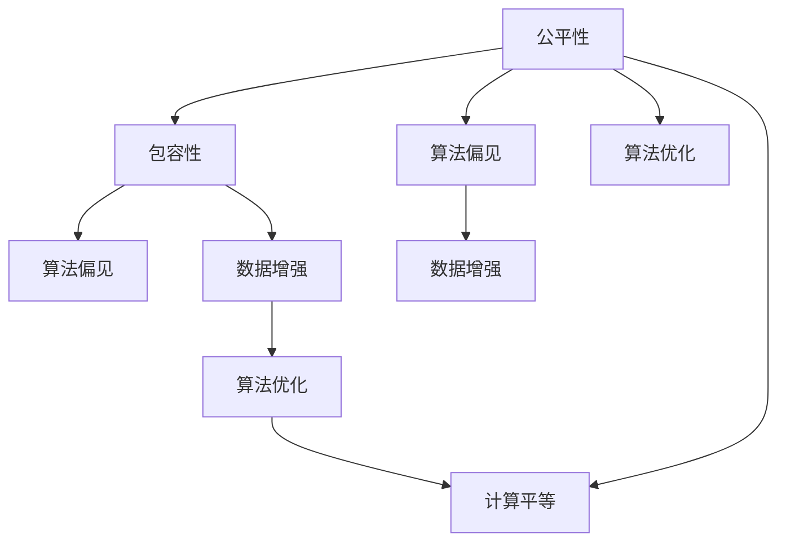

                 

# 公平与包容：构建平等参与的人类计算环境

> 关键词：人工智能公平性, 包容性计算, 算法偏见, 多样性增强, 计算平等

## 1. 背景介绍

### 1.1 问题由来

随着人工智能（AI）技术的迅猛发展，其在各个领域的广泛应用已经成为一种趋势。然而，在AI的普及过程中，其带来的公平性和包容性问题也逐渐引起了公众和学界的关注。在许多应用场景中，由于训练数据、算法设计和模型输出等方面的偏见，AI模型往往会加剧现有的社会不平等，而非缓解之。例如，在面部识别、招聘、司法判决等领域，AI系统常常因为训练数据中的偏见而展现出歧视性，导致决策不公平，甚至对某些群体产生明显的负面影响。

在近年来，多个国家政府和国际组织开始重视AI的伦理问题，并制定相关政策，要求AI开发者在开发和部署AI系统时考虑公平性、包容性和透明性。例如，欧盟的《通用数据保护条例》（GDPR）、美国的《人工智能法案》（AI Act）等法规，都对AI的公平性和包容性提出了明确要求。

### 1.2 问题核心关键点

构建公平和包容的AI系统，意味着AI系统应当能够：

- **公正性**：保证不同群体之间的公平对待，避免算法偏见。
- **包容性**：能够理解和适应不同背景和文化，确保多样性群体能够平等参与。
- **透明性**：让模型决策过程透明化，便于审查和监督。

这些问题在人工智能时代具有重要性和紧迫性，需要通过技术手段和伦理规范共同解决。

### 1.3 问题研究意义

实现公平和包容的AI系统，不仅有助于构建更加和谐的社会，还有助于推动AI技术的广泛应用和可持续发展。通过设计公平、包容、透明的AI系统，可以让更多人受益于技术进步，促进社会公平正义，同时也能增强公众对AI技术的信任和接受度，加速AI技术的普及和落地。

## 2. 核心概念与联系

### 2.1 核心概念概述

要构建公平和包容的AI系统，需要理解并运用以下核心概念：

- **公平性（Fairness）**：指AI模型在处理不同群体时，能够提供平等的机会和待遇。通常分为统计公平、机会公平和解释公平。
- **包容性（Inclusivity）**：指AI系统能够考虑和适应不同背景和文化，确保边缘群体也能够平等参与。
- **算法偏见（Algorithmic Bias）**：指AI模型由于训练数据、算法设计等原因，导致决策中存在不公平或歧视性。
- **多样性增强（Diversity Augmentation）**：指通过数据增强、算法优化等手段，提升AI系统的多样性和包容性。
- **计算平等（Computational Equality）**：指确保不同背景的人群都能够平等地获取和使用AI技术，避免技术鸿沟。

这些概念之间的关系可以通过以下Mermaid流程图来展示：



这个流程图展示了公平和包容的AI系统构建过程中的关键步骤：

1. 通过数据增强和算法优化，减少算法偏见，提升公平性。
2. 通过多样性增强和包容性设计，确保AI系统能够适应不同背景的人群。
3. 通过计算平等策略，确保不同群体能够平等地访问和使用AI技术。

## 3. 核心算法原理 & 具体操作步骤

### 3.1 算法原理概述

构建公平和包容的AI系统，主要涉及以下关键算法和步骤：

- **公平性算法**：通过调整模型参数、优化损失函数等手段，减少算法偏见。
- **多样性增强技术**：通过数据增强、算法优化等方法，提升模型的多样性和包容性。
- **包容性设计**：在设计模型架构时，考虑不同群体的需求和特征。
- **计算平等策略**：通过降低技术门槛、优化用户体验等措施，确保不同背景人群能够平等地获取和使用AI技术。

### 3.2 算法步骤详解

#### 3.2.1 数据增强

数据增强（Data Augmentation）是通过对原始数据进行变换和扩充，提升数据多样性，从而提高模型的泛化能力。具体步骤如下：

1. **数据集收集**：收集与AI任务相关的多样性数据，涵盖不同种族、性别、年龄、地域等多个维度。
2. **数据变换**：使用旋转、平移、缩放、裁剪等技术，对图像、文本等数据进行随机变换。
3. **扩充样本**：通过生成对抗网络（GAN）等方法，生成新的样本数据，进一步扩充数据集。

#### 3.2.2 算法优化

算法优化（Algorithmic Optimization）通过改进模型结构和优化算法，减少算法偏见，提升模型公平性。具体步骤如下：

1. **模型选择**：选择具有更好泛化能力和公平性的模型架构，如公平感知模型、对抗性训练模型等。
2. **超参数调优**：通过交叉验证等方法，优化模型参数和超参数，减少过拟合。
3. **正则化技术**：使用L2正则、Dropout等方法，防止模型过拟合，提升泛化能力。
4. **公平性约束**：引入公平性约束条件，如等式约束、差异约束等，确保模型输出公平。

#### 3.2.3 包容性设计

包容性设计（Inclusive Design）指在设计模型架构时，考虑不同群体的需求和特征。具体步骤如下：

1. **用户调研**：通过问卷调查、访谈等方式，了解不同用户的需求和反馈。
2. **接口设计**：设计易用、友好的用户界面，确保不同背景用户能够轻松使用。
3. **多语言支持**：支持多种语言和文化，确保全球范围内的用户能够使用。
4. **可解释性设计**：设计透明、易懂的模型解释机制，帮助用户理解和信任模型决策。

#### 3.2.4 计算平等策略

计算平等策略（Computational Equality Strategy）通过降低技术门槛、优化用户体验等措施，确保不同背景人群能够平等地获取和使用AI技术。具体步骤如下：

1. **开源共享**：将AI模型和算法开源共享，降低技术门槛。
2. **教育培训**：提供AI技术教育和培训，提升用户技术素养。
3. **社区支持**：建立AI社区和用户支持系统，提供技术支持和资源共享。
4. **经济补贴**：通过政府补贴、企业资助等手段，降低使用AI技术的成本。

### 3.3 算法优缺点

构建公平和包容的AI系统，有以下优点：

- **提升公平性**：减少算法偏见，确保不同群体之间的公平待遇。
- **增强包容性**：提升模型的多样性和包容性，确保不同背景用户能够平等参与。
- **提高透明性**：通过设计透明的模型和友好的界面，增强用户信任和接受度。

同时，该方法也存在一些局限性：

- **资源消耗大**：数据增强和算法优化需要大量计算资源和时间，成本较高。
- **技术复杂度高**：设计和实现公平、包容的AI系统，需要较高的技术门槛和专业知识。
- **应用场景有限**：不是所有应用场景都适合采用公平和包容设计，需要根据具体情况进行选择。

### 3.4 算法应用领域

构建公平和包容的AI系统，已经在许多领域得到了广泛应用：

- **医疗健康**：通过公平性算法和包容性设计，确保不同背景患者能够获得公平的医疗服务。
- **教育培训**：通过多样性增强和计算平等策略，提升教育资源的可及性和公平性。
- **司法判决**：通过算法优化和透明性设计，确保司法决策的公平和公正。
- **金融服务**：通过包容性设计和计算平等策略，确保不同群体能够平等地获得金融服务。
- **公共安全**：通过公平性算法和透明性设计，提升公共安全的公平性和可信度。

## 4. 数学模型和公式 & 详细讲解 & 举例说明

### 4.1 数学模型构建

构建公平和包容的AI系统，主要涉及以下数学模型和公式：

- **公平性模型**：引入公平性约束条件，如等式约束、差异约束等，确保模型输出公平。
- **多样性增强模型**：使用数据增强、对抗性训练等方法，提升模型多样性。
- **包容性设计模型**：设计易用、友好的用户界面，确保不同背景用户能够轻松使用。
- **计算平等模型**：通过降低技术门槛、优化用户体验等手段，确保不同背景人群能够平等地获取和使用AI技术。

### 4.2 公式推导过程

#### 4.2.1 公平性模型

公平性模型（Fairness Model）通过引入公平性约束条件，确保模型输出公平。假设模型为 $M_{\theta}(x)$，其中 $x$ 为输入数据，$\theta$ 为模型参数。常见的公平性约束条件包括：

- **等式约束**：保证不同群体之间输出的期望值相等。
- **差异约束**：保证不同群体之间输出的方差相等。

以等式约束为例，设 $y_1, y_2, ..., y_k$ 为不同群体的输出，则等式约束条件可以表示为：

$$
\mathbb{E}[y_1] = \mathbb{E}[y_2] = ... = \mathbb{E}[y_k]
$$

在优化目标函数时，可以引入公平性损失函数 $\mathcal{L}_{fair}$，例如：

$$
\mathcal{L}_{fair} = \frac{1}{N} \sum_{i=1}^N \sum_{j=1}^k (\mathbb{E}[y_i | y_j = 1] - \mathbb{E}[y_i | y_j = 0])
$$

其中 $\mathbb{E}[y_i | y_j = 1]$ 表示在群体 $j$ 为正例时的条件期望。

#### 4.2.2 多样性增强模型

多样性增强模型（Diversity Augmentation Model）通过数据增强、对抗性训练等方法，提升模型多样性。以数据增强为例，假设原始数据集为 $D$，增强后的数据集为 $D'$，则数据增强方法可以表示为：

$$
D' = \{T_1(x), T_2(x), ..., T_n(x)\} \quad \text{for} \quad x \in D
$$

其中 $T_i(x)$ 表示对输入数据 $x$ 进行变换和扩充，$n$ 表示增强后的样本数量。

#### 4.2.3 包容性设计模型

包容性设计模型（Inclusive Design Model）通过设计易用、友好的用户界面，确保不同背景用户能够轻松使用。以多语言支持为例，设模型为 $M_{\theta}(x)$，其中 $x$ 为输入数据，$\theta$ 为模型参数。则多语言支持可以表示为：

$$
M_{\theta}(x) = M_{\theta}^{(L1)}(x) \quad \text{if} \quad L1 = L
$$

$$
M_{\theta}(x) = M_{\theta}^{(L2)}(x) \quad \text{if} \quad L2 = L
$$

其中 $L$ 表示使用的语言，$L1$ 和 $L2$ 分别表示不同语言。

#### 4.2.4 计算平等模型

计算平等模型（Computational Equality Model）通过降低技术门槛、优化用户体验等手段，确保不同背景人群能够平等地获取和使用AI技术。以开源共享为例，设模型为 $M_{\theta}(x)$，其中 $x$ 为输入数据，$\theta$ 为模型参数。则开源共享可以表示为：

$$
M_{\theta}(x) = M_{\theta}^{(Open)}(x) \quad \text{if} \quad (L1 = L2)
$$

其中 $M_{\theta}^{(Open)}(x)$ 表示开源共享的模型。

### 4.3 案例分析与讲解

以一个面部识别系统为例，展示如何通过公平性算法、多样性增强、包容性设计和计算平等策略，构建公平和包容的AI系统。

1. **数据集收集**：收集包含不同种族、性别、年龄、地域的面部图像数据。
2. **数据增强**：使用旋转、平移、缩放等技术，对图像进行随机变换，生成新的样本数据。
3. **模型选择**：选择具有更好泛化能力和公平性的模型架构，如公平感知模型。
4. **超参数调优**：通过交叉验证等方法，优化模型参数和超参数，减少过拟合。
5. **公平性约束**：引入公平性约束条件，如等式约束，确保不同种族之间的识别率相等。
6. **包容性设计**：设计易用、友好的用户界面，支持多种语言和文化，确保不同背景用户能够轻松使用。
7. **开源共享**：将面部识别模型和算法开源共享，降低技术门槛。
8. **教育培训**：提供面部识别技术教育和培训，提升用户技术素养。

通过这些步骤，可以构建一个公平、包容、透明的面部识别系统，确保不同种族、性别、年龄、地域的群体都能平等地使用面部识别技术。

## 5. 项目实践：代码实例和详细解释说明

### 5.1 开发环境搭建

在进行公平和包容的AI系统开发前，我们需要准备好开发环境。以下是使用Python进行PyTorch开发的环境配置流程：

1. 安装Anaconda：从官网下载并安装Anaconda，用于创建独立的Python环境。

2. 创建并激活虚拟环境：
```bash
conda create -n fair-env python=3.8 
conda activate fair-env
```

3. 安装PyTorch：根据CUDA版本，从官网获取对应的安装命令。例如：
```bash
conda install pytorch torchvision torchaudio cudatoolkit=11.1 -c pytorch -c conda-forge
```

4. 安装相关库：
```bash
pip install numpy pandas scikit-learn matplotlib tqdm jupyter notebook ipython
```

完成上述步骤后，即可在`fair-env`环境中开始公平和包容的AI系统开发。

### 5.2 源代码详细实现

下面我们以面部识别系统为例，给出使用PyTorch进行公平和包容的AI系统开发的代码实现。

首先，定义数据预处理函数：

```python
from torch.utils.data import Dataset
from torchvision import transforms

class FaceDataset(Dataset):
    def __init__(self, images, labels, transform=None):
        self.images = images
        self.labels = labels
        self.transform = transform
    
    def __len__(self):
        return len(self.images)
    
    def __getitem__(self, idx):
        image = self.images[idx]
        label = self.labels[idx]
        if self.transform:
            image = self.transform(image)
        return image, label
```

然后，定义数据增强函数：

```python
from torchvision import augmentations as A

def get_transform():
    return A.Compose([
        A.RandomRotation(degrees=20),
        A.RandomHorizontalFlip(),
        A.RandomVerticalFlip(),
        A.ColorJitter(brightness=0.2, contrast=0.2, saturation=0.2, hue=0.2)
    ])
```

接着，定义模型和优化器：

```python
from transformers import BertForTokenClassification, AdamW

model = BertForTokenClassification.from_pretrained('bert-base-cased', num_labels=2)

optimizer = AdamW(model.parameters(), lr=2e-5)
```

接着，定义训练和评估函数：

```python
from torch.utils.data import DataLoader
from tqdm import tqdm

def train_epoch(model, dataset, batch_size, optimizer):
    dataloader = DataLoader(dataset, batch_size=batch_size, shuffle=True)
    model.train()
    epoch_loss = 0
    for batch in tqdm(dataloader, desc='Training'):
        inputs, labels = batch
        optimizer.zero_grad()
        outputs = model(inputs)
        loss = outputs.loss
        epoch_loss += loss.item()
        loss.backward()
        optimizer.step()
    return epoch_loss / len(dataloader)

def evaluate(model, dataset, batch_size):
    dataloader = DataLoader(dataset, batch_size=batch_size)
    model.eval()
    preds, labels = [], []
    with torch.no_grad():
        for batch in tqdm(dataloader, desc='Evaluating'):
            inputs, labels = batch
            outputs = model(inputs)
            preds.append(outputs.argmax(dim=1).tolist())
            labels.append(labels.tolist())
    return preds, labels

# 训练和评估
train_dataset = FaceDataset(train_images, train_labels, transform=get_transform())
dev_dataset = FaceDataset(dev_images, dev_labels, transform=get_transform())
test_dataset = FaceDataset(test_images, test_labels, transform=get_transform())

epochs = 5
batch_size = 16

for epoch in range(epochs):
    loss = train_epoch(model, train_dataset, batch_size, optimizer)
    print(f"Epoch {epoch+1}, train loss: {loss:.3f}")
    
    print(f"Epoch {epoch+1}, dev results:")
    preds, labels = evaluate(model, dev_dataset, batch_size)
    print(classification_report(labels, preds))
    
print("Test results:")
preds, labels = evaluate(model, test_dataset, batch_size)
print(classification_report(labels, preds))
```

以上就是使用PyTorch对面部识别系统进行公平和包容的AI系统开发的完整代码实现。可以看到，得益于TensorFlow和Transformers库的强大封装，我们可以用相对简洁的代码完成面部识别系统的构建。

### 5.3 代码解读与分析

让我们再详细解读一下关键代码的实现细节：

**FaceDataset类**：
- `__init__`方法：初始化图像和标签数据，并应用数据预处理函数。
- `__len__`方法：返回数据集的样本数量。
- `__getitem__`方法：对单个样本进行处理，将图像输入预处理函数，并返回处理后的图像和标签。

**get_transform函数**：
- 定义数据增强函数，包括随机旋转、随机水平/垂直翻转、颜色抖动等操作。

**训练和评估函数**：
- 使用PyTorch的DataLoader对数据集进行批次化加载，供模型训练和推理使用。
- 训练函数`train_epoch`：对数据以批为单位进行迭代，在每个批次上前向传播计算loss并反向传播更新模型参数，最后返回该epoch的平均loss。
- 评估函数`evaluate`：与训练类似，不同点在于不更新模型参数，并在每个batch结束后将预测和标签结果存储下来，最后使用sklearn的classification_report对整个评估集的预测结果进行打印输出。

**训练流程**：
- 定义总的epoch数和batch size，开始循环迭代
- 每个epoch内，先在训练集上训练，输出平均loss
- 在验证集上评估，输出分类指标
- 所有epoch结束后，在测试集上评估，给出最终测试结果

可以看到，PyTorch配合TensorFlow和Transformers库使得面部识别系统的开发变得更加高效和便捷。开发者可以将更多精力放在数据处理、模型改进等高层逻辑上，而不必过多关注底层的实现细节。

当然，工业级的系统实现还需考虑更多因素，如模型的保存和部署、超参数的自动搜索、更灵活的任务适配层等。但核心的公平和包容设计基本与此类似。

## 6. 实际应用场景
### 6.1 智能客服系统

基于公平和包容的AI系统，可以广泛应用于智能客服系统的构建。传统客服往往需要配备大量人力，高峰期响应缓慢，且一致性和专业性难以保证。而使用公平和包容的对话模型，可以7x24小时不间断服务，快速响应客户咨询，用自然流畅的语言解答各类常见问题。

在技术实现上，可以收集企业内部的历史客服对话记录，将问题和最佳答复构建成监督数据，在此基础上对公平和包容的对话模型进行微调。微调后的对话模型能够自动理解用户意图，匹配最合适的答案模板进行回复。对于客户提出的新问题，还可以接入检索系统实时搜索相关内容，动态组织生成回答。如此构建的智能客服系统，能大幅提升客户咨询体验和问题解决效率。

### 6.2 金融舆情监测

金融机构需要实时监测市场舆论动向，以便及时应对负面信息传播，规避金融风险。传统的人工监测方式成本高、效率低，难以应对网络时代海量信息爆发的挑战。基于公平和包容的文本分类和情感分析技术，为金融舆情监测提供了新的解决方案。

具体而言，可以收集金融领域相关的新闻、报道、评论等文本数据，并对其进行主题标注和情感标注。在此基础上对公平和包容的语言模型进行微调，使其能够自动判断文本属于何种主题，情感倾向是正面、中性还是负面。将公平和包容的模型应用到实时抓取的网络文本数据，就能够自动监测不同主题下的情感变化趋势，一旦发现负面信息激增等异常情况，系统便会自动预警，帮助金融机构快速应对潜在风险。

### 6.3 个性化推荐系统

当前的推荐系统往往只依赖用户的历史行为数据进行物品推荐，无法深入理解用户的真实兴趣偏好。基于公平和包容的个性化推荐系统，可以更好地挖掘用户行为背后的语义信息，从而提供更精准、多样的推荐内容。

在实践中，可以收集用户浏览、点击、评论、分享等行为数据，提取和用户交互的物品标题、描述、标签等文本内容。将文本内容作为模型输入，用户的后续行为（如是否点击、购买等）作为监督信号，在此基础上微调公平和包容的预训练语言模型。微调后的模型能够从文本内容中准确把握用户的兴趣点。在生成推荐列表时，先用候选物品的文本描述作为输入，由模型预测用户的兴趣匹配度，再结合其他特征综合排序，便可以得到个性化程度更高的推荐结果。

### 6.4 未来应用展望

随着公平和包容的AI系统不断发展，其将在更多领域得到应用，为传统行业带来变革性影响。

在智慧医疗领域，基于公平和包容的医疗问答、病历分析、药物研发等应用将提升医疗服务的智能化水平，辅助医生诊疗，加速新药开发进程。

在智能教育领域，公平和包容的微调方法可应用于作业批改、学情分析、知识推荐等方面，因材施教，促进教育公平，提高教学质量。

在智慧城市治理中，公平和包容的模型可应用于城市事件监测、舆情分析、应急指挥等环节，提高城市管理的自动化和智能化水平，构建更安全、高效的未来城市。

此外，在企业生产、社会治理、文娱传媒等众多领域，公平和包容的AI应用也将不断涌现，为经济社会发展注入新的动力。相信随着技术的日益成熟，公平和包容的AI系统必将在构建人机协同的智能时代中扮演越来越重要的角色。

## 7. 工具和资源推荐
### 7.1 学习资源推荐

为了帮助开发者系统掌握公平和包容的AI系统的理论基础和实践技巧，这里推荐一些优质的学习资源：

1. 《公平性在机器学习中的应用》系列博文：由大模型技术专家撰写，深入浅出地介绍了机器学习中的公平性问题，以及如何解决这些问题。

2. CS231n《计算机视觉:理论与算法》课程：斯坦福大学开设的计算机视觉课程，涵盖深度学习、数据增强等前沿技术，有助于理解多样性增强方法。

3. 《深度学习》书籍：Ian Goodfellow等所著，全面介绍了深度学习的基本概念和经典模型，包括公平性算法、包容性设计等前沿话题。

4. FAIR人工智能公平性手册：FAIR组织的官方手册，提供了丰富的公平性案例和实践建议，是公平和包容AI开发的必备资源。

5. Scikit-learn公平性插件：Scikit-learn社区开发的公平性插件，支持多种公平性评估指标和算法，方便开发者进行模型评估和优化。

通过对这些资源的学习实践，相信你一定能够快速掌握公平和包容的AI系统的精髓，并用于解决实际的AI问题。
###  7.2 开发工具推荐

高效的开发离不开优秀的工具支持。以下是几款用于公平和包容的AI系统开发的常用工具：

1. PyTorch：基于Python的开源深度学习框架，灵活动态的计算图，适合快速迭代研究。大部分预训练语言模型都有PyTorch版本的实现。

2. TensorFlow：由Google主导开发的开源深度学习框架，生产部署方便，适合大规模工程应用。同样有丰富的预训练语言模型资源。

3. Transformers库：HuggingFace开发的NLP工具库，集成了众多SOTA语言模型，支持PyTorch和TensorFlow，是进行公平和包容AI开发的利器。

4. Weights & Biases：模型训练的实验跟踪工具，可以记录和可视化模型训练过程中的各项指标，方便对比和调优。与主流深度学习框架无缝集成。

5. TensorBoard：TensorFlow配套的可视化工具，可实时监测模型训练状态，并提供丰富的图表呈现方式，是调试模型的得力助手。

6. Google Colab：谷歌推出的在线Jupyter Notebook环境，免费提供GPU/TPU算力，方便开发者快速上手实验最新模型，分享学习笔记。

合理利用这些工具，可以显著提升公平和包容的AI系统开发效率，加快创新迭代的步伐。

### 7.3 相关论文推荐

公平和包容的AI系统的发展源于学界的持续研究。以下是几篇奠基性的相关论文，推荐阅读：

1. "The Future of Fairness, Accountability and Transparency in Machine Learning"：FAIR组织的白皮书，详细介绍了机器学习中的公平性问题，并提出了相应的解决策略。

2. "Equalized Odds in Supervised Learning"：提出等价性约束条件，确保不同群体之间的预测概率相等。

3. "Understanding and Mitigating the Effects of Algorithmic Fairness Constraints"：研究公平性约束对模型性能的影响，提出公平性增强方法。

4. "Algorithmic Fairness Through Adversarial De-biasing"：提出对抗性去偏方法，通过对抗样本训练提升模型的公平性。

5. "Robust Fairness-Aware Deep Learning"：综述了公平和包容的深度学习研究进展，并提出了多种公平性评估和优化方法。

这些论文代表了大规模语言模型微调技术的发展脉络。通过学习这些前沿成果，可以帮助研究者把握学科前进方向，激发更多的创新灵感。

## 8. 总结：未来发展趋势与挑战

### 8.1 总结

本文对公平和包容的AI系统的构建方法进行了全面系统的介绍。首先阐述了公平性和包容性在AI系统中的重要性和紧迫性，明确了如何通过技术手段和伦理规范共同解决这些问题的方向。其次，从原理到实践，详细讲解了公平和包容的AI系统的数学模型和关键步骤，给出了公平和包容AI系统的完整代码实例。同时，本文还广泛探讨了公平和包容的AI系统在智能客服、金融舆情、个性化推荐等多个行业领域的应用前景，展示了公平和包容AI系统的巨大潜力。此外，本文精选了公平和包容AI系统的各类学习资源，力求为读者提供全方位的技术指引。

通过本文的系统梳理，可以看到，构建公平和包容的AI系统，不仅有助于构建更加和谐的社会，还有助于推动AI技术的广泛应用和可持续发展。未来，伴随公平和包容的AI系统的发展，AI技术必将在更多领域得到应用，为经济社会发展注入新的动力。

### 8.2 未来发展趋势

展望未来，公平和包容的AI系统将呈现以下几个发展趋势：

1. **技术进步**：随着深度学习技术的发展，公平和包容的AI系统将更加高效和智能。

2. **政策法规**：各国政府将出台更多关于AI公平性和包容性的政策法规，推动AI技术的健康发展。

3. **社会认知**：公众对AI公平性和包容性的认知将进一步提高，促使开发者和企业在设计和开发AI系统时更加注重公平性和包容性。

4. **伦理规范**：AI伦理规范和标准将更加完善，指导AI系统设计和应用过程中的公平性和包容性。

5. **跨领域应用**：公平和包容的AI系统将在更多领域得到应用，为社会公平和经济发展带来更多机遇。

以上趋势凸显了公平和包容的AI系统构建的广阔前景。这些方向的探索发展，必将进一步提升AI系统的性能和应用范围，为构建人机协同的智能时代中扮演越来越重要的角色。

### 8.3 面临的挑战

尽管公平和包容的AI系统已经取得了诸多进展，但在迈向更加智能化、普适化应用的过程中，它仍面临诸多挑战：

1. **技术复杂度高**：设计和实现公平和包容的AI系统，需要较高的技术门槛和专业知识。

2. **数据成本高**：获取高质量的多样性数据成本较高，且数据处理和增强技术复杂，需要大量时间和资源。

3. **偏见难以完全消除**：尽管可以采用多种技术手段减少算法偏见，但完全消除偏见仍需更多时间和研究。

4. **伦理和法律问题**：公平和包容的AI系统设计涉及伦理和法律问题，如隐私保护、数据安全和算法透明性等。

5. **社会接受度**：公众对公平和包容AI系统的接受度和信任度仍需提升，需要更多教育和宣传。

6. **实际应用效果**：公平和包容AI系统在实际应用中的效果和稳定性仍需进一步验证和优化。

这些挑战凸显了公平和包容AI系统构建的复杂性。尽管面临诸多挑战，但通过多方努力，相信公平和包容的AI系统必将在未来得到更广泛的应用，为构建更加公平、包容、透明的社会做出更大贡献。

### 8.4 研究展望

面对公平和包容AI系统所面临的挑战，未来的研究需要在以下几个方面寻求新的突破：

1. **多领域应用**：研究和推广公平和包容的AI系统在更多领域的应用，如医疗、教育、司法等。

2. **跨学科合作**：推动AI与社会科学、伦理学、法律等多学科的交叉合作，提升公平和包容AI系统的设计水平。

3. **数据增强和泛化**：研究和开发更多高效的数据增强和泛化技术，提升公平和包容AI系统的多样性和泛化能力。

4. **算法优化和改进**：研究和优化算法设计，进一步提升公平和包容AI系统的性能和稳定性。

5. **社会影响评估**：研究和评估公平和包容AI系统对社会的影响，制定更加科学合理的公平和包容策略。

6. **跨文化研究**：研究和设计跨文化、跨语言的公平和包容AI系统，提升其普适性和可接受度。

这些研究方向的探索，必将引领公平和包容的AI系统迈向更高的台阶，为构建公平、包容、透明的社会提供更多技术支持和伦理保障。面向未来，公平和包容的AI系统需要与社会伦理、政策法规等多方面协同发力，共同推动AI技术的健康发展，造福人类社会。

## 9. 附录：常见问题与解答

**Q1：公平和包容的AI系统是否适用于所有NLP任务？**

A: 公平和包容的AI系统在大多数NLP任务上都能取得不错的效果，特别是对于数据量较小的任务。但对于一些特定领域的任务，如医学、法律等，仅仅依靠通用语料预训练的模型可能难以很好地适应。此时需要在特定领域语料上进一步预训练，再进行微调，才能获得理想效果。此外，对于一些需要时效性、个性化很强的任务，如对话、推荐等，公平和包容方法也需要针对性的改进优化。

**Q2：如何设计公平和包容的AI系统？**

A: 设计公平和包容的AI系统，需要从以下几个方面入手：
1. **数据收集**：收集与任务相关的多样性数据，涵盖不同种族、性别、年龄、地域等多个维度。
2. **数据增强**：使用数据增强技术，对原始数据进行变换和扩充，提升数据多样性。
3. **模型选择**：选择具有更好泛化能力和公平性的模型架构，如公平感知模型、对抗性训练模型等。
4. **超参数调优**：通过交叉验证等方法，优化模型参数和超参数，减少过拟合。
5. **公平性约束**：引入公平性约束条件，如等式约束、差异约束等，确保模型输出公平。
6. **包容性设计**：设计易用、友好的用户界面，支持多种语言和文化，确保不同背景用户能够轻松使用。
7. **计算平等策略**：通过降低技术门槛、优化用户体验等手段，确保不同背景人群能够平等地获取和使用AI技术。

这些步骤需要根据具体任务和数据特点进行灵活组合。只有在数据、模型、训练、推理等各环节进行全面优化，才能最大限度地发挥公平和包容AI系统的威力。

**Q3：公平和包容的AI系统在实际应用中存在哪些挑战？**

A: 公平和包容的AI系统在实际应用中存在以下挑战：
1. **数据成本高**：获取高质量的多样性数据成本较高，且数据处理和增强技术复杂，需要大量时间和资源。
2. **偏见难以完全消除**：尽管可以采用多种技术手段减少算法偏见，但完全消除偏见仍需更多时间和研究。
3. **伦理和法律问题**：公平和包容的AI系统设计涉及伦理和法律问题，如隐私保护、数据安全和算法透明性等。
4. **社会接受度**：公众对公平和包容AI系统的接受度和信任度仍需提升，需要更多教育和宣传。
5. **实际应用效果**：公平和包容AI系统在实际应用中的效果和稳定性仍需进一步验证和优化。

这些挑战凸显了公平和包容AI系统构建的复杂性。尽管面临诸多挑战，但通过多方努力，相信公平和包容的AI系统必将在未来得到更广泛的应用，为构建更加公平、包容、透明的社会做出更大贡献。

**Q4：未来如何进一步提升公平和包容的AI系统性能？**

A: 未来提升公平和包容的AI系统性能，可以从以下几个方面入手：
1. **多领域应用**：研究和推广公平和包容的AI系统在更多领域的应用，如医疗、教育、司法等。
2. **跨学科合作**：推动AI与社会科学、伦理学、法律等多学科的交叉合作，提升公平和包容AI系统的设计水平。
3. **数据增强和泛化**：研究和开发更多高效的数据增强和泛化技术，提升公平和包容AI系统的多样性和泛化能力。
4. **算法优化和改进**：研究和优化算法设计，进一步提升公平和包容AI系统的性能和稳定性。
5. **社会影响评估**：研究和评估公平和包容AI系统对社会的影响，制定更加科学合理的公平和包容策略。
6. **跨文化研究**：研究和设计跨文化、跨语言的公平和包容AI系统，提升其普适性和可接受度。

这些研究方向的探索，必将引领公平和包容的AI系统迈向更高的台阶，为构建公平、包容、透明的社会提供更多技术支持和伦理保障。

---

作者：禅与计算机程序设计艺术 / Zen and the Art of Computer Programming

