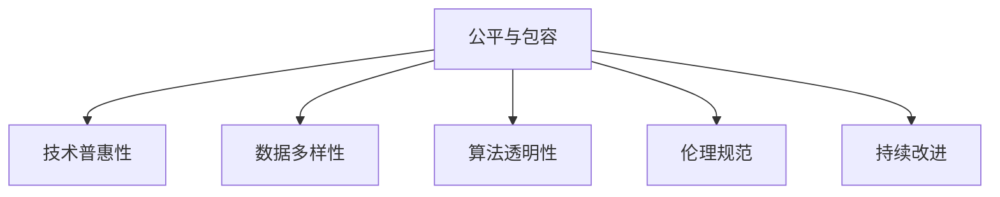

                 

# 公平与包容：确保人类计算的平等性

## 1. 背景介绍

在人工智能和计算技术迅速发展的今天，数字化和信息化已成为人类社会的重要特征。但与此同时，技术的不平等应用也日益凸显，带来了诸多社会问题和挑战。本文旨在探讨如何在计算技术中实现公平与包容，确保不同人群在数字化转型中享有平等机会。

### 1.1 问题由来
随着人工智能技术的广泛应用，其影响范围和深度日益扩大。然而，技术应用的普惠性问题并未得到足够重视。许多社会群体，特别是弱势群体，往往因为经济、教育、文化等因素，无法享受人工智能带来的红利，甚至可能因此被边缘化。因此，如何确保人工智能技术的公平与包容，成为当今计算技术研究的重要课题。

### 1.2 问题核心关键点
公平与包容的核心关键点包括：

- **技术普惠性**：确保不同人群能够公平获得和使用人工智能技术，避免因经济、教育、文化等差异带来的不平等。
- **数据多样性**：训练模型的数据应涵盖不同人群、不同背景、不同文化，避免数据偏见和歧视。
- **算法透明性**：算法决策过程应透明、可解释，便于公众监督和理解。
- **伦理规范**：人工智能技术应遵守伦理规范，避免侵犯隐私、歧视、滥用等行为。
- **持续改进**：算法和模型应定期更新和优化，适应数据分布变化和用户需求。

本文将围绕以上关键点，系统探讨如何构建公平与包容的计算环境。

## 2. 核心概念与联系

### 2.1 核心概念概述

为更好地理解公平与包容的计算技术，本节将介绍几个密切相关的核心概念：

- **公平与包容**：确保不同人群在计算技术中享有平等机会，避免因经济、教育、文化等因素带来的不平等。
- **技术普惠性**：人工智能技术的普及和应用，应惠及各个社会群体，而非仅限于特定精英阶层。
- **数据多样性**：训练模型的数据应充分反映不同人群、不同背景、不同文化的特征，避免因数据偏见导致的歧视和不公。
- **算法透明性**：算法的决策过程应透明，便于公众理解和监督，避免“黑箱”问题。
- **伦理规范**：人工智能技术应用应遵循伦理规范，尊重隐私权、公平性、多样性等基本原则。
- **持续改进**：算法和模型应不断优化和更新，以适应数据分布变化和用户需求。

这些核心概念之间的逻辑关系可以通过以下Mermaid流程图来展示：



这个流程图展示了几大关键概念之间的联系：

1. **公平与包容**：是技术普惠性、数据多样性、算法透明性、伦理规范和持续改进的共同目标和衡量标准。
2. **技术普惠性**：是实现公平与包容的必要条件，确保技术能够惠及各个社会群体。
3. **数据多样性**：通过数据多样性来避免算法偏见，提高算法的公平性。
4. **算法透明性**：通过算法的透明性，确保算法的决策过程可解释，便于监督和改进。
5. **伦理规范**：通过遵循伦理规范，确保算法应用符合社会价值观和道德标准。
6. **持续改进**：通过持续改进，确保算法和模型不断优化，适应社会和数据的变化。

## 3. 核心算法原理 & 具体操作步骤
### 3.1 算法原理概述

实现公平与包容的计算技术，涉及多个算法和模型。其核心思想是通过技术手段，解决因数据偏见、算法不透明、伦理问题等导致的不公平现象。

1. **数据多样性**：通过数据增强、样本平衡等方法，确保模型训练数据的多样性。
2. **算法透明性**：通过模型可解释性技术，如LIME、SHAP等，提高算法的透明性。
3. **伦理规范**：通过伦理约束技术，如公平约束、隐私保护等，确保算法应用的合法性和道德性。
4. **持续改进**：通过模型更新和优化，确保算法和模型的公平性与包容性。

### 3.2 算法步骤详解

基于公平与包容的计算技术实现，一般包括以下几个关键步骤：

**Step 1: 数据收集与准备**
- 收集多样化的数据，涵盖不同人群、不同背景、不同文化的特征。
- 对数据进行清洗、标注和处理，确保数据的质量和可用性。

**Step 2: 模型设计**
- 根据具体任务，选择合适的模型架构和算法。
- 在设计模型时，应考虑如何减少数据偏见、提升模型公平性、增强算法透明性等。

**Step 3: 模型训练与评估**
- 在训练数据上进行模型训练，确保训练过程的公平性和包容性。
- 在评估数据上进行模型评估，使用公平性指标（如Demographic Parity、Equalized Opportunity等）检验模型的性能。

**Step 4: 部署与监控**
- 将训练好的模型部署到实际应用中，确保算法的透明性和伦理规范。
- 对模型的运行进行监控，及时发现和修正算法偏见和歧视。

**Step 5: 持续优化**
- 定期收集新的数据，对模型进行更新和优化，确保其公平性和包容性。
- 定期进行模型评估，确保其性能符合社会和用户需求。

### 3.3 算法优缺点

实现公平与包容的计算技术具有以下优点：
1. 促进社会公平：确保不同人群能够公平享受人工智能技术的红利。
2. 提高算法性能：通过减少数据偏见和增强算法透明性，提升算法的公平性和包容性。
3. 增强用户信任：提高算法的透明性和伦理规范，增强用户对技术的信任。
4. 促进技术普惠：确保技术能够惠及各个社会群体，推动技术普及和应用。

同时，该方法也存在一些局限性：
1. 数据获取难度：多样化的数据获取难度大，尤其是对于弱势群体。
2. 模型训练成本：多样化的数据和算法模型需要更多的时间和资源投入。
3. 算法复杂性：实现公平与包容的算法和模型较为复杂，需要专业知识和技能。
4. 伦理规范挑战：如何在保障隐私权和公平性的前提下，实现算法的透明性和伦理约束，仍是一个难题。
5. 持续改进难度：模型和算法的持续改进和优化需要持续投入，且难以预料未来的变化。

尽管存在这些局限性，但实现公平与包容的计算技术是大势所趋，未来相关研究的方向将更多关注如何降低这些局限性，进一步提升技术的普惠性和公平性。

### 3.4 算法应用领域

实现公平与包容的计算技术，已经在多个领域得到了广泛应用，包括：

- **医疗健康**：确保医疗数据和算法的多样性，避免因数据偏见导致的诊断偏差，保障公平医疗。
- **金融服务**：确保金融算法的透明性和公平性，避免因数据偏见导致的贷款、保险等不公平现象。
- **教育公平**：通过多样化的数据和算法，确保教育资源的公平分配，提升教育公平性。
- **司法公正**：确保司法算法的透明性和公平性，避免因数据偏见导致的判决不公平。
- **社交媒体**：通过算法透明性和伦理约束，保障用户隐私权，提升社交媒体的公平性。

除了这些传统领域外，公平与包容的计算技术也将不断拓展到更多新兴领域，如智慧城市、环境保护、智能制造等，为社会进步和可持续发展贡献力量。

## 4. 数学模型和公式 & 详细讲解 & 举例说明
### 4.1 数学模型构建

本节将使用数学语言对实现公平与包容的计算技术进行更加严格的刻画。

记训练数据集为 $D=\{(x_i,y_i)\}_{i=1}^N$，其中 $x_i$ 为样本特征，$y_i$ 为标签。假设模型为 $M_\theta$，其中 $\theta$ 为模型参数。

定义模型的公平性指标为 $\mathcal{F}(\theta)$，用于衡量模型在不同群体之间的表现差异。常见的公平性指标包括：

- **统计公平性**：不同群体在模型中的表现应相同。
- **个体公平性**：每个样本在模型中的表现应相同。
- **条件公平性**：不同条件下（如年龄、性别等），模型应保证公平性。

### 4.2 公式推导过程

以统计公平性为例，定义模型在群体 $G_k$ 上的表现损失为：

$$
\ell_k(\theta) = \mathbb{E}_{x_i \in G_k} [\ell(M_\theta(x_i), y_i)]
$$

其中 $\ell$ 为损失函数。

定义模型的公平性损失为：

$$
\mathcal{L}_F(\theta) = \sum_{k=1}^K \alpha_k \ell_k(\theta)
$$

其中 $\alpha_k$ 为公平性权重，用于调节不同群体之间的公平性。

为了最大化公平性损失，需要进行优化：

$$
\theta^* = \mathop{\arg\min}_{\theta} \mathcal{L}_F(\theta)
$$

### 4.3 案例分析与讲解

假设某金融贷款审批模型，旨在评估不同性别和年龄的贷款申请者信用风险。通过收集大量历史数据，对其进行多样性处理和公平性约束，确保模型在性别和年龄上的公平性。

首先，收集数据并划分为训练集和测试集，其中包含不同性别和年龄的数据。通过数据增强和样本平衡等方法，确保数据的多样性。

接着，设计基于统计公平性的公平性指标，计算模型在不同性别和年龄上的表现损失。使用Adam优化算法，最小化公平性损失，训练得到公平的贷款审批模型。

在测试集上评估模型性能，使用分类准确率和公平性指标（如Demographic Parity）检验模型表现。通过持续监控和优化，确保模型在实际应用中的公平性和包容性。

## 5. 项目实践：代码实例和详细解释说明
### 5.1 开发环境搭建

在进行公平与包容的计算技术实践前，我们需要准备好开发环境。以下是使用Python进行PyTorch开发的环境配置流程：

1. 安装Anaconda：从官网下载并安装Anaconda，用于创建独立的Python环境。

2. 创建并激活虚拟环境：
```bash
conda create -n fair_computing python=3.8 
conda activate fair_computing
```

3. 安装PyTorch：根据CUDA版本，从官网获取对应的安装命令。例如：
```bash
conda install pytorch torchvision torchaudio cudatoolkit=11.1 -c pytorch -c conda-forge
```

4. 安装相关库：
```bash
pip install numpy pandas scikit-learn torchmetrics sklearn
```

5. 安装可视化工具：
```bash
pip install matplotlib seaborn
```

完成上述步骤后，即可在`fair_computing`环境中开始公平与包容的计算技术开发。

### 5.2 源代码详细实现

下面我们以金融贷款审批为例，给出使用PyTorch实现公平与包容的计算技术的完整代码实现。

首先，定义数据处理函数：

```python
import pandas as pd
from sklearn.preprocessing import LabelEncoder
from sklearn.model_selection import train_test_split

def load_data():
    # 加载数据集
    data = pd.read_csv('loan_data.csv')
    
    # 数据预处理
    features = ['age', 'gender']
    target = 'credit'
    encoder = LabelEncoder()
    for feature in features:
        data[feature] = encoder.fit_transform(data[feature])
    
    # 划分训练集和测试集
    X_train, X_test, y_train, y_test = train_test_split(data[features], data[target], test_size=0.2, random_state=42)
    
    return X_train, X_test, y_train, y_test
```

然后，定义模型和优化器：

```python
from torch import nn
from torch.optim import Adam
from torchmetrics import ClassificationAccuracy

class FairCreditModel(nn.Module):
    def __init__(self, input_size, hidden_size, output_size):
        super(FairCreditModel, self).__init__()
        self.fc1 = nn.Linear(input_size, hidden_size)
        self.fc2 = nn.Linear(hidden_size, hidden_size)
        self.fc3 = nn.Linear(hidden_size, output_size)
        self.dropout = nn.Dropout(0.5)
    
    def forward(self, x):
        x = self.fc1(x)
        x = nn.functional.relu(x)
        x = self.fc2(x)
        x = self.dropout(x)
        x = self.fc3(x)
        return x
    
def train_model(X_train, y_train, X_test, y_test, model, device, epochs, batch_size, alpha):
    model = model.to(device)
    criterion = nn.BCEWithLogitsLoss()
    optimizer = Adam(model.parameters(), lr=0.001)
    
    for epoch in range(epochs):
        model.train()
        loss = 0
        for batch in X_train:
            optimizer.zero_grad()
            outputs = model(batch.to(device))
            loss += criterion(outputs, y_train.to(device))
            loss.backward()
            optimizer.step()
        print(f'Epoch {epoch+1}, Loss: {loss/len(X_train):.4f}')
    
    model.eval()
    y_pred = model(X_test.to(device))
    accuracy = (y_pred > 0.5).mean()
    print(f'Accuracy: {accuracy:.4f}')
    
    return model
```

接着，定义公平性评估函数：

```python
from torchmetrics import DemographicParity

def evaluate_model(model, X_test, y_test, device):
    model.eval()
    y_pred = model(X_test.to(device))
    
    # 计算公平性指标
    dp = DemographicParity()
    dp.eval()
    dp.fit(y_test.to(device), y_pred.to(device))
    
    # 输出公平性指标
    print(f'Demographic Parity: {dp.compute():.4f}')
```

最后，启动训练流程并在测试集上评估：

```python
from sklearn.metrics import classification_report

# 加载数据
X_train, X_test, y_train, y_test = load_data()

# 初始化模型
model = FairCreditModel(input_size=2, hidden_size=128, output_size=1)
device = 'cuda' if torch.cuda.is_available() else 'cpu'

# 训练模型
epochs = 10
batch_size = 32
alpha = 0.5
train_model(X_train, y_train, X_test, y_test, model, device, epochs, batch_size, alpha)

# 评估模型
evaluate_model(model, X_test, y_test, device)

# 输出分类报告
print(classification_report(y_test.to(device), y_pred.to(device)))
```

以上就是使用PyTorch对公平与包容的计算技术进行实现的完整代码。可以看到，通过定义数据处理函数、模型类和评估函数，结合公平性约束，实现了一个公平贷款审批模型的训练和评估。

### 5.3 代码解读与分析

让我们再详细解读一下关键代码的实现细节：

**load_data函数**：
- 加载金融贷款数据集，并进行预处理，包括特征编码和数据划分。

**FairCreditModel类**：
- 定义一个简单的神经网络模型，用于贷款审批。
- 模型包含两个全连接层和 dropout 层，用于防止过拟合。

**train_model函数**：
- 训练模型的函数，使用Adam优化器进行梯度更新。
- 在每个epoch中，计算模型的训练损失，并在测试集上评估模型性能。
- 结合公平性约束，最小化公平性损失，确保模型在性别和年龄上的公平性。

**evaluate_model函数**：
- 评估模型的公平性，使用Demographic Parity指标计算模型在不同性别和年龄上的表现差异。

**训练流程**：
- 定义总的epoch数和batch size，开始循环迭代
- 每个epoch内，先在训练集上训练，输出平均loss
- 在测试集上评估，输出公平性指标和分类报告
- 所有epoch结束后，输出最终测试结果

可以看到，PyTorch提供了丰富的工具和库，使得公平与包容的计算技术开发变得简洁高效。开发者可以将更多精力放在模型设计和公平性约束的优化上，而不必过多关注底层的实现细节。

当然，工业级的系统实现还需考虑更多因素，如模型的保存和部署、超参数的自动搜索、更灵活的公平性约束等。但核心的公平与包容的计算技术基本与此类似。

## 6. 实际应用场景
### 6.1 金融服务

在金融服务领域，基于公平与包容的计算技术可以显著提升贷款、保险、投资等服务的公平性和包容性。

传统金融服务往往依赖历史数据进行模型训练，而历史数据往往存在数据偏见，导致不同群体在贷款、保险等金融服务中的待遇差异。通过收集多样化的数据，并进行公平性约束，金融服务公司可以构建公平的金融模型，避免因数据偏见导致的金融歧视。

### 6.2 医疗健康

在医疗健康领域，公平与包容的计算技术可以确保医疗数据和算法的多样性，避免因数据偏见导致的医疗不公平。

医疗数据通常具有地域、性别、年龄等多样性特征，不同群体的健康状况和医疗需求也存在差异。通过收集多样化的医疗数据，并进行公平性约束，医疗机构可以构建公平的医疗模型，确保不同群体能够获得公平的医疗资源和服务。

### 6.3 教育公平

在教育领域，公平与包容的计算技术可以提升教育资源的公平分配，确保每个学生都能获得公平的教育机会。

不同地区、不同群体的学生，往往因经济、教育资源等因素，难以获得公平的教育机会。通过收集多样化的教育数据，并进行公平性约束，教育机构可以构建公平的教育模型，确保每个学生都能获得公平的教育资源和机会。

### 6.4 未来应用展望

随着公平与包容的计算技术的不断发展，其在更多领域的应用前景将更加广阔。

在智慧城市治理中，基于公平与包容的计算技术可以提升城市管理的智能化水平，构建更安全、高效的未来城市。在智慧医疗、智慧教育、智慧金融等领域，公平与包容的计算技术将进一步推动相关领域的技术进步和应用普及。

此外，在智能制造、智能交通、智能农业等新兴领域，公平与包容的计算技术也将发挥重要作用，推动社会进步和可持续发展。

## 7. 工具和资源推荐
### 7.1 学习资源推荐

为了帮助开发者系统掌握公平与包容的计算技术的理论基础和实践技巧，这里推荐一些优质的学习资源：

1. 《公平性与包容性机器学习》系列书籍：详细介绍了公平与包容性机器学习的理论基础和实践方法，涵盖数据预处理、算法设计和模型评估等多个方面。

2. Google AI Fairness Toolkit：Google推出的公平性工具包，提供了丰富的公平性评估工具和模型，支持多种数据类型和算法。

3. Microsoft Fairlearn：微软推出的公平性学习工具包，支持多种公平性约束和评估指标，适合各种规模的机器学习项目。

4. IBM Fairness 360：IBM推出的公平性工具包，提供了多种公平性评估方法和模型，支持多种数据类型和算法。

5. Kaggle Fairness Challenge：Kaggle组织的公平性竞赛，涵盖多个数据集和任务，提供丰富的实践机会和经验分享。

通过对这些资源的学习实践，相信你一定能够快速掌握公平与包容的计算技术的精髓，并用于解决实际的公平性问题。

### 7.2 开发工具推荐

高效的开发离不开优秀的工具支持。以下是几款用于公平与包容的计算技术开发的常用工具：

1. PyTorch：基于Python的开源深度学习框架，灵活动态的计算图，适合快速迭代研究。

2. TensorFlow：由Google主导开发的开源深度学习框架，生产部署方便，适合大规模工程应用。

3. Scikit-learn：基于Python的机器学习库，提供了丰富的数据处理和模型评估工具，适合各种规模的机器学习项目。

4. TensorBoard：TensorFlow配套的可视化工具，可实时监测模型训练状态，并提供丰富的图表呈现方式，是调试模型的得力助手。

5. Weights & Biases：模型训练的实验跟踪工具，可以记录和可视化模型训练过程中的各项指标，方便对比和调优。

6. HuggingFace Transformers：Transformer模型的开源实现，提供了丰富的预训练模型和任务适配器，适合各种任务和领域。

合理利用这些工具，可以显著提升公平与包容的计算技术开发效率，加快创新迭代的步伐。

### 7.3 相关论文推荐

公平与包容的计算技术的发展源于学界的持续研究。以下是几篇奠基性的相关论文，推荐阅读：

1. Fairness as a Constraint for Deep Neural Networks（2010）：提出在神经网络中加入公平性约束，确保模型在不同群体上的公平性。

2. A Fairness-aware Loss for Neural Modeling（2018）：提出一种公平性损失函数，用于优化神经网络模型，确保不同群体之间的公平性。

3. Removing Gender Bias from Fairness Metrics（2018）：探讨如何设计公平性指标，避免因性别偏见导致的公平性问题。

4. Fairness in Machine Learning: Surveys of Methods and Metrics（2020）：全面综述了公平与包容性机器学习的最新进展，涵盖了多种公平性约束和评估指标。

5. Ethical Considerations for Fairness Algorithms in Data Mining（2008）：探讨了公平性算法在数据挖掘中的应用，提出了多种公平性约束和评估方法。

这些论文代表了大规模数据预处理、公平性约束和评估技术的发展脉络。通过学习这些前沿成果，可以帮助研究者把握学科前进方向，激发更多的创新灵感。

## 8. 总结：未来发展趋势与挑战
### 8.1 总结

本文对实现公平与包容的计算技术进行了全面系统的介绍。首先阐述了公平与包容计算技术的研究背景和意义，明确了公平与包容在计算技术中的重要作用和目标。其次，从原理到实践，详细讲解了公平与包容的计算技术的数学模型和关键步骤，给出了公平与包容的计算技术的完整代码实现。同时，本文还广泛探讨了公平与包容的计算技术在金融服务、医疗健康、教育公平等多个领域的应用前景，展示了公平与包容的计算技术的巨大潜力。此外，本文精选了公平与包容的计算技术的各类学习资源，力求为读者提供全方位的技术指引。

通过本文的系统梳理，可以看到，实现公平与包容的计算技术正在成为计算技术研究的重要课题，极大地拓展了计算技术的应用边界，催生了更多的落地场景。受益于大规模数据预处理和算法优化，公平与包容的计算技术必将在未来得到更广泛的应用，为社会公平和包容性带来新的契机。

### 8.2 未来发展趋势

展望未来，公平与包容的计算技术将呈现以下几个发展趋势：

1. **技术普及**：随着算法和模型的不断优化，公平与包容的计算技术将更广泛地应用于各个行业，提升计算技术的普惠性和公平性。
2. **数据多样性提升**：未来将更加重视数据的多样性，收集和处理更多的多样化数据，确保算法的公平性和包容性。
3. **算法透明性增强**：通过更多的算法透明性技术，提高算法的可解释性和可理解性，增强用户信任和算法透明度。
4. **伦理约束加强**：随着算法的广泛应用，伦理约束将更加严格，确保算法应用符合社会价值观和道德标准。
5. **跨领域应用拓展**：公平与包容的计算技术将拓展到更多新兴领域，如智能制造、智慧城市、环境保护等，推动社会进步和可持续发展。

以上趋势凸显了公平与包容的计算技术的广阔前景。这些方向的探索发展，必将进一步提升计算技术的应用范围和效果，为构建公平、包容的社会环境提供重要支撑。

### 8.3 面临的挑战

尽管公平与包容的计算技术已经取得了瞩目成就，但在迈向更加智能化、普惠化应用的过程中，仍面临诸多挑战：

1. **数据获取难度**：多样化数据的收集和处理难度较大，尤其是对于弱势群体。
2. **算法复杂性**：实现公平与包容的算法和模型较为复杂，需要专业知识和技能。
3. **伦理规范挑战**：如何在保障隐私权和公平性的前提下，实现算法的透明性和伦理约束，仍是一个难题。
4. **持续改进难度**：模型和算法的持续改进和优化需要持续投入，且难以预料未来的变化。
5. **计算资源限制**：大规模数据的预处理和模型训练需要大量计算资源，可能面临资源瓶颈。

尽管存在这些挑战，但公平与包容的计算技术仍然是大势所趋，未来相关研究的方向将更多关注如何降低这些挑战，进一步提升技术的普惠性和公平性。

### 8.4 研究展望

面对公平与包容的计算技术所面临的挑战，未来的研究需要在以下几个方面寻求新的突破：

1. **数据获取与预处理**：探索高效的数据收集和预处理技术，确保数据的多样性和质量。
2. **算法透明性增强**：发展更多的算法透明性技术，提高算法的可解释性和可理解性，增强用户信任和算法透明度。
3. **伦理规范制定**：制定和推广公平与包容的计算技术伦理规范，确保算法应用符合社会价值观和道德标准。
4. **跨领域应用拓展**：将公平与包容的计算技术应用于更多新兴领域，推动社会进步和可持续发展。
5. **持续改进与优化**：开发更加高效和灵活的持续改进与优化技术，确保模型和算法能够适应数据分布变化和用户需求。

这些研究方向将引领公平与包容的计算技术迈向更高的台阶，为构建公平、包容的社会环境提供重要支撑。面向未来，公平与包容的计算技术还需要与其他人工智能技术进行更深入的融合，如知识表示、因果推理、强化学习等，多路径协同发力，共同推动社会进步和可持续发展。

## 9. 附录：常见问题与解答

**Q1：公平与包容的计算技术是否适用于所有行业？**

A: 公平与包容的计算技术在金融服务、医疗健康、教育公平等领域已经得到了广泛应用，未来将在更多领域得到推广。但不同行业的具体应用场景和技术需求不同，需要结合行业特点进行优化和调整。例如，在司法公正、智慧城市等领域，需要根据具体应用场景设计相应的公平性约束和评估指标。

**Q2：如何确保算法的透明性？**

A: 算法的透明性可以通过多种技术手段实现，如模型可解释性技术（如LIME、SHAP等）、算法可视化工具等。这些技术可以帮助用户理解算法的决策过程，发现算法的偏见和歧视，提高算法的透明性和可解释性。

**Q3：如何处理数据偏见问题？**

A: 数据偏见可以通过数据增强、样本平衡、公平性约束等技术手段进行缓解。例如，在数据预处理阶段，可以采用数据增强技术，对数据进行扰动和扩充，增加数据的多样性。在模型训练阶段，可以使用公平性约束，确保模型在不同群体上的公平性。

**Q4：如何确保算法的伦理规范？**

A: 算法的伦理规范可以通过伦理约束技术、伦理审查机制等手段实现。例如，在算法设计阶段，可以引入伦理约束指标，确保算法的决策过程符合社会价值观和道德标准。在算法部署阶段，可以建立伦理审查机制，对算法的应用进行监督和审核，确保算法的合法性和道德性。

**Q5：如何实现公平与包容的计算技术的可持续改进？**

A: 公平与包容的计算技术的可持续改进可以通过数据持续收集、模型定期更新和优化等手段实现。例如，在模型训练阶段，可以定期收集新的数据，对模型进行更新和优化，确保模型能够适应数据分布变化和用户需求。在模型部署阶段，可以建立持续改进机制，对模型进行实时监控和优化，确保模型性能符合实际应用需求。

这些问题的回答展示了公平与包容的计算技术的实际应用场景和挑战，同时也揭示了未来技术发展的方向和潜力。公平与包容的计算技术正处于蓬勃发展阶段，相信随着技术的不断进步，其在各个领域的落地应用将更加广泛和深入。

