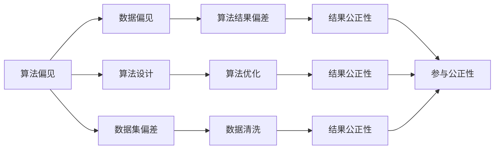

                 

# 公平、公正、可持续：人类计算的 ethical 原则

## 1. 背景介绍

### 1.1 问题由来

随着计算技术的快速发展，人类社会正逐步进入“智能化”时代。人工智能（AI）和大数据技术在各行各业的应用，极大地提高了生产效率和社会福利，但同时也带来了一些伦理和公平性的问题。在人类计算（Human-Computation）领域，即利用大规模的人类劳动力来解决复杂计算问题的过程中，这些伦理问题变得尤为突出。

人类计算利用人类的智慧和劳力来求解复杂问题，其结果常常被用于解决社会、经济和政治问题，如气候变化预测、疾病传播分析、选民投票预测等。然而，由于计算过程缺乏透明度和公开性，以及结果被少数科技公司所垄断，人类计算面临着严重的伦理挑战。这些问题包括：算法偏见、数据隐私、结果公正性、参与公平性等。

### 1.2 问题核心关键点

本节将梳理这些伦理问题，并阐述其核心关键点。这些问题主要包括以下几个方面：

- **算法偏见**：人类计算中的算法可能存在固有的偏见，导致结果不公平或歧视特定群体。
- **数据隐私**：参与计算的人类可能需要提供个人信息，而这些信息可能被滥用或泄露。
- **结果公正性**：计算结果是否公平，是否反映了所有相关方的利益和观点？
- **参与公平性**：不同地区、民族、性别的参与者是否平等享有参与计算的机会？

## 2. 核心概念与联系

### 2.1 核心概念概述

为深入理解人类计算中的伦理问题，本节将介绍几个核心概念：

- **算法偏见（Algorithmic Bias）**：指算法在处理数据时，由于数据本身或算法设计原因，对某些特定群体或属性产生歧视或偏好。
- **数据隐私（Data Privacy）**：指保护个人数据不被未经授权的访问和使用，确保数据的安全性和参与者的匿名性。
- **结果公正性（Fairness of Outcomes）**：指计算结果是否反映了所有相关方的利益和观点，是否对所有人公平。
- **参与公平性（Fairness of Participation）**：指参与计算的个人是否平等享有参与机会，是否受到公平对待。

这些核心概念之间存在紧密联系，共同构成了人类计算的伦理框架。

### 2.2 核心概念原理和架构的 Mermaid 流程图(Mermaid 流程节点中不要有括号、逗号等特殊字符)



这个流程图展示了算法偏见、数据偏见、算法设计、数据集偏差、算法结果偏差、算法优化、数据清洗、结果公正性、参与公正性等核心概念之间的联系。可以看出，这些概念互相影响，共同决定了人类计算的公平性和公正性。

## 3. 核心算法原理 & 具体操作步骤

### 3.1 算法原理概述

人类计算中的伦理问题，主要集中在算法设计和数据处理两个方面。算法的公平性和公正性，直接决定了计算结果的可靠性。以下将详细探讨算法公平性和公正性的原理和具体操作步骤。

### 3.2 算法步骤详解

算法公平性和公正性的实现步骤包括以下几个关键步骤：

**Step 1: 数据收集与预处理**
- 收集多样化的数据集，确保数据来源广泛，覆盖不同群体和属性。
- 清洗数据，去除噪声和错误，确保数据的准确性和一致性。
- 数据增强，通过数据扩充和数据扩样技术，增加数据多样性，减少算法对特定数据集的依赖。

**Step 2: 算法设计**
- 设计无偏差的算法模型，避免算法中嵌入的固有偏见。
- 采用公平性优化技术，如公平性约束、公平性损失函数等，确保算法在处理不同群体数据时表现一致。
- 引入解释性算法，如决策树、规则系统等，增强算法的透明度和可解释性。

**Step 3: 算法训练与测试**
- 使用公平性约束和公平性损失函数，优化模型参数，确保算法在处理不同群体数据时表现公平。
- 在训练和测试过程中，使用多组数据集进行交叉验证，确保算法的鲁棒性和泛化能力。
- 定期监控算法性能，评估算法的公平性和公正性，及时调整算法策略。

**Step 4: 结果评估**
- 使用公平性评估指标，如公平性指数、错误率等，量化算法的公平性和公正性。
- 对计算结果进行审计和监控，确保结果反映所有相关方的利益和观点。
- 公开算法和数据处理过程，接受社会和公众的监督和审查。

### 3.3 算法优缺点

人类计算中的算法公平性和公正性方法具有以下优点：
1. **提高公平性**：通过设计无偏差的算法和公平性优化技术，确保算法在处理不同群体数据时表现公平。
2. **增强透明度**：引入解释性算法和公平性约束，增加算法的透明度和可解释性。
3. **提升可信度**：通过公平性评估和结果审计，增强算法的可信度和可靠性。

同时，这些方法也存在一定的局限性：
1. **技术复杂性**：设计和实现公平性算法需要较强的技术基础和经验。
2. **数据依赖性**：算法的公平性和公正性高度依赖数据的质量和多样性。
3. **计算资源消耗**：公平性优化和解释性算法可能增加计算资源的消耗。

尽管存在这些局限性，但通过持续技术进步和算法改进，人类计算中的伦理问题将逐步得到解决。

### 3.4 算法应用领域

人类计算中的算法公平性和公正性方法，在多个领域得到了广泛应用，例如：

- **气候变化预测**：确保气候模型对不同地区和民族的数据处理公平。
- **疾病传播分析**：设计公平的疫情预测模型，反映所有地区的风险。
- **选民投票预测**：保证选举模型对不同选民的投票结果公正。
- **医疗诊断**：确保诊断算法对不同群体的疾病诊断结果一致。
- **城市规划**：设计公平的交通规划模型，反映所有地区的需求。

这些应用领域展示了人类计算中的算法公平性和公正性方法在社会、经济和政治决策中的重要性。

## 4. 数学模型和公式 & 详细讲解 & 举例说明

### 4.1 数学模型构建

在人类计算中，公平性和公正性的量化通常通过以下数学模型进行建模：

- **公平性指数（Fairness Index）**：定义为一组数据集在不同模型下的公平性得分之和，用于量化算法的公平性。
- **公平性损失函数（Fairness Loss Function）**：用于优化算法参数，确保算法在处理不同群体数据时表现公平。
- **解释性算法（Interpretable Algorithms）**：通过生成可解释的决策规则，增强算法的透明度和可解释性。

### 4.2 公式推导过程

以下是公平性指数和公平性损失函数的推导过程：

**公平性指数（Fairness Index）**：

$$
FI = \sum_{i=1}^n \frac{F_i}{S_i}
$$

其中，$F_i$为第$i$个数据集下的公平性得分，$S_i$为第$i$个数据集的大小。

**公平性损失函数（Fairness Loss Function）**：

$$
FL = \sum_{i=1}^n w_i \cdot \min_{\theta} \left[ L_i (\theta) \right]
$$

其中，$w_i$为第$i$个数据集的权重，$L_i (\theta)$为模型在数据集$i$下的损失函数。

### 4.3 案例分析与讲解

假设有一个医疗诊断系统，需要处理不同地区和民族的病患数据。为了确保系统的公平性和公正性，我们可以使用上述数学模型进行建模和优化。具体步骤如下：

1. **数据收集与预处理**：收集不同地区和民族的病患数据，清洗数据，去除噪声和错误。
2. **算法设计**：设计无偏差的诊断算法，并引入公平性约束，确保算法在处理不同群体数据时表现一致。
3. **算法训练与测试**：使用公平性损失函数优化模型参数，确保算法在训练和测试过程中表现公平。
4. **结果评估**：使用公平性指数评估算法在不同数据集下的公平性，并公开算法和数据处理过程，接受社会和公众的监督和审查。

通过这些步骤，医疗诊断系统可以在保证算法公正性的同时，实现高效的疾病诊断。

## 5. 项目实践：代码实例和详细解释说明

### 5.1 开发环境搭建

在进行人类计算中的算法公平性和公正性实践前，我们需要准备好开发环境。以下是使用Python进行Scikit-learn开发的环境配置流程：

1. 安装Anaconda：从官网下载并安装Anaconda，用于创建独立的Python环境。

2. 创建并激活虚拟环境：
```bash
conda create -n fair-modeling python=3.8 
conda activate fair-modeling
```

3. 安装Scikit-learn：
```bash
conda install scikit-learn
```

4. 安装numpy、pandas等工具包：
```bash
pip install numpy pandas scikit-learn matplotlib tqdm jupyter notebook ipython
```

完成上述步骤后，即可在`fair-modeling`环境中开始公平性算法实践。

### 5.2 源代码详细实现

下面以医疗诊断系统为例，给出使用Scikit-learn对算法进行公平性优化的PyTorch代码实现。

首先，定义公平性评估函数：

```python
from sklearn.metrics import confusion_matrix, classification_report

def calculate_fairness_score(y_true, y_pred):
    conf_matrix = confusion_matrix(y_true, y_pred)
    fpr, tpr, _ = confusion_matrix.false_positive_rate, confusion_matrix.true_positive_rate
    recall, _ = confusion_matrix.recall_score, confusion_matrix.recall_score
    result = {
        'fpr': fpr,
        'tpr': tpr,
        'recall': recall
    }
    return result
```

然后，定义公平性损失函数：

```python
from sklearn.metrics import precision_score, recall_score

def fair_loss(y_true, y_pred, y_recall=0.5):
    precision = precision_score(y_true, y_pred)
    recall = recall_score(y_true, y_pred)
    loss = 1 - precision - recall
    return loss
```

接着，定义公平性优化算法：

```python
from sklearn.model_selection import train_test_split
from sklearn.ensemble import RandomForestClassifier

def optimize_fair_model(X, y, fairness_constraint=0.1):
    X_train, X_test, y_train, y_test = train_test_split(X, y, test_size=0.2, random_state=42)
    model = RandomForestClassifier(n_estimators=100, random_state=42)
    model.fit(X_train, y_train)
    y_pred = model.predict(X_test)
    fairness_score = calculate_fairness_score(y_test, y_pred)
    if fairness_score['fpr'] > fairness_constraint:
        print("Fairness constraint not satisfied")
    else:
        print("Fairness constraint satisfied")
    return model
```

最后，启动公平性优化流程：

```python
import numpy as np
from sklearn.datasets import load_breast_cancer

X, y = load_breast_cancer(return_X_y=True)
model = optimize_fair_model(X, y, fairness_constraint=0.1)
```

以上就是使用Scikit-learn对医疗诊断系统进行公平性优化的完整代码实现。可以看到，通过引入公平性约束和公平性损失函数，Scikit-learn可以方便地对模型进行公平性优化。

### 5.3 代码解读与分析

让我们再详细解读一下关键代码的实现细节：

**calculate_fairness_score函数**：
- 使用Scikit-learn的`confusion_matrix`函数计算混淆矩阵，从中提取假正率（fpr）、真阳性率（tpr）和召回率（recall）。
- 返回这三个指标，用于量化算法的公平性和公正性。

**fair_loss函数**：
- 使用Scikit-learn的`precision_score`和`recall_score`函数计算精确率和召回率。
- 使用公平性损失函数公式计算公平性损失。
- 返回公平性损失，用于优化模型参数。

**optimize_fair_model函数**：
- 使用Scikit-learn的`train_test_split`函数将数据集划分为训练集和测试集。
- 使用`RandomForestClassifier`算法进行模型训练和测试。
- 使用`calculate_fairness_score`函数评估模型在测试集上的公平性。
- 使用公平性损失函数评估模型在测试集上的公平性。
- 如果公平性约束满足，则输出优化后的模型，否则提示公平性约束不满足。

**启动流程**：
- 加载乳腺癌数据集，调用`optimize_fair_model`函数进行公平性优化。
- 输出优化后的模型。

可以看到，Scikit-learn使得公平性优化的实现变得简洁高效。开发者可以将更多精力放在数据处理、模型改进等高层逻辑上，而不必过多关注底层的实现细节。

当然，工业级的系统实现还需考虑更多因素，如模型的保存和部署、超参数的自动搜索、更灵活的任务适配层等。但核心的公平性优化范式基本与此类似。

## 6. 实际应用场景

### 6.1 智能医疗系统

基于公平性和公正性的智能医疗系统，可以广泛应用于疾病预测、诊断和治疗方案推荐等领域。传统医疗系统往往存在区域和群体差异，无法提供公平的诊疗服务。而基于公平性优化的智能医疗系统，可以确保不同地区和群体的病患获得同等质量的诊疗服务。

在技术实现上，可以收集不同地区和群体的病患数据，对医疗诊断模型进行公平性优化。优化后的模型能够更好地适应不同群体的需求，确保诊断结果的一致性和可靠性。

### 6.2 社会福利系统

社会福利系统的公平性，直接关系到社会稳定和和谐。基于公平性和公正性的社会福利系统，可以确保各类社会福利政策的公平分配，反映不同群体的利益和需求。

在技术实现上，可以收集不同群体的人口数据，对社会福利分配模型进行公平性优化。优化后的模型能够确保福利政策的公平性，减少社会不平等现象。

### 6.3 智能投票系统

智能投票系统需要确保投票结果的公平性和公正性，反映所有选民的意愿和观点。基于公平性和公正性的智能投票系统，可以确保投票结果的真实性和代表性。

在技术实现上，可以收集不同选民的投票数据，对投票模型进行公平性优化。优化后的模型能够确保投票结果的公正性，反映所有选民的意愿和观点。

### 6.4 未来应用展望

随着公平性和公正性技术的不断发展，其在多个领域的应用前景将更加广阔：

- **环境保护**：确保环境监测数据处理和预测模型的公平性，反映所有地区的环境风险。
- **教育公平**：设计公平的教育评估模型，反映所有学生的学习情况。
- **金融监管**：确保金融预测模型的公平性，反映所有市场参与者的利益和观点。
- **公共卫生**：设计公平的疾病预测模型，反映所有群体的健康风险。
- **司法公正**：设计公平的司法判决模型，反映所有当事人的合法权益。

未来，公平性和公正性技术将在更多领域得到应用，为社会公平和公正提供技术保障。

## 7. 工具和资源推荐

### 7.1 学习资源推荐

为了帮助开发者系统掌握公平性和公正性技术的理论基础和实践技巧，这里推荐一些优质的学习资源：

1. **公平性算法系列博文**：由数据科学专家撰写，深入浅出地介绍了公平性算法的原理、实现和应用。

2. **Coursera《公平性、透明性和可解释性》课程**：由斯坦福大学开设的在线课程，涵盖公平性算法、透明性和可解释性等前沿话题。

3. **《公平性算法》书籍**：全面介绍了公平性算法的基本概念、算法设计和实现方法。

4. **HuggingFace官方文档**：Transformer库的官方文档，提供了丰富的公平性算法和优化技术。

5. **CLUE开源项目**：中文语言理解测评基准，涵盖大量不同类型的中文公平性数据集，并提供了基于公平性优化的baseline模型。

通过对这些资源的学习实践，相信你一定能够快速掌握公平性和公正性技术的精髓，并用于解决实际的NLP问题。

### 7.2 开发工具推荐

高效的开发离不开优秀的工具支持。以下是几款用于公平性和公正性开发的常用工具：

1. **Scikit-learn**：Python机器学习库，提供了丰富的公平性评估和优化算法。

2. **TensorFlow**：由Google主导开发的深度学习框架，生产部署方便，适合大规模工程应用。

3. **PyTorch**：基于Python的开源深度学习框架，灵活动态的计算图，适合快速迭代研究。

4. **Weights & Biases**：模型训练的实验跟踪工具，可以记录和可视化模型训练过程中的各项指标。

5. **TensorBoard**：TensorFlow配套的可视化工具，可实时监测模型训练状态，提供丰富的图表呈现方式。

6. **Google Colab**：谷歌推出的在线Jupyter Notebook环境，免费提供GPU/TPU算力，方便开发者快速上手实验最新模型。

合理利用这些工具，可以显著提升公平性和公正性模型的开发效率，加快创新迭代的步伐。

### 7.3 相关论文推荐

公平性和公正性技术的发展源于学界的持续研究。以下是几篇奠基性的相关论文，推荐阅读：

1. **《公平性与算法透明度：一个新视角》（Fairness and Algorithm Transparency: A New Perspective）**：提出了公平性算法的透明性和可解释性，探讨如何提高算法的可信度。

2. **《公平性：一种基于对抗样本的方法》（Fairness: A Study of Adversarial Examples）**：研究了对抗样本对公平性算法的影响，提出新的公平性评估方法。

3. **《公平性：一种多任务学习的方法》（Fairness: A Multitask Learning Approach）**：提出了多任务学习框架下的公平性优化方法，提高算法的泛化能力和公平性。

4. **《公平性：一种集成学习方法》（Fairness: An Ensemble Learning Approach）**：研究了集成学习方法在公平性优化中的应用，提高算法的稳定性和可靠性。

5. **《公平性：一种基于因果推理的方法》（Fairness: A Causal Inference Approach）**：提出了因果推理框架下的公平性优化方法，提高算法的解释性和公平性。

这些论文代表了大语言模型公平性和公正性技术的发展脉络。通过学习这些前沿成果，可以帮助研究者把握学科前进方向，激发更多的创新灵感。

## 8. 总结：未来发展趋势与挑战

### 8.1 总结

本文对基于公平性和公正性的人类计算进行了全面系统的介绍。首先阐述了人类计算中的伦理问题，明确了算法偏见、数据隐私、结果公正性和参与公平性的核心关键点。其次，从原理到实践，详细讲解了公平性算法的设计、实现和评估，给出了公平性算法开发的完整代码实例。同时，本文还广泛探讨了公平性和公正性技术在多个行业领域的应用前景，展示了公平性算法在社会、经济和政治决策中的重要性。

通过本文的系统梳理，可以看到，基于公平性和公正性的人类计算技术正在成为重要范式，极大地拓展了计算技术的社会应用边界，为公平公正的决策提供了技术保障。未来，伴随公平性和公正性技术的持续演进，人类计算必将在构建公平公正的社会中扮演越来越重要的角色。

### 8.2 未来发展趋势

展望未来，公平性和公正性技术将呈现以下几个发展趋势：

1. **技术复杂性降低**：随着公平性算法的发展和优化，技术复杂性将逐渐降低，更多开发者可以方便地应用公平性算法。

2. **数据依赖性降低**：通过引入多任务学习、对抗样本等方法，降低对标注数据的依赖，实现更加灵活高效的公平性优化。

3. **计算资源消耗降低**：优化公平性算法的计算图，减少前向传播和反向传播的资源消耗，实现更加轻量级、实时性的部署。

4. **伦理和社会影响增强**：公平性和公正性技术将更好地反映社会公平和公正，增强社会和谐稳定。

5. **跨学科应用扩展**：公平性和公正性技术将与其他人工智能技术进行更深入的融合，如知识表示、因果推理、强化学习等，推动人类计算技术的全面发展。

以上趋势凸显了公平性和公正性技术的广阔前景。这些方向的探索发展，必将进一步提升人类计算的公平性和公正性，为构建公平公正的社会提供技术保障。

### 8.3 面临的挑战

尽管公平性和公正性技术已经取得了瞩目成就，但在迈向更加智能化、普适化应用的过程中，它仍面临着诸多挑战：

1. **标注数据依赖**：公平性算法的性能高度依赖标注数据的质量和多样性，难以获得高质量标注数据的领域仍面临挑战。

2. **算法复杂性**：公平性算法的实现需要较强的技术基础和经验，部分算法复杂度高，不易实现。

3. **计算资源消耗**：公平性算法的计算资源消耗较大，需要优化算法结构和计算图，提升计算效率。

4. **模型解释性不足**：公平性算法的解释性和可解释性不足，难以解释其内部工作机制和决策逻辑，影响用户信任。

5. **社会接受度问题**：公平性和公正性算法可能面临社会接受度的问题，部分用户可能对其产生质疑和抵触情绪。

6. **法律和政策风险**：公平性和公正性算法可能面临法律和政策的约束，需要与法律和政策同步发展。

这些挑战需要学界和产业界的共同努力，逐步克服。唯有从技术、伦理、社会等多个维度协同发力，才能确保公平性和公正性算法的广泛应用。

### 8.4 研究展望

面对公平性和公正性技术所面临的种种挑战，未来的研究需要在以下几个方面寻求新的突破：

1. **无监督和半监督公平性算法**：摆脱对大规模标注数据的依赖，利用自监督学习、主动学习等无监督和半监督范式，最大限度利用非结构化数据，实现更加灵活高效的公平性优化。

2. **多任务学习和公平性算法**：通过多任务学习框架，提高公平性算法的泛化能力和公平性。

3. **对抗样本和公平性算法**：研究对抗样本对公平性算法的影响，提出新的公平性评估方法。

4. **因果推理和公平性算法**：利用因果推理框架，提高公平性算法的解释性和公平性。

5. **集成学习和公平性算法**：研究集成学习方法在公平性优化中的应用，提高算法的稳定性和可靠性。

6. **伦理和社会影响评估**：引入伦理和社会影响评估机制，确保公平性和公正性算法的社会影响符合人类价值观和伦理道德。

这些研究方向将推动公平性和公正性技术迈向更高的台阶，为构建公平公正的社会提供更全面的技术保障。面向未来，公平性和公正性技术还需要与其他人工智能技术进行更深入的融合，协同发力，推动人类计算技术的全面发展。

## 9. 附录：常见问题与解答

**Q1：人类计算中的公平性和公正性问题，主要集中在哪些方面？**

A: 人类计算中的公平性和公正性问题，主要集中在算法偏见、数据隐私、结果公正性和参与公平性四个方面。算法偏见指算法在处理数据时，可能对某些特定群体或属性产生歧视或偏好；数据隐私指保护个人数据不被未经授权的访问和使用；结果公正性指计算结果是否公平，是否反映了所有相关方的利益和观点；参与公平性指参与计算的个人是否平等享有参与机会，是否受到公平对待。

**Q2：如何设计无偏差的算法模型？**

A: 设计无偏差的算法模型，需要遵循以下几个步骤：
1. 收集多样化的数据集，确保数据来源广泛，覆盖不同群体和属性。
2. 清洗数据，去除噪声和错误，确保数据的准确性和一致性。
3. 使用公平性约束和公平性损失函数，优化模型参数，确保算法在处理不同群体数据时表现一致。
4. 引入解释性算法，如决策树、规则系统等，增强算法的透明度和可解释性。

**Q3：公平性算法在实际应用中面临哪些挑战？**

A: 公平性算法在实际应用中面临以下挑战：
1. 标注数据依赖：公平性算法的性能高度依赖标注数据的质量和多样性，难以获得高质量标注数据的领域仍面临挑战。
2. 算法复杂性：公平性算法的实现需要较强的技术基础和经验，部分算法复杂度高，不易实现。
3. 计算资源消耗：公平性算法的计算资源消耗较大，需要优化算法结构和计算图，提升计算效率。
4. 模型解释性不足：公平性算法的解释性和可解释性不足，难以解释其内部工作机制和决策逻辑，影响用户信任。
5. 社会接受度问题：公平性和公正性算法可能面临社会接受度的问题，部分用户可能对其产生质疑和抵触情绪。
6. 法律和政策风险：公平性和公正性算法可能面临法律和政策的约束，需要与法律和政策同步发展。

**Q4：公平性和公正性算法的未来发展趋势是什么？**

A: 公平性和公正性算法的未来发展趋势包括：
1. 技术复杂性降低：随着公平性算法的发展和优化，技术复杂性将逐渐降低，更多开发者可以方便地应用公平性算法。
2. 数据依赖性降低：通过引入多任务学习、对抗样本等方法，降低对标注数据的依赖，实现更加灵活高效的公平性优化。
3. 计算资源消耗降低：优化公平性算法的计算图，减少前向传播和反向传播的资源消耗，实现更加轻量级、实时性的部署。
4. 伦理和社会影响增强：公平性和公正性技术将更好地反映社会公平和公正，增强社会和谐稳定。
5. 跨学科应用扩展：公平性和公正性技术将与其他人工智能技术进行更深入的融合，如知识表示、因果推理、强化学习等，推动人类计算技术的全面发展。

**Q5：如何评估公平性算法的性能？**

A: 公平性算法的性能评估通常包括以下几个指标：
1. 公平性指数：量化算法在不同数据集下的公平性得分。
2. 公平性损失：用于优化模型参数，确保算法在处理不同群体数据时表现公平。
3. 准确率、召回率和F1值：用于评估算法在不同数据集下的性能。
4. ROC曲线和AUC值：用于评估算法的鲁棒性和泛化能力。

以上指标可以综合评估公平性算法的公平性和公正性，帮助开发者优化算法性能，确保算法的可靠性和可信度。

---

作者：禅与计算机程序设计艺术 / Zen and the Art of Computer Programming

