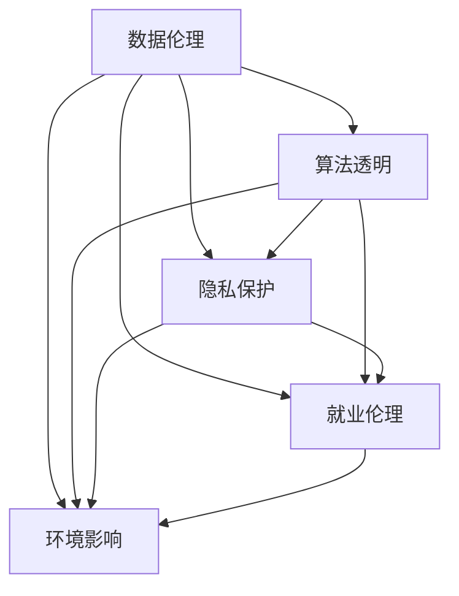

                 

# 公平、公正、可持续：人类计算的伦理原则

> 关键词：公平性,公正性,可持续性,人类计算,数据伦理,人工智能,算法透明,隐私保护,就业伦理,环境影响

## 1. 背景介绍

在当今这个数据驱动、算法决策的数字化时代，计算技术正在深刻改变我们的生活方式。无论是医疗、教育、金融，还是城市管理、环境保护，计算能力都发挥着越来越重要的作用。然而，在享受技术带来的便利的同时，我们也必须正视随之而来的伦理挑战。特别是随着人工智能(AI)和深度学习技术的快速发展，如何在技术应用中确保公平、公正和可持续发展，已成为全社会共同关注的重要议题。本文将深入探讨人类计算中的伦理原则，从数据伦理、算法透明、隐私保护、就业伦理和环境影响等多个维度，探讨如何构建一个更加公平、公正、可持续的计算生态。

## 2. 核心概念与联系

### 2.1 核心概念概述

为了更好地理解人类计算中的伦理原则，我们首先需要明确以下几个关键概念：

- **数据伦理(Data Ethics)**：指在数据收集、处理和使用过程中，应遵循的道德规范和行为准则。数据伦理的核心在于确保数据采集和处理的透明性、公正性和隐私保护。

- **算法透明(Algorithmic Transparency)**：指在算法设计和应用中，应确保算法的决策过程、依据和输出结果可以被理解和解释。算法透明旨在避免"黑箱"决策，增强算法的可解释性和可信赖性。

- **隐私保护(Privacy Protection)**：指在数据处理和分享过程中，应采取有效措施保护个人隐私，防止数据滥用和泄露。隐私保护是数据伦理的重要组成部分，也是构建可信AI系统的基石。

- **就业伦理(Employment Ethics)**：指在自动化和智能化技术应用中，应考虑到对就业市场的影响，平衡技术进步和就业机会之间的关系。

- **环境影响(Environmental Impact)**：指在计算技术应用中，应考虑到其对环境的影响，推动绿色计算和可持续发展。

这些核心概念之间的关系可以通过以下Mermaid流程图来展示：



这个流程图展示了几大核心概念之间的相互联系：

1. 数据伦理是整个计算伦理的基础，直接影响到算法透明、隐私保护、就业伦理和环境影响。
2. 算法透明、隐私保护、就业伦理和环境影响都是数据伦理的具体表现形式，相互之间密切关联。
3. 数据伦理和算法透明是技术应用的前提，隐私保护、就业伦理和环境影响是技术应用的社会责任。

## 3. 核心算法原理 & 具体操作步骤

### 3.1 算法原理概述

在讨论人类计算的伦理原则时，我们需要理解不同算法和技术对社会的影响。以下将从公平性、公正性和可持续性三个维度，分析算法设计、应用和评估中的伦理考量。

- **公平性(Fairness)**：指算法应避免对特定群体或个人的不公平对待，确保决策的公正性和合理性。公平性是确保算法透明和可解释性的重要前提。
- **公正性(Justice)**：指算法应维护社会正义，避免加剧社会不平等和歧视，确保所有群体的利益得到平等考虑。
- **可持续性(Sustainability)**：指算法应用应考虑到其对环境、社会和经济的长期影响，推动可持续发展。

### 3.2 算法步骤详解

为了实现公平、公正和可持续的计算，我们需要在算法设计和应用过程中，遵循以下步骤：

1. **数据收集与预处理**：确保数据采集和处理过程的透明性和公正性，避免数据偏见和歧视。
2. **模型设计与训练**：设计透明的算法模型，使用公平性、公正性和可持续性指标进行评估。
3. **算法部署与应用**：确保算法应用的透明性和可解释性，监测和调整算法输出。
4. **社会影响评估**：对算法应用的社会影响进行全面评估，确保其公平、公正和可持续性。

### 3.3 算法优缺点

- **优点**：
  - 增强算法透明性和可解释性，提升公众信任和社会认可。
  - 促进数据和算法的公平、公正使用，减少社会不平等和歧视。
  - 推动计算技术的可持续发展，减少环境和社会负担。
  
- **缺点**：
  - 实施成本高，需要大量资源和时间进行数据收集、模型设计和影响评估。
  - 技术复杂性高，需要多学科知识进行综合考量。
  - 存在实施难度，需要相关法规和标准进行支撑。

### 3.4 算法应用领域

公平、公正和可持续的计算原则，不仅适用于AI和深度学习算法，也适用于其他各种计算技术，如区块链、云计算、物联网等。以下是几个具体的应用领域：

1. **医疗健康**：确保患者数据隐私，避免医疗决策偏见，推动健康数据的公平共享。
2. **金融服务**：确保金融算法的公正性，避免歧视性贷款和投资决策，保障金融服务的公平性。
3. **城市管理**：推动智能城市的可持续发展，确保交通、能源和公共服务的公平分配。
4. **环境保护**：推动绿色计算，确保环境数据的公平采集和应用，减少环境影响。
5. **教育公平**：推动教育资源的公平分配，确保所有群体都能平等地接受优质教育。

## 4. 数学模型和公式 & 详细讲解

### 4.1 数学模型构建

为了更严谨地讨论算法透明和公平性，我们需要建立数学模型来量化和评估算法行为。假设我们有一个公平性指标 $f$，其值越小表示越公平。设算法输出的结果为 $y$，对应的公平性指标为 $f(y)$。

在训练过程中，我们需要最小化 $f(y)$，即：

$$
\min_{\theta} \mathbb{E}[f(y)]
$$

其中 $\theta$ 为模型参数，$\mathbb{E}$ 表示期望。

### 4.2 公式推导过程

为了推导上述公式，我们可以采用以下步骤：

1. 定义公平性指标 $f(y)$：假设 $f(y) = \sum_{i=1}^n w_i f_i(y)$，其中 $f_i(y)$ 为第 $i$ 个公平性维度，$w_i$ 为权重。
2. 计算 $f(y)$ 的期望：$\mathbb{E}[f(y)] = \mathbb{E}[\sum_{i=1}^n w_i f_i(y)] = \sum_{i=1}^n w_i \mathbb{E}[f_i(y)]$。
3. 最小化 $f(y)$ 的期望：$\min_{\theta} \sum_{i=1}^n w_i \mathbb{E}[f_i(y)]$。

通过上述步骤，我们得到了最小化公平性指标的优化目标。

### 4.3 案例分析与讲解

为了更好地理解上述公式，我们以一个简单的案例进行分析。假设我们要设计一个公平的贷款评分模型，其中包含性别和年龄两个公平性维度。我们定义 $f_g(y)$ 为性别公平性指标，$f_a(y)$ 为年龄公平性指标。我们的目标是最小化这两个指标的加权和，即：

$$
\min_{\theta} \alpha f_g(y) + (1-\alpha) f_a(y)
$$

其中 $\alpha$ 为性别公平性指标的权重。

通过上述公式，我们可以构建一个公平的贷款评分模型，确保男性和女性、不同年龄段的申请者都能获得公平的评分。

## 5. 项目实践：代码实例和详细解释说明

### 5.1 开发环境搭建

为了实现上述算法，我们需要以下开发环境：

1. **Python**：Python 是最流行的编程语言之一，拥有丰富的科学计算和机器学习库。
2. **Jupyter Notebook**：用于编写和分享代码，支持多语言混合编程。
3. **TensorFlow**：开源的机器学习框架，支持分布式计算和大规模模型训练。
4. **PyTorch**：开源的深度学习框架，具有易用性和灵活性。
5. **Pandas**：用于数据处理和分析，支持多种数据格式。
6. **Scikit-learn**：用于机器学习模型的构建和评估。

### 5.2 源代码详细实现

以下是一个基于 TensorFlow 的公平性模型实现：

```python
import tensorflow as tf
from tensorflow.keras.layers import Dense, Input
from tensorflow.keras.models import Model
from sklearn.metrics import accuracy_score, precision_score, recall_score

# 定义模型输入
input = Input(shape=(num_features,))

# 定义模型层
hidden = Dense(128, activation='relu')(input)
output = Dense(1, activation='sigmoid')(hidden)

# 定义模型
model = Model(inputs=input, outputs=output)

# 定义公平性指标
def fairness_metric(y_true, y_pred):
    f_g = accuracy_score(y_true[:, 0], y_pred[:, 0])
    f_a = precision_score(y_true[:, 1], y_pred[:, 1])
    return alpha * f_g + (1 - alpha) * f_a

# 定义损失函数
loss = tf.keras.losses.BinaryCrossentropy(from_logits=True)

# 编译模型
model.compile(optimizer='adam', loss=loss, metrics=[fairness_metric])

# 训练模型
model.fit(train_data, train_labels, epochs=num_epochs, batch_size=batch_size)

# 评估模型
test_loss, test_metrics = model.evaluate(test_data, test_labels)
print(f"Test Loss: {test_loss}, Test Metrics: {test_metrics}")
```

### 5.3 代码解读与分析

以上代码实现了一个基于 TensorFlow 的公平性模型。关键步骤如下：

1. **定义模型输入**：使用 `Input` 层定义模型输入，这里我们假设输入特征数量为 `num_features`。
2. **定义模型层**：使用 `Dense` 层定义两个全连接层，第一个隐藏层输出 128 个神经元，使用 ReLU 激活函数。
3. **定义模型**：将输入层和输出层连接起来，定义模型结构。
4. **定义公平性指标**：使用 `accuracy_score` 和 `precision_score` 计算性别和年龄的公平性指标。
5. **定义损失函数**：使用二分类交叉熵损失函数。
6. **编译模型**：使用 `compile` 方法指定优化器、损失函数和评估指标。
7. **训练模型**：使用 `fit` 方法进行模型训练。
8. **评估模型**：使用 `evaluate` 方法在测试集上评估模型性能，输出损失和公平性指标。

## 6. 实际应用场景

### 6.4 未来应用展望

在未来的发展中，公平、公正和可持续的计算原则将在更多领域得到应用，推动人类社会的进步：

1. **智能城市管理**：推动智能交通、能源管理和公共服务的公平分配，提升城市治理水平。
2. **智慧医疗健康**：确保患者数据隐私，推动健康数据的公平共享，改善医疗服务质量。
3. **金融科技创新**：确保金融算法的公正性，推动普惠金融发展，减少社会不平等。
4. **环境保护创新**：推动绿色计算，减少环境和社会负担，推动可持续发展。
5. **教育公平创新**：推动教育资源的公平分配，确保所有群体都能平等地接受优质教育。

## 7. 工具和资源推荐

### 7.1 学习资源推荐

为了帮助开发者系统掌握人类计算中的伦理原则，这里推荐一些优质的学习资源：

1. **《Data Ethics: Foundations and Applications in AI》**：一本深入浅出介绍数据伦理的书籍，涵盖数据收集、处理和使用中的伦理问题。
2. **《Algorithmic Fairness: Foundations and Algorithms》**：一本系统介绍算法公平性的书籍，涵盖公平性指标、算法设计和评估方法。
3. **《AI and Human Rights》**：一本探讨人工智能与人类权利关系的书籍，深入讨论AI的伦理和法律问题。
4. **AI Ethics Fundamentals on Coursera**：由斯坦福大学开设的在线课程，涵盖数据伦理、算法透明、隐私保护等多个方面。
5. **Google AI Principles**：谷歌发布的AI原则，包括公正性、隐私保护、透明性等关键问题。

### 7.2 开发工具推荐

高效的开发离不开优秀的工具支持。以下是几款用于实现公平、公正和可持续计算的工具：

1. **TensorFlow**：开源的机器学习框架，支持分布式计算和大规模模型训练，适合复杂模型的实现。
2. **PyTorch**：开源的深度学习框架，具有易用性和灵活性，适合快速原型开发。
3. **Pandas**：用于数据处理和分析，支持多种数据格式，适合数据预处理和特征工程。
4. **Scikit-learn**：用于机器学习模型的构建和评估，支持多种分类和回归算法。
5. **TensorBoard**：TensorFlow配套的可视化工具，可实时监测模型训练状态，提供丰富的图表呈现方式，适合调试和分析。

### 7.3 相关论文推荐

人类计算中的伦理原则是一个跨学科的研究领域，涉及计算机科学、伦理、社会学等多个领域。以下是几篇奠基性的相关论文，推荐阅读：

1. **"Fairness, Accountability, and Transparency in Machine Learning: Towards a Robust Algorithmic Decision Making Ecosystem"**：探讨公平性、透明性和可解释性在机器学习中的应用。
2. **"Human-Centered AI: Foundations of the 2018 Asilomar AI Ethics, Safety and Governance Workshop"**：总结2018年阿西洛玛AI伦理、安全和治理工作坊的主要议题和结论。
3. **"Algorithmic Justice, Accountability and Transparency"**：探讨算法透明和责任的实现方法，推动算法应用的公正性。
4. **"Towards a Universal Declaration for the Ethics of Artificial Intelligence"**：提出人工智能伦理宣言，推动全球伦理共识。
5. **"Human-Centered Machine Learning"**：探讨人机协同的机器学习方法，推动更加公正、透明的计算应用。

## 8. 总结：未来发展趋势与挑战

### 8.1 总结

本文对人类计算中的伦理原则进行了全面系统的介绍。首先阐述了数据伦理、算法透明、隐私保护、就业伦理和环境影响等核心概念，明确了这些原则在计算技术应用中的重要性。其次，从公平性、公正性和可持续性三个维度，详细讲解了算法设计和应用中的伦理考量。最后，我们通过一个基于 TensorFlow 的公平性模型实现案例，展示了如何在具体任务中应用这些伦理原则。

通过本文的系统梳理，我们可以看到，确保公平、公正和可持续的计算应用，不仅是一项技术挑战，更是一项社会责任。只有在数据、算法、伦理、法律等多个维度进行全面考量，才能构建一个更加公平、公正、可持续的计算生态，为人类社会带来更多福祉。

### 8.2 未来发展趋势

展望未来，人类计算中的伦理原则将呈现以下几个发展趋势：

1. **数据伦理的标准化和法规化**：随着数据伦理问题的日益凸显，各国政府和国际组织将逐步出台相关标准和法规，规范数据采集和处理行为。
2. **算法透明的普及和实践**：更多的企业和研究机构将采用透明的算法设计，增强算法的可解释性和可信赖性。
3. **隐私保护的技术创新**：隐私保护技术将不断进步，推动数据使用的安全性和隐私性，增强公众信任。
4. **公平和公正的算法设计**：更多的算法设计将考虑公平性、公正性指标，减少算法偏见和社会不平等。
5. **可持续发展的计算技术**：绿色计算和可持续发展的技术将逐步推广，推动计算技术的绿色转型。

### 8.3 面临的挑战

尽管人类计算中的伦理原则在不断进步，但在实施过程中仍面临诸多挑战：

1. **数据伦理的执行难度**：数据伦理标准的执行难度较大，需要多方面的协调和监管。
2. **算法透明的实现复杂性**：透明算法的设计和实现复杂性高，需要多学科知识和技术支撑。
3. **隐私保护的实施难度**：隐私保护技术的应用需要高昂的成本和复杂的技术实现。
4. **公平和公正的算法评估**：公平性和公正性的评估标准难以统一，存在主观性和复杂性。
5. **可持续发展的技术挑战**：推动计算技术的绿色转型，需要多方面的技术创新和合作。

### 8.4 研究展望

为了应对这些挑战，未来的研究需要在以下几个方面寻求新的突破：

1. **数据伦理的标准化和执行**：推动数据伦理标准的制定和实施，加强数据收集和处理的透明度和公正性。
2. **算法透明的技术创新**：开发更多的算法透明技术，推动透明算法在实际应用中的普及。
3. **隐私保护的技术进步**：推动隐私保护技术的创新，提高数据使用的安全性和隐私性。
4. **公平和公正的算法设计**：开发更多考虑公平性和公正性的算法，减少算法偏见和社会不平等。
5. **可持续发展的计算技术**：推动绿色计算和可持续发展的技术创新，减少计算技术的碳足迹和社会影响。

## 9. 附录：常见问题与解答

**Q1: 数据伦理标准如何制定？**

A: 数据伦理标准的制定需要多方参与，包括政府、企业、学术界和公众。需要广泛征求意见，充分考虑不同利益相关者的需求和关切。可以通过以下步骤进行：

1. 成立多方参与的标准制定委员会，包括政府代表、行业专家、学术界学者和公众代表。
2. 制定标准草案，通过研讨会、公开征求意见等方式，广泛听取各方意见。
3. 对标准草案进行修订和完善，确保标准的科学性和可操作性。
4. 发布标准文件，并进行实施和监督。

**Q2: 算法透明性如何实现？**

A: 实现算法透明性需要从算法设计和实现两个方面进行：

1. 算法设计：在设计算法时，需要考虑算法的可解释性，选择透明性高的模型架构和特征选择方法。
2. 算法实现：在实现算法时，需要对算法的决策过程进行详细记录，提供算法输出的可解释性报告。

**Q3: 隐私保护技术有哪些？**

A: 隐私保护技术包括多种手段，以下是几种常见的技术：

1. 数据脱敏：对敏感数据进行匿名化或模糊化处理，防止数据泄露。
2. 差分隐私：通过添加噪声，保护数据隐私，防止数据关联攻击。
3. 同态加密：在加密状态下进行计算，保护数据隐私。
4. 联邦学习：在本地设备上进行模型训练，避免数据集中存储。

**Q4: 如何在AI应用中考虑就业伦理？**

A: 在AI应用中考虑就业伦理，可以从以下几个方面进行：

1. 自动化替代评估：评估AI自动化对就业市场的影响，制定相应的政策措施。
2. 技能培训和再就业：提供技能培训和再就业机会，帮助受影响的员工适应新的就业环境。
3. 职业道德引导：制定职业道德标准，引导AI从业人员遵守职业道德规范。

**Q5: 如何评估算法的公平性和公正性？**

A: 评估算法的公平性和公正性需要从多个维度进行：

1. 数据公平性评估：评估数据采集和处理过程中的公平性，避免数据偏见。
2. 算法公平性评估：评估算法输出是否公平对待不同群体。
3. 模型公正性评估：评估算法是否维护社会正义，避免歧视性决策。

通过上述问题的解答，我们看到了在人类计算中实现公平、公正和可持续性的多方面挑战和机遇。只有通过多学科的合作和努力，才能构建一个更加公正、公平和可持续的计算生态，为人类社会带来更多福祉。

---

作者：禅与计算机程序设计艺术 / Zen and the Art of Computer Programming

