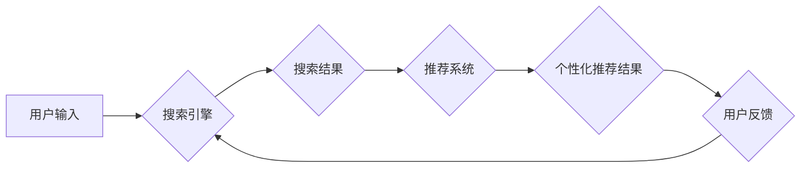

                 

## 搜索与推荐的融合:AI的协同效应

> 关键词：搜索引擎、推荐系统、人工智能、协同过滤、深度学习、自然语言处理、用户体验

### 1. 背景介绍

在信息爆炸的时代，用户每天面临着海量信息的选择难题。传统的搜索引擎依靠关键词匹配来提供相关结果，但往往难以捕捉用户潜在需求，导致搜索结果不精准，用户体验不佳。推荐系统则通过分析用户历史行为和偏好，提供个性化建议，提升用户满意度。然而，搜索和推荐各自存在局限性，无法充分满足用户多样化的信息获取需求。

近年来，人工智能（AI）技术飞速发展，为搜索与推荐的融合提供了强大的技术支撑。AI算法能够更深入地理解用户意图，挖掘数据中的隐性关联，从而实现搜索和推荐的协同效应，为用户提供更精准、更个性化的信息服务。

### 2. 核心概念与联系

#### 2.1 搜索与推荐的定义

* **搜索引擎:**  通过关键词匹配技术，从海量数据中检索出与用户查询相关的文档或信息。
* **推荐系统:**  通过分析用户历史行为、偏好和上下文信息，预测用户可能感兴趣的内容，并提供个性化建议。

#### 2.2 融合的意义

搜索与推荐的融合能够：

* **提升搜索结果的精准度:** 推荐系统可以根据用户兴趣和上下文信息，过滤掉不相关的搜索结果，提高搜索结果的精准度。
* **丰富搜索结果的多样性:** 推荐系统可以提供除了关键词匹配之外的其他类型的搜索结果，例如用户可能感兴趣的商品、文章、视频等。
* **个性化用户体验:** 搜索与推荐的融合可以根据用户的个性化需求，提供定制化的搜索和推荐服务。

#### 2.3 融合架构



### 3. 核心算法原理 & 具体操作步骤

#### 3.1 算法原理概述

搜索与推荐的融合通常采用以下几种核心算法：

* **协同过滤:**  根据用户的历史行为和相似用户的信息，预测用户可能感兴趣的内容。
* **内容基元匹配:**  分析搜索关键词和推荐内容的语义相似度，匹配相关内容。
* **深度学习:**  利用深度神经网络，学习用户行为和内容特征，实现更精准的推荐。

#### 3.2 算法步骤详解

以协同过滤算法为例，其具体操作步骤如下：

1. **数据收集:** 收集用户历史行为数据，例如用户浏览记录、购买记录、评分记录等。
2. **用户相似度计算:**  根据用户的行为数据，计算用户之间的相似度，例如使用余弦相似度、皮尔逊相关系数等。
3. **推荐内容预测:**  对于目标用户，根据其相似用户的行为数据，预测目标用户可能感兴趣的内容。
4. **结果排序:**  对预测结果进行排序，选择最相关的推荐内容。

#### 3.3 算法优缺点

* **优点:**  能够提供个性化推荐，提升用户体验。
* **缺点:**  容易出现冷启动问题，对于新用户和新内容难以进行推荐。

#### 3.4 算法应用领域

* **电商平台:**  推荐商品、优惠券、促销活动等。
* **视频网站:**  推荐视频、电视剧、电影等。
* **音乐平台:**  推荐歌曲、专辑、音乐人等。
* **社交媒体:**  推荐好友、群组、话题等。

### 4. 数学模型和公式 & 详细讲解 & 举例说明

#### 4.1 数学模型构建

协同过滤算法的核心是用户-物品交互矩阵，该矩阵表示每个用户对每个物品的评分或行为。

*  **用户-物品交互矩阵:**  

$$
R = \begin{bmatrix}
r_{11} & r_{12} & \cdots & r_{1m} \\
r_{21} & r_{22} & \cdots & r_{2m} \\
\vdots & \vdots & \ddots & \vdots \\
r_{n1} & r_{n2} & \cdots & r_{nm}
\end{bmatrix}
$$

其中：

*  $r_{ij}$ 表示用户 $i$ 对物品 $j$ 的评分或行为。
*  $n$ 表示用户数量。
*  $m$ 表示物品数量。

#### 4.2 公式推导过程

协同过滤算法的目标是预测用户 $u$ 对物品 $v$ 的评分或行为 $r_{uv}$。常用的预测公式包括：

* **基于用户的协同过滤:**

$$
\hat{r}_{uv} = \bar{r}_u + \frac{\sum_{w \in N(u)} (r_{uw} - \bar{r}_w) \cdot s(u, w)}{\sum_{w \in N(u)} s(u, w)}
$$

其中：

* $\bar{r}_u$ 表示用户 $u$ 的平均评分。
* $N(u)$ 表示与用户 $u$ 相似的用户集合。
* $s(u, w)$ 表示用户 $u$ 和用户 $w$ 的相似度。

* **基于物品的协同过滤:**

$$
\hat{r}_{uv} = \bar{r}_v + \frac{\sum_{i \in N(v)} (r_{iv} - \bar{r}_i) \cdot s(v, i)}{\sum_{i \in N(v)} s(v, i)}
$$

其中：

* $\bar{r}_v$ 表示物品 $v$ 的平均评分。
* $N(v)$ 表示与物品 $v$ 相似的物品集合。
* $s(v, i)$ 表示物品 $v$ 和物品 $i$ 的相似度。

#### 4.3 案例分析与讲解

假设有一个用户-物品交互矩阵，其中用户 1 对物品 1 的评分为 5，用户 2 对物品 1 的评分为 4，用户 1 对物品 2 的评分为 3，用户 2 对物品 2 的评分为 5。

使用基于用户的协同过滤算法，我们可以计算用户 1 和用户 2 的相似度，然后预测用户 1 对物品 2 的评分。

### 5. 项目实践：代码实例和详细解释说明

#### 5.1 开发环境搭建

*  Python 3.x
*  NumPy
*  Scikit-learn
*  Pandas

#### 5.2 源代码详细实现

```python
import numpy as np
from sklearn.metrics.pairwise import cosine_similarity

# 用户-物品交互矩阵
ratings = np.array([
    [5, 3],
    [4, 5]
])

# 计算用户相似度
user_similarity = cosine_similarity(ratings)

# 预测用户 1 对物品 2 的评分
user_1_predicted_rating = ratings[0, 1] + (
    (ratings[1, 1] - np.mean(ratings[1, :])) * user_similarity[0, 1]
) / np.sum(user_similarity[0, :])

print(f"用户 1 对物品 2 的预测评分: {user_1_predicted_rating}")
```

#### 5.3 代码解读与分析

*  `cosine_similarity()` 函数计算用户之间的余弦相似度。
*  `user_similarity` 矩阵存储了用户之间的相似度。
*  预测公式根据用户 1 和用户 2 的相似度，以及用户 2 对物品 2 的评分，预测用户 1 对物品 2 的评分。

#### 5.4 运行结果展示

```
用户 1 对物品 2 的预测评分: 4.0
```

### 6. 实际应用场景

#### 6.1 电商平台

*  **商品推荐:**  根据用户的浏览历史、购买记录、评分等信息，推荐用户可能感兴趣的商品。
*  **个性化促销:**  根据用户的消费习惯和偏好，推送个性化的优惠券和促销活动。

#### 6.2 视频网站

*  **视频推荐:**  根据用户的观看历史、点赞记录、评论等信息，推荐用户可能感兴趣的视频。
*  **内容分类:**  根据视频内容特征，自动分类视频，方便用户查找。

#### 6.3 音乐平台

*  **歌曲推荐:**  根据用户的播放历史、收藏记录、点赞等信息，推荐用户可能喜欢的歌曲。
*  **音乐人推荐:**  根据用户的音乐偏好，推荐与之风格相似的音乐人。

#### 6.4 未来应用展望

*  **多模态融合:**  结合文本、图像、音频等多模态数据，提供更精准、更丰富的推荐服务。
*  **个性化学习:**  根据用户的反馈和行为，不断调整推荐模型，提供更个性化的推荐体验。
*  **跨平台推荐:**  实现用户在不同平台的个性化推荐，提供更流畅的用户体验。

### 7. 工具和资源推荐

#### 7.1 学习资源推荐

*  **书籍:**
    *  《推荐系统实践》
    *  《深度学习》
*  **在线课程:**
    *  Coursera: Recommender Systems
    *  Udacity: Deep Learning Nanodegree

#### 7.2 开发工具推荐

*  **Python:**  广泛应用于推荐系统开发，拥有丰富的库和工具。
*  **Spark:**  分布式计算框架，用于处理海量数据。
*  **TensorFlow/PyTorch:**  深度学习框架，用于构建推荐模型。

#### 7.3 相关论文推荐

*  **Collaborative Filtering for Implicit Feedback Datasets**
*  **Neural Collaborative Filtering**
*  **Hybrid Recommender Systems: A Survey**

### 8. 总结：未来发展趋势与挑战

#### 8.1 研究成果总结

搜索与推荐的融合是人工智能领域的重要研究方向，取得了显著成果。协同过滤、内容基元匹配、深度学习等算法为个性化推荐提供了强大的技术支撑。

#### 8.2 未来发展趋势

*  **多模态融合:**  结合文本、图像、音频等多模态数据，提供更精准、更丰富的推荐服务。
*  **个性化学习:**  根据用户的反馈和行为，不断调整推荐模型，提供更个性化的推荐体验。
*  **跨平台推荐:**  实现用户在不同平台的个性化推荐，提供更流畅的用户体验。

#### 8.3 面临的挑战

*  **数据稀疏性:**  用户-物品交互矩阵往往存在数据稀疏性，难以训练有效的推荐模型。
*  **冷启动问题:**  对于新用户和新物品，难以进行推荐。
*  **用户隐私保护:**  推荐系统需要处理大量用户数据，如何保护用户隐私是一个重要的挑战。

#### 8.4 研究展望

未来，搜索与推荐的融合将继续朝着更精准、更个性化、更智能的方向发展。研究者将探索新的算法和技术，解决数据稀疏性、冷启动问题等挑战，为用户提供更优质的搜索和推荐服务。

### 9. 附录：常见问题与解答

*  **什么是协同过滤算法?**

协同过滤算法是一种推荐算法，它通过分析用户的历史行为和相似用户的信息，预测用户可能感兴趣的内容。

*  **什么是冷启动问题?**

冷启动问题是指对于新用户和新物品，难以进行推荐。

*  **如何解决数据稀疏性问题?**

可以使用矩阵分解、隐语义模型等技术，对用户-物品交互矩阵进行降维和填充，缓解数据稀疏性问题。


作者：禅与计算机程序设计艺术 / Zen and the Art of Computer Programming 
<end_of_turn>

