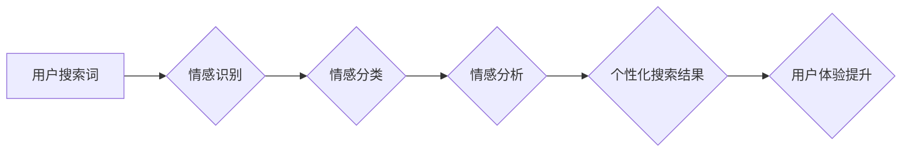

                 

## 搜索引擎的情感智能发展

> 关键词：搜索引擎、情感智能、自然语言处理、机器学习、深度学习、用户体验、个性化推荐

## 1. 背景介绍

搜索引擎作为信息获取的入口，一直致力于提供更精准、更便捷的搜索体验。然而，传统的搜索引擎主要基于关键词匹配和网页排名算法，缺乏对用户情感需求的理解和响应。随着人工智能技术的快速发展，特别是自然语言处理（NLP）和机器学习（ML）领域的突破，搜索引擎开始探索情感智能的发展方向，旨在理解用户的意图、情感和需求，提供更加个性化、人性化的搜索服务。

## 2. 核心概念与联系

情感智能是指人工智能系统能够识别、理解和响应人类情感的能力。在搜索引擎领域，情感智能的应用主要体现在以下几个方面：

* **情感识别:** 分析用户搜索词、点击行为、浏览记录等数据，识别用户的潜在情感倾向，例如快乐、悲伤、愤怒、焦虑等。
* **情感分类:** 将用户的情感倾向归类到预定义的类别中，例如积极、消极、中性等。
* **情感分析:** 对用户的情感表达进行深入分析，理解其背后的原因和意图。
* **情感响应:** 根据用户的情感状态，提供相应的个性化搜索结果、推荐内容和服务。

**核心概念与架构流程图:**



## 3. 核心算法原理 & 具体操作步骤

### 3.1  算法原理概述

情感智能算法主要基于自然语言处理（NLP）和机器学习（ML）技术。

* **自然语言处理（NLP）:** 用于分析和理解文本中的情感信息。常用的NLP技术包括词性标注、依存句法分析、情感词典构建等。
* **机器学习（ML）:** 用于训练情感识别和分类模型。常用的ML算法包括支持向量机（SVM）、随机森林（RF）、深度学习（DL）等。

### 3.2  算法步骤详解

1. **数据收集:** 收集用户搜索词、点击行为、浏览记录等数据，并进行预处理，例如去除停用词、标点符号等。
2. **特征提取:** 从文本数据中提取情感相关的特征，例如情感词、词性、语法结构等。
3. **模型训练:** 使用机器学习算法对训练数据进行训练，建立情感识别和分类模型。
4. **模型评估:** 使用测试数据对模型进行评估，并根据评估结果进行模型调优。
5. **模型部署:** 将训练好的模型部署到搜索引擎系统中，用于实时分析用户情感。

### 3.3  算法优缺点

**优点:**

* 可以更精准地理解用户的意图和需求。
* 可以提供更加个性化和人性化的搜索体验。
* 可以帮助企业更好地了解用户情感，改进产品和服务。

**缺点:**

* 情感识别技术还存在一定的误差率。
* 需要大量的训练数据才能训练出准确的模型。
* 存在隐私和伦理方面的挑战。

### 3.4  算法应用领域

* **搜索引擎:** 提供个性化搜索结果、情感相关的推荐内容。
* **电商平台:** 分析用户对商品的情感评价，改进商品推荐和营销策略。
* **社交媒体:** 监测用户情绪，识别潜在的风险和危机。
* **客服系统:** 自动识别用户的情感状态，提供更有效的客服服务。

## 4. 数学模型和公式 & 详细讲解 & 举例说明

### 4.1  数学模型构建

情感分析模型通常基于文本分类任务，可以使用概率模型来表示情感分类的可能性。例如，可以使用贝叶斯公式来计算给定文本的特定情感类别的概率。

$$P(C|T) = \frac{P(T|C)P(C)}{P(T)}$$

其中：

* $P(C|T)$ 是给定文本 $T$ 的情感类别 $C$ 的概率。
* $P(T|C)$ 是给定情感类别 $C$ 的文本 $T$ 的概率。
* $P(C)$ 是情感类别 $C$ 的先验概率。
* $P(T)$ 是文本 $T$ 的概率。

### 4.2  公式推导过程

贝叶斯公式的推导过程基于条件概率的定义和乘法定理。

* 条件概率：$P(A|B) = \frac{P(A \cap B)}{P(B)}$

* 乘法定理：$P(A \cap B) = P(A|B)P(B)$

通过将这些公式应用于贝叶斯公式，可以得到上述公式的推导过程。

### 4.3  案例分析与讲解

假设我们有一个情感词典，其中包含一些情感词及其对应的类别，例如“快乐”属于积极类别，“悲伤”属于消极类别。

如果用户搜索词为“今天天气真好”，我们可以根据情感词典中的词语“真好”属于积极类别，推断出用户的搜索意图为积极的情感。

## 5. 项目实践：代码实例和详细解释说明

### 5.1  开发环境搭建

* Python 3.x
* TensorFlow 或 PyTorch
* NLTK 或 SpaCy

### 5.2  源代码详细实现

```python
import nltk
from nltk.sentiment import SentimentIntensityAnalyzer

# 下载情感分析模型
nltk.download('vader_lexicon')

# 初始化情感分析器
analyzer = SentimentIntensityAnalyzer()

# 用户搜索词
text = "今天天气真好"

# 分析用户情感
scores = analyzer.polarity_scores(text)

# 打印情感得分
print(scores)
```

### 5.3  代码解读与分析

* 该代码首先导入必要的库，包括NLTK和SentimentIntensityAnalyzer。
* 然后下载情感分析模型“vader_lexicon”。
* 初始化情感分析器analyzer。
* 将用户搜索词作为输入，使用analyzer.polarity_scores()函数进行情感分析。
* 最后打印情感得分，包括正面、负面、中性以及总分。

### 5.4  运行结果展示

```
{'neg': 0.0, 'neu': 0.291, 'pos': 0.709, 'compound': 0.9033}
```

结果表明，用户搜索词“今天天气真好”的情感倾向为积极的。

## 6. 实际应用场景

### 6.1  个性化搜索结果

根据用户的搜索词和情感倾向，搜索引擎可以提供更加个性化的搜索结果。例如，如果用户搜索“旅行”并且情感倾向为积极，搜索引擎可以推荐一些风景优美、体验丰富的旅行目的地；如果用户搜索“旅行”并且情感倾向为消极，搜索引擎可以推荐一些价格优惠、交通便利的旅行方案。

### 6.2  情感相关的推荐内容

搜索引擎可以根据用户的搜索历史、浏览记录和情感倾向，推荐一些情感相关的新闻、文章、视频和音乐。例如，如果用户经常搜索关于宠物的新闻，并且情感倾向为积极，搜索引擎可以推荐一些关于宠物的 heartwarming 故事和视频。

### 6.3  情感分析客服系统

搜索引擎可以将情感分析技术应用于客服系统，帮助企业更好地理解用户的需求和问题。例如，如果用户在搜索引擎上提问，并且情感倾向为负面，客服系统可以优先处理该用户的请求，并提供更有效的解决方案。

### 6.4  未来应用展望

随着人工智能技术的不断发展，搜索引擎的情感智能将会有更加广泛的应用场景。例如，可以用于教育领域，帮助学生更好地理解文本内容和作者的情感表达；可以用于医疗领域，帮助医生识别患者的情绪状态，提供更精准的诊断和治疗方案；可以用于金融领域，帮助金融机构更好地理解客户的需求，提供更个性化的金融服务。

## 7. 工具和资源推荐

### 7.1  学习资源推荐

* **Stanford NLP Group:** https://nlp.stanford.edu/
* **NLTK Book:** https://www.nltk.org/book/
* **SpaCy Documentation:** https://spacy.io/usage/

### 7.2  开发工具推荐

* **TensorFlow:** https://www.tensorflow.org/
* **PyTorch:** https://pytorch.org/
* **Hugging Face Transformers:** https://huggingface.co/transformers/

### 7.3  相关论文推荐

* **Sentiment Analysis with Deep Learning:** https://arxiv.org/abs/1806.03971
* **BERT: Pre-training of Deep Bidirectional Transformers for Language Understanding:** https://arxiv.org/abs/1810.04805

## 8. 总结：未来发展趋势与挑战

### 8.1  研究成果总结

搜索引擎的情感智能发展取得了显著的进展，能够识别、理解和响应用户的多种情感需求。

### 8.2  未来发展趋势

* **更精准的情感识别:** 利用更先进的深度学习算法和情感词典，提高情感识别的准确率和细粒度。
* **跨语言的情感分析:** 将情感分析技术应用于多种语言，实现跨语言的情感理解。
* **多模态的情感智能:** 将文本、语音、图像等多模态数据融合，构建更全面的情感分析模型。

### 8.3  面临的挑战

* **数据标注的困难:** 情感分析模型需要大量的标注数据，而标注数据成本高、效率低。
* **情感表达的多样性:** 人类情感表达丰富多样，难以用简单的分类模型完全覆盖。
* **隐私和伦理问题:** 情感分析技术可能会侵犯用户的隐私，需要谨慎处理相关伦理问题。

### 8.4  研究展望

未来，搜索引擎的情感智能将继续朝着更精准、更智能、更人性化的方向发展，为用户提供更加个性化、便捷、愉悦的搜索体验。


## 9. 附录：常见问题与解答

**Q1: 情感分析模型的准确率如何？**

A1: 情感分析模型的准确率取决于多种因素，例如训练数据质量、模型复杂度、情感表达的复杂度等。目前，先进的情感分析模型的准确率可以达到80%以上。

**Q2: 情感分析技术会侵犯用户的隐私吗？**

A2: 情感分析技术可能会涉及到用户的个人情感信息，因此需要谨慎处理相关隐私问题。例如，收集和使用用户情感数据需要获得用户的明确同意，并采取相应的安全措施保护用户数据。

**Q3: 如何选择合适的搜索引擎情感智能服务？**

A3: 选择合适的搜索引擎情感智能服务需要考虑以下因素：

* **准确率:** 选择准确率高的服务，能够更精准地识别用户的意图和情感。
* **功能:** 选择功能丰富的服务，能够满足您的具体需求，例如个性化推荐、情感分析客服等。
* **价格:** 选择性价比高的服务，根据您的预算选择合适的方案。


作者：禅与计算机程序设计艺术 / Zen and the Art of Computer Programming 
<end_of_turn>

