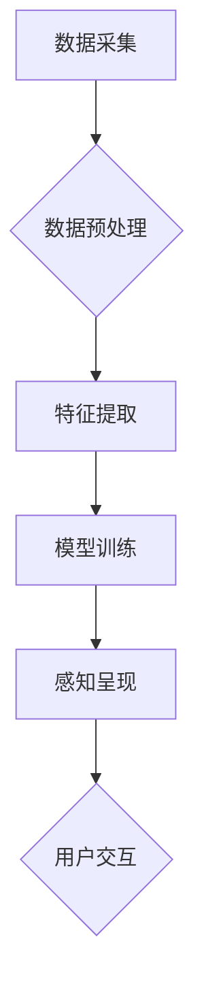

                 

## 数字化第六感开发包：AI辅助的超感知能力培养

> 关键词：人工智能、超感知、数字化第六感、AI辅助、感知增强、数据分析、机器学习、深度学习、神经网络

## 1. 背景介绍

人类拥有五官感知世界，但随着科技发展，我们渴望超越肉眼、肉耳的局限，获得更深层次、更广阔的感知能力。这便是“数字化第六感”的雏形。

数字化第六感并非单纯指增强现有感官，而是通过人工智能技术，将数据转化为人类可理解的感知信息，从而拓展人类认知边界。它将数据分析、机器学习、深度学习等技术与人类认知相结合，赋予我们“超感知”的能力，让我们洞察隐藏在数据背后的规律和趋势。

## 2. 核心概念与联系

**2.1  超感知能力**

超感知能力是指超越人类传统五官感知范围的能力，例如：

* **超视觉感知:** 识别隐藏在图像中的微小细节，甚至感知到肉眼无法察觉的红外线或紫外线信息。
* **超听觉感知:** 捕捉到人类听不到的超声波或低频声音，识别出隐藏在噪音中的特定声音。
* **超嗅觉感知:** 识别出微量的气体或气味，例如疾病早期诊断、环境监测等。
* **超触觉感知:** 感知物体表面细微的纹理和温度变化，例如盲人识别物体形状。

**2.2  数字化第六感开发包**

数字化第六感开发包是一个集数据采集、预处理、分析、模型训练、感知呈现等功能于一体的软件平台，旨在帮助开发者构建和应用超感知能力。

**2.3  AI辅助感知增强**

AI技术在数字化第六感开发包中扮演着核心角色，通过以下方式辅助感知增强：

* **数据分析:** AI算法可以从海量数据中提取有价值的信息，识别出人类难以察觉的模式和趋势。
* **模型训练:** 基于深度学习技术，AI模型可以学习并模拟人类感知机制，从而实现对特定信息的识别和分析。
* **感知呈现:** AI技术可以将数据分析结果转化为人类可理解的视觉、听觉、触觉等形式，例如生成图像、声音、虚拟现实体验等。

**2.4  架构图**



## 3. 核心算法原理 & 具体操作步骤

**3.1  算法原理概述**

数字化第六感开发包的核心算法主要基于深度学习技术，特别是卷积神经网络（CNN）和循环神经网络（RNN）。

* **CNN:** 擅长处理图像、视频等视觉数据，可以识别图像中的物体、场景、纹理等信息。
* **RNN:** 擅长处理序列数据，例如文本、语音等，可以识别语音、翻译语言、生成文本等。

**3.2  算法步骤详解**

1. **数据采集:** 收集与目标感知类型相关的原始数据，例如图像、音频、文本等。
2. **数据预处理:** 对原始数据进行清洗、格式化、增强等处理，使其适合深度学习模型训练。
3. **特征提取:** 使用CNN或RNN等深度学习模型，从数据中提取关键特征，例如图像中的边缘、纹理、颜色等，或文本中的词语、语法结构等。
4. **模型训练:** 使用训练数据和提取的特征，训练深度学习模型，使其能够识别和分析目标信息。
5. **模型评估:** 使用测试数据评估模型的性能，例如识别准确率、召回率等。
6. **感知呈现:** 将模型分析结果转化为人类可理解的感知形式，例如生成图像、声音、虚拟现实体验等。

**3.3  算法优缺点**

**优点:**

* **高精度:** 深度学习模型能够学习复杂的模式和关系，实现高精度的感知分析。
* **自动化:** 模型训练和感知呈现过程可以自动化，降低人工成本。
* **可扩展性:** 深度学习模型可以应用于多种感知类型，并可以根据需要进行扩展和改进。

**缺点:**

* **数据依赖:** 深度学习模型需要大量数据进行训练，数据质量直接影响模型性能。
* **计算资源:** 训练深度学习模型需要大量的计算资源，成本较高。
* **解释性:** 深度学习模型的决策过程较为复杂，难以解释其背后的逻辑。

**3.4  算法应用领域**

数字化第六感开发包的应用领域非常广泛，例如：

* **医疗诊断:** 识别疾病早期症状、辅助医生诊断。
* **安防监控:** 识别异常行为、预防犯罪。
* **工业检测:** 检测产品缺陷、提高生产效率。
* **环境监测:** 监测空气质量、水质等环境指标。
* **智能家居:** 识别用户需求、提供个性化服务。

## 4. 数学模型和公式 & 详细讲解 & 举例说明

**4.1  数学模型构建**

深度学习模型的核心是神经网络，其结构由多个层组成，每层包含多个神经元。神经元之间通过权重连接，传递信息。

**4.2  公式推导过程**

神经网络的学习过程是通过调整权重来最小化误差。常用的优化算法包括梯度下降法、Adam算法等。

* **梯度下降法:** 通过计算误差对权重的梯度，不断更新权重，使其朝着最小误差的方向调整。
* **Adam算法:** 结合了梯度下降法的优点，并引入了动量项和自适应学习率，可以更快地收敛到最优解。

**4.3  案例分析与讲解**

以图像识别为例，CNN模型可以将图像转换为特征向量，然后使用softmax函数将特征向量映射到不同的类别。

$$
y = softmax(W x + b)
$$

其中：

* $y$ 是预测的类别概率分布。
* $x$ 是图像特征向量。
* $W$ 是权重矩阵。
* $b$ 是偏置向量。

**4.4  举例说明**

假设我们训练了一个CNN模型识别猫和狗的图像。模型训练完成后，当输入一张猫的图像时，模型会输出一个概率分布，其中“猫”的概率较高，而“狗”的概率较低。

## 5. 项目实践：代码实例和详细解释说明

**5.1  开发环境搭建**

* **操作系统:** Linux、macOS、Windows
* **编程语言:** Python
* **深度学习框架:** TensorFlow、PyTorch
* **其他工具:** Jupyter Notebook、Git

**5.2  源代码详细实现**

以下是一个简单的图像分类代码示例，使用TensorFlow框架实现：

```python
import tensorflow as tf

# 定义模型结构
model = tf.keras.models.Sequential([
    tf.keras.layers.Conv2D(32, (3, 3), activation='relu', input_shape=(28, 28, 1)),
    tf.keras.layers.MaxPooling2D((2, 2)),
    tf.keras.layers.Conv2D(64, (3, 3), activation='relu'),
    tf.keras.layers.MaxPooling2D((2, 2)),
    tf.keras.layers.Flatten(),
    tf.keras.layers.Dense(10, activation='softmax')
])

# 编译模型
model.compile(optimizer='adam',
              loss='sparse_categorical_crossentropy',
              metrics=['accuracy'])

# 训练模型
model.fit(x_train, y_train, epochs=10)

# 评估模型
loss, accuracy = model.evaluate(x_test, y_test)
print('Test loss:', loss)
print('Test accuracy:', accuracy)
```

**5.3  代码解读与分析**

* 代码定义了一个简单的CNN模型，包含卷积层、池化层、全连接层等。
* 模型使用Adam优化器、交叉熵损失函数和准确率指标进行训练。
* 训练过程使用训练数据进行迭代，不断调整模型参数，使其能够准确分类图像。
* 评估过程使用测试数据评估模型的性能。

**5.4  运行结果展示**

训练完成后，模型可以用于识别新的图像。

## 6. 实际应用场景

**6.1  医疗诊断**

* **癌症早期诊断:** 利用深度学习模型分析医学影像数据，识别癌症早期症状，提高诊断准确率。
* **疾病风险预测:** 分析患者的医疗历史、基因信息等数据，预测疾病风险，帮助医生制定个性化治疗方案。

**6.2  安防监控**

* **人脸识别:** 利用深度学习模型识别人脸，实现身份验证、监控等功能。
* **异常行为检测:** 分析视频数据，识别异常行为，例如入侵、暴动等，提高安防效率。

**6.3  工业检测**

* **产品缺陷检测:** 利用深度学习模型分析产品图像，识别缺陷，提高产品质量。
* **生产过程监控:** 分析生产过程中的数据，识别异常情况，提高生产效率。

**6.4  未来应用展望**

数字化第六感开发包的应用前景广阔，未来将应用于更多领域，例如：

* **智能驾驶:** 增强车辆感知能力，提高驾驶安全性和智能化水平。
* **虚拟现实:** 提供更沉浸式的虚拟体验，例如虚拟旅游、虚拟培训等。
* **个性化教育:** 根据学生的学习情况，提供个性化的学习内容和辅导。

## 7. 工具和资源推荐

**7.1  学习资源推荐**

* **书籍:**
    * 深度学习
    * 人工智能：一种现代方法
* **在线课程:**
    * Coursera: 深度学习
    * Udacity: 
    * fast.ai: 深度学习课程
* **博客和网站:**
    * TensorFlow博客
    * PyTorch博客
    * 机器学习 Mastery

**7.2  开发工具推荐**

* **深度学习框架:** TensorFlow、PyTorch、Keras
* **数据处理工具:** Pandas、NumPy
* **可视化工具:** Matplotlib、Seaborn
* **云计算平台:** AWS、Google Cloud、Azure

**7.3  相关论文推荐**

* AlexNet: ImageNet Classification with Deep Convolutional Neural Networks
* VGGNet: Very Deep Convolutional Networks for Large-Scale Image Recognition
* ResNet: Deep Residual Learning for Image Recognition

## 8. 总结：未来发展趋势与挑战

**8.1  研究成果总结**

数字化第六感开发包在图像识别、语音识别、自然语言处理等领域取得了显著成果，为人类感知能力的拓展提供了新的可能性。

**8.2  未来发展趋势**

* **模型更深更广:** 探索更深层次、更广阔的网络结构，提高模型的表达能力和泛化能力。
* **数据更丰富更精准:** 收集更丰富、更精准的数据，提高模型训练的质量。
* **应用更广泛更深入:** 将数字化第六感应用于更多领域，例如医疗、教育、娱乐等，并深入到人们日常生活。

**8.3  面临的挑战**

* **数据隐私和安全:** 数字化第六感开发包需要处理大量个人数据，如何保障数据隐私和安全是一个重要挑战。
* **算法解释性和可信度:** 深度学习模型的决策过程较为复杂，难以解释其背后的逻辑，如何提高算法的解释性和可信度是一个关键问题。
* **伦理和社会影响:** 数字化第六感技术的应用可能会带来一些伦理和社会问题，例如就业替代、算法偏见等，需要进行深入的探讨和研究。

**8.4  研究展望**

未来，数字化第六感开发包将继续朝着更智能、更安全、更可解释的方向发展，为人类社会带来更多福祉。


## 9. 附录：常见问题与解答

**9.1  Q: 如何选择合适的深度学习框架？**

**A:** TensorFlow和PyTorch是目前最流行的深度学习框架，各有优缺点。TensorFlow更适合于生产环境，PyTorch更灵活易用。选择框架时需要根据自己的需求和经验进行选择。

**9.2  Q: 如何处理不平衡的数据集？**

**A:** 不平衡的数据集会导致模型训练效果不佳。常用的处理方法包括：

* **数据增强:** 增加少数类样本的数量。
* **权重调整:** 给少数类样本赋予更高的权重。
* **过采样/欠采样:** 

**9.3  Q: 如何评估模型的性能？**

**A:** 常见的模型评估指标包括准确率、召回率、F1-score、AUC等。选择合适的评估指标需要根据具体的应用场景进行选择。


作者：禅与计算机程序设计艺术 / Zen and the Art of Computer Programming 
<end_of_turn>

