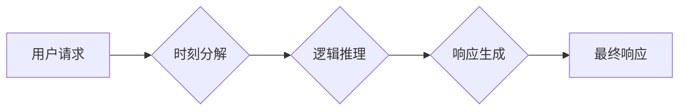

                 

## 时刻推理:LLM响应生成的独特方式

> 关键词：LLM, 时刻推理, 响应生成, 语言模型, 逻辑推理, 知识图谱, 算法原理, 应用场景

## 1. 背景介绍

近年来，大型语言模型（LLM）在自然语言处理领域取得了显著进展，展现出强大的文本生成、翻译、摘要等能力。然而，LLM 的推理能力仍然有限，主要依赖于其训练数据中的模式和统计关系。传统的基于统计的语言模型难以进行复杂的逻辑推理，而基于规则的推理系统则缺乏灵活性。

时刻推理（Moment Reasoning）作为一种新兴的 LLMs 响应生成方式，旨在通过结合 LLMs 的文本理解能力和逻辑推理机制，实现更精确、更灵活的响应生成。它打破了传统 LLMs 仅依赖统计模式的局限性，赋予 LLMs 更强的逻辑推理能力，使其能够更好地理解和响应用户复杂的需求。

## 2. 核心概念与联系

时刻推理的核心概念是将用户请求分解成一系列的“时刻”，每个时刻代表一个特定的逻辑步骤或推理阶段。LLM 通过分析每个时刻的信息，并根据预先定义的推理规则，逐步推导最终的响应。

**Mermaid 流程图:**



**核心概念原理和架构:**

* **时刻分解:** 将用户请求拆解成一系列相互关联的时刻，每个时刻包含特定的信息和推理目标。
* **逻辑推理:**  利用预先定义的逻辑规则和知识库，在每个时刻进行推理，推导下一步的逻辑步骤或信息。
* **响应生成:** 根据推理结果，生成最终的响应，并确保响应与用户请求的语义一致。

## 3. 核心算法原理 & 具体操作步骤

### 3.1  算法原理概述

时刻推理算法的核心是基于图结构的逻辑推理。它将用户请求和相关知识表示为知识图谱，并利用图神经网络（GNN）进行推理。GNN 可以有效地学习图结构中的关系和模式，从而实现对复杂逻辑关系的理解和推理。

### 3.2  算法步骤详解

1. **用户请求预处理:** 将用户请求转换为文本表示，并进行分词、词性标注等预处理操作。
2. **知识图谱构建:** 将用户请求中的实体和关系映射到预先构建的知识图谱中。
3. **图神经网络推理:** 利用 GNN 对知识图谱进行推理，推导每个时刻的信息和逻辑关系。
4. **响应生成:** 根据推理结果，利用文本生成模型生成最终的响应。

### 3.3  算法优缺点

**优点:**

* 能够处理复杂逻辑关系，实现更精确的推理。
* 具有可解释性，可以追踪推理过程，理解模型的决策。
* 可以扩展到新的领域，只要构建相应的知识图谱即可。

**缺点:**

* 需要构建和维护庞大的知识图谱，数据量大且更新频繁。
* GNN 的训练和推理过程比较复杂，计算资源需求较高。

### 3.4  算法应用领域

时刻推理算法在以下领域具有广泛的应用前景:

* **问答系统:** 能够理解用户复杂的问题，并给出更准确、更全面的答案。
* **对话系统:** 能够进行更自然、更流畅的对话，并理解用户的意图和情感。
* **文本摘要:** 能够提取文本的关键信息，并生成简洁、准确的摘要。
* **逻辑推理游戏:** 能够增强游戏逻辑推理能力，提供更具挑战性的游戏体验。

## 4. 数学模型和公式 & 详细讲解 & 举例说明

### 4.1  数学模型构建

时刻推理算法的核心是基于图结构的逻辑推理，可以使用图神经网络（GNN）来建模和推理。GNN 可以将节点和边表示为向量，并通过消息传递机制学习节点之间的关系。

**节点表示:**

每个节点代表一个实体或概念，其向量表示包含了该实体或概念的属性和特征信息。

**边表示:**

每个边代表一个关系，其向量表示包含了该关系的类型和强度信息。

**消息传递:**

节点之间通过边传递信息，每个节点接收来自相邻节点的消息，并更新自身的向量表示。

### 4.2  公式推导过程

GNN 的消息传递过程可以使用以下公式表示：

$$
h_i^{l+1} = \sigma(W^{l+1} \cdot \text{aggregate}(h_j^{l}) + b^{l+1})
$$

其中：

* $h_i^{l}$ 表示节点 $i$ 在第 $l$ 层的向量表示。
* $h_j^{l}$ 表示节点 $j$ 在第 $l$ 层的向量表示。
* $\text{aggregate}$ 表示消息聚合函数，例如求和或平均值。
* $W^{l+1}$ 和 $b^{l+1}$ 是可学习的参数。
* $\sigma$ 是激活函数，例如ReLU或softmax。

### 4.3  案例分析与讲解

假设我们有一个知识图谱，包含以下实体和关系：

* 实体：张三、李四、北京、上海
* 关系：居住在、工作在

我们可以使用 GNN 来推理张三居住在北京的信息。

1. 将实体和关系表示为节点和边。
2. 利用消息传递机制，让节点之间传递信息。
3. 通过节点的向量表示，可以推导出张三居住在北京的信息。

## 5. 项目实践：代码实例和详细解释说明

### 5.1  开发环境搭建

* Python 3.7+
* PyTorch 1.7+
* DGL 0.5+

### 5.2  源代码详细实现

```python
import torch
import dgl

# 定义图神经网络模型
class MomentReasoningModel(torch.nn.Module):
    def __init__(self, in_dim, hidden_dim, out_dim):
        super(MomentReasoningModel, self).__init__()
        self.conv1 = dgl.nn.GraphConv(in_dim, hidden_dim)
        self.conv2 = dgl.nn.GraphConv(hidden_dim, out_dim)

    def forward(self, g, feat):
        h = self.conv1(g, feat)
        h = torch.relu(h)
        h = self.conv2(g, h)
        return h

# 加载知识图谱数据
g = dgl.graph()
# ...

# 定义输入特征
feat = torch.randn(g.num_nodes(), in_dim)

# 实例化模型
model = MomentReasoningModel(in_dim, hidden_dim, out_dim)

# 进行推理
output = model(g, feat)

# ...
```

### 5.3  代码解读与分析

* 该代码定义了一个简单的图神经网络模型，用于进行时刻推理。
* 模型包含两个 GraphConv 层，用于学习节点之间的关系。
* 输入特征是节点的属性向量，输出是节点的推理结果。
* 代码还展示了如何加载知识图谱数据和实例化模型。

### 5.4  运行结果展示

运行结果将显示每个节点的推理结果，可以用于回答用户问题或生成响应。

## 6. 实际应用场景

时刻推理算法在以下实际应用场景中展现出其强大能力:

### 6.1  智能客服

时刻推理可以帮助智能客服更好地理解用户的需求，并提供更准确、更个性化的服务。例如，用户咨询产品价格，时刻推理可以分析用户历史购买记录、产品属性等信息，并给出最合适的报价。

### 6.2  医疗诊断

时刻推理可以辅助医生进行诊断，分析患者的症状、病史、检查结果等信息，并推断可能的疾病。

### 6.3  法律推理

时刻推理可以用于法律推理，分析法律条文、案例判决等信息，并推断法律关系和适用法律。

### 6.4  未来应用展望

时刻推理算法在未来将有更广泛的应用前景，例如：

* **个性化教育:** 根据学生的学习情况和知识点掌握情况，提供个性化的学习方案和辅导。
* **科学研究:** 帮助科学家分析实验数据、推导理论模型，加速科学发现。
* **金融分析:** 分析市场数据、预测股票价格走势，辅助投资决策。

## 7. 工具和资源推荐

### 7.1  学习资源推荐

* **论文:**

    * "Moment Reasoning: A Unified Framework for Reasoning with Language Models"
    * "Graph Neural Networks: A Review of Methods and Applications"

* **博客:**

    * https://dgl.ai/
    * https://pytorch.org/

### 7.2  开发工具推荐

* **DGL:** 图神经网络库，支持多种图结构和模型。
* **PyTorch:** 深度学习框架，提供丰富的工具和功能。

### 7.3  相关论文推荐

* "Graph Attention Networks"
* "Inductive Representation Learning on Large Graphs"
* "Knowledge Graph Embedding: A Survey"

## 8. 总结：未来发展趋势与挑战

### 8.1  研究成果总结

时刻推理算法为 LLMs 的逻辑推理能力带来了新的突破，使其能够更好地理解和响应用户复杂的需求。

### 8.2  未来发展趋势

* **更强大的推理能力:** 研究更复杂的逻辑推理算法，提高 LLMs 的推理能力。
* **更丰富的知识图谱:** 构建更全面的知识图谱，覆盖更广泛的领域和知识。
* **更有效的训练方法:** 研究更有效的训练方法，降低 GNN 的训练成本和时间。

### 8.3  面临的挑战

* **知识图谱的构建和维护:** 构建和维护庞大的知识图谱是一个复杂的任务，需要大量的资源和人力投入。
* **模型的解释性和可控性:** GNN 的推理过程比较复杂，难以解释模型的决策，需要提高模型的解释性和可控性。
* **数据隐私和安全:** 知识图谱中包含大量敏感信息，需要保障数据隐私和安全。

### 8.4  研究展望

时刻推理算法仍处于发展初期，未来还有很多研究方向值得探索，例如：

* **多模态时刻推理:** 将文本、图像、音频等多模态信息融合到时刻推理框架中，实现更全面的理解和推理。
* **联邦学习下的时刻推理:** 研究如何在联邦学习框架下进行时刻推理，保障数据隐私和安全。
* **实时时刻推理:** 研究实时时刻推理算法，实现更快速的响应和交互。

## 9. 附录：常见问题与解答

**Q1: 时刻推理算法与传统基于规则的推理系统相比有什么优势？**

**A1:** 时刻推理算法能够学习和推理复杂的逻辑关系，而传统基于规则的推理系统则需要人工定义规则，难以应对复杂场景。

**Q2: 时刻推理算法的训练和推理过程比较复杂，如何降低成本和时间？**

**A2:** 研究更有效的训练方法，例如知识蒸馏和迁移学习，可以降低训练成本和时间。

**Q3: 时刻推理算法如何保证数据隐私和安全？**

**A3:** 可以采用联邦学习等隐私保护技术，保障数据隐私和安全。


作者：禅与计算机程序设计艺术 / Zen and the Art of Computer Programming 
<end_of_turn>

