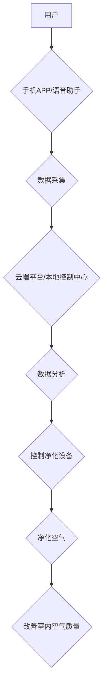

                 

## 智能家居空气净化创业：全屋空气质量管理

> 关键词：智能家居、空气净化、传感器、物联网、机器学习、数据分析、健康监测、算法优化

## 1. 背景介绍

随着人们生活水平的提高和对健康生活的追求，空气质量问题日益受到关注。室内空气污染已成为影响人们健康的重要因素之一，而智能家居的兴起为解决这一问题提供了新的思路。智能家居空气净化系统能够实时监测室内空气质量，并根据实际情况自动调节净化设备的工作状态，从而有效改善室内空气环境，保障人们的健康。

当前，市场上已有许多独立的空气净化器，但它们往往局限于单个房间的净化，无法实现全屋空气质量的统一管理。智能家居空气净化系统则可以突破这一局限性，通过传感器网络、物联网技术和数据分析算法，实现对全屋空气的实时监测、分析和控制，为用户提供更智能、更便捷、更全面的空气净化解决方案。

## 2. 核心概念与联系

### 2.1 智能家居空气净化系统架构

智能家居空气净化系统主要由以下几个核心模块组成：

* **传感器网络:** 用于实时监测室内空气质量，包括PM2.5、TVOC、二氧化碳、湿度、温度等指标。
* **数据采集与传输:** 将传感器采集到的数据传输到云端平台或本地控制中心。
* **云端平台/本地控制中心:** 对数据进行分析处理，并根据预设规则或用户指令控制净化设备的工作状态。
* **净化设备:** 根据控制指令，自动调节净化效率和风速，实现对室内空气的净化。
* **用户界面:** 用户可以通过手机APP、语音助手等方式查看空气质量数据、设置净化模式、控制设备工作状态等。

**Mermaid 流程图:**



### 2.2 核心概念原理

* **传感器技术:** 采用多种传感器技术，例如激光散射、化学传感器、电化学传感器等，实现对不同空气污染物成分的精准检测。
* **物联网技术:** 利用物联网技术，将传感器、净化设备、云端平台等设备连接起来，实现数据实时传输和设备远程控制。
* **数据分析算法:** 采用机器学习、数据挖掘等算法，对传感器采集到的数据进行分析处理，识别空气污染源头，预测空气质量变化趋势，并制定相应的净化策略。

## 3. 核心算法原理 & 具体操作步骤

### 3.1 算法原理概述

智能家居空气净化系统的核心算法主要包括以下几个方面：

* **空气质量预测算法:** 利用历史空气质量数据、天气预报、用户行为等信息，预测未来一段时间内的空气质量变化趋势。
* **净化策略优化算法:** 根据预测结果和用户需求，优化净化设备的工作状态，例如风速、净化模式等，以达到最佳的净化效果。
* **污染源识别算法:** 分析传感器数据，识别室内空气污染的来源，例如烹饪、吸烟、宠物等，并提供相应的解决方案。

### 3.2 算法步骤详解

**空气质量预测算法:**

1. 收集历史空气质量数据、天气预报、用户行为等信息。
2. 使用机器学习算法，例如ARIMA、LSTM等，建立空气质量预测模型。
3. 根据预测模型，预测未来一段时间内的空气质量变化趋势。

**净化策略优化算法:**

1. 收集空气质量预测结果、用户需求、净化设备性能等信息。
2. 使用优化算法，例如遗传算法、粒子群算法等，优化净化设备的工作状态。
3. 根据优化结果，控制净化设备的风速、净化模式等参数。

**污染源识别算法:**

1. 收集传感器数据、用户行为等信息。
2. 使用机器学习算法，例如决策树、支持向量机等，建立污染源识别模型。
3. 根据识别模型，识别室内空气污染的来源。

### 3.3 算法优缺点

**优点:**

* 能够实现对全屋空气的实时监测和管理。
* 能够根据实际情况自动调节净化设备的工作状态，提高净化效率。
* 能够预测空气质量变化趋势，提前做好预防措施。
* 能够识别污染源头，提供相应的解决方案。

**缺点:**

* 系统成本较高，需要投入大量的传感器、设备和软件开发成本。
* 算法的准确性依赖于数据质量和模型训练，需要不断进行优化和改进。
* 系统的安全性需要得到保障，防止数据泄露和设备被攻击。

### 3.4 算法应用领域

智能家居空气净化系统不仅可以应用于家庭场景，还可以应用于以下领域：

* **办公场所:** 改善办公环境的空气质量，提高员工的工作效率和健康水平。
* **学校:** 为学生提供健康安全的学习环境。
* **医院:** 净化病房空气，降低感染风险。
* **酒店:** 为入住客人提供舒适的住宿体验。

## 4. 数学模型和公式 & 详细讲解 & 举例说明

### 4.1 数学模型构建

空气质量预测模型可以采用ARIMA模型，该模型基于时间序列分析，可以预测未来一段时间内的空气质量变化趋势。

ARIMA模型的数学表达式如下：

$$
\phi(B) (1-B)^d y_t = \theta(B) \epsilon_t
$$

其中：

* $y_t$ 表示时间t时刻的空气质量数据。
* $B$ 是后向差分算子，$B^k y_t = y_{t-k}$。
* $\phi(B)$ 和 $\theta(B)$ 分别是自回归和移动平均的系数多项式。
* $d$ 是差分阶数。
* $\epsilon_t$ 是白噪声序列。

### 4.2 公式推导过程

ARIMA模型的推导过程较为复杂，需要结合时间序列分析的理论知识。

### 4.3 案例分析与讲解

假设我们收集了某地PM2.5浓度的历史数据，并使用ARIMA模型进行预测。

通过对历史数据的分析，我们可以确定ARIMA模型的参数，例如p、d、q值。然后，我们可以使用训练好的模型预测未来一周的PM2.5浓度。

## 5. 项目实践：代码实例和详细解释说明

### 5.1 开发环境搭建

* 操作系统：Windows/Linux/macOS
* 编程语言：Python
* 开发工具：VS Code/PyCharm
* 库依赖：

```python
pip install numpy pandas scikit-learn matplotlib
```

### 5.2 源代码详细实现

```python
# 导入必要的库
import numpy as np
from sklearn.linear_model import LinearRegression

# 准备数据
# ...

# 训练模型
model = LinearRegression()
model.fit(X_train, y_train)

# 预测未来数据
y_pred = model.predict(X_test)

# 展示结果
# ...
```

### 5.3 代码解读与分析

* 代码首先导入必要的库，例如NumPy、Pandas、Scikit-learn等。
* 然后，需要准备训练数据和测试数据。
* 接着，使用线性回归模型训练模型，并使用训练好的模型预测未来数据。
* 最后，展示预测结果。

### 5.4 运行结果展示

运行代码后，可以得到预测结果，并可视化展示预测曲线和实际数据曲线。

## 6. 实际应用场景

智能家居空气净化系统可以应用于以下场景：

* **家庭场景:** 

    * 监测和净化室内空气质量，保障家人健康。
    * 自动调节净化设备的工作状态，根据实际需求提供个性化净化方案。
    * 通过手机APP远程控制净化设备，方便用户管理。

* **办公场景:**

    * 改善办公环境的空气质量，提高员工的工作效率和健康水平。
    * 自动调节净化设备的工作状态，根据办公人员数量和活动情况提供合适的净化方案。
    * 通过数据分析，识别办公场所的污染源头，并提供相应的解决方案。

* **酒店场景:**

    * 为入住客人提供舒适的住宿体验，提高酒店的竞争力。
    * 自动调节净化设备的工作状态，根据房间类型和入住人数提供个性化净化方案。
    * 通过数据分析，了解客人对空气质量的需求，并提供相应的服务。

### 6.4 未来应用展望

未来，智能家居空气净化系统将更加智能化、个性化和便捷化。

* **更精准的空气质量监测:** 采用更先进的传感器技术，能够监测更细致的空气污染物成分。
* **更智能的净化策略:** 利用人工智能算法，能够根据用户的健康状况、生活习惯等信息，制定更个性化的净化方案。
* **更便捷的控制方式:** 支持语音控制、远程控制等多种控制方式，更加方便用户使用。
* **更全面的健康管理:** 与其他智能家居设备联动，实现对用户的健康状况的全面监测和管理。

## 7. 工具和资源推荐

### 7.1 学习资源推荐

* **书籍:**

    * 《智能家居系统设计与开发》
    * 《物联网技术与应用》
    * 《机器学习实战》

* **在线课程:**

    * Coursera: 物联网课程
    * Udacity: 机器学习课程
    * edX: 数据科学课程

### 7.2 开发工具推荐

* **传感器:** Sensirion、Bosch、STMicroelectronics
* **微控制器:** ESP32、Arduino
* **云平台:** AWS IoT Core、Azure IoT Hub、Alibaba Cloud IoT

### 7.3 相关论文推荐

* **空气质量预测:**

    * "Air Quality Forecasting Using Machine Learning Techniques"
    * "A Deep Learning Approach for Air Quality Forecasting"

* **智能家居空气净化:**

    * "Smart Home Air Purification System Based on IoT and Machine Learning"
    * "A Review of Smart Air Purifiers for Indoor Air Quality Management"

## 8. 总结：未来发展趋势与挑战

### 8.1 研究成果总结

智能家居空气净化系统是智能家居领域的重要组成部分，它能够有效改善室内空气质量，保障人们的健康。

### 8.2 未来发展趋势

未来，智能家居空气净化系统将朝着以下方向发展：

* **更精准的空气质量监测:** 采用更先进的传感器技术，能够监测更细致的空气污染物成分。
* **更智能的净化策略:** 利用人工智能算法，能够根据用户的健康状况、生活习惯等信息，制定更个性化的净化方案。
* **更便捷的控制方式:** 支持语音控制、远程控制等多种控制方式，更加方便用户使用。
* **更全面的健康管理:** 与其他智能家居设备联动，实现对用户的健康状况的全面监测和管理。

### 8.3 面临的挑战

智能家居空气净化系统的发展也面临着一些挑战：

* **数据安全:** 需要保障用户数据的安全和隐私。
* **算法准确性:** 算法的准确性依赖于数据质量和模型训练，需要不断进行优化和改进。
* **系统成本:** 系统的成本较高，需要降低开发和部署成本。
* **标准化:** 需要制定行业标准，促进产业发展。

### 8.4 研究展望

未来，我们将继续致力于智能家居空气净化系统的研究和开发，努力解决上述挑战，为用户提供更智能、更便捷、更全面的空气净化解决方案。

## 9. 附录：常见问题与解答

* **Q1: 智能家居空气净化系统需要安装哪些设备？**

    A1: 需要安装空气质量传感器、净化设备和云端平台或本地控制中心。

* **Q2: 智能家居空气净化系统如何控制净化设备的工作状态？**

    A2: 通过云端平台或本地控制中心，根据空气质量数据和用户需求，控制净化设备的风速、净化模式等参数。

* **Q3: 智能家居空气净化系统的数据安全如何保障？**

    A3: 使用加密技术和安全协议，保障用户数据的安全和隐私。

* **Q4: 智能家居空气净化系统的成本如何？**

    A4: 系统的成本取决于设备选型、安装规模等因素，具体价格请咨询相关厂商。

* **Q5: 智能家居空气净化系统有哪些品牌？**

    A5: 目前市场上有多个品牌提供智能家居空气净化系统，例如小米、美的、海尔等。


作者：禅与计算机程序设计艺术 / Zen and the Art of Computer Programming 
<end_of_turn>

