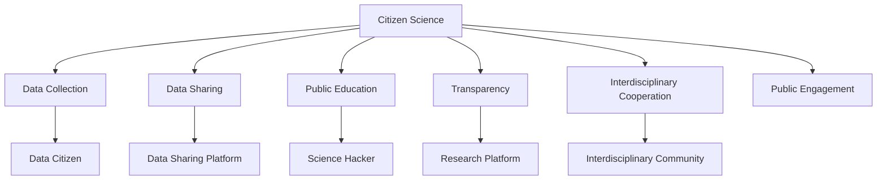

                 

# 公民科学：公众参与科学研究的新模式

## 1. 背景介绍

### 1.1 问题由来

在现代科学研究的历程中，科学通常被视为专业领域的知识积累与传承。科学家们通过严谨的实验、数据收集和理论分析，不断推进人类认知的边界。然而，这种封闭式的科研方式，虽然保证了研究的专业性，但也存在着信息孤岛和资源浪费的问题。

近年来，随着互联网技术的发展和公众科学意识的提升，越来越多的非专业人群开始参与到科学研究中来。这种以公众为主体、以互联网为平台、以数据为导向的科研模式，我们称之为“公民科学”。公民科学不仅仅是科研范式的创新，更是一种社会力量的集结和知识传播的新途径。

### 1.2 问题核心关键点

公民科学的核心在于将科学研究与公众参与相结合，形成一种新的研究范式。其关键点包括：

- **数据收集与共享**：充分利用互联网平台，让公众参与数据收集与共享，获取更广泛、更丰富的数据资源。
- **科学教育与传播**：通过科普活动和教育项目，提升公众的科学素养，培养公民的科学兴趣和能力。
- **开放透明的研究过程**：公开研究设计、实验数据和研究结果，鼓励公众参与讨论和监督，提升研究的透明度和可信度。
- **跨学科合作**：整合不同领域的知识与资源，促进科学研究的跨界融合与创新。

### 1.3 问题研究意义

公民科学的实践，对于科学研究的深入发展、社会知识传播以及公众科学素养的提升，具有重要的意义：

- **拓展数据资源**：借助公众参与，可以获取更广泛的数据来源，增强研究的全面性和多样性。
- **提升科研效率**：公众的参与可以加速数据收集和分析，提升研究的速度和效率。
- **促进知识普及**：通过公众的参与和互动，可以扩大科学知识的传播范围，提升全社会的科学素养。
- **激发科研热情**：公众参与能够增强人们对科学研究的兴趣和热情，激发更多的创新灵感。

## 2. 核心概念与联系

### 2.1 核心概念概述

为更好地理解公民科学的核心概念和关键环节，本节将详细介绍几个核心概念及其相互联系。

- **公民科学**：一种以公众为主体、以互联网为平台、以数据为导向的新型科研模式。
- **数据公民**：指参与数据收集与共享的公众群体，他们是公民科学的数据源。
- **科学黑客**：指通过编程技术参与科学研究的公众，他们利用数据科学、机器学习等技术手段，帮助进行数据分析和模型构建。
- **科学平台**：指为公众参与科研提供技术支持和管理服务的互联网平台。
- **科学社区**：指围绕某个科学问题或项目，集结的公众群体，他们通过在线讨论、协作、竞赛等形式，共同推进科研进展。

这些概念之间的关系可以通过以下Mermaid流程图来展示：



这个流程图展示了公民科学的关键环节及其相关概念：

1. 公民科学以数据收集为核心，公众成为数据公民。
2. 数据通过科学平台进行共享，科学黑客利用数据进行分析和建模。
3. 科学教育提升公众的科学素养，公众通过平台参与科学研究。
4. 科研过程透明公开，鼓励公众讨论和监督。
5. 跨学科合作促进知识融合与创新。

这些概念共同构成了公民科学的研究框架，使得公众能够更加广泛、深入地参与到科学研究中来。

## 3. 核心算法原理 & 具体操作步骤

### 3.1 算法原理概述

公民科学的算法原理，主要围绕数据收集、共享、分析和共享展开。其核心在于将公众参与的数据与专业科研手段相结合，形成一套完整的科研流程。

### 3.2 算法步骤详解

基于公民科学的核心算法原理，我们可以将整个科研过程分为以下几个步骤：

1. **数据收集阶段**：通过互联网平台，动员公众参与数据收集，并确保数据的准确性和多样性。
2. **数据共享阶段**：利用区块链等技术，确保数据的安全性和透明性，提供开放的数据访问接口。
3. **数据分析阶段**：利用机器学习、深度学习等技术，对数据进行分析和建模，得出有价值的科研结论。
4. **结果共享阶段**：将科研成果公开发布，接受公众和专家评议，推动科学研究的透明化和公开化。
5. **反馈机制阶段**：建立反馈机制，鼓励公众对科研过程和结果提出意见和建议，进一步改进和优化科研方法。

### 3.3 算法优缺点

公民科学算法的主要优点包括：

- **数据多样性**：通过公众参与，获取更广泛、更丰富的数据资源，增强研究的全面性和多样性。
- **公众参与性**：公众的参与能够增强科研的透明度和可信度，提升研究的公众参与度。
- **跨界融合**：跨学科合作促进知识的融合与创新，激发新的科研方向和思路。

同时，公民科学算法也存在一些缺点：

- **数据质量参差不齐**：公众参与的数据质量往往不如专业科研数据，可能影响研究结果的准确性。
- **技术门槛较高**：需要一定的技术手段和知识储备，对公众的参与提出了较高要求。
- **隐私和安全风险**：数据共享可能涉及隐私和安全问题，需要严格的数据保护措施。

### 3.4 算法应用领域

公民科学的应用领域广泛，涵盖多个学科和领域，如环境保护、天文学、生物学等。以下是一些典型的应用场景：

- **环境保护**：通过公众参与环境监测，收集水质、空气、土壤等数据，分析环境变化趋势，提出环保建议。
- **天文学**：动员公众参与观测和数据记录，利用大规模数据进行天文现象的分析和预测。
- **生物学**：利用公民科学项目，收集生物多样性数据，进行生态系统和物种保护的研究。
- **医学**：通过公众参与健康数据收集，分析疾病流行趋势，推动公共卫生政策的制定。
- **农业**：利用公民科学项目，收集农田气象数据，分析气候变化对农业的影响，提供科学的农作建议。

## 4. 数学模型和公式 & 详细讲解 & 举例说明

### 4.1 数学模型构建

在公民科学中，数学模型主要用于数据分析和结果解释。例如，通过时间序列分析，预测环境变化趋势；利用分类算法，识别疾病类型等。

### 4.2 公式推导过程

以时间序列分析为例，假设我们有一组数据 $(x_t)_{t=1}^n$，其中 $x_t$ 表示第 $t$ 时刻的某个环境指标。我们可以使用自回归模型 AR(p) 来建模：

$$
x_t = \alpha + \beta x_{t-1} + \epsilon_t
$$

其中，$\alpha$ 和 $\beta$ 为模型参数，$\epsilon_t$ 为随机误差项。

### 4.3 案例分析与讲解

假设我们通过公民科学项目收集到一组水质数据，利用上述时间序列模型进行分析，得到水质变化趋势。具体步骤如下：

1. 对原始数据进行预处理，包括去噪、标准化等操作。
2. 使用时间序列分析方法，拟合 AR(p) 模型。
3. 利用模型的预测功能，分析水质变化趋势，提出改善建议。
4. 将分析结果公开发布，接受公众评议和反馈。

## 5. 项目实践：代码实例和详细解释说明

### 5.1 开发环境搭建

在进行公民科学项目实践前，我们需要准备好开发环境。以下是使用Python进行公民科学项目开发的环境配置流程：

1. 安装Anaconda：从官网下载并安装Anaconda，用于创建独立的Python环境。

2. 创建并激活虚拟环境：
```bash
conda create -n citizen-env python=3.8 
conda activate citizen-env
```

3. 安装必要的Python库：
```bash
pip install pandas numpy scikit-learn matplotlib seaborn requests
```

完成上述步骤后，即可在`citizen-env`环境中开始公民科学项目的开发。

### 5.2 源代码详细实现

以下是一个简单的公民科学项目代码实现，以收集水质数据为例：

```python
import pandas as pd
import requests
import json

# 创建数据收集器
class WaterQualityCollector:
    def __init__(self, url):
        self.url = url
        self.data = pd.DataFrame()

    def collect_data(self):
        response = requests.get(self.url)
        if response.status_code == 200:
            self.data = pd.DataFrame(json.loads(response.text))
        else:
            print("Error collecting data")

    def save_data(self, filename):
        self.data.to_csv(filename, index=False)

# 使用数据收集器
collector = WaterQualityCollector('https://example.com/api/water-quality')
collector.collect_data()
collector.save_data('water_quality.csv')
```

### 5.3 代码解读与分析

让我们再详细解读一下关键代码的实现细节：

**WaterQualityCollector类**：
- `__init__`方法：初始化API地址和数据框。
- `collect_data`方法：通过API请求获取数据，并保存到数据框中。
- `save_data`方法：将数据框保存为CSV文件。

通过这个简单的代码示例，我们可以看到公民科学项目的数据收集和保存过程。当然，在实际应用中，数据收集器的设计还需要根据具体项目的需求，进行更细致的设计和优化。

### 5.4 运行结果展示

运行上述代码，将收集到的水质数据保存为CSV文件。可以通过简单的数据分析，绘制水质变化趋势图，并结合自回归模型，对未来水质进行预测。

```python
import matplotlib.pyplot as plt
from statsmodels.tsa.ar_model import AR

# 读取数据
data = pd.read_csv('water_quality.csv')

# 绘制水质变化趋势图
plt.plot(data['time'], data['water_quality'])
plt.xlabel('Time')
plt.ylabel('Water Quality')
plt.show()

# 使用AR模型进行预测
model = AR(data['water_quality'])
forecast = model.forecast(steps=10)
plt.plot(data['time'], forecast)
plt.xlabel('Time')
plt.ylabel('Water Quality')
plt.show()
```

## 6. 实际应用场景

### 6.1 环境保护

公民科学在环境保护领域有着广泛的应用，通过公众参与环境监测，收集水质、空气、土壤等数据，分析环境变化趋势，提出环保建议。

例如，通过“星岛湖水质监测项目”，公众参与采集水质样本，记录水质指标。这些数据经过分析，可以识别出水质污染的热点区域，为政府制定环境保护政策提供科学依据。

### 6.2 天文学

天文学是公民科学应用的另一个重要领域。通过公众参与观测和数据记录，利用大规模数据进行天文现象的分析和预测。

例如，“行星猎人”项目（Planet Hunters）动员公众参与分析开普勒太空望远镜的数据，发现了数以千计的潜在系外行星。

### 6.3 生物学

在生物学领域，利用公民科学项目，收集生物多样性数据，进行生态系统和物种保护的研究。

例如，“全球生物多样性记录”（BioBlitz）项目，通过公众参与生物多样性调查，收集大量的生物数据，为生物多样性研究和保护提供了重要数据支持。

### 6.4 未来应用展望

未来，公民科学将进一步拓展其应用范围，推动科研向更加开放、透明、高效的方向发展。其主要趋势包括：

- **跨领域融合**：公民科学将与其他技术领域，如物联网、人工智能等，进一步融合，形成更加多样化和智能化的科研平台。
- **公众参与深度**：公众参与将不仅仅局限于数据收集和共享，还包括科研项目的策划、设计、实施和评估等各个环节。
- **数据科学的应用**：借助数据科学和机器学习技术，提升数据收集、分析和解释的自动化和智能化水平。
- **社会价值导向**：公民科学将更多地关注社会价值和公共利益，推动科研与社会发展的深度结合。

## 7. 工具和资源推荐

### 7.1 学习资源推荐

为了帮助开发者系统掌握公民科学的理论基础和实践技巧，这里推荐一些优质的学习资源：

1. 《公民科学与公共参与》系列博文：由相关领域专家撰写，深入浅出地介绍了公民科学的基本概念、典型案例和实践方法。
2. 《公民科学与开放数据》课程：由知名大学开设的在线课程，涵盖公民科学的核心知识和技能，适合初学者学习。
3. 《公共参与与科学教育》书籍：系统介绍了公共参与在科学教育中的应用，提出了提升公众科学素养的策略和方法。
4. GitHub公民科学项目：开放源代码的公民科学项目，提供了丰富的代码示例和资源，帮助开发者快速上手。
5. Sci-Hub网站：提供免费访问学术论文的渠道，鼓励科研数据的共享和开放。

通过对这些资源的学习实践，相信你一定能够快速掌握公民科学的核心技术，并用于解决实际的科学问题。

### 7.2 开发工具推荐

高效的开发离不开优秀的工具支持。以下是几款用于公民科学项目开发的常用工具：

1. Jupyter Notebook：开源的交互式计算平台，适合进行数据探索、分析和可视化。
2. GitHub：代码托管平台，便于版本控制和团队协作，适合公民科学项目的管理。
3. SciPy：开源的科学计算库，提供了大量数据处理和分析函数，支持多维数组和矩阵运算。
4. Pandas：开源的数据分析库，支持高效的数据读写、处理和分析，适合大数据量的处理。
5. Matplotlib：开源的数据可视化库，支持多种图表和动画效果，适合科研数据的展示。

合理利用这些工具，可以显著提升公民科学项目的开发效率，加快创新迭代的步伐。

### 7.3 相关论文推荐

公民科学的快速发展得益于相关领域研究者的不断探索和创新。以下是几篇奠基性的相关论文，推荐阅读：

1. "Crowdsourcing as a tool for environmental monitoring: A systematic review" （《环境监测中的众包：系统综述》）
2. "Citizen Science: A Paradigm Shift in Engaging the Public in Scientific Research" （《公民科学：科学研究的范式转变》）
3. "Crowdsourced data for environmental monitoring and scientific research" （《用于环境监测和科学研究的众包数据》）
4. "Crowdsourced Astronomy: A New Model of Open Science" （《众包天文学：科学的新模式》）
5. "Crowdsourcing in the Biological Sciences: Insights from Projects and Programs" （《生物科学中的众包：项目和程序中的见解》）

这些论文代表了公民科学的发展脉络和前沿方向，通过学习这些研究成果，可以帮助研究者把握学科前进方向，激发更多的创新灵感。

## 8. 总结：未来发展趋势与挑战

### 8.1 总结

本文对公民科学的原理和应用进行了全面系统的介绍。首先阐述了公民科学的概念和意义，明确了其对于科研发展的深远影响。其次，从原理到实践，详细讲解了公民科学的数学模型和操作步骤，给出了具体的代码实现和结果展示。同时，本文还广泛探讨了公民科学在环境保护、天文学、生物学等领域的实际应用，展示了其广泛的应用前景。最后，本文精选了公民科学的各类学习资源，力求为读者提供全方位的技术指引。

通过本文的系统梳理，可以看到，公民科学为公众参与科研开辟了新的路径，极大地拓展了科学研究的边界，推动了科研的透明化、开放化和公众参与度。未来，随着技术的不断进步和社会的广泛认同，公民科学必将成为科学研究的重要组成部分，为构建开放、透明、高效的科研环境做出更大的贡献。

### 8.2 未来发展趋势

展望未来，公民科学的实践将呈现以下几个发展趋势：

1. **技术融合**：公民科学将与其他技术领域，如物联网、人工智能、区块链等，进一步融合，形成更加多样化和智能化的科研平台。
2. **数据共享**：数据共享将变得更加便捷和安全，通过区块链等技术，确保数据的安全性和透明性，提供开放的数据访问接口。
3. **社会参与**：公众参与将不仅仅局限于数据收集和共享，还包括科研项目的策划、设计、实施和评估等各个环节。
4. **交叉学科**：公民科学将更多地关注跨学科研究，促进不同领域知识的融合与创新。
5. **价值导向**：公民科学将更多地关注社会价值和公共利益，推动科研与社会发展的深度结合。

以上趋势凸显了公民科学的发展潜力和广阔前景。这些方向的探索发展，必将进一步提升科学研究的效率和质量，为构建开放、透明、高效的科研环境提供新的动力。

### 8.3 面临的挑战

尽管公民科学已经取得了瞩目成就，但在迈向更加智能化、普适化应用的过程中，它仍面临着诸多挑战：

1. **数据质量**：公众参与的数据质量往往不如专业科研数据，可能影响研究结果的准确性。
2. **技术门槛**：需要一定的技术手段和知识储备，对公众的参与提出了较高要求。
3. **隐私和安全风险**：数据共享可能涉及隐私和安全问题，需要严格的数据保护措施。
4. **伦理和法律问题**：公民科学项目可能涉及伦理和法律问题，需要制定相应的规范和标准。
5. **公众参与度**：如何提高公众的参与度和兴趣，吸引更多公众参与科研，仍是重要的挑战。

尽管存在这些挑战，但随着技术的不断进步和社会的广泛认同，公民科学必将成为科学研究的重要组成部分，为构建开放、透明、高效的科研环境做出更大的贡献。

### 8.4 研究展望

面向未来，公民科学的研究需要在以下几个方面寻求新的突破：

1. **数据质量的提升**：通过算法优化和用户引导，提升公众参与数据的准确性和可靠性。
2. **技术的普及**：开发更易于使用的工具和平台，降低技术门槛，吸引更多公众参与。
3. **隐私和安全的保障**：设计更加安全的隐私保护机制，确保数据共享的安全性。
4. **伦理和法律的规范**：制定相应的伦理和法律规范，保障公众参与的公平性和合理性。
5. **多学科融合**：促进不同领域知识的融合与创新，推动公民科学项目的跨学科发展。

这些研究方向的探索，必将引领公民科学向更加智能化、普适化、价值化的方向发展，为构建开放、透明、高效的科研环境做出更大的贡献。总之，公民科学需要更多的人才、更多的资源、更多的关注，才能真正实现其广泛的应用价值。

## 9. 附录：常见问题与解答

**Q1：公民科学是否适用于所有科学研究领域？**

A: 公民科学适用于数据收集和共享需求较高的领域，如环境保护、天文学、生物学等。对于一些需要专业设备或专业知识的领域，如核物理、深海勘探等，可能不适用于公民科学。

**Q2：如何提升公众参与度？**

A: 提升公众参与度需要从以下几个方面入手：
1. 教育引导：通过科普活动和教育项目，提升公众的科学素养，激发其参与兴趣。
2. 透明公开：公开科研设计和进展，让公众了解参与的价值和意义。
3. 激励机制：设立奖项、证书等激励措施，鼓励公众积极参与。
4. 便捷工具：提供简单易用的工具和平台，降低参与门槛。

**Q3：如何确保数据的质量和安全性？**

A: 确保数据质量和安全性需要从以下几个方面入手：
1. 数据预处理：对数据进行去噪、标准化等预处理，提升数据质量。
2. 数据加密：采用加密技术，确保数据在传输和存储过程中的安全。
3. 隐私保护：采用隐私保护技术，确保个人隐私不受侵犯。
4. 数据审计：建立数据审计机制，定期检查数据质量和安全性。

**Q4：公民科学在科研中的地位和作用是什么？**

A: 公民科学在科研中的地位和作用是提升科研的透明度、开放性和公众参与度。通过公众参与数据收集和共享，可以拓展数据来源，提升研究的速度和效率。通过公众参与科研设计和评估，可以增强科研的透明度和可信度。通过公众参与科学决策，可以促进科研与社会发展的深度结合。总之，公民科学是推动科研向更加开放、透明、高效的方向发展的重要力量。

---

作者：禅与计算机程序设计艺术 / Zen and the Art of Computer Programming

