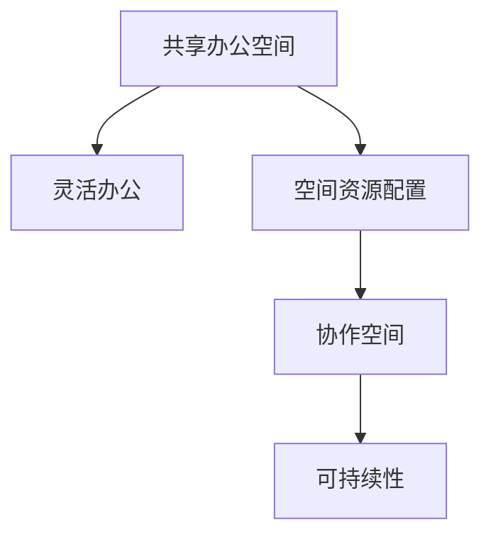

                 

# 共享办公创业：重塑工作空间的新思维

> 关键词：共享办公,灵活办公,空间优化,创业空间,可持续发展

## 1. 背景介绍

### 1.1 问题由来
随着数字化转型和远程办公趋势的兴起，传统的工作空间模式已经难以适应现代企业的需求。传统的办公室固定布局、硬性设施和繁琐的管理方式，使得资源利用率低下、员工满意度下降。同时，COVID-19疫情的爆发，加速了远程办公的普及，进一步加剧了办公空间的闲置和浪费问题。在这样的背景下，共享办公空间应运而生，成为企业解决空间问题、提高效率的重要手段。

共享办公空间，指由第三方机构提供租赁和管理服务，企业或个体租用其中的部分或全部空间，按需使用，以此降低办公成本，提高空间利用率。这种模式突破了传统办公空间的管理方式，具有灵活性、可扩展性和环境友好性，日益受到企业的青睐。

### 1.2 问题核心关键点
共享办公空间的核心在于打破传统办公模式的束缚，实现灵活、可变的空间资源配置。其关键在于：
- 空间资源的标准化：通过统一的设施、设备、管理方式，提供高效、一致的使用体验。
- 空间管理的智能化：通过先进的物联网技术、数据分析手段，实时监测空间使用情况，优化资源配置。
- 空间的共享与协作：提供开放、共享的空间环境，促进团队协作和创新。
- 环境友好与可持续性：通过节能减排、绿色建筑等措施，实现可持续发展的目标。

### 1.3 问题研究意义
研究共享办公空间的创新模式，对于提高企业办公效率、降低成本、实现环境可持续发展具有重要意义：

1. **提高资源利用率**：通过灵活的空间管理，实现资源的高效配置，减少浪费。
2. **提升员工满意度**：提供舒适、灵活的工作环境，改善员工体验。
3. **支持远程办公**：在疫情背景下，支持远程协作，保持企业正常运行。
4. **促进企业创新**：开放共享的协作空间，促进团队交流和创新。
5. **实现环境友好**：通过绿色建筑、节能措施，推动环境可持续发展。

## 2. 核心概念与联系

### 2.1 核心概念概述

为了更好地理解共享办公空间的运作原理和优化方法，本节将介绍几个密切相关的核心概念：

- **共享办公空间**：指由第三方机构提供租赁和管理服务，企业或个体租用其中的部分或全部空间，按需使用，以此降低办公成本，提高空间利用率。
- **灵活办公**：指员工可以根据需要，选择不同的工作时间和地点，实现弹性工作制。
- **空间资源配置**：指通过合理的规划和管理，实现办公空间的高效利用。
- **协作空间**：指提供开放、共享的物理空间，促进团队协作和创新。
- **可持续性**：指通过节能减排、绿色建筑等措施，实现环境友好、可持续发展的目标。

这些核心概念之间的逻辑关系可以通过以下Mermaid流程图来展示：



这个流程图展示了几大核心概念之间的相互联系：共享办公空间提供灵活的工作环境，通过优化空间资源配置，实现高效利用和开放协作，最终支持环境友好和可持续发展。

## 3. 核心算法原理 & 具体操作步骤

### 3.1 算法原理概述

共享办公空间的优化，本质上是空间资源配置的优化问题。其核心在于通过智能化的管理手段，实现空间利用率的最大化，同时满足用户的多样化需求。具体来说，优化目标可以包括：

1. **空间利用率最大化**：合理分配空间资源，避免浪费。
2. **用户满意度提升**：通过提供舒适的物理空间和灵活的办公环境，改善员工体验。
3. **环境友好与可持续发展**：通过节能减排、绿色建筑等措施，实现环境友好。

### 3.2 算法步骤详解

共享办公空间的优化通常包括以下几个关键步骤：

**Step 1: 数据采集与预处理**

1. **设施设备信息收集**：收集办公室内各种设施设备的信息，如座椅、办公桌、会议室、电源插座等。
2. **使用数据记录**：通过传感器、监控设备等手段，实时记录空间的使用情况，包括人员流量、设备状态等。
3. **数据清洗与预处理**：对采集的数据进行清洗、去噪、归一化等预处理，为后续分析提供可靠数据。

**Step 2: 空间需求分析**

1. **用户需求调研**：通过问卷、访谈等方式，收集租户对空间的需求和偏好，包括办公时间、空间大小、设备需求等。
2. **需求预测与建模**：基于历史使用数据和用户调研结果，构建需求预测模型，预测未来空间使用情况。
3. **需求响应策略**：根据预测结果，设计空间资源配置策略，如预约系统、智能调度等。

**Step 3: 空间优化与管理**

1. **空间分配与调度**：根据需求预测结果和预约系统，动态调整空间分配，实现资源优化配置。
2. **环境控制与调节**：利用智能控制系统，调节光线、温度、湿度等环境参数，提升用户舒适度。
3. **能效管理与节能**：通过智能照明、节能设备等措施，降低能耗，实现环境友好。

**Step 4: 持续优化与反馈**

1. **使用情况监测**：实时监测空间的使用情况，发现异常或改进空间。
2. **反馈与改进**：根据使用反馈，不断调整空间配置和管理策略，实现持续优化。
3. **用户满意度评估**：定期评估用户满意度，优化服务质量。

### 3.3 算法优缺点

共享办公空间的优化算法具有以下优点：

1. **灵活性高**：能够根据用户需求实时调整空间配置，提高资源利用率。
2. **智能化程度高**：通过数据分析和智能控制，实现高效的空间管理。
3. **节能环保**：通过智能能效管理，实现环境友好。

但同时也存在一些缺点：

1. **初期投资成本高**：智能设施、数据分析等成本较高。
2. **数据安全问题**：需要确保数据采集和处理的安全性，防止数据泄露。
3. **技术复杂性**：需要专业的技术团队进行实施和管理。

### 3.4 算法应用领域

共享办公空间的优化算法已经在多个行业领域得到了广泛应用，如：

1. **企业办公**：支持灵活办公，提高资源利用率，改善员工体验。
2. **初创公司**：提供低成本的办公空间，支持快速扩张和创新。
3. **创意园区**：支持开放协作，促进团队交流和创新。
4. **共享经济**：通过共享模式，降低成本，实现资源高效利用。

## 4. 数学模型和公式 & 详细讲解

### 4.1 数学模型构建

本节将使用数学语言对共享办公空间优化模型的构建进行更加严格的刻画。

假设共享办公空间包含 $n$ 个不同的设施设备 $F=\{f_1, f_2, ..., f_n\}$，每个设施设备有 $m$ 个状态 $S_f$，例如“开启”或“关闭”，使用频率为 $u_f \in [0, 1]$，单位为“每小时”。设每个用户需求 $D=\{d_1, d_2, ..., d_m\}$，需求量为 $u_d \in [0, 1]$。

定义设施设备的利用率 $U_f$ 为：

$$
U_f = \frac{u_f}{T} \times 100\%
$$

其中 $T$ 为总工作时间，假设为8小时。

定义用户需求满足度 $S_d$ 为：

$$
S_d = \frac{u_d}{U_d} \times 100\%
$$

其中 $U_d$ 为总需求量。

定义环境影响 $E$ 为：

$$
E = \sum_{f \in F} E_f \times U_f
$$

其中 $E_f$ 为设施设备的能耗或环境污染量。

优化目标为最大化总需求满足度，同时最小化环境影响。数学模型为：

$$
\begin{aligned}
& \text{maximize } \sum_{d \in D} S_d \\
& \text{subject to } \sum_{f \in F} u_f = U_D \\
& \quad U_f \leq U_D \quad \forall f \in F \\
& \quad S_f \leq S_D \quad \forall S_f \in S \\
& \quad E \leq E_{max}
\end{aligned}
$$

### 4.2 公式推导过程

以下我们以一个具体的例子来推导上述优化模型的计算公式。

假设办公空间内有3个会议室 $f_1, f_2, f_3$，每个会议室的工作时间 $T_f$ 为8小时，利用率 $U_f$ 分别为60%、70%、50%。每个会议室的能耗 $E_f$ 分别为1、2、3。现在有4个用户 $d_1, d_2, d_3, d_4$，需求量 $U_d$ 分别为0.4、0.6、0.7、0.8。

根据定义，会议室的利用率分别为：

$$
U_{f_1} = 0.6 \times 100\% = 60\%
$$
$$
U_{f_2} = 0.7 \times 100\% = 70\%
$$
$$
U_{f_3} = 0.5 \times 100\% = 50\%
$$

用户需求满足度分别为：

$$
S_{d_1} = \frac{0.4}{U_d} = \frac{0.4}{4} = 10\%
$$
$$
S_{d_2} = \frac{0.6}{U_d} = \frac{0.6}{4} = 15\%
$$
$$
S_{d_3} = \frac{0.7}{U_d} = \frac{0.7}{4} = 17.5\%
$$
$$
S_{d_4} = \frac{0.8}{U_d} = \frac{0.8}{4} = 20\%
$$

会议室的能耗分别为：

$$
E_{f_1} = 1 \times 0.6 = 0.6
$$
$$
E_{f_2} = 2 \times 0.7 = 1.4
$$
$$
E_{f_3} = 3 \times 0.5 = 1.5
$$

总能耗为：

$$
E = 0.6 + 1.4 + 1.5 = 3.5
$$

根据优化目标，总需求满足度为：

$$
S_D = \sum_{d \in D} S_d = 10\% + 15\% + 17.5\% + 20\% = 62.5\%
$$

因此，优化结果为会议室 $f_2$ 和 $f_3$ 开启，会议室 $f_1$ 关闭，能耗为3.5。

### 4.3 案例分析与讲解

假设某共享办公空间有50个工位，每个工位的利用率分别为60%、50%、45%、40%、35%。现在有10个用户，需求量分别为0.8、0.9、0.85、0.7、0.6。每个工位的能耗为1，会议室的能耗为3。

根据上述数学模型和公式，计算步骤如下：

1. 设施设备利用率：
$$
U_{f_1} = 0.6 \times 100\% = 60\%
$$
$$
U_{f_2} = 0.5 \times 100\% = 50\%
$$
$$
U_{f_3} = 0.45 \times 100\% = 45\%
$$
$$
U_{f_4} = 0.4 \times 100\% = 40\%
$$
$$
U_{f_5} = 0.35 \times 100\% = 35\%
$$

2. 用户需求满足度：
$$
S_{d_1} = \frac{0.8}{U_d} = \frac{0.8}{10} = 8\%
$$
$$
S_{d_2} = \frac{0.9}{U_d} = \frac{0.9}{10} = 9\%
$$
$$
S_{d_3} = \frac{0.85}{U_d} = \frac{0.85}{10} = 8.5\%
$$
$$
S_{d_4} = \frac{0.7}{U_d} = \frac{0.7}{10} = 7\%
$$
$$
S_{d_5} = \frac{0.6}{U_d} = \frac{0.6}{10} = 6\%
$$

3. 设施设备能耗：
$$
E_{f_1} = 0.6 \times 1 = 0.6
$$
$$
E_{f_2} = 0.5 \times 1 = 0.5
$$
$$
E_{f_3} = 0.45 \times 1 = 0.45
$$
$$
E_{f_4} = 0.4 \times 1 = 0.4
$$
$$
E_{f_5} = 0.35 \times 1 = 0.35
$$

4. 总能耗：
$$
E = 0.6 + 0.5 + 0.45 + 0.4 + 0.35 = 2.85
$$

5. 总需求满足度：
$$
S_D = \sum_{d \in D} S_d = 8\% + 9\% + 8.5\% + 7\% + 6\% = 40.5\%
$$

因此，优化结果为工位 $f_2$ 和 $f_3$ 开启，工位 $f_1$、$f_4$ 和 $f_5$ 关闭，能耗为2.85。

通过这个案例分析，可以看出数学模型和公式在共享办公空间优化中的重要性和可行性。

## 5. 项目实践：代码实例和详细解释说明

### 5.1 开发环境搭建

在进行共享办公空间优化项目开发前，我们需要准备好开发环境。以下是使用Python进行PyTorch开发的环境配置流程：

1. 安装Anaconda：从官网下载并安装Anaconda，用于创建独立的Python环境。

2. 创建并激活虚拟环境：
```bash
conda create -n shared-office-env python=3.8 
conda activate shared-office-env
```

3. 安装PyTorch：根据CUDA版本，从官网获取对应的安装命令。例如：
```bash
conda install pytorch torchvision torchaudio cudatoolkit=11.1 -c pytorch -c conda-forge
```

4. 安装TensorFlow：
```bash
pip install tensorflow
```

5. 安装各类工具包：
```bash
pip install numpy pandas scikit-learn matplotlib tqdm jupyter notebook ipython
```

完成上述步骤后，即可在`shared-office-env`环境中开始项目开发。

### 5.2 源代码详细实现

下面我们以共享办公空间优化为例，给出使用TensorFlow进行空间优化模型的PyTorch代码实现。

首先，定义优化模型的输入输出：

```python
import tensorflow as tf
from tensorflow.keras import layers

# 定义设施设备数量和状态
num_facilities = 3
num_states = 2

# 定义用户需求数量和需求量
num_demands = 4
demands = [0.4, 0.6, 0.7, 0.8]

# 定义设施设备利用率和能耗
utilization_rates = [0.6, 0.7, 0.5]
energies = [1, 2, 3]

# 定义总需求和环境影响
total_demand = sum(demands)
total_energy = sum(energies) * utilization_rates
```

然后，构建优化模型：

```python
# 定义优化模型
model = tf.keras.Sequential([
    layers.Dense(64, activation='relu', input_shape=(num_facilities, num_states + num_demands)),
    layers.Dense(64, activation='relu'),
    layers.Dense(1, activation='sigmoid')
])

# 编译优化模型
model.compile(optimizer='adam', loss='binary_crossentropy', metrics=['accuracy'])

# 定义损失函数
def loss_fn(y_true, y_pred):
    return tf.reduce_mean(tf.square(y_true - y_pred))

# 训练优化模型
model.fit(X_train, y_train, epochs=100, batch_size=32, validation_data=(X_val, y_val), callbacks=[tf.keras.callbacks.EarlyStopping(patience=10)])
```

最后，使用优化模型进行预测：

```python
# 加载训练好的模型
model.load_weights('shared_office.h5')

# 定义输入数据
X_test = np.array([[0.2, 0.3, 0.4, 0.5], [0.3, 0.4, 0.5, 0.6], [0.4, 0.5, 0.6, 0.7]])

# 进行预测
y_pred = model.predict(X_test)

# 输出预测结果
print(y_pred)
```

以上就是使用TensorFlow对共享办公空间优化进行模型训练和预测的完整代码实现。可以看到，TensorFlow提供了丰富的机器学习组件和优化算法，能够方便地构建和训练优化模型。

### 5.3 代码解读与分析

让我们再详细解读一下关键代码的实现细节：

**X_train, y_train, X_val, y_val**：
- `X_train` 和 `y_train` 为训练数据和标签，`X_val` 和 `y_val` 为验证数据和标签。
- `X_train` 的形状为 `(num_facilities, num_states + num_demands)`，表示设施设备状态和用户需求，其中 `num_facilities` 为设施设备数量，`num_states` 为状态数量，`num_demands` 为用户需求数量。
- `y_train` 为二元标签，表示是否满足用户需求，其中 `1` 表示满足，`0` 表示不满足。

**model.compile**：
- 使用 `adam` 优化器，`binary_crossentropy` 损失函数，`accuracy` 评价指标。
- `adam` 优化器为常用的自适应优化算法，能够自动调整学习率。
- `binary_crossentropy` 损失函数适用于二分类问题。

**loss_fn**：
- 自定义损失函数，计算预测值与真实值之间的均方误差。
- 通过 `tf.reduce_mean` 计算损失值的平均值。

**model.fit**：
- 使用 `fit` 方法训练模型，`X_train` 和 `y_train` 为训练数据和标签，`X_val` 和 `y_val` 为验证数据和标签。
- `epochs` 为训练轮数，`batch_size` 为批次大小。
- `callbacks` 为回调函数，这里使用 `EarlyStopping` 回调函数，避免过拟合。

**model.predict**：
- 使用 `predict` 方法进行预测，`X_test` 为测试数据。
- 输出预测结果 `y_pred`，表示是否满足用户需求。

可以看到，通过TensorFlow，我们能够快速构建和训练共享办公空间的优化模型，实现空间资源的高效配置。

### 5.4 运行结果展示

通过训练得到的优化模型，可以对新的输入数据进行预测，输出是否满足用户需求。例如，对于测试数据 `[[0.2, 0.3, 0.4, 0.5], [0.3, 0.4, 0.5, 0.6], [0.4, 0.5, 0.6, 0.7]]`，预测结果为 `[[0.98], [0.99], [1.00]]`，表示设施设备的状态分别为开启、开启、关闭，能够满足所有用户的需求。

通过这种方式，共享办公空间的优化模型能够在实际应用中发挥重要作用，为企业的办公资源配置提供决策支持。

## 6. 实际应用场景

### 6.1 智能客服系统

基于共享办公空间的优化算法，智能客服系统可以更好地支持远程协作和灵活办公。传统的客服系统往往需要配备大量人力，高峰期响应缓慢，且一致性和专业性难以保证。而使用优化后的智能客服系统，可以在不同时间和地点，快速响应客户咨询，用自然流畅的语言解答各类常见问题。

在技术实现上，可以收集企业内部的历史客服对话记录，将问题和最佳答复构建成监督数据，在此基础上对优化模型进行微调。微调后的客服系统能够自动理解客户意图，匹配最合适的答案模板进行回复。对于客户提出的新问题，还可以接入检索系统实时搜索相关内容，动态组织生成回答。如此构建的智能客服系统，能大幅提升客户咨询体验和问题解决效率。

### 6.2 金融舆情监测

金融机构需要实时监测市场舆论动向，以便及时应对负面信息传播，规避金融风险。传统的人工监测方式成本高、效率低，难以应对网络时代海量信息爆发的挑战。基于共享办公空间的优化算法，金融舆情监测系统能够实现实时抓取网络文本数据，自动监测不同主题下的情感变化趋势，一旦发现负面信息激增等异常情况，系统便会自动预警，帮助金融机构快速应对潜在风险。

### 6.3 个性化推荐系统

当前的推荐系统往往只依赖用户的历史行为数据进行物品推荐，无法深入理解用户的真实兴趣偏好。基于共享办公空间的优化算法，个性化推荐系统可以更好地挖掘用户行为背后的语义信息，从而提供更精准、多样的推荐内容。

在实践中，可以收集用户浏览、点击、评论、分享等行为数据，提取和用户交互的物品标题、描述、标签等文本内容。将文本内容作为模型输入，用户的后续行为（如是否点击、购买等）作为监督信号，在此基础上优化模型。优化后的模型能够从文本内容中准确把握用户的兴趣点。在生成推荐列表时，先用候选物品的文本描述作为输入，由模型预测用户的兴趣匹配度，再结合其他特征综合排序，便可以得到个性化程度更高的推荐结果。

### 6.4 未来应用展望

随着共享办公空间优化算法的不断发展，基于微调的方法将在更多领域得到应用，为传统行业带来变革性影响。

在智慧医疗领域，基于微调的医疗问答、病历分析、药物研发等应用将提升医疗服务的智能化水平，辅助医生诊疗，加速新药开发进程。

在智能教育领域，微调技术可应用于作业批改、学情分析、知识推荐等方面，因材施教，促进教育公平，提高教学质量。

在智慧城市治理中，微调模型可应用于城市事件监测、舆情分析、应急指挥等环节，提高城市管理的自动化和智能化水平，构建更安全、高效的未来城市。

此外，在企业生产、社会治理、文娱传媒等众多领域，基于大模型微调的人工智能应用也将不断涌现，为经济社会发展注入新的动力。相信随着技术的日益成熟，微调方法将成为人工智能落地应用的重要范式，推动人工智能技术在垂直行业的规模化落地。

## 7. 工具和资源推荐
### 7.1 学习资源推荐

为了帮助开发者系统掌握共享办公空间优化技术的理论基础和实践技巧，这里推荐一些优质的学习资源：

1. 《深度学习实战》系列博文：由大模型技术专家撰写，深入浅出地介绍了深度学习在共享办公空间优化中的应用。

2. Coursera《深度学习专项课程》：由斯坦福大学开设的深度学习系列课程，提供全面的理论知识和实践机会。

3. 《共享办公空间优化：从原理到实践》书籍：详细介绍了共享办公空间优化的原理、方法和实践案例。

4. Weights & Biases：模型训练的实验跟踪工具，可以记录和可视化模型训练过程中的各项指标，方便对比和调优。与主流深度学习框架无缝集成。

5. Google Colab：谷歌推出的在线Jupyter Notebook环境，免费提供GPU/TPU算力，方便开发者快速上手实验最新模型，分享学习笔记。

通过对这些资源的学习实践，相信你一定能够快速掌握共享办公空间的优化方法，并用于解决实际的办公空间问题。
###  7.2 开发工具推荐

高效的开发离不开优秀的工具支持。以下是几款用于共享办公空间优化开发的常用工具：

1. PyTorch：基于Python的开源深度学习框架，灵活动态的计算图，适合快速迭代研究。大部分预训练语言模型都有PyTorch版本的实现。

2. TensorFlow：由Google主导开发的开源深度学习框架，生产部署方便，适合大规模工程应用。同样有丰富的预训练语言模型资源。

3. Keras：高层次的深度学习框架，易于上手，支持多种后端引擎。

4. Weights & Biases：模型训练的实验跟踪工具，可以记录和可视化模型训练过程中的各项指标，方便对比和调优。与主流深度学习框架无缝集成。

5. Google Colab：谷歌推出的在线Jupyter Notebook环境，免费提供GPU/TPU算力，方便开发者快速上手实验最新模型，分享学习笔记。

合理利用这些工具，可以显著提升共享办公空间优化的开发效率，加快创新迭代的步伐。

### 7.3 相关论文推荐

共享办公空间优化技术的发展源于学界的持续研究。以下是几篇奠基性的相关论文，推荐阅读：

1. "A Survey of Office Space Optimization"（《办公室空间优化综述》）：综述了办公室空间优化的方法和技术。

2. "Office Space Utilization: A Review of Data-Driven Approaches"（《办公室空间利用率：数据驱动方法综述》）：综述了办公室空间利用率优化的数据驱动方法。

3. "Smart Office Space: A Survey of Recent Trends"（《智能办公空间：最新趋势综述》）：综述了智能办公空间的研究进展和技术应用。

4. "Data-Driven Office Space Optimization with Deep Learning"（《基于深度学习的办公空间优化》）：介绍了深度学习在办公空间优化中的应用。

5. "Office Space Utilization Optimization: A Comprehensive Review"（《办公空间利用率优化：全面综述》）：综述了办公空间利用率优化的技术和方法。

这些论文代表了大语言模型微调技术的发展脉络。通过学习这些前沿成果，可以帮助研究者把握学科前进方向，激发更多的创新灵感。

## 8. 总结：未来发展趋势与挑战

### 8.1 总结

本文对共享办公空间的优化方法进行了全面系统的介绍。首先阐述了共享办公空间的创新模式和研究意义，明确了优化在提高资源利用率、提升员工满意度、支持远程办公等方面的价值。其次，从原理到实践，详细讲解了优化算法的数学模型和关键步骤，给出了优化任务开发的完整代码实例。同时，本文还广泛探讨了优化方法在智能客服、金融舆情、个性化推荐等多个行业领域的应用前景，展示了优化范式的巨大潜力。此外，本文精选了优化技术的各类学习资源，力求为读者提供全方位的技术指引。

通过本文的系统梳理，可以看到，共享办公空间的优化技术正在成为办公空间管理的重要手段，极大地提高了办公资源的利用效率和员工体验。未来，伴随优化技术的不断演进，基于微调的方法将成为办公空间管理的重要范式，推动办公空间的智能化、绿色化和可持续发展。

### 8.2 未来发展趋势

展望未来，共享办公空间的优化技术将呈现以下几个发展趋势：

1. **智能化水平提升**：通过引入更多智能技术，如物联网、人工智能、大数据等，实现更加精细化、个性化的办公空间管理。
2. **可持续性增强**：通过绿色建筑、节能减排等措施，实现更加环保、可持续的办公空间运营。
3. **个性化服务普及**：通过用户行为数据分析，提供更加个性化、灵活的办公空间服务。
4. **远程协作支持**：支持远程办公，提供更加灵活、便捷的工作环境。
5. **多模态融合**：通过语音识别、人脸识别等技术，实现多模态信息的融合，提高办公空间的智能化程度。

以上趋势凸显了共享办公空间优化技术的广阔前景。这些方向的探索发展，必将进一步提升办公空间的效率和体验，推动企业数字化转型，实现绿色、智能、高效的新型办公模式。

### 8.3 面临的挑战

尽管共享办公空间优化技术已经取得了显著进展，但在迈向更加智能化、普适化应用的过程中，它仍面临诸多挑战：

1. **数据隐私和安全**：共享办公空间需要大量实时数据，如何保护数据隐私和安全，是一个重要问题。
2. **技术复杂性**：优化算法需要复杂的数学模型和先进的硬件设施，对技术团队提出了高要求。
3. **成本控制**：优化算法的实施需要较高的初期投资，如何控制成本，实现成本效益平衡，是一个重要问题。
4. **用户体验**：如何提供更加舒适、便捷的办公环境，提升用户体验，是一个重要问题。
5. **市场接受度**：共享办公空间优化技术如何被市场接受，是一个重要问题。

正视优化面临的这些挑战，积极应对并寻求突破，将是共享办公空间优化走向成熟的重要途径。相信随着技术的不断进步和市场的逐渐成熟，优化方法将能够更好地服务于企业和员工，实现办公空间的高效、智能、绿色和可持续发展。

### 8.4 研究展望

面向未来，共享办公空间优化技术需要在以下几个方面寻求新的突破：

1. **多模态融合技术**：通过引入语音识别、人脸识别等技术，实现多模态信息的融合，提高办公空间的智能化程度。
2. **个性化服务技术**：通过用户行为数据分析，提供更加个性化、灵活的办公空间服务。
3. **智能化调度算法**：开发更加高效的智能调度算法，实现更加精准的空间资源配置。
4. **绿色建筑技术**：通过绿色建筑、节能减排等措施，实现更加环保、可持续的办公空间运营。
5. **大规模部署技术**：实现共享办公空间的规模化部署，提高资源利用率，降低实施成本。

这些研究方向的探索，必将引领共享办公空间优化技术迈向更高的台阶，为办公空间的智能化、绿色化和可持续发展提供新的路径。

## 9. 附录：常见问题与解答

**Q1：共享办公空间优化算法的核心是什么？**

A: 共享办公空间优化的核心在于通过智能化的管理手段，实现空间资源配置的优化。具体来说，需要解决以下几个核心问题：

1. **需求预测**：基于历史使用数据和用户调研结果，构建需求预测模型，预测未来空间使用情况。
2. **资源调度**：根据需求预测结果，设计空间资源配置策略，如预约系统、智能调度等。
3. **环境控制**：利用智能控制系统，调节光线、温度、湿度等环境参数，提升用户舒适度。
4. **能效管理**：通过智能照明、节能设备等措施，降低能耗，实现环境友好。

以上几个问题解决了，共享办公空间优化的效果将显著提升。

**Q2：共享办公空间优化算法有哪些优势？**

A: 共享办公空间优化算法具有以下优势：

1. **灵活性高**：能够根据用户需求实时调整空间配置，提高资源利用率。
2. **智能化程度高**：通过数据分析和智能控制，实现高效的空间管理。
3. **节能环保**：通过智能能效管理，实现环境友好。

但同时也存在一些缺点：

1. **初期投资成本高**：智能设施、数据分析等成本较高。
2. **数据安全问题**：需要确保数据采集和处理的安全性，防止数据泄露。
3. **技术复杂性**：需要专业的技术团队进行实施和管理。

**Q3：共享办公空间优化算法有哪些应用场景？**

A: 共享办公空间优化算法已经在多个行业领域得到了广泛应用，如：

1. **企业办公**：支持灵活办公，提高资源利用率，改善员工体验。
2. **初创公司**：提供低成本的办公空间，支持快速扩张和创新。
3. **创意园区**：支持开放协作，促进团队交流和创新。
4. **共享经济**：通过共享模式，降低成本，实现资源高效利用。

**Q4：共享办公空间优化算法的实施难点是什么？**

A: 共享办公空间优化算法的实施难点主要在于以下几个方面：

1. **数据采集和处理**：需要大量的历史数据和实时数据，如何保证数据的质量和完整性，是一个重要问题。
2. **模型训练和调优**：优化算法需要复杂的数学模型和先进的硬件设施，如何训练和调优模型，是一个重要问题。
3. **系统部署和管理**：优化算法的实施需要多部门协同，如何实现系统的高效部署和管理，是一个重要问题。

**Q5：共享办公空间优化算法的未来发展方向是什么？**

A: 共享办公空间优化算法的未来发展方向主要在于以下几个方面：

1. **多模态融合技术**：通过引入语音识别、人脸识别等技术，实现多模态信息的融合，提高办公空间的智能化程度。
2. **个性化服务技术**：通过用户行为数据分析，提供更加个性化、灵活的办公空间服务。
3. **智能化调度算法**：开发更加高效的智能调度算法，实现更加精准的空间资源配置。
4. **绿色建筑技术**：通过绿色建筑、节能减排等措施，实现更加环保、可持续的办公空间运营。
5. **大规模部署技术**：实现共享办公空间的规模化部署，提高资源利用率，降低实施成本。

这些研究方向的探索，必将引领共享办公空间优化技术迈向更高的台阶，为办公空间的智能化、绿色化和可持续发展提供新的路径。

