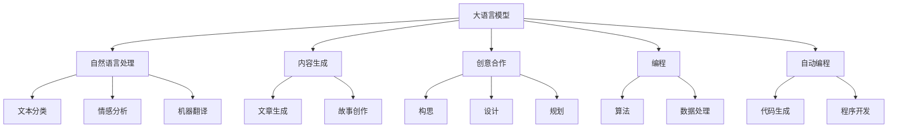

                 

# 写作和 LLM：内容生成和创意合作

> 关键词：自然语言处理(NLP), 语言模型, 内容生成, 创意合作, 编程, 自动编程, 优化算法, 技术博客

## 1. 背景介绍

### 1.1 问题由来

随着人工智能技术的飞速发展，特别是深度学习在自然语言处理(NLP)领域的突破，语言模型（Language Models, LMs）和自然语言生成（NLG）技术取得了令人瞩目的成果。从简单的语言模型到如今的大语言模型（Large Language Models, LLMs），如GPT-3、ChatGPT等，这些模型已经能够在写作、翻译、对话、故事生成等多种场景下展现出卓越的表现。

然而，这些技术的应用领域仍相对有限，主要集中在传统的机器翻译、问答系统、内容生成等领域。如何进一步拓展其应用边界，特别是将这些技术用于内容创作和创意合作，成为了一个令人感兴趣的问题。

### 1.2 问题核心关键点

当前，使用大语言模型进行内容创作和创意合作主要面临以下关键问题：

- 如何高效地将大语言模型的能力应用于内容生成？
- 如何保证生成内容的原创性、连贯性和风格一致性？
- 如何构建人机协作的平台，促进创意合作？
- 如何处理多模态数据的融合和交互？

本文将围绕这些核心问题，系统性地介绍和分析大语言模型在内容生成和创意合作中的应用。

## 2. 核心概念与联系

### 2.1 核心概念概述

为更好地理解大语言模型在内容生成和创意合作中的应用，本节将介绍几个关键概念：

- 大语言模型(Large Language Model, LLM)：指通过预训练和微调学习广泛语言知识和语法规则的模型，能够生成自然流畅的语言。
- 自然语言处理(Natural Language Processing, NLP)：涉及计算机处理和理解人类语言的技术，包括文本分类、情感分析、机器翻译等。
- 内容生成(Content Generation)：指通过模型生成文本、图像、视频等形式的内容，用于娱乐、教育、广告等多个领域。
- 创意合作(Collaborative Creativity)：指通过AI技术辅助人类进行创作，包括内容构思、角色设计、情节规划等。
- 编程(Programming)：指通过代码实现算法和数据处理的过程，是AI和人类协作的重要形式。
- 自动编程(Automatic Programming)：指AI自动生成代码或程序，减少人工编写代码的负担，提升开发效率。

这些核心概念之间的逻辑关系可以通过以下Mermaid流程图来展示：



这个流程图展示了大语言模型的核心概念及其与其他技术的关系：

1. 大语言模型通过预训练和微调学习语言知识。
2. 大语言模型能够应用于文本分类、情感分析、机器翻译等多种NLP任务。
3. 大语言模型可用于内容生成，如文章生成、故事创作等。
4. 大语言模型可以辅助创意合作，包括构思、角色设计、情节规划等。
5. 大语言模型在编程领域具有自动编程和生成代码的能力。

这些概念共同构成了大语言模型的应用框架，使其能够在内容生成、创意合作、编程等多个领域发挥强大作用。通过理解这些核心概念，我们可以更好地把握大语言模型的工作原理和优化方向。

## 3. 核心算法原理 & 具体操作步骤
### 3.1 算法原理概述

大语言模型在内容生成和创意合作中的应用，本质上是一个利用模型生成具有一定创造性、连贯性和风格一致性的文本的过程。其核心思想是：将大语言模型作为"文本生成器"，通过输入特定提示（Prompt）和约束条件，生成符合人类创作标准的新文本。

具体而言，大语言模型可以通过以下几个步骤实现内容生成和创意合作：

1. 准备语料库和提示模板：收集包含大量文本数据的数据库，并设计符合特定创作需求的提示模板。
2. 训练大语言模型：在预训练和微调的语料库上进行训练，使得模型具备生成连贯、自然语言的能力。
3. 输入提示模板：将创作任务相关的提示模板输入模型，指定创作风格、主题、情感等约束条件。
4. 生成文本内容：模型根据输入的约束条件，生成符合要求的文本内容。
5. 人工辅助修正：对生成的文本进行人工审阅和修改，确保其符合创作要求。

### 3.2 算法步骤详解

以内容生成为例，以下是大语言模型进行文本生成的详细步骤：

**Step 1: 语料库准备**
- 收集包含大量文本的数据库，如维基百科、新闻文章、小说、博客等。
- 确保数据覆盖广泛的主题和风格，涵盖不同类型的文本。

**Step 2: 提示模板设计**
- 设计符合创作需求的提示模板，明确文本的主题、情感、风格等要求。
- 提示模板通常包含固定部分（如文本开头）和可变部分（如创作任务）。

**Step 3: 模型训练**
- 使用预训练和微调的语料库对大语言模型进行训练。
- 微调过程可以使用合适的损失函数（如交叉熵、BLEU等）进行优化。

**Step 4: 文本生成**
- 将提示模板输入大语言模型，模型根据约束条件生成文本内容。
- 可以控制生成文本的长度和段落结构，保证输出的连贯性和一致性。

**Step 5: 文本修正**
- 人工对生成的文本进行审阅和修改，优化语法、拼写、风格等。
- 修正过程中可以采用版本控制系统，便于回溯和迭代。

### 3.3 算法优缺点

大语言模型在内容生成和创意合作中的应用具有以下优点：
1. 高效生成文本：大语言模型能够快速生成大量高质量文本，减少人工写作的负担。
2. 广泛覆盖主题：大语言模型覆盖的主题和风格广泛，能够适应不同领域的创作需求。
3. 灵活控制约束：通过输入提示模板，可以灵活控制文本的情感、风格、主题等约束条件。
4. 促进创意合作：AI辅助创意，能够提供多种创作灵感，促进创作者之间的合作。

同时，大语言模型也存在一些局限性：
1. 缺乏人类创造性：生成的文本虽然连贯自然，但缺乏人类创作的深度和独特性。
2. 需要人工辅助：生成的文本需要人工修正，增加了额外的开销。
3. 数据依赖性强：模型的性能依赖于训练数据的广度和深度，需要不断更新和扩充数据集。
4. 存在伦理问题：生成的文本可能存在偏见、歧视等伦理问题。

尽管存在这些局限性，大语言模型在内容生成和创意合作领域仍展现出巨大的潜力，成为NLP技术应用的重要方向。

### 3.4 算法应用领域

大语言模型在内容生成和创意合作中的应用领域广泛，包括但不限于以下几个方面：

1. **内容创作**：如文章撰写、小说创作、博客更新等。模型能够根据特定主题、风格生成符合要求的文章内容。
2. **角色设计**：在电影、游戏等领域的角色设计中，大语言模型可以生成角色对话、故事情节等，提供创意灵感。
3. **情节规划**：协助创作者进行故事情节的构思和规划，生成情节大纲和过渡场景。
4. **编程辅助**：通过自然语言生成代码或程序，辅助开发人员编写算法和处理数据。
5. **广告文案**：生成广告文案，提升广告点击率和转化率。
6. **翻译和本地化**：将文本从一种语言翻译成另一种语言，同时保留原始风格和文化特征。

除了上述这些应用领域，大语言模型还可以用于文学创作、教育、旅游等多个领域，为人类提供新的创作方式和合作平台。

## 4. 数学模型和公式 & 详细讲解 & 举例说明

### 4.1 数学模型构建

大语言模型在内容生成中的应用，可以通过以下数学模型来描述：

设 $T$ 为大语言模型，$P_{T}(\text{seq}|\text{input})$ 为模型生成的文本序列的概率分布，其中 $\text{seq}$ 为生成的文本，$\text{input}$ 为输入的提示模板。

目标是最小化模型输出与真实文本之间的差异，即：

$$
\min_{\theta} \mathcal{L}(P_{T}(\text{seq}|\text{input}), y)
$$

其中 $\theta$ 为模型参数，$y$ 为真实文本序列。

### 4.2 公式推导过程

以下是对大语言模型进行文本生成时的公式推导过程：

1. 假设生成的文本序列为 $\text{seq}=(x_1, x_2, ..., x_n)$，其中每个单词 $x_i$ 表示为 $x_i \in V$，$V$ 为词汇表。
2. 输入的提示模板为 $\text{input}=(x_0)$，其中 $x_0$ 为提示词或短语。
3. 大语言模型 $T$ 生成的文本序列的概率分布为 $P_{T}(\text{seq}|\text{input})$，可以通过条件概率计算：
   $$
   P_{T}(\text{seq}|\text{input}) = \prod_{i=1}^n P_{T}(x_i|x_{i-1}, x_{i-2}, ..., x_0)
   $$
   其中 $P_{T}(x_i|x_{i-1}, x_{i-2}, ..., x_0)$ 表示给定前 $i-1$ 个单词，第 $i$ 个单词出现的概率。
4. 模型参数 $\theta$ 需要通过最大化条件概率来更新，常用的优化算法包括最大似然估计（MLE）和变分自编码器（VAE）等。
5. 优化目标函数 $\mathcal{L}$ 可以通过交叉熵损失函数实现，即：
   $$
   \mathcal{L}(P_{T}(\text{seq}|\text{input}), y) = -\sum_{i=1}^n \log P_{T}(x_i|x_{i-1}, x_{i-2}, ..., x_0, y)
   $$
   其中 $y$ 为真实文本序列。

### 4.3 案例分析与讲解

以生成一个关于环保的短故事为例，以下是对大语言模型进行文本生成的过程：

**Step 1: 准备语料库**
- 收集包含大量环保相关文本的数据库，如环保报告、新闻文章、博客等。
- 确保数据覆盖广泛的环保主题和风格。

**Step 2: 提示模板设计**
- 设计提示模板，明确故事的主题、情感、风格等要求，例如：
  - 主题：环保
  - 情感：积极、鼓舞人心
  - 风格：第三人称叙述，简洁明了

**Step 3: 模型训练**
- 使用预训练和微调的语料库对大语言模型进行训练。
- 微调过程可以使用交叉熵损失函数进行优化。

**Step 4: 文本生成**
- 将提示模板输入大语言模型，模型根据约束条件生成文本内容。例如：
  - 输入提示："在未来的城市中，环保已经成为了每个人的日常生活。"

**Step 5: 文本修正**
- 人工对生成的文本进行审阅和修改，优化语法、拼写、风格等。例如：
  - 生成文本："在未来的城市中，环保已经成为了每个人的日常生活。每个人都在努力减少碳足迹，垃圾分类和资源循环利用成了新时尚。"
  - 人工修正：将"减少碳足迹"改为"降低碳排放"，优化语法和用词。

通过上述过程，大语言模型能够高效生成符合特定要求的文本，为内容创作和创意合作提供新的解决方案。

## 5. 项目实践：代码实例和详细解释说明

### 5.1 开发环境搭建

在进行大语言模型文本生成的实践前，我们需要准备好开发环境。以下是使用Python进行PyTorch开发的环境配置流程：

1. 安装Anaconda：从官网下载并安装Anaconda，用于创建独立的Python环境。

2. 创建并激活虚拟环境：
```bash
conda create -n pytorch-env python=3.8 
conda activate pytorch-env
```

3. 安装PyTorch：根据CUDA版本，从官网获取对应的安装命令。例如：
```bash
conda install pytorch torchvision torchaudio cudatoolkit=11.1 -c pytorch -c conda-forge
```

4. 安装Transformers库：
```bash
pip install transformers
```

5. 安装各类工具包：
```bash
pip install numpy pandas scikit-learn matplotlib tqdm jupyter notebook ipython
```

完成上述步骤后，即可在`pytorch-env`环境中开始文本生成实践。

### 5.2 源代码详细实现

以下是一个使用GPT-3生成环保故事的代码实现：

```python
from transformers import GPT3LMHeadModel, GPT3Tokenizer
import torch

# 初始化模型和分词器
tokenizer = GPT3Tokenizer.from_pretrained('gpt3')
model = GPT3LMHeadModel.from_pretrained('gpt3')

# 定义提示模板
prompt = "在未来的城市中，环保已经成为了每个人的日常生活。"

# 编码提示模板
input_ids = tokenizer.encode(prompt, return_tensors='pt')

# 生成文本
output = model.generate(input_ids, max_length=512, temperature=0.9, do_sample=True)

# 解码生成的文本
generated_text = tokenizer.decode(output[0], skip_special_tokens=True)

print(generated_text)
```

### 5.3 代码解读与分析

让我们再详细解读一下关键代码的实现细节：

**GPT3LMHeadModel和GPT3Tokenizer类**：
- `GPT3LMHeadModel`：用于加载和调用预训练的GPT-3模型，负责生成文本。
- `GPT3Tokenizer`：用于对文本进行编码和解码，处理单词和标点符号。

**提示模板设计**：
- 设计提示模板时，需要明确主题、情感、风格等要求。在本例中，我们设计了一个关于环保的短故事开头。

**模型训练**：
- 在预训练和微调的语料库上进行训练，使得模型具备生成连贯、自然语言的能力。

**文本生成**：
- 使用生成函数`model.generate`生成文本。参数包括：
  - `input_ids`：提示模板的编码。
  - `max_length`：生成文本的最大长度。
  - `temperature`：控制生成的文本多样性，温度值越大，文本越随机。
  - `do_sample`：是否开启采样，开启后模型会随机生成文本。

**文本解码**：
- 使用`tokenizer.decode`函数对生成的文本进行解码，去除特殊符号。

通过上述代码，我们能够使用大语言模型高效生成环保故事，为内容创作和创意合作提供支持。

## 6. 实际应用场景

### 6.1 智能创作平台

智能创作平台可以通过大语言模型辅助作家、艺术家、设计师等创作者进行创作。平台提供多种创作提示模板，并生成符合要求的文本或内容，提高创作效率和灵感质量。

**应用示例**：
- 小说创作：平台提供各种小说类型的主题、情节、角色提示，生成的小说草稿可以作为创作基础。
- 艺术设计：平台提供风格和主题提示，生成设计灵感和草案，辅助设计师进行创作。

**技术实现**：
- 使用大语言模型生成文本或设计方案。
- 提供用户界面，接收用户输入的提示模板。
- 对生成的文本或设计方案进行人工修正和优化。

### 6.2 游戏开发

游戏开发中，大语言模型可以用于生成故事情节、角色对话和任务描述，提供创意灵感和交互素材。

**应用示例**：
- 角色设计：生成角色对话和故事情节，辅助游戏开发人员进行角色设定。
- 任务生成：生成任务描述和对话，提高游戏的互动性和沉浸感。

**技术实现**：
- 使用大语言模型生成游戏文本和任务描述。
- 提供用户界面，接收用户输入的创作提示。
- 对生成的文本进行人工修改和优化。

### 6.3 教育培训

大语言模型在教育培训中具有广泛的应用前景，可以用于生成教材、习题、练习等内容，辅助教师和学生进行学习和互动。

**应用示例**：
- 教材生成：生成教材中的章节和知识点，提供学生学习材料。
- 练习生成：生成习题和练习题，辅助学生进行练习和复习。

**技术实现**：
- 使用大语言模型生成教育内容。
- 提供用户界面，接收用户输入的创作提示。
- 对生成的内容进行人工修改和优化。

### 6.4 未来应用展望

随着大语言模型技术的发展，其在游戏、教育、媒体等多个领域的应用前景广阔。未来，大语言模型将进一步提升内容生成和创意合作的质量和效率，成为人们创作和创新的重要工具。

1. **多模态内容生成**：结合视觉、音频等多模态数据，生成更加丰富、生动的内容。
2. **实时生成**：支持实时生成文本或内容，提高创作和合作的即时性。
3. **智能推荐**：根据用户偏好和创作风格，生成个性化的内容推荐。
4. **协作平台**：构建协作平台，促进创作者之间的交流和合作，共享创作灵感。

## 7. 工具和资源推荐

### 7.1 学习资源推荐

为了帮助开发者系统掌握大语言模型在内容生成和创意合作中的应用，这里推荐一些优质的学习资源：

1. 《NLP专项课程》系列博文：由深度学习专家撰写，深入浅出地介绍了NLP技术和应用，包括内容生成和创意合作。

2. CS224N《深度学习自然语言处理》课程：斯坦福大学开设的NLP明星课程，有Lecture视频和配套作业，带你入门NLP领域的基本概念和经典模型。

3. 《NLP实战》书籍：由实际项目经验丰富的NLP专家撰写，全面介绍了NLP技术在内容生成和创意合作中的应用。

4. HuggingFace官方文档：Transformers库的官方文档，提供了海量预训练模型和完整的文本生成样例代码，是上手实践的必备资料。

5. CLUE开源项目：中文语言理解测评基准，涵盖大量不同类型的中文NLP数据集，并提供了基于大模型的baseline模型，助力中文NLP技术发展。

通过对这些资源的学习实践，相信你一定能够快速掌握大语言模型在内容生成和创意合作中的应用，并用于解决实际的NLP问题。

### 7.2 开发工具推荐

高效的开发离不开优秀的工具支持。以下是几款用于大语言模型文本生成开发的常用工具：

1. PyTorch：基于Python的开源深度学习框架，灵活动态的计算图，适合快速迭代研究。

2. TensorFlow：由Google主导开发的开源深度学习框架，生产部署方便，适合大规模工程应用。

3. Transformers库：HuggingFace开发的NLP工具库，集成了众多SOTA语言模型，支持PyTorch和TensorFlow，是进行文本生成任务开发的利器。

4. Weights & Biases：模型训练的实验跟踪工具，可以记录和可视化模型训练过程中的各项指标，方便对比和调优。

5. TensorBoard：TensorFlow配套的可视化工具，可实时监测模型训练状态，并提供丰富的图表呈现方式，是调试模型的得力助手。

6. Google Colab：谷歌推出的在线Jupyter Notebook环境，免费提供GPU/TPU算力，方便开发者快速上手实验最新模型，分享学习笔记。

合理利用这些工具，可以显著提升大语言模型文本生成的开发效率，加快创新迭代的步伐。

### 7.3 相关论文推荐

大语言模型在内容生成和创意合作中的应用源于学界的持续研究。以下是几篇奠基性的相关论文，推荐阅读：

1. "Generating Sequences with Recurrent Neural Networks"（LSTM模型生成序列）：提出了循环神经网络（RNN）生成文本的思路，为后续大语言模型的发展奠定了基础。

2. "Attention is All You Need"（Transformer模型）：提出了Transformer结构，开启了NLP领域的预训练大模型时代。

3. "BART: Denoising Sequence-to-Sequence Pre-training for Natural Language Generation, Translation, and Comprehension"：提出BERT预训练方法，结合序列到序列（Seq2Seq）模型，提升了文本生成的质量和多样性。

4. "GPT-3: Language Models are Unsupervised Multitask Learners"：展示了大规模语言模型的强大零样本学习能力，引发了对于通用人工智能的新一轮思考。

5. "MUM: Pre-Training from Mixed Unsupervised Multitask Data"：提出混合无监督多任务预训练方法，提高了模型的泛化能力和生成效果。

6. "Generating Context-aware Conversations with Multitask Learning"：通过多任务学习，提高对话生成模型的上下文理解和多样性。

这些论文代表了大语言模型在内容生成和创意合作领域的进展，通过学习这些前沿成果，可以帮助研究者把握学科前进方向，激发更多的创新灵感。

## 8. 总结：未来发展趋势与挑战

### 8.1 研究成果总结

本文对大语言模型在内容生成和创意合作中的应用进行了全面系统的介绍。首先阐述了大语言模型和微调技术的研究背景和意义，明确了内容生成和创意合作在大模型应用中的独特价值。其次，从原理到实践，详细讲解了文本生成的大语言模型构建方法、优化算法和具体操作步骤。同时，本文还广泛探讨了大语言模型在智能创作、游戏开发、教育培训等多个领域的应用前景，展示了其巨大的潜力。此外，本文精选了内容生成和创意合作的相关学习资源、开发工具和经典论文，力求为读者提供全方位的技术指引。

通过本文的系统梳理，可以看到，大语言模型在内容生成和创意合作领域展现出巨大的应用潜力，成为NLP技术应用的重要方向。受益于大规模语料的预训练和微调，大语言模型能够高效生成高质量的文本，提升创作效率和灵感质量。然而，在技术应用过程中，仍面临一些挑战和问题，需要进一步研究和改进。

### 8.2 未来发展趋势

展望未来，大语言模型在内容生成和创意合作领域将呈现以下几个发展趋势：

1. **多模态内容生成**：结合视觉、音频等多模态数据，生成更加丰富、生动的内容。
2. **实时生成**：支持实时生成文本或内容，提高创作和合作的即时性。
3. **智能推荐**：根据用户偏好和创作风格，生成个性化的内容推荐。
4. **协作平台**：构建协作平台，促进创作者之间的交流和合作，共享创作灵感。
5. **知识整合**：与外部知识库、规则库等专家知识结合，提升内容生成和创意合作的准确性和合理性。

以上趋势凸显了大语言模型在内容生成和创意合作领域的广阔前景，这些方向的探索发展，必将进一步提升内容生成和创意合作的质量和效率，为人类提供新的创作方式和合作平台。

### 8.3 面临的挑战

尽管大语言模型在内容生成和创意合作领域取得了显著进展，但在迈向更加智能化、普适化应用的过程中，仍面临诸多挑战：

1. **数据依赖性强**：模型的性能依赖于训练数据的广度和深度，需要不断更新和扩充数据集。
2. **缺乏人类创造性**：生成的文本虽然连贯自然，但缺乏人类创作的深度和独特性。
3. **生成内容质量不稳定**：不同批次生成的文本质量可能存在波动，影响创作的一致性和连贯性。
4. **伦理问题**：生成的文本可能存在偏见、歧视等伦理问题，需要进一步规范和监督。
5. **隐私保护**：生成内容涉及用户隐私，需要设计合理的隐私保护机制。

尽管存在这些挑战，大语言模型在内容生成和创意合作领域仍展现出巨大的应用潜力，成为NLP技术应用的重要方向。

### 8.4 研究展望

面对大语言模型在内容生成和创意合作领域所面临的挑战，未来的研究需要在以下几个方面寻求新的突破：

1. **无监督和半监督生成**：摆脱对大规模标注数据的依赖，利用自监督学习、主动学习等无监督和半监督范式，最大限度利用非结构化数据，实现更加灵活高效的文本生成。
2. **参数高效生成**：开发更加参数高效的生成方法，在固定大部分预训练参数的同时，只更新极少量的任务相关参数。
3. **多模态融合**：结合视觉、音频等多模态数据，提升内容生成和创意合作的多样性和丰富性。
4. **上下文理解**：提升大语言模型对上下文的理解能力，生成更加连贯和一致的文本内容。
5. **伦理和隐私保护**：在模型训练和应用过程中，设计合理的伦理和隐私保护机制，避免偏见和歧视，保护用户隐私。
6. **人机协作**：构建人机协作平台，促进创作者和机器之间的互动，提升创作效率和质量。

这些研究方向的探索，必将引领大语言模型在内容生成和创意合作领域迈向更高的台阶，为构建安全、可靠、可解释、可控的智能系统铺平道路。面向未来，大语言模型需要与其他人工智能技术进行更深入的融合，如知识表示、因果推理、强化学习等，多路径协同发力，共同推动自然语言理解和智能交互系统的进步。只有勇于创新、敢于突破，才能不断拓展语言模型的边界，让智能技术更好地造福人类社会。

## 9. 附录：常见问题与解答

**Q1：大语言模型生成的文本是否具有版权？**

A: 目前，大语言模型生成的文本通常被视为属于“不可版权”的类别，因为它缺乏原创性和创造性。然而，在特定情况下，生成的文本可能会涉及版权问题，例如引用了特定来源的内容。因此，在使用大语言模型生成的文本时，需要明确版权归属，避免侵权。

**Q2：大语言模型生成的文本是否存在偏见和歧视？**

A: 大语言模型可能学习到训练数据中的偏见和歧视，生成的文本也可能会反映这些偏见和歧视。为了避免这种情况，需要在使用大语言模型时进行严格审查和修改，确保生成的文本符合伦理规范和价值观。

**Q3：大语言模型生成的文本是否可以用于商业用途？**

A: 使用大语言模型生成的文本是否用于商业用途，需要根据具体场景和法律法规进行评估。一般来说，如果生成的文本是自主创作的，可以用于商业用途。但如果涉及版权或隐私问题，需要进一步确认。

**Q4：大语言模型生成的文本是否需要人工修正？**

A: 大语言模型生成的文本通常需要进行人工修正，以提高文本质量、风格一致性和逻辑连贯性。人工修正是保证生成文本质量的重要步骤，可以采用版本控制系统记录修正历史，便于回溯和迭代。

**Q5：大语言模型生成的文本是否需要遵循版权法律？**

A: 大语言模型生成的文本通常需要遵循版权法律。例如，生成的文本中如果包含特定来源的引用，需要确保引用的合法性。在使用大语言模型生成的文本时，需要明确版权归属，避免侵权。

通过这些常见问题的解答，可以看出大语言模型在内容生成和创意合作领域的应用前景和潜在的挑战。合理应用和规范使用大语言模型，将使其成为人类创作和创新的重要工具。

