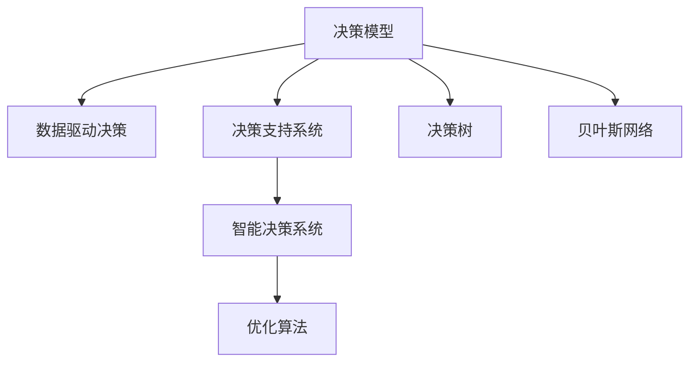

                 

# 决策管理：提高关键决策的质量

## 1. 背景介绍

在现代企业的运营管理中，决策作为核心环节，其质量直接关系到企业的生死存亡。无论是日常运营管理还是重大战略决策，都需要高效、科学的决策机制来支撑。然而，实际决策过程中，由于信息的不完备、主观偏见的干扰、环境的不确定性等因素，决策质量往往难以达到预期。因此，如何通过技术手段提升决策质量，成为当前管理科学的重要研究课题。

### 1.1 问题由来
随着信息技术的发展，数据在企业决策中的应用日益广泛。大数据、人工智能等技术为决策提供了强有力的支撑，但也带来了新的挑战。传统决策方法难以适应海量数据的处理需求，传统决策模型也难以充分考虑数据的不确定性。如何在纷繁复杂的数据中提取有效信息，优化决策模型，并结合人类经验与直觉，成为决策管理领域的关键问题。

### 1.2 问题核心关键点
本节将重点介绍决策管理的关键问题和技术方法，以及数据驱动决策的相关概念和架构。通过这些核心关键点的讲解，读者可以更好地理解决策管理的基本原理和技术路线。

## 2. 核心概念与联系

### 2.1 核心概念概述

为更好地理解决策管理，本节将介绍几个密切相关的核心概念：

- **决策模型(Decision Model)**：用于描述决策过程和决策规则的数学模型。决策模型可以分为确定性模型和不确定性模型。
- **数据驱动决策(Data-Driven Decision Making, DDM)**：通过数据挖掘、统计分析和机器学习等技术，基于数据和事实进行决策的方法。
- **决策支持系统(Decision Support System, DSS)**：利用信息技术辅助决策的系统。DSS通常包括数据仓库、决策分析工具等组件，提供辅助决策的信息支持。
- **智能决策系统(Intelligent Decision System, IDS)**：结合人工智能和决策模型，通过专家系统、深度学习等技术实现决策自动化。
- **决策树(Decision Tree)**：一种基于树形结构表示决策过程和结果的模型，常用于分类和回归分析。
- **贝叶斯网络(Bayesian Network)**：一种基于概率图模型的决策模型，用于表示变量之间的依赖关系和因果关系。
- **优化算法(Optimization Algorithm)**：如线性规划、整数规划、遗传算法等，用于求解决策问题中的优化问题。

这些核心概念之间的逻辑关系可以通过以下Mermaid流程图来展示：



这个流程图展示了大决策管理系统的核心概念及其之间的关系：

1. 决策模型作为决策过程的基本描述，是其他所有决策技术的基础。
2. 数据驱动决策依托数据和算法，从海量数据中提取有价值的信息，为决策提供科学依据。
3. 决策支持系统和智能决策系统，通过技术和模型，辅助决策者做出合理选择。
4. 优化算法用于解决决策问题中的各种优化问题，如资源分配、成本控制等。
5. 决策树和贝叶斯网络作为重要的模型工具，用于描述和解决不同类型的决策问题。

这些核心概念共同构成了决策管理的技术框架，使决策过程更加科学、高效。

## 3. 核心算法原理 & 具体操作步骤

### 3.1 算法原理概述

决策管理涉及多个关键算法和技术方法，这些算法和技术方法通常结合数据驱动决策、决策模型和优化算法等。其核心思想是：通过技术手段，将决策过程科学化、自动化，辅助决策者做出合理、高效的决策。

决策模型和优化算法通常用于解决确定性决策问题，而数据驱动决策则着重于从数据中挖掘模式和规律，辅助决策。智能决策系统则结合了人工智能技术，进一步提升决策的自动化程度。

### 3.2 算法步骤详解

决策管理的技术实现，一般包括以下几个关键步骤：

**Step 1: 数据准备**
- 收集决策问题相关的数据，包括结构化数据和非结构化数据。
- 清洗数据，去除噪声和异常值。
- 进行数据预处理，如特征选择、归一化等。

**Step 2: 数据探索与分析**
- 使用数据挖掘和统计分析技术，对数据进行探索性分析，识别数据中的模式和规律。
- 应用可视化工具，直观展示数据分布和关联关系。

**Step 3: 模型建立**
- 选择合适的决策模型，建立数学模型。
- 确定模型参数和优化目标，设置优化算法。
- 训练模型，并进行交叉验证和参数调优。

**Step 4: 决策支持**
- 利用决策支持系统和智能决策系统，提供辅助决策的信息支持。
- 结合专家经验和直觉，对模型输出进行解释和校验。

**Step 5: 决策执行与评估**
- 执行决策，监控决策效果。
- 对决策结果进行评估，根据实际效果调整模型参数和决策策略。

以上是决策管理的技术实现流程，每一步都至关重要。在实际应用中，还需要根据具体决策问题和数据特点，灵活设计模型和算法，不断迭代优化，以得到理想的效果。

### 3.3 算法优缺点

决策管理的核心算法具有以下优点：
1. 科学合理。通过数学模型和算法，能够提高决策的科学性和合理性，减少人为误差。
2. 自动化程度高。通过智能决策系统和优化算法，可以大幅提高决策的自动化程度，提升决策效率。
3. 鲁棒性强。决策模型和算法通常具有较强的鲁棒性，可以应对不确定性较高的决策环境。
4. 数据驱动。通过数据驱动决策，能够充分利用海量数据的信息价值，为决策提供科学依据。

同时，决策管理算法也存在一定的局限性：
1. 对数据质量要求高。决策模型的有效性和鲁棒性很大程度上依赖于数据的质量和数量，数据偏差可能导致模型失效。
2. 复杂度较高。建立复杂的决策模型和优化算法，需要大量的计算资源和专业知识。
3. 难以处理不确定性。对于复杂的环境和不确定性较高的决策问题，现有模型和算法难以提供最优解。
4. 解释性不足。复杂的决策模型和算法往往缺乏可解释性，难以对决策过程进行透明解释。

尽管存在这些局限性，但决策管理的核心算法仍然是提升决策质量的重要手段。未来相关研究的重点在于如何进一步降低数据质量和计算资源的依赖，提高模型的可解释性和鲁棒性，以适应更加复杂和多变的决策环境。

### 3.4 算法应用领域

决策管理技术在各个领域得到了广泛的应用，具体包括：

- 商业决策：如市场营销、供应链管理、产品定价等。通过数据驱动决策，优化企业运营效率和盈利能力。
- 医疗决策：如诊断辅助、治疗方案选择、资源分配等。结合人工智能技术，提升医疗决策的科学性和精准度。
- 金融决策：如风险管理、投资策略、信贷评估等。通过优化算法，提升金融决策的稳健性和效率。
- 物流决策：如路径规划、库存管理、配送优化等。通过决策模型，优化物流资源配置和运营效率。
- 人力资源决策：如招聘策略、员工绩效评估、培训规划等。结合数据挖掘和专家系统，提升人力资源管理的科学性和公平性。
- 公共决策：如政策制定、环境评估、社会治理等。通过智能决策系统，提高公共决策的透明度和公正性。

以上决策管理的应用领域展示了其在各行各业中的广泛影响，为各个领域的决策提供了有力的技术支撑。

## 4. 数学模型和公式 & 详细讲解 & 举例说明

### 4.1 数学模型构建

本节将使用数学语言对决策管理的基本模型进行描述，通过数学模型构建决策管理的框架。

记决策问题为 $D$，涉及的变量为 $x_i$，目标函数为 $F(x)$，约束条件为 $G(x) \leq 0$ 或 $H(x) = 0$。其中 $F(x)$ 为目标函数的优化目标，$G(x)$ 和 $H(x)$ 为约束条件的限制条件。

决策模型的构建通常包括以下步骤：
1. 确定优化目标 $F(x)$，如最小化成本、最大化利润等。
2. 确定约束条件 $G(x) \leq 0$ 和 $H(x) = 0$，如成本约束、市场容量约束等。
3. 建立决策模型的数学表达式，如线性规划、整数规划等。

### 4.2 公式推导过程

以下以线性规划为例，推导目标函数和约束条件。

目标函数 $F(x) = c^Tx$，其中 $c$ 为系数向量，$x$ 为决策变量向量。约束条件 $G(x) \leq 0$ 和 $H(x) = 0$ 为线性不等式和等式约束。

线性规划的数学模型可以表示为：

$$
\begin{aligned}
& \text{minimize} \quad c^Tx \\
& \text{subject to} \quad G(x) \leq 0 \\
& \quad \quad H(x) = 0
\end{aligned}
$$

求解线性规划问题的常用算法包括单纯形法、内点法等。求解过程可以通过优化软件如Gurobi、CPLEX等实现。

### 4.3 案例分析与讲解

一个经典的决策管理案例是项目组合优化。项目组合优化是指从多个备选项目中选择最优的项目组合，以最大化投资回报。决策模型通常包含投资成本、项目周期、预期收益等变量。通过线性规划等优化算法，可以在多个备选项目中筛选出最优的组合方案。

例如，某公司计划投资于多个新项目，每个项目有不同的投资成本和预期收益。公司希望在有限资金下，选择投资组合，最大化投资回报。决策模型可以表示为：

$$
\begin{aligned}
& \text{minimize} \quad \sum_{i=1}^n x_ix_i \\
& \text{subject to} \quad \sum_{i=1}^n c_ix_i \leq C \\
& \quad \quad \sum_{i=1}^n x_i = M \\
& \quad \quad x_i \geq 0
\end{aligned}
$$

其中，$x_i$ 表示项目 $i$ 的投入资金，$c_i$ 为项目 $i$ 的成本系数，$C$ 为总投资限额，$M$ 为项目总数。

通过求解上述模型，可以得到最优的投资组合方案。

## 5. 项目实践：代码实例和详细解释说明

### 5.1 开发环境搭建

在进行决策管理项目实践前，我们需要准备好开发环境。以下是使用Python进行Pandas、NumPy、SciPy等库的开发环境配置流程：

1. 安装Anaconda：从官网下载并安装Anaconda，用于创建独立的Python环境。

2. 创建并激活虚拟环境：
```bash
conda create -n pyenv python=3.8 
conda activate pyenv
```

3. 安装Pandas、NumPy、SciPy等工具包：
```bash
conda install pandas numpy scipy
```

4. 安装优化算法库，如Scikit-learn：
```bash
conda install scikit-learn
```

5. 安装可视化工具库，如Matplotlib、Seaborn：
```bash
conda install matplotlib seaborn
```

6. 安装决策模型库，如PuLP：
```bash
conda install pulp
```

完成上述步骤后，即可在`pyenv`环境中开始决策管理项目的开发。

### 5.2 源代码详细实现

下面我以项目组合优化为例，给出使用PuLP库进行线性规划优化的PyTorch代码实现。

首先，定义项目组合优化的决策模型：

```python
from pulp import *

# 定义决策变量
x = LpVariable.dense('x', 0, 1, PulpSolver.CT_integer)

# 定义目标函数
c = [10, 15, 20, 25, 30]  # 项目成本
M = 5  # 项目总数
F = lpSum([c[i] * x[i] for i in range(M)])

# 定义约束条件
C = 100  # 总投资限额
G = [20, 30, 40, 50, 60]  # 项目周期
H = [c[i] * x[i] for i in range(M)]

# 建立模型
prob = LpProblem('Optimization Problem', LpMinimize)

# 添加目标函数和约束条件
prob += F
for i in range(M):
    prob += G[i] * x[i] <= C
    prob += H[i] == c[i] * x[i]

# 求解模型
prob.solve()

# 输出结果
print('决策变量值：', x.value())
print('目标函数值：', prob.objective.value())
```

然后，定义决策结果的可视化：

```python
import matplotlib.pyplot as plt

# 绘制决策结果
plt.bar(range(M), x.value())
plt.xlabel('项目')
plt.ylabel('资金投入')
plt.title('项目组合优化决策结果')
plt.show()
```

最后，启动决策模型求解：

```python
prob.solve()

print('决策结果：', x.value())
print('最优目标函数值：', prob.objective.value())
```

以上就是使用PuLP库进行项目组合优化的完整代码实现。可以看到，PuLP库提供了丰富的优化算法支持，开发者可以轻松实现各种优化问题。

### 5.3 代码解读与分析

让我们再详细解读一下关键代码的实现细节：

**决策变量定义**：
- 使用LpVariable定义决策变量 $x$，表示每个项目的资金投入。

**目标函数构建**：
- 定义成本向量 $c$，表示每个项目所需的资金。
- 使用lpSum构建目标函数 $F$，表示总成本。

**约束条件定义**：
- 定义总投资限额 $C$，表示可投入的总资金。
- 定义项目周期 $G$，表示每个项目的时间周期。
- 通过列表推导式构建约束条件 $H$，表示每个项目的资金投入。

**模型建立与求解**：
- 使用LpProblem建立优化模型，设置目标函数和约束条件。
- 使用solve方法求解模型，得到最优的决策变量值。

**决策结果可视化**：
- 使用Matplotlib绘制决策结果，直观展示每个项目的资金投入情况。

可以看到，PuLP库的API设计非常简洁易用，决策模型的求解过程也相对直观。通过PuLP库，开发者可以快速构建和求解各种优化问题，实现决策管理的自动化。

## 6. 实际应用场景

### 6.1 智能供应链管理

智能供应链管理是决策管理的重要应用领域之一。通过数据分析和决策模型，可以优化供应链中的各个环节，提高供应链的效率和透明度。

具体而言，可以收集供应链中各个节点的历史数据，如需求量、库存量、运输时间等，建立决策模型，优化供应链的各个环节。例如，可以建立需求预测模型，预测未来需求变化，优化库存水平和运输策略；建立运输优化模型，降低运输成本和运输时间。

### 6.2 医疗资源分配

医疗资源分配是决策管理在公共卫生领域的重要应用。通过数据驱动决策，可以优化医疗资源的分配，提高医疗服务的质量和效率。

具体而言，可以收集各医院的病例数、病床数、设备数等数据，建立决策模型，优化医疗资源的分配。例如，可以建立资源分配优化模型，合理分配各医院的医疗资源，平衡不同医院的服务压力；建立床位分配优化模型，合理分配病床资源，优化病房使用率。

### 6.3 智能财务决策

智能财务决策是决策管理在企业管理中的重要应用。通过数据分析和决策模型，可以优化企业的财务决策，提高企业的财务绩效。

具体而言，可以收集企业的财务报表、市场数据、经营数据等，建立决策模型，优化企业的财务决策。例如，可以建立投资组合优化模型，优化企业的投资组合，提高企业的投资回报；建立成本控制优化模型，优化企业的成本控制策略，提高企业的盈利能力。

### 6.4 未来应用展望

随着决策管理技术的不断发展，未来的应用场景将更加广泛，涵盖更多领域。

在智慧城市治理中，决策管理可以应用于城市事件监测、应急管理、资源配置等环节，提高城市管理的自动化和智能化水平，构建更安全、高效的未来城市。

在企业生产管理中，决策管理可以应用于生产计划、资源调度、质量控制等环节，提升企业的生产效率和产品质量，降低生产成本。

在环境管理中，决策管理可以应用于污染物排放、资源利用等环节，优化环境治理策略，保护生态环境，实现可持续发展。

未来，决策管理技术将继续与其他人工智能技术进行更深入的融合，如知识表示、因果推理、强化学习等，多路径协同发力，共同推动智能决策系统的发展。相信决策管理技术将在构建智能决策体系中扮演越来越重要的角色，为各个领域的决策提供强有力的支持。

## 7. 工具和资源推荐

### 7.1 学习资源推荐

为了帮助开发者系统掌握决策管理的相关知识，这里推荐一些优质的学习资源：

1. 《决策分析与管理》系列书籍：系统介绍了决策分析的基本理论和方法，如线性规划、整数规划、多目标优化等。

2. 《运筹学原理》课程：清华大学开设的运筹学课程，详细讲解了决策分析的数学基础和经典案例。

3. 《机器学习实战》书籍：系统介绍了机器学习的基本算法和应用，如分类、回归、聚类等，为决策管理提供了数据支持。

4. 《PuLP用户手册》：PuLP库的官方用户手册，详细介绍了PuLP库的使用方法和示例代码，是决策模型开发的重要参考资料。

5. Weights & Biases：模型训练的实验跟踪工具，可以记录和可视化模型训练过程中的各项指标，方便对比和调优。

通过对这些资源的学习实践，相信你一定能够快速掌握决策管理的精髓，并用于解决实际的决策问题。

### 7.2 开发工具推荐

高效的开发离不开优秀的工具支持。以下是几款用于决策管理开发的常用工具：

1. Python：Python语言的简洁性和灵活性，使其成为决策管理开发的首选语言。

2. Pandas：Python数据处理库，提供了丰富的数据处理和分析功能，方便数据预处理和决策模型建立。

3. NumPy：Python数值计算库，提供了高效的数值计算和矩阵运算功能，方便决策模型的求解。

4. SciPy：Python科学计算库，提供了各种科学计算和优化算法，如线性规划、整数规划等，方便决策模型的求解。

5. PuLP：PuLP库，提供了丰富的优化算法支持，方便决策模型的求解。

合理利用这些工具，可以显著提升决策管理任务的开发效率，加快创新迭代的步伐。

### 7.3 相关论文推荐

决策管理的研究源于学界的持续研究。以下是几篇奠基性的相关论文，推荐阅读：

1. Linear Programming and Network Flows（即Dantzig线性规划原论文）：奠定了线性规划的理论基础，解决了线性规划模型的求解问题。

2. Introduction to Linear Programming（Dantzig的线性规划教材）：系统介绍了线性规划的基本概念、算法和应用，是线性规划领域的重要教材。

3. The Prize Problem（Dantzig的运输问题经典案例）：通过实际案例展示了线性规划的应用价值，为决策管理提供了现实参考。

4. Integer Programming（Lecture by Tom Milne）：详细讲解了整数规划的基本概念和求解方法，为决策管理提供了更广泛的优化算法支持。

5. Mixed-Integer Linear Programming（Lecture by Ravi K. Ahuja）：系统介绍了混合整数规划的基本概念和求解方法，为决策管理提供了更复杂的优化算法支持。

这些论文代表了大决策管理技术的发展脉络。通过学习这些前沿成果，可以帮助研究者把握学科前进方向，激发更多的创新灵感。

## 8. 总结：未来发展趋势与挑战

### 8.1 总结

本文对决策管理技术进行了全面系统的介绍。首先阐述了决策管理的基本原理和核心概念，明确了决策管理在提升决策质量、优化决策过程方面的独特价值。其次，从原理到实践，详细讲解了决策管理的数学模型和关键算法，给出了决策管理任务开发的完整代码实例。同时，本文还广泛探讨了决策管理技术在多个行业领域的应用前景，展示了决策管理技术的广泛影响。此外，本文精选了决策管理技术的各类学习资源，力求为读者提供全方位的技术指引。

通过本文的系统梳理，可以看到，决策管理技术在各行业中的应用日益广泛，为决策提供了科学、合理的方法，极大地提升了决策质量和管理效率。未来，随着大数据、人工智能等技术的不断进步，决策管理技术也将不断演进，为决策过程提供更全面、高效的技术支撑。

### 8.2 未来发展趋势

展望未来，决策管理技术将呈现以下几个发展趋势：

1. 决策模型和算法的多样化。随着数据和问题的复杂性增加，决策模型和算法也将变得更加复杂和多样，如模糊决策、多目标优化等。

2. 数据驱动决策的普及化。随着数据采集和处理技术的进步，决策管理将越来越依赖于数据驱动，通过数据挖掘和统计分析，为决策提供科学依据。

3. 智能决策系统的普及化。结合人工智能技术，决策系统将变得更加智能化和自动化，提升决策的准确性和效率。

4. 决策模型的鲁棒性增强。随着对不确定性和复杂性的深入研究，决策模型也将变得更加鲁棒和适应性强，能够应对更多不确定性较高的决策问题。

5. 决策模型的可解释性提升。通过可视化工具和解释性分析方法，决策模型的输出将更加透明和可解释，提升决策的可理解性和可信度。

以上趋势凸显了决策管理技术的广阔前景。这些方向的探索发展，必将进一步提升决策管理系统的科学性和自动化水平，为决策者提供更加强大、高效的技术支撑。

### 8.3 面临的挑战

尽管决策管理技术已经取得了显著成就，但在迈向更加智能化、普适化应用的过程中，它仍面临诸多挑战：

1. 数据质量和获取难度。决策模型的有效性依赖于数据的质量和数量，但数据的获取和处理仍然存在诸多困难，如数据隐私、数据标注等。

2. 计算资源需求高。决策模型和算法的求解通常需要大量的计算资源，如何优化计算过程，降低计算成本，是一个重要的研究方向。

3. 模型复杂度较高。复杂的决策模型和算法需要大量的专业知识和经验，普通开发者难以轻松掌握。

4. 决策过程的透明性和可解释性。尽管决策模型和算法越来越复杂，但决策过程的透明性和可解释性仍然是用户关心的重要问题。

5. 模型的泛化性和鲁棒性。在实际应用中，模型面临的不确定性和复杂性越来越高，如何提高模型的泛化性和鲁棒性，是一个亟待解决的问题。

6. 模型的更新和维护。决策模型和算法的更新和维护需要持续的投入和维护，如何简化模型管理，提高模型维护效率，是一个重要的研究方向。

以上挑战凸显了决策管理技术在实际应用中仍存在诸多问题。未来相关研究需要在数据获取、计算资源、模型管理等方面进行更深入的探索，才能更好地服务于决策者。

### 8.4 研究展望

面对决策管理面临的种种挑战，未来的研究需要在以下几个方面寻求新的突破：

1. 探索新型决策模型。开发更加多样化的决策模型，如模糊决策、多目标优化等，以适应更多复杂和不确定的决策环境。

2. 开发更高效的决策算法。引入更多的优化算法和求解技术，如遗传算法、深度学习等，提升决策算法的求解效率和精度。

3. 增强模型的可解释性和透明度。通过可视化工具和解释性分析方法，提高决策模型的可解释性和透明性，提升决策的可理解性和可信度。

4. 引入更多先验知识。将专家知识和规则与决策模型进行融合，提升模型的泛化性和鲁棒性，优化决策过程。

5. 优化数据获取和处理流程。开发更加高效的数据获取和处理技术，如自动化数据标注、数据清洗等，提升数据质量和可用性。

6. 增强模型的自适应能力。通过机器学习和迁移学习等技术，增强决策模型的自适应能力，使其能够适应更多的决策环境。

这些研究方向的探索，必将引领决策管理技术迈向更高的台阶，为决策者提供更加科学、可靠、高效的决策支持。面向未来，决策管理技术还需要与其他人工智能技术进行更深入的融合，如知识表示、因果推理、强化学习等，多路径协同发力，共同推动智能决策系统的发展。只有勇于创新、敢于突破，才能不断拓展决策管理技术的边界，让决策者更好地应对未来的挑战。

## 9. 附录：常见问题与解答

**Q1：决策管理是否适用于所有决策问题？**

A: 决策管理适用于大多数决策问题，特别是结构化、可量化的问题。但对于非结构化、模糊性较强的决策问题，如情感分析、资源分配等，决策管理的效果可能有限。此时需要结合其他决策技术，如定性分析、专家系统等，综合解决问题。

**Q2：决策管理如何与人工智能技术结合？**

A: 决策管理可以通过人工智能技术进行优化和增强，如引入机器学习、深度学习、自然语言处理等技术，提升决策的自动化和智能化程度。例如，在金融领域，决策管理可以结合深度学习进行风险预测和投资策略优化；在医疗领域，决策管理可以结合自然语言处理进行病历分析和诊断辅助。

**Q3：决策管理的计算资源需求高，如何优化计算过程？**

A: 优化计算过程可以从以下几个方面入手：
1. 数据预处理：通过数据压缩、特征选择等技术，减少计算量。
2. 模型简化：通过模型简化、参数剪枝等技术，减少计算复杂度。
3. 并行计算：通过分布式计算、GPU加速等技术，提高计算效率。
4. 智能优化：引入智能优化算法，如遗传算法、进化算法等，优化决策模型的求解过程。

这些方法可以在保证决策质量的前提下，优化计算资源的使用，提高决策管理的效率。

**Q4：决策管理如何提高决策的透明度和可解释性？**

A: 提高决策的透明度和可解释性，可以通过以下几个方法：
1. 可视化分析：使用可视化工具，直观展示决策过程和结果，提高决策的可理解性。
2. 解释性模型：引入解释性模型，如LIME、SHAP等，分析决策模型的决策依据。
3. 专家反馈：结合专家反馈，解释决策模型的输出，提高决策的可信度。
4. 用户互动：通过用户互动界面，让用户了解决策模型的内部工作机制和决策依据，提升决策的透明度。

通过这些方法，可以增强决策过程的透明度和可解释性，提升决策的可理解性和可信度。

**Q5：决策管理如何应对不确定性较高的决策问题？**

A: 应对不确定性较高的决策问题，可以从以下几个方面入手：
1. 引入不确定性模型：如模糊数学模型、贝叶斯网络等，描述不确定性较高的决策过程。
2. 优化决策策略：引入鲁棒性优化技术，如鲁棒性线性规划、鲁棒性优化算法等，提高决策模型的鲁棒性。
3. 引入不确定性信息：通过不确定性信息分析，评估决策风险，制定应对策略。
4. 多决策模型融合：结合多个决策模型，综合考虑不确定性因素，提高决策的准确性和鲁棒性。

这些方法可以在不确定性较高的决策环境中，提高决策的准确性和鲁棒性，确保决策过程的有效性。

---

作者：禅与计算机程序设计艺术 / Zen and the Art of Computer Programming

