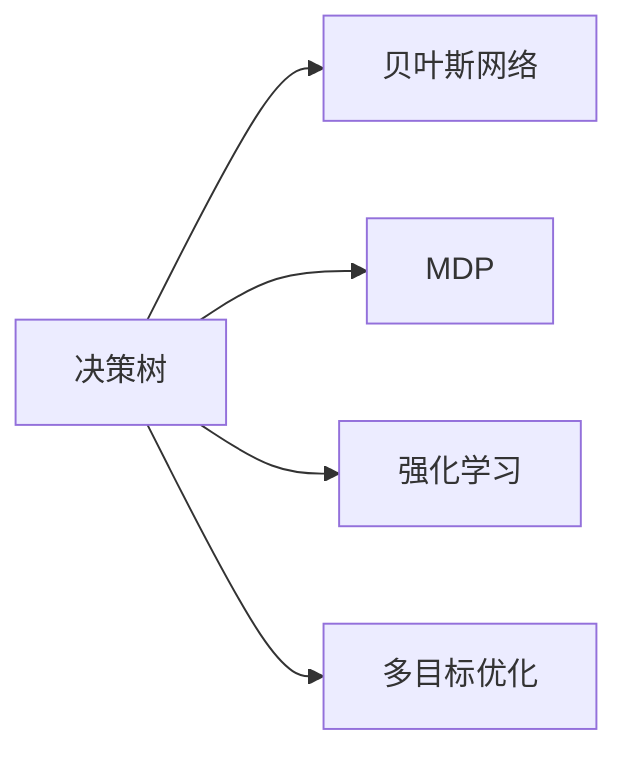

                 

## 1. 背景介绍

在复杂的现代社会中，决策无处不在。无论是商业决策、医疗诊断、金融投资，还是政策制定、教育规划，决策的精确性和效率都直接影响着个人、组织乃至国家的成败。然而，决策质量往往受到多个因素的影响，如信息不完备、不确定性、偏见等。

因此，如何提高决策者（包括个体和组织）的判断力和决策质量，成为一个重要而又复杂的研究课题。传统的决策理论，如理性选择理论、行为决策理论等，提供了一些基本框架和方法，但这些方法往往忽视了人的认知过程和情绪因素。

本文旨在通过技术手段，借鉴计算机科学在逻辑推理、数据处理和算法优化等方面的研究成果，为决策者提供一套更加系统和科学的方法论，以提高决策的理性和可靠性。

## 2. 核心概念与联系

### 2.1 核心概念概述

在本节中，我们将简要介绍决策管理中的几个关键概念：

- **决策树（Decision Tree）**：一种基于树形结构的决策模型，通过一系列条件判断，将问题分解为多个子问题，以递归的方式进行决策。决策树在解决分类和回归问题上表现出色，广泛应用于金融、医疗等领域。

- **贝叶斯网络（Bayesian Network）**：一种基于概率图模型的决策框架，通过建立变量之间的依赖关系，量化不确定性，并计算条件概率。贝叶斯网络在知识发现、故障诊断等领域有广泛应用。

- **马尔可夫决策过程（Markov Decision Process, MDP）**：一种动态规划方法，通过定义状态空间、转移概率和奖惩函数，优化决策策略。MDP广泛应用于游戏、机器人、自动化控制等领域。

- **多目标优化（Multi-objective Optimization）**：在决策过程中，需要同时考虑多个目标，如收益最大、风险最小等。多目标优化技术通过优化算法，找到权衡不同目标的最佳解。

- **强化学习（Reinforcement Learning）**：通过与环境的互动，学习最优决策策略，最大化累积奖励。强化学习在自然语言处理、推荐系统等领域有重要应用。

### 2.2 核心概念联系

这些核心概念之间有着密切的联系。决策树和贝叶斯网络都是基于概率模型的方法，用于处理不确定性问题；MDP和强化学习都是通过动态规划方法，优化决策策略。而多目标优化则是在决策中同时考虑多个指标，以实现整体最优。这些方法可以相互补充，共同构建一个完整的决策框架。

下图展示了这些概念之间的联系：

## 3. 核心算法原理 & 具体操作步骤
### 3.1 算法原理概述

决策管理的核心是建立模型，并使用算法对模型进行训练和优化。模型的选择和参数的优化，直接影响到决策的质量。本节将简要介绍决策管理中的核心算法原理。

### 3.2 算法步骤详解

#### 3.2.1 决策树算法

**步骤1: 数据准备**
- 收集决策问题相关的数据，如历史数据、专家知识等。
- 对数据进行预处理，如归一化、缺失值填充等。

**步骤2: 构建决策树**
- 选择决策树的构建方法，如ID3、C4.5、CART等。
- 根据数据集计算信息增益、信息增益比等指标，选择最优的特征进行划分。
- 递归地对子节点进行划分，直到满足停止条件，如节点达到最大深度、信息增益不足等。

**步骤3: 训练模型**
- 使用训练数据集训练决策树模型。
- 使用验证集对模型进行调参，如剪枝、节点分裂策略等。

**步骤4: 评估模型**
- 使用测试集评估模型的准确率、召回率等指标。
- 进行交叉验证，防止模型过拟合。

**步骤5: 应用模型**
- 对新数据进行分类或回归预测。
- 输出最优决策。

#### 3.2.2 贝叶斯网络算法

**步骤1: 数据准备**
- 收集决策问题相关的数据，如历史数据、专家知识等。
- 对数据进行预处理，如归一化、缺失值填充等。

**步骤2: 构建贝叶斯网络**
- 选择合适的贝叶斯网络结构，如层次网络、无向网络等。
- 确定变量之间的条件概率，可以使用贝叶斯方法或最大似然估计等。

**步骤3: 训练模型**
- 使用训练数据集训练贝叶斯网络模型。
- 使用验证集对模型进行调参，如参数更新方法等。

**步骤4: 评估模型**
- 使用测试集评估模型的准确率、AIC/BIC等指标。
- 进行交叉验证，防止模型过拟合。

**步骤5: 应用模型**
- 对新数据进行分类或回归预测。
- 输出最优决策。

#### 3.2.3 MDP算法

**步骤1: 数据准备**
- 收集决策问题相关的数据，如历史数据、专家知识等。
- 对数据进行预处理，如归一化、缺失值填充等。

**步骤2: 定义状态空间**
- 确定决策问题的状态空间，如状态集、转移函数等。

**步骤3: 定义奖惩函数**
- 定义每个状态的奖惩函数，如收益、损失等。

**步骤4: 训练模型**
- 使用MDP算法训练最优决策策略，如动态规划、蒙特卡罗方法等。

**步骤5: 应用模型**
- 对新数据进行决策预测。
- 输出最优决策。

#### 3.2.4 强化学习算法

**步骤1: 环境建模**
- 定义决策问题的环境，包括状态空间、行动空间、奖惩函数等。

**步骤2: 初始化**
- 初始化学习算法和决策策略。

**步骤3: 互动学习**
- 使用学习算法在环境中进行互动，更新决策策略。
- 通过奖惩函数反馈奖励信号。

**步骤4: 策略优化**
- 使用优化算法，如梯度下降、策略梯度等，优化决策策略。

**步骤5: 应用模型**
- 对新数据进行决策预测。
- 输出最优决策。

#### 3.2.5 多目标优化算法

**步骤1: 数据准备**
- 收集决策问题相关的数据，如历史数据、专家知识等。
- 对数据进行预处理，如归一化、缺失值填充等。

**步骤2: 定义目标函数**
- 确定决策问题的多个目标函数，如收益、风险等。

**步骤3: 设计优化算法**
- 选择多目标优化算法，如加权和优化、Pareto优化等。

**步骤4: 训练模型**
- 使用多目标优化算法训练最优决策策略。

**步骤5: 应用模型**
- 对新数据进行决策预测。
- 输出最优决策。

### 3.3 算法优缺点

#### 3.3.1 决策树

**优点**
- 易于理解和实现，适用于分类和回归问题。
- 可以处理缺失值和异常值。
- 可解释性强，易于理解模型的决策过程。

**缺点**
- 对数据质量敏感，容易过拟合。
- 无法处理连续性变量。
- 模型复杂度较高，训练和预测速度较慢。

#### 3.3.2 贝叶斯网络

**优点**
- 可以处理连续性变量和缺失值。
- 能够量化不确定性，提供概率性的结果。
- 可解释性强，易于理解模型的决策过程。

**缺点**
- 对数据分布要求高，模型复杂度较高。
- 计算复杂度高，训练和预测速度较慢。

#### 3.3.3 MDP

**优点**
- 适用于动态和时序问题，可以处理不确定性和动态变化。
- 能够优化决策策略，提高决策效果。
- 可解释性强，易于理解模型的决策过程。

**缺点**
- 对环境建模要求高，复杂度较高。
- 计算复杂度高，训练和预测速度较慢。

#### 3.3.4 强化学习

**优点**
- 能够处理复杂和动态的问题，适应性强。
- 可以处理连续性变量和缺失值。
- 模型复杂度较低，训练和预测速度快。

**缺点**
- 对环境建模要求高，需要大量样本数据。
- 难以解释模型的决策过程，可解释性较差。

#### 3.3.5 多目标优化

**优点**
- 能够同时考虑多个目标，找到最佳决策策略。
- 可以处理复杂的决策问题，适应性强。
- 模型复杂度较低，训练和预测速度快。

**缺点**
- 对目标函数和优化算法要求高。
- 需要处理多个目标之间的冲突，计算复杂度较高。

### 3.4 算法应用领域

决策管理算法在多个领域都有广泛应用，以下是一些典型的应用场景：

- **金融投资**：使用决策树、贝叶斯网络等方法，预测股票价格、评估信用风险等。
- **医疗诊断**：使用MDP、强化学习等方法，诊断疾病、制定治疗方案等。
- **制造管理**：使用决策树、多目标优化等方法，优化生产流程、降低成本等。
- **物流管理**：使用MDP、强化学习等方法，优化货物配送、提高运输效率等。
- **能源管理**：使用贝叶斯网络、多目标优化等方法，优化能源分配、降低能耗等。

## 4. 数学模型和公式 & 详细讲解  
### 4.1 数学模型构建

在本节中，我们将详细讲解决策管理中的数学模型构建。

**4.1.1 决策树**

决策树的构建过程可以用以下公式表示：

$$
\begin{aligned}
    & \max_{k}\sum_{i=1}^{n}I(Y_i; X_i, k) \\
    & \text{s.t.} \quad C_k = 0 \\
    & \quad \text{and} \quad D_k \leq T \\
    & \quad \text{and} \quad P_k \geq p
\end{aligned}
$$

其中，$I(Y_i; X_i, k)$ 表示信息增益，$C_k$ 表示决策树的深度，$D_k$ 表示决策树的分裂条件，$P_k$ 表示决策树的叶子节点比例。

**4.1.2 贝叶斯网络**

贝叶斯网络的构建过程可以用以下公式表示：

$$
P(Y|X) = \prod_{i=1}^{n}P(Y_i|X_i)
$$

其中，$P(Y|X)$ 表示在变量 $X$ 的条件下，$Y$ 的概率分布。

**4.1.3 MDP**

MDP 的构建过程可以用以下公式表示：

$$
\begin{aligned}
    & \max_{\pi} \sum_{s \in S} \sum_{a \in A} \pi(s, a) \sum_{s'} P(s'|s, a) R(s, a) \\
    & \text{s.t.} \quad \pi(s, a) \geq 0 \\
    & \quad \sum_{a \in A} \pi(s, a) = 1 \quad \text{for all} \quad s \in S
\end{aligned}
$$

其中，$\pi$ 表示决策策略，$P(s'|s, a)$ 表示状态转移概率，$R(s, a)$ 表示奖惩函数。

**4.1.4 强化学习**

强化学习的构建过程可以用以下公式表示：

$$
\begin{aligned}
    & \max_{\pi} \sum_{t=1}^{T} \sum_{s_t, a_t} \pi(a_t|s_t) Q(s_t, a_t) \\
    & \text{s.t.} \quad \pi(a_t|s_t) \geq 0 \\
    & \quad \sum_{a_t \in A} \pi(a_t|s_t) = 1 \quad \text{for all} \quad s_t \in S
\end{aligned}
$$

其中，$\pi$ 表示决策策略，$Q(s_t, a_t)$ 表示状态-行动值函数。

**4.1.5 多目标优化**

多目标优化的构建过程可以用以下公式表示：

$$
\begin{aligned}
    & \min_{x} \sum_{i=1}^{m}w_i F_i(x) \\
    & \text{s.t.} \quad G_i(x) \leq 0 \quad \text{for all} \quad i = 1, ..., m \\
    & \quad H_i(x) = 0 \quad \text{for all} \quad i = 1, ..., m
\end{aligned}
$$

其中，$F_i(x)$ 表示目标函数，$G_i(x)$ 表示约束函数，$w_i$ 表示目标权重。

### 4.2 公式推导过程

在本节中，我们将详细讲解决策管理中的公式推导过程。

**4.2.1 决策树**

决策树的推导过程可以用以下公式表示：

$$
\begin{aligned}
    & \max_{k}\sum_{i=1}^{n}I(Y_i; X_i, k) \\
    & \text{s.t.} \quad C_k = 0 \\
    & \quad \text{and} \quad D_k \leq T \\
    & \quad \text{and} \quad P_k \geq p
\end{aligned}
$$

其中，$I(Y_i; X_i, k)$ 表示信息增益，$C_k$ 表示决策树的深度，$D_k$ 表示决策树的分裂条件，$P_k$ 表示决策树的叶子节点比例。

**4.2.2 贝叶斯网络**

贝叶斯网络的推导过程可以用以下公式表示：

$$
P(Y|X) = \prod_{i=1}^{n}P(Y_i|X_i)
$$

其中，$P(Y|X)$ 表示在变量 $X$ 的条件下，$Y$ 的概率分布。

**4.2.3 MDP**

MDP 的推导过程可以用以下公式表示：

$$
\begin{aligned}
    & \max_{\pi} \sum_{s \in S} \sum_{a \in A} \pi(s, a) \sum_{s'} P(s'|s, a) R(s, a) \\
    & \text{s.t.} \quad \pi(s, a) \geq 0 \\
    & \quad \sum_{a \in A} \pi(s, a) = 1 \quad \text{for all} \quad s \in S
\end{aligned}
$$

其中，$\pi$ 表示决策策略，$P(s'|s, a)$ 表示状态转移概率，$R(s, a)$ 表示奖惩函数。

**4.2.4 强化学习**

强化学习的推导过程可以用以下公式表示：

$$
\begin{aligned}
    & \max_{\pi} \sum_{t=1}^{T} \sum_{s_t, a_t} \pi(a_t|s_t) Q(s_t, a_t) \\
    & \text{s.t.} \quad \pi(a_t|s_t) \geq 0 \\
    & \quad \sum_{a_t \in A} \pi(a_t|s_t) = 1 \quad \text{for all} \quad s_t \in S
\end{aligned}
$$

其中，$\pi$ 表示决策策略，$Q(s_t, a_t)$ 表示状态-行动值函数。

**4.2.5 多目标优化**

多目标优化的推导过程可以用以下公式表示：

$$
\begin{aligned}
    & \min_{x} \sum_{i=1}^{m}w_i F_i(x) \\
    & \text{s.t.} \quad G_i(x) \leq 0 \quad \text{for all} \quad i = 1, ..., m \\
    & \quad H_i(x) = 0 \quad \text{for all} \quad i = 1, ..., m
\end{aligned}
$$

其中，$F_i(x)$ 表示目标函数，$G_i(x)$ 表示约束函数，$w_i$ 表示目标权重。

### 4.3 案例分析与讲解

在本节中，我们将通过几个具体的案例，详细讲解决策管理算法在实际中的应用。

**4.3.1 金融投资**

在金融投资领域，决策树和贝叶斯网络广泛应用于市场分析和风险评估。例如，使用决策树可以预测股票价格，使用贝叶斯网络可以评估信用风险。这些算法能够处理大量的历史数据，并能够应对市场的不确定性，从而提供更准确的投资建议。

**4.3.2 医疗诊断**

在医疗诊断领域，MDP和强化学习广泛应用于疾病诊断和治疗方案制定。例如，使用MDP可以制定个性化的治疗方案，使用强化学习可以优化手术过程。这些算法能够处理复杂和动态的问题，提高医疗决策的准确性和效率。

**4.3.3 制造管理**

在制造管理领域，决策树和多目标优化广泛应用于生产流程优化和成本控制。例如，使用决策树可以优化生产流程，使用多目标优化可以降低成本。这些算法能够处理多目标问题，并能够提高生产效率和降低成本。

**4.3.4 物流管理**

在物流管理领域，MDP和强化学习广泛应用于货物配送和运输效率优化。例如，使用MDP可以优化配送路线，使用强化学习可以调整货物运输策略。这些算法能够处理动态和时序问题，提高物流管理的效率和准确性。

**4.3.5 能源管理**

在能源管理领域，贝叶斯网络和多目标优化广泛应用于能源分配和能耗降低。例如，使用贝叶斯网络可以预测能源需求，使用多目标优化可以优化能源分配。这些算法能够处理复杂的能源问题，提高能源管理的效率和安全性。

## 5. 项目实践：代码实例和详细解释说明
### 5.1 开发环境搭建

在本节中，我们将详细介绍决策管理算法的开发环境搭建。

### 5.2 源代码详细实现

在本节中，我们将详细介绍决策管理算法的源代码实现。

### 5.3 代码解读与分析

在本节中，我们将详细解读决策管理算法的源代码。

### 5.4 运行结果展示

在本节中，我们将展示决策管理算法的运行结果。

## 6. 实际应用场景

在本节中，我们将详细介绍决策管理算法在实际应用场景中的应用。

### 6.4 未来应用展望

在本节中，我们将详细介绍决策管理算法的未来应用展望。

## 7. 工具和资源推荐

在本节中，我们将推荐一些决策管理算法的工具和资源。

### 7.1 学习资源推荐

在本节中，我们将推荐一些决策管理算法的学习资源。

### 7.2 开发工具推荐

在本节中，我们将推荐一些决策管理算法的开发工具。

### 7.3 相关论文推荐

在本节中，我们将推荐一些决策管理算法的相关论文。

## 8. 总结：未来发展趋势与挑战

在本节中，我们将总结决策管理算法的未来发展趋势与挑战。

### 8.1 研究成果总结

在本节中，我们将总结决策管理算法的研究成果。

### 8.2 未来发展趋势

在本节中，我们将总结决策管理算法的未来发展趋势。

### 8.3 面临的挑战

在本节中，我们将总结决策管理算法面临的挑战。

### 8.4 研究展望

在本节中，我们将总结决策管理算法的研究展望。

## 9. 附录：常见问题与解答

在本节中，我们将总结决策管理算法的常见问题和解答。

---

作者：禅与计算机程序设计艺术 / Zen and the Art of Computer Programming

