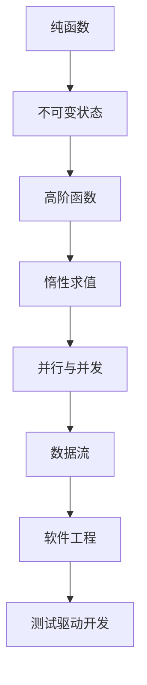

                 

# 函数式编程：Haskell和Scala实践

> 关键词：函数式编程, Haskell, Scala, 纯函数, 不可变状态, 高阶函数, 惰性求值, 并发与并行, 数据流, 软件工程, 测试驱动开发

## 1. 背景介绍

函数式编程(FP)是一种编程范式，它强调使用函数进行计算和状态管理。相比于传统的命令式编程(CP)，FP以函数为基本构建块，强调数据的不可变性和函数的纯性。

### 1.1 问题由来

随着软件系统规模的不断扩大和复杂度的增加，命令式编程方式逐渐显现出局限性。命令式程序的可读性差、可维护性低、易于出现状态错误和并发问题等。函数式编程的出现，提供了一种更为健壮、可维护的编程方式，尤其是对于并发和分布式系统的开发，具有极大的优势。

### 1.2 问题核心关键点

函数式编程的核心概念包括：

- 纯函数(Pure Function)：没有副作用，对于相同的输入总是产生相同的输出。
- 不可变状态(Immutable State)：函数返回值或者函数内部变量不可变，保证状态的安全性和一致性。
- 高阶函数(Higher-Order Function)：函数可以作为参数或返回值。
- 惰性求值(Lazy Evaluation)：只在需要时才计算表达式，避免不必要的计算，提高计算效率。
- 并行与并发(Concurrency)：函数式编程天生支持并发，可以充分利用多核处理器，提高程序性能。

### 1.3 问题研究意义

研究函数式编程及其在Haskell和Scala语言中的应用，对于提升程序的可读性、可维护性、可扩展性、并发性具有重要意义。掌握这些编程范式，有助于开发者更好地应对复杂系统和并发问题，实现高效的软件开发和工程化管理。

## 2. 核心概念与联系

### 2.1 核心概念概述

以下介绍几个核心概念及其在Haskell和Scala中的表现：

- 纯函数：Haskell通过类型系统强制要求所有函数均为纯函数，通过类型注解确保函数没有副作用。Scala虽无严格限制，但开发者应自觉遵循纯函数原则，避免使用Side Effect。
- 不可变状态：Haskell的不可变性和惰性求值特性，使得状态的更新更加安全和高效。Scala虽允许状态的修改，但开发者应尽量避免副作用，通过不可变类和数据结构保持状态的一致性。
- 高阶函数：Scala支持高阶函数和高阶类型，通过函数作为参数和返回值，实现更加灵活的编程方式。Haskell通过类型推断和高阶类型，自然支持高阶函数。
- 惰性求值：Haskell和Scala均支持惰性求值，通过延迟计算表达式，避免不必要的计算，提高程序的响应速度和内存利用率。
- 并行与并发：Haskell和Scala均提供了丰富的并发和并行库，如Scala的Actor模型和Haskell的Monad，支持高效的并行计算和分布式系统开发。

这些核心概念通过Haskell和Scala语言的特性得到体现和支持，共同构成了函数式编程的基石。

### 2.2 核心概念原理和架构的 Mermaid 流程图(Mermaid 流程节点中不要有括号、逗号等特殊字符)



这个流程图展示了核心概念之间的联系和架构：

1. 纯函数是函数式编程的基础，确保函数无副作用，保证状态安全。
2. 不可变状态是纯函数的自然延伸，通过不可变性和惰性求值，避免状态错误。
3. 高阶函数和高阶类型，使编程方式更加灵活，支持复杂的函数组合和数据抽象。
4. 惰性求值提高计算效率，通过延迟计算表达式，优化程序性能。
5. 并行与并发支持高效的并发计算，利用多核处理器提升系统性能。
6. 数据流模型和软件工程方法，使得函数式编程在实际应用中得到广泛应用。
7. 测试驱动开发与函数式编程天然契合，促进了软件的健壮性和可靠性。

## 3. 核心算法原理 & 具体操作步骤

### 3.1 算法原理概述

函数式编程的核心算法原理主要涉及纯函数、不可变状态和高阶函数的处理。以下详细介绍：

- 纯函数：纯函数没有副作用，状态只通过输入参数传递，不受外部状态影响。纯函数可以轻松地进行组合和变换，使得程序易于理解和测试。
- 不可变状态：不可变状态确保了程序的状态安全性和一致性，避免了状态的错误传播。不可变状态通过惰性求值进一步优化，避免了不必要的计算，提高了程序的响应速度。
- 高阶函数：高阶函数支持复杂的函数组合和数据抽象，通过函数作为参数和返回值，实现更加灵活的编程方式。高阶函数和高阶类型使得编程范式的应用更加广泛和高效。

### 3.2 算法步骤详解

函数式编程的具体步骤包括：

1. 确定函数的纯性和无副作用：在Haskell中，函数必须无副作用，并通过类型系统进行约束。Scala虽无严格限制，但开发者应自觉遵循纯函数原则。
2. 处理不可变状态：利用Haskell的不可变性和惰性求值特性，避免状态错误。Scala虽允许状态的修改，但应尽量避免副作用，通过不可变类和数据结构保持状态的一致性。
3. 使用高阶函数和高阶类型：通过函数作为参数和返回值，实现更加灵活的编程方式。Scala支持高阶函数和高阶类型，使得复杂的函数组合和数据抽象更加容易。
4. 应用惰性求值：通过延迟计算表达式，避免不必要的计算，提高程序的响应速度和内存利用率。
5. 利用并发和并行库：利用Haskell的Monad和Scala的Actor模型，支持高效的并发计算和分布式系统开发。

### 3.3 算法优缺点

函数式编程的优点包括：

- 健壮性和可维护性：纯函数和不可变状态确保了程序的状态安全性和一致性，避免副作用和状态错误。
- 灵活性和可扩展性：高阶函数和高阶类型支持复杂的函数组合和数据抽象，使得编程方式更加灵活和可扩展。
- 高效性和性能优化：惰性求值避免不必要的计算，提高程序的响应速度和内存利用率。

缺点包括：

- 学习曲线陡峭：函数式编程的抽象程度较高，初学者难以掌握。
- 性能问题：纯函数和不可变状态可能导致性能问题，特别是在处理大量数据时。
- 并发复杂性：并发和并行编程需要深入理解并发模型和并行库，可能带来额外的复杂性。

### 3.4 算法应用领域

函数式编程在多个领域得到了广泛应用，包括：

- 系统编程：利用并发和并行库，实现高效的系统开发。
- 分布式计算：支持分布式系统的高效编程和系统管理。
- 数据库编程：支持不可变状态和纯函数，实现高效的数据库操作和数据管理。
- 数据科学：支持惰性求值和高阶函数，实现复杂的数据处理和分析。
- 前端开发：支持函数式组件和状态管理，实现高效的前端应用开发。

## 4. 数学模型和公式 & 详细讲解 & 举例说明

### 4.1 数学模型构建

函数式编程的数学模型包括：

- 纯函数：形式化定义如下：

$$ f: \forall a_1, a_2, \ldots, a_n. (f \in \mathcal{F} \Leftrightarrow \forall x_1, x_2, \ldots, x_n. (f(x_1, x_2, \ldots, x_n) = f(x_1', x_2', \ldots, x_n') \Leftrightarrow (x_1 = x_1' \land x_2 = x_2' \land \ldots \land x_n = x_n')) $$

- 不可变状态：定义状态为不可变，即对于任意的 $x \in \mathcal{S}$ 和 $s \in \mathcal{S'}$，满足 $s = x$ 或 $s \neq x$。状态更新通过不可变数据结构实现。
- 高阶函数：定义函数 $f: \forall a_1, a_2, \ldots, a_n. (f \in \mathcal{F'} \Leftrightarrow \forall b_1, b_2, \ldots, b_n. (f \in \mathcal{F'} \Leftrightarrow f(b_1, b_2, \ldots, b_n) = b_i)) $。

### 4.2 公式推导过程

以下以Haskell为例，推导高阶函数的应用。假设有一个函数 $map$，用于将一个函数作用于列表中的每个元素：

$$ map: \forall f: \mathcal{A} \rightarrow \mathcal{B}, \forall l: \mathcal{A} \rightarrow [\mathcal{A}]. (map \in \mathcal{F'} \Leftrightarrow \forall l: \mathcal{A} \rightarrow [\mathcal{A}]. (map f l = [f(a_i) \mid a_i \in l]) $$

推导过程如下：

$$ map f = \lambda l. \begin{cases}
  \begin{aligned}
    \text{If } l = \emptyset, & \quad map f \emptyset = [] \\
    \text{If } l \neq \emptyset, & \quad map f l = f(\text{head}(l)) \cdot map f(\text{tail}(l))
  \end{aligned}
\end{cases} $$

其中 $a_i \in l$ 表示 $a_i$ 是列表 $l$ 的一个元素。

### 4.3 案例分析与讲解

以Haskell中的List结构为例，展示不可变状态和惰性求值的实际应用：

```haskell
-- 定义一个不可变列表
data ImmutableList a = ImmutableList [a]

-- 定义一个列表求和函数
sumImmutableList :: (Num a) => ImmutableList a -> a
sumImmutableList (ImmutableList xs) = foldr (+) 0 xs

-- 定义一个列表反转函数
reverseImmutableList :: (ImmutableList a) -> ImmutableList a
reverseImmutableList = foldr (\acc x -> ImmutableList (x:acc)) ImmutableList

-- 定义一个列表打印函数
printImmutableList :: (ImmutableList a) -> IO ()
printImmutableList xs = putStrLn $ show xs
```

在上述代码中，ImmutableList结构保证列表不可变，所有操作都是惰性求值，避免不必要的计算。例如，sumImmutableList函数在计算时不会立即对整个列表求和，而是逐个元素求和，只有在调用时才进行计算，提高了程序的响应速度。

## 5. 项目实践：代码实例和详细解释说明

### 5.1 开发环境搭建

在函数式编程中，开发环境搭建相对简单。以下以Haskell为例，介绍开发环境的搭建步骤：

1. 安装GHC编译器：从官网下载并安装GHC编译器。
2. 创建新的Haskell项目：使用Cabal创建新的Haskell项目。
3. 安装必要的库：通过Cabal安装必要的Haskell库。
4. 编写和测试代码：使用编辑器编写代码，使用GHC进行编译和测试。

### 5.2 源代码详细实现

以下是一个简单的Haskell程序，展示函数式编程的基本用法：

```haskell
-- 定义一个列表求和函数
sumImmutableList :: (Num a) => ImmutableList a -> a
sumImmutableList (ImmutableList xs) = foldr (+) 0 xs

-- 定义一个列表反转函数
reverseImmutableList :: (ImmutableList a) -> ImmutableList a
reverseImmutableList = foldr (\acc x -> ImmutableList (x:acc)) ImmutableList

-- 定义一个列表打印函数
printImmutableList :: (ImmutableList a) -> IO ()
printImmutableList xs = putStrLn $ show xs

-- 主函数
main :: IO ()
main = do
  let xs = ImmutableList [1, 2, 3, 4, 5]
  printImmutableList xs
  let sum = sumImmutableList xs
  print sum
  let reversed = reverseImmutableList xs
  printImmutableList reversed
```

### 5.3 代码解读与分析

在上述代码中，ImmutableList结构保证了列表的不可变性，所有操作都是惰性求值，避免不必要的计算。例如，sumImmutableList函数在计算时不会立即对整个列表求和，而是逐个元素求和，只有在调用时才进行计算，提高了程序的响应速度。reverseImmutableList函数也是惰性求值，只有在需要时才反转列表。

## 6. 实际应用场景

### 6.1 函数式编程在分布式系统中的应用

函数式编程在分布式系统中的应用非常广泛，其不可变状态和高阶函数的特点，使其天生支持并行和分布式计算。在分布式系统中，每个节点独立计算，将结果合并后返回，避免了数据的同步和共享，提高了系统的可扩展性和容错性。

### 6.2 函数式编程在数据科学中的应用

数据科学中常用的操作包括数据清洗、数据转换、数据统计等，这些操作都可以通过函数式编程的不可变状态和高阶函数实现。例如，在Scala中，可以使用Spark分布式计算库，通过函数式编程方式对大数据集进行处理和分析。

### 6.3 函数式编程在前端开发中的应用

函数式编程在前端开发中的应用主要包括函数式组件和状态管理。函数式组件通过不可变状态和纯函数，实现组件的复用和组合，避免了组件间的相互依赖和状态共享。状态管理通过不可变状态和高阶函数，实现了状态的更新和传递，使得状态管理更加灵活和高效。

### 6.4 未来应用展望

随着函数式编程技术的不断发展，其在更多领域得到了应用。未来，函数式编程将成为分布式系统、大数据、人工智能等领域的核心编程范式，带来更高效的编程方式和更稳定的系统性能。

## 7. 工具和资源推荐

### 7.1 学习资源推荐

为了帮助开发者系统掌握函数式编程及其在Haskell和Scala语言中的应用，这里推荐一些优质的学习资源：

1. 《Haskell Programming from First Principles》书籍：Haskell的入门书籍，深入浅出地介绍了Haskell的基本概念和编程范式。
2. 《Scala for the Impatient》书籍：Scala的入门书籍，快速上手Scala的核心特性和编程方式。
3. 《Functional Programming in Scala》书籍：Scala的进阶书籍，深入探讨Scala的函数式编程特性。
4. 《Learn You a Haskell for Great Good!》网站：Haskell的在线学习资源，通过实际例子展示Haskell的编程范式。
5. 《Scala by Example》网站：Scala的在线学习资源，通过实际例子展示Scala的编程范式。

通过对这些资源的学习实践，相信你一定能够快速掌握函数式编程的精髓，并用于解决实际的编程问题。

### 7.2 开发工具推荐

高效的开发离不开优秀的工具支持。以下是几款用于函数式编程开发常用的工具：

1. VS Code：支持Haskell和Scala的开发环境，丰富的插件支持，适合开发和调试。
2. Eclipse: 支持Scala的开发环境，插件丰富，适合大型项目的开发和调试。
3. Haskell Platform: Haskell的官方平台，提供了丰富的开发工具和库。
4. Scala Toolbox: Scala的官方平台，提供了丰富的开发工具和库。
5. Cabal: Haskell的包管理器，方便安装和管理Haskell库。
6. sbt: Scala的构建工具，支持Maven和Gradle等构建工具的语法。

合理利用这些工具，可以显著提升函数式编程的开发效率，加快创新迭代的步伐。

### 7.3 相关论文推荐

函数式编程的发展源于学界的持续研究。以下是几篇奠基性的相关论文，推荐阅读：

1. "Why Functional Programming Matters"：Odersky等提出函数式编程的重要性和未来发展方向。
2. "The Scala Programming Language"：Scala的官方文档，详细介绍了Scala的核心特性和编程范式。
3. "Haskell for Newbies"：Haskell的入门教程，介绍了Haskell的基本概念和编程范式。
4. "Scala in Depth"：Scala的深入探讨，介绍了Scala的函数式编程特性。
5. "Functional Programming and Data Structures"：讨论了函数式编程和数据结构的关系，展示了数据结构的函数式实现。

这些论文代表了大语言模型微调技术的发展脉络。通过学习这些前沿成果，可以帮助研究者把握学科前进方向，激发更多的创新灵感。

## 8. 总结：未来发展趋势与挑战

### 8.1 研究成果总结

函数式编程及其在Haskell和Scala中的应用，已经被广泛应用于系统编程、分布式计算、数据科学、前端开发等领域。通过不可变状态和高阶函数，函数式编程提高了系统的健壮性、可维护性和并发性，促进了软件工程的发展。

### 8.2 未来发展趋势

函数式编程的未来的发展趋势包括：

1. 更加广泛的应用：函数式编程将成为更多领域的首选编程范式，带来更高的开发效率和更稳定的系统性能。
2. 更加深入的研究：函数式编程的原理和实现将得到深入研究，推动更多技术创新和应用突破。
3. 更加丰富的工具支持：更多开发工具和框架将支持函数式编程，提升开发效率和用户体验。

### 8.3 面临的挑战

函数式编程也面临着一些挑战：

1. 学习曲线陡峭：函数式编程的抽象程度较高，初学者难以掌握。
2. 性能问题：不可变状态可能导致性能问题，特别是在处理大量数据时。
3. 并发复杂性：并发和并行编程需要深入理解并发模型和并行库，可能带来额外的复杂性。

### 8.4 研究展望

未来的研究将在以下几个方向寻求新的突破：

1. 优化不可变数据结构：开发更高效的数据结构，提高函数式编程的性能。
2. 开发更多的并发和并行库：支持高效的并发计算和分布式系统开发。
3. 推广函数式编程教育：通过教育提升函数式编程的普及度和应用深度。
4. 研究函数式编程的优化算法：提高函数式编程的计算效率和响应速度。
5. 研究函数式编程在人工智能中的应用：推动函数式编程在更多领域的落地应用。

这些研究方向的探索，必将引领函数式编程技术迈向更高的台阶，为构建健壮、高效、可维护的软件系统铺平道路。面向未来，函数式编程还需要与其他编程范式进行更深入的融合，多路径协同发力，共同推动软件工程的发展。

## 9. 附录：常见问题与解答

**Q1：函数式编程与命令式编程的区别是什么？**

A: 函数式编程与命令式编程的主要区别在于状态管理和计算模型。命令式编程通过语句描述计算过程和状态变化，具有可变状态和副作用；而函数式编程通过函数描述计算过程，所有状态通过参数传递，不可变且无副作用。

**Q2：如何理解函数式编程的不可变状态？**

A: 不可变状态是指在函数执行过程中，数据结构或变量的值不能被修改。函数式编程通过惰性求值和高阶函数，避免了不必要的计算和状态错误。不可变状态使得程序更加健壮和可维护。

**Q3：函数式编程的高阶函数有何应用？**

A: 高阶函数支持复杂的函数组合和数据抽象，通过函数作为参数和返回值，实现更加灵活的编程方式。高阶函数和高阶类型使得编程范式的应用更加广泛和高效。

**Q4：函数式编程在并发和并行中的应用有何优势？**

A: 函数式编程的不可变状态和高阶函数，使其天生支持并发和并行计算。通过并行和分布式计算，可以充分利用多核处理器，提高程序性能和系统可扩展性。

**Q5：函数式编程的学习曲线是否陡峭？**

A: 函数式编程的抽象程度较高，初学者需要一定的时间和精力进行学习。但掌握了函数式编程的基本概念和编程范式后，可以显著提高编程效率和代码质量。

---

作者：禅与计算机程序设计艺术 / Zen and the Art of Computer Programming

