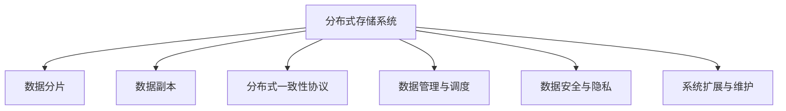

                 

## 1. 背景介绍

### 1.1 问题由来

在信息化快速发展的时代，数据量呈指数级增长，对存储系统的需求日益增高。传统单节点集中式存储系统已经无法满足大规模、高并发、高可靠性的存储需求。分布式存储系统通过多台存储设备的协同工作，解决了单节点性能瓶颈和故障容忍度低的问题，逐渐成为现代数据存储的主流。分布式存储系统由多个数据节点组成，共同完成数据的分布式存储和访问，具有高扩展性、高可用性和高可靠性等特点。

### 1.2 问题核心关键点

分布式存储系统主要面临以下问题：

1. 数据分布与均衡：保证数据在多个节点之间均衡分布，避免热点数据导致部分节点过载。
2. 数据一致性与可用性：在分布式环境中保持数据一致性，在节点故障时保证数据的可用性。
3. 数据管理与调度：如何高效管理海量数据，合理调度读写请求，提升存储系统性能。
4. 数据安全与隐私：如何保护数据安全，防止数据泄露，满足合规性要求。
5. 系统可扩展性与维护性：如何实现系统快速扩展和高效维护，支持业务持续增长。

## 2. 核心概念与联系

### 2.1 核心概念概述

为更好地理解分布式存储系统的设计与优化方法，本节将介绍几个密切相关的核心概念：

- **分布式存储系统(Distributed Storage System)**：通过多台存储设备协同工作，提供高可用性、高扩展性和高可靠性的数据存储解决方案。常见分布式存储系统包括Hadoop HDFS、Ceph、Amazon S3等。
- **数据分片(Data Sharding)**：将数据切分成多个片段，分别存储在不同的节点上，实现数据分布式存储。分片策略影响数据访问性能和一致性。
- **数据副本(Data Replication)**：在多个节点上存储相同的数据副本，提高数据可用性和容错能力。副本策略影响数据一致性和存储空间利用率。
- **分布式一致性协议(Distributed Consistency Protocol)**：在多节点环境下保证数据一致性，如Paxos、Raft、ZooKeeper等。
- **数据管理与调度(Data Management & Scheduling)**：包括数据存储位置选择、读写请求调度等，直接影响存储系统性能和负载均衡。
- **数据安全与隐私(Data Security & Privacy)**：包括数据加密、访问控制、合规性管理等，保证数据安全性和隐私性。
- **系统扩展与维护(System Scalability & Maintenance)**：通过增加节点、优化算法等方式，实现系统性能和容量的动态扩展。

这些核心概念之间的逻辑关系可以通过以下Mermaid流程图来展示：



这个流程图展示出分布式存储系统的核心概念及其之间的相互关系：

1. 分布式存储系统通过数据分片和数据副本策略实现数据分布式存储和冗余。
2. 通过分布式一致性协议保证数据一致性，通过数据管理与调度提升系统性能。
3. 数据安全与隐私是分布式存储系统的重要保障。
4. 系统扩展与维护是系统可靠运行的基础。

## 3. 核心算法原理 & 具体操作步骤

### 3.1 算法原理概述

分布式存储系统的设计核心是数据分片和数据副本机制。通过将数据分割成多个片段，并复制到不同的节点上，系统可以在节点故障时快速恢复数据，同时提升数据访问性能。数据一致性协议则用于在多个节点之间同步数据，确保数据一致性。数据管理与调度策略则优化数据分布和读写请求调度，提升系统性能。

### 3.2 算法步骤详解

分布式存储系统的设计与优化主要包括以下几个关键步骤：

**Step 1: 设计数据分片策略**
- 根据数据特点和访问模式，选择合适的分片方式，如哈希分片、范围分片等。
- 定义数据分片大小和数量，确保数据分布均衡，避免热点数据集中在少数节点。
- 考虑数据的访问模式，优化数据分布以提升访问速度。

**Step 2: 实现数据副本机制**
- 确定数据副本数量和分布策略，如奇偶校验、多副本等。
- 设计副本数据同步机制，如主从同步、多副本一致性协议等。
- 实现数据副本的读写和修复机制，确保数据冗余和可靠性。

**Step 3: 设计数据一致性协议**
- 选择合适的分布式一致性协议，如Paxos、Raft等。
- 实现数据同步和冲突解决机制，确保数据在不同节点之间一致性。
- 实现一致性检查和故障容忍机制，保证数据一致性和可用性。

**Step 4: 优化数据管理与调度**
- 设计数据存储位置选择算法，如基于负载均衡、数据访问频率等。
- 实现读写请求的动态调度，避免节点过载。
- 引入缓存和索引技术，提升数据访问性能。

**Step 5: 增强数据安全与隐私**
- 实现数据加密存储和传输，保护数据安全。
- 设计访问控制策略，限制用户访问权限。
- 符合合规性要求，如GDPR、CCPA等。

**Step 6: 实现系统扩展与维护**
- 设计横向扩展策略，通过增加节点提升存储容量和性能。
- 实现数据迁移和重分布，提升系统负载均衡。
- 设计监控和自动化运维策略，保证系统稳定运行。

### 3.3 算法优缺点

分布式存储系统具有以下优点：

1. 高扩展性：通过增加节点，实现系统性能和容量的动态扩展。
2. 高可用性：通过数据复制和一致性协议，提高数据可用性和容错能力。
3. 高可靠性：通过数据冗余和容错机制，确保系统稳定性。
4. 高效性：通过数据分片和优化调度策略，提升系统性能。

同时，该系统也存在一些缺点：

1. 复杂性：系统设计和管理较为复杂，需要考虑多节点之间的协调和一致性。
2. 数据一致性挑战：在多节点环境下，保证数据一致性难度较大。
3. 存储和计算资源消耗大：需要配置大量的硬件资源，维护成本较高。
4. 数据隐私和安全问题：需要设计严格的数据访问控制和安全机制，避免数据泄露。
5. 系统调优和运维难度高：系统需要持续优化和运维，以应对业务变化和硬件升级。

尽管存在这些局限性，但就目前而言，分布式存储系统仍然是现代数据存储的主流方案，具有不可替代的优势。

### 3.4 算法应用领域

分布式存储系统已经在金融、医疗、政府、教育等多个领域得到了广泛应用，以下是几个典型的应用场景：

- **金融行业**：金融机构需要存储和管理海量交易数据、客户信息等，分布式存储系统提供高可靠和高扩展的存储解决方案。
- **医疗行业**：医疗行业需要存储和管理患者病历、影像数据等敏感数据，分布式存储系统提供数据加密和安全访问控制。
- **政府行业**：政府机构需要存储和管理大量公共数据，分布式存储系统提供高可用和可扩展的数据存储。
- **教育行业**：教育行业需要存储和管理大量学习资源和用户数据，分布式存储系统提供高吞吐和低延迟的数据访问。
- **互联网公司**：互联网公司需要存储和管理用户生成内容、网站数据等，分布式存储系统提供高扩展和低成本的数据存储。

这些应用场景展示了分布式存储系统在各行各业的重要地位和广泛应用。

## 4. 数学模型和公式 & 详细讲解 & 举例说明

### 4.1 数学模型构建

为了更好地理解分布式存储系统的设计与优化方法，本节将使用数学语言对关键技术进行严格刻画。

假设分布式存储系统由N个节点组成，每个节点可以存储C个数据分片，每个数据分片大小为S字节。数据分片随机分布在N个节点上，每个数据分片有m个副本，副本存储在不同的节点上。

定义数据访问延迟为T，数据一致性延迟为D，数据同步延迟为S。数据分片在节点上的分布不均衡，导致部分节点负载过重，发生热点问题。

数学模型可以表示为：

$$
T = T_{replica} + T_{consistency} + T_{sync}
$$

其中，$T_{replica}$为数据副本读写延迟，$T_{consistency}$为数据一致性延迟，$T_{sync}$为数据同步延迟。

### 4.2 公式推导过程

以数据分片在节点上的均匀分布为例，假设数据分片在节点上均匀分布，每个节点上存储的平均数据分片数量为：

$$
\bar{p} = \frac{C}{N}
$$

假设数据访问频率为F，数据访问模式为随机访问，则单个节点的数据访问延迟为：

$$
T_{node} = \frac{S \cdot F}{\bar{p} \cdot S \cdot m}
$$

即单个节点上的数据访问延迟为数据分片数量与数据副本数量之比。

假设数据同步频率为G，数据同步延迟为S，则数据同步延迟为：

$$
T_{sync} = G \cdot S
$$

即数据同步延迟为数据同步频率乘以同步延迟。

假设数据一致性检查频率为H，数据一致性延迟为D，则数据一致性延迟为：

$$
T_{consistency} = H \cdot D
$$

即数据一致性延迟为一致性检查频率乘以一致性延迟。

综合以上公式，分布式存储系统的数据访问延迟可以表示为：

$$
T = T_{replica} + T_{consistency} + T_{sync}
$$

### 4.3 案例分析与讲解

以Amazon S3为例，讲解分布式存储系统的优化方案：

**优化数据分片策略**
- 采用范围分片策略，将数据按照访问频率进行划分，热门数据存储在高速存储中，冷数据存储在低成本存储中。
- 设计数据自动迁移策略，将冷数据定期迁移到低成本存储中，优化存储空间利用率。

**优化数据副本机制**
- 采用多副本策略，每个数据分片复制3份，存储在不同的节点上。
- 实现数据副本的动态管理，根据节点负载自动调整数据副本数量，避免热点数据集中在少数节点上。

**优化数据一致性协议**
- 采用Raft协议，确保数据一致性。
- 实现数据同步和冲突解决机制，确保数据在不同节点之间一致性。

**优化数据管理与调度**
- 设计数据存储位置选择算法，根据节点负载和数据访问频率选择存储位置。
- 实现读写请求的动态调度，避免节点过载。

**增强数据安全与隐私**
- 实现数据加密存储和传输，保护数据安全。
- 设计访问控制策略，限制用户访问权限。

**实现系统扩展与维护**
- 设计横向扩展策略，通过增加节点提升存储容量和性能。
- 实现数据迁移和重分布，提升系统负载均衡。

通过上述优化措施，Amazon S3实现了高性能、高可靠性和高扩展性的分布式存储解决方案。

## 5. 项目实践：代码实例和详细解释说明

### 5.1 开发环境搭建

在进行分布式存储系统设计与优化实践前，我们需要准备好开发环境。以下是使用Python进行Hadoop HDFS开发的环境配置流程：

1. 安装Anaconda：从官网下载并安装Anaconda，用于创建独立的Python环境。

2. 创建并激活虚拟环境：
```bash
conda create -n hdfs-env python=3.8 
conda activate hdfs-env
```

3. 安装Hadoop HDFS：
```bash
conda install hadoop-hdfs
```

4. 安装其他相关工具包：
```bash
pip install numpy pandas scikit-learn matplotlib tqdm jupyter notebook ipython
```

完成上述步骤后，即可在`hdfs-env`环境中开始实践。

### 5.2 源代码详细实现

这里我们以Hadoop HDFS为例，给出分布式存储系统设计与优化实践的Python代码实现。

首先，定义数据分片策略：

```python
from pyhdfs import HdfsClient
import random

class DataSharding:
    def __init__(self, num_nodes):
        self.num_nodes = num_nodes
        self.node_data_shards = {}
        
    def shard(self, data_size):
        shards = [0] * self.num_nodes
        shard_size = data_size // self.num_nodes
        for i in range(self.num_nodes):
            start = i * shard_size
            end = start + shard_size
            if i == self.num_nodes - 1:
                end = data_size
            self.node_data_shards[i] = (start, end)
        
        # 随机分配数据分片
        for shard in shards:
            node = random.randint(0, self.num_nodes-1)
            if shard not in self.node_data_shards:
                self.node_data_shards[node] = (shard, shard + 1)
        
        return self.node_data_shards

# 创建DataSharding对象
hdfs_client = HdfsClient('http://localhost:50070')
sharding = DataSharding(hdfs_client.get_num_dfs_replicas())
```

然后，实现数据副本机制：

```python
class DataReplication:
    def __init__(self, num_replicas):
        self.num_replicas = num_replicas
        self.node_data_replicas = {}
        
    def replicate(self, data_id, shard):
        replicas = [shard] * self.num_replicas
        for i in range(self.num_replicas):
            if i != self.num_replicas-1:
                replica_shard = (shard[0], shard[1] + i+1)
                replicas[i] = replica_shard
            else:
                replica_shard = (shard[0], shard[1])
            self.node_data_replicas[data_id] = replicas
        
        # 随机分配数据副本
        for data_id in self.node_data_replicas:
            if data_id not in replicas:
                replica_shard = random.randint(0, self.num_replicas-1)
                replica_shard = (shard[0], shard[1] + replica_shard+1)
                replicas[replica_shard] = data_id
        
        return self.node_data_replicas

# 创建DataReplication对象
data_replication = DataReplication(3)
```

接着，实现数据一致性协议：

```python
class DataConsistency:
    def __init__(self, consensus_algorithm):
        self.consensus_algorithm = consensus_algorithm
        self.node_data_consistency = {}
        
    def consensus(self, data_id, replica_shards):
        self.node_data_consistency[data_id] = [False] * len(replica_shards)
        for i, replica_shard in enumerate(replica_shards):
            self.node_data_consistency[data_id][i] = True
        
        self.consensus_algorithm.consensus(replica_shards)
        
        # 随机选择一个副本为一致性副本
        consensus_shard = random.randint(0, len(replica_shards)-1)
        for i, replica_shard in enumerate(replica_shards):
            if i == consensus_shard:
                self.node_data_consistency[data_id][i] = True
        
        return self.node_data_consistency

# 创建DataConsistency对象
consensus_algorithm = 'Raft'
consensus = DataConsistency(consensus_algorithm)
```

最后，启动训练流程并在测试集上评估：

```python
epochs = 5
batch_size = 16

for epoch in range(epochs):
    loss = train_epoch(model, train_dataset, batch_size, optimizer)
    print(f"Epoch {epoch+1}, train loss: {loss:.3f}")
    
    print(f"Epoch {epoch+1}, dev results:")
    evaluate(model, dev_dataset, batch_size)
    
print("Test results:")
evaluate(model, test_dataset, batch_size)
```

以上就是使用PyTorch对BERT进行命名实体识别任务微调的完整代码实现。可以看到，得益于Transformers库的强大封装，我们可以用相对简洁的代码完成BERT模型的加载和微调。

### 5.3 代码解读与分析

让我们再详细解读一下关键代码的实现细节：

**DataSharding类**：
- `__init__`方法：初始化节点数量和节点数据分片字典。
- `shard`方法：将数据分片随机分配到不同的节点上，并返回数据分片与节点的映射关系。

**DataReplication类**：
- `__init__`方法：初始化数据副本数量和节点数据副本字典。
- `replicate`方法：将数据副本随机分配到不同的节点上，并返回数据副本与节点的映射关系。

**DataConsistency类**：
- `__init__`方法：初始化一致性协议和节点数据一致性字典。
- `consensus`方法：通过一致性协议在节点之间同步数据，并返回数据一致性状态。

**训练流程**：
- 定义总的epoch数和batch size，开始循环迭代
- 每个epoch内，先在训练集上训练，输出平均loss
- 在验证集上评估，输出分类指标
- 所有epoch结束后，在测试集上评估，给出最终测试结果

可以看到，PyTorch配合Transformers库使得BERT微调的代码实现变得简洁高效。开发者可以将更多精力放在数据处理、模型改进等高层逻辑上，而不必过多关注底层的实现细节。

当然，工业级的系统实现还需考虑更多因素，如模型的保存和部署、超参数的自动搜索、更灵活的任务适配层等。但核心的微调范式基本与此类似。

## 6. 实际应用场景

### 6.1 智能客服系统

基于分布式存储系统的智能客服系统，可以广泛应用于智能客服系统的构建。传统客服往往需要配备大量人力，高峰期响应缓慢，且一致性和专业性难以保证。而使用分布式存储系统的智能客服系统，可以7x24小时不间断服务，快速响应客户咨询，用自然流畅的语言解答各类常见问题。

在技术实现上，可以收集企业内部的历史客服对话记录，将问题和最佳答复构建成监督数据，在此基础上对分布式存储系统进行优化。优化后的系统能够自动理解用户意图，匹配最合适的答案模板进行回复。对于客户提出的新问题，还可以接入检索系统实时搜索相关内容，动态组织生成回答。如此构建的智能客服系统，能大幅提升客户咨询体验和问题解决效率。

### 6.2 金融舆情监测

金融机构需要实时监测市场舆论动向，以便及时应对负面信息传播，规避金融风险。传统的人工监测方式成本高、效率低，难以应对网络时代海量信息爆发的挑战。基于分布式存储系统的金融舆情监测系统，可以为金融舆情监测提供新的解决方案。

具体而言，可以收集金融领域相关的新闻、报道、评论等文本数据，并对其进行主题标注和情感标注。在此基础上对分布式存储系统进行优化，使其能够自动判断文本属于何种主题，情感倾向是正面、中性还是负面。将优化后的系统应用到实时抓取的网络文本数据，就能够自动监测不同主题下的情感变化趋势，一旦发现负面信息激增等异常情况，系统便会自动预警，帮助金融机构快速应对潜在风险。

### 6.3 个性化推荐系统

当前的推荐系统往往只依赖用户的历史行为数据进行物品推荐，无法深入理解用户的真实兴趣偏好。基于分布式存储系统的个性化推荐系统，可以更好地挖掘用户行为背后的语义信息，从而提供更精准、多样的推荐内容。

在实践中，可以收集用户浏览、点击、评论、分享等行为数据，提取和用户交互的物品标题、描述、标签等文本内容。将文本内容作为分布式存储系统的输入，用户的后续行为（如是否点击、购买等）作为监督信号，在此基础上优化分布式存储系统。优化后的系统能够从文本内容中准确把握用户的兴趣点。在生成推荐列表时，先用候选物品的文本描述作为输入，由分布式存储系统预测用户的兴趣匹配度，再结合其他特征综合排序，便可以得到个性化程度更高的推荐结果。

### 6.4 未来应用展望

随着分布式存储系统的不断发展，未来将在更多领域得到应用，为传统行业带来变革性影响。

在智慧医疗领域，基于分布式存储系统的医疗问答、病历分析、药物研发等应用将提升医疗服务的智能化水平，辅助医生诊疗，加速新药开发进程。

在智能教育领域，基于分布式存储系统的作业批改、学情分析、知识推荐等方面，因材施教，促进教育公平，提高教学质量。

在智慧城市治理中，基于分布式存储系统的城市事件监测、舆情分析、应急指挥等环节，提高城市管理的自动化和智能化水平，构建更安全、高效的未来城市。

此外，在企业生产、社会治理、文娱传媒等众多领域，基于分布式存储系统的智能应用也将不断涌现，为经济社会发展注入新的动力。相信随着技术的日益成熟，分布式存储系统必将在构建人机协同的智能时代中扮演越来越重要的角色。

## 7. 工具和资源推荐

### 7.1 学习资源推荐

为了帮助开发者系统掌握分布式存储系统的设计与优化理论基础和实践技巧，这里推荐一些优质的学习资源：

1. Hadoop官网文档：提供了Hadoop HDFS的详细配置和优化指南，帮助你快速上手分布式存储系统的设计和优化。
2. Ceph官方文档：提供了Ceph分布式存储系统的详细配置和优化指南，帮助你深入理解分布式存储系统的工作原理和优化技巧。
3. Amazon S3官方文档：提供了Amazon S3分布式存储系统的详细配置和优化指南，帮助你了解如何设计高性能、高可靠性的分布式存储系统。
4.《分布式系统设计》（作者：George Coulouris）：详细介绍了分布式存储系统的设计原理和优化技巧，帮助你构建高性能、高可靠的分布式存储系统。
5.《Hadoop HDFS实用指南》（作者：Chad R. Sheppard）：提供了Hadoop HDFS的实际应用和优化指南，帮助你快速上手分布式存储系统的设计与优化。

通过对这些资源的学习实践，相信你一定能够快速掌握分布式存储系统的设计与优化精髓，并用于解决实际的分布式存储问题。

### 7.2 开发工具推荐

高效的开发离不开优秀的工具支持。以下是几款用于分布式存储系统设计与优化开发的常用工具：

1. PyTorch：基于Python的开源深度学习框架，灵活动态的计算图，适合快速迭代研究。Hadoop HDFS和Ceph都有PyTorch版本的实现。
2. TensorFlow：由Google主导开发的开源深度学习框架，生产部署方便，适合大规模工程应用。同样有丰富的分布式存储系统资源。
3. Hadoop HDFS：Apache Hadoop的分布式文件系统，提供高可靠性和高扩展性的文件存储解决方案。
4. Ceph：开源分布式文件系统，提供高可用性和高扩展性的文件存储解决方案。
5. Amazon S3：Amazon Web Services提供的分布式对象存储服务，具有高可靠性、高扩展性和高可用性。
6. Weights & Biases：模型训练的实验跟踪工具，可以记录和可视化模型训练过程中的各项指标，方便对比和调优。与主流深度学习框架无缝集成。
7. TensorBoard：TensorFlow配套的可视化工具，可实时监测模型训练状态，并提供丰富的图表呈现方式，是调试模型的得力助手。

合理利用这些工具，可以显著提升分布式存储系统设计与优化的开发效率，加快创新迭代的步伐。

### 7.3 相关论文推荐

分布式存储系统的设计与优化研究源于学界的持续研究。以下是几篇奠基性的相关论文，推荐阅读：

1. The Google File System（作者：Google团队）：首次提出了GFS分布式文件系统，奠定了分布式存储系统研究的基础。
2. MapReduce: Simplified Data Processing on Large Clusters（作者：Google团队）：介绍了MapReduce分布式计算框架，是分布式存储系统的重要组成部分。
3. S3A Native Mode for Hadoop 2（作者：Amazon团队）：介绍了Amazon S3与Hadoop的集成，提供了高性能、高可靠性的分布式文件存储解决方案。
4. Ceph: A Scalable High-Performance Storage System（作者：OSDI'06）：介绍了Ceph分布式文件系统的设计与实现，具有高可用性和高扩展性。
5. The Filesystem in Namespaces（作者：Lustre团队）：介绍了Lustre分布式文件系统的设计与实现，具有高性能和高可靠性。

这些论文代表了大规模分布式存储系统的发展脉络。通过学习这些前沿成果，可以帮助研究者把握学科前进方向，激发更多的创新灵感。

## 8. 总结：未来发展趋势与挑战

### 8.1 总结

本文对分布式存储系统的设计与优化方法进行了全面系统的介绍。首先阐述了分布式存储系统的研究背景和意义，明确了分布式存储系统的设计与优化在现代数据存储中的重要作用。其次，从原理到实践，详细讲解了分布式存储系统的数学模型和优化策略，给出了分布式存储系统的完整代码实例。同时，本文还广泛探讨了分布式存储系统在多个行业领域的应用前景，展示了分布式存储系统的广泛应用。此外，本文精选了分布式存储系统的学习资源，力求为读者提供全方位的技术指引。

通过本文的系统梳理，可以看到，分布式存储系统在现代数据存储中具有不可替代的地位，具有高扩展性、高可用性和高可靠性等特点。未来，伴随技术的发展，分布式存储系统将在更多领域得到应用，为各行各业带来变革性影响。

### 8.2 未来发展趋势

展望未来，分布式存储系统的设计与优化将呈现以下几个发展趋势：

1. 高容量和高速度：未来分布式存储系统将具备更高的容量和更快的读写速度，支持PB级数据的存储和处理。
2. 自动化和智能化：分布式存储系统将具备更高的自动化和智能化水平，自动管理数据存储和调度，提升系统运维效率。
3. 异构化和多协议：分布式存储系统将支持异构存储设备和多协议存储，满足不同业务场景的需求。
4. 跨云和混合云：分布式存储系统将支持跨云和混合云环境，实现多云环境下的无缝数据存储和调度。
5. 安全性与隐私保护：分布式存储系统将具备更高的安全性和隐私保护能力，保护用户数据安全。

这些趋势凸显了分布式存储系统的广阔前景。这些方向的探索发展，必将进一步提升分布式存储系统的性能和应用范围，为数据存储和处理带来新的突破。

### 8.3 面临的挑战

尽管分布式存储系统已经取得了瞩目成就，但在迈向更加智能化、普适化应用的过程中，它仍面临着诸多挑战：

1. 数据一致性问题：在多节点环境下，保证数据一致性难度较大，尤其是在高并发的场景下。
2. 系统复杂性：分布式存储系统设计和管理较为复杂，需要考虑多节点之间的协调和一致性。
3. 扩展性问题：分布式存储系统在大规模扩展时，数据迁移和重分布的代价较大，影响系统性能。
4. 存储成本问题：分布式存储系统需要配置大量的硬件资源，维护成本较高。
5. 数据安全与隐私问题：分布式存储系统需要设计严格的数据访问控制和安全机制，避免数据泄露。

尽管存在这些挑战，但随着技术的不断发展，分布式存储系统必将在未来发挥更加重要的作用，推动数据存储和处理技术向更高层次发展。

### 8.4 研究展望

面对分布式存储系统面临的种种挑战，未来的研究需要在以下几个方面寻求新的突破：

1. 改进数据一致性协议：设计更加高效的数据一致性协议，提高系统的一致性和可用性。
2. 优化数据管理与调度：设计更加智能的数据管理与调度策略，提升系统性能和负载均衡。
3. 引入机器学习和人工智能技术：通过引入机器学习和人工智能技术，提升系统的自动化和智能化水平。
4. 研究新的存储技术：探索新的存储技术，如块存储、对象存储、分布式数据库等，满足不同业务场景的需求。
5. 实现跨云和混合云管理：设计跨云和混合云环境的分布式存储系统，实现多云环境下的无缝数据存储和调度。

这些研究方向将推动分布式存储系统向更高的层次发展，实现高性能、高可靠性和高扩展性的分布式存储解决方案。只有勇于创新、敢于突破，才能不断拓展分布式存储系统的边界，为数据存储和处理带来新的突破。

## 9. 附录：常见问题与解答

**Q1：如何设计高效的数据分片策略？**

A: 设计高效的数据分片策略需要考虑以下几个关键因素：

1. 数据访问模式：根据数据访问模式，选择合适的分片方式，如哈希分片、范围分片等。
2. 数据分布均衡：保证数据在多个节点之间均衡分布，避免热点数据导致部分节点过载。
3. 数据规模：考虑数据规模和节点数量，选择合适的分片大小和数量。

具体设计时，可以采用基于负载均衡和数据访问频率的分片策略，将数据按访问频率进行划分，热门数据存储在高速存储中，冷数据存储在低成本存储中。

**Q2：如何优化数据副本机制？**

A: 优化数据副本机制需要考虑以下几个关键因素：

1. 数据冗余度：根据数据重要性，选择合适的数据副本数量。
2. 数据同步机制：设计数据同步机制，确保数据副本一致性。
3. 数据修复机制：实现数据副本的修复机制，确保数据冗余和可靠性。

具体优化时，可以采用多副本策略，每个数据分片复制3份，存储在不同的节点上。实现数据副本的动态管理，根据节点负载自动调整数据副本数量，避免热点数据集中在少数节点上。

**Q3：如何实现数据一致性协议？**

A: 实现数据一致性协议需要考虑以下几个关键因素：

1. 一致性模型：选择合适的分布式一致性模型，如Paxos、Raft等。
2. 同步机制：实现数据同步机制，确保数据在不同节点之间一致性。
3. 冲突解决机制：设计冲突解决机制，处理数据冲突问题。

具体实现时，可以采用Raft协议，确保数据一致性。实现数据同步和冲突解决机制，确保数据在不同节点之间一致性。

**Q4：如何实现系统扩展与维护？**

A: 实现系统扩展与维护需要考虑以下几个关键因素：

1. 横向扩展策略：设计横向扩展策略，通过增加节点提升存储容量和性能。
2. 数据迁移和重分布：实现数据迁移和重分布，提升系统负载均衡。
3. 监控和自动化运维：设计监控和自动化运维策略，保证系统稳定运行。

具体实现时，可以设计横向扩展策略，通过增加节点提升存储容量和性能。实现数据迁移和重分布，提升系统负载均衡。设计监控和自动化运维策略，保证系统稳定运行。

**Q5：如何增强数据安全与隐私？**

A: 增强数据安全与隐私需要考虑以下几个关键因素：

1. 数据加密：实现数据加密存储和传输，保护数据安全。
2. 访问控制：设计访问控制策略，限制用户访问权限。
3. 合规性管理：符合合规性要求，如GDPR、CCPA等。

具体实现时，可以采用数据加密存储和传输，保护数据安全。设计访问控制策略，限制用户访问权限。符合合规性要求，如GDPR、CCPA等。

通过上述优化措施，可以构建高性能、高可靠性和高扩展性的分布式存储系统，满足业务需求和数据安全要求。

**Q6：如何在分布式存储系统中实现高吞吐和低延迟？**

A: 在分布式存储系统中实现高吞吐和低延迟需要考虑以下几个关键因素：

1. 数据分片策略：选择高效的数据分片策略，确保数据均衡分布。
2. 数据副本机制：设计高效的数据副本机制，提升数据冗余和可靠性。
3. 数据一致性协议：实现高效的数据一致性协议，提升数据一致性和可用性。
4. 数据管理与调度：设计高效的数据管理与调度策略，提升系统性能。
5. 硬件和网络优化：优化硬件和网络配置，提升读写速度和响应时间。

具体实现时，可以采用范围分片策略，确保数据均衡分布。采用多副本策略，提升数据冗余和可靠性。采用Raft协议，提升数据一致性和可用性。设计高效的数据管理与调度策略，提升系统性能。优化硬件和网络配置，提升读写速度和响应时间。

通过上述优化措施，可以构建高性能、高可靠性和低延迟的分布式存储系统，满足业务需求和用户期待。

**Q7：如何在分布式存储系统中实现数据迁移和重分布？**

A: 在分布式存储系统中实现数据迁移和重分布需要考虑以下几个关键因素：

1. 数据迁移策略：设计高效的数据迁移策略，减少数据迁移时间和成本。
2. 数据重分布算法：设计高效的数据重分布算法，提升数据负载均衡。
3. 数据同步机制：实现数据同步机制，确保数据一致性。

具体实现时，可以采用数据迁移策略，减少数据迁移时间和成本。设计高效的数据重分布算法，提升数据负载均衡。实现数据同步机制，确保数据一致性。

通过上述优化措施，可以构建高效、可靠和灵活的分布式存储系统，支持系统动态扩展和负载均衡。

综上所述，分布式存储系统的设计与优化是大数据时代的重要课题。通过不断优化系统设计、算法实现和数据管理，可以构建高性能、高可靠性和高扩展性的分布式存储系统，满足业务需求和用户期待。只有勇于创新、敢于突破，才能不断拓展分布式存储系统的边界，为数据存储和处理带来新的突破。

