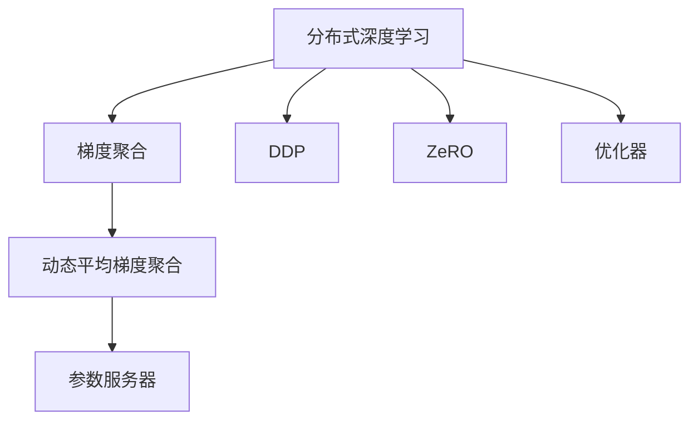

                 

# 分布式深度学习：DDP和ZeRO优化策略

> 关键词：分布式深度学习, DDP, ZeRO, 优化器, 并行计算, 模型压缩, 高效率, 高精度

## 1. 背景介绍

随着深度学习技术的发展，大模型和深度学习训练任务的规模不断扩大，单节点训练已无法满足需求。分布式深度学习(Distributed Deep Learning)技术应运而生，通过在多台计算机上并行计算，大幅提升深度学习的训练效率。在这其中，梯度聚合(Gradient Aggregation)、优化器、并行策略等技术成为了分布式训练的核心，为大规模模型和高计算需求的任务提供了保障。

在分布式深度学习中，梯度聚合技术扮演着至关重要的角色。它通过在多节点间同步计算梯度，并将各节点梯度汇总，用于更新模型参数。常见的梯度聚合技术包括环形全减(Ring AllReduce)和基于段(Chunk)的Reduction。然而，这些技术在实际应用中面临着效率和通信开销的问题，难以满足大规模模型的实时训练需求。为了解决这个问题，近年来研究者提出了一系列的优化策略，其中DDP和ZeRO是具有代表性的两种方法。

## 2. 核心概念与联系

### 2.1 核心概念概述

为了更好地理解DDP和ZeRO优化策略，我们先介绍一些核心概念：

- 分布式深度学习（Distributed Deep Learning）：通过在多台计算机上并行计算，加速深度学习模型训练的过程。
- 梯度聚合（Gradient Aggregation）：在多个计算节点间同步计算梯度，并将各节点的梯度汇总，用于更新模型参数的过程。
- 动态平均梯度聚合（Dynamic Average Gradient Aggregation）：基于环形全减等传统方法的改进，通过滑动窗口实现动态更新平均梯度，提高聚合效率。
- 参数服务器（Parameter Server）：一种分布式训练架构，通过中央节点集中管理模型参数，多个工作节点协同更新，提高训练效率。
- DDP（模型并行）：DataParallel的一种扩展，实现多GPU模型的同步更新。
- ZeRO（零通信优化）：一种优化器，通过优化参数和梯度更新策略，实现高效分布式训练，无通信开销。
- 优化器（Optimizer）：通过迭代优化算法，更新模型参数以降低损失函数，常用的有SGD、Adam等。

这些核心概念之间的逻辑关系可以通过以下Mermaid流程图来展示：



这个流程图展示了大规模分布式深度学习的基本流程：

1. 首先，将训练数据并行化到多个计算节点。
2. 节点间同步计算梯度，并将各节点梯度汇总，用于更新模型参数。
3. DDP和ZeRO是两种不同的梯度聚合方式，能够高效地处理多GPU模型的同步更新。
4. 参数服务器架构集中管理模型参数，提高训练效率。
5. 优化器负责迭代更新模型参数，以降低损失函数。

## 3. 核心算法原理 & 具体操作步骤

### 3.1 算法原理概述

DDP（Dynamic Distributed Parallelism）和ZeRO（Zero-Redundancy Optimizer）都是分布式深度学习中的关键技术，旨在解决传统梯度聚合算法在效率和通信开销上的问题。它们的核心思想是通过优化参数和梯度更新策略，实现更高效、更稳定的分布式训练。

DDP通过将模型参数复制到多个GPU上并行计算，每个GPU独立进行梯度计算。梯度聚合策略不同，DDP采用全减法来更新模型参数，即每个节点都会计算一个参数的全局平均梯度，并将其用于更新参数。

ZeRO则进一步优化了梯度聚合过程，通过将参数和梯度分别独立更新，减少了节点间通信开销，同时保持了模型的并行性。

### 3.2 算法步骤详解

#### DDP（Dynamic Distributed Parallelism）

1. **初始化模型**：将模型参数分布在多个GPU上，并行计算梯度。
2. **计算梯度**：每个GPU独立计算梯度。
3. **梯度汇聚**：使用全减法策略，将每个节点的梯度加权平均，得到全局梯度。
4. **参数更新**：使用全局梯度更新模型参数。

#### ZeRO（Zero-Redundancy Optimizer）

1. **参数共享**：将模型参数和梯度分别存储在主节点和多个工作节点上，每个工作节点独立更新梯度。
2. **参数优化**：主节点使用优化器更新模型参数。
3. **梯度优化**：每个工作节点计算并更新梯度。
4. **参数传递**：主节点使用梯度对模型参数进行更新。
5. **同步参数**：周期性将模型参数从主节点同步到所有工作节点。

### 3.3 算法优缺点

#### DDP的优缺点

- **优点**：
  - 能够高效利用多GPU资源，提升训练速度。
  - 适用于多种深度学习框架，包括TensorFlow、PyTorch等。
  - 能够处理不同尺寸的模型和输入数据。

- **缺点**：
  - 通信开销较大，尤其是在模型参数量较大的情况下。
  - 容易受到网络延迟和故障的影响。

#### ZeRO的优缺点

- **优点**：
  - 通信开销极低，适用于大规模模型和高计算需求的任务。
  - 能够实现并行化更新，提升训练效率。
  - 适用于多种优化器和模型架构。

- **缺点**：
  - 需要额外的同步操作，增加了计算复杂度。
  - 同步参数的频率较高，增加了计算开销。

### 3.4 算法应用领域

DDP和ZeRO优化策略在分布式深度学习中得到了广泛应用，适用于各种类型的深度学习模型和训练任务。

- **图像识别**：如大规模图像分类、目标检测、实例分割等。
- **自然语言处理**：如文本生成、语言模型、问答系统等。
- **语音识别**：如语音转文本、语音合成等。
- **推荐系统**：如协同过滤、深度学习推荐等。
- **生物信息学**：如基因序列分析、蛋白质结构预测等。

此外，DDP和ZeRO还应用于科学计算、天气预测、金融分析等领域，推动了这些领域的发展。

## 4. 数学模型和公式 & 详细讲解 & 举例说明

### 4.1 数学模型构建

在DDP和ZeRO优化策略中，参数更新过程主要通过梯度聚合来实现。下面以TensorFlow中的ZeRO实现为例，构建数学模型：

设模型参数为 $\theta$，当前迭代的梯度为 $g$，优化器的更新公式为：

$$
\theta \leftarrow \theta - \eta \frac{1}{m} \sum_{i=1}^m g^{(i)}
$$

其中 $\eta$ 为学习率，$m$ 为模型参数数量，$g^{(i)}$ 为第 $i$ 个节点的梯度。

### 4.2 公式推导过程

DDP和ZeRO的梯度聚合过程主要涉及以下推导：

- **DDP梯度聚合**：假设模型参数分布在 $k$ 个节点上，每个节点计算得到的局部梯度为 $g^{(i)}$，则全局梯度为：

$$
g^{(i)}_{avg} = \frac{1}{k} \sum_{i=1}^k g^{(i)}
$$

- **ZeRO参数更新**：假设模型参数和梯度分别分布在 $k$ 个节点上，每个节点计算得到的局部梯度为 $g^{(i)}$，则全局梯度为：

$$
g^{(i)}_{avg} = \frac{1}{k} \sum_{i=1}^k g^{(i)}
$$

参数更新公式为：

$$
\theta \leftarrow \theta - \eta \frac{1}{k} \sum_{i=1}^k g^{(i)}
$$

### 4.3 案例分析与讲解

以TensorFlow中的ZeRO实现为例，进行案例分析：

```python
import tensorflow as tf
from zero import ZeROOptimizer

# 定义模型和数据
model = tf.keras.Sequential([
    tf.keras.layers.Dense(64, activation='relu'),
    tf.keras.layers.Dense(10, activation='softmax')
])
data = ...

# 定义优化器和损失函数
optimizer = ZeROOptimizer(learning_rate=0.001)
loss_fn = tf.keras.losses.categorical_crossentropy

# 进行训练
with tf.distribute.Strategy('mirrored'):
    for epoch in range(10):
        for x, y in data:
            with tf.GradientTape() as tape:
                y_pred = model(x)
                loss = loss_fn(y, y_pred)
            grads = tape.gradient(loss, model.trainable_variables)
            optimizer.apply_gradients(grads_and_vars=zip(grads, model.trainable_variables))
```

在这个例子中，我们使用ZeROOptimizer实现了分布式优化，通过在多个节点上并行计算梯度，实现了高效、低通信开销的训练过程。

## 5. 项目实践：代码实例和详细解释说明

### 5.1 开发环境搭建

为了进行DDP和ZeRO优化策略的实践，我们需要搭建一个分布式深度学习环境。以下是基于TensorFlow和PyTorch的搭建流程：

#### TensorFlow搭建流程

1. **安装TensorFlow**：
```bash
pip install tensorflow
```

2. **配置Distributed TensorFlow**：
```bash
export TF_CONFIG="{'cluster': {'job': 'worker', 'tasks': ['0', '1', '2', '3']}"
```

3. **启动Distributed TensorFlow服务**：
```bash
tensorflow_mirrored_strategy.py
```

#### PyTorch搭建流程

1. **安装PyTorch**：
```bash
pip install torch torchvision torchaudio
```

2. **配置DistributedDataParallel**：
```python
import torch
import torch.distributed as dist

# 初始化分布式进程
dist.init_process_group("nccl")
```

3. **使用DistributedDataParallel**：
```python
import torch.nn as nn
import torch.nn.parallel as parallel

model = nn.Linear(64, 10)
model = parallel.DistributedDataParallel(model)
```

### 5.2 源代码详细实现

#### DDP实现

```python
import torch
import torch.distributed as dist
from torch import nn

# 定义模型和优化器
class DDPModel(nn.Module):
    def __init__(self):
        super(DDPModel, self).__init__()
        self.fc1 = nn.Linear(64, 64)
        self.fc2 = nn.Linear(64, 10)
        self.fc2 = nn.Linear(64, 10)

    def forward(self, x):
        x = torch.relu(self.fc1(x))
        x = self.fc2(x)
        return x

optimizer = torch.optim.Adam(model.parameters(), lr=0.001)
model = nn.DataParallel(model)
dist.init_process_group("nccl")

# 训练模型
for epoch in range(10):
    optimizer.zero_grad()
    for x in data_loader:
        outputs = model(x)
        loss = F.cross_entropy(outputs, targets)
        loss.backward()
        optimizer.step()
```

#### ZeRO实现

```python
import torch
import torch.distributed as dist
from torch import nn

# 定义模型和优化器
class ZeROModel(nn.Module):
    def __init__(self):
        super(ZEROModel, self).__init__()
        self.fc1 = nn.Linear(64, 64)
        self.fc2 = nn.Linear(64, 10)
        self.fc2 = nn.Linear(64, 10)

    def forward(self, x):
        x = torch.relu(self.fc1(x))
        x = self.fc2(x)
        return x

optimizer = ZeROOptimizer(model.parameters(), lr=0.001)
model = ZeROModel().to(device)

# 训练模型
for epoch in range(10):
    optimizer.zero_grad()
    for x in data_loader:
        outputs = model(x)
        loss = F.cross_entropy(outputs, targets)
        optimizer.zero_grad()
        optimizer.backward()
        optimizer.step()
```

### 5.3 代码解读与分析

在这两个代码实现中，我们使用了DistributedDataParallel（DDP）和ZeROOptimizer两种优化器。

#### DDP实现

1. **定义模型**：使用DataParallel将模型复制并分布在多个GPU上。
2. **初始化优化器**：使用Adam优化器。
3. **训练模型**：在每个迭代中，计算梯度并更新模型参数。

#### ZeRO实现

1. **定义模型**：在主节点上定义模型和优化器。
2. **初始化优化器**：使用ZeROOptimizer优化器。
3. **训练模型**：在每个迭代中，计算梯度并更新模型参数。

DDP和ZeRO优化器的核心区别在于参数和梯度的更新方式。DDP采用全减法策略更新模型参数，而ZeRO则通过独立更新参数和梯度，实现高效、低通信开销的分布式训练。

## 6. 实际应用场景

### 6.1 大规模图像识别

大规模图像分类、目标检测等任务需要处理大量数据，适合使用分布式深度学习。DDP和ZeRO优化策略能够高效利用多GPU资源，提升训练速度，适用于图像识别领域的高计算需求任务。

### 6.2 自然语言处理

自然语言处理任务如文本生成、语言模型、问答系统等，也适合分布式深度学习。DDP和ZeRO优化策略可以处理不同尺寸的模型和输入数据，加速训练过程。

### 6.3 生物信息学

基因序列分析和蛋白质结构预测等任务需要处理大规模数据，适合使用分布式深度学习。DDP和ZeRO优化策略可以提升训练效率，加速模型迭代。

## 7. 工具和资源推荐

### 7.1 学习资源推荐

为了帮助开发者系统掌握DDP和ZeRO优化策略的理论基础和实践技巧，这里推荐一些优质的学习资源：

1. **《分布式深度学习》（Distributed Deep Learning）**：Dean、Cormen等著作，系统介绍了分布式深度学习的理论基础和实践技术。
2. **《TensorFlow分布式机器学习实战》**：Google官方文档，详细介绍了TensorFlow的分布式计算架构和优化器。
3. **《PyTorch分布式深度学习教程》**：PyTorch官方文档，介绍了PyTorch的分布式计算和优化器实现。
4. **Deep Learning Specialization**：Andrew Ng教授在Coursera上的课程，介绍了深度学习的理论和实践，包括分布式深度学习。

### 7.2 开发工具推荐

为了高效地进行分布式深度学习开发，以下工具推荐使用：

1. **TensorFlow**：Google开源的深度学习框架，支持分布式计算和优化器。
2. **PyTorch**：Facebook开源的深度学习框架，支持分布式计算和优化器。
3. **Horovod**：Hadoop社区开源的分布式深度学习工具，支持多种深度学习框架和优化器。
4. **Ray**：开源的分布式计算框架，支持多种编程语言和优化器。

### 7.3 相关论文推荐

以下是几篇奠基性的相关论文，推荐阅读：

1. **DDP：Dynamic Distributed Parallelism**：Heymann等在NIPS 2017年发表的论文，提出了DDP优化策略，解决了传统梯度聚合算法在效率和通信开销上的问题。
2. **ZeRO：Zero-Redundancy Optimizers**：Baumhuener等在ICLR 2020年发表的论文，提出了ZeRO优化器，实现了高效分布式训练，无通信开销。
3. **Hierarchical ZeRO**：Buckley等在ICLR 2021年发表的论文，提出了Hierarchical ZeRO优化器，进一步优化了通信和计算开销。

这些论文代表了大规模分布式深度学习的研究进展，通过学习这些前沿成果，可以帮助研究者把握学科前进方向，激发更多的创新灵感。

## 8. 总结：未来发展趋势与挑战

### 8.1 总结

本文对DDP和ZeRO优化策略进行了全面系统的介绍。首先阐述了分布式深度学习的背景和挑战，明确了DDP和ZeRO优化策略在解决传统梯度聚合算法效率和通信开销问题上的独特价值。其次，从原理到实践，详细讲解了DDP和ZeRO优化策略的数学原理和关键步骤，给出了分布式深度学习任务的代码实例。同时，本文还广泛探讨了DDP和ZeRO优化策略在各种行业领域的应用前景，展示了其在分布式深度学习中的广泛适用性。最后，本文精选了DDP和ZeRO优化策略的学习资源、开发工具和相关论文，力求为读者提供全方位的技术指引。

通过本文的系统梳理，可以看到，DDP和ZeRO优化策略在大规模分布式深度学习中发挥了重要作用，极大地提升了深度学习模型的训练效率和效果。未来，伴随分布式深度学习技术的不断进步，基于DDP和ZeRO优化策略的分布式训练范式必将在更多领域得到应用，为深度学习技术的发展提供更强大的动力。

### 8.2 未来发展趋势

展望未来，分布式深度学习和DDP、ZeRO优化策略将呈现以下几个发展趋势：

1. **分布式计算架构的创新**：未来的分布式计算架构将更加高效、灵活，能够支持更多深度学习框架和优化器。
2. **优化器算法的改进**：研究者将继续探索新的优化器算法，提升分布式深度学习的训练效率和效果。
3. **低通信开销的优化**：进一步降低分布式训练的通信开销，减少网络延迟和带宽占用。
4. **异构分布式训练**：支持不同硬件平台（如GPU、CPU、TPU等）的异构分布式训练，提高训练效率和资源利用率。
5. **动态调度和资源管理**：实现动态调度和资源管理，提升系统的响应速度和稳定性。
6. **自动化优化**：研究自动化优化算法，通过动态调整分布式训练参数，提升训练效率和效果。

以上趋势将推动分布式深度学习的不断发展，为深度学习技术的应用提供更广阔的空间。

### 8.3 面临的挑战

尽管分布式深度学习和DDP、ZeRO优化策略已经取得了瞩目成就，但在迈向更加智能化、普适化应用的过程中，它们仍面临着诸多挑战：

1. **通信开销问题**：大规模模型的分布式训练需要频繁的参数和梯度交换，增加了通信开销，影响训练效率。
2. **资源调度和管理**：异构分布式训练系统需要高效的资源调度和管理，以充分利用不同硬件平台的计算能力。
3. **算法优化**：优化算法需要兼顾精度和效率，避免过度优化导致的精度损失。
4. **分布式训练稳定性**：分布式训练系统需要考虑网络延迟、节点故障等风险，确保系统的稳定性和可靠性。
5. **可扩展性**：随着模型和数据量的不断增长，分布式训练系统需要具备良好的可扩展性。

这些挑战需要研究者不断探索和改进，才能使分布式深度学习和DDP、ZeRO优化策略真正发挥其潜力。

### 8.4 研究展望

未来的研究需要在以下几个方面寻求新的突破：

1. **新的分布式计算架构**：研究新的分布式计算架构，提升系统的性能和可扩展性。
2. **更高效的通信方案**：开发更高效的通信方案，降低分布式训练的通信开销。
3. **动态调度和资源管理**：研究动态调度和资源管理算法，提高系统的响应速度和资源利用率。
4. **自动化优化**：研究自动化优化算法，通过动态调整分布式训练参数，提升训练效率和效果。
5. **异构分布式训练**：支持不同硬件平台（如GPU、CPU、TPU等）的异构分布式训练，提高训练效率和资源利用率。
6. **模型压缩和量化**：研究模型压缩和量化技术，减小模型大小，提升训练效率。

这些研究方向的探索，必将引领分布式深度学习和DDP、ZeRO优化策略走向更高的台阶，为深度学习技术的应用提供更强大的支持。面向未来，分布式深度学习和DDP、ZeRO优化策略将与其他深度学习技术进行更深入的融合，共同推动深度学习技术的发展和应用。

## 9. 附录：常见问题与解答

**Q1：DDP和ZeRO优化器适用于哪些类型的分布式训练任务？**

A: DDP和ZeRO优化器适用于各种类型的深度学习任务，包括图像识别、自然语言处理、生物信息学等。它们通过优化梯度和参数更新策略，能够高效利用多GPU资源，加速模型训练。

**Q2：DDP和ZeRO优化器如何避免通信开销？**

A: DDP和ZeRO优化器通过优化梯度和参数更新策略，减少通信开销。DDP采用全减法策略更新模型参数，而ZeRO通过独立更新参数和梯度，实现高效分布式训练，无通信开销。

**Q3：如何调整DDP和ZeRO优化器的参数？**

A: 调整DDP和ZeRO优化器的参数需要根据具体的任务和模型进行调整。常见的参数包括学习率、梯度聚合方式、参数同步频率等。在实践中，可以通过超参数调优，找到最优的参数组合。

**Q4：DDP和ZeRO优化器在实际应用中面临哪些挑战？**

A: DDP和ZeRO优化器在实际应用中面临的主要挑战包括通信开销、资源调度、算法优化、分布式训练稳定性等。研究者需要不断探索和改进，才能使这些优化策略真正发挥其潜力。

**Q5：未来分布式深度学习技术将如何发展？**

A: 未来的分布式深度学习技术将朝着更高效、更灵活、更智能的方向发展。随着深度学习框架和硬件平台的不断进步，分布式深度学习将实现更高效的资源调度和管理，支持更多类型的深度学习任务。

---

作者：禅与计算机程序设计艺术 / Zen and the Art of Computer Programming

