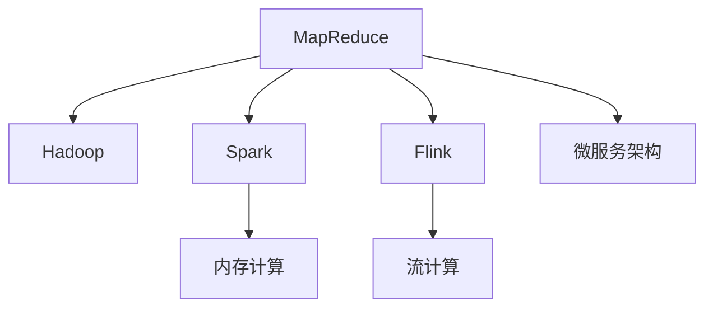

                 

# 分布式计算框架设计与优化

> 关键词：分布式计算, 大规模数据处理, 弹性调度, 资源管理, 容错性, 可扩展性, MapReduce, Hadoop, Spark, Flink, 微服务架构

## 1. 背景介绍

### 1.1 问题由来
随着大数据时代的到来，数据量呈指数级增长，单台计算机的处理能力已无法满足海量数据的高效处理需求。分布式计算框架应运而生，通过将任务分解为并行子任务，并行计算这些子任务，极大提升了数据处理效率。然而，在实际部署和应用中，分布式计算框架也面临诸多挑战，如任务调度和资源管理、容错性和可扩展性等。本文旨在探讨这些问题，提出解决方案，为分布式计算框架的设计和优化提供参考。

### 1.2 问题核心关键点
分布式计算框架的核心问题在于如何高效地组织和调度海量计算任务，充分利用集群中的计算和存储资源，同时保证系统的高可用性和可靠性。本文将详细介绍MapReduce、Hadoop、Spark、Flink等主流分布式计算框架的设计原理与实现机制，并对比它们的优势与劣势。

## 2. 核心概念与联系

### 2.1 核心概念概述

为了更好地理解分布式计算框架的设计与优化，本节将介绍几个关键概念：

- **MapReduce**：一种经典的大数据处理模型，将数据处理任务分为Map和Reduce两个阶段，适合处理大规模数据集。
- **Hadoop**：基于MapReduce设计的开源分布式计算框架，包含Hadoop Distributed File System (HDFS)和YARN资源管理系统。
- **Spark**：基于内存计算的分布式计算框架，通过将数据放入内存中，大幅提升了计算效率。
- **Flink**：基于流计算的分布式计算框架，适合实时数据处理和复杂事件处理。
- **微服务架构**：一种系统架构设计风格，将系统拆分成多个小的、独立的服务模块，提升系统的可扩展性和灵活性。

这些核心概念之间的逻辑关系可以通过以下Mermaid流程图来展示：



这个流程图展示了大数据处理模型和框架的关键概念及其之间的关系：

1. MapReduce是大数据处理的经典模型，被Hadoop等框架所采用。
2. Spark通过优化数据缓存和内存计算，提升了MapReduce的计算效率。
3. Flink基于流计算，特别适合实时数据处理和复杂事件处理。
4. 微服务架构是一种灵活的系统架构设计，支持上述各种框架和模型的高效集成。

这些概念共同构成了分布式计算框架的设计基础，为其提供强大的计算和存储能力，同时支持系统的扩展和优化。

## 3. 核心算法原理 & 具体操作步骤

### 3.1 算法原理概述

分布式计算框架的核心算法包括任务调度、资源管理、数据切分、并行计算和结果合并等。这些算法的设计需要考虑数据的分布和计算任务的特点，以便高效利用集群中的计算资源。

- **任务调度**：根据任务依赖关系和集群资源情况，选择合适的计算节点和计算时间，以最大化利用集群资源。
- **资源管理**：动态调整计算和存储资源，以满足计算任务的需求，同时避免资源浪费和瓶颈。
- **数据切分**：将大文件或大数据集切分成小的数据块，以便并行处理。
- **并行计算**：在多个计算节点上并行计算每个数据块，同时将计算结果合并输出。
- **结果合并**：将多个节点的计算结果合并为一个完整的结果，保证结果的正确性。

### 3.2 算法步骤详解

以Hadoop的MapReduce框架为例，介绍其核心算法的详细步骤：

1. **任务划分**：将原始数据集划分为多个小文件，每个文件独立进行处理。
2. **Map阶段**：每个小文件在多个计算节点上并行进行Map操作，将数据转化为键值对形式，以便后续处理。
3. **Shuffle阶段**：对Map阶段输出的键值对进行排序和合并，将相同键的值合并到一起。
4. **Reduce阶段**：对Shuffle阶段合并后的键值对进行Reduce操作，生成最终结果。

### 3.3 算法优缺点

分布式计算框架的优点包括：

- **高效性**：通过并行计算和任务调度，显著提升数据处理效率。
- **可扩展性**：通过增加计算节点和存储资源，轻松扩展系统规模。
- **容错性**：通过任务重试和数据冗余，保证系统的高可用性。

同时，这些框架也存在一些缺点：

- **复杂性**：需要深入理解分布式计算原理和实现细节，才能有效使用。
- **资源消耗**：需要大量的计算和存储资源，初始投资成本较高。
- **通信开销**：任务在节点间传递数据时，会产生额外的通信开销，影响效率。
- **延迟**：由于数据的分割和合并，以及节点间通信，可能会导致数据处理延迟。

### 3.4 算法应用领域

分布式计算框架广泛应用于以下领域：

- **大数据分析**：处理大规模数据集，生成统计分析结果。
- **实时数据处理**：处理实时数据流，进行实时分析和决策。
- **机器学习**：处理海量训练数据，进行模型训练和预测。
- **科学研究**：处理科学实验数据，进行数据分析和模拟。
- **商业智能**：处理商业数据，进行数据分析和决策支持。

这些框架通过其强大的计算能力和灵活的调度机制，能够处理各种大规模数据处理任务，为不同行业带来巨大的效益。

## 4. 数学模型和公式 & 详细讲解 & 举例说明

### 4.1 数学模型构建

为了更好地理解分布式计算框架的设计原理，本文将构建一个简单的数学模型来描述MapReduce框架的数据处理过程。

假设有一个大文件 $D$，其大小为 $n$ 个数据块。MapReduce框架将文件切分为多个数据块，每个数据块大小为 $m$，在多个计算节点上并行处理。设 $p$ 为计算节点数量，则每个节点处理的数据块数量为 $\frac{n}{p}$。

Map阶段将每个数据块映射为若干个键值对，假设每个数据块映射为 $k$ 个键值对，则总键值对数量为 $km$。

Shuffle阶段将相同键的值合并到一起，设 $l$ 为每个键的值数量，则总键值对数量为 $kl$。

Reduce阶段对Shuffle阶段输出的键值对进行Reduce操作，生成最终结果。假设每个键值对进行 $r$ 次Reduce操作，则总键值对数量为 $rkl$。

最终，整个MapReduce框架的处理结果为 $rkl$ 个键值对，计算效率为 $kmp$，其中 $k$、$m$、$p$、$l$ 和 $r$ 均为常数。

### 4.2 公式推导过程

根据上述模型，可以推导出MapReduce框架的处理效率公式为：

$$
T = \frac{n}{p}(km + kl + kr)
$$

其中 $T$ 为总处理时间，包括Map、Shuffle和Reduce三个阶段的计算时间。

### 4.3 案例分析与讲解

假设有一个大小为 $1GB$ 的文件 $D$，在 $128$ 个计算节点上进行处理。Map阶段每个节点处理 $8MB$ 的数据，Map操作和Shuffle操作的时间复杂度均为 $O(km)$，Reduce操作的时间复杂度为 $O(kl)$，每个键值对需要进行 $2$ 次Reduce操作。

根据上述公式，计算总处理时间为：

$$
T = \frac{1}{128}(8 \times 10^6 + 8 \times 10^6 + 2 \times 8 \times 10^6) = 2 \times 10^7 \text{秒}
$$

即 $2GB$ 的数据，在 $128$ 个计算节点上进行MapReduce处理，需要 $2GB$ 秒的时间。

## 5. 项目实践：代码实例和详细解释说明

### 5.1 开发环境搭建

在进行分布式计算框架的实践前，我们需要准备好开发环境。以下是使用Python进行Hadoop和Spark开发的常见环境配置流程：

1. 安装Java环境：确保系统中安装了Java Development Kit (JDK)，并配置环境变量。

2. 安装Hadoop：从官网下载Hadoop的安装包，解压缩后安装配置，启动Hadoop服务。

3. 安装Spark：从官网下载Spark的安装包，解压缩后安装配置，启动Spark服务。

4. 配置依赖：在项目中添加Hadoop和Spark的依赖库，方便代码调用。

完成上述步骤后，即可在Hadoop和Spark环境中开始开发实践。

### 5.2 源代码详细实现

这里以Hadoop的MapReduce框架为例，给出使用Python进行WordCount统计的代码实现。

首先，定义Map和Reduce函数：

```python
from mrjob.job import MRJob
from mrjob.step import MRStep

class WordCount(MRJob):
    def mapper(self, _, line):
        words = line.split()
        yield (word, 1) for word in words

    def reducer(self, key, values):
        yield (key, sum(values))
```

然后，运行WordCount统计：

```python
WordCount.run(args=['input.txt', 'output.txt'])
```

### 5.3 代码解读与分析

让我们再详细解读一下关键代码的实现细节：

**MRJob类**：
- `MRJob`是mrjob库提供的基类，用于封装MapReduce作业。
- `run`方法用于执行作业，需要传入输入文件路径和输出文件路径。

**mapper和reducer函数**：
- `mapper`函数用于对每个输入文件进行映射操作，将文本按空格分割为单词，生成键值对。
- `reducer`函数用于对映射结果进行归约操作，统计每个单词的出现次数，并输出。

通过简单的WordCount统计示例，可以看到Hadoop的MapReduce框架实现起来非常简单，只需要定义Map和Reduce函数，配置输入输出路径，即可运行作业。

当然，在工业级的系统实现中，还需要考虑更多因素，如作业调度、资源管理、任务重试等。但核心的MapReduce范式基本与此类似。

## 6. 实际应用场景

### 6.1 大规模数据分析

分布式计算框架能够高效处理大规模数据集，广泛应用于大数据分析领域。例如：

- **日志分析**：对网络服务器日志进行分析，统计访问量和异常行为。
- **金融数据处理**：处理交易记录和财务报表，进行风险评估和投资决策。
- **医疗数据处理**：处理病历和检查报告，进行病情分析和疾病预测。

通过分布式计算框架，能够快速分析海量数据，提取有价值的信息，为不同行业提供决策支持。

### 6.2 实时数据处理

分布式计算框架能够实时处理数据流，特别适合流式计算任务。例如：

- **实时监控**：处理实时监控数据，生成告警信息和趋势报告。
- **实时推荐**：处理用户行为数据，进行个性化推荐和广告投放。
- **实时交易**：处理交易数据，进行实时结算和反欺诈检测。

通过实时数据处理，能够及时响应数据变化，提升系统反应速度和决策能力。

### 6.3 机器学习

分布式计算框架能够高效处理海量训练数据，进行机器学习模型训练和预测。例如：

- **图像识别**：处理图像数据，进行图像分类和目标检测。
- **自然语言处理**：处理文本数据，进行文本分类和情感分析。
- **推荐系统**：处理用户行为数据，进行用户画像和推荐算法训练。

通过大规模数据处理，能够提升机器学习模型的准确性和泛化能力，推动人工智能技术的应用落地。

### 6.4 未来应用展望

随着分布式计算框架的不断发展，其在实际应用中将呈现以下几个发展趋势：

1. **云化部署**：分布式计算框架将越来越多地部署在云平台上，提供弹性计算和存储资源，降低基础设施成本。
2. **容器化**：将分布式计算框架部署在Docker等容器化技术中，提升系统部署和管理的灵活性。
3. **流计算**：结合流计算技术，提升实时数据处理的效率和可靠性。
4. **边缘计算**：将计算任务分布到边缘节点，提升数据处理速度和带宽利用率。
5. **自动化**：通过自动化工具，提升作业调度和资源管理效率，降低人工干预成本。

这些趋势将进一步推动分布式计算框架的应用范围和性能提升，为不同行业带来更多的创新和机遇。

## 7. 工具和资源推荐

### 7.1 学习资源推荐

为了帮助开发者掌握分布式计算框架的设计与优化，这里推荐一些优质的学习资源：

1. **《Hadoop权威指南》**：由Hadoop社区核心成员撰写，深入讲解Hadoop的实现原理和最佳实践。
2. **《Spark设计与实现》**：由Spark社区成员撰写，详细介绍Spark的设计思想和实现细节。
3. **《分布式计算框架》**：介绍MapReduce、Hadoop、Spark、Flink等主流框架的实现原理和应用案例。
4. **Coursera《分布式系统原理》**：斯坦福大学的课程，讲解分布式计算和系统的原理和设计。
5. **Udacity《分布式系统工程师》**：涵盖分布式计算、网络、存储等核心技术，实战性强。

通过对这些资源的学习实践，相信你一定能够快速掌握分布式计算框架的精髓，并用于解决实际的系统设计问题。

### 7.2 开发工具推荐

高效的开发离不开优秀的工具支持。以下是几款用于分布式计算框架开发的常用工具：

1. **JIRA**：项目管理工具，用于跟踪任务进度和管理团队协作。
2. **Confluence**：文档协作工具，用于记录和共享系统设计文档和代码注释。
3. **GitLab**：代码版本控制工具，支持分布式开发和代码审核。
4. **Docker**：容器化技术，用于提升系统的部署和运维效率。
5. **Kubernetes**：容器编排工具，用于自动化管理和扩展容器化应用。

合理利用这些工具，可以显著提升分布式计算框架的开发效率，加快创新迭代的步伐。

### 7.3 相关论文推荐

分布式计算框架的发展源于学界的持续研究。以下是几篇奠基性的相关论文，推荐阅读：

1. **《MapReduce: Simplified Data Processing on Large Clusters》**：MapReduce的奠基论文，介绍了MapReduce模型的设计思想和实现原理。
2. **《The Hadoop Distributed File System》**：Hadoop的文档，详细讲解HDFS的设计思想和实现细节。
3. **《Spark: Cluster Computing with Fault Tolerance》**：Spark的论文，介绍了Spark的设计思想和实现原理。
4. **《Flink: Unified Stream and Batch Processing in Apache Flink》**：Flink的论文，介绍了Flink的设计思想和实现原理。
5. **《Microservices: A Platform for Distributed Systems》**：微服务的论文，介绍微服务架构的设计思想和实现细节。

这些论文代表了大数据处理框架的发展脉络。通过学习这些前沿成果，可以帮助研究者把握学科前进方向，激发更多的创新灵感。

## 8. 总结：未来发展趋势与挑战

### 8.1 总结

本文对分布式计算框架的设计与优化进行了全面系统的介绍。首先阐述了分布式计算框架的设计背景和意义，明确了其在处理大规模数据、提升系统性能方面的独特价值。其次，从原理到实践，详细讲解了分布式计算框架的数学模型和实现步骤，给出了分布式计算框架的代码实现和运行结果。同时，本文还广泛探讨了分布式计算框架在各种应用场景中的广泛应用，展示了其巨大的潜力。

通过本文的系统梳理，可以看到，分布式计算框架在大数据处理和实时计算中的应用前景广阔，其设计和优化技术值得深入研究。未来，伴随算力成本的下降和数据量的增长，分布式计算框架的应用范围将进一步拓展，成为人工智能技术应用的重要基础。

### 8.2 未来发展趋势

展望未来，分布式计算框架将呈现以下几个发展趋势：

1. **云原生技术**：随着云计算的发展，分布式计算框架将越来越多地部署在云平台上，利用云资源和云服务，提升系统的弹性、可扩展性和管理效率。
2. **容器化和微服务**：结合容器化和微服务技术，提升系统的灵活性和可维护性，降低部署和运维成本。
3. **流计算与实时计算**：结合流计算和实时计算技术，提升系统的实时性和可靠性，满足实时数据处理的需求。
4. **边缘计算与雾计算**：将计算任务分布到边缘节点和雾节点，提升数据处理速度和带宽利用率，降低网络延迟和带宽开销。
5. **自动化与智能运维**：通过自动化工具和智能运维技术，提升系统的自动化水平和管理效率，降低人工干预成本。

这些趋势凸显了分布式计算框架的广阔前景。这些方向的探索发展，必将进一步提升系统的计算能力和处理效率，为不同行业带来更多的创新和机遇。

### 8.3 面临的挑战

尽管分布式计算框架已经取得了瞩目成就，但在迈向更加智能化、普适化应用的过程中，它仍面临诸多挑战：

1. **系统复杂性**：分布式计算框架的设计和实现较为复杂，需要深入理解分布式计算原理和实现细节，才能有效使用。
2. **性能瓶颈**：在处理海量数据时，可能面临计算和存储资源瓶颈，影响系统性能。
3. **故障处理**：分布式系统容易受到故障的影响，如何保证系统的高可用性和容错性，需要深入研究。
4. **资源管理**：如何动态调整计算和存储资源，以满足计算任务的需求，同时避免资源浪费和瓶颈，是系统设计的重要问题。
5. **跨平台兼容性**：分布式计算框架需要在不同平台和环境中运行，如何保证跨平台兼容性和一致性，是系统部署的重要问题。

### 8.4 研究展望

面对分布式计算框架面临的挑战，未来的研究需要在以下几个方面寻求新的突破：

1. **优化资源管理**：开发更高效的资源管理算法，动态调整计算和存储资源，避免资源浪费和瓶颈。
2. **提升性能效率**：优化计算和存储资源的使用效率，提升系统的计算和存储能力，降低系统成本。
3. **增强容错性和可靠性**：引入更多的容错机制和冗余设计，提升系统的故障处理能力和可靠性。
4. **支持跨平台兼容**：开发跨平台兼容的分布式计算框架，支持在不同平台和环境中的高效运行。
5. **引入智能运维技术**：通过自动化工具和智能运维技术，提升系统的自动化水平和管理效率，降低人工干预成本。

这些研究方向的探索，必将引领分布式计算框架的技术进步，为构建高性能、高可靠性的分布式系统提供坚实的技术支撑。

## 9. 附录：常见问题与解答

**Q1：分布式计算框架能否支持实时数据处理？**

A: 分布式计算框架支持实时数据处理，如Spark Streaming、Flink等流计算框架。通过将数据流分成小批处理，可以在实时数据流上进行高效的分布式计算。此外，Hadoop和Spark也提供了实时计算的扩展模块，如Hadoop Storm、Spark Streaming等。

**Q2：分布式计算框架是否支持大数据分析？**

A: 分布式计算框架广泛支持大数据分析任务，如MapReduce、Hadoop等框架。通过将数据切分成多个小文件，并在多个计算节点上进行并行处理，可以高效地处理大规模数据集，生成统计分析结果。此外，Spark也提供了基于内存计算的分析功能，进一步提升了数据处理效率。

**Q3：分布式计算框架的性能瓶颈在哪里？**

A: 分布式计算框架的性能瓶颈主要集中在数据切分、任务调度和数据传输等方面。通过优化数据切分和并行计算策略，提升任务调度和数据传输效率，可以显著提升系统的性能。此外，合理设计资源管理策略，避免资源浪费和瓶颈，也可以提升系统的性能。

**Q4：分布式计算框架的跨平台兼容性如何？**

A: 分布式计算框架通常支持跨平台运行，如Hadoop、Spark等框架可以在Linux、Windows和Mac OS等操作系统上运行。但是，具体实现时可能会遇到一些兼容性问题，如网络配置、文件系统等。需要根据实际情况进行调整和优化。

**Q5：分布式计算框架的自动化运维如何实现？**

A: 分布式计算框架的自动化运维可以通过自动化工具和监控系统实现。如使用Kubernetes进行容器编排，使用Prometheus进行系统监控，使用ELK Stack进行日志管理，使用Jenkins进行持续集成等。这些工具可以自动完成系统部署、任务调度、资源管理、故障处理等工作，提升系统的管理效率和稳定性。

通过这些资源的补充，相信你能够更全面地了解分布式计算框架的设计与优化，掌握其关键技术点和实际应用场景，为分布式系统的高效开发和优化提供有力的技术支持。

