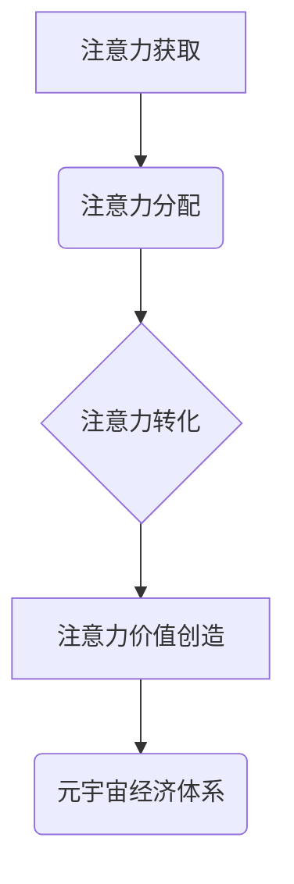

                 

## 注意力产业链:元宇宙经济体系的核心

> 关键词：注意力、元宇宙、经济体系、深度学习、神经网络、注意力机制、数据驱动、商业模式

## 1. 背景介绍

元宇宙概念的兴起，标志着人类进入一个全新的数字世界。这个虚拟世界将融合现实世界的多感官体验，提供沉浸式、互动式的体验，并构建一个全新的经济体系。在这个新兴的经济体系中，**注意力**将成为最宝贵的资源，因为它直接决定着用户在元宇宙中的参与度、消费行为和价值创造。

传统互联网时代，注意力被视为一种稀缺资源，广告商通过各种手段争夺用户的注意力。然而，元宇宙将注意力经济推向一个新的高度。在元宇宙中，用户将沉浸在虚拟世界中，注意力将更加集中和持久。这意味着，元宇宙中的注意力将更加宝贵，也更加难以获取。

## 2. 核心概念与联系

**2.1 注意力机制**

注意力机制是深度学习领域近年来发展起来的一种重要技术，它能够帮助模型更好地理解和处理复杂的信息。注意力机制的核心思想是，在处理信息时，模型应该关注那些与当前任务最相关的部分，而忽略那些无关的部分。

**2.2 元宇宙经济体系**

元宇宙经济体系是指在元宇宙环境中形成的经济活动和交易模式。它将融合虚拟世界和现实世界，构建一个全新的经济生态系统。

**2.3 注意力产业链**

注意力产业链是指围绕元宇宙注意力经济而形成的产业链，它包括注意力获取、注意力分配、注意力转化和注意力价值创造等环节。

**2.4  注意力产业链架构**



## 3. 核心算法原理 & 具体操作步骤

**3.1 算法原理概述**

注意力机制的核心算法原理是通过一个注意力权重来衡量模型对不同输入元素的关注程度。注意力权重可以根据输入元素的特征和任务需求进行计算，从而使模型能够更好地聚焦于与当前任务相关的部分。

**3.2 算法步骤详解**

1. **计算注意力权重:** 

   - 将输入序列中的每个元素与一个查询向量进行比较，计算出每个元素与查询向量的相似度。
   - 将相似度值通过一个softmax函数进行归一化，得到每个元素的注意力权重。

2. **加权求和:**

   - 将每个元素的注意力权重与对应的输入值相乘，然后对所有元素进行加权求和，得到一个新的表示向量。

3. **输出结果:**

   - 将新的表示向量作为模型的输出，用于后续的预测或分类任务。

**3.3 算法优缺点**

**优点:**

- 能够更好地理解和处理复杂的信息。
- 可以提高模型的准确性和效率。
- 可以应用于多种自然语言处理任务，例如机器翻译、文本摘要和问答系统。

**缺点:**

- 计算复杂度较高。
- 需要大量的训练数据。
- 难以解释注意力权重的含义。

**3.4 算法应用领域**

注意力机制在人工智能领域有着广泛的应用，例如：

- 自然语言处理：机器翻译、文本摘要、问答系统、情感分析等。
-计算机视觉：图像识别、目标检测、图像分割等。
-语音识别：语音转文本、语音合成等。
-推荐系统：个性化推荐、内容过滤等。

## 4. 数学模型和公式 & 详细讲解 & 举例说明

**4.1 数学模型构建**

注意力机制的数学模型可以概括为以下公式：

$$
\text{Attention}(Q, K, V) = \text{softmax}\left(\frac{QK^T}{\sqrt{d_k}}\right)V
$$

其中：

- $Q$：查询向量
- $K$：键向量
- $V$：值向量
- $d_k$：键向量的维度
- $\text{softmax}$：softmax函数

**4.2 公式推导过程**

1. **计算相似度:** $QK^T$ 计算查询向量和键向量的点积，表示两者之间的相似度。

2. **归一化:** 将点积值除以 $\sqrt{d_k}$，可以防止梯度爆炸。

3. **softmax函数:** 将归一化后的值通过softmax函数进行归一化，得到每个键向量的注意力权重。

4. **加权求和:** 将每个键向量的注意力权重与对应的值向量相乘，然后对所有值向量进行加权求和，得到最终的注意力输出。

**4.3 案例分析与讲解**

例如，在机器翻译任务中，查询向量可以是目标语言的词向量，键向量和值向量可以是源语言的词向量。注意力机制可以帮助模型更好地理解源语言的语义，并将其翻译成目标语言。

## 5. 项目实践：代码实例和详细解释说明

**5.1 开发环境搭建**

- Python 3.7+
- TensorFlow 2.0+
- PyTorch 1.0+
- Jupyter Notebook

**5.2 源代码详细实现**

```python
import tensorflow as tf

# 定义注意力机制
def attention_mechanism(query, key, value, mask=None):
    # 计算相似度
    scores = tf.matmul(query, key, transpose_b=True) / tf.math.sqrt(tf.cast(key.shape[-1], tf.float32))
    # 归一化
    if mask is not None:
        scores += (1 - mask) * -1e9
    attention_weights = tf.nn.softmax(scores, axis=-1)
    # 加权求和
    context_vector = tf.matmul(attention_weights, value)
    return context_vector, attention_weights

# 示例代码
query = tf.random.normal([1, 5, 128])
key = tf.random.normal([1, 10, 128])
value = tf.random.normal([1, 10, 256])
context_vector, attention_weights = attention_mechanism(query, key, value)
print(context_vector.shape)
print(attention_weights.shape)
```

**5.3 代码解读与分析**

- `attention_mechanism` 函数实现了一个基本的注意力机制。
- `scores` 计算了查询向量和键向量的相似度。
- `attention_weights` 通过 softmax 函数将相似度值归一化，得到每个键向量的注意力权重。
- `context_vector` 通过加权求和得到最终的注意力输出。

**5.4 运行结果展示**

运行代码后，会输出 `context_vector` 和 `attention_weights` 的形状。

## 6. 实际应用场景

**6.1 元宇宙游戏**

在元宇宙游戏中，注意力机制可以用于：

- **NPC对话:** 帮助游戏角色更好地理解玩家的意图，并进行更自然、更人性化的对话。
- **任务分配:** 根据玩家的兴趣和技能，分配更合适的任务，提高玩家的参与度和游戏体验。
- **广告投放:** 更精准地投放广告，提高广告效果。

**6.2 元宇宙社交**

在元宇宙社交平台，注意力机制可以用于：

- **内容推荐:** 根据用户的兴趣和行为，推荐更相关的用户和内容。
- **社交关系分析:** 分析用户的社交关系，识别潜在的兴趣群体和合作机会。
- **虚拟身份构建:** 帮助用户更好地构建虚拟身份，并与其他用户进行更深入的互动。

**6.3 元宇宙教育**

在元宇宙教育平台，注意力机制可以用于：

- **个性化学习:** 根据学生的学习进度和能力，提供个性化的学习内容和教学方式。
- **沉浸式教学:** 通过虚拟现实和增强现实技术，创造更沉浸式的学习体验。
- **互动式评估:** 通过游戏化和互动式的方式，评估学生的学习成果。

**6.4 未来应用展望**

随着元宇宙技术的不断发展，注意力机制将在元宇宙中发挥越来越重要的作用。未来，注意力机制将被应用于更多元宇宙场景，例如元宇宙医疗、元宇宙金融、元宇宙艺术等。

## 7. 工具和资源推荐

**7.1 学习资源推荐**

- **论文:**

    - "Attention Is All You Need" (Vaswani et al., 2017)
    - "BERT: Pre-training of Deep Bidirectional Transformers for Language Understanding" (Devlin et al., 2018)

- **博客:**

    - Jay Alammar's Blog: https://jalammar.github.io/
    - Distill.pub: https://distill.pub/

**7.2 开发工具推荐**

- **TensorFlow:** https://www.tensorflow.org/
- **PyTorch:** https://pytorch.org/
- **Hugging Face Transformers:** https://huggingface.co/transformers/

**7.3 相关论文推荐**

- "Transformer-XL: Attentive Language Models Beyond a Fixed-Length Context" (Dai et al., 2019)
- "Longformer: The Long-Document Transformer" (Beltagy et al., 2020)
- "Reformer: The Efficient Transformer" (Kitaev et al., 2020)

## 8. 总结：未来发展趋势与挑战

**8.1 研究成果总结**

注意力机制在人工智能领域取得了显著的成果，并在自然语言处理、计算机视觉等领域取得了突破性进展。

**8.2 未来发展趋势**

- **更有效的注意力机制:** 研究更有效的注意力机制，提高模型的效率和准确性。
- **跨模态注意力:** 研究跨模态注意力机制，能够处理不同模态的数据，例如文本、图像、音频等。
- **可解释性注意力:** 研究可解释性注意力机制，能够解释注意力权重的含义，提高模型的透明度。

**8.3 面临的挑战**

- **计算复杂度:** 现有的注意力机制计算复杂度较高，难以应用于大规模数据处理。
- **数据依赖性:** 注意力机制依赖于大量的训练数据，缺乏数据时效果会下降。
- **可解释性:** 注意力机制的内部工作机制难以解释，难以理解模型的决策过程。

**8.4 研究展望**

未来，注意力机制将继续是人工智能领域的研究热点，并将在更多领域得到应用。


## 9. 附录：常见问题与解答

**9.1 什么是注意力机制？**

注意力机制是一种机器学习技术，它能够帮助模型更好地理解和处理复杂的信息。注意力机制的核心思想是，模型应该关注那些与当前任务最相关的部分，而忽略那些无关的部分。

**9.2 注意力机制的应用场景有哪些？**

注意力机制在人工智能领域有着广泛的应用，例如：

- 自然语言处理：机器翻译、文本摘要、问答系统、情感分析等。
- 计算机视觉：图像识别、目标检测、图像分割等。
- 语音识别：语音转文本、语音合成等。
- 推荐系统：个性化推荐、内容过滤等。

**9.3 注意力机制的优缺点是什么？**

**优点:**

- 能够更好地理解和处理复杂的信息。
- 可以提高模型的准确性和效率。
- 可以应用于多种自然语言处理任务。

**缺点:**

- 计算复杂度较高。
- 需要大量的训练数据。
- 难以解释注意力权重的含义。


作者：禅与计算机程序设计艺术 / Zen and the Art of Computer Programming 
<end_of_turn>

