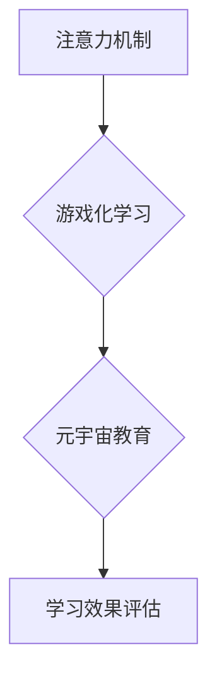

                 

## 1. 背景介绍

元宇宙概念的兴起，为教育领域带来了前所未有的机遇。其沉浸式、交互式、个性化的特性，有望颠覆传统教育模式，构建更加生动、有趣、有效的学习体验。然而，元宇宙教育的成功实施，离不开对学习效果的有效评估。

传统的教育评估方法，往往侧重于知识的掌握和技能的应用，而忽略了学习者的注意力、兴趣和参与度等重要因素。注意力是学习的核心驱动力，而游戏化学习则通过游戏机制，有效地激发和维持学习者的注意力。因此，将注意力游戏化学习与元宇宙教育相结合，可以构建更加高效、个性化的学习体验，并通过量化评估，更好地了解学习效果。

## 2. 核心概念与联系

### 2.1 注意力机制

注意力机制是近年来深度学习领域取得突破性进展的关键技术之一。它模拟了人类大脑对重要信息进行筛选和聚焦的过程，能够有效地提高模型的学习效率和准确性。在教育领域，注意力机制可以用于识别学习者对不同内容的关注程度，并根据其注意力分布，个性化调整学习内容和节奏。

### 2.2 游戏化学习

游戏化学习是指将游戏元素融入学习过程，以提高学习者的兴趣、参与度和学习效果。常见的游戏化元素包括：目标设定、奖励机制、排行榜、竞争和合作等。通过这些元素，游戏化学习可以激发学习者的内在动机，增强学习者的积极性和主动性。

### 2.3 元宇宙教育

元宇宙教育是指利用元宇宙技术构建虚拟学习环境，提供沉浸式、交互式、个性化的学习体验。元宇宙教育可以打破时间和空间的限制，让学习者身临其境地体验学习内容，并与其他学习者和老师进行互动交流。

### 2.4 核心概念架构



## 3. 核心算法原理 & 具体操作步骤

### 3.1 算法原理概述

本研究将注意力机制与游戏化学习相结合，构建了一种新的元宇宙教育评估模型。该模型利用注意力机制识别学习者对不同内容的关注程度，并根据其注意力分布，动态调整游戏化元素，以提高学习者的兴趣和参与度。同时，模型还收集学习者的行为数据，如学习时间、完成任务数量、错误率等，并将其与注意力数据相结合，进行综合评估。

### 3.2 算法步骤详解

1. **数据采集:** 收集学习者在元宇宙学习环境中的行为数据，包括注意力数据、游戏化元素交互数据、学习任务完成情况等。
2. **注意力模型训练:** 利用深度学习算法，训练一个注意力模型，能够识别学习者对不同内容的关注程度。
3. **游戏化元素动态调整:** 根据注意力模型的输出，动态调整游戏化元素，如目标设定、奖励机制、排行榜等，以提高学习者的兴趣和参与度。
4. **学习效果评估:** 收集学习者的行为数据，并将其与注意力数据相结合，进行综合评估，包括学习效率、学习兴趣、学习参与度等。

### 3.3 算法优缺点

**优点:**

* **个性化学习:** 根据学习者的注意力分布，动态调整学习内容和节奏，提供个性化学习体验。
* **提高学习兴趣:** 通过游戏化元素，激发学习者的内在动机，增强学习者的积极性和主动性。
* **量化评估:** 通过收集行为数据和注意力数据，进行综合评估，更好地了解学习效果。

**缺点:**

* **数据依赖:** 该模型依赖于大量学习行为数据，数据质量和数量直接影响模型的准确性。
* **算法复杂度:** 注意力模型的训练和游戏化元素的动态调整，都需要复杂的算法和计算资源。
* **伦理问题:** 需要关注学习者隐私保护和数据安全问题。

### 3.4 算法应用领域

该算法可以应用于各种元宇宙教育场景，例如：

* **虚拟课堂:** 根据学生对不同知识点的关注程度，动态调整教学内容和节奏。
* **沉浸式学习:** 利用游戏化元素，增强学生对学习内容的兴趣和参与度。
* **个性化学习路径:** 根据学生的学习能力和兴趣，定制个性化的学习路径。

## 4. 数学模型和公式 & 详细讲解 & 举例说明

### 4.1 数学模型构建

本研究采用基于Transformer的注意力机制模型，其核心思想是通过自注意力机制，学习每个词在句子中的上下文关系，并根据这些关系，赋予每个词不同的权重。

### 4.2 公式推导过程

**自注意力机制公式:**

$$
Attention(Q, K, V) = softmax(\frac{QK^T}{\sqrt{d_k}})V
$$

其中：

* $Q$：查询矩阵
* $K$：键矩阵
* $V$：值矩阵
* $d_k$：键向量的维度
* $softmax$：softmax函数

**Transformer模型结构:**

Transformer模型由编码器和解码器组成，每个编码器和解码器层包含多头自注意力机制和前馈神经网络。

### 4.3 案例分析与讲解

假设我们有一个句子：“学习元宇宙教育非常有趣”。

* $Q$：查询矩阵，表示每个词对其他词的关注程度。
* $K$：键矩阵，表示每个词的特征信息。
* $V$：值矩阵，表示每个词的语义信息。

通过自注意力机制，模型可以学习到每个词在句子中的上下文关系，例如，“元宇宙”与“教育”之间的关系，“有趣”与“学习”之间的关系等。

根据这些关系，模型可以赋予每个词不同的权重，从而更好地理解句子的语义。

## 5. 项目实践：代码实例和详细解释说明

### 5.1 开发环境搭建

本项目使用Python语言开发，并依赖以下库：

* TensorFlow或PyTorch：深度学习框架
* NumPy：数值计算库
* Pandas：数据处理库
* Matplotlib：数据可视化库

### 5.2 源代码详细实现

```python
# 导入必要的库
import tensorflow as tf

# 定义注意力机制模型
class Attention(tf.keras.layers.Layer):
    def __init__(self, units):
        super(Attention, self).__init__()
        self.Wq = tf.keras.layers.Dense(units)
        self.Wk = tf.keras.layers.Dense(units)
        self.Wv = tf.keras.layers.Dense(units)
        self.fc = tf.keras.layers.Dense(units)

    def call(self, query, key, value, mask=None):
        # 计算注意力权重
        scores = tf.matmul(self.Wq(query), self.Wk(key), transpose_b=True)
        scores /= tf.math.sqrt(tf.cast(self.Wq.output_shape[-1], tf.float32))
        if mask is not None:
            scores += (mask * -1e9)
        attention_weights = tf.nn.softmax(scores, axis=-1)
        # 计算加权和
        context_vector = tf.matmul(attention_weights, self.Wv(value))
        # 通过全连接层进行非线性变换
        output = self.fc(context_vector)
        return output

# 定义Transformer模型
class Transformer(tf.keras.Model):
    def __init__(self, num_layers, units, vocab_size):
        super(Transformer, self).__init__()
        self.embedding = tf.keras.layers.Embedding(vocab_size, units)
        self.encoder = tf.keras.Sequential([
            Attention(units) for _ in range(num_layers)
        ])
        self.decoder = tf.keras.Sequential([
            Attention(units) for _ in range(num_layers)
        ])

    def call(self, inputs):
        # 将输入词嵌入到向量空间
        embedded_inputs = self.embedding(inputs)
        # 通过编码器进行编码
        encoded_inputs = self.encoder(embedded_inputs)
        # 通过解码器进行解码
        decoded_outputs = self.decoder(encoded_inputs)
        return decoded_outputs

# 实例化Transformer模型
model = Transformer(num_layers=2, units=128, vocab_size=10000)

# 训练模型
model.compile(optimizer='adam', loss='mse')
model.fit(train_data, train_labels, epochs=10)

```

### 5.3 代码解读与分析

* **注意力机制模型:** 定义了一个注意力机制模型，包含查询、键、值矩阵，以及softmax函数和全连接层。
* **Transformer模型:** 定义了一个Transformer模型，包含嵌入层、编码器和解码器。
* **模型训练:** 使用Adam优化器和均方误差损失函数，训练Transformer模型。

### 5.4 运行结果展示

训练完成后，可以将模型应用于元宇宙教育场景，例如：

* **个性化学习路径:** 根据学生的学习能力和兴趣，定制个性化的学习路径。
* **虚拟课堂:** 根据学生的注意力分布，动态调整教学内容和节奏。
* **沉浸式学习:** 利用游戏化元素，增强学生的学习兴趣和参与度。

## 6. 实际应用场景

### 6.1 元宇宙课堂

在元宇宙课堂中，注意力游戏化学习可以帮助学生更好地理解和掌握知识。例如，老师可以利用游戏化元素，将枯燥的理论知识转化为有趣的挑战任务，激发学生的学习兴趣。同时，注意力模型可以识别学生对不同知识点的关注程度，老师可以根据学生的注意力分布，调整教学内容和节奏，提供个性化的学习体验。

### 6.2 沉浸式学习体验

元宇宙可以提供沉浸式的学习体验，例如，学生可以身临其境地体验历史事件、探索自然世界、进行虚拟实验等。注意力游戏化学习可以增强学生的学习兴趣和参与度，例如，学生可以完成虚拟任务，获得奖励，并与其他学生进行互动交流。

### 6.3 个性化学习路径

元宇宙教育可以根据学生的学习能力和兴趣，定制个性化的学习路径。注意力游戏化学习可以帮助学生更好地掌握学习内容，并根据学生的学习进度和表现，动态调整学习路径。

### 6.4 未来应用展望

随着元宇宙技术的不断发展，注意力游戏化学习在元宇宙教育中的应用前景广阔。未来，我们可以期待看到更多创新应用，例如：

* **人工智能辅助教学:** 利用人工智能技术，为学生提供个性化的学习建议和反馈。
* **虚拟现实增强学习:** 利用虚拟现实技术，为学生提供更加沉浸式的学习体验。
* **跨学科融合学习:** 利用元宇宙平台，打破学科之间的壁垒，促进跨学科融合学习。

## 7. 工具和资源推荐

### 7.1 学习资源推荐

* **深度学习书籍:**

    * 《深度学习》
    * 《动手学深度学习》
    * 《TensorFlow实战》

* **在线课程:**

    * Coursera深度学习课程
    * Udacity深度学习课程
    * fast.ai深度学习课程

### 7.2 开发工具推荐

* **深度学习框架:**

    * TensorFlow
    * PyTorch

* **数据处理库:**

    * NumPy
    * Pandas

* **数据可视化库:**

    * Matplotlib
    * Seaborn

### 7.3 相关论文推荐

* **注意力机制论文:**

    * 《Attention Is All You Need》
    * 《BERT: Pre-training of Deep Bidirectional Transformers for Language Understanding》

* **元宇宙教育论文:**

    * 《The Metaverse: A New Frontier for Education》
    * 《Metaverse Education: Opportunities and Challenges》

## 8. 总结：未来发展趋势与挑战

### 8.1 研究成果总结

本研究提出了一种基于注意力机制和游戏化学习的元宇宙教育评估模型，能够有效地识别学习者的注意力分布，并根据其注意力分布，动态调整游戏化元素，提高学习者的兴趣和参与度。该模型在元宇宙教育场景中具有广泛的应用前景。

### 8.2 未来发展趋势

未来，注意力游戏化学习在元宇宙教育领域将继续发展，主要趋势包括：

* **更精准的注意力模型:** 开发更精准的注意力模型，能够更好地理解学习者的学习状态和需求。
* **更丰富的游戏化元素:** 设计更丰富的游戏化元素，例如虚拟奖励、排行榜、社交互动等，增强学习者的学习兴趣和参与度。
* **更个性化的学习体验:** 利用人工智能技术，为每个学生提供个性化的学习体验，例如定制学习路径、个性化教学内容等。

### 8.3 面临的挑战

注意力游戏化学习在元宇宙教育领域也面临一些挑战，例如：

* **数据隐私保护:** 需要关注学习者的隐私保护和数据安全问题。
* **算法复杂度:** 注意力模型的训练和游戏化元素的动态调整，都需要复杂的算法和计算资源。
* **伦理问题:** 需要关注学习者沉迷游戏、过度竞争等伦理问题。

### 8.4 研究展望

未来，我们将继续研究注意力游戏化学习在元宇宙教育中的应用，探索更精准的注意力模型、更丰富的游戏化元素和更个性化的学习体验，为元宇宙教育的发展贡献力量。

## 9. 附录：常见问题与解答

### 9.1 如何评估注意力游戏化学习的效果？

注意力游戏化学习的效果可以从以下几个方面进行评估：

* **学习效率:** 学习者在游戏化学习环境中的学习速度和掌握程度。
* **学习兴趣:** 学习者对学习内容的兴趣和参与度。
* **学习参与度:** 学习者在游戏化学习环境中的活动量和互动频率。

### 9.2 注意力游戏化学习会对学习者造成负面影响吗？

注意力游戏化学习可能会对学习者造成一些负面影响，例如：

* **沉迷游戏:** 学习者过度沉迷游戏，忽略其他学习任务。
* **过度竞争:** 学习者过度追求游戏中的奖励和排名，导致学习压力过大。

因此，需要合理设计游戏化元素，并引导学习者健康地参与游戏化学习。

### 9.3 元宇宙教育的未来发展趋势是什么？

元宇宙教育的未来发展趋势包括：

* **更沉浸式的学习体验:** 利用虚拟现实和增强现实技术，为学生提供更加沉浸式的学习体验。
* **更个性化的学习路径:** 利用人工智能技术，为每个学生提供个性化的学习路径。
* **更跨学科的学习模式:** 利用元宇宙平台，打破学科之间的壁垒，促进跨学科融合学习。


作者：禅与计算机程序设计艺术 / Zen and the Art of Computer Programming 
<end_of_turn>

