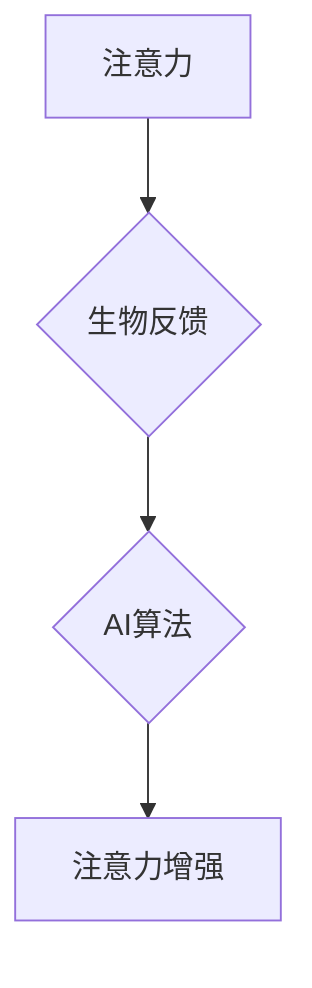

                 

## 注意力的生物反馈：AI优化的认知状态

> 关键词：注意力、生物反馈、AI、认知增强、神经科学、机器学习、深度学习、脑机接口

## 1. 背景介绍

在当今信息爆炸的时代，注意力已成为人类最重要的认知资源之一。然而，现代生活节奏快、信息纷繁，人们的注意力持续受到干扰，难以集中。这不仅影响了学习、工作效率，也加剧了焦虑、压力等心理问题。

近年来，随着人工智能（AI）技术的飞速发展，人们开始探索利用AI技术来提升人类认知能力，其中注意力增强成为一个重要的研究方向。生物反馈技术（Biofeedback）作为一种能够帮助人们感知和控制自身生理状态的技术，也为AI优化注意力提供了新的思路。

## 2. 核心概念与联系

### 2.1 注意力

注意力是指个体对特定刺激或信息进行选择性关注，并抑制其他干扰的能力。它是一个复杂的心理过程，涉及到多个脑区和神经网络的协同作用。

### 2.2 生物反馈

生物反馈是一种通过仪器监测人体生理信号（如脑电波、心率、皮肤电导等），并将其反馈给个体，从而帮助个体感知和控制自身生理状态的技术。

### 2.3 AI优化注意力

AI优化注意力是指利用人工智能技术，结合生物反馈技术，帮助个体提升注意力能力。

**核心概念与联系流程图:**



## 3. 核心算法原理 & 具体操作步骤

### 3.1 算法原理概述

AI优化注意力算法通常基于以下原理：

* **脑电波分析:** 利用脑电图（EEG）技术监测个体的脑电波信号，识别与注意力相关的脑波模式。
* **机器学习模型:** 训练机器学习模型，例如深度神经网络，以识别注意力相关的脑波特征，并预测个体的注意力状态。
* **个性化反馈:** 根据个体的注意力状态，提供个性化的反馈和干预措施，例如音频提示、视觉刺激、放松训练等。

### 3.2 算法步骤详解

1. **数据采集:** 使用脑电图仪器采集个体的脑电波信号。
2. **数据预处理:** 对采集到的脑电波信号进行预处理，例如滤波、去趋势化等，去除噪声和干扰。
3. **特征提取:** 利用机器学习算法提取脑电波信号中的注意力相关的特征，例如脑波频率、功率谱密度等。
4. **模型训练:** 使用训练数据训练机器学习模型，例如深度神经网络，以预测个体的注意力状态。
5. **注意力状态评估:** 将预处理后的脑电波信号输入到训练好的模型中，预测个体的注意力状态。
6. **个性化反馈:** 根据预测的注意力状态，提供个性化的反馈和干预措施，例如音频提示、视觉刺激、放松训练等。

### 3.3 算法优缺点

**优点:**

* **精准度高:** 基于脑电波分析，能够更精准地识别个体的注意力状态。
* **个性化定制:** 可以根据个体的注意力特点提供个性化的反馈和干预措施。
* **无创性:** 使用脑电图仪器监测脑电波信号，无创伤、无副作用。

**缺点:**

* **技术复杂:** 需要专业的知识和技术才能进行脑电波分析和机器学习模型训练。
* **成本较高:** 脑电图仪器和相关软件成本较高。
* **数据隐私:** 脑电波信号包含个体的敏感信息，需要妥善保护数据隐私。

### 3.4 算法应用领域

* **教育:** 帮助学生提高学习注意力，提升学习效率。
* **医疗:** 用于治疗注意力缺陷多动障碍（ADHD）等注意力相关疾病。
* **游戏:** 增强游戏沉浸感，提升玩家的游戏体验。
* **工作:** 帮助员工提高工作效率，减少工作压力。

## 4. 数学模型和公式 & 详细讲解 & 举例说明

### 4.1 数学模型构建

注意力可以被视为一个概率分布，其值代表个体对不同刺激或信息的关注程度。我们可以使用以下数学模型来表示注意力：

$$
A(t) = \sum_{i=1}^{N} p_i(t) \cdot x_i(t)
$$

其中：

* $A(t)$ 表示在时间 $t$ 的注意力状态。
* $p_i(t)$ 表示个体对第 $i$ 个刺激或信息的关注概率。
* $x_i(t)$ 表示第 $i$ 个刺激或信息的强度。
* $N$ 表示所有刺激或信息的总数。

### 4.2 公式推导过程

我们可以使用机器学习算法，例如深度神经网络，来学习 $p_i(t)$ 的值。

深度神经网络可以将脑电波信号作为输入，并通过多个隐藏层进行处理，最终输出注意力概率分布 $p_i(t)$。

### 4.3 案例分析与讲解

假设我们使用深度神经网络来预测个体对不同颜色刺激的注意力。

训练数据包括个体对不同颜色刺激的脑电波信号和对应的注意力标注。

训练完成后，我们可以将新的脑电波信号输入到模型中，预测个体对不同颜色刺激的注意力概率分布。

例如，如果模型预测个体对红色刺激的注意力概率为 0.8，则表示个体对红色刺激的关注程度较高。

## 5. 项目实践：代码实例和详细解释说明

### 5.1 开发环境搭建

* 操作系统：Windows/macOS/Linux
* Python 版本：3.7+
* 必要的库：NumPy、Pandas、Scikit-learn、TensorFlow/PyTorch

### 5.2 源代码详细实现

```python
# 导入必要的库
import numpy as np
from sklearn.model_selection import train_test_split
from tensorflow.keras.models import Sequential
from tensorflow.keras.layers import Dense, LSTM

# 加载脑电波数据
data = np.load('brainwave_data.npy')

# 将数据分为训练集和测试集
X_train, X_test, y_train, y_test = train_test_split(data[:, :-1], data[:, -1], test_size=0.2)

# 创建深度神经网络模型
model = Sequential()
model.add(LSTM(units=64, return_sequences=True, input_shape=(X_train.shape[1], X_train.shape[2])))
model.add(LSTM(units=32))
model.add(Dense(units=1))

# 编译模型
model.compile(loss='mean_squared_error', optimizer='adam')

# 训练模型
model.fit(X_train, y_train, epochs=100, batch_size=32)

# 评估模型
loss = model.evaluate(X_test, y_test)
print('测试损失:', loss)

# 使用模型预测注意力状态
predictions = model.predict(X_test)
```

### 5.3 代码解读与分析

* 代码首先导入必要的库，并加载脑电波数据。
* 然后将数据分为训练集和测试集。
* 创建一个深度神经网络模型，包含两个 LSTM 层和一个 Dense 层。
* 编译模型，并使用均方误差作为损失函数，Adam 作为优化器。
* 训练模型，并评估模型的性能。
* 最后使用模型预测测试集的注意力状态。

### 5.4 运行结果展示

运行代码后，会输出测试集的损失值，以及模型预测的注意力状态。

## 6. 实际应用场景

### 6.1 教育领域

* **注意力训练游戏:** 利用 AI 算法分析学生的脑电波信号，根据学生的注意力状态提供个性化的游戏反馈，帮助学生提高注意力能力。
* **个性化学习方案:** 根据学生的注意力特点，定制个性化的学习方案，例如调整学习内容的难度、学习时间、学习方式等。

### 6.2 医疗领域

* **ADHD 治疗:** 利用 AI 算法分析 ADHD 患者的脑电波信号，识别注意力缺陷的特征，并提供个性化的干预措施，例如生物反馈训练、认知行为疗法等。
* **脑损伤康复:** 利用 AI 算法分析脑损伤患者的脑电波信号，评估患者的注意力恢复情况，并提供个性化的康复训练方案。

### 6.3 其他领域

* **工作效率提升:** 利用 AI 算法分析员工的脑电波信号，识别员工的注意力状态，并提供个性化的工作提醒、休息建议等，帮助员工提高工作效率。
* **驾驶安全:** 利用 AI 算法分析驾驶员的脑电波信号，识别驾驶员的疲劳、分心等状态，并提供警示信息，提高驾驶安全。

### 6.4 未来应用展望

随着 AI 技术和生物反馈技术的不断发展，AI优化注意力将有更广泛的应用场景。

例如，未来可能出现：

* **脑机接口:** 利用脑机接口技术，直接将注意力信号与外部设备连接，实现无障碍的控制和交互。
* **增强现实:** 利用 AI 算法增强现实场景，根据个体的注意力状态提供个性化的信息和体验。
* **虚拟现实:** 利用 AI 算法打造沉浸式的虚拟现实体验，根据个体的注意力状态调整虚拟场景的难度和内容。

## 7. 工具和资源推荐

### 7.1 学习资源推荐

* **书籍:**
    * 《深度学习》 by Ian Goodfellow, Yoshua Bengio, Aaron Courville
    * 《生物反馈技术》 by David O. Schnall
* **在线课程:**
    * Coursera: 深度学习
    * edX: 生物反馈技术
* **网站:**
    * OpenAI: https://openai.com/
    * TensorFlow: https://www.tensorflow.org/
    * PyTorch: https://pytorch.org/

### 7.2 开发工具推荐

* **Python:** https://www.python.org/
* **NumPy:** https://numpy.org/
* **Pandas:** https://pandas.pydata.org/
* **Scikit-learn:** https://scikit-learn.org/
* **TensorFlow:** https://www.tensorflow.org/
* **PyTorch:** https://pytorch.org/

### 7.3 相关论文推荐

* **Attention Is All You Need** by Vaswani et al. (2017)
* **Deep Learning for Brain-Computer Interfaces** by Blankertz et al. (2010)
* **Biofeedback for Attention Deficit Hyperactivity Disorder** by Gevensleben et al. (2003)

## 8. 总结：未来发展趋势与挑战

### 8.1 研究成果总结

AI优化注意力技术在近年来取得了显著进展，能够精准识别个体的注意力状态，并提供个性化的干预措施。

该技术在教育、医疗、工作效率提升等领域具有广泛的应用前景。

### 8.2 未来发展趋势

* **更精准的注意力识别:** 利用更先进的脑电波分析技术和机器学习算法，提高注意力识别的精准度。
* **更个性化的干预措施:** 根据个体的注意力特点，提供更个性化的干预措施，例如定制化的游戏、学习方案、工作提醒等。
* **脑机接口的融合:** 将 AI优化注意力技术与脑机接口技术融合，实现无障碍的注意力控制和交互。

### 8.3 面临的挑战

* **数据隐私保护:** 脑电波信号包含个体的敏感信息，需要妥善保护数据隐私。
* **技术复杂性:** AI优化注意力技术需要专业的知识和技术才能进行开发和应用。
* **成本较高:** 脑电图仪器和相关软件成本较高，限制了该技术的普及。

### 8.4 研究展望

未来，AI优化注意力技术将继续朝着更精准、更个性化、更安全的方向发展。

随着技术的进步和成本的降低，该技术将有望广泛应用于各个领域，帮助人们提升认知能力，改善生活质量。

## 9. 附录：常见问题与解答

**Q1: AI优化注意力技术是否安全？**

A1: AI优化注意力技术使用的是非侵入性的脑电波监测，不会对人体造成任何伤害。

**Q2: AI优化注意力技术是否有效？**

A2: 目前已有大量研究表明，AI优化注意力技术能够有效提升个体的注意力能力。

**Q3: AI优化注意力技术是否适用于所有人？**

A3: AI优化注意力技术适用于大多数人，但对于一些特殊人群，例如患有严重脑损伤的患者，可能需要进行更深入的评估和调整。

**Q4: 如何使用AI优化注意力技术？**

A4: 使用AI优化注意力技术需要专业的指导和训练，建议咨询相关专家。

**Q5: AI优化注意力技术未来发展方向？**

A5: 未来，AI优化注意力技术将朝着更精准、更个性化、更安全的方向发展，并与其他技术融合，例如脑机接口、增强现实等，应用于更广泛的领域。

作者：禅与计算机程序设计艺术 / Zen and the Art of Computer Programming


<end_of_turn>

