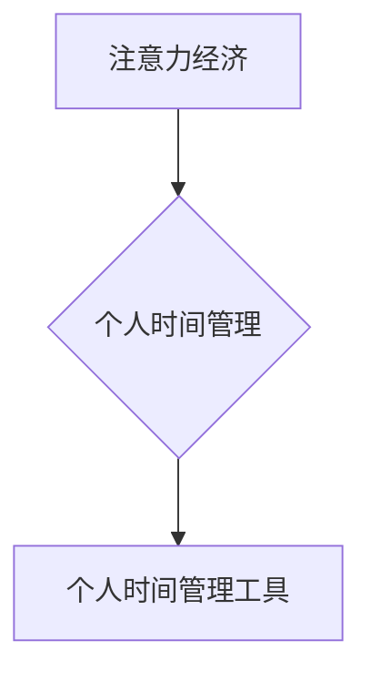

                 

##  注意力经济与个人时间管理工具的发展

> 关键词：注意力经济、时间管理、个人效率、深度学习、自然语言处理、用户行为分析、算法推荐、番茄工作法、时间阻塞

## 1. 背景介绍

在当今信息爆炸的时代，我们每天都被来自各个方向的海量信息所包围。从社交媒体的推送通知到电子邮件的提醒，从新闻网站的滚动条到同事的即时消息，无处不在的干扰不断地抢夺着我们的注意力。这种“注意力经济”的竞争日益激烈，个人如何有效地管理时间，集中精力完成重要任务，成为了摆在每个人面前的重大挑战。

个人时间管理工具应运而生，旨在帮助人们更好地规划、安排和执行时间，提高工作效率和生活质量。从传统的日历和待办事项清单到如今的智能时间管理应用程序，这些工具不断演进，并逐渐融入到人们的生活中。

## 2. 核心概念与联系

### 2.1 注意力经济

注意力经济是指在信息过载的时代，人们的注意力成为一种稀缺资源，而能够有效获取和利用注意力的人或组织将拥有巨大的竞争优势。

### 2.2 个人时间管理

个人时间管理是指个人通过规划、安排、执行和评估时间，以达到既定的目标和提升生活质量。

### 2.3 个人时间管理工具

个人时间管理工具是指帮助个人规划、安排、执行和评估时间，提高工作效率和生活质量的软件应用程序。

**核心概念与联系流程图**



## 3. 核心算法原理 & 具体操作步骤

### 3.1 算法原理概述

个人时间管理工具的核心算法通常涉及以下几个方面：

* **用户行为分析:** 通过分析用户的活动记录、时间分配、任务完成情况等数据，了解用户的行为模式和时间使用习惯。
* **时间规划和安排:** 根据用户的目标、任务和时间限制，智能地规划和安排用户的日程安排，并提供提醒和通知功能。
* **任务管理和优先级排序:**  帮助用户管理待办事项，根据任务的重要性、紧急程度和截止日期进行优先级排序，并提供任务分解和进度跟踪功能。
* **专注力提升和干扰过滤:** 通过番茄工作法、专注模式等功能，帮助用户集中注意力，减少干扰，提高工作效率。
* **个性化推荐和定制化:**  根据用户的行为数据和偏好，提供个性化的时间管理建议和定制化的工具设置。

### 3.2 算法步骤详解

1. **数据收集:** 收集用户的活动数据，包括时间使用记录、任务清单、日程安排、邮件、社交媒体互动等。
2. **数据预处理:** 对收集到的数据进行清洗、转换和格式化，以便于后续算法的处理。
3. **用户行为分析:** 使用机器学习算法，例如聚类分析、关联规则挖掘等，分析用户的行为模式和时间使用习惯。
4. **时间规划和安排:** 根据用户的目标、任务和时间限制，使用算法进行时间规划和安排，生成个性化的日程安排。
5. **任务管理和优先级排序:** 使用算法对用户的待办事项进行优先级排序，并提供任务分解和进度跟踪功能。
6. **专注力提升和干扰过滤:** 提供番茄工作法、专注模式等功能，帮助用户集中注意力，减少干扰。
7. **个性化推荐和定制化:** 根据用户的行为数据和偏好，提供个性化的时间管理建议和定制化的工具设置。

### 3.3 算法优缺点

**优点:**

* **提高效率:** 通过智能规划和安排时间，帮助用户提高工作效率和生活质量。
* **个性化定制:** 根据用户的行为数据和偏好，提供个性化的建议和设置。
* **减少干扰:** 通过专注模式和干扰过滤功能，帮助用户集中注意力，提高工作效率。

**缺点:**

* **数据隐私:** 个人时间管理工具需要收集大量的用户数据，可能会引发数据隐私方面的担忧。
* **算法偏差:** 算法的训练数据可能会存在偏差，导致算法推荐不准确或不公平。
* **过度依赖:** 过度依赖时间管理工具可能会导致用户失去自主决策能力和时间管理技能。

### 3.4 算法应用领域

* **个人时间管理:** 帮助个人规划、安排和执行时间，提高工作效率和生活质量。
* **企业项目管理:** 帮助团队协作，管理项目进度和任务分配。
* **教育教学:** 帮助学生管理学习时间，提高学习效率。
* **健康管理:** 帮助用户记录运动时间、睡眠时间等，养成健康的生活习惯。

## 4. 数学模型和公式 & 详细讲解 & 举例说明

### 4.1 数学模型构建

个人时间管理工具的算法模型通常基于以下几个数学模型：

* **时间分配模型:**  描述用户在不同时间段内进行不同活动的时间分配比例。
* **任务优先级模型:**  根据任务的重要性、紧急程度和截止日期等因素，对任务进行优先级排序。
* **专注力模型:**  描述用户在不同时间段内保持专注力的程度。

### 4.2 公式推导过程

**时间分配模型:**

假设用户每天有 24 小时，将其分为 8 个时间段，每个时间段为 3 小时。用户在每个时间段内进行不同活动的时间分配比例分别为 $p_1, p_2, ..., p_8$。则有以下公式：

$$p_1 + p_2 + ... + p_8 = 1$$

其中，$p_i$ 表示用户在第 $i$ 个时间段内进行不同活动的时间比例。

**任务优先级模型:**

可以使用加权平均法对任务进行优先级排序。假设任务 $j$ 的重要性为 $w_j$，紧急程度为 $e_j$，截止日期为 $d_j$。则任务 $j$ 的优先级 $P_j$ 可以计算如下：

$$P_j = \alpha w_j + \beta e_j + \gamma d_j$$

其中，$\alpha$, $\beta$, $\gamma$ 为权重系数，分别代表重要性、紧急程度和截止日期的相对重要性。

### 4.3 案例分析与讲解

假设用户每天有 8 小时需要用于工作，2 小时用于学习，2 小时用于娱乐，2 小时用于睡眠。

根据时间分配模型，我们可以计算出每个时间段内进行不同活动的时间比例。例如，如果用户在工作时间段内集中精力工作，则 $p_1$ 可能为 0.5，其他时间段的 $p_i$ 可能为 0。

假设用户需要完成 3 个任务，任务 1 的重要性为 3，紧急程度为 2，截止日期为明天；任务 2 的重要性为 2，紧急程度为 1，截止日期为后天；任务 3 的重要性为 1，紧急程度为 0，截止日期为下周。

根据任务优先级模型，我们可以计算出每个任务的优先级。假设 $\alpha = 0.5$, $\beta = 0.3$, $\gamma = 0.2$。则任务 1 的优先级为 $P_1 = 0.5 * 3 + 0.3 * 2 + 0.2 * 1 = 2.1$，任务 2 的优先级为 $P_2 = 0.5 * 2 + 0.3 * 1 + 0.2 * 1 = 1.3$，任务 3 的优先级为 $P_3 = 0.5 * 1 + 0.3 * 0 + 0.2 * 1 = 0.7$。

因此，用户应该优先完成任务 1，然后是任务 2，最后是任务 3。

## 5. 项目实践：代码实例和详细解释说明

### 5.1 开发环境搭建

* **操作系统:** Windows, macOS, Linux
* **编程语言:** Python
* **框架:** Flask, Django
* **数据库:** MySQL, PostgreSQL
* **工具:** Git, Docker

### 5.2 源代码详细实现

```python
# 使用 Flask 框架构建一个简单的个人时间管理工具

from flask import Flask, render_template, request

app = Flask(__name__)

# 模拟用户数据
users = {
    "user1": {
        "tasks": [
            {"id": 1, "title": "写报告", "priority": 3},
            {"id": 2, "title": "学习Python", "priority": 2},
            {"id": 3, "title": "看电影", "priority": 1}
        ]
    }
}

@app.route("/")
def index():
    return render_template("index.html")

@app.route("/tasks", methods=["GET", "POST"])
def tasks():
    if request.method == "POST":
        # 处理添加任务的请求
        task_title = request.form["title"]
        task_priority = int(request.form["priority"])
        users["user1"]["tasks"].append({"id": len(users["user1"]["tasks"]) + 1, "title": task_title, "priority": task_priority})
        return redirect(url_for("tasks"))
    else:
        # 获取用户任务列表
        return render_template("tasks.html", tasks=users["user1"]["tasks"])

if __name__ == "__main__":
    app.run(debug=True)
```

### 5.3 代码解读与分析

* **Flask 框架:** 使用 Flask 框架构建了一个简单的 Web 应用。
* **用户数据模拟:** 使用字典模拟用户数据，包括用户 ID 和任务列表。
* **路由:** 定义了两个路由：
    * `/`: 首页路由，渲染 `index.html` 模板。
    * `/tasks`: 任务列表路由，处理添加任务和获取任务列表的请求。
* **模板:** 使用 Jinja2 模板引擎渲染 HTML 页面。

### 5.4 运行结果展示

运行代码后，访问 `http://127.0.0.1:5000/`，即可看到个人时间管理工具的首页。点击 `/tasks` 路由，可以查看和添加任务。

## 6. 实际应用场景

### 6.1 个人时间管理

* **番茄工作法:**  利用番茄工作法，将工作时间划分为 25 分钟的专注时间段和 5 分钟的休息时间段，帮助用户集中注意力，提高工作效率。
* **待办事项清单:**  记录待办事项，并根据优先级进行排序，帮助用户清晰地了解需要完成的任务，并按计划执行。
* **日程安排:**  规划每天的日程安排，包括工作、学习、娱乐、休息等活动，帮助用户合理安排时间，避免时间冲突。

### 6.2 企业项目管理

* **任务分配:**  将项目分解成多个子任务，并分配给不同的团队成员，帮助项目经理更好地管理项目进度。
* **进度跟踪:**  实时跟踪任务的完成进度，并及时发现潜在的风险和问题，帮助项目经理及时调整计划。
* **协作沟通:**  提供协作沟通平台，方便团队成员之间进行信息交流和协作，提高项目效率。

### 6.3 教育教学

* **学习计划:**  帮助学生制定学习计划，并根据学习进度进行调整，提高学习效率。
* **知识管理:**  提供知识管理工具，帮助学生整理和归档学习笔记，方便复习和查阅。
* **在线学习:**  提供在线学习平台，方便学生进行远程学习和知识获取。

### 6.4 未来应用展望

* **人工智能驱动的个性化推荐:**  利用人工智能算法，根据用户的行为数据和偏好，提供更个性化的时间管理建议和工具设置。
* **虚拟现实和增强现实的沉浸式体验:**  利用虚拟现实和增强现实技术，打造更沉浸式的个人时间管理体验，帮助用户更好地规划和执行时间。
* **跨平台和跨设备的协同工作:**  实现个人时间管理工具的跨平台和跨设备协同工作，方便用户随时随地管理时间。

## 7. 工具和资源推荐

### 7.1 学习资源推荐

* **书籍:**
    * 《Getting Things Done: The Art of Stress-Free Productivity》 by David Allen
    * 《Deep Work: Rules for Focused Success in a Distracted World》 by Cal Newport
* **在线课程:**
    * Coursera: Time Management
    * Udemy: Productivity Masterclass

### 7.2 开发工具推荐

* **编程语言:** Python, JavaScript
* **框架:** Flask, Django, React
* **数据库:** MySQL, PostgreSQL
* **工具:** Git, Docker

### 7.3 相关论文推荐

* **The Impact of Attention Economy on User Behavior**
* **A Survey of Time Management Techniques and Tools**
* **Personalized Time Management Systems: A Review**

## 8. 总结：未来发展趋势与挑战

### 8.1 研究成果总结

个人时间管理工具的发展已经取得了显著的成果，帮助人们更好地规划、安排和执行时间，提高工作效率和生活质量。

### 8.2 未来发展趋势

* **人工智能驱动的个性化推荐:**  利用人工智能算法，提供更精准、更个性化的时间管理建议和工具设置。
* **沉浸式体验:**  利用虚拟现实和增强现实技术，打造更沉浸式的个人时间管理体验。
* **跨平台和跨设备协同工作:**  实现个人时间管理工具的跨平台和跨设备协同工作，方便用户随时随地管理时间。

### 8.3 面临的挑战

* **数据隐私:**  个人时间管理工具需要收集大量的用户数据，如何保护用户数据隐私是一个重要的挑战。
* **算法偏差:**  算法的训练数据可能会存在偏差，导致算法推荐不准确或不公平。
* **过度依赖:**  过度依赖时间管理工具可能会导致用户失去自主决策能力和时间管理技能。

### 8.4 研究展望

未来，个人时间管理工具的研究将更加注重以下几个方面:

* **开发更安全、更可靠的数据隐私保护机制。**
* **研究更公平、更准确的算法模型，减少算法偏差。**
* **探索如何帮助用户更好地理解和掌握时间管理技能，避免过度依赖工具。**

## 9. 附录：常见问题与解答

**Q1: 如何选择合适的个人时间管理工具？**

**A1:** 选择合适的个人时间管理工具需要根据自己的需求和习惯进行选择。可以考虑以下因素:

* **功能:**  工具是否提供所需的全部功能，例如任务管理、日程安排、番茄工作法等。
* **易用性:**  工具是否易于上手和使用，是否符合自己的操作习惯。
* **平台支持:**  工具是否支持自己常用的平台，例如 Windows, macOS, iOS, Android 等。
* **价格:**  工具的价格是否合理，是否符合自己的预算。

**Q2: 如何有效地使用个人时间管理工具？**

**A2:**  

* **设定明确的目标:**  明确自己想要通过使用工具实现的目标，例如提高工作效率、更好地管理时间等。
* **合理规划时间:**  根据自己的目标和时间限制，合理规划每天的时间安排。
* **坚持使用:**  养成使用工具的习惯，并坚持使用一段时间，才能看到效果。
* **定期评估和调整:**  定期评估工具的使用效果，并根据需要进行调整。

**Q3: 个人时间管理工具会取代人类的时间管理能力吗？**

**A3:**  个人时间管理工具可以帮助人们更好地管理时间，但不会取代人类的时间管理能力。工具只是辅助工具，最终还是需要依靠人类的智慧和判断来制定和执行时间计划。


作者：禅与计算机程序设计艺术 / Zen and the Art of Computer Programming 
<end_of_turn>

