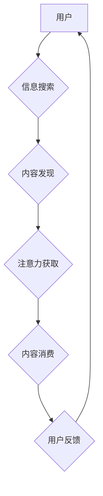

                 

## 1. 背景介绍

在当今信息爆炸的时代，人们每天接触的海量信息令人眼花缭乱。如何才能在众多信息中脱颖而出，吸引和留住受众的注意力，成为了内容创作的重大挑战。 

注意力经济的概念应运而生，它强调了在信息过载的时代，人们对信息的筛选和选择能力变得越来越重要。注意力本身成为了稀缺资源，而能够有效获取和利用这种稀缺资源的内容创作者，将拥有巨大的竞争优势。

## 2. 核心概念与联系

### 2.1 注意力经济

注意力经济是指在信息时代，人们对信息的获取和处理能力有限，而注意力成为了稀缺资源的经济学理论。 

在这个经济模型中，内容创作者需要通过各种策略和技巧，吸引用户的注意力，并将其转化为价值，例如阅读量、点赞量、分享量、转化率等。

### 2.2 内容创作

内容创作是指通过文字、图片、视频、音频等多种形式，创作出具有价值和吸引力的信息内容的过程。 

在注意力经济时代，内容创作需要更加注重用户体验，并针对用户的兴趣和需求进行精准定位。

### 2.3 用户行为

用户行为是指用户在使用互联网和消费内容时所表现出的各种动作和模式。 

理解用户的行为动机和偏好，是内容创作者吸引和留住用户注意力的关键。

**Mermaid 流程图**



## 3. 核心算法原理 & 具体操作步骤

### 3.1 算法原理概述

在注意力经济时代，内容创作需要借助算法来辅助分析用户行为，预测用户兴趣，并优化内容策略。 

一些常用的算法包括：

* **推荐算法:** 基于用户的历史行为和偏好，推荐相关的内容。
* **内容分类算法:** 自动识别内容的主题和类别，方便用户搜索和浏览。
* **用户画像算法:** 通过分析用户的行为数据，构建用户的画像，以便更精准地定位目标用户。

### 3.2 算法步骤详解

以推荐算法为例，其基本步骤如下：

1. **数据收集:** 收集用户的行为数据，例如浏览记录、点击记录、点赞记录等。
2. **数据预处理:** 对收集到的数据进行清洗、转换和格式化，以便算法进行处理。
3. **特征提取:** 从用户行为数据中提取特征，例如用户喜欢的主题、浏览时间、设备类型等。
4. **模型训练:** 使用机器学习算法，训练推荐模型，学习用户行为模式和偏好。
5. **推荐结果生成:** 根据训练好的模型，对用户进行个性化推荐。
6. **结果评估:** 评估推荐结果的准确性和有效性，并根据评估结果进行模型优化。

### 3.3 算法优缺点

**优点:**

* **个性化推荐:** 可以根据用户的兴趣和需求，提供更精准的推荐。
* **提高用户粘性:** 通过推荐用户感兴趣的内容，可以提高用户的使用频率和粘性。
* **提升内容曝光:** 可以帮助内容创作者将内容推荐给更广泛的受众。

**缺点:**

* **数据依赖:** 推荐算法需要大量的用户行为数据进行训练，否则效果会不佳。
* **算法偏差:** 算法可能会存在偏差，导致推荐结果不准确或不公平。
* **用户隐私:** 收集和使用用户行为数据可能会引发用户隐私方面的担忧。

### 3.4 算法应用领域

推荐算法广泛应用于各个领域，例如：

* **电商平台:** 推荐商品、优惠券和促销活动。
* **社交媒体:** 推荐好友、群组和内容。
* **视频网站:** 推荐视频、电视剧和电影。
* **音乐平台:** 推荐歌曲、专辑和音乐人。

## 4. 数学模型和公式 & 详细讲解 & 举例说明

### 4.1 数学模型构建

推荐算法通常使用协同过滤模型，该模型基于用户的历史行为数据，预测用户对某个物品的评分或偏好。

**用户-物品交互矩阵:**

用户-物品交互矩阵是一个二维矩阵，其中每一行代表一个用户，每一列代表一个物品。矩阵中的元素表示用户对物品的评分或交互行为，例如点赞、收藏、购买等。

**公式:**

$$
R_{u,i} = \text{预测用户 u 对物品 i 的评分}
$$

### 4.2 公式推导过程

协同过滤模型通过计算用户和物品之间的相似度，预测用户对物品的评分。

**用户相似度:**

$$
Sim(u,v) = \frac{\sum_{i=1}^{N} (R_{u,i} - \bar{R}_u)(R_{v,i} - \bar{R}_v)}{\sqrt{\sum_{i=1}^{N} (R_{u,i} - \bar{R}_u)^2} \sqrt{\sum_{i=1}^{N} (R_{v,i} - \bar{R}_v)^2}}
$$

其中：

* $R_{u,i}$ 表示用户 u 对物品 i 的评分。
* $\bar{R}_u$ 表示用户 u 的平均评分。
* $N$ 表示用户 u 评分过的物品数量。

**物品相似度:**

$$
Sim(i,j) = \frac{\sum_{u=1}^{M} (R_{u,i} - \bar{R}_i)(R_{u,j} - \bar{R}_j)}{\sqrt{\sum_{u=1}^{M} (R_{u,i} - \bar{R}_i)^2} \sqrt{\sum_{u=1}^{M} (R_{u,j} - \bar{R}_j)^2}}
$$

其中：

* $R_{u,i}$ 表示用户 u 对物品 i 的评分。
* $\bar{R}_i$ 表示物品 i 的平均评分。
* $M$ 表示评分过物品 i 的用户数量。

### 4.3 案例分析与讲解

假设有一个电商平台，用户 A 和用户 B 都购买了商品 1 和商品 2，但用户 A 对商品 1 的评分为 5 分，而用户 B 对商品 1 的评分为 3 分。

根据用户相似度公式，我们可以计算出用户 A 和用户 B 的相似度。如果相似度较高，则表明用户 A 和用户 B 的口味相近，平台可以推荐用户 B 类似于用户 A 购买过的商品。

## 5. 项目实践：代码实例和详细解释说明

### 5.1 开发环境搭建

* **操作系统:** Linux 或 macOS
* **编程语言:** Python
* **库依赖:** scikit-learn, pandas, numpy

### 5.2 源代码详细实现

```python
import pandas as pd
from sklearn.metrics.pairwise import cosine_similarity

# 加载用户-物品交互数据
data = pd.read_csv('user_item_data.csv')

# 计算用户相似度
user_similarity = cosine_similarity(data.T)

# 获取用户 A 的相似用户
user_A_id = 1
similar_users = user_similarity[user_A_id].argsort()[:-6:-1]  # 获取前 5 个相似用户

# 推荐给用户 A 的物品
recommended_items = data.iloc[similar_users, :].mean().sort_values(ascending=False)
```

### 5.3 代码解读与分析

* **数据加载:** 使用 pandas 库加载用户-物品交互数据。
* **用户相似度计算:** 使用 scikit-learn 库的 cosine_similarity 函数计算用户之间的相似度。
* **相似用户获取:** 根据用户 A 的 ID，获取其相似用户的 ID 列表。
* **物品推荐:** 

根据相似用户的评分，计算出用户 A 可能感兴趣的物品，并排序推荐。

### 5.4 运行结果展示

运行代码后，将输出一个包含推荐物品及其评分的 DataFrame。

## 6. 实际应用场景

### 6.1 内容平台推荐

* **新闻推荐:** 根据用户的阅读历史和偏好，推荐相关新闻文章。
* **视频推荐:** 根据用户的观看历史和兴趣，推荐相关视频内容。
* **博客推荐:** 根据用户的阅读历史和关注主题，推荐相关博客文章。

### 6.2 社交媒体推荐

* **好友推荐:** 根据用户的社交关系和兴趣，推荐潜在的好友。
* **群组推荐:** 根据用户的兴趣和话题，推荐相关群组。
* **内容推荐:** 根据用户的兴趣和关注话题，推荐相关内容。

### 6.3 电商平台推荐

* **商品推荐:** 根据用户的购买历史和浏览记录，推荐相关商品。
* **优惠券推荐:** 根据用户的消费习惯和偏好，推荐相关的优惠券和促销活动。
* **个性化套餐推荐:** 根据用户的需求和预算，推荐个性化的套餐方案。

### 6.4 未来应用展望

随着人工智能技术的不断发展，注意力经济和内容创作将更加融合，未来应用场景将更加广泛，例如：

* **个性化教育:** 根据学生的学习进度和兴趣，推荐个性化的学习内容。
* **精准医疗:** 根据患者的病史和基因信息，推荐个性化的治疗方案。
* **智能客服:** 通过自然语言处理技术，提供更加智能和个性化的客服服务。

## 7. 工具和资源推荐

### 7.1 学习资源推荐

* **书籍:**

* 《深度学习》
* 《机器学习实战》
* 《推荐系统实践》

* **在线课程:**

* Coursera: 机器学习
* edX: 深度学习
* Udacity: 机器学习工程师

### 7.2 开发工具推荐

* **Python:** 广泛应用于机器学习和数据分析。
* **scikit-learn:** Python 机器学习库，提供各种算法和工具。
* **pandas:** Python 数据分析库，用于数据处理和分析。
* **numpy:** Python 数值计算库，用于数值计算和矩阵操作。

### 7.3 相关论文推荐

* **Collaborative Filtering for Implicit Feedback Datasets**
* **Matrix Factorization Techniques for Recommender Systems**
* **A Survey on Content-Based Recommendation Systems**

## 8. 总结：未来发展趋势与挑战

### 8.1 研究成果总结

注意力经济和内容创作领域取得了显著的进展，推荐算法、用户画像算法等技术不断发展，为内容创作者提供了更加精准的工具和策略。

### 8.2 未来发展趋势

* **更精准的个性化推荐:** 利用更先进的机器学习算法和数据分析技术，实现更加精准的个性化推荐。
* **多模态内容创作:** 融合文本、图片、视频、音频等多种模态内容，创作更加丰富和吸引人的内容。
* **增强现实和虚拟现实:** 利用 AR 和 VR 技术，打造更加沉浸式的用户体验。

### 8.3 面临的挑战

* **数据隐私:** 如何保护用户数据隐私，同时实现精准的个性化推荐，是一个重要的挑战。
* **算法公平性:** 算法可能会存在偏差，导致推荐结果不公平，需要不断改进算法模型，确保算法公平性。
* **用户信任:** 如何建立用户对推荐系统的信任，避免用户对推荐结果产生抵触情绪，也是一个重要的挑战。

### 8.4 研究展望

未来，注意力经济和内容创作领域将继续发展，需要不断探索新的技术和方法，以满足用户日益增长的需求。


## 9. 附录：常见问题与解答

**Q1: 如何提高推荐算法的准确性？**

**A1:** 

* 提高数据质量：收集更丰富、更准确的用户行为数据。
* 优化算法模型：选择更合适的算法模型，并进行参数调优。
* 结合多种推荐策略：将协同过滤、内容过滤等多种推荐策略结合使用。

**Q2: 如何解决算法偏差问题？**

**A2:** 

* 使用公平性评估指标：在训练和评估算法模型时，使用公平性评估指标，例如不公平性度量。
* 构建多样化的训练数据集：确保训练数据集具有多样性，避免算法偏向特定用户群体。
* 进行算法解释和可视化：解释算法的决策过程，并进行可视化，帮助识别和解决算法偏差。


作者：禅与计算机程序设计艺术 / Zen and the Art of Computer Programming 
<end_of_turn>

