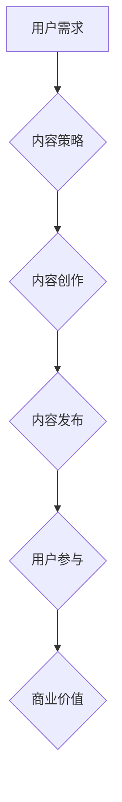

                 

## 注意力经济与内容策略：创建吸引并留住受众的参与内容

> 关键词：注意力经济、内容策略、用户参与、算法原理、数学模型、项目实践、实际应用场景

## 1. 背景介绍

在当今信息爆炸的时代，人们每天面临着海量的信息涌入。从新闻推送到社交媒体，从电子邮件到广告，无处不在的数字噪音使得人们的注意力变得稀缺而宝贵。这种“注意力经济”的兴起，深刻地改变了内容创作和传播的方式。

传统的内容营销策略往往依赖于信息量和频率，试图通过轰炸式推送来吸引用户注意力。然而，这种方式在注意力经济时代显得越来越无效。用户已经变得更加挑剔，他们更倾向于选择真正有价值、能够满足其需求的内容。

因此，在注意力经济下，内容策略需要进行根本性的转变。不再是单纯地生产内容，而是要更加注重用户体验，创造能够吸引和留住用户注意力的参与内容。

## 2. 核心概念与联系

### 2.1 注意力经济

注意力经济是指在信息过载的时代，人们对信息的获取和处理能力有限，而注意力成为一种稀缺资源。在这个经济体系中，内容创作者和平台需要通过各种手段来争夺用户的注意力，并将其转化为商业价值。

### 2.2 内容策略

内容策略是指围绕目标受众，明确内容目标，并制定出一套可持续的内容创作、发布和推广计划。它旨在通过提供有价值、引人入胜的内容，来吸引、留住和转化用户。

### 2.3 用户参与

用户参与是指用户在内容中积极参与，例如评论、点赞、分享、转发等行为。用户参与是衡量内容成功的重要指标，也是内容策略的核心目标之一。

**Mermaid 流程图**



## 3. 核心算法原理 & 具体操作步骤

### 3.1 算法原理概述

在注意力经济下，算法扮演着至关重要的角色。通过分析用户行为数据，算法可以帮助内容创作者更好地理解用户的兴趣和需求，并推荐更符合用户偏好的内容。

常见的算法包括：

* **协同过滤算法:** 基于用户的历史行为数据，推荐与用户兴趣相似的其他用户或内容。
* **内容基准算法:** 基于内容本身的特征，例如主题、关键词、标签等，推荐与用户搜索或浏览历史相似的内容。
* **深度学习算法:** 利用深度神经网络，从海量用户行为数据中学习更复杂的模式，进行更精准的推荐。

### 3.2 算法步骤详解

以协同过滤算法为例，其具体步骤如下：

1. **数据收集:** 收集用户行为数据，例如用户浏览历史、点赞记录、评论内容等。
2. **用户相似度计算:** 使用距离度量方法，例如余弦相似度或皮尔逊相关系数，计算用户之间的相似度。
3. **推荐内容:** 根据用户与其他用户的相似度，推荐其他用户喜欢的、用户自己可能感兴趣的内容。

### 3.3 算法优缺点

**优点:**

* **精准推荐:** 算法可以根据用户的个性化需求，提供更精准的推荐。
* **个性化体验:** 用户可以获得更符合自己兴趣的内容，提升用户体验。
* **数据驱动:** 算法基于数据分析，能够不断优化推荐效果。

**缺点:**

* **冷启动问题:** 新用户或新内容缺乏历史数据，难以进行精准推荐。
* **数据孤岛:** 数据分散在不同的平台，难以进行统一分析。
* **算法偏差:** 算法可能存在偏差，导致推荐结果不公平或不准确。

### 3.4 算法应用领域

协同过滤算法广泛应用于以下领域:

* **电商推荐:** 推荐商品、优惠券、促销活动等。
* **视频平台推荐:** 推荐视频、电视剧、电影等。
* **音乐平台推荐:** 推荐歌曲、专辑、音乐人等。
* **社交媒体推荐:** 推荐好友、群组、话题等。

## 4. 数学模型和公式 & 详细讲解 & 举例说明

### 4.1 数学模型构建

协同过滤算法的核心是用户-物品评分矩阵，该矩阵表示用户对不同物品的评分。

假设有N个用户和M个物品，则用户-物品评分矩阵可以表示为一个N x M的矩阵R，其中R(i,j)表示用户i对物品j的评分。

### 4.2 公式推导过程

协同过滤算法的目标是预测用户对物品的评分。常用的预测公式包括：

* **基于用户的协同过滤:**

$$
R(i,j) = \bar{R}_i + \frac{\sum_{k \in N(i)} (R(i,k) - \bar{R}_i) (R(k,j) - \bar{R}_k)}{\sum_{k \in N(i)} (R(i,k) - \bar{R}_i)^2}
$$

其中：

* R(i,j) 是用户i对物品j的预测评分。
* $\bar{R}_i$ 是用户i的平均评分。
* N(i) 是与用户i相似度高的用户集合。
* R(i,k) 是用户i对物品k的实际评分。

* **基于物品的协同过滤:**

$$
R(i,j) = \bar{R}_j + \frac{\sum_{k \in N(j)} (R(i,k) - \bar{R}_i) (R(k,j) - \bar{R}_j)}{\sum_{k \in N(j)} (R(k,j) - \bar{R}_j)^2}
$$

其中：

* N(j) 是与物品j相似度高的物品集合。

### 4.3 案例分析与讲解

假设有一个电影推荐系统，用户A对电影1和2都评分为5，用户B对电影2和3都评分为4。根据基于用户的协同过滤算法，可以预测用户A对电影3的评分。

## 5. 项目实践：代码实例和详细解释说明

### 5.1 开发环境搭建

* Python 3.x
* scikit-learn 库
* Pandas 库
* Matplotlib 库

### 5.2 源代码详细实现

```python
import pandas as pd
from sklearn.metrics.pairwise import cosine_similarity

# 加载用户-物品评分数据
ratings_data = pd.read_csv('ratings.csv')

# 计算用户之间的相似度
user_similarity = cosine_similarity(ratings_data)

# 预测用户对物品的评分
def predict_rating(user_id, item_id):
    # 获取用户与其他用户的相似度
    similar_users = user_similarity[user_id]

    # 计算预测评分
    predicted_rating = (
        sum(
            similar_users[ratings_data[ratings_data['user_id'] == user_id].index] *
            ratings_data[ratings_data['item_id'] == item_id]['rating']
        ) / sum(similar_users)
    )
    return predicted_rating

# 预测用户1对电影3的评分
predicted_rating = predict_rating(1, 3)
print(f'用户1对电影3的预测评分: {predicted_rating}')
```

### 5.3 代码解读与分析

* 代码首先加载用户-物品评分数据。
* 然后使用cosine_similarity函数计算用户之间的相似度。
* predict_rating函数用于预测用户对物品的评分，它根据用户与其他用户的相似度，以及其他用户对该物品的评分，计算出预测评分。

### 5.4 运行结果展示

运行代码后，可以得到用户1对电影3的预测评分。

## 6. 实际应用场景

### 6.1 内容推荐

在内容平台，例如新闻网站、视频网站、社交媒体平台等，协同过滤算法可以根据用户的浏览历史、点赞记录等数据，推荐用户可能感兴趣的内容。

### 6.2 个性化广告

广告平台可以使用协同过滤算法，根据用户的兴趣爱好和行为数据，推荐更精准的广告，提高广告点击率和转化率。

### 6.3 产品推荐

电商平台可以使用协同过滤算法，根据用户的购买历史、浏览记录等数据，推荐用户可能感兴趣的产品。

### 6.4 未来应用展望

随着人工智能技术的不断发展，协同过滤算法将应用于更多领域，例如医疗诊断、教育推荐、金融投资等。

## 7. 工具和资源推荐

### 7.1 学习资源推荐

* **书籍:**

    * 《推荐系统》
    * 《机器学习》

* **在线课程:**

    * Coursera: Recommender Systems
    * edX: Machine Learning

### 7.2 开发工具推荐

* **Python:** 

    * scikit-learn
    * Pandas
    * TensorFlow

* **Spark:** 

    * MLlib

### 7.3 相关论文推荐

* **协同过滤算法:**

    * "Collaborative Filtering: A User-Based Approach"
    * "Item-Based Collaborative Filtering Recommendation Algorithms"

## 8. 总结：未来发展趋势与挑战

### 8.1 研究成果总结

注意力经济与内容策略的结合，推动了内容推荐算法的快速发展。协同过滤算法作为一种重要的推荐算法，在实际应用中取得了显著的成果。

### 8.2 未来发展趋势

* **深度学习:** 深度学习算法将进一步提升推荐效果，能够处理更复杂的场景和数据。
* **个性化推荐:** 推荐系统将更加注重用户的个性化需求，提供更精准、更个性化的内容推荐。
* **跨平台推荐:** 推荐系统将跨越平台边界，提供更全面的内容推荐。

### 8.3 面临的挑战

* **数据隐私:** 数据收集和使用需要更加注重用户隐私保护。
* **算法公平性:** 算法需要避免存在偏差，确保推荐结果公平公正。
* **用户信任:** 用户需要对推荐算法的透明度和可靠性有信心。

### 8.4 研究展望

未来研究将更加关注以下方面:

* **开发更有效的推荐算法:** 探索新的算法模型和技术，提升推荐效果。
* **解决算法伦理问题:** 确保推荐算法的公平性、透明度和可解释性。
* **构建用户信任机制:** 设计更有效的机制，增强用户对推荐系统的信任。

## 9. 附录：常见问题与解答

### 9.1 如何解决冷启动问题？

冷启动问题是指新用户或新内容缺乏历史数据，难以进行精准推荐。

解决方法包括:

* **基于内容的推荐:** 利用新内容本身的特征进行推荐。
* **用户偏好学习:** 通过用户行为数据，例如浏览记录、搜索历史等，学习用户的偏好。
* **人工标注:** 人工标注新内容的类别和标签，帮助算法进行推荐。

### 9.2 如何评估推荐算法的效果？

常用的评估指标包括:

* **准确率:** 推荐结果与用户真实偏好的一致性。
* **召回率:** 推荐系统能够召回用户真实偏好的内容比例。
* **覆盖率:** 推荐系统能够覆盖的用户数量。
* **点击率:** 用户点击推荐结果的比例。

### 9.3 如何提高算法的公平性？

算法公平性是指推荐结果不歧视任何用户或内容。

提高算法公平性的方法包括:

* **数据清洗:** 剔除数据中的偏见和歧视信息。
* **算法调优:** 调整算法参数，避免算法产生不公平的推荐结果。
* **定期评估:** 定期评估算法的公平性，并进行必要的调整。


作者：禅与计算机程序设计艺术 / Zen and the Art of Computer Programming 
<end_of_turn>

