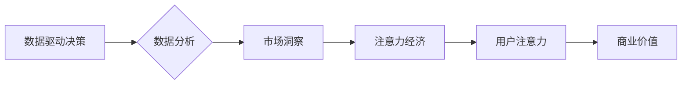

                 

##  注意力经济与数据驱动的决策制定：利用数据增强市场洞察力

> 关键词：注意力经济、数据驱动决策、市场洞察、机器学习、深度学习、自然语言处理、数据可视化

## 1. 背景介绍

在当今信息爆炸的时代，人们面临着来自各方信息的冲击。如何有效地获取、处理和利用信息，成为了企业和个人都面临的重大挑战。注意力经济应运而生，它强调了信息获取和处理的有限性，并指出注意力是稀缺的资源。企业需要在竞争激烈的市场环境中，抓住用户有限的注意力，并将其转化为商业价值。

数据驱动决策是现代企业管理的重要趋势。通过收集、分析和利用数据，企业可以获得更深入的市场洞察，做出更准确的决策，提高运营效率和竞争力。然而，单纯依靠传统的数据分析方法，难以应对海量数据的处理和复杂问题的解决。

## 2. 核心概念与联系

### 2.1 注意力经济

注意力经济是指在信息过载的时代，人们对信息的获取和处理能力有限，而注意力是稀缺的资源。企业需要通过提供有价值、吸引人的内容，来获取用户的注意力，并将其转化为商业价值。

### 2.2 数据驱动决策

数据驱动决策是指利用数据分析和机器学习等技术，从海量数据中提取有价值的信息，为决策提供依据。通过数据分析，企业可以了解用户的行为模式、市场趋势和竞争对手情况，从而做出更明智的决策。

### 2.3 数据增强市场洞察

数据增强市场洞察是指通过利用数据分析和机器学习等技术，从海量数据中挖掘出更深层的市场洞察，帮助企业更好地理解市场需求、用户行为和竞争格局。

**数据驱动决策与注意力经济的联系**

数据驱动决策和注意力经济相互关联，共同构成了现代企业竞争的新格局。

* 数据驱动决策需要大量的数据作为基础，而注意力经济则提供了获取用户数据的途径。
* 通过数据分析，企业可以了解用户的注意力偏好，并根据这些偏好，设计更吸引用户的营销活动和产品。
* 同时，数据驱动决策的结果可以帮助企业更好地理解用户的需求，从而提供更符合用户需求的产品和服务，从而吸引用户的注意力。

**核心概念架构图**



## 3. 核心算法原理 & 具体操作步骤

### 3.1 算法原理概述

数据增强市场洞察的核心算法原理是利用机器学习和深度学习技术，从海量数据中提取有价值的信息，并将其转化为可理解的市场洞察。

常见的算法包括：

* **自然语言处理 (NLP)**：用于分析文本数据，例如用户评论、社交媒体帖子和新闻文章，提取关键词、主题和情感等信息。
* **机器学习 (ML)**：用于识别模式和趋势，例如用户行为模式、市场趋势和竞争对手情况。
* **深度学习 (DL)**：用于处理复杂的数据，例如图像、视频和音频，提取更深层的特征和洞察。

### 3.2 算法步骤详解

1. **数据收集**: 从各种来源收集相关数据，例如用户行为数据、市场数据、竞争对手数据等。
2. **数据预处理**: 对收集到的数据进行清洗、转换和格式化，使其适合算法训练。
3. **特征提取**: 从数据中提取有价值的特征，例如用户 demographics、购买行为、产品评价等。
4. **模型训练**: 利用机器学习或深度学习算法，对提取的特征进行训练，建立预测模型。
5. **模型评估**: 对训练好的模型进行评估，验证其准确性和有效性。
6. **市场洞察**: 利用训练好的模型，对新的数据进行预测和分析，提取市场洞察。

### 3.3 算法优缺点

**优点**:

* **数据驱动**: 基于数据分析，提供更客观、更准确的市场洞察。
* **自动化**: 自动化数据处理和分析流程，提高效率和准确性。
* **可扩展性**: 可以处理海量数据，并随着数据量的增加而不断改进。

**缺点**:

* **数据依赖**: 算法的准确性依赖于数据的质量和数量。
* **算法复杂性**: 训练和部署复杂的机器学习模型需要专业知识和技术支持。
* **解释性**: 一些深度学习模型的决策过程难以解释，难以获得对模型决策的深入理解。

### 3.4 算法应用领域

* **市场调研**: 分析用户需求、市场趋势和竞争对手情况。
* **产品开发**: 了解用户偏好，开发更符合用户需求的产品。
* **营销推广**: 针对不同用户群体进行个性化营销。
* **风险管理**: 识别潜在的市场风险，制定相应的应对措施。

## 4. 数学模型和公式 & 详细讲解 & 举例说明

### 4.1 数学模型构建

数据增强市场洞察的数学模型通常基于统计学和机器学习的原理。

**用户行为模型**:

用户行为可以被建模为一个马尔可夫链，其中每个状态代表用户的行为模式，例如浏览商品、加入购物车、购买商品等。

**市场趋势模型**:

市场趋势可以被建模为一个时间序列模型，例如ARIMA模型，用于预测未来的市场变化趋势。

**竞争对手分析模型**:

竞争对手分析可以基于网络分析模型，例如PageRank算法，用于分析竞争对手之间的关系和影响力。

### 4.2 公式推导过程

具体的数学公式推导过程取决于所使用的算法和模型。

例如，在用户行为模型中，状态转移概率可以根据历史数据进行估计。

$$P(s_t|s_{t-1}) = \frac{N(s_{t-1}, s_t)}{N(s_{t-1})}$$

其中：

* $P(s_t|s_{t-1})$ 是从状态 $s_{t-1}$ 转移到状态 $s_t$ 的概率。
* $N(s_{t-1}, s_t)$ 是从状态 $s_{t-1}$ 转移到状态 $s_t$ 的次数。
* $N(s_{t-1})$ 是状态 $s_{t-1}$ 的出现次数。

### 4.3 案例分析与讲解

例如，一家电商平台可以使用用户行为模型来预测用户的购买行为，并根据预测结果进行个性化推荐。

通过分析用户的浏览历史、购买记录和评价信息，可以建立用户的行为模式，并预测用户未来可能购买的商品。

## 5. 项目实践：代码实例和详细解释说明

### 5.1 开发环境搭建

* Python 3.x
* Jupyter Notebook
* TensorFlow 或 PyTorch
* Numpy, Pandas, Scikit-learn 等数据科学库

### 5.2 源代码详细实现

以下是一个简单的用户行为预测模型的代码示例，使用Scikit-learn库实现：

```python
from sklearn.model_selection import train_test_split
from sklearn.linear_model import LogisticRegression
from sklearn.metrics import accuracy_score

# 加载用户行为数据
data = pd.read_csv('user_behavior.csv')

# 选择特征和目标变量
features = ['age', 'gender', 'purchase_history']
target = 'purchase_probability'

# 将数据划分为训练集和测试集
X_train, X_test, y_train, y_test = train_test_split(data[features], data[target], test_size=0.2)

# 创建LogisticRegression模型
model = LogisticRegression()

# 训练模型
model.fit(X_train, y_train)

# 对测试集进行预测
y_pred = model.predict(X_test)

# 计算模型准确率
accuracy = accuracy_score(y_test, y_pred)
print('模型准确率:', accuracy)
```

### 5.3 代码解读与分析

* 该代码首先加载用户行为数据，并选择特征和目标变量。
* 然后将数据划分为训练集和测试集，用于训练和评估模型。
* 创建LogisticRegression模型，并使用训练集进行模型训练。
* 最后对测试集进行预测，并计算模型的准确率。

### 5.4 运行结果展示

运行结果会显示模型的准确率，例如：

```
模型准确率: 0.85
```

这表示模型在预测用户购买行为方面准确率为85%。

## 6. 实际应用场景

### 6.1 市场调研

利用数据分析，可以了解用户对特定产品的需求、偏好和购买行为，从而帮助企业制定更有效的市场营销策略。

### 6.2 产品开发

通过分析用户评论、反馈和行为数据，可以了解用户对现有产品的满意度和改进建议，从而帮助企业开发更符合用户需求的产品。

### 6.3 营销推广

根据用户画像和行为数据，可以进行精准的营销推广，例如针对不同用户群体推送个性化的广告和促销活动。

### 6.4 未来应用展望

随着人工智能技术的不断发展，数据增强市场洞察的应用场景将更加广泛，例如：

* **个性化推荐**: 提供更精准的商品、服务和内容推荐。
* **预测分析**: 预测未来的市场趋势、用户行为和竞争对手动向。
* **智能客服**: 利用自然语言处理技术，提供更智能、更便捷的客户服务。

## 7. 工具和资源推荐

### 7.1 学习资源推荐

* **书籍**:
    * 《Python机器学习实战》
    * 《深度学习》
    * 《数据科学方法》
* **在线课程**:
    * Coursera
    * edX
    * Udacity

### 7.2 开发工具推荐

* **Python**: 
    * Jupyter Notebook
    * TensorFlow
    * PyTorch
* **数据分析工具**:
    * Pandas
    * Scikit-learn
    * Matplotlib

### 7.3 相关论文推荐

* **Attention Is All You Need**: https://arxiv.org/abs/1706.03762
* **BERT: Pre-training of Deep Bidirectional Transformers for Language Understanding**: https://arxiv.org/abs/1810.04805

## 8. 总结：未来发展趋势与挑战

### 8.1 研究成果总结

数据增强市场洞察是利用数据驱动决策和注意力经济的结合，为企业提供更深入的市场洞察，帮助企业做出更明智的决策。

### 8.2 未来发展趋势

* **更精准的预测**: 利用更先进的机器学习和深度学习算法，提高预测模型的准确性和精准度。
* **更全面的洞察**: 融合更多数据源，例如社交媒体数据、传感器数据和地理位置数据，提供更全面的市场洞察。
* **更个性化的体验**: 利用用户画像和行为数据，提供更个性化的产品推荐、营销推广和客户服务。

### 8.3 面临的挑战

* **数据质量**: 算法的准确性依赖于数据的质量和数量，如何获取高质量的数据仍然是一个挑战。
* **算法解释性**: 一些深度学习模型的决策过程难以解释，难以获得对模型决策的深入理解。
* **隐私保护**: 利用用户数据进行分析需要考虑用户隐私保护问题，如何平衡数据利用和隐私保护是一个重要的挑战。

### 8.4 研究展望

未来，数据增强市场洞察的研究将继续深入，探索更先进的算法、更全面的数据源和更个性化的应用场景。


## 9. 附录：常见问题与解答

**Q1: 数据增强市场洞察需要哪些数据？**

**A1:** 数据增强市场洞察需要各种类型的市场数据，例如用户行为数据、市场趋势数据、竞争对手数据等。

**Q2: 如何评估数据增强市场洞察模型的准确性？**

**A2:** 可以使用各种评估指标，例如准确率、召回率、F1-score等，来评估模型的准确性。

**Q3: 数据增强市场洞察的应用场景有哪些？**

**A3:** 数据增强市场洞察的应用场景非常广泛，例如市场调研、产品开发、营销推广等。

**Q4: 数据增强市场洞察面临哪些挑战？**

**A4:** 数据增强市场洞察面临数据质量、算法解释性和隐私保护等挑战。


作者：禅与计算机程序设计艺术 / Zen and the Art of Computer Programming 
<end_of_turn>

