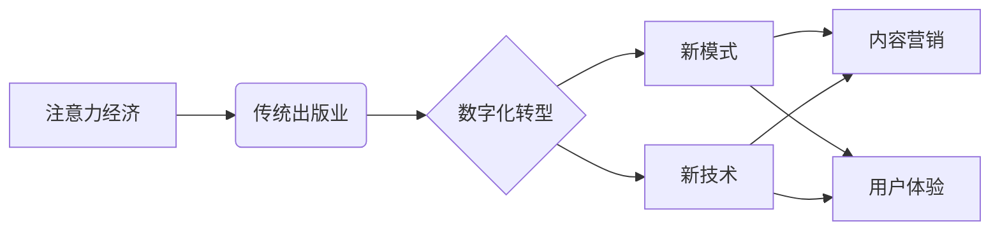

                 

##  注意力经济对传统出版业的转型要求

> 关键词：注意力经济、传统出版业、数字化转型、内容营销、用户体验、数据驱动、人工智能、订阅模式

## 1. 背景介绍

在当今信息爆炸的时代，人们面临着前所未有的信息过载。注意力，作为稀缺资源，变得越来越宝贵。注意力经济的概念应运而生，强调了获取和保持用户注意力的重要性。传统出版业，作为内容生产和传播的长期主导者，也面临着巨大的挑战。数字技术的快速发展和互联网的普及，改变了人们获取信息的方式，传统出版业的模式和盈利方式受到冲击。

传统出版业长期依赖于印刷和发行模式，内容生产周期长、传播渠道单一、用户互动性差。而注意力经济时代，用户更加碎片化、个性化，对内容的获取方式和体验要求也越来越高。传统出版业需要拥抱数字化转型，利用新技术和新模式，才能在注意力经济中立于不败之地。

## 2. 核心概念与联系

**2.1 注意力经济**

注意力经济是指在信息过载的时代，人们对注意力资源的竞争和交易。注意力是稀缺资源，拥有和控制注意力意味着拥有巨大的商业价值。

**2.2 传统出版业**

传统出版业是指以印刷出版书籍、杂志、报纸等为主要业务模式的出版行业。其核心价值在于内容生产、编辑、印刷、发行和销售。

**2.3 数字化转型**

数字化转型是指传统行业利用数字化技术和新模式，重构业务流程、优化运营效率、提升用户体验和创造新的商业价值。

**2.4 核心概念关系图**



## 3. 核心算法原理 & 具体操作步骤

**3.1 算法原理概述**

注意力机制是一种模仿人类注意力机制的算法，它能够学习到输入数据中最重要的部分，并对这些部分给予更多的关注。注意力机制广泛应用于自然语言处理、计算机视觉等领域，能够显著提升模型的性能。

**3.2 算法步骤详解**

1. **计算注意力权重:** 对于输入序列中的每个元素，计算与其他元素之间的相关性，得到每个元素的注意力权重。
2. **加权求和:** 根据注意力权重，对输入序列中的元素进行加权求和，得到一个新的表示向量。
3. **输出结果:** 将加权求和后的向量作为模型的输出，用于后续的预测或分类任务。

**3.3 算法优缺点**

**优点:**

* 能够学习到输入数据中最重要的部分，提高模型的准确性。
* 可以处理长序列数据，克服传统模型的短序列限制。
* 能够解释模型的决策过程，提高模型的可解释性。

**缺点:**

* 计算复杂度较高，训练时间较长。
* 需要大量的训练数据才能达到最佳效果。
* 对于噪声数据敏感，容易受到噪声的影响。

**3.4 算法应用领域**

* **机器翻译:** 提高翻译质量，更好地理解语义。
* **文本摘要:** 自动生成文本摘要，提取关键信息。
* **问答系统:** 理解用户问题，找到相关答案。
* **图像识别:** 关注图像中的重要区域，提高识别准确率。

## 4. 数学模型和公式 & 详细讲解 & 举例说明

**4.1 数学模型构建**

注意力机制的数学模型可以表示为以下公式：

$$
\text{Attention}(Q, K, V) = \text{softmax}\left(\frac{Q K^T}{\sqrt{d_k}}\right) V
$$

其中：

* $Q$：查询矩阵，表示需要关注的信息。
* $K$：键矩阵，表示所有信息的键值。
* $V$：值矩阵，表示所有信息的具体值。
* $d_k$：键向量的维度。
* $\text{softmax}$：softmax函数，用于将注意力权重归一化。

**4.2 公式推导过程**

1. 计算查询矩阵 $Q$ 与键矩阵 $K$ 的点积，得到一个得分矩阵。
2. 对得分矩阵进行归一化，得到注意力权重矩阵。
3. 将注意力权重矩阵与值矩阵 $V$ 进行加权求和，得到最终的注意力输出。

**4.3 案例分析与讲解**

假设我们有一个句子 "我爱吃苹果"，想要用注意力机制提取其中的关键信息。

* $Q$：查询向量，表示我们想要关注的信息。
* $K$：键向量，表示每个单词的词向量。
* $V$：值向量，表示每个单词的词向量。

通过计算 $Q$ 与 $K$ 的点积，我们可以得到每个单词的注意力权重。例如，"爱" 这个单词的注意力权重可能比其他单词更高，因为它是句子中表达情感的核心词。

最终的注意力输出将是一个加权求和后的向量，它包含了句子中关键信息的表示。

## 5. 项目实践：代码实例和详细解释说明

**5.1 开发环境搭建**

* Python 3.x
* TensorFlow 或 PyTorch
* Jupyter Notebook

**5.2 源代码详细实现**

```python
import tensorflow as tf

# 定义注意力机制层
class AttentionLayer(tf.keras.layers.Layer):
    def __init__(self, units):
        super(AttentionLayer, self).__init__()
        self.Wq = tf.keras.layers.Dense(units)
        self.Wk = tf.keras.layers.Dense(units)
        self.Wv = tf.keras.layers.Dense(units)
        self.softmax = tf.keras.layers.Softmax()

    def call(self, inputs):
        Q = self.Wq(inputs)
        K = self.Wk(inputs)
        V = self.Wv(inputs)
        attention_weights = self.softmax(tf.matmul(Q, K, transpose_b=True) / tf.math.sqrt(tf.cast(units, tf.float32)))
        output = tf.matmul(attention_weights, V)
        return output

# 实例化注意力机制层
attention_layer = AttentionLayer(units=128)

# 输入数据
inputs = tf.random.normal(shape=(1, 10, 512))

# 通过注意力机制层进行处理
output = attention_layer(inputs)

# 打印输出结果
print(output.shape)
```

**5.3 代码解读与分析**

* 我们定义了一个 `AttentionLayer` 类，实现了注意力机制的计算过程。
* `Wq`, `Wk`, `Wv` 是三个权重矩阵，用于将输入数据映射到查询、键和值向量。
* `softmax` 函数用于计算注意力权重。
* `tf.matmul` 函数用于计算矩阵乘积。

**5.4 运行结果展示**

运行代码后，输出结果是一个形状为 `(1, 10, 128)` 的张量，表示经过注意力机制处理后的输出。

## 6. 实际应用场景

**6.1 内容推荐系统**

注意力机制可以用于个性化内容推荐，根据用户的阅读历史和兴趣偏好，推荐更符合用户需求的内容。

**6.2 个性化新闻聚合**

注意力机制可以帮助新闻聚合平台识别用户感兴趣的新闻主题，并根据用户的阅读习惯，个性化推荐新闻内容。

**6.3 智能客服系统**

注意力机制可以帮助智能客服系统理解用户的自然语言问题，并准确地定位问题关键信息，提供更精准的回复。

**6.4 教育领域**

注意力机制可以用于个性化学习，根据学生的学习进度和理解能力，推荐合适的学习内容和学习方式。

**6.5 未来应用展望**

随着人工智能技术的不断发展，注意力机制将在更多领域得到应用，例如医疗诊断、金融风险评估、科学研究等。

## 7. 工具和资源推荐

**7.1 学习资源推荐**

* **论文:** "Attention Is All You Need"
* **博客:** "Attention Is All You Need: The Illustrated Transformer"
* **在线课程:** Coursera, Udacity

**7.2 开发工具推荐**

* **TensorFlow:** https://www.tensorflow.org/
* **PyTorch:** https://pytorch.org/

**7.3 相关论文推荐**

* "Attention Is All You Need"
* "BERT: Pre-training of Deep Bidirectional Transformers for Language Understanding"
* "Transformer-XL: Attentive Language Models Beyond a Fixed-Length Context"

## 8. 总结：未来发展趋势与挑战

**8.1 研究成果总结**

注意力机制在自然语言处理、计算机视觉等领域取得了显著的成果，提高了模型的性能和效率。

**8.2 未来发展趋势**

* **更强大的注意力机制:** 研究更有效的注意力机制，例如自注意力、多头注意力等，提高模型的表达能力和泛化能力。
* **注意力机制的应用扩展:** 将注意力机制应用到更多领域，例如时间序列分析、图神经网络等。
* **注意力机制的可解释性:** 研究注意力机制的决策过程，提高模型的可解释性和可信度。

**8.3 面临的挑战**

* **计算复杂度:** 传统的注意力机制计算复杂度较高，难以处理大规模数据。
* **参数量:** 注意力机制模型参数量较大，需要大量的计算资源进行训练。
* **数据依赖性:** 注意力机制模型对训练数据的质量要求较高，容易受到噪声数据的影响。

**8.4 研究展望**

未来，注意力机制的研究将继续深入，探索更有效的算法、更广泛的应用场景和更强的可解释性，为人工智能的发展做出更大的贡献。

## 9. 附录：常见问题与解答

**9.1 如何选择合适的注意力机制？**

选择合适的注意力机制取决于具体的应用场景和数据特点。

**9.2 如何训练注意力机制模型？**

训练注意力机制模型需要使用大量的训练数据和强大的计算资源。

**9.3 注意力机制的局限性是什么？**

注意力机制的局限性包括计算复杂度高、参数量大、数据依赖性强等。


作者：禅与计算机程序设计艺术 / Zen and the Art of Computer Programming 
<end_of_turn>

