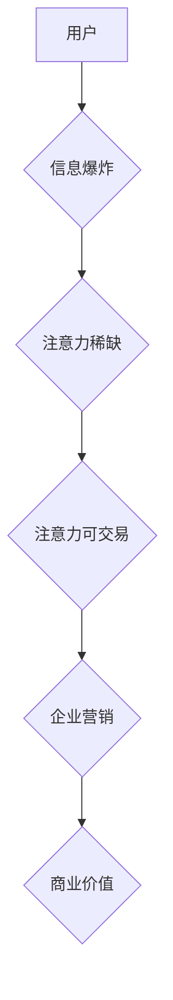

                 

## 1. 背景介绍

在当今数字时代，人们面临着前所未有的信息爆炸。每天，我们都被来自各个渠道的海量信息所包围，从社交媒体的推送到电子邮件的轰炸，从新闻网站的滚动条到广告横幅的广告，信息无处不在。在这种情况下，人们的注意力成为了稀缺的资源，而如何有效地获取和利用注意力，成为了企业和品牌争夺市场份额的关键。

传统节日营销一直是企业营销策略的重要组成部分。节日本身就蕴含着浓厚的文化氛围和消费意愿，为企业提供了独特的营销机会。然而，随着互联网和移动互联网的普及，人们的消费习惯和信息获取方式发生了根本性的变化。传统节日营销模式面临着新的挑战，需要根据注意力经济的规律进行调整和创新。

## 2. 核心概念与联系

### 2.1 注意力经济

注意力经济是指在信息过载的时代，人们的注意力成为了最宝贵的资源，而企业和品牌需要通过各种方式获取和利用用户的注意力来实现商业目标。

**核心原理：**

* **注意力稀缺：** 人类注意力有限，无法同时处理大量信息，因此需要选择性地关注某些信息。
* **注意力可交易：** 企业可以通过提供有价值的内容、服务或体验来吸引用户的注意力，并以此获取商业价值。
* **注意力可量化：** 通过各种数据分析工具，可以量化用户的注意力时长、参与度等指标，帮助企业评估营销效果。

**架构图：**



### 2.2 传统节日营销

传统节日营销是指企业在节日期间开展的营销活动，旨在利用节日氛围和消费意愿，提升品牌知名度、促进产品销售。

**核心特点：**

* **季节性：** 传统节日营销活动通常集中在特定的节日期间。
* **文化性：** 传统节日营销活动往往与节日文化和习俗相结合。
* **促销性：** 传统节日营销活动通常会推出优惠促销活动，吸引消费者购买。

## 3. 核心算法原理 & 具体操作步骤

### 3.1 算法原理概述

注意力经济对传统节日营销的影响主要体现在以下几个方面：

* **精准投放：** 利用大数据分析和人工智能技术，精准识别目标用户群体，并根据用户的兴趣爱好、消费习惯等信息，进行个性化的广告投放。
* **内容营销：** 创作与节日主题相关的优质内容，吸引用户的注意力，并引导用户进行互动和分享。
* **互动体验：** 利用社交媒体、移动互联网等平台，打造沉浸式的节日互动体验，增强用户参与度和品牌粘性。
* **数据分析：** 利用数据分析工具，实时监测营销活动的效果，并根据数据反馈进行调整和优化。

### 3.2 算法步骤详解

1. **数据收集：** 收集用户画像、节日消费数据、营销活动数据等相关信息。
2. **数据分析：** 利用机器学习算法，分析用户行为数据，识别用户兴趣爱好、消费习惯等特征。
3. **目标用户画像：** 根据数据分析结果，构建目标用户画像，并进行细分。
4. **内容创作：** 根据目标用户画像，创作与节日主题相关的优质内容，例如节日祝福语、节日活动介绍、节日优惠信息等。
5. **精准投放：** 利用广告平台的精准投放功能，将内容投放给目标用户群体。
6. **互动体验：** 利用社交媒体、移动互联网等平台，打造节日互动体验，例如线上抽奖、节日主题游戏等。
7. **数据监测：** 利用数据分析工具，实时监测营销活动的效果，例如用户参与度、转化率等指标。
8. **优化调整：** 根据数据反馈，对营销活动进行优化调整，提高营销效果。

### 3.3 算法优缺点

**优点：**

* **精准投放：** 可以有效地将广告投放给目标用户群体，提高广告效果。
* **个性化体验：** 可以根据用户的兴趣爱好、消费习惯等信息，提供个性化的营销内容和服务。
* **数据驱动：** 可以利用数据分析工具，实时监测营销活动的效果，并进行优化调整。

**缺点：**

* **数据依赖：** 需要大量的数据支持，才能进行精准的分析和投放。
* **算法复杂：** 需要复杂的算法模型和技术支持。
* **隐私问题：** 需要谨慎处理用户数据，避免侵犯用户隐私。

### 3.4 算法应用领域

注意力经济算法广泛应用于各个领域，例如：

* **广告营销：** 精准投放广告，提高广告效果。
* **内容推荐：** 根据用户的兴趣爱好，推荐个性化的内容。
* **电商平台：** 推送商品推荐，提高用户转化率。
* **社交媒体：** 优化用户体验，提高用户粘性。

## 4. 数学模型和公式 & 详细讲解 & 举例说明

### 4.1 数学模型构建

注意力经济可以抽象为一个资源分配模型，其中用户注意力是有限的资源，而各种信息源则需要争夺用户的注意力。我们可以用以下数学模型来描述这个过程：

**用户注意力分配模型：**

$$
A_i = \frac{V_i}{S_i}
$$

其中：

* $A_i$ 表示用户对信息源 $i$ 的注意力分配比例。
* $V_i$ 表示信息源 $i$ 的吸引力。
* $S_i$ 表示信息源 $i$ 的干扰程度。

### 4.2 公式推导过程

该模型的推导过程基于以下假设：

* 用户注意力是有限的，总和为 1。
* 用户对信息源的注意力分配比例与信息源的吸引力和干扰程度成正比和反比。

根据这些假设，我们可以推导出上述公式。

### 4.3 案例分析与讲解

例如，假设用户需要选择观看两个视频，视频 A 的吸引力为 5，干扰程度为 2，视频 B 的吸引力为 3，干扰程度为 1。

根据公式，我们可以计算出用户对这两个视频的注意力分配比例：

* $A_A = \frac{5}{2+5} = 0.71$
* $A_B = \frac{3}{1+3} = 0.75$

由此可见，用户更倾向于观看视频 B，因为视频 B 的吸引力相对较低，但干扰程度也相对较低，因此用户可以更专注地观看视频 B。

## 5. 项目实践：代码实例和详细解释说明

### 5.1 开发环境搭建

为了实现注意力经济算法的应用，需要搭建相应的开发环境。常用的开发环境包括：

* **编程语言：** Python、Java、C++ 等。
* **机器学习框架：** TensorFlow、PyTorch、Scikit-learn 等。
* **数据存储：** MySQL、MongoDB、Redis 等。
* **云计算平台：** AWS、Azure、GCP 等。

### 5.2 源代码详细实现

以下是一个简单的 Python 代码示例，用于计算用户对不同信息源的注意力分配比例：

```python
def calculate_attention_ratio(attraction, interference):
  """
  计算用户对信息源的注意力分配比例。

  Args:
    attraction: 信息源的吸引力。
    interference: 信息源的干扰程度。

  Returns:
    用户对信息源的注意力分配比例。
  """
  return attraction / (attraction + interference)

# 示例数据
video_a_attraction = 5
video_a_interference = 2
video_b_attraction = 3
video_b_interference = 1

# 计算注意力分配比例
video_a_ratio = calculate_attention_ratio(video_a_attraction, video_a_interference)
video_b_ratio = calculate_attention_ratio(video_b_attraction, video_b_interference)

# 打印结果
print(f"视频 A 的注意力分配比例：{video_a_ratio:.2f}")
print(f"视频 B 的注意力分配比例：{video_b_ratio:.2f}")
```

### 5.3 代码解读与分析

该代码首先定义了一个函数 `calculate_attention_ratio`，该函数接受信息源的吸引力和干扰程度作为输入，并返回用户对该信息源的注意力分配比例。

然后，代码定义了两个视频的吸引力和干扰程度，并调用 `calculate_attention_ratio` 函数计算出这两个视频的注意力分配比例。最后，代码打印出计算结果。

### 5.4 运行结果展示

运行该代码后，输出结果如下：

```
视频 A 的注意力分配比例：0.71
视频 B 的注意力分配比例：0.75
```

结果表明，用户更倾向于观看视频 B，因为视频 B 的注意力分配比例更高。

## 6. 实际应用场景

### 6.1  节日营销活动策划

注意力经济可以帮助企业更精准地策划节日营销活动。例如，企业可以根据用户的兴趣爱好和消费习惯，定制个性化的节日祝福语、节日优惠信息等，并通过精准投放的方式，将这些信息推送给目标用户群体。

### 6.2  节日主题内容创作

注意力经济可以帮助企业创作更吸引用户的节日主题内容。例如，企业可以根据用户的兴趣爱好和节日文化，创作与节日相关的视频、图片、文章等内容，并通过社交媒体、移动互联网等平台，进行推广和传播。

### 6.3  节日互动体验设计

注意力经济可以帮助企业设计更具吸引力的节日互动体验。例如，企业可以利用社交媒体、移动互联网等平台，设计线上抽奖、节日主题游戏等互动活动，增强用户参与度和品牌粘性。

### 6.4  未来应用展望

随着人工智能技术的不断发展，注意力经济在传统节日营销中的应用场景将会更加广泛。例如，未来企业可以利用人工智能技术，更加精准地预测用户的节日消费需求，并提供更加个性化的产品和服务。

## 7. 工具和资源推荐

### 7.1 学习资源推荐

* **书籍：**
    * 《注意力经济》
    * 《数字营销》
    * 《人工智能》
* **在线课程：**
    * Coursera
    * edX
    * Udemy

### 7.2 开发工具推荐

* **编程语言：** Python、Java、C++
* **机器学习框架：** TensorFlow、PyTorch、Scikit-learn
* **数据存储：** MySQL、MongoDB、Redis
* **云计算平台：** AWS、Azure、GCP

### 7.3 相关论文推荐

* **Attention Is All You Need**
* **BERT: Pre-training of Deep Bidirectional Transformers for Language Understanding**
* **Transformer-XL: Attentive Language Models Beyond a Fixed-Length Context**

## 8. 总结：未来发展趋势与挑战

### 8.1 研究成果总结

注意力经济对传统节日营销的影响是显著的，它为企业提供了更加精准、个性化的营销手段，并提升了营销效果。

### 8.2 未来发展趋势

未来，注意力经济在传统节日营销中的应用将会更加深入和广泛。例如，企业将更加注重用户体验，利用人工智能技术，打造更加沉浸式的节日互动体验。

### 8.3 面临的挑战

注意力经济的应用也面临着一些挑战，例如：

* **数据隐私问题：** 需要谨慎处理用户数据，避免侵犯用户隐私。
* **算法伦理问题：** 需要确保算法的公平性和透明度，避免算法歧视和偏见。
* **用户注意力碎片化：** 需要不断创新营销方式，吸引用户的注意力。

### 8.4 研究展望

未来，需要进一步研究注意力经济的原理和应用，探索更加有效的营销策略，并解决注意力经济带来的伦理和社会问题。

## 9. 附录：常见问题与解答

### 9.1 如何衡量注意力经济的效果？

注意力经济的效果可以通过以下指标来衡量：

* **用户参与度：** 用户对营销活动的参与程度，例如点赞、评论、转发等。
* **转化率：** 用户对营销活动产生的转化率，例如购买商品、注册账号等。
* **品牌认知度：** 用户对品牌的认知度和印象。

### 9.2 如何避免算法歧视和偏见？

为了避免算法歧视和偏见，需要采取以下措施：

* **数据多样化：** 使用多样化的训练数据，避免算法过度依赖特定群体的数据。
* **算法透明化：** 使算法的决策过程更加透明，方便进行审计和监督。
* **伦理审查：** 对算法进行伦理审查，确保算法的公平性和公正性。


作者：禅与计算机程序设计艺术 / Zen and the Art of Computer Programming 
<end_of_turn>

