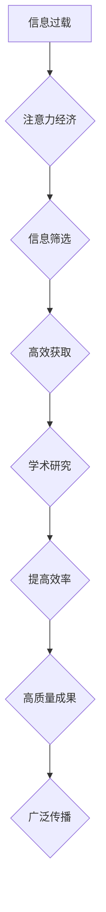

                 

## 1. 背景介绍

在当今信息爆炸的时代，人们面临着前所未有的信息过载。从新闻资讯到社交媒体，从学术论文到在线课程，信息无处不在，却难以有效获取和利用。在这种背景下，“注意力经济”应运而生，它强调了注意力作为一种稀缺资源的重要性，并探讨了如何有效地获取、分配和管理注意力。

学术研究作为人类知识进步的基石，也深受注意力经济的影响。传统学术研究模式往往依赖于大量的阅读和文献综述，而注意力经济的兴起则促使学者们思考如何更有效地利用注意力，提高研究效率和成果质量。

## 2. 核心概念与联系

### 2.1 注意力经济

注意力经济是指在信息过载的时代，注意力作为一种稀缺资源，被视为一种重要的经济要素。它强调了获取、分配和管理注意力的价值，并探讨了如何利用注意力来创造价值和推动经济发展。

### 2.2 学术研究

学术研究是指通过系统地收集、分析和解释信息，以拓展人类知识和解决实际问题的一种活动。它通常涉及文献综述、实验设计、数据分析和理论建构等环节。

### 2.3 联系

注意力经济对学术研究的影响主要体现在以下几个方面：

* **信息获取**: 学术研究需要大量的信息获取，而注意力经济强调了信息筛选和过滤的重要性。学者们需要更有效地获取和利用相关信息，避免信息过载和注意力分散。
* **研究效率**: 学术研究是一个耗时的过程，注意力经济促使学者们提高研究效率，更有效地利用时间和精力。
* **研究成果**: 学术研究的成果需要得到广泛的传播和认可，注意力经济强调了内容的吸引力和传播力。学者们需要思考如何将研究成果以更具吸引力和易于理解的方式呈现出来，以便更好地传播和影响。

**Mermaid 流程图**



## 3. 核心算法原理 & 具体操作步骤

### 3.1 算法原理概述

注意力机制是一种模仿人类注意力机制的机器学习算法，它能够学习到输入数据中哪些部分更重要，并对这些重要部分给予更多的关注。

### 3.2 算法步骤详解

1. **输入数据**: 将输入数据（例如文本、图像或音频）转换为数字表示。
2. **权重计算**: 使用注意力机制计算每个输入元素的权重，权重表示该元素的重要性。
3. **加权求和**: 根据计算出的权重，对输入元素进行加权求和，得到一个新的表示。
4. **输出**: 将加权求和后的结果作为输出，用于后续的机器学习任务。

### 3.3 算法优缺点

**优点**:

* **提高模型性能**: 注意力机制能够帮助模型更好地理解输入数据，从而提高模型的性能。
* **解释性强**: 注意力机制能够提供模型对输入数据的关注度，从而提高模型的解释性。
* **可扩展性强**: 注意力机制可以应用于各种机器学习任务，例如文本分类、机器翻译和图像识别。

**缺点**:

* **计算复杂度高**: 注意力机制的计算复杂度较高，需要更多的计算资源。
* **参数量大**: 注意力机制的参数量较大，需要更多的训练数据。

### 3.4 算法应用领域

注意力机制在学术研究领域有广泛的应用，例如：

* **文献综述**: 利用注意力机制自动识别和提取相关文献，提高文献综述的效率和准确性。
* **数据分析**: 利用注意力机制分析大规模数据，发现隐藏的模式和趋势。
* **知识图谱构建**: 利用注意力机制构建知识图谱，更好地理解和组织知识。

## 4. 数学模型和公式 & 详细讲解 & 举例说明

### 4.1 数学模型构建

注意力机制的核心是计算每个输入元素的权重。常用的注意力机制模型是基于softmax函数的注意力机制。

**公式**:

$$
\alpha_{i} = \frac{exp(e_{i})}{\sum_{j=1}^{n} exp(e_{j})}
$$

其中：

* $\alpha_{i}$ 是第 i 个输入元素的权重。
* $e_{i}$ 是第 i 个输入元素的得分。
* $n$ 是输入元素的总数。

### 4.2 公式推导过程

注意力机制的权重计算基于softmax函数，softmax函数将输入向量映射到一个概率分布，其中每个元素的概率值介于 0 和 1 之间，且所有元素的概率值之和等于 1。

**推导过程**:

1. 计算每个输入元素的得分 $e_{i}$，得分可以是通过一个神经网络或其他函数计算得到。
2. 将所有得分应用于softmax函数，得到每个输入元素的权重 $\alpha_{i}$。

### 4.3 案例分析与讲解

**举例**:

假设我们有一个句子 "我爱学习编程"，我们想使用注意力机制来计算每个单词的权重。

1. 可以使用一个神经网络来计算每个单词的得分，例如，将每个单词嵌入到一个向量空间中，然后计算向量之间的相似度。
2. 将所有单词的得分应用于softmax函数，得到每个单词的权重。

例如，如果 "学习" 的得分最高，那么它的权重就会最大，表示它在句子中最为重要。

## 5. 项目实践：代码实例和详细解释说明

### 5.1 开发环境搭建

* Python 3.6+
* TensorFlow 或 PyTorch

### 5.2 源代码详细实现

```python
import tensorflow as tf

# 定义注意力机制层
class AttentionLayer(tf.keras.layers.Layer):
    def __init__(self, units):
        super(AttentionLayer, self).__init__()
        self.W1 = tf.keras.layers.Dense(units)
        self.W2 = tf.keras.layers.Dense(units)
        self.V = tf.keras.layers.Dense(1)

    def call(self, inputs):
        # 计算每个输入元素的得分
        scores = self.V(tf.nn.tanh(self.W1(inputs) + self.W2(inputs)))
        # 计算每个输入元素的权重
        attention_weights = tf.nn.softmax(scores, axis=-1)
        # 对输入元素进行加权求和
        context_vector = tf.matmul(attention_weights, inputs)
        return context_vector

# 创建一个简单的注意力机制模型
model = tf.keras.Sequential([
    tf.keras.layers.Embedding(input_dim=10000, output_dim=128),
    AttentionLayer(units=64),
    tf.keras.layers.Dense(units=10, activation='softmax')
])

# 训练模型
model.compile(optimizer='adam', loss='sparse_categorical_crossentropy', metrics=['accuracy'])
model.fit(x_train, y_train, epochs=10)
```

### 5.3 代码解读与分析

* `AttentionLayer` 类定义了一个注意力机制层，它包含三个稠密层：`W1`、`W2` 和 `V`。
* `call` 方法计算每个输入元素的得分，然后使用 softmax 函数计算权重，最后对输入元素进行加权求和。
* `model` 是一个简单的注意力机制模型，它包含一个嵌入层、一个注意力机制层和一个全连接层。

### 5.4 运行结果展示

训练完成后，可以将模型应用于文本分类任务，并评估模型的性能。

## 6. 实际应用场景

### 6.1 学术文献综述

注意力机制可以用于自动识别和提取相关文献，提高文献综述的效率和准确性。例如，可以使用注意力机制来识别一篇论文中最重要的句子或段落，并将其作为综述的主要内容。

### 6.2 数据分析

注意力机制可以用于分析大规模数据，发现隐藏的模式和趋势。例如，可以使用注意力机制来分析一篇学术论文中的关键词，并识别出哪些关键词最为重要。

### 6.3 知识图谱构建

注意力机制可以用于构建知识图谱，更好地理解和组织知识。例如，可以使用注意力机制来识别两个概念之间的关系，并构建知识图谱中的链接。

### 6.4 未来应用展望

注意力机制在学术研究领域还有很大的发展潜力，未来可以应用于更多领域，例如：

* **自动生成研究论文**: 使用注意力机制自动生成研究论文的摘要、引言和结论。
* **智能问答**: 使用注意力机制构建智能问答系统，能够理解用户的自然语言问题，并给出准确的答案。
* **学术 plagiarism 检测**: 使用注意力机制检测学术剽窃，识别出抄袭的文本段落。

## 7. 工具和资源推荐

### 7.1 学习资源推荐

* **论文**: "Attention Is All You Need"
* **博客**: "Attention is All You Need: A Deep Dive"
* **在线课程**: Coursera 上的 "Deep Learning Specialization"

### 7.2 开发工具推荐

* **TensorFlow**: https://www.tensorflow.org/
* **PyTorch**: https://pytorch.org/

### 7.3 相关论文推荐

* "BERT: Pre-training of Deep Bidirectional Transformers for Language Understanding"
* "XLNet: Generalized Autoregressive Pretraining for Language Understanding"
* "T5: Text-to-Text Transfer Transformer"

## 8. 总结：未来发展趋势与挑战

### 8.1 研究成果总结

注意力机制在学术研究领域取得了显著的成果，提高了文献综述、数据分析和知识图谱构建的效率和准确性。

### 8.2 未来发展趋势

未来，注意力机制将在学术研究领域得到更广泛的应用，例如：自动生成研究论文、智能问答和学术 plagiarism 检测。

### 8.3 面临的挑战

* **计算复杂度**: 注意力机制的计算复杂度较高，需要更多的计算资源。
* **参数量大**: 注意力机制的参数量较大，需要更多的训练数据。
* **解释性**: 注意力机制的解释性仍然有限，需要进一步的研究。

### 8.4 研究展望

未来研究方向包括：

* 开发更有效的注意力机制算法，降低计算复杂度和参数量。
* 提高注意力机制的解释性，更好地理解模型的决策过程。
* 将注意力机制应用于更多学术研究领域，探索其更大的潜力。

## 9. 附录：常见问题与解答

### 9.1 什么是注意力机制？

注意力机制是一种模仿人类注意力机制的机器学习算法，它能够学习到输入数据中哪些部分更重要，并对这些重要部分给予更多的关注。

### 9.2 注意力机制的应用场景有哪些？

注意力机制在学术研究领域有广泛的应用，例如：文献综述、数据分析、知识图谱构建等。

### 9.3 注意力机制的优缺点是什么？

**优点**:

* 提高模型性能
* 解释性强
* 可扩展性强

**缺点**:

* 计算复杂度高
* 参数量大


作者：禅与计算机程序设计艺术 / Zen and the Art of Computer Programming 
<end_of_turn>

