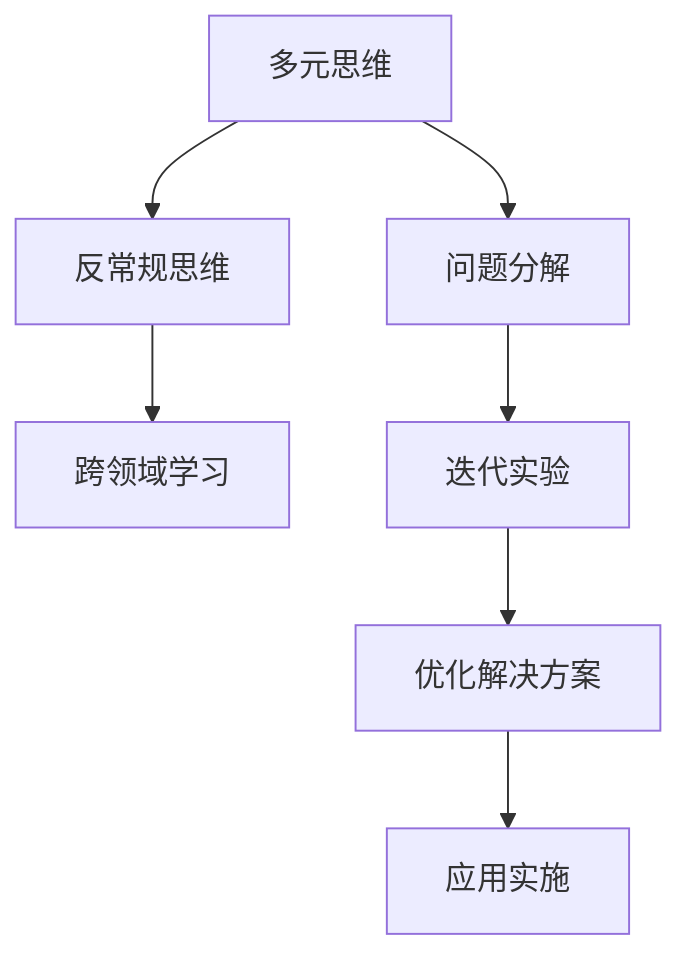

                 

# 创新思维：突破认知局限的方法

## 1. 背景介绍

### 1.1 问题由来
在信息爆炸的时代，技术的进步日新月异，旧有的认知和方法可能很快就会被淘汰。创新思维在技术发展中扮演了至关重要的角色。特别是在AI领域，创新思维不仅决定了技术的突破，也决定了AI技术的落地应用。但是，如何培养和激发创新思维，是一个复杂且富有挑战性的问题。本文将深入探讨创新思维的原理、方法和实践，希望能为读者提供一些启发和指导。

### 1.2 问题核心关键点
创新思维的核心理念是超越传统思维框架，突破认知局限，寻求新的解决方案。核心关键点包括：
1. **多元思维**：结合不同学科和领域的思维方式，综合分析问题。
2. **反常规思维**：挑战现有的理论、技术和社会框架，寻找新的方向。
3. **问题分解**：将复杂问题分解为小问题，逐一解决。
4. **跨领域学习**：学习跨学科的知识和方法，拓展视野。
5. **迭代实验**：通过反复实验和调整，逐步优化解决方案。

这些关键点共同构成了创新思维的基石，指导着技术突破和应用实践。

### 1.3 问题研究意义
在当前技术迅猛发展的背景下，创新思维成为了推动技术创新的重要动力。它不仅能带来技术的突破，还能提升企业的竞争力，推动社会的进步。研究创新思维的方法和实践，对于培养创新人才、提升技术水平具有重要意义。

## 2. 核心概念与联系

### 2.1 核心概念概述

为了更好地理解创新思维，我们将介绍几个核心概念及其相互关系：

- **多元思维**：结合不同学科和领域的思维方式，综合分析问题。
- **反常规思维**：挑战现有的理论、技术和社会框架，寻找新的方向。
- **问题分解**：将复杂问题分解为小问题，逐一解决。
- **跨领域学习**：学习跨学科的知识和方法，拓展视野。
- **迭代实验**：通过反复实验和调整，逐步优化解决方案。

这些概念之间存在紧密的联系，形成一个完整的创新思维框架。

### 2.2 核心概念原理和架构的 Mermaid 流程图



这个流程图展示了创新思维的核心概念及其相互关系。多元思维和反常规思维提供了创新的起点，问题分解和跨领域学习帮助找到新的角度和方法，迭代实验和优化解决方案确保了创新思路的可行性和实用性。

## 3. 核心算法原理 & 具体操作步骤

### 3.1 算法原理概述

创新思维的原理可以概括为“打破常规，重新组合”。在技术创新中，通常需要打破现有的技术框架和理论，寻找新的解决方案。这一过程可以分为以下几个步骤：

1. **理解问题**：深入理解问题的本质和背景，找到问题的核心和关键点。
2. **探索新思路**：结合不同领域的知识和经验，寻找新的方法和思路。
3. **实验验证**：通过实验和验证，逐步优化和调整新思路，最终形成可行的解决方案。

### 3.2 算法步骤详解

以下是创新思维在技术创新中的应用步骤：

1. **问题定义**：明确问题的定义和目标，识别问题中的关键要素。
2. **数据收集**：收集相关数据和信息，分析问题的背景和现状。
3. **多元思维**：结合不同学科和领域的思维方式，综合分析问题。
4. **反常规思维**：挑战现有的理论、技术和社会框架，寻找新的方向。
5. **问题分解**：将复杂问题分解为小问题，逐一解决。
6. **跨领域学习**：学习跨学科的知识和方法，拓展视野。
7. **迭代实验**：通过反复实验和调整，逐步优化解决方案。
8. **优化方案**：根据实验结果，优化和调整解决方案，形成最终的创新方案。

### 3.3 算法优缺点

创新思维的优点包括：

1. **灵活性高**：结合不同领域的知识和经验，能够灵活应对复杂问题。
2. **创新性强**：能够打破常规，找到新的方法和思路，带来技术突破。
3. **适应性强**：能够快速适应新的环境和需求，保持竞争力。

缺点包括：

1. **风险高**：创新过程中存在不确定性，可能导致失败。
2. **资源消耗大**：创新需要大量的资源和精力，成本较高。
3. **实施难度大**：创新方案可能需要跨越多个领域，实施难度较大。

### 3.4 算法应用领域

创新思维在技术创新中具有广泛的应用，包括但不限于以下几个领域：

1. **人工智能**：通过结合计算机科学、心理学和生物学等领域的知识，开发新的AI算法和模型。
2. **机器人学**：结合机械工程、计算机科学和认知科学，开发新的机器人系统和应用。
3. **生物医学**：结合生物信息学、分子生物学和医学影像学，开发新的诊断和治疗技术。
4. **可持续能源**：结合化学、物理学和工程学，开发新的能源技术和应用。
5. **金融科技**：结合数学、经济学和计算机科学，开发新的金融产品和应用。

这些领域中的创新思维，为技术突破和社会进步提供了重要动力。

## 4. 数学模型和公式 & 详细讲解 & 举例说明

### 4.1 数学模型构建

创新思维的数学模型可以基于以下几个关键要素构建：

1. **问题定义**：使用符号表示问题的核心要素和目标函数。
2. **假设条件**：定义问题的假设条件和约束条件。
3. **优化目标**：定义优化的目标函数，最小化或最大化某个指标。
4. **变量选择**：选择合适的变量和参数，用于表示问题和解法。
5. **求解算法**：选择合适的求解算法，求解优化问题。

### 4.2 公式推导过程

以一个简单的优化问题为例，其数学模型可以表示为：

$$
\begin{aligned}
&\min_{x} \quad f(x) \\
&\text{subject to} \quad g_i(x) \leq 0, i=1,\dots,m \\
&h_j(x) = 0, j=1,\dots,p
\end{aligned}
$$

其中 $x$ 为优化变量，$f(x)$ 为优化目标函数，$g_i(x)$ 为不等式约束条件，$h_j(x)$ 为等式约束条件。

### 4.3 案例分析与讲解

假设我们要设计一个高效能的AI算法，可以使用以下数学模型：

$$
\begin{aligned}
&\min_{\theta} \quad \frac{1}{2}\sum_{i=1}^n (y_i - f(x_i; \theta))^2 \\
&\text{subject to} \quad f(x_i; \theta) = \sum_{j=1}^p w_j \cdot g_j(x_i)
\end{aligned}
$$

其中 $\theta$ 为模型参数，$y_i$ 为标签，$x_i$ 为样本，$f(x_i; \theta)$ 为模型输出，$g_j(x_i)$ 为模型约束条件。通过求解上述优化问题，可以找到最优的模型参数 $\theta$，从而设计出高效能的AI算法。

## 5. 项目实践：代码实例和详细解释说明

### 5.1 开发环境搭建

为了进行创新思维的实践，需要搭建一个合适的开发环境。以下是一些建议：

1. **选择编程语言**：选择一种流行的编程语言，如Python，便于获取丰富的资源和工具。
2. **安装必要的库**：安装必要的编程库和工具，如NumPy、Pandas、Scikit-Learn等，方便数据处理和模型训练。
3. **配置开发工具**：配置开发工具，如IDE、版本控制系统等，提高开发效率。
4. **建立项目框架**：建立清晰的项目框架，包括数据预处理、模型训练、评估和部署等模块。

### 5.2 源代码详细实现

以下是一个简单的Python代码示例，用于实现一个基本的AI算法：

```python
import numpy as np
from sklearn.linear_model import LinearRegression

# 准备数据
X = np.array([[1, 2, 3], [4, 5, 6]])
y = np.array([3, 6, 9])

# 训练模型
model = LinearRegression()
model.fit(X, y)

# 预测新样本
new_X = np.array([[7, 8, 9]])
new_y = model.predict(new_X)

print("新样本预测结果：", new_y)
```

### 5.3 代码解读与分析

在上述代码中，我们使用了Python语言和Scikit-Learn库，构建了一个基本的线性回归模型。代码实现了模型的训练和预测功能。通过这个简单的例子，我们可以理解基本的数据处理和模型训练过程。

## 6. 实际应用场景

### 6.1 创新思维在AI领域的实践

AI领域的创新思维，带来了许多重要的技术突破。例如，AlphaGo通过结合深度学习、蒙特卡罗树搜索等技术，在围棋比赛中取得了历史性的胜利。

### 6.2 创新思维在金融科技中的应用

在金融科技领域，创新思维带来了许多重要的应用。例如，区块链技术的引入，使得数字货币交易变得更加安全、透明和高效。

### 6.3 创新思维在生物医学中的实践

在生物医学领域，创新思维推动了许多重要的技术进展。例如，CRISPR-Cas9基因编辑技术，通过结合生物学和工程学知识，实现了基因的精准编辑。

### 6.4 未来应用展望

未来，创新思维将在更多领域中发挥重要作用。例如，在可持续能源领域，通过结合物理学、化学和工程学知识，开发新的可再生能源技术，有助于实现碳中和目标。

## 7. 工具和资源推荐

### 7.1 学习资源推荐

为了帮助开发者系统掌握创新思维的原理和实践，这里推荐一些优质的学习资源：

1. **《创新思维》系列书籍**：深入浅出地介绍了创新思维的原理、方法和实践，适合不同层次的读者。
2. **Coursera《创新思维与设计思维》课程**：由知名大学的教授授课，涵盖了创新思维的多个方面，提供了丰富的案例和实践机会。
3. **TED演讲**：TED演讲中包含了许多关于创新思维的优秀案例和演讲，可以激发灵感和思考。
4. **创新思维工作坊**：参加创新思维工作坊，与同行交流和学习，提升创新能力。

### 7.2 开发工具推荐

为了提高创新思维的实践效率，以下是一些推荐的开发工具：

1. **Jupyter Notebook**：一个交互式的编程环境，方便进行数据处理和模型训练。
2. **Git版本控制系统**：便于团队协作和代码管理，确保版本控制和代码质量。
3. **DataRobot**：一个自动化的机器学习平台，提供强大的数据处理和模型训练功能。

### 7.3 相关论文推荐

为了深入理解创新思维的研究和实践，以下是一些推荐的相关论文：

1. **《创新思维的心理学基础》**：探讨了创新思维的心理学基础，理解其背后的认知过程。
2. **《设计思维与创新》**：介绍了设计思维的方法和工具，适用于创新思维的实践。
3. **《AI创新与颠覆性技术》**：探讨了AI技术在各个领域的创新和应用，提供了丰富的案例和思考。

## 8. 总结：未来发展趋势与挑战

### 8.1 研究成果总结

创新思维的研究已经取得了许多重要的成果，包括：

1. **创新心理学的研究**：理解创新思维的心理学基础，揭示其背后的认知过程。
2. **设计思维的应用**：通过设计思维的方法和工具，提升创新实践的效果。
3. **AI技术的创新**：通过结合不同学科的知识和经验，推动AI技术的突破和发展。

### 8.2 未来发展趋势

未来，创新思维将在以下几个方面继续发展：

1. **跨学科融合**：不同学科的交叉融合，带来更多的创新思维方法和工具。
2. **技术融合**：AI技术与其他技术（如区块链、量子计算等）的融合，推动更多领域的创新应用。
3. **社会融合**：创新思维与社会需求和技术环境的融合，带来更多的社会和经济价值。

### 8.3 面临的挑战

尽管创新思维在技术发展中具有重要作用，但也面临一些挑战：

1. **资源限制**：创新需要大量的资源和精力，可能难以实现。
2. **风险高**：创新过程中存在不确定性，可能导致失败。
3. **社会接受度**：创新思维可能会带来一些社会和伦理问题，需要慎重考虑。

### 8.4 研究展望

未来的研究需要在以下几个方面进行探索：

1. **跨学科融合**：加强不同学科的融合，开发新的创新思维方法和工具。
2. **社会伦理**：研究创新思维的社会和伦理影响，确保技术的可持续发展。
3. **实验验证**：通过实验验证和调整，优化创新思维的方法和过程。

## 9. 附录：常见问题与解答

**Q1：创新思维如何培养？**

A: 培养创新思维需要多方面的努力：
1. **拓宽知识面**：学习不同学科和领域的知识，拓展视野。
2. **跨领域合作**：与不同领域的专业人士合作，分享经验和知识。
3. **多角度思考**：从多个角度思考问题，避免单一思维局限。
4. **不断实验**：通过不断的实验和调整，优化解决方案。

**Q2：创新思维在实践中有哪些具体应用？**

A: 创新思维在实践中可以应用于多个方面，例如：
1. **产品设计**：通过创新思维，设计出更具创新性和用户价值的产品。
2. **项目管理**：通过创新思维，提高项目的灵活性和效率。
3. **团队管理**：通过创新思维，提升团队的创新能力和协作效果。

**Q3：创新思维与传统思维有何区别？**

A: 创新思维与传统思维的主要区别在于：
1. **思维方式**：创新思维更注重多元化和反常规的思维方式，传统思维更注重规则和程序。
2. **决策方式**：创新思维更注重灵活和适应性强的决策方式，传统思维更注重固定的决策流程。
3. **风险承担**：创新思维更愿意承担高风险，探索未知领域，传统思维更注重风险控制。

**Q4：创新思维在技术创新中有哪些具体方法？**

A: 创新思维在技术创新中可以应用以下具体方法：
1. **问题分解**：将复杂问题分解为小问题，逐一解决。
2. **跨领域学习**：结合不同学科的知识和方法，拓展视野。
3. **迭代实验**：通过反复实验和调整，逐步优化解决方案。
4. **优化方案**：根据实验结果，优化和调整解决方案，形成最终的创新方案。

**Q5：创新思维在技术创新中需要哪些资源？**

A: 创新思维在技术创新中需要以下资源：
1. **时间和精力**：创新需要大量的资源和精力，需要充分的时间和精力投入。
2. **数据和知识**：需要丰富的数据和知识，支持创新思维的实践。
3. **团队和协作**：需要多学科、多领域的专业人士协作，共同推动创新。

---

作者：禅与计算机程序设计艺术 / Zen and the Art of Computer Programming

