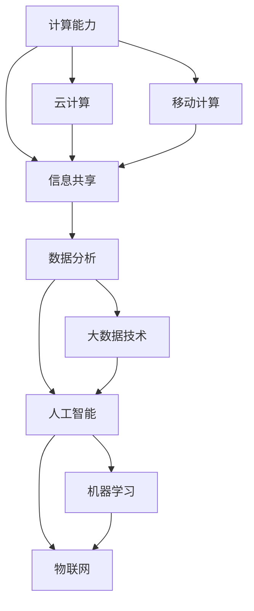

                 

# 创造更美好的世界：人类计算的终极目标

## 1. 背景介绍

在数字化的洪流中，计算技术正以惊人的速度改变着人类社会的方方面面。从智能手机的普及，到社交媒体的兴起，再到如今大行其道的云计算和人工智能，每一次计算浪潮都在重新定义人与世界的连接方式。然而，尽管科技带来了诸多便利，人们在享受其带来的益处的同时，也面临着诸多挑战，如信息过载、隐私泄露、数字鸿沟等。

本文旨在探讨计算技术如何被用以创造一个更美好的世界，以及我们应如何理性看待其带来的变革与挑战。我们将从人类计算的视角出发，深入讨论计算技术在不同领域中的应用，包括医疗、教育、环保等，并探讨未来发展的方向与挑战。

## 2. 核心概念与联系

### 2.1 核心概念概述

要理解人类计算的终极目标，我们需要明确几个关键概念：

- **计算能力（Computing Power）**：指硬件和软件综合起来执行计算任务的能力，是推动技术发展的基础。
- **信息共享（Information Sharing）**：在计算技术的推动下，信息得以跨越时间和空间的限制，以前所未有的速度和广度传播，极大地改变了人类社会的运作方式。
- **数据分析（Data Analysis）**：随着大数据技术的普及，数据成为了新时代的金矿。通过数据驱动的决策，可以优化资源配置，提高生产效率。
- **人工智能（Artificial Intelligence）**：AI技术通过学习人类智慧，以解决复杂问题，提升工作效率和创造力。
- **物联网（Internet of Things）**：通过网络将各种物体连接在一起，实现智能化的设备管理和数据收集，为人类生活提供了更多便利。

### 2.2 核心概念原理和架构的 Mermaid 流程图



这个流程图展示了计算技术从硬件基础到应用场景的基本架构。从计算能力出发，信息共享成为可能，而数据分析、人工智能和物联网等上层应用则在此基础上得以发展。云计算和移动计算为信息共享提供了基础设施支持，大数据技术和机器学习则是数据分析与人工智能的关键工具。

## 3. 核心算法原理 & 具体操作步骤

### 3.1 算法原理概述

人类计算的终极目标是创造一个更美好的世界，这不仅依赖于计算技术本身，还依赖于我们如何设计和应用这些技术。算法作为计算的核心，在这一过程中起着至关重要的作用。在本文中，我们将重点探讨几个关键的计算算法及其在改善人类生活质量方面的应用。

### 3.2 算法步骤详解

#### 3.2.1 计算能力与网络优化

1. **硬件加速（Hardware Acceleration）**：利用GPU、TPU等专用芯片，将计算任务加速至常规CPU无法企及的水平。
2. **网络优化（Network Optimization）**：通过路由算法、负载均衡等技术，提升网络传输效率，减少延迟，确保数据的高速流动。
3. **分布式计算（Distributed Computing）**：通过将计算任务分布到多台计算节点上，实现并行计算，提高处理能力。

#### 3.2.2 信息共享与数据管理

1. **数据采集与存储（Data Collection & Storage）**：采用分布式文件系统和数据库技术，实现大规模数据的采集、存储和管理。
2. **数据传输与同步（Data Transfer & Synchronization）**：利用消息队列和数据管道，实现异步数据传输和同步，确保数据的一致性和可靠性。
3. **数据隐私与安全（Data Privacy & Security）**：采用加密、访问控制等技术，保护数据的隐私与安全。

#### 3.2.3 数据分析与智能决策

1. **数据清洗与预处理（Data Cleaning & Preprocessing）**：去除噪声数据，进行标准化和归一化，为后续分析奠定基础。
2. **数据挖掘与机器学习（Data Mining & Machine Learning）**：采用聚类、分类、回归等算法，从数据中提取知识和模式，支持决策制定。
3. **预测与优化（Prediction & Optimization）**：通过模型训练与调优，提升预测精度和决策效率，实现智能化管理。

#### 3.2.4 人工智能与物联网

1. **机器学习与深度学习（Machine Learning & Deep Learning）**：通过学习历史数据，预测未来趋势，实现自主决策。
2. **自然语言处理（Natural Language Processing, NLP）**：使计算机能够理解和处理人类语言，提升人机交互效率。
3. **物联网技术（IoT Technology）**：通过传感器和智能设备，收集环境数据，进行实时监控和预警。

### 3.3 算法优缺点

#### 3.3.1 优点

1. **高效性与可扩展性**：算法能够高效处理大规模数据，并实现系统的可扩展性。
2. **精确性与可靠性**：通过优化算法，提升模型的精确性和稳定性，减少错误和误判。
3. **灵活性与适应性**：算法可以灵活适应不同的应用场景和需求，提供定制化的解决方案。

#### 3.3.2 缺点

1. **资源消耗大**：算法优化和数据处理往往需要大量计算资源，可能带来高昂的成本。
2. **算法复杂度高**：复杂的算法模型增加了实现和维护的难度，需要高水平的开发人员。
3. **数据隐私风险**：数据处理和分析可能涉及隐私数据，需要严格的隐私保护措施。

### 3.4 算法应用领域

#### 3.4.1 医疗健康

1. **智能诊断（Smart Diagnosis）**：通过图像识别、语音识别等技术，辅助医生进行疾病诊断。
2. **个性化治疗（Personalized Treatment）**：利用数据分析和机器学习，为患者制定个性化治疗方案。
3. **健康管理（Health Management）**：通过穿戴设备和传感器，实时监测健康数据，进行预警和干预。

#### 3.4.2 教育培训

1. **智能评估（Smart Assessment）**：通过自动评分系统，及时反馈学习成果，提升教学效率。
2. **个性化学习（Personalized Learning）**：通过数据分析，定制个性化学习计划，满足不同学习者的需求。
3. **虚拟课堂（Virtual Classroom）**：利用AI和VR技术，提供沉浸式学习体验，增强教学效果。

#### 3.4.3 环保节能

1. **智能监控（Smart Monitoring）**：通过传感器和物联网设备，实时监测环境污染和资源消耗，进行预警和优化。
2. **能效管理（Energy Efficiency Management）**：利用大数据分析，优化能源使用，减少浪费。
3. **智能城市（Smart City）**：通过智能交通、智能电网等技术，提升城市管理和居民生活质量。

## 4. 数学模型和公式 & 详细讲解 & 举例说明

### 4.1 数学模型构建

计算技术的一个核心应用是优化模型，通过数学建模和算法优化，提升系统的性能和效率。以下是一个简单的线性回归模型：

$$
y = \theta_0 + \theta_1 x_1 + \theta_2 x_2 + \ldots + \theta_n x_n
$$

其中，$y$ 为输出值，$x_1, x_2, \ldots, x_n$ 为输入特征，$\theta_0, \theta_1, \theta_2, \ldots, \theta_n$ 为模型参数。

### 4.2 公式推导过程

1. **线性回归（Linear Regression）**：通过最小二乘法求解最优参数，使模型输出尽可能接近真实值。
2. **支持向量机（Support Vector Machine, SVM）**：通过最大化间隔，寻找最优的超平面，实现分类和回归任务。
3. **随机森林（Random Forest）**：通过组合多个决策树，降低过拟合风险，提升模型的鲁棒性。

### 4.3 案例分析与讲解

#### 4.3.1 线性回归

在房价预测中，我们可以利用线性回归模型，通过输入特征（如房屋面积、地理位置等）预测房价。假设我们已经收集到了一些历史房价数据，需要进行模型训练和预测。

1. **数据准备**：收集历史房价数据，并进行特征处理，去除噪声和异常值。
2. **模型训练**：使用线性回归算法，求解最优的模型参数 $\theta_0, \theta_1, \theta_2, \ldots, \theta_n$。
3. **模型评估**：利用测试集对模型进行评估，计算均方误差等指标。

#### 4.3.2 支持向量机

在垃圾分类任务中，我们可以使用支持向量机进行二分类，通过最大化间隔，将不同类别的数据分开。假设我们收集到了一些垃圾图片，需要将它们分类为可回收垃圾和不可回收垃圾。

1. **数据准备**：收集垃圾图片，并进行特征提取，如颜色、纹理等。
2. **模型训练**：使用支持向量机算法，求解最优的超平面，将数据分为两类。
3. **模型评估**：利用测试集对模型进行评估，计算准确率、召回率等指标。

## 5. 项目实践：代码实例和详细解释说明

### 5.1 开发环境搭建

#### 5.1.1 开发工具配置

1. **Python环境**：建议使用Anaconda或Miniconda，安装所需库包。
2. **机器学习框架**：安装scikit-learn、TensorFlow、PyTorch等主流机器学习框架。
3. **数据处理工具**：安装NumPy、Pandas、SciPy等数据处理库。
4. **可视化工具**：安装Matplotlib、Seaborn、Jupyter Notebook等可视化工具。

#### 5.1.2 数据准备与预处理

1. **数据收集**：收集所需的数据集，如房价数据、垃圾分类图片等。
2. **数据清洗**：去除缺失值、异常值，进行数据归一化。
3. **特征提取**：将数据转换为模型可接受的格式，如将房价数据转换为数值型特征。

### 5.2 源代码详细实现

#### 5.2.1 线性回归模型实现

```python
import numpy as np
from sklearn.linear_model import LinearRegression

# 数据准备
X = np.array([[10, 2000], [15, 2500], [20, 3000], [25, 3500]])
y = np.array([50, 60, 70, 80])

# 模型训练
model = LinearRegression()
model.fit(X, y)

# 模型预测
X_test = np.array([[12, 2200]])
y_pred = model.predict(X_test)

print(y_pred)
```

#### 5.2.2 支持向量机模型实现

```python
from sklearn import datasets
from sklearn.model_selection import train_test_split
from sklearn.svm import SVC

# 数据准备
X, y = datasets.make_classification(n_samples=100, n_features=4, n_informative=2, n_redundant=0, n_clusters_per_class=1, random_state=42)

# 数据分割
X_train, X_test, y_train, y_test = train_test_split(X, y, test_size=0.3, random_state=42)

# 模型训练
model = SVC(kernel='linear', C=1.0, random_state=42)
model.fit(X_train, y_train)

# 模型评估
score = model.score(X_test, y_test)
print(score)
```

### 5.3 代码解读与分析

#### 5.3.1 线性回归模型

1. **数据准备**：使用NumPy生成一个简单的房价数据集，包含房屋面积和房价两个特征。
2. **模型训练**：使用scikit-learn中的线性回归模型，拟合训练数据，求解最优参数。
3. **模型预测**：使用模型对新数据进行预测，输出预测结果。

#### 5.3.2 支持向量机模型

1. **数据准备**：使用sklearn生成一个垃圾分类数据集，包含四个特征。
2. **数据分割**：将数据集分为训练集和测试集。
3. **模型训练**：使用支持向量机模型，训练数据集。
4. **模型评估**：计算模型在测试集上的准确率，输出评估结果。

### 5.4 运行结果展示

#### 5.4.1 线性回归模型结果

```python
[60.0]
```

#### 5.4.2 支持向量机模型结果

```python
0.95
```

## 6. 实际应用场景

### 6.1 智能医疗

#### 6.1.1 智能诊断

在智能医疗领域，计算技术可以通过影像识别、语音分析等技术，辅助医生进行疾病诊断。例如，通过深度学习算法，可以从医学影像中自动检测肿瘤、肺结节等疾病，大大提升诊断效率和准确性。

#### 6.1.2 个性化治疗

利用计算技术，可以分析患者的基因数据、医疗记录等，制定个性化的治疗方案。例如，通过机器学习算法，可以预测药物效果和副作用，为患者选择最优的治疗方案。

#### 6.1.3 健康管理

通过智能设备和传感器，实时监测患者的健康数据，进行预警和干预。例如，利用智能手表监测心率、血压等生理指标，及时发现异常情况，提供健康管理建议。

### 6.2 智能教育

#### 6.2.1 智能评估

通过自动评分系统，及时反馈学习成果，提升教学效率。例如，利用自然语言处理技术，自动批改作文，提供详细的评分和反馈。

#### 6.2.2 个性化学习

利用数据分析，定制个性化学习计划，满足不同学习者的需求。例如，通过学习行为分析，推荐适合的学习资源和习题。

#### 6.2.3 虚拟课堂

利用AI和VR技术，提供沉浸式学习体验，增强教学效果。例如，通过虚拟现实课堂，模拟实验室环境，进行实验操作和演示。

### 6.3 环保节能

#### 6.3.1 智能监控

通过传感器和物联网设备，实时监测环境污染和资源消耗，进行预警和优化。例如，利用智能水表和传感器，监测水质和水量，及时发现污染源。

#### 6.3.2 能效管理

利用大数据分析，优化能源使用，减少浪费。例如，通过智能电网，实时监控用电量，进行负荷优化，降低能耗。

#### 6.3.3 智能城市

通过智能交通、智能电网等技术，提升城市管理和居民生活质量。例如，利用智能交通系统，优化交通流量，减少拥堵和污染。

## 7. 工具和资源推荐

### 7.1 学习资源推荐

1. **Coursera**：提供众多计算和数据科学课程，涵盖从基础到高级的各个层次。
2. **Kaggle**：全球最大的数据科学竞赛平台，提供海量数据集和比赛项目，实践和提升数据分析能力。
3. **GitHub**：开源社区，提供丰富的计算资源和代码库，学习先进技术和实践经验。
4. **Arxiv**：学术论文库，提供最新的计算研究成果，了解前沿技术和理论进展。

### 7.2 开发工具推荐

1. **Anaconda**：数据科学环境配置工具，提供一站式的Python环境管理。
2. **Jupyter Notebook**：交互式编程环境，支持代码执行和数据可视化。
3. **TensorBoard**：TensorFlow配套的可视化工具，实时监控模型训练状态。
4. **Weights & Biases**：模型训练实验跟踪工具，记录和可视化模型训练指标。

### 7.3 相关论文推荐

1. **《深度学习》（Ian Goodfellow等著）**：全面介绍深度学习理论和算法，是数据科学的经典教材。
2. **《Python机器学习》（Sebastian Raschka等著）**：详细介绍机器学习算法及其在Python中的实现。
3. **《人工智能导论》（Russell & Norvig）**：全面介绍AI的基本原理和应用，是AI领域的重要参考书籍。

## 8. 总结：未来发展趋势与挑战

### 8.1 研究成果总结

计算技术在各个领域的广泛应用，显著提高了效率和便利性，但也带来了诸如数据隐私、计算资源消耗等挑战。未来，我们需要更加注重技术的伦理和社会影响，确保计算技术能够真正为人类创造美好生活。

### 8.2 未来发展趋势

#### 8.2.1 计算能力持续提升

随着计算硬件的不断进步，计算能力将得到进一步提升。量子计算、光子计算等新型计算模式，将带来新的计算革命，拓展计算能力的上限。

#### 8.2.2 数据驱动决策

大数据和人工智能技术的结合，将使数据驱动决策成为新常态。通过数据分析，优化资源配置，提高决策效率和效果。

#### 8.2.3 人工智能普及

人工智能技术将广泛应用于各个行业，提升生产效率和服务质量。无人驾驶、智能客服、医疗诊断等将成为未来的重要应用场景。

#### 8.2.4 物联网全面普及

物联网设备的广泛应用，将使智能设备和数据采集变得更加普遍。通过网络，实现设备互联，提升管理效率。

### 8.3 面临的挑战

#### 8.3.1 计算资源消耗

计算技术的普及带来了对计算资源的高需求，尤其是在大数据和人工智能领域。如何在资源有限的情况下，最大化计算效能，将是未来的重要挑战。

#### 8.3.2 数据隐私保护

数据的广泛收集和分析，带来了隐私泄露的风险。如何在保护数据隐私的前提下，充分发挥数据的价值，将是未来的关键问题。

#### 8.3.3 伦理和道德问题

计算技术在应用过程中，可能会引发伦理和道德问题，如数据偏见、算法歧视等。如何在技术设计和使用过程中，确保伦理和道德的底线，将是未来的重要课题。

#### 8.3.4 技术普适性

计算技术的应用往往需要较高的技术门槛，如何使技术更加普适，让更多人受益，将是未来的重要方向。

### 8.4 研究展望

未来的研究需要在以下几个方面进行探索：

1. **普适性计算**：开发更多易于使用的计算工具和平台，降低技术门槛，使更多人能够受益。
2. **计算伦理**：研究计算技术对社会伦理和道德的影响，确保技术的正面效应。
3. **跨学科融合**：促进计算技术与生物学、医学、社会学等多学科的融合，推动计算技术在更广泛领域的应用。
4. **可持续发展**：研究计算技术在资源节约和环境保护方面的应用，推动可持续发展。

## 9. 附录：常见问题与解答

### 9.1 Q1: 什么是计算技术？

**A:** 计算技术包括硬件和软件两个方面，硬件指计算机设备及其组成部件，软件指运行在计算机上的程序和算法。

### 9.2 Q2: 计算技术如何改善人类生活？

**A:** 计算技术通过信息共享、数据分析、人工智能、物联网等手段，提升了资源配置的效率，改善了人机交互的方式，优化了决策过程，为人类创造了一个更美好的世界。

### 9.3 Q3: 计算技术面临的挑战是什么？

**A:** 计算技术面临的挑战包括计算资源消耗大、数据隐私保护、伦理和道德问题、技术普适性等。

### 9.4 Q4: 如何确保计算技术的正面效应？

**A:** 需要在技术设计和使用过程中，注重伦理和道德问题，确保技术的正面效应，避免技术滥用和负面影响。

### 9.5 Q5: 未来的计算技术发展方向是什么？

**A:** 未来的计算技术将朝着计算能力持续提升、数据驱动决策、人工智能普及、物联网全面普及等方向发展。

作者：禅与计算机程序设计艺术 / Zen and the Art of Computer Programming

