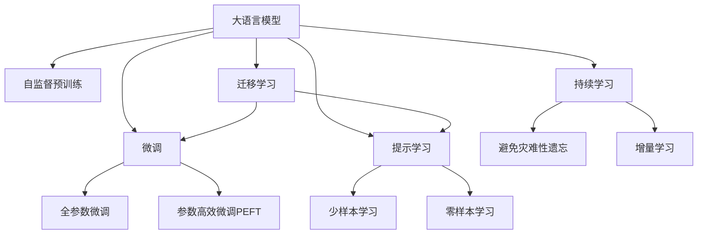

                 

# 初创企业加速器：LLM 赋能创新

> 关键词：初创企业,加速器,LLM,自然语言处理,NLP,创新,技术栈,人工智能,创业

## 1. 背景介绍

### 1.1 问题由来
随着人工智能技术的飞速发展，初创企业面临着前所未有的机遇与挑战。在这个数字化、智能化时代，初创企业需要快速把握最新技术动态，创新产品和服务，才能在激烈的市场竞争中脱颖而出。然而，传统的人工智能研发模式，如从头训练模型，往往耗时耗力，难以在短时间内完成从研究到落地。如何高效利用现有的人工智能成果，赋能企业创新，成为摆在初创企业面前的重要课题。

大语言模型（Large Language Model, LLM）以其在自然语言处理（NLP）领域的卓越表现，被广泛视为推动技术创新和商业成功的利器。LLM通过在大量无标签文本数据上进行自监督预训练，学习到了丰富的语言知识和语义表示，具备强大的语言理解和生成能力。对于初创企业而言，利用LLM赋能创新，既能够快速获得高水平的语言处理能力，又无需从头训练模型，极大提高了产品研发的速度和质量。

### 1.2 问题核心关键点
初创企业采用LLM赋能创新的关键点在于以下几点：

- 快速集成：初创企业需要快速部署LLM技术，实现从研究到应用的转化。
- 灵活定制：企业可以根据自身需求，定制化的调整模型架构和功能。
- 高效优化：企业需要在有限的资源下，高效的利用LLM技术，最大化其商业价值。
- 可解释性：企业需要了解LLM的工作机制，确保模型输出的可解释性。

## 2. 核心概念与联系

### 2.1 核心概念概述

为了更好地理解初创企业如何利用LLM赋能创新，本节将介绍几个关键概念：

- **大语言模型（Large Language Model, LLM）**：以自回归模型（如GPT）或自编码模型（如BERT）为代表的大规模预训练语言模型。通过在海量无标签文本数据上进行预训练，学习到语言的通用表示。
- **自监督预训练（Self-Supervised Pre-training）**：利用无标签数据，通过自监督学习任务（如掩码语言模型、次序预测等）训练语言模型。
- **微调（Fine-tuning）**：在预训练模型的基础上，使用下游任务的少量标注数据，通过有监督地训练来优化模型在该任务上的性能。
- **迁移学习（Transfer Learning）**：将一个领域学习到的知识，迁移应用到另一个不同但相关的领域的学习范式。
- **参数高效微调（Parameter-Efficient Fine-tuning, PEFT）**：只更新少量的模型参数，以提高微调效率，避免过拟合的方法。
- **提示学习（Prompt Learning）**：通过在输入文本中添加提示模板（Prompt Template），引导模型进行特定任务的推理和生成。
- **少样本学习（Few-shot Learning）**：在只有少量标注样本的情况下，模型能够快速适应新任务的学习方法。
- **零样本学习（Zero-shot Learning）**：在模型没有见过任何特定任务的训练样本的情况下，仅凭任务描述就能够执行新任务的能力。

这些核心概念之间的逻辑关系可以通过以下Mermaid流程图来展示：



这个流程图展示了大语言模型的核心概念及其之间的关系：

1. 大语言模型通过自监督预训练获得基础能力。
2. 微调是对预训练模型进行任务特定的优化，可以分为全参数微调和参数高效微调（PEFT）。
3. 提示学习是一种不更新模型参数的方法，可以实现少样本学习和零样本学习。
4. 迁移学习是连接预训练模型与下游任务的桥梁，可以通过微调或提示学习来实现。
5. 持续学习旨在使模型能够不断学习新知识，同时避免遗忘旧知识。

这些核心概念共同构成了大语言模型的学习和应用框架，使其能够在各种场景下发挥强大的语言理解和生成能力。通过理解这些核心概念，我们可以更好地把握大语言模型的工作原理和优化方向。

## 3. 核心算法原理 & 具体操作步骤

### 3.1 算法原理概述

初创企业采用LLM赋能创新的基础是大语言模型的微调（Fine-tuning）技术。微调的本质是将预训练的大语言模型当作初始化参数，通过有监督地训练来优化模型在特定任务上的性能。具体来说，微调过程包括以下几个步骤：

1. **数据准备**：收集下游任务的少量标注数据，划分为训练集、验证集和测试集。
2. **模型初始化**：选择合适的预训练语言模型作为初始化参数，如BERT、GPT等。
3. **任务适配层设计**：根据任务类型，在预训练模型的顶层设计合适的输出层和损失函数。
4. **超参数设置**：选择合适的优化算法及其参数，如AdamW、SGD等，设置学习率、批大小、迭代轮数等。
5. **模型训练**：使用标注数据集进行有监督训练，更新模型参数。
6. **模型评估**：在验证集上评估模型性能，避免过拟合。
7. **模型部署**：在测试集上测试模型，评估其在新数据上的性能。

### 3.2 算法步骤详解

以初创企业采用LLM进行文本分类任务为例，详细介绍微调过程：

**Step 1: 准备预训练模型和数据集**

1. 收集文本分类任务的数据集，包括训练集、验证集和测试集。
2. 选择合适的预训练语言模型，如BERT或GPT。

**Step 2: 添加任务适配层**

1. 根据文本分类任务，在预训练模型的顶层添加线性分类器。
2. 使用交叉熵损失函数计算模型输出与真实标签之间的差异。

**Step 3: 设置微调超参数**

1. 选择合适的优化算法，如AdamW或SGD，设置学习率、批大小、迭代轮数等。
2. 设置正则化技术，如L2正则、Dropout、Early Stopping等。

**Step 4: 执行梯度训练**

1. 将训练集数据分批次输入模型，前向传播计算损失函数。
2. 反向传播计算参数梯度，根据设定的优化算法和学习率更新模型参数。
3. 周期性在验证集上评估模型性能，根据性能指标决定是否触发Early Stopping。
4. 重复上述步骤直到满足预设的迭代轮数或Early Stopping条件。

**Step 5: 测试和部署**

1. 在测试集上评估微调后的模型性能，对比微调前后的精度提升。
2. 使用微调后的模型对新样本进行推理预测，集成到实际的应用系统中。
3. 持续收集新的数据，定期重新微调模型，以适应数据分布的变化。

### 3.3 算法优缺点

初创企业采用LLM赋能创新的优势和局限如下：

**优势**：

1. **快速集成**：利用预训练模型，企业可以快速集成LLM技术，避免从头训练模型的耗时耗力。
2. **灵活定制**：企业可以根据自身需求，定制化的调整模型架构和功能，满足特定应用场景。
3. **高效优化**：在有限资源下，通过参数高效微调等方法，最大化LLM技术的商业价值。
4. **强大的语言理解能力**：LLM在语言理解和生成方面表现优异，适用于多种NLP任务。

**局限**：

1. **数据依赖**：微调的效果很大程度上取决于标注数据的质量和数量，获取高质量标注数据的成本较高。
2. **迁移能力有限**：当目标任务与预训练数据的分布差异较大时，微调的性能提升有限。
3. **可解释性不足**：微调模型的决策过程缺乏可解释性，难以对其推理逻辑进行分析和调试。
4. **依赖技术栈**：初创企业需要具备一定的技术能力，才能高效使用LLM进行微调和部署。

尽管存在这些局限，但基于LLM的微调方法仍然是大语言模型应用的主流范式，初创企业可以充分利用其优点，克服局限，实现快速创新和商业成功。

### 3.4 算法应用领域

LLM微调技术在初创企业的多个领域得到了广泛应用，包括但不限于：

- **智能客服**：利用微调后的对话模型，构建智能客服系统，提升客户咨询体验和问题解决效率。
- **金融舆情监测**：使用微调后的文本分类和情感分析模型，监测金融舆情，辅助金融机构风险管理。
- **个性化推荐**：通过微调后的模型，实现个性化推荐系统，提升用户满意度和转化率。
- **医疗问答**：利用微调后的问答模型，构建医疗问答系统，辅助医生诊断和治疗决策。
- **教育辅助**：使用微调后的作业批改和知识推荐模型，提升教育质量和个性化学习体验。

除了上述这些经典应用外，LLM微调技术还在更多新兴领域不断拓展，如智慧城市治理、智能广告推荐、智能健康管理等，为初创企业提供了广阔的创新空间。

## 4. 数学模型和公式 & 详细讲解 & 举例说明

### 4.1 数学模型构建

假设预训练语言模型为 $M_{\theta}$，其中 $\theta$ 为预训练得到的模型参数。给定下游任务 $T$ 的标注数据集 $D=\{(x_i,y_i)\}_{i=1}^N, x_i \in \mathcal{X}, y_i \in \{0,1\}$，其中 $0$ 表示负类，$1$ 表示正类。

定义模型 $M_{\theta}$ 在输入 $x$ 上的输出为 $\hat{y}=M_{\theta}(x) \in [0,1]$，表示样本属于正类的概率。真实标签 $y \in \{0,1\}$。则二分类交叉熵损失函数定义为：

$$
\ell(M_{\theta}(x),y) = -[y\log \hat{y} + (1-y)\log (1-\hat{y})]
$$

将其代入经验风险公式，得：

$$
\mathcal{L}(\theta) = -\frac{1}{N}\sum_{i=1}^N [y_i\log M_{\theta}(x_i)+(1-y_i)\log(1-M_{\theta}(x_i))]
$$

在得到损失函数的梯度后，即可带入参数更新公式，完成模型的迭代优化。重复上述过程直至收敛，最终得到适应下游任务的最优模型参数 $\theta^*$。

### 4.2 公式推导过程

以下我们以二分类任务为例，推导交叉熵损失函数及其梯度的计算公式。

假设模型 $M_{\theta}$ 在输入 $x$ 上的输出为 $\hat{y}=M_{\theta}(x) \in [0,1]$，表示样本属于正类的概率。真实标签 $y \in \{0,1\}$。则二分类交叉熵损失函数定义为：

$$
\ell(M_{\theta}(x),y) = -[y\log \hat{y} + (1-y)\log (1-\hat{y})]
$$

将其代入经验风险公式，得：

$$
\mathcal{L}(\theta) = -\frac{1}{N}\sum_{i=1}^N [y_i\log M_{\theta}(x_i)+(1-y_i)\log(1-M_{\theta}(x_i))]
$$

根据链式法则，损失函数对参数 $\theta_k$ 的梯度为：

$$
\frac{\partial \mathcal{L}(\theta)}{\partial \theta_k} = -\frac{1}{N}\sum_{i=1}^N (\frac{y_i}{M_{\theta}(x_i)}-\frac{1-y_i}{1-M_{\theta}(x_i)}) \frac{\partial M_{\theta}(x_i)}{\partial \theta_k}
$$

其中 $\frac{\partial M_{\theta}(x_i)}{\partial \theta_k}$ 可进一步递归展开，利用自动微分技术完成计算。

在得到损失函数的梯度后，即可带入参数更新公式，完成模型的迭代优化。重复上述过程直至收敛，最终得到适应下游任务的最优模型参数 $\theta^*$。

## 5. 项目实践：代码实例和详细解释说明

### 5.1 开发环境搭建

在进行LLM微调实践前，我们需要准备好开发环境。以下是使用Python进行PyTorch开发的环境配置流程：

1. 安装Anaconda：从官网下载并安装Anaconda，用于创建独立的Python环境。

2. 创建并激活虚拟环境：
```bash
conda create -n pytorch-env python=3.8 
conda activate pytorch-env
```

3. 安装PyTorch：根据CUDA版本，从官网获取对应的安装命令。例如：
```bash
conda install pytorch torchvision torchaudio cudatoolkit=11.1 -c pytorch -c conda-forge
```

4. 安装Transformers库：
```bash
pip install transformers
```

5. 安装各类工具包：
```bash
pip install numpy pandas scikit-learn matplotlib tqdm jupyter notebook ipython
```

完成上述步骤后，即可在`pytorch-env`环境中开始微调实践。

### 5.2 源代码详细实现

下面我们以文本分类任务为例，给出使用Transformers库对BERT模型进行微调的PyTorch代码实现。

首先，定义文本分类任务的数据处理函数：

```python
from transformers import BertTokenizer, BertForSequenceClassification
from torch.utils.data import Dataset
import torch

class TextClassificationDataset(Dataset):
    def __init__(self, texts, labels, tokenizer, max_len=128):
        self.texts = texts
        self.labels = labels
        self.tokenizer = tokenizer
        self.max_len = max_len
        
    def __len__(self):
        return len(self.texts)
    
    def __getitem__(self, item):
        text = self.texts[item]
        label = self.labels[item]
        
        encoding = self.tokenizer(text, return_tensors='pt', max_length=self.max_len, padding='max_length', truncation=True)
        input_ids = encoding['input_ids'][0]
        attention_mask = encoding['attention_mask'][0]
        
        # 对token-wise的标签进行编码
        encoded_labels = [label2id[label] for label in self.labels] 
        encoded_labels.extend([label2id['O']] * (self.max_len - len(encoded_labels)))
        labels = torch.tensor(encoded_labels, dtype=torch.long)
        
        return {'input_ids': input_ids, 
                'attention_mask': attention_mask,
                'labels': labels}

# 标签与id的映射
label2id = {'O': 0, 'P': 1}
id2label = {v: k for k, v in label2id.items()}

# 创建dataset
tokenizer = BertTokenizer.from_pretrained('bert-base-cased')

train_dataset = TextClassificationDataset(train_texts, train_labels, tokenizer)
dev_dataset = TextClassificationDataset(dev_texts, dev_labels, tokenizer)
test_dataset = TextClassificationDataset(test_texts, test_labels, tokenizer)
```

然后，定义模型和优化器：

```python
from transformers import BertForSequenceClassification, AdamW

model = BertForSequenceClassification.from_pretrained('bert-base-cased', num_labels=len(label2id))

optimizer = AdamW(model.parameters(), lr=2e-5)
```

接着，定义训练和评估函数：

```python
from torch.utils.data import DataLoader
from tqdm import tqdm
from sklearn.metrics import classification_report

device = torch.device('cuda') if torch.cuda.is_available() else torch.device('cpu')
model.to(device)

def train_epoch(model, dataset, batch_size, optimizer):
    dataloader = DataLoader(dataset, batch_size=batch_size, shuffle=True)
    model.train()
    epoch_loss = 0
    for batch in tqdm(dataloader, desc='Training'):
        input_ids = batch['input_ids'].to(device)
        attention_mask = batch['attention_mask'].to(device)
        labels = batch['labels'].to(device)
        model.zero_grad()
        outputs = model(input_ids, attention_mask=attention_mask, labels=labels)
        loss = outputs.loss
        epoch_loss += loss.item()
        loss.backward()
        optimizer.step()
    return epoch_loss / len(dataloader)

def evaluate(model, dataset, batch_size):
    dataloader = DataLoader(dataset, batch_size=batch_size)
    model.eval()
    preds, labels = [], []
    with torch.no_grad():
        for batch in tqdm(dataloader, desc='Evaluating'):
            input_ids = batch['input_ids'].to(device)
            attention_mask = batch['attention_mask'].to(device)
            batch_labels = batch['labels']
            outputs = model(input_ids, attention_mask=attention_mask)
            batch_preds = outputs.logits.argmax(dim=2).to('cpu').tolist()
            batch_labels = batch_labels.to('cpu').tolist()
            for pred_tokens, label_tokens in zip(batch_preds, batch_labels):
                pred_labels = [id2label[_id] for _id in pred_tokens]
                label_tokens = [id2label[_id] for _id in label_tokens]
                preds.append(pred_labels[:len(label_tokens)])
                labels.append(label_tokens)
                
    print(classification_report(labels, preds))
```

最后，启动训练流程并在测试集上评估：

```python
epochs = 5
batch_size = 16

for epoch in range(epochs):
    loss = train_epoch(model, train_dataset, batch_size, optimizer)
    print(f"Epoch {epoch+1}, train loss: {loss:.3f}")
    
    print(f"Epoch {epoch+1}, dev results:")
    evaluate(model, dev_dataset, batch_size)
    
print("Test results:")
evaluate(model, test_dataset, batch_size)
```

以上就是使用PyTorch对BERT进行文本分类任务微调的完整代码实现。可以看到，得益于Transformers库的强大封装，我们可以用相对简洁的代码完成BERT模型的加载和微调。

### 5.3 代码解读与分析

让我们再详细解读一下关键代码的实现细节：

**TextClassificationDataset类**：
- `__init__`方法：初始化文本、标签、分词器等关键组件。
- `__len__`方法：返回数据集的样本数量。
- `__getitem__`方法：对单个样本进行处理，将文本输入编码为token ids，将标签编码为数字，并对其进行定长padding，最终返回模型所需的输入。

**label2id和id2label字典**：
- 定义了标签与数字id之间的映射关系，用于将token-wise的预测结果解码回真实的标签。

**训练和评估函数**：
- 使用PyTorch的DataLoader对数据集进行批次化加载，供模型训练和推理使用。
- 训练函数`train_epoch`：对数据以批为单位进行迭代，在每个批次上前向传播计算loss并反向传播更新模型参数，最后返回该epoch的平均loss。
- 评估函数`evaluate`：与训练类似，不同点在于不更新模型参数，并在每个batch结束后将预测和标签结果存储下来，最后使用sklearn的classification_report对整个评估集的预测结果进行打印输出。

**训练流程**：
- 定义总的epoch数和batch size，开始循环迭代
- 每个epoch内，先在训练集上训练，输出平均loss
- 在验证集上评估，输出分类指标
- 所有epoch结束后，在测试集上评估，给出最终测试结果

可以看到，PyTorch配合Transformers库使得BERT微调的代码实现变得简洁高效。开发者可以将更多精力放在数据处理、模型改进等高层逻辑上，而不必过多关注底层的实现细节。

当然，工业级的系统实现还需考虑更多因素，如模型的保存和部署、超参数的自动搜索、更灵活的任务适配层等。但核心的微调范式基本与此类似。

## 6. 实际应用场景

### 6.1 智能客服系统

利用LLM微调技术，初创企业可以快速构建智能客服系统，提供7x24小时不间断服务，快速响应客户咨询，提升客户体验。通过微调BERT等预训练模型，模型能够自动理解客户意图，匹配最合适的答案模板进行回复。对于客户提出的新问题，还可以接入检索系统实时搜索相关内容，动态组织生成回答。如此构建的智能客服系统，能大幅提升客户咨询体验和问题解决效率。

### 6.2 金融舆情监测

初创企业在金融领域应用LLM微调技术，可以实时监测市场舆论动向，快速响应负面信息传播，规避金融风险。通过微调BERT等模型，模型能够自动判断文本属于何种主题，情感倾向是正面、中性还是负面。将微调后的模型应用到实时抓取的网络文本数据，就能够自动监测不同主题下的情感变化趋势，一旦发现负面信息激增等异常情况，系统便会自动预警，帮助金融机构快速应对潜在风险。

### 6.3 个性化推荐系统

在推荐系统中，初创企业可以借助LLM微调技术，实现个性化推荐。通过微调BERT等模型，模型能够从文本内容中准确把握用户的兴趣点。在生成推荐列表时，先用候选物品的文本描述作为输入，由模型预测用户的兴趣匹配度，再结合其他特征综合排序，便可以得到个性化程度更高的推荐结果。

### 6.4 未来应用展望

随着LLM微调技术的发展，初创企业可以借助大语言模型的强大能力，在更多领域实现创新。未来，基于LLM微调的应用场景可能包括：

- **智慧医疗**：利用微调模型进行医疗问答、病历分析、药物研发等，提升医疗服务的智能化水平，辅助医生诊疗，加速新药开发进程。
- **智能教育**：使用微调后的作业批改、学情分析、知识推荐模型，提升教育质量和个性化学习体验。
- **智慧城市治理**：使用微调后的城市事件监测、舆情分析、应急指挥模型，提高城市管理的自动化和智能化水平，构建更安全、高效的未来城市。
- **智能广告推荐**：利用微调模型进行广告内容生成、效果评估等，提升广告投放的精准度和转化率。
- **智能健康管理**：使用微调模型进行健康数据分析、个性化健康建议等，提升个人健康管理水平。

以上应用场景只是冰山一角，随着LLM微调技术的不断进步，其在初创企业的落地应用将更加广泛和深入。

## 7. 工具和资源推荐

### 7.1 学习资源推荐

为了帮助开发者系统掌握LLM微调的理论基础和实践技巧，这里推荐一些优质的学习资源：

1. **《Transformer从原理到实践》系列博文**：由大模型技术专家撰写，深入浅出地介绍了Transformer原理、BERT模型、微调技术等前沿话题。

2. **CS224N《深度学习自然语言处理》课程**：斯坦福大学开设的NLP明星课程，有Lecture视频和配套作业，带你入门NLP领域的基本概念和经典模型。

3. **《Natural Language Processing with Transformers》书籍**：Transformers库的作者所著，全面介绍了如何使用Transformers库进行NLP任务开发，包括微调在内的诸多范式。

4. **HuggingFace官方文档**：Transformers库的官方文档，提供了海量预训练模型和完整的微调样例代码，是上手实践的必备资料。

5. **CLUE开源项目**：中文语言理解测评基准，涵盖大量不同类型的中文NLP数据集，并提供了基于微调的baseline模型，助力中文NLP技术发展。

通过对这些资源的学习实践，相信你一定能够快速掌握LLM微调的精髓，并用于解决实际的NLP问题。

### 7.2 开发工具推荐

高效的开发离不开优秀的工具支持。以下是几款用于LLM微调开发的常用工具：

1. **PyTorch**：基于Python的开源深度学习框架，灵活动态的计算图，适合快速迭代研究。大部分预训练语言模型都有PyTorch版本的实现。

2. **TensorFlow**：由Google主导开发的开源深度学习框架，生产部署方便，适合大规模工程应用。同样有丰富的预训练语言模型资源。

3. **Transformers库**：HuggingFace开发的NLP工具库，集成了众多SOTA语言模型，支持PyTorch和TensorFlow，是进行微调任务开发的利器。

4. **Weights & Biases**：模型训练的实验跟踪工具，可以记录和可视化模型训练过程中的各项指标，方便对比和调优。与主流深度学习框架无缝集成。

5. **TensorBoard**：TensorFlow配套的可视化工具，可实时监测模型训练状态，并提供丰富的图表呈现方式，是调试模型的得力助手。

6. **Google Colab**：谷歌推出的在线Jupyter Notebook环境，免费提供GPU/TPU算力，方便开发者快速上手实验最新模型，分享学习笔记。

合理利用这些工具，可以显著提升LLM微调任务的开发效率，加快创新迭代的步伐。

### 7.3 相关论文推荐

LLM微调技术的发展源于学界的持续研究。以下是几篇奠基性的相关论文，推荐阅读：

1. **Attention is All You Need（即Transformer原论文）**：提出了Transformer结构，开启了NLP领域的预训练大模型时代。

2. **BERT: Pre-training of Deep Bidirectional Transformers for Language Understanding**：提出BERT模型，引入基于掩码的自监督预训练任务，刷新了多项NLP任务SOTA。

3. **Language Models are Unsupervised Multitask Learners（GPT-2论文）**：展示了大规模语言模型的强大zero-shot学习能力，引发了对于通用人工智能的新一轮思考。

4. **Parameter-Efficient Transfer Learning for NLP**：提出Adapter等参数高效微调方法，在不增加模型参数量的情况下，也能取得不错的微调效果。

5. **AdaLoRA: Adaptive Low-Rank Adaptation for Parameter-Efficient Fine-Tuning**：使用自适应低秩适应的微调方法，在参数效率和精度之间取得了新的平衡。

这些论文代表了大语言模型微调技术的发展脉络。通过学习这些前沿成果，可以帮助研究者把握学科前进方向，激发更多的创新灵感。

## 8. 总结：未来发展趋势与挑战

### 8.1 总结

本文对初创企业采用LLM微调技术进行了全面系统的介绍。首先阐述了初创企业面临的机遇与挑战，明确了利用LLM微调技术的优势和局限。其次，从原理到实践，详细讲解了初创企业如何利用LLM微调技术进行创新，给出了微调任务开发的完整代码实例。同时，本文还广泛探讨了LLM微调技术在智能客服、金融舆情、个性化推荐等多个行业领域的应用前景，展示了微调范式的巨大潜力。此外，本文精选了微调技术的各类学习资源，力求为读者提供全方位的技术指引。

通过本文的系统梳理，可以看到，基于LLM微调技术，初创企业可以高效利用现有的人工智能成果，快速迭代产品和服务，实现从研究到应用的转化。LLM微调技术为初创企业提供了快速创新和商业成功的有力工具。未来，伴随LLM微调技术的不断演进，初创企业将在更多领域实现突破，为人工智能技术的普及和应用注入新的活力。

### 8.2 未来发展趋势

展望未来，初创企业采用LLM微调技术的发展将呈现以下几个趋势：

1. **模型规模持续增大**：随着算力成本的下降和数据规模的扩张，预训练语言模型的参数量还将持续增长。超大规模语言模型蕴含的丰富语言知识，有望支撑更加复杂多变的下游任务微调。

2. **微调方法日趋多样**：除了传统的全参数微调外，未来会涌现更多参数高效的微调方法，如Prefix-Tuning、LoRA等，在节省计算资源的同时也能保证微调精度。

3. **持续学习成为常态**：随着数据分布的不断变化，微调模型也需要持续学习新知识以保持性能。如何在不遗忘原有知识的同时，高效吸收新样本信息，将成为重要的研究课题。

4. **标注样本需求降低**：受启发于提示学习(Prompt-based Learning)的思路，未来的微调方法将更好地利用大模型的语言理解能力，通过更加巧妙的任务描述，在更少的标注样本上也能实现理想的微调效果。

5. **多模态微调崛起**：当前的微调主要聚焦于纯文本数据，未来会进一步拓展到图像、视频、语音等多模态数据微调。多模态信息的融合，将显著提升语言模型对现实世界的理解和建模能力。

6. **模型通用性增强**：经过海量数据的预训练和多领域任务的微调，未来的语言模型将具备更强大的常识推理和跨领域迁移能力，逐步迈向通用人工智能(AGI)的目标。

以上趋势凸显了LLM微调技术的广阔前景。这些方向的探索发展，必将进一步提升初创企业的产品研发速度和质量，为人工智能技术在垂直行业的规模化落地提供坚实基础。

### 8.3 面临的挑战

尽管LLM微调技术已经取得了瞩目成就，但在迈向更加智能化、普适化应用的过程中，它仍面临着诸多挑战：

1. **标注成本瓶颈**：微调的效果很大程度上取决于标注数据的质量和数量，获取高质量标注数据的成本较高。如何进一步降低微调对标注样本的依赖，将是一大难题。

2. **模型鲁棒性不足**：当前微调模型面对域外数据时，泛化性能往往大打折扣。对于测试样本的微小扰动，微调模型的预测也容易发生波动。如何提高微调模型的鲁棒性，避免灾难性遗忘，还需要更多理论和实践的积累。

3. **推理效率有待提高**：大规模语言模型虽然精度高，但在实际部署时往往面临推理速度慢、内存占用大等效率问题。如何在保证性能的同时，简化模型结构，提升推理速度，优化资源占用，将是重要的优化方向。

4. **可解释性亟需加强**：当前微调模型更像是"黑盒"系统，难以解释其内部工作机制和决策逻辑。对于医疗、金融等高风险应用，算法的可解释性和可审计性尤为重要。如何赋予微调模型更强的可解释性，将是亟待攻克的难题。

5. **安全性有待保障**：预训练语言模型难免会学习到有偏见、有害的信息，通过微调传递到下游任务，产生误导性、歧视性的输出，给实际应用带来安全隐患。如何从数据和算法层面消除模型偏见，避免恶意用途，确保输出的安全性，也将是重要的研究课题。

6. **知识整合能力不足**：现有的微调模型往往局限于任务内数据，难以灵活吸收和运用更广泛的先验知识。如何让微调过程更好地与外部知识库、规则库等专家知识结合，形成更加全面、准确的信息整合能力，还有很大的想象空间。

正视LLM微调面临的这些挑战，积极应对并寻求突破，将是大语言模型微调走向成熟的必由之路。相信随着学界和产业界的共同努力，这些挑战终将一一被克服，初创企业采用LLM微调技术将迈向新的高度，为人工智能技术的普及和应用注入新的活力。

### 8.4 研究展望

面对初创企业采用LLM微调所面临的种种挑战，未来的研究需要在以下几个方面寻求新的突破：

1. **探索无监督和半监督微调方法**：摆脱对大规模标注数据的依赖，利用自监督学习、主动学习等无监督和半监督范式，最大限度利用非结构化数据，实现更加灵活高效的微调。

2. **研究参数高效和计算高效的微调范式**：开发更加参数高效的微调方法，在固定大部分预训练参数的同时，只更新极少量的任务相关参数。同时优化微调模型的计算图，减少前向传播和反向传播的资源消耗，实现更加轻量级、实时性的部署。

3. **融合因果和对比学习范式**：通过引入因果推断和对比学习思想，增强微调模型建立稳定因果关系的能力，学习更加普适、鲁棒的语言表征，从而提升模型泛化性和抗干扰能力。

4. **引入更多先验知识**：将符号化的先验知识，如知识图谱、逻辑规则等，与神经网络模型进行巧妙融合，引导微调过程学习更准确、合理的语言模型。同时加强不同模态数据的整合，实现视觉、语音等多模态信息与文本信息的协同建模。

5. **结合因果分析和博弈论工具**：将因果分析方法引入微调模型，识别出模型决策的关键特征，增强输出解释的因果性和逻辑性。借助博弈论工具刻画人机交互过程，主动探索并规避模型的脆弱点，提高系统稳定性。

6. **纳入伦理道德约束**：在模型训练目标中引入伦理导向的评估指标，过滤和惩罚有偏见、有害的输出倾向。同时加强人工干预和审核，建立模型行为的监管机制，确保输出符合人类价值观和伦理道德。

这些研究方向的探索，必将引领初创企业采用LLM微调技术迈向更高的台阶，为构建安全、可靠、可解释、可控的智能系统铺平道路。面向未来，初创企业需要勇于创新、敢于突破，才能不断拓展语言模型的边界，让智能技术更好地造福人类社会。

## 9. 附录：常见问题与解答

**Q1：初创企业如何选择合适的预训练模型？**

A: 初创企业在选择预训练模型时，需要考虑以下几个因素：
1. **任务适用性**：选择与任务类型和数据分布相匹配的预训练模型，如BERT适用于文本分类，GPT适用于生成任务。
2. **计算资源**：根据自身计算资源和部署环境，选择合适大小的模型，避免资源不足或浪费。
3. **社区支持**：选择具有广泛社区支持和文档资料的预训练模型，便于快速上手和问题解决。
4. **性能表现**：通过基准测试对比不同预训练模型的性能，选择效果最好的模型。

**Q2：微调过程中如何避免过拟合？**

A: 避免过拟合是微调过程中的关键问题，以下是一些常用的方法：
1. **数据增强**：通过回译、近义替换等方式扩充训练集。
2. **正则化**：使用L2正则、Dropout、Early Stopping等技术。
3. **对抗训练**：引入对抗样本，提高模型鲁棒性。
4. **参数高效微调**：只调整少量参数，减小过拟合风险。
5. **多模型集成**：训练多个微调模型，取平均输出，抑制过拟合。

这些方法需要根据具体任务和数据特点进行灵活组合，在实践中不断调整和优化。

**Q3：如何评估微调模型的性能？**

A: 评估微调模型性能通常使用以下指标：
1. **精度**：分类任务中使用准确率、精确率、召回率等指标评估模型分类性能。
2. **F1分数**：综合考虑精确率和召回率，适用于样本不平衡的情况。
3. **ROC曲线和AUC**：绘制受试者工作特征曲线，评估模型在不同阈值下的性能。
4. **BLEU、ROUGE等指标**：适用于机器翻译、摘要等生成任务，评估模型生成的文本质量。
5. **时间效率**：计算模型推理速度、内存占用等指标，评估模型在实际应用中的效率。

通过以上指标，初创企业可以全面评估微调模型的性能，优化模型设计，提升应用效果。

**Q4：如何处理文本分类中的类别不平衡问题？**

A: 文本分类任务中，类别不平衡问题是一个常见挑战，以下是一些处理方法：
1. **重采样**：通过过采样或欠采样方法，平衡各类别的样本数量。
2. **类别权重调整**：在损失函数中加入类别权重，使得训练时更关注少数类别的样本。
3. **生成对抗网络**：使用生成对抗网络生成合成样本，增加少数类别的样本数量。
4. **集成学习**：使用多个微调模型，综合不同模型的预测结果，提高模型的鲁棒性。

这些方法需要根据具体情况选择和组合，以平衡类别不平衡问题，提升模型性能。

**Q5：如何在多模态数据上进行微调？**

A: 多模态数据上的微调需要考虑不同数据源之间的协同作用，以下是一些方法：
1. **联合训练**：将不同模态的数据同时输入模型进行联合训练，提高模型的多模态融合能力。
2. **跨模态迁移**：利用多模态数据的预训练模型，在不同模态之间进行迁移学习，提高模型对多模态数据的泛化能力。
3. **多模态特征提取**：使用多模态特征提取方法，将不同模态的数据转换为统一的表示，再进行微调。

通过以上方法，初创企业可以更好地利用多模态数据，提高微调模型的性能和适用性。

**Q6：如何处理微调模型中的灾难性遗忘问题？**

A: 灾难性遗忘是指模型在新任务上学习时，忘记之前学到的知识。以下是一些处理灾难性遗忘的方法：
1. **知识蒸馏**：使用预训练模型作为教师，微调模型作为学生，从预训练模型中学习知识。
2. **多任务学习**：同时训练多个相关任务，使得模型能够在多个任务之间共享知识，避免遗忘。
3. **小批量微调**：在微调过程中，使用小批量数据进行更新，逐步加入新知识，避免对旧知识的遗忘。
4. **后训练微调**：先使用预训练模型进行初步训练，再使用少量标注数据进行微调，保留旧知识的记忆。

这些方法可以综合使用，帮助初创企业构建具有长期记忆能力的微调模型，提升模型的稳定性和性能。

**Q7：如何优化微调模型的推理速度？**

A: 微调模型的推理速度优化需要考虑多个因素，以下是一些方法：
1. **模型压缩**：使用模型压缩技术，如剪枝、量化、蒸馏等，减小模型大小和计算量。
2. **推理优化**：使用推理优化工具，如TensorRT、ONNX Runtime等，加速模型的推理过程。
3. **硬件加速**：利用GPU、TPU等硬件加速器，提高模型的计算效率。
4. **模型并行**：使用模型并行技术，如数据并行、模型并行等，提高模型的计算速度。

通过以上方法，初创企业可以显著提升微调模型的推理速度，提高应用的响应时间和用户体验。

**Q8：如何确保微调模型的可解释性？**

A: 确保微调模型的可解释性对于高风险应用尤为重要，以下是一些方法：
1. **解释工具**：使用解释工具，如LIME、SHAP等，分析模型输入和输出的关系，解释模型的决策过程。
2. **可视化**：使用可视化工具，如TensorBoard、WEKA等，可视化模型的训练过程和性能指标，帮助理解模型行为。
3. **知识图谱**：结合知识图谱等先验知识，解释模型对知识的应用情况，增强模型的可解释性。

通过以上方法，初创企业可以更好地理解微调模型的内部机制，增强其透明性和可信度。

