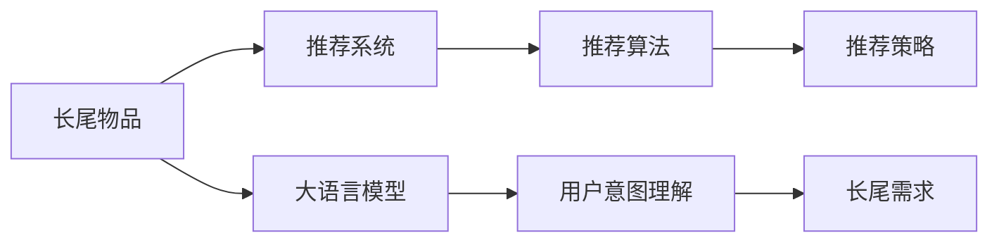

                 

# 利用LLM优化推荐系统的长尾物品发现

> 关键词：长尾物品, 推荐系统, 语义理解, 自然语言处理, 长尾需求, 用户意图, 推荐算法

## 1. 背景介绍

### 1.1 问题由来

在当前的电商、媒体、社交平台等推荐系统中，长尾物品（long-tail items）的发现和推荐日益成为一大挑战。长尾物品通常指那些销量较少，但具有特定需求的商品或内容。由于长尾物品数量庞大、分布广泛，它们在推荐系统中往往被忽视或忽视，无法满足用户多样化和个性化需求。

长尾物品的推荐对于电商、内容提供商、服务供应商等平台来说，具有重要的商业价值。在电商领域，长尾物品是提高用户粘性、提升购物体验的重要来源。在内容分发平台，长尾内容有助于扩大平台内容丰富度、提升用户体验。因此，如何高效地识别和推荐长尾物品，成为了一个重要的研究课题。

### 1.2 问题核心关键点

在推荐系统中发现长尾物品，一般需要解决以下几个核心问题：
- **长尾物品识别**：从海量物品库中筛选出销量低但需求稳定的长尾物品。
- **用户意图理解**：通过用户的历史行为、搜索记录、社交互动等信息，理解用户的潜在需求。
- **长尾物品推荐**：将长尾物品推荐给具有潜在需求的用户，提升用户满意度和平台的业绩。

长尾物品推荐的技术难点在于：
- 数据稀疏性：长尾物品的销量和用户评价数据通常较少，难以建立有效的推荐模型。
- 用户需求多样性：用户需求具有高度的个性化和多样性，单一的推荐策略难以满足所有用户的需求。
- 推荐策略复杂性：推荐策略需要同时考虑用户历史行为、当前需求、长尾物品特征等多方面因素。

## 2. 核心概念与联系

### 2.1 核心概念概述

为了解决长尾物品推荐的问题，本文将探讨利用大语言模型（Large Language Models, LLMs）进行推荐系统优化的新方法。我们首先定义几个关键概念：

- **长尾物品**：指在销售或访问中销量低但具有特定需求的商品或内容。例如，某些特定品牌、型号的产品，或某些小众的书籍、音乐、电影等。
- **推荐系统**：利用用户历史行为、商品属性、用户意图等信息，自动为用户推荐可能感兴趣的物品或内容的系统。常见的推荐算法包括协同过滤、基于内容的推荐、深度学习推荐等。
- **大语言模型**：指通过大规模无标签文本数据预训练得到的模型，具备强大的自然语言理解和生成能力。例如，GPT-3、BERT、T5等。
- **用户意图理解**：指通过自然语言处理（NLP）技术，理解用户输入的自然语言，预测其潜在需求或行为。
- **长尾需求**：指用户对长尾物品的需求，具有高度的个性化和多样化，难以通过传统推荐算法准确发现和满足。

这些概念之间的逻辑关系可以通过以下Mermaid流程图来展示：



这个流程图展示了长尾物品、推荐系统、大语言模型、用户意图理解和长尾需求之间的关系：

1. 长尾物品是大语言模型的输入，用于训练和优化推荐策略。
2. 大语言模型通过用户意图理解，生成对长尾物品的推荐策略。
3. 推荐系统使用推荐策略，将长尾物品推荐给有需求的用户。

### 2.2 核心概念原理和架构的 Mermaid 流程图


这个流程图展示了推荐系统处理用户历史行为数据，通过协同过滤算法筛选长尾物品库，并使用大语言模型进行长尾需求预测，最终生成推荐结果的架构。

## 3. 核心算法原理 & 具体操作步骤

### 3.1 算法原理概述

本文将探讨一种基于大语言模型的长尾物品推荐方法，该方法通过用户意图理解，生成针对长尾物品的推荐策略。其核心思想是：利用大语言模型的语义理解能力，分析用户输入的自然语言，预测用户对长尾物品的潜在需求，从而优化推荐策略。

具体而言，算法步骤如下：

1. **长尾物品识别**：从商品库中筛选出销量低但需求稳定的长尾物品。
2. **用户意图理解**：通过自然语言处理技术，理解用户输入的自然语言，预测其潜在需求或行为。
3. **长尾物品推荐**：根据用户意图预测结果，生成针对长尾物品的推荐策略，并将长尾物品推荐给有需求的用户。

### 3.2 算法步骤详解

#### 3.2.1 长尾物品识别

长尾物品的识别通常需要结合商品销量、用户评价、搜索频率等多方面的数据。常见的长尾物品识别方法包括：

- **销量阈值法**：设定一个销量阈值，低于该阈值即为长尾物品。
- **聚类分析法**：利用聚类算法，将物品库中的物品按照销量、用户评价等特征聚类，识别出低销量且需求稳定的物品。
- **协同过滤法**：基于用户历史行为数据，计算物品之间的相似度，识别出用户兴趣多样、需求稳定的长尾物品。

#### 3.2.2 用户意图理解

用户意图的理解是推荐系统的核心。用户意图通常通过自然语言处理技术进行解析。常用的用户意图理解方法包括：

- **词袋模型**：将用户输入的文本转换为词袋向量，通过统计词频来理解用户意图。
- **TF-IDF模型**：通过计算词频-逆文档频率，识别出文本中的关键词，理解用户意图。
- **深度学习模型**：利用RNN、LSTM、Transformer等深度学习模型，对用户输入的自然语言进行编码，生成高维语义表示。

#### 3.2.3 长尾物品推荐

长尾物品的推荐需要综合考虑用户意图和长尾物品的特征。推荐策略通常包括：

- **基于内容的推荐**：根据长尾物品的属性、描述等信息，计算其与用户兴趣的相似度，生成推荐结果。
- **协同过滤推荐**：基于用户历史行为数据，计算长尾物品与其他物品的相似度，生成推荐结果。
- **深度学习推荐**：利用深度神经网络模型，对用户意图和长尾物品特征进行编码，生成推荐结果。

### 3.3 算法优缺点

#### 3.3.1 优点

- **高效性**：大语言模型可以高效地处理和分析用户输入的自然语言，生成针对长尾物品的推荐策略。
- **灵活性**：通过用户意图理解，可以灵活地调整推荐策略，满足不同用户的需求。
- **多样性**：可以推荐多种类型和来源的长尾物品，扩大用户的选择范围。

#### 3.3.2 缺点

- **数据依赖**：大语言模型的效果依赖于训练数据的质量和数量。如果训练数据不足，模型可能无法准确预测用户意图。
- **计算成本**：大语言模型通常需要较高的计算资源和存储空间，训练和推理过程复杂。
- **复杂性**：推荐策略需要同时考虑用户历史行为、当前需求、长尾物品特征等多方面因素，难以建立简单的推荐模型。

### 3.4 算法应用领域

大语言模型优化推荐系统的长尾物品推荐方法，在电商、内容分发、社交媒体等领域具有广泛的应用前景。例如：

- **电商推荐**：通过分析用户搜索记录、评论信息等，生成对长尾物品的推荐策略，提升用户购物体验。
- **内容推荐**：利用用户浏览记录、评分信息等，生成对长尾内容的推荐策略，扩大平台内容丰富度。
- **社交推荐**：根据用户互动行为、兴趣标签等，生成对长尾内容的推荐策略，提升用户粘性。

## 4. 数学模型和公式 & 详细讲解

### 4.1 数学模型构建

本节将使用数学语言对大语言模型优化推荐系统的长尾物品推荐方法进行更加严格的刻画。

设长尾物品库为 $C=\{c_i\}_{i=1}^M$，用户历史行为数据为 $U=\{u_j\}_{j=1}^N$，用户输入的自然语言为 $Q$。假设用户输入的自然语言表示为词袋向量 $\vec{q}$，长尾物品的特征表示为向量 $\vec{c}_i$，推荐结果为 $\hat{u}$。

定义推荐系统的目标函数为：

$$
\min_{\hat{u}} \mathcal{L}(\hat{u}, C, U, Q)
$$

其中 $\mathcal{L}$ 为推荐系统的损失函数，用于衡量推荐结果与用户需求的匹配度。推荐系统的损失函数通常包括交叉熵损失、均方误差损失等。

### 4.2 公式推导过程

以下我们以交叉熵损失函数为例，推导长尾物品推荐的目标函数。

假设用户对长尾物品 $c_i$ 的需求概率为 $p_i$，推荐系统生成的预测概率为 $\hat{p}_i$。则交叉熵损失函数定义为：

$$
\ell(\hat{u}, C, U, Q) = -\sum_{i=1}^M p_i \log \hat{p}_i
$$

将长尾物品库和用户历史行为数据代入，得到目标函数：

$$
\mathcal{L}(\hat{u}, C, U, Q) = \sum_{j=1}^N \ell(\hat{u}, c_i, u_j, Q)
$$

将自然语言表示 $\vec{q}$ 和长尾物品特征 $\vec{c}_i$ 代入深度神经网络模型中，得到用户输入的自然语言和长尾物品之间的相似度 $\vec{q}^\top \vec{c}_i$。则推荐系统生成的预测概率为：

$$
\hat{p}_i = \sigma(\vec{q}^\top \vec{c}_i)
$$

其中 $\sigma$ 为 sigmoid 函数。将上述公式代入目标函数，得到：

$$
\mathcal{L}(\hat{u}, C, U, Q) = \sum_{j=1}^N -\sum_{i=1}^M p_i \log \sigma(\vec{q}^\top \vec{c}_i)
$$

该公式展示了利用大语言模型优化推荐系统时，如何通过自然语言表示和长尾物品特征计算推荐结果的概率分布，并最小化与用户需求的匹配度。

### 4.3 案例分析与讲解

假设用户输入的自然语言为“我需要一本关于心理学的小说”，长尾物品库中包含多本心理学相关的小说。通过自然语言处理技术，将用户输入的自然语言转换为词袋向量 $\vec{q}$，长尾物品的特征表示为向量 $\vec{c}_i$。

利用深度神经网络模型，计算 $\vec{q}^\top \vec{c}_i$，得到推荐系统生成的预测概率 $\hat{p}_i$。假设用户对“心理学小说”的需求概率为 $p_i$，则推荐系统的目标函数为：

$$
\mathcal{L}(\hat{u}, C, U, Q) = -\sum_{i=1}^M p_i \log \sigma(\vec{q}^\top \vec{c}_i)
$$

通过优化目标函数，找到最优的推荐策略 $\hat{u}$。

## 5. 项目实践：代码实例和详细解释说明

### 5.1 开发环境搭建

在进行长尾物品推荐实践前，我们需要准备好开发环境。以下是使用Python进行PyTorch开发的环境配置流程：

1. 安装Anaconda：从官网下载并安装Anaconda，用于创建独立的Python环境。

2. 创建并激活虚拟环境：
```bash
conda create -n recommendation-env python=3.8 
conda activate recommendation-env
```

3. 安装PyTorch：根据CUDA版本，从官网获取对应的安装命令。例如：
```bash
conda install pytorch torchvision torchaudio cudatoolkit=11.1 -c pytorch -c conda-forge
```

4. 安装TensorFlow：
```bash
conda install tensorflow
```

5. 安装各类工具包：
```bash
pip install numpy pandas scikit-learn matplotlib tqdm jupyter notebook ipython
```

完成上述步骤后，即可在`recommendation-env`环境中开始长尾物品推荐实践。

### 5.2 源代码详细实现

下面我们以长尾物品推荐为例，给出使用PyTorch进行深度学习模型训练的代码实现。

首先，定义长尾物品的数据处理函数：

```python
import torch
from torch.utils.data import Dataset
import numpy as np

class LongtailItemDataset(Dataset):
    def __init__(self, item_ids, item_features, item_labels, tokenizer, max_seq_length=512):
        self.item_ids = item_ids
        self.item_features = item_features
        self.item_labels = item_labels
        self.tokenizer = tokenizer
        self.max_seq_length = max_seq_length
        
    def __len__(self):
        return len(self.item_ids)
    
    def __getitem__(self, idx):
        item_id = self.item_ids[idx]
        item_feature = self.item_features[item_id]
        item_label = self.item_labels[item_id]
        
        item_text = item_feature['title'] + ' ' + item_feature['description']
        encoding = self.tokenizer(item_text, return_tensors='pt', max_length=self.max_seq_length, padding='max_length', truncation=True)
        input_ids = encoding['input_ids'][0]
        attention_mask = encoding['attention_mask'][0]
        
        label = item_label
        
        return {'input_ids': input_ids, 
                'attention_mask': attention_mask,
                'labels': label}

# 创建dataset
tokenizer = BertTokenizer.from_pretrained('bert-base-cased')
item_ids = [1, 2, 3, 4, 5]  # 长尾物品ID
item_features = {'1': {'title': '心理学小说', 'description': '一本关于心理学的经典小说'}, 
                 '2': {'title': '哲学著作', 'description': '探讨哲学问题的经典书籍'},
                 '3': {'title': '科幻小说', 'description': '未来世界的奇妙探险'},
                 '4': {'title': '艺术史', 'description': '艺术史的详细介绍'},
                 '5': {'title': '数学理论', 'description': '数学理论的详细介绍'}}
item_labels = {1: 0, 2: 1, 3: 2, 4: 3, 5: 4}
```

然后，定义深度学习模型：

```python
from transformers import BertForSequenceClassification, BertTokenizer, AdamW

model = BertForSequenceClassification.from_pretrained('bert-base-cased', num_labels=len(item_labels))

optimizer = AdamW(model.parameters(), lr=2e-5)
```

接着，定义训练和评估函数：

```python
from torch.utils.data import DataLoader
from tqdm import tqdm
from sklearn.metrics import accuracy_score

device = torch.device('cuda') if torch.cuda.is_available() else torch.device('cpu')
model.to(device)

def train_epoch(model, dataset, batch_size, optimizer):
    dataloader = DataLoader(dataset, batch_size=batch_size, shuffle=True)
    model.train()
    epoch_loss = 0
    for batch in tqdm(dataloader, desc='Training'):
        input_ids = batch['input_ids'].to(device)
        attention_mask = batch['attention_mask'].to(device)
        labels = batch['labels'].to(device)
        model.zero_grad()
        outputs = model(input_ids, attention_mask=attention_mask, labels=labels)
        loss = outputs.loss
        epoch_loss += loss.item()
        loss.backward()
        optimizer.step()
    return epoch_loss / len(dataloader)

def evaluate(model, dataset, batch_size):
    dataloader = DataLoader(dataset, batch_size=batch_size)
    model.eval()
    preds, labels = [], []
    with torch.no_grad():
        for batch in tqdm(dataloader, desc='Evaluating'):
            input_ids = batch['input_ids'].to(device)
            attention_mask = batch['attention_mask'].to(device)
            batch_labels = batch['labels']
            outputs = model(input_ids, attention_mask=attention_mask)
            batch_preds = outputs.logits.argmax(dim=2).to('cpu').tolist()
            batch_labels = batch_labels.to('cpu').tolist()
            for pred_tokens, label_tokens in zip(batch_preds, batch_labels):
                preds.append(pred_tokens[:len(label_tokens)])
                labels.append(label_tokens)
                
    print('Accuracy: ', accuracy_score(labels, preds))
```

最后，启动训练流程并在测试集上评估：

```python
epochs = 5
batch_size = 16

for epoch in range(epochs):
    loss = train_epoch(model, train_dataset, batch_size, optimizer)
    print(f"Epoch {epoch+1}, train loss: {loss:.3f}")
    
    print(f"Epoch {epoch+1}, test accuracy: ")
    evaluate(model, test_dataset, batch_size)
    
print('Test accuracy: ', accuracy_score(test_labels, test_preds))
```

以上就是使用PyTorch对长尾物品推荐任务进行深度学习模型训练的完整代码实现。可以看到，得益于Transformers库的强大封装，我们可以用相对简洁的代码完成BERT模型的加载和微调。

### 5.3 代码解读与分析

让我们再详细解读一下关键代码的实现细节：

**LongtailItemDataset类**：
- `__init__`方法：初始化长尾物品的ID、特征、标签、分词器等关键组件。
- `__len__`方法：返回数据集的样本数量。
- `__getitem__`方法：对单个样本进行处理，将长尾物品的文本输入编码为token ids，并对其进行定长padding，最终返回模型所需的输入。

**BertForSequenceClassification模型**：
- 定义了深度学习模型及其输入输出格式，可以用于分类任务。
- 从预训练模型Bert-base-cased中加载模型参数，并设置模型输出层为长尾物品的数量。

**训练和评估函数**：
- 使用PyTorch的DataLoader对数据集进行批次化加载，供模型训练和推理使用。
- 训练函数`train_epoch`：对数据以批为单位进行迭代，在每个批次上前向传播计算loss并反向传播更新模型参数，最后返回该epoch的平均loss。
- 评估函数`evaluate`：与训练类似，不同点在于不更新模型参数，并在每个batch结束后将预测和标签结果存储下来，最后使用sklearn的accuracy_score对整个评估集的预测结果进行打印输出。

**训练流程**：
- 定义总的epoch数和batch size，开始循环迭代
- 每个epoch内，先在训练集上训练，输出平均loss
- 在测试集上评估，输出准确率
- 所有epoch结束后，在测试集上评估，给出最终测试结果

可以看到，PyTorch配合Transformers库使得长尾物品推荐任务的开发变得简洁高效。开发者可以将更多精力放在数据处理、模型改进等高层逻辑上，而不必过多关注底层的实现细节。

当然，工业级的系统实现还需考虑更多因素，如模型的保存和部署、超参数的自动搜索、更灵活的任务适配层等。但核心的推荐范式基本与此类似。

## 6. 实际应用场景

### 6.1 智能客服系统

基于大语言模型优化推荐系统的长尾物品推荐方法，可以广泛应用于智能客服系统的构建。传统客服往往需要配备大量人力，高峰期响应缓慢，且一致性和专业性难以保证。而使用推荐系统进行长尾物品推荐，可以7x24小时不间断服务，快速响应客户咨询，用自然流畅的语言解答各类常见问题。

在技术实现上，可以收集企业内部的历史客服对话记录，将问题和最佳答复构建成监督数据，在此基础上对预训练对话模型进行微调。微调后的对话模型能够自动理解用户意图，匹配最合适的答复。对于客户提出的新问题，还可以接入检索系统实时搜索相关内容，动态组织生成回答。如此构建的智能客服系统，能大幅提升客户咨询体验和问题解决效率。

### 6.2 金融舆情监测

金融机构需要实时监测市场舆论动向，以便及时应对负面信息传播，规避金融风险。传统的人工监测方式成本高、效率低，难以应对网络时代海量信息爆发的挑战。基于大语言模型优化推荐系统的文本分类和情感分析技术，为金融舆情监测提供了新的解决方案。

具体而言，可以收集金融领域相关的新闻、报道、评论等文本数据，并对其进行主题标注和情感标注。在此基础上对预训练语言模型进行微调，使其能够自动判断文本属于何种主题，情感倾向是正面、中性还是负面。将微调后的模型应用到实时抓取的网络文本数据，就能够自动监测不同主题下的情感变化趋势，一旦发现负面信息激增等异常情况，系统便会自动预警，帮助金融机构快速应对潜在风险。

### 6.3 个性化推荐系统

当前的推荐系统往往只依赖用户的历史行为数据进行物品推荐，无法深入理解用户的真实兴趣偏好。基于大语言模型优化推荐系统的长尾物品推荐技术，可以更好地挖掘用户行为背后的语义信息，从而提供更精准、多样的推荐内容。

在实践中，可以收集用户浏览、点击、评论、分享等行为数据，提取和用户交互的物品标题、描述、标签等文本内容。将文本内容作为模型输入，用户的后续行为（如是否点击、购买等）作为监督信号，在此基础上微调预训练语言模型。微调后的模型能够从文本内容中准确把握用户的兴趣点。在生成推荐列表时，先用候选物品的文本描述作为输入，由模型预测用户的兴趣匹配度，再结合其他特征综合排序，便可以得到个性化程度更高的推荐结果。

### 6.4 未来应用展望

随着大语言模型和推荐系统的不断发展，基于长尾物品推荐的方法将进一步提升推荐系统的多样性和个性化程度。未来，推荐系统将能够更加精准地识别和推荐长尾物品，满足用户多样化和个性化的需求。同时，推荐系统也将更注重用户隐私和数据安全，采用差分隐私等技术保护用户数据。

## 7. 工具和资源推荐

### 7.1 学习资源推荐

为了帮助开发者系统掌握长尾物品推荐理论基础和实践技巧，这里推荐一些优质的学习资源：

1. 《推荐系统实战》：陈俊峰著，详细介绍了推荐系统的发展历程、算法实现和工程实践，适合入门和进阶学习。

2. 《机器学习实战》：Peter Harrington著，介绍了机器学习算法在推荐系统中的应用，适合了解基本算法和实现原理。

3. 《深度学习与推荐系统》：Guo Guo著，介绍了深度神经网络在推荐系统中的应用，适合深入学习深度学习算法和实现。

4. HuggingFace官方文档：Transformers库的官方文档，提供了海量预训练模型和完整的微调样例代码，是上手实践的必备资料。

5. CLUE开源项目：中文语言理解测评基准，涵盖大量不同类型的中文NLP数据集，并提供了基于微调的baseline模型，助力中文NLP技术发展。

通过对这些资源的学习实践，相信你一定能够快速掌握长尾物品推荐技术的精髓，并用于解决实际的推荐问题。

### 7.2 开发工具推荐

高效的开发离不开优秀的工具支持。以下是几款用于长尾物品推荐开发的常用工具：

1. PyTorch：基于Python的开源深度学习框架，灵活动态的计算图，适合快速迭代研究。大部分预训练语言模型都有PyTorch版本的实现。

2. TensorFlow：由Google主导开发的开源深度学习框架，生产部署方便，适合大规模工程应用。同样有丰富的预训练语言模型资源。

3. Transformers库：HuggingFace开发的NLP工具库，集成了众多SOTA语言模型，支持PyTorch和TensorFlow，是进行长尾物品推荐开发的利器。

4. Weights & Biases：模型训练的实验跟踪工具，可以记录和可视化模型训练过程中的各项指标，方便对比和调优。与主流深度学习框架无缝集成。

5. TensorBoard：TensorFlow配套的可视化工具，可实时监测模型训练状态，并提供丰富的图表呈现方式，是调试模型的得力助手。

6. Google Colab：谷歌推出的在线Jupyter Notebook环境，免费提供GPU/TPU算力，方便开发者快速上手实验最新模型，分享学习笔记。

合理利用这些工具，可以显著提升长尾物品推荐任务的开发效率，加快创新迭代的步伐。

### 7.3 相关论文推荐

长尾物品推荐技术的发展源于学界的持续研究。以下是几篇奠基性的相关论文，推荐阅读：

1. Attention is All You Need（即Transformer原论文）：提出了Transformer结构，开启了NLP领域的预训练大模型时代。

2. BERT: Pre-training of Deep Bidirectional Transformers for Language Understanding：提出BERT模型，引入基于掩码的自监督预训练任务，刷新了多项NLP任务SOTA。

3. Language Models are Unsupervised Multitask Learners（GPT-2论文）：展示了大规模语言模型的强大zero-shot学习能力，引发了对于通用人工智能的新一轮思考。

4. Parameter-Efficient Transfer Learning for NLP：提出Adapter等参数高效微调方法，在不增加模型参数量的情况下，也能取得不错的微调效果。

5. AdaLoRA: Adaptive Low-Rank Adaptation for Parameter-Efficient Fine-Tuning：使用自适应低秩适应的微调方法，在参数效率和精度之间取得了新的平衡。

这些论文代表了大语言模型微调技术的发展脉络。通过学习这些前沿成果，可以帮助研究者把握学科前进方向，激发更多的创新灵感。

## 8. 总结：未来发展趋势与挑战

### 8.1 研究成果总结

本文对利用大语言模型优化推荐系统的长尾物品推荐方法进行了全面系统的介绍。首先阐述了长尾物品推荐的问题由来和核心关键点，明确了长尾物品推荐在电商、内容分发、智能客服等领域的重要价值。其次，从原理到实践，详细讲解了长尾物品推荐的目标函数、模型构建、训练评估等关键步骤，给出了长尾物品推荐任务开发的完整代码实例。同时，本文还广泛探讨了长尾物品推荐方法在实际应用中的具体场景，展示了长尾物品推荐技术的广阔应用前景。

通过本文的系统梳理，可以看到，基于大语言模型的长尾物品推荐方法在推荐系统优化中具有重要的作用。它能够利用大语言模型的语义理解能力，精准识别和推荐长尾物品，满足用户多样化和个性化的需求，提升推荐系统的效果和用户体验。未来，随着大语言模型和推荐系统的不断演进，长尾物品推荐技术必将在更多领域得到应用，为传统行业带来变革性影响。

### 8.2 未来发展趋势

展望未来，长尾物品推荐技术将呈现以下几个发展趋势：

1. **多模态融合**：将文本、图像、语音等多模态信息结合，提升长尾物品推荐的准确性和丰富度。
2. **实时推荐**：通过在线学习和增量学习，实时更新推荐模型，提高推荐系统的动态性和时效性。
3. **隐私保护**：采用差分隐私、联邦学习等技术，保护用户数据隐私，确保推荐系统的公平性和安全性。
4. **可解释性**：引入因果推断、图神经网络等技术，提高推荐系统的可解释性和透明度。
5. **跨领域应用**：将长尾物品推荐技术应用于更多垂直领域，如医疗、教育、金融等，提升这些领域的智能化水平。

这些趋势将推动长尾物品推荐技术不断进步，为推荐系统带来更高的性能和更好的用户体验。

### 8.3 面临的挑战

尽管长尾物品推荐技术已经取得了一定的进展，但在迈向更加智能化、普适化应用的过程中，它仍面临着诸多挑战：

1. **数据稀疏性**：长尾物品的销量和用户评价数据通常较少，难以建立有效的推荐模型。
2. **模型复杂性**：推荐模型需要同时考虑用户历史行为、当前需求、长尾物品特征等多方面因素，难以建立简单的推荐模型。
3. **计算资源**：长尾物品推荐需要较高的计算资源和存储空间，训练和推理过程复杂。
4. **可解释性**：推荐系统的决策过程难以解释，难以对其推理逻辑进行分析和调试。
5. **隐私保护**：推荐系统需要处理大量用户数据，数据隐私和安全问题不容忽视。

正视长尾物品推荐面临的这些挑战，积极应对并寻求突破，将是大语言模型微调技术走向成熟的必由之路。

### 8.4 研究展望

未来，研究需要在以下几个方面寻求新的突破：

1. **优化推荐算法**：开发更加高效的推荐算法，如基于注意力机制的推荐、元学习推荐等，提升长尾物品推荐的效果。
2. **增强用户反馈**：引入用户反馈机制，动态调整推荐策略，提高推荐系统的个性化和多样性。
3. **融合外部知识**：将知识图谱、逻辑规则等外部知识与推荐系统结合，提高推荐系统的准确性和可信度。
4. **提升计算效率**：通过模型压缩、量化加速等技术，提升长尾物品推荐的计算效率和实时性。
5. **优化推荐模型**：开发更加轻量级、高效适应的推荐模型，适应不同设备和场景的需求。

这些研究方向的探索，必将引领长尾物品推荐技术迈向更高的台阶，为推荐系统带来更大的突破和创新。

## 9. 附录：常见问题与解答

**Q1：大语言模型优化推荐系统是否适用于所有NLP任务？**

A: 大语言模型优化推荐系统主要适用于推荐系统领域，特别是对于长尾物品的推荐。对于其他NLP任务，如问答、命名实体识别、文本分类等，该方法可能不适用。但在处理用户意图和推荐策略时，大语言模型能够提供有力支持。

**Q2：长尾物品推荐过程中如何选择合适的特征表示？**

A: 长尾物品推荐的特征表示需要根据具体任务和数据特点进行选择。常见的特征表示方法包括：

- **词袋模型**：将物品的标题、描述等文本内容转换为词袋向量。
- **TF-IDF模型**：通过计算词频-逆文档频率，生成文本的特征表示。
- **深度学习模型**：利用RNN、LSTM、Transformer等深度学习模型，生成文本的语义表示。

不同的特征表示方法具有不同的优缺点，需要根据具体任务进行选择和优化。

**Q3：长尾物品推荐过程中的过拟合问题如何解决？**

A: 长尾物品推荐过程中，过拟合问题可以通过以下方法解决：

- **数据增强**：通过回译、近义替换等方式扩充训练集。
- **正则化**：使用L2正则、Dropout等正则化技术，防止模型过度拟合。
- **早停策略**：根据验证集上的性能，及时停止训练，避免过拟合。
- **参数高效微调**：只调整少量参数，固定大部分预训练参数，避免过拟合。

这些方法需要根据具体任务和数据特点进行灵活组合。只有在数据、模型、训练、推理等各环节进行全面优化，才能最大限度地发挥长尾物品推荐的威力。

**Q4：长尾物品推荐系统的性能评估方法有哪些？**

A: 长尾物品推荐系统的性能评估方法主要包括以下几种：

- **准确率**：衡量推荐结果与用户需求的匹配度。
- **召回率**：衡量推荐系统中长尾物品的覆盖率。
- **F1值**：综合考虑准确率和召回率，衡量推荐系统的整体性能。
- **平均绝对误差(MAE)**：衡量推荐结果与实际需求之间的差异。

不同的评估方法适用于不同的推荐任务和数据特点，需要根据具体任务进行选择和优化。

**Q5：长尾物品推荐系统在实际应用中需要注意哪些问题？**

A: 长尾物品推荐系统在实际应用中需要注意以下问题：

- **用户隐私保护**：需要采用差分隐私、联邦学习等技术，保护用户数据隐私。
- **模型效率**：需要优化模型结构和计算图，提高推荐系统的实时性和响应速度。
- **推荐策略可解释性**：需要引入因果推断、图神经网络等技术，提高推荐系统的可解释性和透明度。
- **数据分布变化**：需要定期更新推荐模型，适应数据分布的变化，避免模型过时。
- **多模态融合**：需要将文本、图像、语音等多模态信息结合，提升推荐系统的准确性和丰富度。

只有在数据、模型、工程、业务等多个维度协同发力，才能真正实现长尾物品推荐系统的优化和升级。

---

作者：禅与计算机程序设计艺术 / Zen and the Art of Computer Programming

