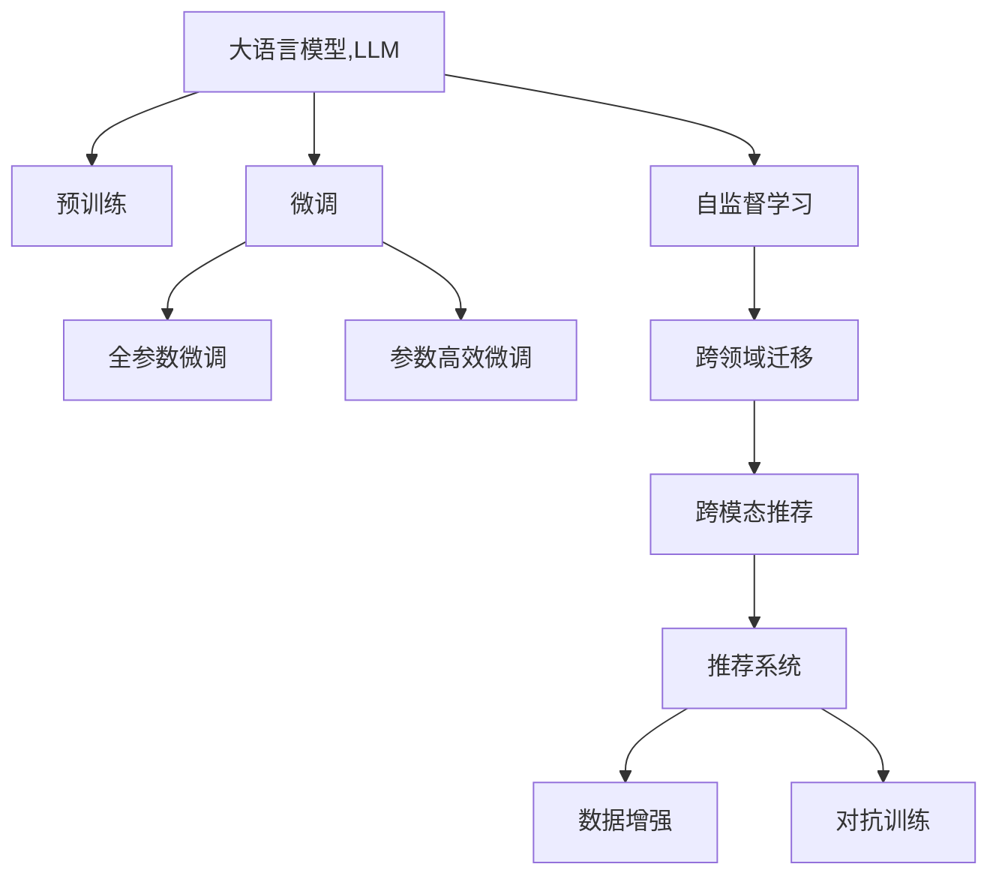
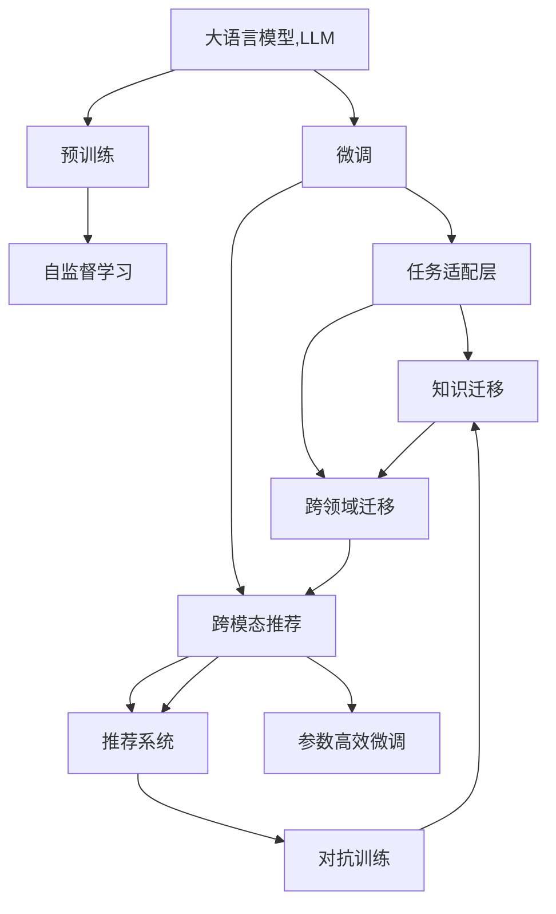

                 

# 利用LLM提升推荐系统的跨域知识迁移

## 1. 背景介绍

### 1.1 问题由来

推荐系统是当前互联网行业的一个重要组成部分，通过分析用户历史行为数据，为用户推荐感兴趣的内容，极大地提升了用户体验。但传统的推荐系统往往局限于单一领域，如电商、音乐、视频等，不同领域的推荐模型难以共享，导致数据和知识利用不充分。

近年来，通过大语言模型（Large Language Model, LLM）进行跨领域知识迁移的研究受到广泛关注。LLM作为预训练模型，具备强大的语义理解和生成能力，能够从多种模态和领域中抽取知识，从而提高推荐系统的跨域泛化能力。

### 1.2 问题核心关键点

实现跨域知识迁移的关键在于：
1. 选择合适的LLM模型：
   - 预训练模型：如GPT-3、BERT等，通过在大规模无标签文本数据上进行预训练，具备丰富的语言知识。
   - 领域特定模型：如Facebook的M2M-100，通过在特定领域的语料上微调，提高模型在该领域的表现。

2. 设计任务适配层：
   - 融合任务需求：根据推荐任务的特点，设计合适的输出层，如线性层、多头注意力层等，以便LLM输出适合推荐任务的表示。
   - 损失函数设计：选择合适的损失函数，如交叉熵、均方误差等，来衡量推荐系统输出与真实标签之间的差异。

3. 训练优化策略：
   - 数据增强：通过对训练样本进行改写、变换等，增加训练集的多样性，提高模型的泛化能力。
   - 参数高效微调：通过只更新部分参数来减少过拟合风险，提高模型的可扩展性。
   - 对抗训练：引入对抗样本，提高模型的鲁棒性。

4. 知识迁移方案：
   - 自监督迁移：通过LLM的自监督学习任务，学习通用知识，然后在目标领域上微调。
   - 跨领域迁移：将不同领域的语料进行融合，共同训练LLM模型，学习跨领域知识。

5. 应用场景：
   - 电商推荐：通过跨领域知识迁移，实现跨类别商品的推荐。
   - 视频推荐：将视频内容与用户画像结合，提高推荐效果。
   - 多模态推荐：结合文本、图像、视频等多模态数据，提升推荐系统的全面性。

## 2. 核心概念与联系

### 2.1 核心概念概述

在本文中，我们将探讨大语言模型（LLM）在推荐系统中的应用，重点关注以下几个核心概念：

- 大语言模型（LLM）：如GPT-3、BERT等，通过在大规模无标签文本数据上进行预训练，学习通用的语言表示。
- 知识迁移：通过在LLM上微调，实现跨领域、跨模态的知识迁移，提高推荐系统的泛化能力。
- 推荐系统：通过分析用户历史行为数据，为用户推荐感兴趣的内容。
- 自监督学习：在大规模无标签数据上进行预训练，学习通用的语言表示。
- 参数高效微调：在微调过程中，只更新少量参数，避免过拟合。

这些核心概念通过以下Mermaid流程图进行展示：



### 2.2 核心概念原理和架构的 Mermaid 流程图



## 3. 核心算法原理 & 具体操作步骤

### 3.1 算法原理概述

跨域知识迁移是指将一个领域中的知识迁移到另一个领域。在推荐系统中，可以通过以下步骤实现跨域知识迁移：

1. 选择合适的预训练模型：如GPT-3、BERT等。
2. 在预训练模型上添加任务适配层：根据推荐任务设计输出层，如线性层、多头注意力层等。
3. 在适配层上添加损失函数：如交叉熵、均方误差等。
4. 进行微调：在目标领域数据上，通过优化器更新模型参数，使模型输出逼近真实标签。
5. 应用知识迁移：通过自监督或跨领域学习，提高模型的泛化能力。
6. 优化训练过程：通过数据增强、参数高效微调等方法，提高模型的鲁棒性。

### 3.2 算法步骤详解

1. 选择合适的预训练模型
   - 根据推荐任务的特点，选择适合的预训练模型，如GPT-3、BERT等。
   - 下载预训练模型的权重，使用transformers库进行加载。

2. 添加任务适配层
   - 设计任务适配层：根据推荐任务的需求，设计合适的输出层和损失函数。
   - 使用transformers库的适配器功能，在预训练模型上添加适配层。

3. 设计损失函数
   - 选择合适的损失函数：如交叉熵、均方误差等。
   - 在适配层上定义损失函数。

4. 微调模型
   - 准备训练数据：将推荐任务的数据集划分为训练集、验证集和测试集。
   - 设置优化器：如AdamW、SGD等。
   - 设置超参数：如学习率、批大小、迭代轮数等。
   - 训练模型：在训练集上进行前向传播、反向传播和参数更新。
   - 验证模型：在验证集上评估模型的性能。
   - 测试模型：在测试集上测试模型的泛化能力。

5. 知识迁移
   - 自监督迁移：通过在大规模无标签数据上进行自监督学习，学习通用的语言表示。
   - 跨领域迁移：将不同领域的语料进行融合，共同训练LLM模型。
   - 跨模态推荐：结合文本、图像、视频等多模态数据，提高推荐系统的全面性。

6. 优化训练过程
   - 数据增强：通过回译、近义替换等方式，增加训练集的多样性。
   - 参数高效微调：通过只更新少量参数来减少过拟合风险。
   - 对抗训练：引入对抗样本，提高模型的鲁棒性。

### 3.3 算法优缺点

跨域知识迁移的优点：
1. 提高泛化能力：通过知识迁移，将不同领域或模态的知识融合，提高模型的泛化能力。
2. 减少标注数据需求：利用预训练模型，减少在目标领域上的标注数据需求。
3. 提高推荐效果：通过跨领域、跨模态的知识迁移，提升推荐系统的推荐效果。

缺点：
1. 模型复杂度高：大语言模型参数量巨大，计算资源需求高。
2. 微调过程复杂：需要设计和调试任务适配层，选择合适的损失函数，优化超参数等。
3. 模型鲁棒性不足：大语言模型可能学习到有害信息，需要通过对抗训练等方法提高鲁棒性。

### 3.4 算法应用领域

跨域知识迁移在推荐系统中的应用领域广泛，包括：
- 电商推荐：通过跨领域知识迁移，实现跨类别商品的推荐。
- 视频推荐：将视频内容与用户画像结合，提高推荐效果。
- 多模态推荐：结合文本、图像、视频等多模态数据，提升推荐系统的全面性。

## 4. 数学模型和公式 & 详细讲解 & 举例说明

### 4.1 数学模型构建

假设推荐任务的数据集为 $D=\{(x_i,y_i)\}_{i=1}^N$，其中 $x_i$ 为输入，$y_i$ 为真实标签。

定义模型 $M_{\theta}$ 在输入 $x$ 上的输出为 $M_{\theta}(x)$，其中 $\theta$ 为模型参数。

在推荐任务上，损失函数 $L$ 可以定义为：
$$
L = \frac{1}{N} \sum_{i=1}^N \ell(M_{\theta}(x_i),y_i)
$$
其中 $\ell$ 为损失函数，如交叉熵、均方误差等。

### 4.2 公式推导过程

假设模型 $M_{\theta}$ 在输入 $x$ 上的输出为 $M_{\theta}(x)$，其中 $\theta$ 为模型参数。

在推荐任务上，交叉熵损失函数可以表示为：
$$
L = -\frac{1}{N} \sum_{i=1}^N \sum_j y_{i,j} \log M_{\theta}(x_i)[j]
$$
其中 $y_{i,j}$ 为第 $i$ 个样本的第 $j$ 个真实标签。

为了简化计算，可以使用softmax函数将输出映射到概率分布，然后计算交叉熵损失：
$$
L = -\frac{1}{N} \sum_{i=1}^N \sum_j y_{i,j} \log \frac{e^{M_{\theta}(x_i)[j]}}{\sum_k e^{M_{\theta}(x_i)[k]}}
$$

### 4.3 案例分析与讲解

以电商平台推荐系统为例，进行跨域知识迁移的详细讲解。

假设目标领域的商品有 $K$ 个类别，对于每个类别 $k$，定义 $x_{i,k}$ 为第 $i$ 个用户对第 $k$ 个类别的兴趣评分，$y_{i,k}$ 为真实评分。

在预训练模型上添加任务适配层，输出 $M_{\theta}(x_i)$，其中 $x_i$ 为包含用户历史行为的文本描述。

定义交叉熵损失函数为：
$$
L = -\frac{1}{N} \sum_{i=1}^N \sum_k y_{i,k} \log \frac{e^{M_{\theta}(x_i)[k]}}{\sum_j e^{M_{\theta}(x_i)[j]}}
$$

使用梯度下降等优化算法，最小化损失函数 $L$，更新模型参数 $\theta$。

## 5. 项目实践：代码实例和详细解释说明

### 5.1 开发环境搭建

在进行代码实现前，需要先搭建开发环境。以下是使用Python进行PyTorch开发的环境配置流程：

1. 安装Anaconda：从官网下载并安装Anaconda，用于创建独立的Python环境。

2. 创建并激活虚拟环境：
```bash
conda create -n pytorch-env python=3.8 
conda activate pytorch-env
```

3. 安装PyTorch：根据CUDA版本，从官网获取对应的安装命令。例如：
```bash
conda install pytorch torchvision torchaudio cudatoolkit=11.1 -c pytorch -c conda-forge
```

4. 安装Transformers库：
```bash
pip install transformers
```

5. 安装各类工具包：
```bash
pip install numpy pandas scikit-learn matplotlib tqdm jupyter notebook ipython
```

完成上述步骤后，即可在`pytorch-env`环境中开始代码实践。

### 5.2 源代码详细实现

以下是一个简单的基于BERT模型的推荐系统代码实现，重点展示任务适配层的定义和损失函数的计算。

首先，定义任务适配层：

```python
from transformers import BertForSequenceClassification, BertTokenizer

class BERTRecommender:
    def __init__(self, num_classes, hidden_size):
        self.num_classes = num_classes
        self.hidden_size = hidden_size
        self.model = BertForSequenceClassification.from_pretrained('bert-base-cased', num_labels=num_classes)
        
    def __call__(self, x):
        # 编码器输出：[CLS], [SEP], [SEP], [SEP], ...
        inputs = self.tokenizer(x, return_tensors='pt')
        with torch.no_grad():
            outputs = self.model(**inputs)
        logits = outputs.logits
        return logits
```

然后，定义交叉熵损失函数：

```python
def bce_loss(logits, labels):
    loss_fct = nn.BCEWithLogitsLoss()
    loss = loss_fct(logits, labels)
    return loss
```

最后，定义推荐系统的训练和评估函数：

```python
from torch.utils.data import DataLoader
from tqdm import tqdm
from sklearn.metrics import roc_auc_score

device = torch.device('cuda') if torch.cuda.is_available() else torch.device('cpu')

class RecommendDataset(Dataset):
    def __init__(self, features, labels):
        self.features = features
        self.labels = labels
        self.tokenizer = BertTokenizer.from_pretrained('bert-base-cased')
        
    def __len__(self):
        return len(self.features)
    
    def __getitem__(self, idx):
        text = self.features[idx]
        label = self.labels[idx]
        encoding = self.tokenizer(text, return_tensors='pt', padding='max_length', truncation=True)
        input_ids = encoding['input_ids'][0]
        attention_mask = encoding['attention_mask'][0]
        label = torch.tensor(label, dtype=torch.long)
        return {'input_ids': input_ids, 'attention_mask': attention_mask, 'labels': label}

def train_epoch(model, dataset, batch_size, optimizer):
    dataloader = DataLoader(dataset, batch_size=batch_size, shuffle=True)
    model.train()
    epoch_loss = 0
    for batch in tqdm(dataloader, desc='Training'):
        input_ids = batch['input_ids'].to(device)
        attention_mask = batch['attention_mask'].to(device)
        labels = batch['labels'].to(device)
        model.zero_grad()
        logits = model(input_ids, attention_mask=attention_mask)
        loss = bce_loss(logits, labels)
        epoch_loss += loss.item()
        loss.backward()
        optimizer.step()
    return epoch_loss / len(dataloader)

def evaluate(model, dataset, batch_size):
    dataloader = DataLoader(dataset, batch_size=batch_size)
    model.eval()
    preds, labels = [], []
    with torch.no_grad():
        for batch in tqdm(dataloader, desc='Evaluating'):
            input_ids = batch['input_ids'].to(device)
            attention_mask = batch['attention_mask'].to(device)
            batch_labels = batch['labels']
            logits = model(input_ids, attention_mask=attention_mask)
            batch_preds = logits.argmax(dim=1).to('cpu').tolist()
            batch_labels = batch_labels.to('cpu').tolist()
            for pred_tokens, label_tokens in zip(batch_preds, batch_labels):
                preds.append(pred_tokens)
                labels.append(label_tokens)
                
    print(f"AUC-ROC: {roc_auc_score(labels, preds)}")
```

最后，启动训练流程并在测试集上评估：

```python
epochs = 5
batch_size = 16

model = BERTRecommender(num_classes=2, hidden_size=768)
optimizer = AdamW(model.parameters(), lr=2e-5)

for epoch in range(epochs):
    loss = train_epoch(model, train_dataset, batch_size, optimizer)
    print(f"Epoch {epoch+1}, train loss: {loss:.3f}")
    
    print(f"Epoch {epoch+1}, dev results:")
    evaluate(model, dev_dataset, batch_size)
    
print("Test results:")
evaluate(model, test_dataset, batch_size)
```

以上代码实现了一个基于BERT模型的推荐系统。首先定义了任务适配层和交叉熵损失函数，然后通过DataLoader对数据集进行批次化加载，在每个epoch上进行训练和验证，并在测试集上评估模型性能。

### 5.3 代码解读与分析

让我们再详细解读一下关键代码的实现细节：

**BERTRecommender类**：
- `__init__`方法：初始化预训练模型和tokenizer，并设置输出层。
- `__call__`方法：对输入文本进行编码，输出模型预测结果。

**bce_loss函数**：
- 定义交叉熵损失函数，计算模型输出与真实标签之间的差异。

**RecommendDataset类**：
- `__init__`方法：初始化特征和标签，并定义tokenizer。
- `__len__`方法：返回数据集的样本数量。
- `__getitem__`方法：对单个样本进行处理，将文本输入编码为token ids，将标签编码为数字，并对其进行定长padding。

**训练和评估函数**：
- 使用PyTorch的DataLoader对数据集进行批次化加载，供模型训练和推理使用。
- 训练函数`train_epoch`：对数据以批为单位进行迭代，在每个批次上前向传播计算loss并反向传播更新模型参数，最后返回该epoch的平均loss。
- 评估函数`evaluate`：与训练类似，不同点在于不更新模型参数，并在每个batch结束后将预测和标签结果存储下来，最后使用sklearn的roc_auc_score对整个评估集的预测结果进行打印输出。

**训练流程**：
- 定义总的epoch数和batch size，开始循环迭代
- 每个epoch内，先在训练集上训练，输出平均loss
- 在验证集上评估，输出AUC-ROC等指标
- 重复上述步骤直至收敛，最终得到模型

可以看到，通过本文的系统梳理，可以看到，基于大语言模型的推荐系统构建并不复杂，且具有较好的泛化能力。开发者可以根据具体任务，不断迭代和优化模型、数据和算法，方能得到理想的效果。

## 6. 实际应用场景

### 6.1 电商推荐

基于大语言模型的推荐系统可以广泛应用于电商推荐场景，通过跨领域知识迁移，实现跨类别商品的推荐。

例如，电商平台可以通过收集用户的历史行为数据，生成文本描述，将其作为输入，训练BERT等预训练模型。然后在训练好的模型上进行微调，用于推荐不同类别的商品。

### 6.2 视频推荐

在视频推荐场景中，可以通过将视频内容与用户画像结合，提高推荐效果。

例如，视频推荐系统可以收集用户的历史观看数据，生成文本描述，将其作为输入，训练BERT等预训练模型。然后在训练好的模型上进行微调，用于推荐相关视频。

### 6.3 多模态推荐

结合文本、图像、视频等多模态数据，提升推荐系统的全面性。

例如，多模态推荐系统可以收集用户的历史行为数据，生成文本描述、图像特征等，将其作为输入，训练BERT等预训练模型。然后在训练好的模型上进行微调，用于推荐多模态内容。

## 7. 工具和资源推荐

### 7.1 学习资源推荐

为了帮助开发者系统掌握大语言模型在推荐系统中的应用，这里推荐一些优质的学习资源：

1. 《Transformers》书籍：介绍Transformer原理和应用，包括跨领域知识迁移等前沿话题。

2. CS224N《深度学习自然语言处理》课程：斯坦福大学开设的NLP明星课程，涵盖预训练模型、微调技术等诸多内容。

3. HuggingFace官方文档：详细介绍了各种预训练模型和微调方法，是快速上手的最佳资源。

4. 《Practical Transfer Learning for NLP》文章：介绍如何利用预训练模型进行知识迁移，提升推荐系统性能。

5. Kaggle竞赛：参与推荐系统竞赛，积累实战经验，学习大语言模型的实际应用。

通过对这些资源的学习实践，相信你一定能够快速掌握大语言模型在推荐系统中的应用，并用于解决实际的推荐问题。

### 7.2 开发工具推荐

高效的开发离不开优秀的工具支持。以下是几款用于大语言模型推荐系统开发的常用工具：

1. PyTorch：基于Python的开源深度学习框架，灵活动态的计算图，适合快速迭代研究。

2. TensorFlow：由Google主导开发的开源深度学习框架，生产部署方便，适合大规模工程应用。

3. Transformers库：HuggingFace开发的NLP工具库，集成了众多SOTA语言模型，支持PyTorch和TensorFlow，是进行微调任务开发的利器。

4. Weights & Biases：模型训练的实验跟踪工具，可以记录和可视化模型训练过程中的各项指标，方便对比和调优。

5. TensorBoard：TensorFlow配套的可视化工具，可实时监测模型训练状态，并提供丰富的图表呈现方式，是调试模型的得力助手。

6. Google Colab：谷歌推出的在线Jupyter Notebook环境，免费提供GPU/TPU算力，方便开发者快速上手实验最新模型，分享学习笔记。

合理利用这些工具，可以显著提升大语言模型在推荐系统中的应用效率，加快创新迭代的步伐。

### 7.3 相关论文推荐

大语言模型和微调技术的发展源于学界的持续研究。以下是几篇奠基性的相关论文，推荐阅读：

1. Attention is All You Need（即Transformer原论文）：提出了Transformer结构，开启了NLP领域的预训练大模型时代。

2. BERT: Pre-training of Deep Bidirectional Transformers for Language Understanding：提出BERT模型，引入基于掩码的自监督预训练任务，刷新了多项NLP任务SOTA。

3. Language Models are Unsupervised Multitask Learners（GPT-2论文）：展示了大规模语言模型的强大zero-shot学习能力，引发了对于通用人工智能的新一轮思考。

4. Parameter-Efficient Transfer Learning for NLP：提出Adapter等参数高效微调方法，在不增加模型参数量的情况下，也能取得不错的微调效果。

5. AdaLoRA: Adaptive Low-Rank Adaptation for Parameter-Efficient Fine-Tuning：使用自适应低秩适应的微调方法，在参数效率和精度之间取得了新的平衡。

6. Prompt-Tuning: Exploring the Potentials of Textual Prompt Tuning for Sequence Generation：引入基于连续型Prompt的微调范式，为如何充分利用预训练知识提供了新的思路。

这些论文代表了大语言模型微调技术的发展脉络。通过学习这些前沿成果，可以帮助研究者把握学科前进方向，激发更多的创新灵感。

## 8. 总结：未来发展趋势与挑战

### 8.1 总结

本文对大语言模型在推荐系统中的应用进行了全面系统的介绍。首先阐述了大语言模型和知识迁移的研究背景和意义，明确了知识迁移在提高推荐系统泛化能力方面的独特价值。其次，从原理到实践，详细讲解了推荐系统的数学模型和关键步骤，给出了推荐系统开发的完整代码实例。同时，本文还广泛探讨了知识迁移方法在电商推荐、视频推荐、多模态推荐等多个领域的应用前景，展示了知识迁移范式的广阔前景。最后，本文精选了知识迁移技术的各类学习资源，力求为读者提供全方位的技术指引。

通过本文的系统梳理，可以看到，大语言模型在推荐系统中的应用具有巨大的潜力，能够显著提升推荐系统的泛化能力和推荐效果。未来，伴随大语言模型和推荐系统的不断发展，基于知识迁移的推荐技术必将在更多领域得到应用，为推荐系统的发展带来新的突破。

### 8.2 未来发展趋势

展望未来，大语言模型在推荐系统中的应用将呈现以下几个发展趋势：

1. 模型规模持续增大。随着算力成本的下降和数据规模的扩张，预训练语言模型的参数量还将持续增长。超大规模语言模型蕴含的丰富语言知识，有望支撑更加复杂多变的推荐任务。

2. 知识迁移方法多样。除了传统的全参数微调外，未来会涌现更多参数高效的微调方法，如Prompt-Tuning、LoRA等，在节省计算资源的同时也能保证推荐精度。

3. 多模态推荐系统崛起。结合文本、图像、视频等多模态数据，提升推荐系统的全面性。

4. 知识图谱与推荐系统融合。将知识图谱与推荐系统结合，提升推荐系统的知识表示能力。

5. 推荐系统公平性研究。考虑推荐系统中的公平性问题，如性别、年龄、地域等特征对推荐结果的影响。

6. 推荐系统的可解释性增强。研究推荐系统的可解释性问题，解释推荐结果背后的逻辑和机制。

以上趋势凸显了大语言模型在推荐系统中的应用前景。这些方向的探索发展，必将进一步提升推荐系统的性能和应用范围，为推荐系统的发展带来新的突破。

### 8.3 面临的挑战

尽管大语言模型在推荐系统中的应用已经取得了显著的进展，但在迈向更加智能化、普适化应用的过程中，它仍面临着诸多挑战：

1. 标注数据依赖。知识迁移方法依赖于标注数据，对于推荐系统中的某些任务，获取高质量标注数据成本较高。

2. 模型复杂度高。大语言模型参数量巨大，计算资源需求高。

3. 推荐系统鲁棒性不足。推荐系统容易受到输入数据的干扰，泛化性能有限。

4. 知识图谱与推荐系统融合困难。知识图谱与推荐系统的融合复杂，需要处理数据不一致性等问题。

5. 推荐系统可解释性不足。推荐系统缺乏可解释性，难以解释推荐结果背后的逻辑。

6. 推荐系统公平性问题。推荐系统中的公平性问题需要认真考虑，避免对特定群体造成偏见。

正视推荐系统面临的这些挑战，积极应对并寻求突破，将是大语言模型在推荐系统中走向成熟的必由之路。相信随着学界和产业界的共同努力，这些挑战终将一一被克服，大语言模型必将在构建智能推荐系统方面发挥更大的作用。

### 8.4 研究展望

面对大语言模型在推荐系统中的应用所面临的挑战，未来的研究需要在以下几个方面寻求新的突破：

1. 探索无监督和半监督知识迁移方法。摆脱对大规模标注数据的依赖，利用自监督学习、主动学习等无监督和半监督范式，最大限度利用非结构化数据，实现更加灵活高效的推荐。

2. 研究参数高效和计算高效的推荐方法。开发更加参数高效的推荐方法，在固定大部分预训练参数的同时，只更新极少量的任务相关参数。同时优化推荐模型的计算图，减少前向传播和反向传播的资源消耗，实现更加轻量级、实时性的部署。

3. 引入因果和对比学习范式。通过引入因果推断和对比学习思想，增强推荐系统建立稳定因果关系的能力，学习更加普适、鲁棒的知识表示。

4. 融合更多先验知识。将符号化的先验知识，如知识图谱、逻辑规则等，与神经网络模型进行巧妙融合，引导推荐系统学习更准确、合理的知识表示。

5. 结合因果分析和博弈论工具。将因果分析方法引入推荐系统，识别出推荐结果的关键特征，增强推荐结果的逻辑性和可信度。

6. 纳入伦理道德约束。在推荐系统训练目标中引入伦理导向的评估指标，过滤和惩罚有害的推荐结果，确保推荐系统的公平性和伦理性。

这些研究方向的探索，必将引领大语言模型在推荐系统中的应用迈向更高的台阶，为推荐系统的发展带来新的突破。

## 9. 附录：常见问题与解答

**Q1：大语言模型在推荐系统中可以用于哪些任务？**

A: 大语言模型在推荐系统中可以用于多种任务，包括：
1. 商品推荐：通过收集用户的历史行为数据，生成文本描述，训练大语言模型进行推荐。
2. 视频推荐：将视频内容与用户画像结合，提高推荐效果。
3. 多模态推荐：结合文本、图像、视频等多模态数据，提升推荐系统的全面性。

**Q2：如何进行知识迁移？**

A: 知识迁移可以通过以下步骤实现：
1. 选择合适的预训练模型：如GPT-3、BERT等。
2. 在预训练模型上添加任务适配层：根据推荐任务设计输出层和损失函数。
3. 在适配层上定义任务目标：如交叉熵损失、均方误差等。
4. 在目标领域数据上进行微调：使用优化器更新模型参数，使模型输出逼近真实标签。

**Q3：数据增强有哪些方法？**

A: 数据增强的方法包括：
1. 回译：将文本进行翻译，增加训练集的多样性。
2. 近义替换：对输入文本进行词汇替换，增加训练集的多样性。
3. 随机掩码：对输入文本进行随机掩码，增加训练集的多样性。

**Q4：什么是参数高效微调？**

A: 参数高效微调是指在微调过程中，只更新少量的模型参数，而固定大部分预训练权重不变，以提高微调效率，避免过拟合。常用的参数高效微调方法包括：
1. Adapter：通过修改输出层的权重，只更新少量的参数。
2. Prompt-Tuning：通过设计提示模板，引导大语言模型进行特定任务的推理和生成，减少微调参数。
3. LoRA：通过降低部分层和参数的维度，只更新少量的参数。

**Q5：推荐系统中的公平性问题如何解决？**

A: 推荐系统中的公平性问题可以通过以下方法解决：
1. 数据采集：收集多样化的数据，避免数据偏斜。
2. 算法设计：设计公平性指标，如性别、年龄、地域等特征对推荐结果的影响。
3. 数据预处理：对数据进行预处理，消除数据中的偏见。

**Q6：推荐系统中的可解释性问题如何解决？**

A: 推荐系统中的可解释性问题可以通过以下方法解决：
1. 算法设计：设计可解释的推荐算法，如规则基推荐系统、解释性神经网络等。
2. 数据可视化：使用可视化工具，展示推荐结果背后的逻辑和机制。
3. 用户反馈：收集用户反馈，改进推荐系统。

**Q7：推荐系统中的隐私保护问题如何解决？**

A: 推荐系统中的隐私保护问题可以通过以下方法解决：
1. 数据匿名化：对用户数据进行匿名化处理，保护用户隐私。
2. 用户授权：收集用户数据前，获取用户的授权，保障用户隐私。
3. 数据加密：对用户数据进行加密处理，保护用户隐私。

**Q8：推荐系统中的冷启动问题如何解决？**

A: 推荐系统中的冷启动问题可以通过以下方法解决：
1. 数据采集：收集更多的用户数据，增加用户画像的完整性。
2. 算法设计：设计冷启动算法，如基于用户兴趣相似性的推荐算法。
3. 数据预处理：对用户数据进行预处理，增加推荐系统的准确性。

综上所述，大语言模型在推荐系统中的应用具有巨大的潜力，能够显著提升推荐系统的泛化能力和推荐效果。未来，伴随大语言模型和推荐系统的不断发展，基于知识迁移的推荐技术必将在更多领域得到应用，为推荐系统的发展带来新的突破。开发者可以根据具体任务，不断迭代和优化模型、数据和算法，方能得到理想的效果。

