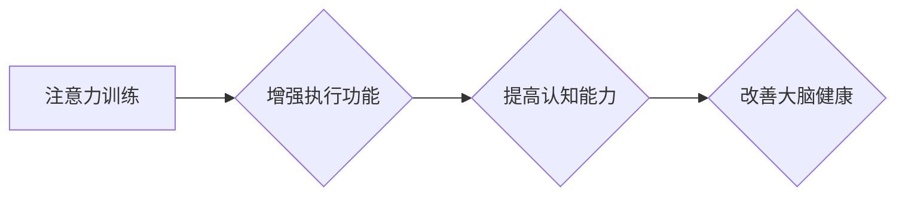

                 

## 1. 背景介绍

在当今信息爆炸的时代，注意力已经成为一项至关重要的能力。我们每天都被来自各种渠道的信息轰炸，想要有效地学习、工作和生活，都需要强大的注意力来过滤杂音，聚焦目标。然而，现代人的生活节奏快，压力大，注意力却日益涣散，这不仅影响了个人效率，也可能导致认知能力下降、情绪波动等问题。

注意力训练，即通过特定的练习和方法来增强注意力能力，近年来备受关注。它不仅可以帮助人们提高工作效率、学习成绩，还能改善情绪状态、增强记忆力等。越来越多的研究表明，注意力训练可以改变大脑结构和功能，从而改善认知能力和整体健康。

## 2. 核心概念与联系

### 2.1 注意力机制

注意力机制是人工智能领域近年来取得重要进展的核心概念之一。它模拟了人类大脑在处理信息时选择性关注某些信息，而忽略其他信息的机制。

注意力机制的核心思想是通过一个“注意力权重”来分配计算资源，将重点放在对当前任务最相关的部分。例如，在机器翻译任务中，注意力机制可以帮助模型关注源语言中与目标语言词语最相关的部分，从而提高翻译的准确性。

### 2.2 注意力训练与大脑

注意力训练与大脑健康密切相关。研究表明，注意力训练可以增强大脑的执行功能，包括计划、决策、抑制冲动等。

**注意力训练与大脑健康的关系**



### 2.3 注意力训练方法

注意力训练方法多种多样，包括：

* **冥想:** 冥想可以帮助人们集中注意力，提高专注力。
* **正念练习:** 正念练习可以帮助人们觉察自己的思绪和感受，并学会更好地控制注意力。
* **专注力游戏:** 专注力游戏可以提供一种有趣的方式来训练注意力。
* **认知训练软件:** 认知训练软件可以提供各种各样的注意力训练任务。

## 3. 核心算法原理 & 具体操作步骤

### 3.1 算法原理概述

注意力机制的核心算法是**注意力权重计算**。注意力权重表示模型对不同输入元素的关注程度。

常用的注意力机制算法包括：

* **Soft Attention:** 使用softmax函数将输入元素映射到一个概率分布，表示对每个元素的关注程度。
* **Hard Attention:** 选择一个输入元素作为当前的注意力焦点，忽略其他元素。

### 3.2 算法步骤详解

**Soft Attention 算法步骤:**

1. 计算输入序列的每个元素与查询向量的相似度。
2. 使用 softmax 函数将相似度转换为概率分布。
3. 将概率分布与输入序列相乘，得到注意力权重。
4. 将注意力权重与值序列相乘，得到注意力输出。

**Hard Attention 算法步骤:**

1. 计算输入序列的每个元素与查询向量的相似度。
2. 选择相似度最高的元素作为当前的注意力焦点。
3. 将注意力焦点对应的值作为注意力输出。

### 3.3 算法优缺点

**Soft Attention:**

* **优点:** 平滑的注意力分布，可以捕捉到输入序列中多个元素的信息。
* **缺点:** 计算复杂度较高。

**Hard Attention:**

* **优点:** 计算复杂度较低，可以聚焦于最重要的信息。
* **缺点:** 注意力分布不连续，可能忽略了部分重要的信息。

### 3.4 算法应用领域

注意力机制在人工智能领域广泛应用，包括：

* **自然语言处理:** 机器翻译、文本摘要、问答系统等。
* **计算机视觉:** 图像识别、目标检测、图像 Captioning 等。
* **语音识别:** 语音转文本、语音合成等。

## 4. 数学模型和公式 & 详细讲解 & 举例说明

### 4.1 数学模型构建

**Soft Attention 模型:**

假设输入序列为 $X = \{x_1, x_2, ..., x_n\}$, 查询向量为 $q$, 值序列为 $V = \{v_1, v_2, ..., v_n\}$.

注意力权重计算公式:

$$
a_{i} = \frac{exp(score(q, x_i))}{\sum_{j=1}^{n} exp(score(q, x_j))}
$$

其中，$score(q, x_i)$ 表示查询向量 $q$ 与输入元素 $x_i$ 的相似度，通常使用点积或余弦相似度计算。

注意力输出计算公式:

$$
z = \sum_{i=1}^{n} a_{i} v_i
$$

**Hard Attention 模型:**

Hard Attention 模型选择一个输入元素作为注意力焦点，其注意力权重为1，其他元素的注意力权重为0。

### 4.2 公式推导过程

Soft Attention 模型的注意力权重计算公式是基于 softmax 函数的概率分布。softmax 函数将输入向量映射到一个概率分布，其特点是所有元素的和为1，且每个元素的值介于0到1之间。

Hard Attention 模型的注意力权重计算则直接选择一个元素作为注意力焦点，其注意力权重为1，其他元素的注意力权重为0。

### 4.3 案例分析与讲解

**机器翻译:**

在机器翻译任务中，Soft Attention 可以帮助模型关注源语言中与目标语言词语最相关的部分，从而提高翻译的准确性。例如，在翻译句子“The cat sat on the mat”时，Soft Attention 可以帮助模型关注“cat”和“sat”这两个词语，因为它们与目标语言中的“猫”和“坐着”这两个词语最相关。

**图像 Captioning:**

在图像 Captioning 任务中，Hard Attention 可以帮助模型聚焦于图像中最重要的部分，从而生成更准确的图像描述。例如，在描述一张包含猫、狗和鸟的图像时，Hard Attention 可以帮助模型聚焦于猫，因为它是图像中最突出的部分。

## 5. 项目实践：代码实例和详细解释说明

### 5.1 开发环境搭建

* Python 3.6+
* TensorFlow 2.0+
* PyTorch 1.0+

### 5.2 源代码详细实现

以下代码示例展示了如何使用 TensorFlow 实现一个简单的 Soft Attention 模型:

```python
import tensorflow as tf

# 定义输入序列
input_sequence = tf.random.normal(shape=(10, 5))

# 定义查询向量
query_vector = tf.random.normal(shape=(5,))

# 计算注意力权重
attention_weights = tf.nn.softmax(tf.matmul(input_sequence, query_vector), axis=1)

# 计算注意力输出
attention_output = tf.matmul(attention_weights, input_sequence)

# 打印注意力权重和注意力输出
print(attention_weights)
print(attention_output)
```

### 5.3 代码解读与分析

* `tf.random.normal()` 函数生成随机正态分布的张量。
* `tf.matmul()` 函数计算矩阵乘法。
* `tf.nn.softmax()` 函数计算 softmax 函数。

### 5.4 运行结果展示

运行上述代码会输出注意力权重和注意力输出的张量。注意力权重张量表示模型对每个输入元素的关注程度，注意力输出张量表示模型对输入序列的加权平均值。

## 6. 实际应用场景

### 6.1 医疗诊断

注意力机制可以帮助医生更准确地识别病症，例如在医学影像分析中，注意力机制可以帮助医生关注图像中与疾病相关的区域。

### 6.2 教育培训

注意力机制可以帮助学生更好地理解和记忆知识，例如在在线学习平台中，注意力机制可以帮助学生关注重要的学习内容。

### 6.3 人机交互

注意力机制可以使人机交互更加自然和流畅，例如在语音助手中，注意力机制可以帮助语音助手更好地理解用户的意图。

### 6.4 未来应用展望

注意力机制在未来将有更广泛的应用，例如：

* **个性化推荐:** 根据用户的兴趣和行为，提供更精准的推荐。
* **自动驾驶:** 帮助自动驾驶汽车更好地感知周围环境。
* **机器人学习:** 帮助机器人更好地理解和响应人类指令。

## 7. 工具和资源推荐

### 7.1 学习资源推荐

* **书籍:**
    * 《深度学习》
    * 《Attention Is All You Need》
* **在线课程:**
    * Coursera: 深度学习
    * Udacity: 自然语言处理

### 7.2 开发工具推荐

* **TensorFlow:** 开源深度学习框架
* **PyTorch:** 开源深度学习框架
* **Keras:** 高级深度学习 API

### 7.3 相关论文推荐

* 《Attention Is All You Need》
* 《BERT: Pre-training of Deep Bidirectional Transformers for Language Understanding》
* 《Transformer-XL: Attentive Language Models Beyond a Fixed-Length Context》

## 8. 总结：未来发展趋势与挑战

### 8.1 研究成果总结

注意力机制在人工智能领域取得了显著的进展，并在多个应用场景中展现出强大的能力。

### 8.2 未来发展趋势

未来注意力机制的研究将朝着以下方向发展:

* **更有效的注意力机制:** 探索新的注意力机制，提高计算效率和准确性。
* **跨模态注意力机制:** 将注意力机制应用于多模态数据，例如文本、图像、音频等。
* **可解释性注意力机制:** 研究可解释的注意力机制，帮助人们更好地理解模型的决策过程。

### 8.3 面临的挑战

注意力机制也面临一些挑战:

* **计算复杂度:** 一些注意力机制的计算复杂度较高，难以应用于大规模数据。
* **数据依赖性:** 注意力机制的性能依赖于训练数据的质量。
* **可解释性:** 一些注意力机制的决策过程难以解释，这限制了其在一些应用场景中的应用。

### 8.4 研究展望

尽管面临挑战，注意力机制仍然是一个非常有前景的研究方向。未来，随着算法的改进和应用场景的拓展，注意力机制将发挥更大的作用，推动人工智能技术的进步。

## 9. 附录：常见问题与解答

**Q1: 注意力机制和深度学习有什么关系？**

**A1:** 注意力机制是深度学习中的一种重要模块，它可以帮助模型更好地理解和处理信息。

**Q2: 注意力机制有哪些应用场景？**

**A2:** 注意力机制在自然语言处理、计算机视觉、语音识别等多个领域都有应用。

**Q3: 如何选择合适的注意力机制？**

**A3:** 选择合适的注意力机制需要根据具体的应用场景和数据特点进行选择。

**作者：禅与计算机程序设计艺术 / Zen and the Art of Computer Programming**


<end_of_turn>

