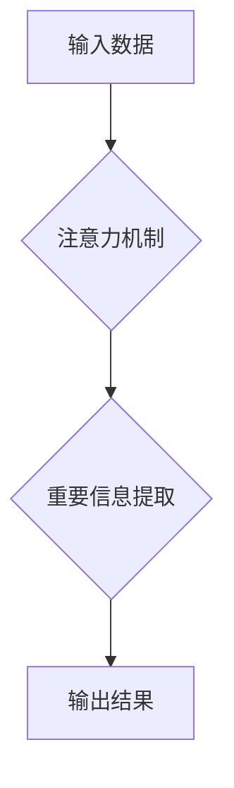

                 

## 1. 背景介绍

在当今信息爆炸的时代，我们被来自各方的信息和刺激所包围。手机、电脑、社交媒体无时无刻不在提醒我们，注意力也被不断地分割和分散。这种持续的注意力碎片化对我们的认知能力、情绪健康和整体幸福感都产生了负面影响。

研究表明，注意力是认知功能的基础，它直接关系到我们的学习、记忆、决策、创造力和解决问题的能力。注意力训练旨在通过特定的练习和技巧，增强我们的注意力集中能力、维持能力和切换能力，从而提升认知功能，改善生活质量。

## 2. 核心概念与联系

### 2.1 注意力机制

注意力机制是人工智能领域近年来发展迅速的关键技术之一，它模拟了人类大脑对重要信息进行筛选和聚焦的过程。注意力机制的核心思想是，在处理信息时，并非所有信息都具有同等重要性，我们的大脑会自动将注意力集中在与当前任务相关的关键信息上，而忽略无关的信息。

**Mermaid 流程图:**



### 2.2 注意力训练与大脑健康

注意力训练与大脑健康之间存在着密切的联系。通过注意力训练，我们可以增强大脑的注意力网络，提高神经元之间的连接和协同工作效率。这不仅可以提升认知能力，还可以促进大脑的 neuroplasticity（神经可塑性），增强大脑的自我修复和适应能力，从而改善情绪健康和整体幸福感。

## 3. 核心算法原理 & 具体操作步骤

### 3.1 算法原理概述

注意力机制的算法原理主要基于以下几个方面：

* **权重分配:** 注意力机制通过学习一个权重向量，来分配给输入数据中不同部分的注意力。权重向量的大小代表着对相应部分的关注程度。
* **注意力计算:** 注意力得分通常通过计算输入数据与查询向量之间的相似度来获得。
* **上下文信息融合:** 注意力得分被用于加权地融合输入数据中的不同部分，从而生成一个包含上下文信息的输出。

### 3.2 算法步骤详解

1. **输入数据预处理:** 将输入数据转换为适合注意力机制处理的格式。
2. **查询向量生成:** 生成一个查询向量，代表着当前任务的关注点。
3. **注意力得分计算:** 计算输入数据与查询向量之间的相似度，得到注意力得分。
4. **权重分配:** 将注意力得分转换为权重向量，用于加权地融合输入数据。
5. **上下文信息融合:** 使用权重向量加权地融合输入数据中的不同部分，生成一个包含上下文信息的输出。

### 3.3 算法优缺点

**优点:**

* **提高模型的表达能力:** 注意力机制可以帮助模型更好地理解和处理复杂的数据，提高模型的表达能力。
* **提升模型的泛化能力:** 注意力机制可以帮助模型学习到更重要的特征，从而提升模型的泛化能力。
* **解释性更强:** 注意力机制可以提供模型对输入数据的关注点，提高模型的解释性。

**缺点:**

* **计算复杂度高:** 注意力机制的计算复杂度较高，需要更多的计算资源。
* **参数量大:** 注意力机制的参数量较大，需要更多的训练数据。

### 3.4 算法应用领域

注意力机制在人工智能领域有着广泛的应用，包括：

* **自然语言处理:** 机器翻译、文本摘要、问答系统等。
* **计算机视觉:** 图像识别、目标检测、图像分割等。
* **语音识别:** 语音转文本、语音合成等。
* **推荐系统:** 商品推荐、内容推荐等。

## 4. 数学模型和公式 & 详细讲解 & 举例说明

### 4.1 数学模型构建

注意力机制的数学模型通常基于以下公式：

**注意力得分:**

$$
\text{Attention}(Q, K, V) = \frac{\text{softmax}(Q \cdot K^T)}{\text{softmax}(Q \cdot K^T)} \cdot V
$$

其中:

* $Q$ 是查询向量。
* $K$ 是键向量。
* $V$ 是值向量。
* $\cdot$ 表示矩阵乘法。
* $\text{softmax}$ 是softmax函数，用于将注意力得分归一化。

**公式解释:**

注意力得分计算公式首先计算查询向量与键向量的点积，然后使用softmax函数将点积值归一化，得到注意力权重。最后，将注意力权重与值向量相乘，得到最终的输出。

### 4.2 公式推导过程

注意力机制的公式推导过程可以追溯到Transformer模型的提出。Transformer模型中，注意力机制被用于处理序列数据，例如文本。

**推导过程:**

1. 将输入序列转换为查询向量、键向量和值向量。
2. 计算每个查询向量与所有键向量的注意力得分。
3. 使用注意力得分加权地融合所有值向量，得到最终的输出。

### 4.3 案例分析与讲解

**案例:**

假设我们有一个句子：“我爱学习编程”。

**分析:**

* 查询向量可以表示为“学习”。
* 键向量和值向量可以分别表示为句子的每个单词。
* 注意力机制可以计算出“学习”与每个单词的注意力得分，例如，“学习”与“编程”的注意力得分最高，因为它们在语义上相关。
* 最后，注意力机制会将“编程”作为最重要的信息，并将其用于生成最终的输出。

## 5. 项目实践：代码实例和详细解释说明

### 5.1 开发环境搭建

* Python 3.x
* TensorFlow 或 PyTorch

### 5.2 源代码详细实现

```python
import tensorflow as tf

# 定义注意力机制层
class AttentionLayer(tf.keras.layers.Layer):
    def __init__(self, units):
        super(AttentionLayer, self).__init__()
        self.Wq = tf.keras.layers.Dense(units)
        self.Wk = tf.keras.layers.Dense(units)
        self.Wv = tf.keras.layers.Dense(units)
        self.fc = tf.keras.layers.Dense(units)

    def call(self, inputs):
        Q = self.Wq(inputs)
        K = self.Wk(inputs)
        V = self.Wv(inputs)
        attention_scores = tf.matmul(Q, K, transpose_b=True) / tf.math.sqrt(tf.cast(units, tf.float32))
        attention_weights = tf.nn.softmax(attention_scores, axis=-1)
        context_vector = tf.matmul(attention_weights, V)
        output = self.fc(context_vector)
        return output

# 示例用法
inputs = tf.random.normal(shape=(10, 50, 128))
attention_layer = AttentionLayer(units=64)
output = attention_layer(inputs)
print(output.shape)
```

### 5.3 代码解读与分析

* 代码定义了一个AttentionLayer类，实现了注意力机制层。
* 该层使用三个全连接层分别将输入数据映射到查询向量、键向量和值向量。
* 然后，计算查询向量与键向量的点积，并使用softmax函数将其归一化，得到注意力权重。
* 最后，将注意力权重与值向量相乘，得到最终的输出。

### 5.4 运行结果展示

运行上述代码，会输出一个形状为`(10, 50, 64)`的张量，表示注意力机制处理后的输出。

## 6. 实际应用场景

### 6.1  医疗领域

注意力机制在医疗领域有着广泛的应用，例如：

* **疾病诊断:** 通过分析患者的病历、影像数据等信息，提高疾病诊断的准确率。
* **药物研发:** 通过分析药物分子结构和生物活性数据，加速药物研发过程。
* **个性化医疗:** 通过分析患者的基因信息和生活习惯等数据，提供个性化的医疗方案。

### 6.2  教育领域

注意力机制在教育领域可以用于：

* **智能辅导系统:** 根据学生的学习进度和能力，提供个性化的学习辅导。
* **自动批改系统:** 自动批改学生的作业，并提供反馈意见。
* **学习兴趣推荐:** 根据学生的学习兴趣，推荐相关的学习资源。

### 6.3  金融领域

注意力机制在金融领域可以用于：

* **欺诈检测:** 通过分析交易数据，识别潜在的欺诈行为。
* **风险评估:** 通过分析客户的信用记录和财务状况，评估客户的风险等级。
* **投资决策:** 通过分析市场数据，辅助投资决策。

### 6.4 未来应用展望

随着人工智能技术的不断发展，注意力机制的应用场景将会更加广泛。未来，注意力机制可能被应用于：

* **自动驾驶:** 帮助自动驾驶系统更好地感知周围环境。
* **机器人:** 帮助机器人更好地理解人类指令和环境。
* **人机交互:** 帮助人机交互系统更加自然和智能。

## 7. 工具和资源推荐

### 7.1 学习资源推荐

* **书籍:**

    * 《深度学习》
    * 《Attention Is All You Need》
    * 《Transformer模型详解》

* **在线课程:**

    * Coursera: 深度学习
    * Udacity: 自然语言处理
    * fast.ai: 深度学习

### 7.2 开发工具推荐

* **TensorFlow:** 开源深度学习框架
* **PyTorch:** 开源深度学习框架
* **Keras:** 高级深度学习API

### 7.3 相关论文推荐

* 《Attention Is All You Need》
* 《BERT: Pre-training of Deep Bidirectional Transformers for Language Understanding》
* 《GPT-3: Language Models are Few-Shot Learners》

## 8. 总结：未来发展趋势与挑战

### 8.1 研究成果总结

注意力机制在人工智能领域取得了显著的成果，并在自然语言处理、计算机视觉等领域取得了突破性的进展。

### 8.2 未来发展趋势

未来，注意力机制的发展趋势包括：

* **更强大的注意力机制:** 研究更有效的注意力机制，提高模型的表达能力和泛化能力。
* **自适应注意力机制:** 研究能够根据不同任务和数据自动调整注意力机制的参数。
* **多模态注意力机制:** 研究能够处理多种模态数据的注意力机制，例如文本、图像、音频等。

### 8.3 面临的挑战

注意力机制也面临着一些挑战，例如：

* **计算复杂度高:** 随着模型规模的增大，注意力机制的计算复杂度会显著增加。
* **参数量大:** 注意力机制的参数量较大，需要更多的训练数据。
* **可解释性差:** 注意力机制的决策过程相对复杂，难以解释模型的决策结果。

### 8.4 研究展望

未来，研究人员将继续探索注意力机制的潜力，开发更强大、更有效的注意力机制，并将其应用于更多领域。


## 9. 附录：常见问题与解答

**问题 1:** 注意力机制与卷积神经网络有什么区别？

**答案:** 卷积神经网络主要通过卷积操作来提取特征，而注意力机制则通过学习注意力权重来关注输入数据中的重要信息。

**问题 2:** 注意力机制的计算复杂度如何降低？

**答案:** 可以通过使用低秩分解、局部注意力等方法来降低注意力机制的计算复杂度。

**问题 3:** 如何评估注意力机制的性能？

**答案:** 可以使用准确率、召回率、F1-score等指标来评估注意力机制的性能。


作者：禅与计算机程序设计艺术 / Zen and the Art of Computer Programming 
<end_of_turn>

