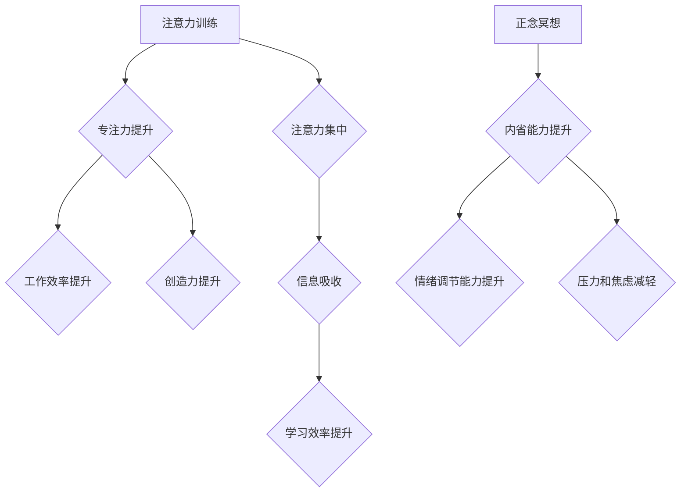

                 

## 1. 背景介绍

在当今信息爆炸的时代，我们被无休止的通知、信息流和任务所包围。这种持续的刺激和干扰使得专注力变得稀缺，心灵也容易陷入焦虑和混乱。注意力训练与正念冥想作为一种古老而有效的精神修养方法，近年来逐渐受到现代科技工作者的关注。

对于程序员、软件架构师和技术专家来说，注意力是至关重要的能力。他们需要长时间地专注于复杂的代码、系统设计和问题解决。然而，长时间的屏幕凝视、高强度的工作压力和不断变化的技术环境，都可能导致注意力涣散、思维疲劳。

注意力训练与正念冥想可以帮助技术人员提升专注力、增强抗压能力、提高工作效率和创造力。通过内省和专注，我们可以训练自己的大脑，更好地控制注意力，减少干扰，获得更清晰的思维和心灵的平静。

## 2. 核心概念与联系

### 2.1 注意力训练

注意力训练是指通过一系列的练习和技巧，增强大脑对特定信息或任务的关注能力。它可以帮助我们：

* **提高专注力:** 能够长时间地集中注意力在目标上，减少分心。
* **增强记忆力:** 通过专注于信息，更容易将其存储在记忆中。
* **提升学习效率:**  能够更有效地吸收和理解新的知识。
* **控制情绪:**  能够更好地管理压力、焦虑和烦躁情绪。

### 2.2 正念冥想

正念冥想是一种古老的修行方法，通过专注于当下，观察自己的呼吸、身体和思想，培养觉察力和内省能力。它可以帮助我们：

* **减轻压力和焦虑:**  通过专注于当下，减少对过去和未来的担忧。
* **提升情绪调节能力:**  能够更好地识别和管理自己的情绪。
* **增强自我意识:**  更深入地了解自己的内心世界。
* **提高幸福感:**  通过培养感恩和接受，获得更积极的人生体验。

**核心概念与联系：**

注意力训练与正念冥想相互补充，共同作用于提升专注力、内省能力和心灵平静。正念冥想可以帮助我们培养专注于当下的能力，而注意力训练则可以帮助我们将这种专注力应用于具体的任务和目标。



## 3. 核心算法原理 & 具体操作步骤

### 3.1 算法原理概述

注意力训练与正念冥想并非严格意义上的算法，而是基于心理学的原理和实践方法。其核心原理在于：

* **训练专注力:** 通过重复练习，引导注意力集中在特定对象或任务上，增强大脑对特定信息的过滤和选择能力。
* **培养觉察力:**  学习观察自己的呼吸、身体和思想，不评判地觉察当下发生的体验，增强对自身状态的感知。
* **调节情绪:** 通过专注于当下，减少对过去和未来的担忧，降低情绪波动，培养平静和接受。

### 3.2 算法步骤详解

**注意力训练:**

1. **选择目标:**  确定需要集中注意力的对象或任务，例如阅读、写作、编程等。
2. **设定时间:**  从短时间开始，例如5分钟，逐渐增加练习时间。
3. **专注练习:**  将注意力集中在目标上，尽可能排除干扰。
4. **觉察分散:**  当注意力分散时，轻轻地将注意力引导回目标上，不要责怪自己。
5. **重复练习:**  每天坚持练习，逐渐提升专注力。

**正念冥想:**

1. **找到舒适的姿势:**  找个安静的地方，舒适地坐或躺下。
2. **专注呼吸:**  将注意力集中在呼吸的感受，观察吸气和呼气。
3. **觉察身体:**  观察身体的感受，例如温度、触感、压力等。
4. **观察思想:**  观察自己的思想，不评判地接纳它们，就像观赏云朵一样。
5. **回归呼吸:**  当注意力分散时，轻轻地将注意力引导回呼吸上。
6. **持续练习:**  每天坚持练习，逐渐培养觉察力和内省能力。

### 3.3 算法优缺点

**注意力训练:**

* **优点:**  易于实施，效果显著，可以针对特定任务进行训练。
* **缺点:**  需要持续练习，效果可能因人而异。

**正念冥想:**

* **优点:**  可以缓解压力和焦虑，提升情绪调节能力，培养内省能力。
* **缺点:**  需要时间和耐心，效果可能需要较长时间才能显现。

### 3.4 算法应用领域

注意力训练与正念冥想可以应用于各个领域，例如：

* **科技行业:**  提升程序员、软件架构师和技术专家的专注力、抗压能力和创造力。
* **教育领域:**  帮助学生提高学习效率、专注力、记忆力和情绪调节能力。
* **医疗领域:**  缓解压力和焦虑、改善睡眠质量、帮助患者应对慢性疾病。
* **个人成长:**  提升自我意识、培养内省能力、获得心灵平静和幸福感。

## 4. 数学模型和公式 & 详细讲解 & 举例说明

注意力机制在深度学习领域中得到了广泛应用，其核心思想是学习不同输入元素的重要性权重，并根据这些权重对信息进行加权求和。

### 4.1 数学模型构建

注意力机制通常使用一个注意力分数函数来计算每个输入元素的重要性权重。该函数通常是一个基于向量的点积或加权求和操作。

假设我们有一个输入序列 $X = \{x_1, x_2, ..., x_n\}$，以及一个查询向量 $Q$。注意力分数函数可以表示为：

$$
\alpha_{i} = \frac{exp(score(Q, x_i))}{\sum_{j=1}^{n} exp(score(Q, x_j))}
$$

其中，$score(Q, x_i)$ 表示查询向量 $Q$ 与输入元素 $x_i$ 之间的相似度得分。

### 4.2 公式推导过程

注意力分数函数的推导过程基于softmax函数，其目的是将输入元素的重要性权重归一化到一个概率分布。

* **相似度得分:**  可以使用点积、余弦相似度等方式计算查询向量 $Q$ 与输入元素 $x_i$ 之间的相似度得分。
* **softmax函数:**  将相似度得分转化为概率分布，使得每个元素的权重之和为1。

### 4.3 案例分析与讲解

在机器翻译任务中，注意力机制可以帮助模型关注源语言中与目标语言单词相关的关键信息。例如，在翻译句子“我爱吃苹果”时，注意力机制可以帮助模型关注“苹果”这个单词，并将其与目标语言中的“apple”单词进行匹配。

## 5. 项目实践：代码实例和详细解释说明

### 5.1 开发环境搭建

* Python 3.x
* TensorFlow 或 PyTorch 深度学习框架
* Jupyter Notebook 或 VS Code 等代码编辑器

### 5.2 源代码详细实现

以下是一个使用 TensorFlow 实现简单注意力机制的代码示例：

```python
import tensorflow as tf

# 定义输入序列
input_sequence = tf.constant([[1, 2, 3], [4, 5, 6], [7, 8, 9]])

# 定义查询向量
query_vector = tf.constant([1, 0, 1])

# 计算注意力分数
attention_scores = tf.matmul(input_sequence, query_vector, transpose_b=True)

# 应用 softmax 函数归一化注意力分数
attention_weights = tf.nn.softmax(attention_scores, axis=1)

# 将注意力权重与输入序列进行加权求和
output = tf.matmul(attention_weights, input_sequence)

# 打印输出
print(output)
```

### 5.3 代码解读与分析

* **输入序列:**  表示需要进行注意力机制处理的序列数据。
* **查询向量:**  表示需要与输入序列进行匹配的查询信息。
* **注意力分数:**  计算查询向量与每个输入元素之间的相似度得分。
* **softmax 函数:**  将注意力分数转化为概率分布，使得每个元素的权重之和为1。
* **加权求和:**  将注意力权重与输入序列进行加权求和，得到最终的输出。

### 5.4 运行结果展示

运行上述代码，输出结果将是一个包含三个元素的张量，每个元素代表了输入序列中对应元素的加权平均值。

## 6. 实际应用场景

注意力机制在深度学习领域中得到了广泛应用，例如：

* **机器翻译:**  帮助模型关注源语言中与目标语言单词相关的关键信息。
* **文本摘要:**  识别文本中最重要的句子，生成简洁的摘要。
* **图像识别:**  关注图像中与目标物体相关的区域，提高识别准确率。
* **语音识别:**  关注语音信号中与目标单词相关的部分，提高识别准确率。

### 6.4 未来应用展望

注意力机制在未来将继续发挥重要作用，并应用于更多领域，例如：

* **个性化推荐:**  根据用户的兴趣和行为，推荐个性化的内容。
* **医疗诊断:**  分析患者的病历和影像数据，辅助医生进行诊断。
* **自动驾驶:**  帮助车辆关注道路上的关键信息，提高驾驶安全性。

## 7. 工具和资源推荐

### 7.1 学习资源推荐

* **书籍:**  《深度学习》 (Ian Goodfellow, Yoshua Bengio, Aaron Courville)
* **在线课程:**  Coursera, edX, Udacity 等平台上的深度学习课程。
* **博客和论坛:**  Towards Data Science, Machine Learning Mastery 等网站。

### 7.2 开发工具推荐

* **TensorFlow:**  Google 开发的开源深度学习框架。
* **PyTorch:**  Facebook 开发的开源深度学习框架。
* **Jupyter Notebook:**  交互式代码编辑器和笔记本环境。

### 7.3 相关论文推荐

* **Attention Is All You Need:**  https://arxiv.org/abs/1706.03762
* **BERT: Pre-training of Deep Bidirectional Transformers for Language Understanding:**  https://arxiv.org/abs/1810.04805

## 8. 总结：未来发展趋势与挑战

### 8.1 研究成果总结

注意力机制在深度学习领域取得了显著的成果，并应用于多个领域，例如机器翻译、文本摘要、图像识别等。

### 8.2 未来发展趋势

* **更有效的注意力机制:**  研究更有效的注意力机制，提高模型的效率和性能。
* **自适应注意力机制:**  开发能够根据不同任务和数据自动调整注意力机制的模型。
* **跨模态注意力机制:**  研究能够处理不同模态数据（例如文本、图像、音频）的注意力机制。

### 8.3 面临的挑战

* **计算复杂度:**  一些注意力机制的计算复杂度较高，难以在资源有限的设备上运行。
* **可解释性:**  注意力机制的内部工作机制相对复杂，难以解释模型的决策过程。
* **数据依赖性:**  注意力机制的性能依赖于高质量的数据，缺乏数据会导致模型性能下降。

### 8.4 研究展望

未来，注意力机制的研究将继续深入，探索更有效的、更灵活、更可解释的注意力机制，并将其应用于更多领域，推动人工智能技术的进步。

## 9. 附录：常见问题与解答

* **什么是注意力机制？**

注意力机制是一种模仿人类注意力机制的机器学习技术，它允许模型专注于输入序列中与目标任务相关的关键信息。

* **注意力机制有哪些应用场景？**

注意力机制广泛应用于自然语言处理、计算机视觉、语音识别等领域，例如机器翻译、文本摘要、图像识别、语音识别等。

* **如何选择合适的注意力机制？**

选择合适的注意力机制取决于具体的任务和数据特点。常见的注意力机制包括自注意力机制、位置感知注意力机制、多头注意力机制等。

* **如何评估注意力机制的性能？**

注意力机制的性能可以通过与其他模型的对比、注意力权重的可视化分析、以及任务相关的指标（例如BLEU分数、准确率等）进行评估。


作者：禅与计算机程序设计艺术 / Zen and the Art of Computer Programming 
<end_of_turn>

