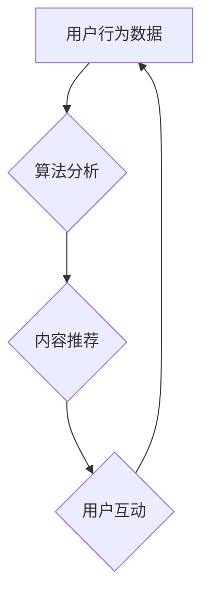

                 

## 1. 背景介绍

在当今数字时代，社交媒体平台已经成为人们生活中不可或缺的一部分。它们不仅为我们提供了连接、分享和获取信息的机会，也成为了商业巨头争夺用户注意力和市场份额的战场。社交媒体平台通过各种精心设计的算法和机制，不断地吸引我们的注意力，并试图将我们牢牢地锁定在平台内。

然而，这种“注意力货币化”的模式也引发了人们对隐私、信息茧房和数字沉迷等问题的担忧。本文将深入探讨社交媒体平台是如何利用技术手段争夺用户注意力的，以及这种模式对我们个人和社会带来的影响。

## 2. 核心概念与联系

### 2.1 用户注意力

用户注意力是指个体在特定时间段内对特定信息或刺激的认知和心理投入。它是一种有限的资源，可以被各种因素吸引和分散。社交媒体平台的目标就是尽可能地获取和维持用户的注意力，从而实现商业目标。

### 2.2 注意力货币化

注意力货币化是指将用户注意力作为一种可交易的资源，并通过广告、数据分析等方式进行变现。社交媒体平台通过收集用户行为数据，分析用户的兴趣和偏好，并根据这些数据精准投放广告，从而实现注意力货币化的目标。

### 2.3 算法驱动

社交媒体平台的核心是复杂的算法系统，这些算法负责推荐内容、过滤信息、个性化用户体验等。算法通过分析用户行为数据，不断学习和优化，以最大化用户的参与度和停留时间。

**Mermaid 流程图**



## 3. 核心算法原理 & 具体操作步骤

### 3.1 算法原理概述

社交媒体平台常用的算法包括：

* **协同过滤算法:** 根据用户的历史行为和与其他用户的相似性，推荐用户可能感兴趣的内容。
* **内容基准算法:** 根据内容的主题、标签、关键词等特征，推荐与用户兴趣相符的内容。
* **深度学习算法:** 利用深度神经网络，分析用户行为数据和内容特征，进行更精准的推荐和个性化定制。

### 3.2 算法步骤详解

以协同过滤算法为例，其具体操作步骤如下：

1. **数据收集:** 收集用户的行为数据，例如浏览历史、点赞、评论、分享等。
2. **用户相似度计算:** 计算用户之间的相似度，可以使用余弦相似度、皮尔逊相关系数等方法。
3. **推荐内容:** 根据用户与其他用户的相似度，推荐其他用户喜欢的、用户可能感兴趣的内容。

### 3.3 算法优缺点

**优点:**

* **精准推荐:** 算法可以根据用户的兴趣和偏好，推荐更精准的内容。
* **个性化体验:** 算法可以根据用户的不同特征，提供个性化的内容和服务。
* **提高用户粘性:** 精准推荐和个性化体验可以提高用户的参与度和停留时间。

**缺点:**

* **信息茧房:** 算法可能会将用户困在自己的兴趣圈内，导致信息单一化和认知偏差。
* **数据隐私:** 算法需要收集大量的用户行为数据，可能会引发数据隐私和安全问题。
* **算法偏差:** 算法本身可能存在偏差，导致推荐结果不公平或不准确。

### 3.4 算法应用领域

协同过滤算法广泛应用于：

* **电商推荐:** 推荐商品、优惠券等。
* **音乐推荐:** 推荐歌曲、音乐人等。
* **视频推荐:** 推荐视频、电影等。
* **社交推荐:** 推荐好友、群组等。

## 4. 数学模型和公式 & 详细讲解 & 举例说明

### 4.1 数学模型构建

协同过滤算法的核心是用户-物品评分矩阵，该矩阵表示每个用户对每个物品的评分。

假设有N个用户和M个物品，则用户-物品评分矩阵可以表示为一个N×M的矩阵R，其中R(i,j)表示用户i对物品j的评分。

### 4.2 公式推导过程

协同过滤算法的目标是预测用户对物品的评分，可以使用以下公式进行预测：

$$
\hat{R}(i,j) = \bar{R}_i + \frac{\sum_{k=1}^{M} \operatorname{sim}(i,k) \cdot (R(k,j) - \bar{R}_k)}{\sum_{k=1}^{M} |\operatorname{sim}(i,k)| }
$$

其中：

* $\hat{R}(i,j)$ 表示预测用户i对物品j的评分。
* $\bar{R}_i$ 表示用户i的平均评分。
* $\operatorname{sim}(i,k)$ 表示用户i和用户k之间的相似度。
* $R(k,j)$ 表示用户k对物品j的评分。
* $\bar{R}_k$ 表示用户k的平均评分。

### 4.3 案例分析与讲解

假设有一个用户-物品评分矩阵，其中用户1对物品1的评分为5，用户2对物品1的评分为4，用户1和用户2之间的相似度为0.8。

根据上述公式，我们可以预测用户1对物品2的评分：

$$
\hat{R}(1,2) = \bar{R}_1 + \frac{0.8 \cdot (R(2,2) - \bar{R}_2)}{0.8}
$$

如果我们知道用户2对物品2的评分和用户2的平均评分，就可以计算出预测的评分。

## 5. 项目实践：代码实例和详细解释说明

### 5.1 开发环境搭建

本项目使用Python语言进行开发，需要安装以下软件：

* Python 3.x
* Pandas
* Scikit-learn

### 5.2 源代码详细实现

```python
import pandas as pd
from sklearn.metrics.pairwise import cosine_similarity

# 加载用户-物品评分矩阵
ratings = pd.read_csv('ratings.csv')

# 计算用户之间的相似度
user_similarity = cosine_similarity(ratings)

# 预测用户对物品的评分
def predict_rating(user_id, item_id):
    user_average_rating = ratings[ratings['user_id'] == user_id]['rating'].mean()
    similar_users = user_similarity[user_id]
    similar_users_ratings = ratings[ratings['user_id'].isin(similar_users.argsort()[::-1][1:])]['rating']
    return user_average_rating + (similar_users_ratings.mean() - similar_users_ratings.mean()) * similar_users[user_id]

# 预测用户1对物品2的评分
predicted_rating = predict_rating(1, 2)
print(f'Predicted rating for user 1 on item 2: {predicted_rating}')
```

### 5.3 代码解读与分析

* 代码首先加载用户-物品评分矩阵。
* 然后使用cosine_similarity函数计算用户之间的相似度。
* predict_rating函数根据用户和物品的ID，预测用户对物品的评分。
* 最后，代码预测用户1对物品2的评分。

### 5.4 运行结果展示

运行代码后，会输出用户1对物品2的预测评分。

## 6. 实际应用场景

注意力货币化在社交媒体平台的应用场景非常广泛，例如：

* **个性化推荐:** 根据用户的兴趣和行为，推荐个性化的内容，例如新闻、视频、商品等。
* **广告投放:** 根据用户的兴趣和行为，精准投放广告，提高广告点击率和转化率。
* **用户留存:** 通过推送个性化的内容和服务，提高用户的参与度和留存率。
* **社区运营:** 通过算法推荐和匹配，促进用户之间的互动和交流。

### 6.4 未来应用展望

随着人工智能技术的不断发展，注意力货币化将会更加精准和个性化。未来，我们可能会看到：

* **更精准的推荐:** 利用深度学习算法，更加精准地预测用户的兴趣和需求。
* **更个性化的体验:** 根据用户的不同特征，提供更加个性化的内容和服务。
* **更沉浸式的互动:** 利用虚拟现实和增强现实技术，创造更加沉浸式的互动体验。

## 7. 工具和资源推荐

### 7.1 学习资源推荐

* **书籍:**
    * 《算法导论》
    * 《深度学习》
* **在线课程:**
    * Coursera: Machine Learning
    * edX: Artificial Intelligence

### 7.2 开发工具推荐

* **Python:** 
    * Pandas
    * Scikit-learn
    * TensorFlow
* **数据可视化工具:**
    * Matplotlib
    * Seaborn

### 7.3 相关论文推荐

* **Attention Is All You Need**
* **BERT: Pre-training of Deep Bidirectional Transformers for Language Understanding**

## 8. 总结：未来发展趋势与挑战

### 8.1 研究成果总结

注意力货币化已经成为社交媒体平台的核心商业模式，并取得了显著的成功。通过算法驱动和数据分析，社交媒体平台能够精准地获取和利用用户的注意力，实现商业目标。

### 8.2 未来发展趋势

未来，注意力货币化将会更加精准、个性化和沉浸式。人工智能技术的不断发展将推动注意力货币化的进一步发展。

### 8.3 面临的挑战

注意力货币化也面临着一些挑战，例如：

* **数据隐私:** 算法需要收集大量的用户行为数据，可能会引发数据隐私和安全问题。
* **信息茧房:** 算法可能会将用户困在自己的兴趣圈内，导致信息单一化和认知偏差。
* **算法偏差:** 算法本身可能存在偏差，导致推荐结果不公平或不准确。

### 8.4 研究展望

未来研究需要关注以下几个方面：

* **开发更加隐私保护的算法:** 探索新的算法和技术，能够在保证用户隐私的同时，实现注意力货币化的目标。
* **缓解信息茧房问题:** 研究如何打破信息茧房，提供更加多元化的信息内容。
* **解决算法偏差问题:** 探索如何识别和解决算法中的偏差，确保推荐结果公平准确。

## 9. 附录：常见问题与解答

**Q1: 注意力货币化对用户有什么影响？**

A1: 注意力货币化可能会导致用户沉迷社交媒体，影响他们的生活和工作。此外，注意力货币化也可能会导致信息茧房和认知偏差。

**Q2: 如何保护自己的数据隐私？**

A2: 可以通过以下方式保护自己的数据隐私：

* 谨慎设置社交媒体平台的隐私设置。
* 避免在社交媒体平台上分享敏感信息。
* 使用VPN等工具保护网络安全。

**Q3: 如何避免信息茧房？**

A3: 可以通过以下方式避免信息茧房：

* 关注不同领域的新闻和观点。
* 与不同背景的人交流。
* 尝试阅读不同类型的书籍和文章。


作者：禅与计算机程序设计艺术 / Zen and the Art of Computer Programming 
<end_of_turn>

