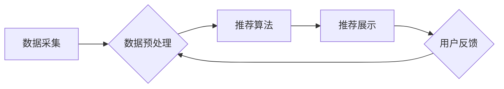

                 

## 深度学习在个性化推荐中的应用

> 关键词：深度学习、个性化推荐、协同过滤、内容过滤、神经网络、嵌入式表示、推荐系统

## 1. 背景介绍

在信息爆炸的时代，海量数据和个性化需求日益凸显。传统推荐系统基于用户历史行为或商品属性进行简单的规则匹配，难以满足用户日益复杂的个性化需求。深度学习作为一种强大的机器学习方法，凭借其强大的学习能力和对复杂模式的建模能力，为个性化推荐提供了新的思路和解决方案。

深度学习在推荐系统领域的应用可以追溯到20世纪末，但随着深度学习技术的不断发展，特别是卷积神经网络（CNN）和循环神经网络（RNN）的兴起，深度学习在推荐系统中的应用取得了显著进展。深度学习推荐系统能够学习用户和物品之间的复杂关系，并生成更精准、更个性化的推荐结果。

## 2. 核心概念与联系

**2.1 个性化推荐**

个性化推荐是指根据用户的兴趣、偏好、行为等信息，为用户提供定制化的商品、内容或服务推荐。其目标是提高用户体验，增强用户粘性，促进商业转化。

**2.2 深度学习**

深度学习是一种机器学习方法，它利用多层神经网络来学习数据中的复杂模式。深度学习模型能够自动提取特征，并进行高层次的抽象，从而实现更精准的预测和分类。

**2.3 推荐系统架构**

推荐系统通常由以下几个主要模块组成：

* 数据采集模块：负责收集用户行为数据、商品信息等数据。
* 数据预处理模块：对收集到的数据进行清洗、转换、特征提取等处理。
* 推荐算法模块：利用深度学习算法对用户和物品进行建模，并生成推荐结果。
* 推荐展示模块：将推荐结果展示给用户，并收集用户反馈信息。

**2.4 深度学习在推荐系统中的应用**

深度学习可以应用于推荐系统的各个模块，例如：

* **用户建模:** 利用深度学习模型学习用户的兴趣偏好、行为模式等特征，构建用户画像。
* **物品建模:** 利用深度学习模型学习物品的属性、类别、描述等特征，构建物品表示。
* **推荐算法:** 利用深度学习模型学习用户和物品之间的关系，生成个性化推荐结果。

**2.5 Mermaid 流程图**



## 3. 核心算法原理 & 具体操作步骤

### 3.1 算法原理概述

深度学习推荐算法的核心思想是利用深度神经网络学习用户和物品之间的复杂关系，并生成个性化推荐结果。常见的深度学习推荐算法包括：

* **协同过滤模型:** 基于用户和物品之间的交互数据，学习用户和物品之间的隐性关联。
* **内容过滤模型:** 基于物品的属性和描述信息，学习用户对不同类型物品的偏好。
* **混合模型:** 将协同过滤和内容过滤相结合，利用两种方法的优势，提高推荐效果。

### 3.2 算法步骤详解

以协同过滤模型为例，其具体操作步骤如下：

1. **数据收集:** 收集用户对物品的评分或交互数据。
2. **数据预处理:** 对数据进行清洗、转换、特征提取等处理。
3. **模型训练:** 利用深度神经网络模型训练，学习用户和物品之间的隐性关联。
4. **推荐生成:** 根据训练好的模型，预测用户对未交互物品的评分或偏好，并生成推荐结果。
5. **结果评估:** 利用评价指标评估推荐效果，并根据结果进行模型调优。

### 3.3 算法优缺点

**优点:**

* 能够学习用户和物品之间的复杂关系，生成更精准的推荐结果。
* 对数据噪声和缺失值有一定的鲁棒性。
* 可以处理高维数据和大量用户和物品。

**缺点:**

* 需要大量的训练数据。
* 模型训练时间较长。
* 难以解释模型的决策过程。

### 3.4 算法应用领域

深度学习推荐算法广泛应用于以下领域：

* **电子商务:** 商品推荐、用户画像、个性化营销。
* **视频网站:** 视频推荐、用户行为分析、内容创作。
* **音乐平台:** 音乐推荐、用户喜好分析、音乐创作。
* **社交媒体:** 内容推荐、用户关系分析、社区运营。

## 4. 数学模型和公式 & 详细讲解 & 举例说明

### 4.1 数学模型构建

协同过滤模型通常采用矩阵分解的方法，将用户-物品交互矩阵分解成两个低维矩阵，分别表示用户和物品的隐性特征。假设用户集合为U，物品集合为I，用户-物品交互矩阵为R，则可以将R分解成两个矩阵：

* **用户特征矩阵:**  $P \in R^{|U| \times k}$，其中k为隐性特征维度。
* **物品特征矩阵:** $Q \in R^{|I| \times k}$，其中k为隐性特征维度。

则用户-物品交互矩阵R可以表示为：

$$R \approx P Q^T$$

### 4.2 公式推导过程

模型的目标是最小化预测值与真实值的误差，常用的损失函数为均方误差（MSE）：

$$Loss = \frac{1}{2} \sum_{u \in U, i \in I} (R_{ui} - \hat{R}_{ui})^2$$

其中：

* $R_{ui}$ 为用户u对物品i的真实评分。
* $\hat{R}_{ui}$ 为模型预测的用户u对物品i的评分。

通过梯度下降算法，可以更新用户特征矩阵P和物品特征矩阵Q，使得损失函数最小化。

### 4.3 案例分析与讲解

假设有一个用户-物品交互矩阵R，其中包含用户对电影的评分信息。我们可以使用协同过滤模型将R分解成用户特征矩阵P和电影特征矩阵Q。

通过训练模型，我们可以得到每个用户和每个电影的隐性特征向量。例如，用户1可能具有对动作片和科幻片的偏好，而电影A可能具有动作、科幻和喜剧的特征。

根据用户和电影的隐性特征向量，我们可以预测用户1对电影A的评分。如果用户1的特征向量与电影A的特征向量相似，则模型预测的用户1对电影A的评分会较高。

## 5. 项目实践：代码实例和详细解释说明

### 5.1 开发环境搭建

推荐系统开发环境通常包含以下软件：

* Python 语言环境
* 深度学习框架（如TensorFlow、PyTorch）
* 数据处理工具（如Pandas、NumPy）
* 可视化工具（如Matplotlib、Seaborn）

### 5.2 源代码详细实现

以下是一个使用TensorFlow实现协同过滤模型的简单代码示例：

```python
import tensorflow as tf

# 定义用户-物品交互矩阵
R = tf.constant([[5, 4, 3],
                 [4, 5, 2],
                 [3, 2, 5]])

# 定义用户特征矩阵和物品特征矩阵
P = tf.Variable(tf.random.normal([3, 2]))
Q = tf.Variable(tf.random.normal([3, 2]))

# 计算预测评分
predictions = tf.matmul(P, Q, transpose_b=True)

# 定义损失函数
loss = tf.reduce_mean(tf.square(R - predictions))

# 定义优化器
optimizer = tf.keras.optimizers.Adam()

# 训练模型
for epoch in range(100):
    with tf.GradientTape() as tape:
        loss_value = loss
    gradients = tape.gradient(loss_value, [P, Q])
    optimizer.apply_gradients(zip(gradients, [P, Q]))

# 打印训练结果
print(loss_value)
```

### 5.3 代码解读与分析

该代码首先定义了用户-物品交互矩阵R，然后定义了用户特征矩阵P和物品特征矩阵Q。

接着，代码计算了预测评分，并定义了损失函数和优化器。

最后，代码使用梯度下降算法训练模型，并打印训练结果。

### 5.4 运行结果展示

训练完成后，我们可以使用训练好的模型预测用户对物品的评分。

## 6. 实际应用场景

### 6.1 电子商务

深度学习推荐系统在电子商务领域应用广泛，例如：

* **商品推荐:** 根据用户的浏览历史、购买记录、购物车内容等信息，推荐用户可能感兴趣的商品。
* **个性化营销:** 根据用户的兴趣偏好，推送个性化的广告和促销信息。
* **用户画像:** 学习用户的兴趣、消费习惯等特征，构建用户画像，为精准营销提供支持。

### 6.2 视频网站

深度学习推荐系统在视频网站领域应用也越来越广泛，例如：

* **视频推荐:** 根据用户的观看历史、点赞记录、评论信息等信息，推荐用户可能感兴趣的视频。
* **内容创作:** 学习用户对不同类型视频的偏好，为内容创作者提供创作灵感和方向。
* **用户行为分析:** 分析用户的观看习惯、停留时间等信息，了解用户对视频内容的接受程度。

### 6.3 音乐平台

深度学习推荐系统在音乐平台领域应用主要集中在以下方面：

* **音乐推荐:** 根据用户的播放历史、收藏列表、点赞信息等信息，推荐用户可能喜欢的音乐。
* **用户喜好分析:** 学习用户的音乐偏好，为音乐创作和推荐提供数据支持。
* **音乐创作:** 利用深度学习模型生成新的音乐作品，满足用户的个性化需求。

### 6.4 未来应用展望

随着深度学习技术的不断发展，深度学习推荐系统将在以下方面得到更广泛的应用：

* **多模态推荐:** 将文本、图像、音频等多种模态信息融合，提供更全面的用户体验。
* **跨平台推荐:** 将用户数据跨平台整合，提供更精准的个性化推荐。
* **实时推荐:** 利用实时数据流，提供更及时、更精准的推荐结果。

## 7. 工具和资源推荐

### 7.1 学习资源推荐

* **书籍:**
    * Deep Learning by Ian Goodfellow, Yoshua Bengio, and Aaron Courville
    * Hands-On Machine Learning with Scikit-Learn, Keras & TensorFlow by Aurélien Géron
* **在线课程:**
    * Deep Learning Specialization by Andrew Ng (Coursera)
    * Fast.ai Deep Learning Course
* **博客和网站:**
    * Towards Data Science
    * Machine Learning Mastery

### 7.2 开发工具推荐

* **深度学习框架:** TensorFlow, PyTorch, Keras
* **数据处理工具:** Pandas, NumPy
* **可视化工具:** Matplotlib, Seaborn

### 7.3 相关论文推荐

* **Collaborative Filtering for Implicit Feedback Datasets** by Hu, Y., Koren, Y., & Volinsky, C. (2008)
* **Deep Learning Recommendations for Personalization** by Wang-Cheng Kang, et al. (2019)
* **Neural Collaborative Filtering** by He, X., Liao, L., & Nie, F. (2017)

## 8. 总结：未来发展趋势与挑战

### 8.1 研究成果总结

深度学习在推荐系统领域取得了显著进展，能够学习用户和物品之间的复杂关系，生成更精准的推荐结果。

### 8.2 未来发展趋势

未来深度学习推荐系统的发展趋势包括：

* **多模态推荐:** 将文本、图像、音频等多种模态信息融合，提供更全面的用户体验。
* **跨平台推荐:** 将用户数据跨平台整合，提供更精准的个性化推荐。
* **实时推荐:** 利用实时数据流，提供更及时、更精准的推荐结果。
* **可解释性:** 提高模型的解释性，帮助用户理解推荐结果背后的逻辑。

### 8.3 面临的挑战

深度学习推荐系统也面临一些挑战：

* **数据稀疏性:** 用户-物品交互数据往往是稀疏的，难以训练有效的模型。
* **冷启动问题:** 新用户和新物品难以获得推荐，需要新的算法和策略来解决。
* **公平性问题:** 推荐算法可能存在偏见，导致不公平的推荐结果。

### 8.4 研究展望

未来研究将重点关注以下方面：

* **解决数据稀疏性和冷启动问题:** 探索新的数据增强技术和模型架构。
* **提高模型的可解释性:** 研究可解释深度学习模型，帮助用户理解推荐结果背后的逻辑。
* **保证推荐算法的公平性:** 研究公平推荐算法，避免推荐结果存在偏见。


## 9. 附录：常见问题与解答

**Q1: 深度学习推荐系统与传统推荐系统相比有什么优势？**

**A1:** 深度学习推荐系统能够学习用户和物品之间的复杂关系，生成更精准的推荐结果。传统推荐系统通常基于简单的规则匹配，难以捕捉用户和物品之间的隐性关联。

**Q2: 深度学习推荐系统有哪些常见的算法？**

**A2:** 深度学习推荐系统常见的算法包括协同过滤模型、内容过滤模型和混合模型。

**Q3: 如何评估深度学习推荐系统的效果？**

**A3:** 常用的评估指标包括准确率、召回率、F1-score、NDCG等。

**Q4: 深度学习推荐系统有哪些应用场景？**

**A4:** 深度学习推荐系统广泛应用于电子商务、视频网站、音乐平台等领域。

**Q5: 深度学习推荐系统有哪些挑战？**

**A5:** 深度学习推荐系统面临的数据稀疏性、冷启动问题、公平性问题等挑战。


作者：禅与计算机程序设计艺术 / Zen and the Art of Computer Programming<end_of_turn>

