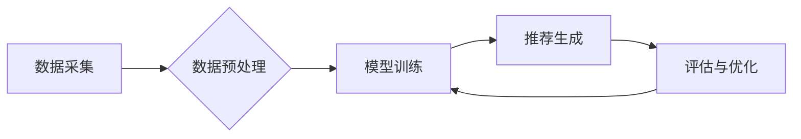

                 

## 深度学习在搜索推荐系统中的应用

> 关键词：深度学习、推荐系统、搜索引擎、用户行为、协同过滤、神经网络、自然语言处理

## 1. 背景介绍

在信息爆炸的时代，海量数据和用户需求的日益复杂，传统的搜索推荐系统面临着巨大的挑战。传统的基于关键词匹配和协同过滤的推荐算法难以捕捉用户细粒度的兴趣和行为模式，推荐结果往往缺乏个性化和精准度。深度学习作为一种强大的机器学习方法，凭借其强大的特征学习能力和非线性表达能力，为搜索推荐系统的优化提供了新的思路和方法。

深度学习在搜索推荐系统中的应用，主要体现在以下几个方面：

* **个性化推荐:** 深度学习模型能够学习用户历史行为、偏好和兴趣等信息，并生成更精准、更个性化的推荐结果。
* **内容理解:** 深度学习可以用于理解搜索查询和推荐内容的语义，提高搜索结果的准确性和相关性。
* **跨模态推荐:** 深度学习可以融合文本、图像、视频等多种模态数据，提供更丰富的推荐体验。
* **欺诈检测:** 深度学习可以用于识别恶意行为和欺诈活动，保障推荐系统的安全性和可靠性。

## 2. 核心概念与联系

搜索推荐系统本质上是一个信息匹配和排序的过程，深度学习通过构建复杂的网络结构，学习用户和物品之间的潜在关系，从而实现精准的推荐。

**2.1 推荐系统架构**

推荐系统通常由以下几个模块组成：

* **数据采集:** 收集用户行为数据、物品信息等数据。
* **数据预处理:** 对收集到的数据进行清洗、转换、特征提取等处理。
* **模型训练:** 利用深度学习算法训练推荐模型。
* **推荐生成:** 根据用户特征和物品信息，生成推荐结果。
* **评估与优化:** 对推荐结果进行评估，并根据评估结果优化模型参数。

**2.2 深度学习在推荐系统中的应用**

深度学习在推荐系统中的应用主要包括以下几种算法：

* **协同过滤:** 基于用户-物品交互矩阵，预测用户对物品的评分或偏好。
* **内容过滤:** 基于物品的特征信息，推荐与用户兴趣相符的物品。
* **混合推荐:** 结合协同过滤和内容过滤的优点，实现更精准的推荐。
* **深度神经网络:** 利用多层神经网络，学习用户和物品之间的复杂关系。

**2.3 Mermaid 流程图**



## 3. 核心算法原理 & 具体操作步骤

### 3.1 算法原理概述

协同过滤算法是深度学习在推荐系统中最常用的算法之一。它基于用户的历史行为数据，预测用户对未交互过的物品的偏好。协同过滤算法可以分为两种类型：基于用户的协同过滤和基于物品的协同过滤。

* **基于用户的协同过滤:** 寻找与当前用户兴趣相似的用户，并推荐他们喜欢的物品。
* **基于物品的协同过滤:** 寻找与当前用户交互过的物品相似的物品，并推荐这些物品。

### 3.2 算法步骤详解

**基于用户的协同过滤算法步骤:**

1. **构建用户-物品交互矩阵:** 将用户和物品作为矩阵的行和列，用户对物品的交互行为（例如评分、点击、购买）作为矩阵元素。
2. **计算用户相似度:** 使用余弦相似度、皮尔逊相关系数等方法计算用户之间的相似度。
3. **预测用户对物品的偏好:** 根据与当前用户相似度最高的用户的评分或偏好，预测当前用户对目标物品的偏好。

**基于物品的协同过滤算法步骤:**

1. **构建用户-物品交互矩阵:** 同样构建用户-物品交互矩阵。
2. **计算物品相似度:** 使用余弦相似度、皮尔逊相关系数等方法计算物品之间的相似度。
3. **预测用户对物品的偏好:** 根据与当前用户交互过的物品相似度最高的物品，预测当前用户对目标物品的偏好。

### 3.3 算法优缺点

**优点:**

* 能够捕捉用户隐性的偏好和兴趣。
* 能够推荐与用户兴趣相符的物品。

**缺点:**

* 数据稀疏性问题: 当用户交互数据较少时，算法效果会下降。
* 冷启动问题: 新用户和新物品难以获得推荐。
* 算法复杂度较高。

### 3.4 算法应用领域

协同过滤算法广泛应用于以下领域:

* **电子商务:** 商品推荐、用户画像
* **社交网络:** 朋友推荐、内容推荐
* **音乐流媒体:** 歌曲推荐、音乐发现
* **视频网站:** 视频推荐、用户个性化内容

## 4. 数学模型和公式 & 详细讲解 & 举例说明

### 4.1 数学模型构建

协同过滤算法的核心是构建用户-物品交互矩阵，并利用矩阵分解技术学习用户和物品之间的潜在关系。

**用户-物品交互矩阵:**

$$
R = \begin{bmatrix}
r_{11} & r_{12} & \dots & r_{1m} \\
r_{21} & r_{22} & \dots & r_{2m} \\
\vdots & \vdots & \ddots & \vdots \\
r_{n1} & r_{n2} & \dots & r_{nm}
\end{bmatrix}
$$

其中，$r_{ij}$ 表示用户 $i$ 对物品 $j$ 的评分或偏好。

**矩阵分解模型:**

$$
R \approx U V^T
$$

其中，$U$ 是用户特征矩阵，$V$ 是物品特征矩阵。

### 4.2 公式推导过程

通过最小化预测误差，可以学习到最优的用户特征矩阵 $U$ 和物品特征矩阵 $V$。

$$
\min_U \min_V \sum_{i,j} (r_{ij} - u_i v_j^T)^2
$$

其中，$u_i$ 是用户 $i$ 的特征向量，$v_j$ 是物品 $j$ 的特征向量。

### 4.3 案例分析与讲解

假设我们有一个用户-物品交互矩阵，其中用户 $i$ 对物品 $j$ 的评分为 $r_{ij}$。

我们可以使用矩阵分解模型将这个矩阵分解成用户特征矩阵 $U$ 和物品特征矩阵 $V$。

然后，我们可以利用学习到的用户特征和物品特征，预测用户 $i$ 对物品 $j$ 的评分。

$$
\hat{r}_{ij} = u_i v_j^T
$$

其中，$\hat{r}_{ij}$ 是预测的评分。

## 5. 项目实践：代码实例和详细解释说明

### 5.1 开发环境搭建

* Python 3.x
* TensorFlow 或 PyTorch
* Jupyter Notebook

### 5.2 源代码详细实现

```python
import tensorflow as tf

# 定义用户-物品交互矩阵
ratings = tf.constant([[5, 4, 3],
                      [4, 5, 2],
                      [3, 2, 5]])

# 定义用户特征矩阵和物品特征矩阵
num_users = ratings.shape[0]
num_items = ratings.shape[1]
latent_dim = 10

user_embeddings = tf.Variable(tf.random.normal([num_users, latent_dim]))
item_embeddings = tf.Variable(tf.random.normal([num_items, latent_dim]))

# 计算预测评分
predictions = tf.matmul(user_embeddings, item_embeddings, transpose_b=True)

# 定义损失函数
loss = tf.reduce_mean(tf.square(ratings - predictions))

# 定义优化器
optimizer = tf.keras.optimizers.Adam()

# 训练模型
for epoch in range(100):
    with tf.GradientTape() as tape:
        loss_value = loss
    gradients = tape.gradient(loss_value, [user_embeddings, item_embeddings])
    optimizer.apply_gradients(zip(gradients, [user_embeddings, item_embeddings]))

# 打印损失值
print(f"Loss: {loss_value.numpy()}")
```

### 5.3 代码解读与分析

* 首先，我们定义了用户-物品交互矩阵和潜在维度。
* 然后，我们创建了用户特征矩阵和物品特征矩阵，并初始化为随机值。
* 接着，我们计算了预测评分，并定义了损失函数。
* 最后，我们使用 Adam 优化器训练模型，并打印损失值。

### 5.4 运行结果展示

训练完成后，我们可以使用学习到的用户特征和物品特征，预测用户对物品的评分。

## 6. 实际应用场景

### 6.1 电子商务推荐

深度学习在电子商务推荐系统中应用广泛，例如：

* **商品推荐:** 根据用户的浏览历史、购买记录、购物车内容等信息，推荐与用户兴趣相符的商品。
* **个性化营销:** 根据用户的特征和行为，进行个性化的广告投放和促销活动。
* **用户画像:** 利用深度学习模型学习用户的兴趣偏好、消费习惯等信息，构建用户画像。

### 6.2 社交网络推荐

深度学习在社交网络推荐系统中应用于：

* **朋友推荐:** 根据用户的兴趣爱好、社交关系等信息，推荐潜在的朋友。
* **内容推荐:** 根据用户的阅读历史、点赞记录等信息，推荐与用户兴趣相符的内容。
* **群组推荐:** 根据用户的兴趣爱好、社交关系等信息，推荐用户可能感兴趣的群组。

### 6.3 音乐流媒体推荐

深度学习在音乐流媒体推荐系统中应用于：

* **歌曲推荐:** 根据用户的播放历史、收藏记录等信息，推荐与用户兴趣相符的歌曲。
* **音乐发现:** 利用深度学习模型学习音乐的风格、特征等信息，推荐用户可能未听过的音乐。
* **个性化播放列表:** 根据用户的喜好，自动生成个性化的播放列表。

### 6.4 未来应用展望

随着深度学习技术的不断发展，其在搜索推荐系统中的应用将更加广泛和深入。

* **跨模态推荐:** 深度学习可以融合文本、图像、视频等多种模态数据，提供更丰富的推荐体验。
* **个性化搜索:** 深度学习可以理解用户的搜索意图，提供更精准的搜索结果。
* **动态推荐:** 深度学习可以根据用户的实时行为和环境变化，动态调整推荐结果。

## 7. 工具和资源推荐

### 7.1 学习资源推荐

* **书籍:**
    * Deep Learning by Ian Goodfellow, Yoshua Bengio, and Aaron Courville
    * Hands-On Machine Learning with Scikit-Learn, Keras & TensorFlow by Aurélien Géron
* **在线课程:**
    * Deep Learning Specialization by Andrew Ng (Coursera)
    * Fast.ai Deep Learning Course
* **博客和网站:**
    * Towards Data Science
    * Machine Learning Mastery

### 7.2 开发工具推荐

* **TensorFlow:** 开源深度学习框架，提供丰富的 API 和工具。
* **PyTorch:** 开源深度学习框架，以其灵活性和易用性而闻名。
* **Keras:** 高级深度学习 API，可以运行在 TensorFlow、Theano 或 CNTK 后端。

### 7.3 相关论文推荐

* **Collaborative Filtering for Implicit Feedback Datasets** by Hu, Y., Koren, Y., & Volinsky, C. (2008)
* **Deep Learning Recommendations for Everyone** by  Herlocker, J. L., Konstan, J. A., & Riedl, J. (2004)
* **Neural Collaborative Filtering** by He, X., Liao, L., Chen, H., & Ma, W. Y. (2017)

## 8. 总结：未来发展趋势与挑战

### 8.1 研究成果总结

深度学习在搜索推荐系统中的应用取得了显著的成果，能够有效提升推荐系统的精准度和个性化程度。

### 8.2 未来发展趋势

* **更深层次的模型:** 研究更深层次的深度神经网络，例如 Transformer、Graph Neural Networks 等，以更好地学习用户和物品之间的复杂关系。
* **多模态融合:** 将文本、图像、视频等多种模态数据融合，提供更丰富的推荐体验。
* **联邦学习:** 利用联邦学习技术，在保护用户隐私的前提下进行模型训练。

### 8.3 面临的挑战

* **数据稀疏性:** 现实世界中的用户-物品交互数据往往是稀疏的，如何有效处理数据稀疏性问题是深度学习在推荐系统中的一个重要挑战。
* **冷启动问题:** 新用户和新物品难以获得推荐，如何解决冷启动问题也是一个需要解决的难题。
* **可解释性:** 深度学习模型的决策过程往往难以解释，如何提高模型的可解释性，帮助用户理解推荐结果，也是一个重要的研究方向。

### 8.4 研究展望

未来，深度学习在搜索推荐系统中的应用将继续深入发展，为用户提供更精准、更个性化的推荐体验。


## 9. 附录：常见问题与解答

**Q1: 深度学习推荐系统与传统推荐系统的区别是什么？**

**A1:** 深度学习推荐系统利用深度神经网络学习用户和物品之间的复杂关系，能够捕捉用户隐性的偏好和兴趣，而传统推荐系统主要依赖于基于规则或统计的方法，难以捕捉用户细粒度的兴趣。

**Q2: 深度学习推荐系统有哪些常见的算法？**

**A2:** 深度学习推荐系统中常见的算法包括协同过滤、内容过滤、混合推荐、深度神经网络等。

**Q3: 如何评估深度学习推荐系统的性能？**

**A3:** 深度学习推荐系统的性能通常通过指标如准确率、召回率、NDCG 等进行评估。

**Q4: 深度学习推荐系统有哪些应用场景？**

**A4:** 深度学习推荐系统广泛应用于电子商务、社交网络、音乐流媒体、视频网站等领域。

**作者：禅与计算机程序设计艺术 / Zen and the Art of Computer Programming**<end_of_turn>

