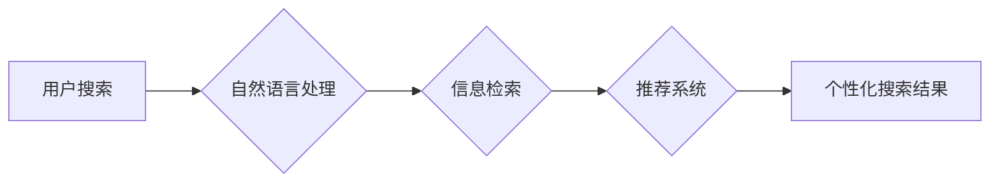

                 

## 深度学习在电商搜索引擎优化中的应用

> 关键词：深度学习、电商搜索引擎、推荐系统、自然语言处理、信息检索、用户行为分析、个性化搜索

## 1. 背景介绍

电商搜索引擎是电商平台的核心功能之一，它直接影响着用户购物体验和平台的商业成功。传统的电商搜索引擎主要依赖于关键词匹配和人工规则，在处理海量商品信息和用户搜索需求时存在诸多局限性，例如：

* **信息冗余和噪音:** 电商平台商品信息丰富多样，存在大量冗余信息和噪音，难以准确理解用户搜索意图。
* **语义理解能力不足:** 传统的关键词匹配方法难以理解用户搜索背后的语义需求，例如同义词、隐含含义等。
* **个性化推荐效果有限:**  传统的搜索引擎缺乏对用户个性化需求的理解，推荐结果缺乏针对性。

深度学习技术的出现为电商搜索引擎优化带来了新的机遇。深度学习算法能够自动学习数据中的复杂模式和关系，具有强大的语义理解和预测能力，能够有效解决传统搜索引擎面临的挑战。

## 2. 核心概念与联系

深度学习在电商搜索引擎优化中的应用主要涉及以下核心概念：

* **自然语言处理 (NLP):**  深度学习在NLP领域取得了突破性进展，能够理解和处理自然语言文本，例如文本分类、情感分析、关键词提取等。
* **信息检索 (IR):**  深度学习可以用于改进信息检索模型，例如学习用户搜索行为模式，提高搜索结果的准确性和相关性。
* **推荐系统:** 深度学习可以构建个性化推荐系统，根据用户的历史行为、偏好和上下文信息，推荐更符合用户需求的商品。

**核心概念架构图:**



## 3. 核心算法原理 & 具体操作步骤

### 3.1  算法原理概述

深度学习在电商搜索引擎优化中常用的算法包括：

* **卷积神经网络 (CNN):**  CNN擅长处理图像数据，在电商搜索引擎中可以用于商品图像识别和特征提取。
* **循环神经网络 (RNN):** RNN能够处理序列数据，例如用户搜索历史和商品描述，可以用于理解用户搜索意图和商品语义。
* **Transformer:** Transformer是一种新型的深度学习架构，具有强大的语义理解能力，可以用于文本分类、机器翻译和信息检索等任务。

### 3.2  算法步骤详解

以Transformer为例，其在电商搜索引擎优化中的具体操作步骤如下：

1. **数据预处理:**  收集电商平台的商品信息、用户搜索记录、商品评论等数据，进行清洗、格式化和编码。
2. **特征提取:**  使用预训练的Transformer模型对商品信息和用户搜索记录进行编码，提取其语义特征。
3. **搜索意图理解:**  根据用户的搜索词和历史行为，使用Transformer模型预测用户的搜索意图，例如用户想要购买哪种类型的商品、价格范围等。
4. **商品推荐:**  根据用户的搜索意图和商品特征，使用推荐算法对商品进行排序和推荐。
5. **结果展示:**  将推荐结果以列表、卡片等形式展示给用户。

### 3.3  算法优缺点

**优点:**

* **语义理解能力强:** Transformer模型能够捕捉文本中的长距离依赖关系，具有更强的语义理解能力。
* **个性化推荐效果好:**  可以根据用户的历史行为和偏好进行个性化推荐。
* **可扩展性强:**  可以根据需要添加新的数据和特征，不断提升模型性能。

**缺点:**

* **训练成本高:**  Transformer模型参数量大，训练需要大量的计算资源和时间。
* **数据依赖性强:**  模型性能依赖于训练数据的质量和数量。
* **解释性差:**  深度学习模型的决策过程较为复杂，难以解释其推荐结果背后的逻辑。

### 3.4  算法应用领域

深度学习在电商搜索引擎优化中的应用领域广泛，例如：

* **商品搜索:**  提高商品搜索的准确性和相关性。
* **商品推荐:**  根据用户的兴趣和需求推荐相关商品。
* **用户画像:**  构建用户画像，了解用户的消费习惯和偏好。
* **广告投放:**  精准投放广告，提高广告效果。

## 4. 数学模型和公式 & 详细讲解 & 举例说明

### 4.1  数学模型构建

Transformer模型的核心是自注意力机制 (Self-Attention)，它能够学习文本中的长距离依赖关系。

**自注意力机制公式:**

$$
Attention(Q, K, V) = \frac{exp(Q \cdot K^T / \sqrt{d_k})}{exp(Q \cdot K^T / \sqrt{d_k})} \cdot V
$$

其中：

* $Q$：查询矩阵
* $K$：键矩阵
* $V$：值矩阵
* $d_k$：键向量的维度

**解释:**

自注意力机制通过计算查询向量 $Q$ 与键向量 $K$ 的点积，并使用 softmax 函数进行归一化，得到每个键向量的重要性权重。然后，将这些权重与值向量 $V$ 进行加权求和，得到最终的输出。

### 4.2  公式推导过程

自注意力机制的公式推导过程较为复杂，涉及到线性变换、矩阵乘法和 softmax 函数等操作。

**简要推导过程:**

1. 将输入序列 $X$ 分别线性变换为查询矩阵 $Q$、键矩阵 $K$ 和值矩阵 $V$。
2. 计算查询向量 $Q$ 与每个键向量 $K$ 的点积，并使用 softmax 函数进行归一化，得到每个键向量的注意力权重。
3. 将注意力权重与值向量 $V$ 进行加权求和，得到最终的输出。

### 4.3  案例分析与讲解

假设我们有一个商品描述序列：

"这款手机拥有强大的性能，屏幕清晰，拍照效果出色。"

使用自注意力机制可以学习到每个词语之间的关系，例如 "性能" 和 "强大" 之间存在正向关系，"屏幕" 和 "清晰" 之间也存在正向关系。

## 5. 项目实践：代码实例和详细解释说明

### 5.1  开发环境搭建

* Python 3.6+
* TensorFlow 或 PyTorch 深度学习框架
* CUDA 和 cuDNN (可选，用于GPU加速)

### 5.2  源代码详细实现

```python
import tensorflow as tf

# 定义Transformer模型
class Transformer(tf.keras.Model):
    def __init__(self, vocab_size, embedding_dim, num_heads, num_layers):
        super(Transformer, self).__init__()
        self.embedding = tf.keras.layers.Embedding(vocab_size, embedding_dim)
        self.transformer_layers = tf.keras.layers.StackedRNNCells([
            tf.keras.layers.MultiHeadAttention(num_heads=num_heads, key_dim=embedding_dim)
            for _ in range(num_layers)
        ])

    def call(self, inputs):
        embeddings = self.embedding(inputs)
        outputs = self.transformer_layers(embeddings)
        return outputs

# 实例化Transformer模型
model = Transformer(vocab_size=10000, embedding_dim=128, num_heads=8, num_layers=6)

# 训练模型
model.compile(optimizer='adam', loss='mse')
model.fit(x_train, y_train, epochs=10)

# 预测结果
predictions = model.predict(x_test)
```

### 5.3  代码解读与分析

* **模型定义:**  定义了一个Transformer模型，包含嵌入层、多头注意力层和堆叠的RNN层。
* **数据预处理:**  将商品描述序列转换为数字向量，作为模型的输入。
* **模型训练:**  使用Adam优化器和均方误差损失函数训练模型。
* **模型预测:**  使用训练好的模型对新的商品描述序列进行预测。

### 5.4  运行结果展示

训练完成后，可以评估模型的性能，例如使用准确率、召回率等指标。

## 6. 实际应用场景

深度学习在电商搜索引擎优化中的应用场景广泛，例如：

* **淘宝搜索:**  淘宝使用深度学习技术提升商品搜索的准确性和相关性，并提供个性化商品推荐。
* **京东搜索:**  京东也采用深度学习技术，构建个性化推荐系统，提高用户购物体验。
* **拼多多搜索:**  拼多多利用深度学习技术分析用户行为，精准推荐商品，提高转化率。

### 6.4  未来应用展望

未来，深度学习在电商搜索引擎优化中的应用将更加深入和广泛，例如：

* **多模态搜索:**  结合文本、图像、视频等多模态数据进行搜索，提供更丰富的搜索结果。
* **实时搜索:**  利用实时数据流，实时更新搜索结果，提供更及时和准确的信息。
* **跨语言搜索:**  支持多语言搜索，满足全球用户的需求。

## 7. 工具和资源推荐

### 7.1  学习资源推荐

* **深度学习入门书籍:**  《深度学习》 (Ian Goodfellow, Yoshua Bengio, Aaron Courville)
* **深度学习在线课程:**  Coursera、edX、Udacity 等平台提供深度学习课程。
* **深度学习社区:**  Kaggle、Stack Overflow 等社区提供深度学习相关的讨论和资源。

### 7.2  开发工具推荐

* **TensorFlow:**  Google 开发的开源深度学习框架。
* **PyTorch:**  Facebook 开发的开源深度学习框架。
* **Keras:**  基于 TensorFlow 或 Theano 的高层深度学习 API。

### 7.3  相关论文推荐

* **Attention Is All You Need:**  https://arxiv.org/abs/1706.03762
* **BERT: Pre-training of Deep Bidirectional Transformers for Language Understanding:**  https://arxiv.org/abs/1810.04805

## 8. 总结：未来发展趋势与挑战

### 8.1  研究成果总结

深度学习在电商搜索引擎优化领域取得了显著成果，例如提高了搜索结果的准确性和相关性，增强了个性化推荐效果。

### 8.2  未来发展趋势

未来，深度学习在电商搜索引擎优化领域的应用将更加智能化、个性化和自动化。

### 8.3  面临的挑战

* **数据质量和隐私问题:**  深度学习模型依赖于高质量的数据，而电商平台的数据往往存在噪声和隐私问题。
* **模型解释性和可信度:**  深度学习模型的决策过程较为复杂，难以解释其推荐结果背后的逻辑，这可能会影响用户的信任度。
* **计算资源和成本:**  训练大型深度学习模型需要大量的计算资源和时间，这可能会成为一些中小电商平台的瓶颈。

### 8.4  研究展望

未来研究方向包括：

* **开发更鲁棒和高效的深度学习算法:**  提高模型的泛化能力和效率，降低训练成本。
* **解决数据质量和隐私问题:**  开发新的数据处理和隐私保护技术，保障数据安全和用户隐私。
* **提升模型解释性和可信度:**  研究可解释的深度学习模型，提高模型的透明度和可信度。


## 9. 附录：常见问题与解答

**Q1: 深度学习在电商搜索引擎优化中有哪些优势？**

**A1:** 深度学习能够学习数据中的复杂模式和关系，具有强大的语义理解和预测能力，可以提高搜索结果的准确性和相关性，增强个性化推荐效果。

**Q2: 深度学习在电商搜索引擎优化中有哪些挑战？**

**A2:** 数据质量和隐私问题、模型解释性和可信度、计算资源和成本等都是深度学习在电商搜索引擎优化中面临的挑战。

**Q3: 如何学习深度学习？**

**A3:** 可以阅读深度学习入门书籍、参加在线课程、加入深度学习社区等方式学习深度学习。


作者：禅与计算机程序设计艺术 / Zen and the Art of Computer Programming 
<end_of_turn>

