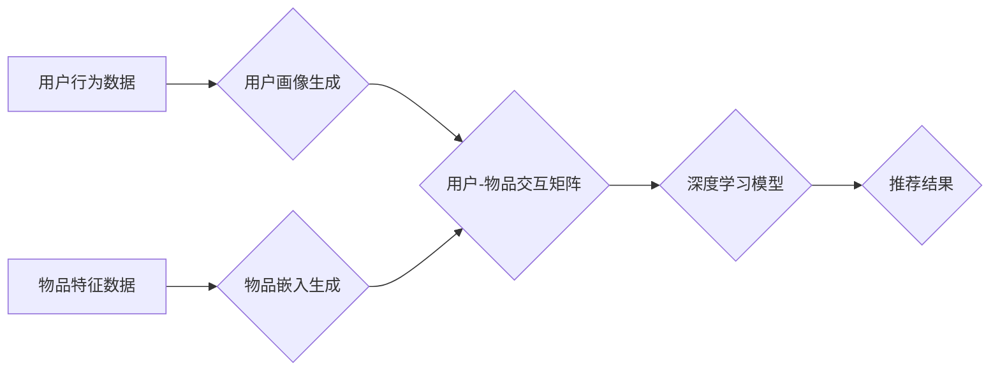

                 

## 深度学习如何革新传统推荐算法

> 关键词：深度学习、推荐算法、协同过滤、内容过滤、神经网络、用户画像、个性化推荐

## 1. 背景介绍

推荐系统是互联网时代的重要组成部分，旨在根据用户的历史行为、偏好和兴趣，预测用户可能感兴趣的内容，并将其推荐给用户。传统推荐算法主要依赖于协同过滤和内容过滤两种方法。协同过滤算法通过分析用户对相同物品的评分或行为相似性，推荐与用户相似用户的喜好物品。内容过滤算法则根据物品的特征和用户偏好的特征进行匹配，推荐与用户兴趣相符的物品。

然而，传统推荐算法存在一些局限性：

* **数据稀疏性问题:** 协同过滤算法需要大量用户行为数据，而现实世界中用户行为数据往往稀疏，导致推荐效果不佳。
* **冷启动问题:** 新用户或新物品缺乏历史数据，难以进行有效的推荐。
* **可解释性差:** 传统算法的推荐结果难以解释，用户难以理解推荐理由。

深度学习的出现为推荐算法带来了新的机遇。深度学习算法能够自动学习用户和物品的复杂特征，克服传统算法的局限性，实现更精准、个性化的推荐。

## 2. 核心概念与联系

深度学习推荐算法的核心概念包括：

* **用户画像:** 通过深度学习模型，将用户的历史行为、偏好、兴趣等信息转化为用户画像，刻画用户的特征和属性。
* **物品嵌入:** 将物品的特征信息转化为低维向量表示，方便模型进行计算和比较。
* **神经网络模型:** 使用深度神经网络结构，学习用户和物品之间的关系，预测用户对物品的兴趣。

**深度学习推荐算法架构**



## 3. 核心算法原理 & 具体操作步骤

### 3.1  算法原理概述

深度学习推荐算法主要包括以下几种类型：

* **协同过滤神经网络:** 基于协同过滤原理，使用神经网络学习用户和物品之间的关系，预测用户对物品的评分或点击概率。
* **内容过滤神经网络:** 基于内容过滤原理，使用神经网络学习用户和物品的特征，预测用户对物品的兴趣。
* **混合推荐模型:** 将协同过滤和内容过滤相结合，使用神经网络学习用户和物品的多种特征，实现更精准的推荐。

### 3.2  算法步骤详解

以协同过滤神经网络为例，其具体操作步骤如下：

1. **数据预处理:** 收集用户行为数据，例如用户对物品的评分、点击、购买等行为，并进行清洗、转换和特征工程。
2. **用户画像生成:** 使用深度学习模型，例如多层感知机 (MLP) 或循环神经网络 (RNN)，将用户的历史行为数据转化为用户画像，刻画用户的特征和属性。
3. **物品嵌入生成:** 使用深度学习模型，例如 Word2Vec 或 GloVe，将物品的特征信息转化为低维向量表示，方便模型进行计算和比较。
4. **用户-物品交互矩阵构建:** 将用户画像和物品嵌入组合成用户-物品交互矩阵，其中每个元素表示用户对物品的兴趣程度。
5. **深度学习模型训练:** 使用深度学习模型，例如深度神经网络 (DNN) 或卷积神经网络 (CNN)，学习用户-物品交互矩阵，预测用户对物品的评分或点击概率。
6. **推荐结果生成:** 根据模型的预测结果，为用户推荐感兴趣的物品。

### 3.3  算法优缺点

**优点:**

* **精准度高:** 深度学习算法能够自动学习用户和物品的复杂特征，提高推荐精准度。
* **个性化强:** 深度学习模型可以根据用户的个性化特征进行推荐，提供更个性化的体验。
* **冷启动能力强:** 深度学习算法可以利用用户的上下文信息和物品的相似性进行推荐，缓解冷启动问题。

**缺点:**

* **数据需求高:** 深度学习算法需要大量数据进行训练，数据质量和数量直接影响模型性能。
* **计算资源消耗大:** 深度学习模型训练需要大量的计算资源，成本较高。
* **可解释性差:** 深度学习模型的决策过程较为复杂，难以解释推荐结果。

### 3.4  算法应用领域

深度学习推荐算法广泛应用于以下领域：

* **电商推荐:** 为用户推荐商品、优惠券、促销活动等。
* **视频推荐:** 为用户推荐视频、电视剧、电影等。
* **音乐推荐:** 为用户推荐歌曲、专辑、音乐人等。
* **新闻推荐:** 为用户推荐新闻、文章、博客等。
* **社交推荐:** 为用户推荐好友、群组、活动等。

## 4. 数学模型和公式 & 详细讲解 & 举例说明

### 4.1  数学模型构建

协同过滤神经网络的数学模型可以表示为一个多层感知机 (MLP)，其结构如下：

* **输入层:** 用户和物品的嵌入向量。
* **隐藏层:** 多个全连接层，用于学习用户和物品之间的关系。
* **输出层:** 一个神经元，输出用户对物品的评分或点击概率。

### 4.2  公式推导过程

假设用户 $u$ 对物品 $i$ 的评分为 $r_{ui}$，则协同过滤神经网络的损失函数可以定义为：

$$
L = \sum_{u,i} (r_{ui} - \hat{r}_{ui})^2
$$

其中，$\hat{r}_{ui}$ 为模型预测的用户 $u$ 对物品 $i$ 的评分。

模型的训练目标是最小化损失函数，可以使用梯度下降算法进行优化。

### 4.3  案例分析与讲解

假设我们有一个包含用户和物品评分数据的矩阵 $R$，其中 $R_{ui}$ 表示用户 $u$ 对物品 $i$ 的评分。

我们可以使用协同过滤神经网络将用户和物品嵌入到低维空间中，并学习用户-物品交互矩阵。

训练完成后，我们可以使用模型预测用户对新物品的评分，并推荐用户可能感兴趣的物品。

## 5. 项目实践：代码实例和详细解释说明

### 5.1  开发环境搭建

推荐系统开发环境通常包括以下软件：

* Python 编程语言
* TensorFlow 或 PyTorch 深度学习框架
* Scikit-learn 机器学习库
* Pandas 数据处理库
* Matplotlib 数据可视化库

### 5.2  源代码详细实现

以下是一个使用 TensorFlow 实现协同过滤神经网络的简单代码示例：

```python
import tensorflow as tf

# 定义模型
model = tf.keras.Sequential([
    tf.keras.layers.Embedding(input_dim=num_users, output_dim=embedding_dim),
    tf.keras.layers.Embedding(input_dim=num_items, output_dim=embedding_dim),
    tf.keras.layers.Multiply(),
    tf.keras.layers.Flatten(),
    tf.keras.layers.Dense(1)
])

# 编译模型
model.compile(optimizer='adam', loss='mse')

# 训练模型
model.fit(X_train, y_train, epochs=10)

# 预测评分
predictions = model.predict(X_test)
```

### 5.3  代码解读与分析

* `Embedding` 层将用户和物品的ID转换为低维向量表示。
* `Multiply` 层将用户和物品的嵌入向量相乘，得到用户对物品的兴趣程度。
* `Flatten` 层将多维向量转换为一维向量。
* `Dense` 层是一个全连接层，用于预测用户对物品的评分。

### 5.4  运行结果展示

训练完成后，我们可以使用模型预测用户对新物品的评分，并根据预测结果进行推荐。

## 6. 实际应用场景

深度学习推荐算法在实际应用场景中取得了显著的成果，例如：

* **Netflix:** 使用深度学习算法推荐电影和电视剧，提高用户观看体验。
* **Amazon:** 使用深度学习算法推荐商品，提高用户购买率。
* **Spotify:** 使用深度学习算法推荐音乐，提高用户音乐发现率。

### 6.4  未来应用展望

未来，深度学习推荐算法将朝着以下方向发展：

* **更精准的推荐:** 利用更先进的深度学习模型和算法，提高推荐精准度。
* **更个性化的推荐:** 结合用户多维特征，提供更个性化的推荐体验。
* **更可解释的推荐:** 研究更可解释的深度学习模型，帮助用户理解推荐理由。
* **跨平台推荐:** 将用户行为数据整合到跨平台推荐系统中，提供更全面的推荐服务。

## 7. 工具和资源推荐

### 7.1  学习资源推荐

* **书籍:**
    * Deep Learning by Ian Goodfellow, Yoshua Bengio, and Aaron Courville
    * Recommender Systems Handbook by  Koren, Bell, and Volinsky
* **在线课程:**
    * Deep Learning Specialization by Andrew Ng on Coursera
    * Recommender Systems by  University of Washington on Coursera

### 7.2  开发工具推荐

* **TensorFlow:** https://www.tensorflow.org/
* **PyTorch:** https://pytorch.org/
* **Scikit-learn:** https://scikit-learn.org/

### 7.3  相关论文推荐

* **Collaborative Filtering with Deep Learning:** https://arxiv.org/abs/1604.00847
* **Deep Learning for Recommender Systems:** https://arxiv.org/abs/1708.05031

## 8. 总结：未来发展趋势与挑战

### 8.1  研究成果总结

深度学习推荐算法取得了显著的成果，提高了推荐精准度和个性化程度，为用户提供了更优质的体验。

### 8.2  未来发展趋势

未来，深度学习推荐算法将朝着更精准、更个性化、更可解释的方向发展。

### 8.3  面临的挑战

深度学习推荐算法仍然面临一些挑战，例如数据稀疏性、冷启动问题、可解释性差等。

### 8.4  研究展望

未来研究将重点关注解决这些挑战，开发更先进的深度学习推荐算法，为用户提供更智能、更个性化的推荐服务。

## 9. 附录：常见问题与解答

* **Q: 深度学习推荐算法需要多少数据才能训练？**

* **A:** 深度学习算法对数据的需求较高，一般需要百万级甚至亿级的数据才能达到较好的效果。

* **Q: 如何解决深度学习推荐算法的冷启动问题？**

* **A:** 可以利用用户的上下文信息、物品的相似性等方法进行推荐，缓解冷启动问题。

* **Q: 如何提高深度学习推荐算法的可解释性？**

* **A:** 可以研究更可解释的深度学习模型，例如可解释深度学习 (XAI) 方法。


作者：禅与计算机程序设计艺术 / Zen and the Art of Computer Programming 
<end_of_turn>

