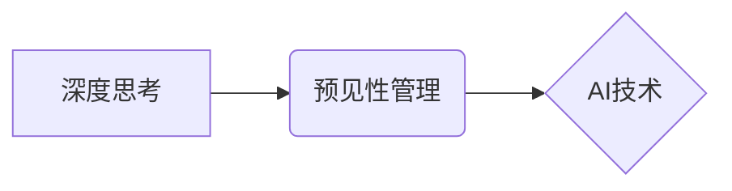

                 

## 深度思考与管理预见性的关系

> 关键词：深度思考、预见性管理、人工智能、数据分析、决策支持、未来趋势、战略规划、风险管理

## 1. 背景介绍

在当今瞬息万变的时代，面对日新月异的技术革新和复杂的市场环境，企业和个人都需要具备强大的预见性，才能在竞争中立于不败之地。预见性管理是指通过深度思考和分析，洞察未来趋势，并提前制定相应的策略和行动计划，以应对潜在的挑战和抓住机遇。

深度思考是预见性管理的基础。它要求我们跳出固有的思维模式，深入挖掘问题的本质，并从多角度、多层次进行分析和思考。只有通过深度思考，才能形成对未来的准确判断和预见，从而制定有效的预见性管理策略。

人工智能（AI）技术的快速发展为预见性管理提供了强大的工具和手段。AI算法能够处理海量数据，识别复杂模式，并进行预测分析，为决策者提供更精准、更全面的信息支持。

## 2. 核心概念与联系

**2.1 预见性管理**

预见性管理是一个系统性的管理理念，它强调通过对未来趋势的预测和分析，提前制定应对策略，以实现组织目标。

**2.2 深度思考**

深度思考是一种批判性思维方式，它要求我们深入挖掘问题的本质，跳出固有的思维模式，从多角度、多层次进行分析和思考。

**2.3 AI技术**

人工智能技术能够处理海量数据，识别复杂模式，并进行预测分析，为预见性管理提供强大的工具和手段。

**2.4 联系**

深度思考是预见性管理的基础，AI技术为深度思考提供了强大的工具支持。通过深度思考，我们可以识别未来趋势，并利用AI技术进行数据分析和预测，从而制定更有效的预见性管理策略。



## 3. 核心算法原理 & 具体操作步骤

**3.1 算法原理概述**

预见性管理的核心算法原理是基于数据分析和预测模型。通过收集和分析历史数据、市场趋势和外部环境变化等信息，建立预测模型，并对未来进行预测。常用的预测模型包括：

* **时间序列分析:** 用于预测时间相关数据，例如销售额、用户数量等。
* **回归分析:** 用于预测连续型变量，例如房价、股票价格等。
* **分类分析:** 用于预测类别型变量，例如客户流失、产品销量等。
* **神经网络:** 用于处理复杂数据，并进行更精准的预测。

**3.2 算法步骤详解**

1. **数据收集:** 收集相关数据，包括历史数据、市场趋势、外部环境变化等。
2. **数据预处理:** 对收集到的数据进行清洗、转换和特征工程，以提高模型的准确性。
3. **模型选择:** 根据预测目标和数据特点选择合适的预测模型。
4. **模型训练:** 使用训练数据训练模型，并调整模型参数，以获得最佳的预测效果。
5. **模型评估:** 使用测试数据评估模型的预测精度，并进行模型优化。
6. **预测:** 使用训练好的模型对未来进行预测。
7. **决策:** 根据预测结果制定相应的策略和行动计划。

**3.3 算法优缺点**

* **优点:** 能够处理海量数据，识别复杂模式，并进行精准预测。
* **缺点:** 需要大量数据进行训练，模型训练过程复杂，需要专业知识和技术支持。

**3.4 算法应用领域**

* **市场预测:** 预测市场需求、产品销量、竞争对手行为等。
* **风险管理:** 识别和评估潜在风险，制定风险应对策略。
* **战略规划:** 预测未来趋势，制定长期发展战略。
* **客户关系管理:** 预测客户行为、客户流失风险等。

## 4. 数学模型和公式 & 详细讲解 & 举例说明

**4.1 数学模型构建**

预见性管理的数学模型通常基于统计学和概率论，例如时间序列模型、回归模型、分类模型等。这些模型通过数学公式来描述数据之间的关系，并进行预测。

**4.2 公式推导过程**

例如，时间序列模型ARIMA（自回归移动平均模型）的公式推导过程如下：

* **AR(p):** 自回归项，表示当前时间点的值与过去p个时间点的值的线性关系。
* **MA(q):** 移动平均项，表示当前时间点的值与过去q个时间点的误差值的线性关系。
* **I(d):** 差分项，表示对时间序列进行d次差分，以消除趋势和季节性。

ARIMA(p,d,q)模型的公式可以表示为：

$$y_t = c + \phi_1 y_{t-1} + \phi_2 y_{t-2} + ... + \phi_p y_{t-p} + \theta_1 \epsilon_{t-1} + \theta_2 \epsilon_{t-2} + ... + \theta_q \epsilon_{t-q} + \epsilon_t$$

其中：

* $y_t$ 是当前时间点的观测值。
* $c$ 是截距项。
* $\phi_i$ 是自回归系数。
* $\theta_i$ 是移动平均系数。
* $\epsilon_t$ 是白噪声误差项。

**4.3 案例分析与讲解**

例如，一家电商公司想要预测未来三个月的销售额。可以使用ARIMA模型对历史销售数据进行分析和预测。

通过对历史数据进行分析，可以确定ARIMA模型的参数p、d、q。然后，使用训练好的模型对未来三个月的销售额进行预测。

## 5. 项目实践：代码实例和详细解释说明

**5.1 开发环境搭建**

* Python 3.x
* Jupyter Notebook
* pandas
* scikit-learn
* matplotlib

**5.2 源代码详细实现**

```python
import pandas as pd
from sklearn.model_selection import train_test_split
from sklearn.linear_model import LinearRegression
from sklearn.metrics import mean_squared_error

# 加载数据
data = pd.read_csv('sales_data.csv')

# 数据预处理
X = data[['month', 'advertising_spend']]
y = data['sales']

# 将数据分成训练集和测试集
X_train, X_test, y_train, y_test = train_test_split(X, y, test_size=0.2, random_state=42)

# 创建线性回归模型
model = LinearRegression()

# 训练模型
model.fit(X_train, y_train)

# 预测测试集数据
y_pred = model.predict(X_test)

# 计算模型精度
mse = mean_squared_error(y_test, y_pred)
print(f'Mean Squared Error: {mse}')

# 可视化预测结果
import matplotlib.pyplot as plt
plt.scatter(y_test, y_pred)
plt.xlabel('Actual Sales')
plt.ylabel('Predicted Sales')
plt.title('Sales Prediction')
plt.show()
```

**5.3 代码解读与分析**

* 代码首先加载销售数据，并进行数据预处理，选择特征变量和目标变量。
* 然后，将数据分成训练集和测试集，用于训练和评估模型。
* 创建线性回归模型，并使用训练集数据进行模型训练。
* 使用训练好的模型对测试集数据进行预测，并计算模型精度。
* 最后，使用 matplotlib 库可视化预测结果。

**5.4 运行结果展示**

运行代码后，会输出模型的均方误差（MSE）值，以及预测结果的可视化图。

## 6. 实际应用场景

预见性管理在各个领域都有广泛的应用场景，例如：

* **企业战略规划:** 通过预测市场趋势和竞争对手行为，制定更有效的战略规划。
* **产品开发:** 通过预测用户需求和市场变化，开发更符合市场需求的产品。
* **风险管理:** 通过识别和评估潜在风险，制定相应的风险应对策略。
* **供应链管理:** 通过预测需求和供应链变化，优化库存管理和物流配送。

**6.4 未来应用展望**

随着人工智能技术的不断发展，预见性管理将更加智能化、自动化，并应用于更多领域。例如：

* **个性化服务:** 通过预测用户的需求和偏好，提供更个性化的服务。
* **自动决策:** 通过人工智能算法自动进行决策，提高决策效率。
* **预警系统:** 通过预测潜在风险，及时发出预警，避免损失。

## 7. 工具和资源推荐

**7.1 学习资源推荐**

* **书籍:**
    * 《预见性管理》
    * 《人工智能：一种现代方法》
* **在线课程:**
    * Coursera: 预见性管理
    * edX: 人工智能
* **网站:**
    * Towards Data Science
    * Machine Learning Mastery

**7.2 开发工具推荐**

* **Python:** 
    * pandas
    * scikit-learn
    * TensorFlow
    * PyTorch
* **R:** 
    * tidyverse
    * caret
* **云平台:**
    * AWS
    * Azure
    * Google Cloud Platform

**7.3 相关论文推荐**

* **深度学习在预见性管理中的应用**
* **基于人工智能的风险预测模型**
* **预见性管理的未来趋势**

## 8. 总结：未来发展趋势与挑战

**8.1 研究成果总结**

预见性管理和人工智能技术的结合为企业和个人提供了强大的工具和手段，能够帮助他们更好地应对未来挑战，抓住机遇。

**8.2 未来发展趋势**

* **更智能化、自动化:** 人工智能算法将更加智能化、自动化，能够自动进行数据分析、预测和决策。
* **更个性化:** 预见性管理将更加个性化，能够根据用户的需求和偏好提供定制化的服务。
* **更广泛的应用:** 预见性管理将应用于更多领域，例如医疗、教育、金融等。

**8.3 面临的挑战**

* **数据质量:** 预见性管理依赖于高质量的数据，数据质量问题会影响模型的准确性。
* **算法解释性:** 一些人工智能算法的解释性较差，难以理解模型的决策过程。
* **伦理问题:** 预见性管理可能会带来一些伦理问题，例如数据隐私、算法偏见等。

**8.4 研究展望**

未来研究方向包括：

* **提高算法的解释性:** 研究更易于解释的人工智能算法。
* **解决数据质量问题:** 研究数据清洗、预处理和集成等技术。
* **探讨预见性管理的伦理问题:** 制定相应的伦理规范和政策。


## 9. 附录：常见问题与解答

**9.1 如何选择合适的预见性管理模型？**

选择合适的预见性管理模型需要根据具体的应用场景和数据特点进行选择。例如，如果要预测时间相关数据，可以使用ARIMA模型；如果要预测连续型变量，可以使用回归模型；如果要预测类别型变量，可以使用分类模型。

**9.2 如何评估预见性管理模型的精度？**

常用的评估指标包括均方误差（MSE）、平均绝对误差（MAE）、R-squared等。

**9.3 预见性管理会取代人类决策吗？**

预见性管理可以辅助人类决策，但不会完全取代人类决策。人类仍然需要根据实际情况进行判断和决策。


作者：禅与计算机程序设计艺术 / Zen and the Art of Computer Programming 
<end_of_turn>

