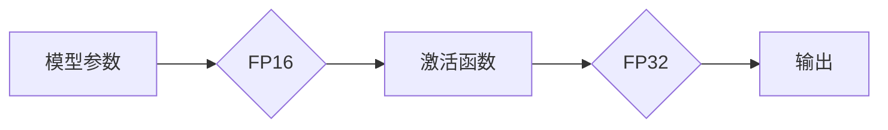

                 

## 混合精度在工业界中的应用

> 关键词：混合精度、深度学习、浮点运算、性能优化、效率提升、TensorFlow、PyTorch

## 1. 背景介绍

深度学习的蓬勃发展推动了人工智能技术的飞速进步，其核心是训练复杂的深度神经网络模型。然而，深度学习模型的训练过程通常需要大量的计算资源和时间，这主要源于模型参数和激活函数的浮点运算。传统的32位浮点运算精度虽然能够保证计算结果的准确性，但其计算量巨大，难以满足大规模模型训练的需求。

混合精度计算应运而生，它利用不同精度的数据类型进行计算，在保证模型精度的前提下，大幅度降低计算成本和时间。混合精度计算的核心思想是将模型参数和激活函数分别使用不同精度的数据类型进行处理，例如使用16位浮点精度（FP16）进行计算，并将关键步骤使用32位浮点精度（FP32）进行计算，从而达到平衡精度和效率的目的。

## 2. 核心概念与联系

混合精度计算的核心概念是将模型参数和激活函数分别使用不同精度的数据类型进行处理，以达到平衡精度和效率的目的。

**Mermaid 流程图：**



**核心概念解释：**

* **模型参数:** 指深度学习模型中需要学习的权重和偏置值。
* **激活函数:** 用于引入非线性，使神经网络能够学习复杂映射关系。
* **FP16:** 16位浮点精度，占用内存空间较少，计算速度更快。
* **FP32:** 32位浮点精度，精度更高，但计算量更大。

## 3. 核心算法原理 & 具体操作步骤

### 3.1  算法原理概述

混合精度计算的核心算法原理是利用不同精度的数据类型进行计算，在保证模型精度的前提下，降低计算成本和时间。

**主要步骤：**

1. 将模型参数存储为FP16精度。
2. 在前向传播过程中，使用FP16精度进行计算。
3. 在关键步骤，例如损失函数计算和反向传播过程中，使用FP32精度进行计算，以保证精度。
4. 将FP16精度参数更新为FP32精度，以保证模型训练的稳定性。

### 3.2  算法步骤详解

1. **模型参数转换:** 将模型参数从FP32精度转换为FP16精度。可以使用`torch.float16`或`tf.float16`等函数进行转换。
2. **前向传播:** 使用FP16精度进行前向传播计算，包括卷积、池化、全连接等操作。
3. **关键步骤转换:** 在损失函数计算和反向传播过程中，将计算结果转换为FP32精度，以保证精度。
4. **参数更新:** 将FP16精度参数更新为FP32精度，以保证模型训练的稳定性。

### 3.3  算法优缺点

**优点:**

* **提高训练速度:** FP16精度计算速度更快，可以显著提高训练速度。
* **降低内存占用:** FP16精度占用内存空间更少，可以训练更大的模型。
* **降低能耗:** FP16精度计算能耗更低，可以节省能源。

**缺点:**

* **精度损失:** FP16精度精度相对较低，可能会导致模型精度损失。
* **硬件支持:** 并非所有硬件都支持FP16精度计算。

### 3.4  算法应用领域

混合精度计算广泛应用于深度学习领域，例如：

* **图像识别:** 训练更深、更复杂的图像识别模型。
* **自然语言处理:** 训练更强大的自然语言处理模型，例如机器翻译、文本摘要等。
* **语音识别:** 训练更高精度的语音识别模型。
* **推荐系统:** 训练更精准的推荐系统模型。

## 4. 数学模型和公式 & 详细讲解 & 举例说明

### 4.1  数学模型构建

混合精度计算的数学模型主要基于浮点运算的精度转换和计算。

**模型假设:**

* 模型参数和激活函数分别使用不同精度的数据类型进行处理。
* FP16精度计算速度更快，但精度相对较低。
* FP32精度精度更高，但计算量更大。

### 4.2  公式推导过程

**FP16精度计算公式:**

$$
y = f(x)
$$

其中，$y$ 是FP16精度计算结果，$x$ 是输入数据。

**FP32精度计算公式:**

$$
y = f(x)
$$

其中，$y$ 是FP32精度计算结果，$x$ 是输入数据。

**精度转换公式:**

$$
x_{FP16} = round(x_{FP32} * 2^{16}) / 2^{16}
$$

其中，$x_{FP16}$ 是FP16精度数据，$x_{FP32}$ 是FP32精度数据。

### 4.3  案例分析与讲解

**举例说明:**

假设我们有一个简单的线性模型，其计算公式为：

$$
y = wx + b
$$

其中，$w$ 是权重，$b$ 是偏置，$x$ 是输入数据。

如果使用FP16精度计算，则计算结果可能存在精度损失。为了保证精度，我们可以将关键步骤，例如权重更新，使用FP32精度进行计算。

## 5. 项目实践：代码实例和详细解释说明

### 5.1  开发环境搭建

* **操作系统:** Linux/macOS/Windows
* **深度学习框架:** TensorFlow/PyTorch
* **GPU:** 支持FP16精度计算的GPU

### 5.2  源代码详细实现

**TensorFlow代码示例:**

```python
import tensorflow as tf

# 定义模型
model = tf.keras.Sequential([
    tf.keras.layers.Dense(128, activation='relu', dtype=tf.float16),
    tf.keras.layers.Dense(10, activation='softmax', dtype=tf.float32)
])

# 编译模型
model.compile(optimizer='adam',
              loss='sparse_categorical_crossentropy',
              metrics=['accuracy'])

# 训练模型
model.fit(x_train, y_train, epochs=10)
```

**PyTorch代码示例:**

```python
import torch
import torch.nn as nn

# 定义模型
class Model(nn.Module):
    def __init__(self):
        super(Model, self).__init__()
        self.fc1 = nn.Linear(128, 10, dtype=torch.float16)
        self.fc2 = nn.Linear(10, 1, dtype=torch.float32)

    def forward(self, x):
        x = torch.relu(self.fc1(x))
        x = self.fc2(x)
        return x

# 实例化模型
model = Model()

# 训练模型
optimizer = torch.optim.Adam(model.parameters())
loss_fn = nn.MSELoss()

for epoch in range(10):
    # ...
    loss = loss_fn(model(x), y)
    optimizer.zero_grad()
    loss.backward()
    optimizer.step()
```

### 5.3  代码解读与分析

* 代码中使用`dtype`参数指定数据类型，例如`tf.float16`和`tf.float32`。
* 关键步骤，例如权重更新，使用FP32精度进行计算，以保证精度。
* 训练过程中，可以使用混合精度训练的优化器和损失函数。

### 5.4  运行结果展示

混合精度训练可以显著提高训练速度和效率，同时保持模型精度。

## 6. 实际应用场景

混合精度计算在工业界广泛应用于各种深度学习场景，例如：

### 6.1  图像识别

混合精度计算可以加速图像识别模型的训练，例如用于人脸识别、物体检测、图像分类等应用。

### 6.2  自然语言处理

混合精度计算可以提高自然语言处理模型的训练效率，例如用于机器翻译、文本摘要、情感分析等应用。

### 6.3  语音识别

混合精度计算可以加速语音识别模型的训练，例如用于语音助手、语音搜索等应用。

### 6.4  推荐系统

混合精度计算可以提高推荐系统的训练效率，例如用于商品推荐、内容推荐等应用。

## 7. 工具和资源推荐

### 7.1  学习资源推荐

* **书籍:**

* Deep Learning with Python by Francois Chollet
* Hands-On Machine Learning with Scikit-Learn, Keras & TensorFlow by Aurélien Géron

* **在线课程:**

* TensorFlow Tutorials: https://www.tensorflow.org/tutorials
* PyTorch Tutorials: https://pytorch.org/tutorials/

### 7.2  开发工具推荐

* **TensorFlow:** https://www.tensorflow.org/
* **PyTorch:** https://pytorch.org/
* **CUDA Toolkit:** https://developer.nvidia.com/cuda-toolkit

### 7.3  相关论文推荐

* Mixed Precision Training
* Training Deep Neural Networks with Mixed Precision

## 8. 总结：未来发展趋势与挑战

### 8.1  研究成果总结

混合精度计算在深度学习领域取得了显著的成果，显著提高了训练速度和效率，同时保持模型精度。

### 8.2  未来发展趋势

* **更广泛的应用:** 混合精度计算将应用于更多深度学习场景，例如强化学习、生成对抗网络等。
* **更先进的算法:** 将开发更先进的混合精度计算算法，进一步提高训练效率和精度。
* **硬件加速:** 将开发更强大的硬件加速混合精度计算，例如专门设计的混合精度GPU。

### 8.3  面临的挑战

* **精度控制:** 如何在保证模型精度的前提下，进一步提高混合精度计算的效率。
* **硬件支持:** 并非所有硬件都支持混合精度计算，需要进一步推动硬件的普及。
* **算法优化:** 需要开发更有效的混合精度计算算法，以适应不同类型的深度学习模型。

### 8.4  研究展望

混合精度计算是一个充满潜力的研究方向，未来将继续推动深度学习的发展。

## 9. 附录：常见问题与解答

**常见问题:**

* **混合精度计算会降低模型精度吗？**

**解答:** 混合精度计算可能会导致轻微的精度损失，但可以通过一些技术手段，例如在关键步骤使用FP32精度计算，来控制精度损失。

* **如何选择合适的混合精度计算方案？**

**解答:** 选择合适的混合精度计算方案需要根据具体的模型和应用场景进行评估，例如模型大小、计算量、精度要求等。

* **哪些硬件支持混合精度计算？**

**解答:** 许多现代GPU支持混合精度计算，例如NVIDIA GeForce RTX系列和Tesla系列GPU。


作者：禅与计算机程序设计艺术 / Zen and the Art of Computer Programming 
<end_of_turn>

