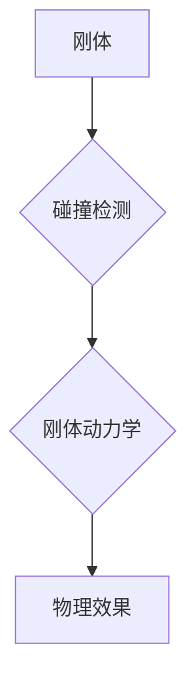

                 

## 游戏物理引擎：实现真实世界模拟

> 关键词：物理引擎、游戏开发、碰撞检测、刚体动力学、模拟、数学模型、算法、代码实现

## 1. 背景介绍

在现代游戏开发中，逼真的物理效果是提升玩家沉浸感和游戏体验的关键因素。游戏物理引擎作为实现这一目标的核心技术，负责模拟现实世界中的物理现象，例如物体运动、碰撞、弹性、摩擦等。 

早期游戏通常采用简单的规则和预设动画来模拟物理效果，但随着技术的进步，玩家对游戏真实性的要求越来越高。因此，游戏物理引擎逐渐发展成为一个独立的领域，并取得了显著的进步。

## 2. 核心概念与联系

游戏物理引擎的核心概念包括：

* **刚体:**  游戏中的物体通常被抽象为刚体，即其形状和大小固定，内部结构不发生变化。
* **碰撞检测:**  检测两个刚体是否发生碰撞，并确定碰撞的类型和位置。
* **刚体动力学:**  根据牛顿运动定律，计算刚体的运动轨迹和状态变化。
* **物理材质:**  定义物体在物理模拟中的特性，例如密度、弹性、摩擦系数等。

这些概念相互关联，共同构成游戏物理引擎的框架。



## 3. 核心算法原理 & 具体操作步骤

### 3.1  算法原理概述

游戏物理引擎的核心算法主要包括碰撞检测算法和刚体动力学算法。

* **碰撞检测算法:**  用于判断两个物体是否发生碰撞，常见的算法包括轴向包围盒算法、广义包围盒算法、GJK算法等。
* **刚体动力学算法:**  用于计算物体在受力下的运动轨迹，常用的算法包括欧拉积分法、verlet积分法等。

### 3.2  算法步骤详解

**碰撞检测算法步骤:**

1. **构建包围盒:**  将每个物体用包围盒表示，包围盒是一个简单的几何形状，例如矩形或球体，能够包围物体的所有顶点。
2. **检测包围盒碰撞:**  判断两个包围盒是否发生碰撞，如果碰撞，则进一步进行精确碰撞检测。
3. **精确碰撞检测:**  使用更精确的几何算法，例如三角形碰撞检测，确定碰撞的具体位置和类型。

**刚体动力学算法步骤:**

1. **计算受力:**  根据物体自身的属性和周围环境的因素，计算物体所受的力，例如重力、碰撞力、摩擦力等。
2. **更新速度和位置:**  根据牛顿运动定律，使用积分法更新物体的速度和位置。
3. **处理边界条件:**  当物体接近边界时，需要处理边界碰撞和反弹等情况。

### 3.3  算法优缺点

**碰撞检测算法:**

* **优点:**  效率高，能够快速判断物体是否发生碰撞。
* **缺点:**  精确度较低，可能无法准确检测到所有碰撞情况。

**刚体动力学算法:**

* **优点:**  能够模拟物体在受力下的真实运动轨迹。
* **缺点:**  计算量大，需要消耗较多的计算资源。

### 3.4  算法应用领域

碰撞检测和刚体动力学算法广泛应用于游戏开发、机器人控制、动画制作等领域。

## 4. 数学模型和公式 & 详细讲解 & 举例说明

### 4.1  数学模型构建

游戏物理引擎的核心数学模型是基于牛顿运动定律的。

* **牛顿第一定律:**  一个物体在不受外力作用时，保持静止或匀速直线运动。
* **牛顿第二定律:**  一个物体的加速度与作用在它身上的力成正比，与物体的质量成反比。
* **牛顿第三定律:**  对于每一个作用力，都有一个大小相等、方向相反的力作用在另一个物体上。

### 4.2  公式推导过程

根据牛顿第二定律，我们可以得到以下公式：

$$F = ma$$

其中：

* $F$ 是作用在物体的力
* $m$ 是物体的质量
* $a$ 是物体的加速度

### 4.3  案例分析与讲解

**举例说明:**

假设一个质量为 1 kg 的物体受到 10 N 的力作用，则物体的加速度为：

$$a = \frac{F}{m} = \frac{10 N}{1 kg} = 10 m/s^2$$

这意味着物体将在受到力的方向上以 10 m/s² 的加速度运动。

## 5. 项目实践：代码实例和详细解释说明

### 5.1  开发环境搭建

游戏物理引擎的开发环境通常包括：

* **编程语言:**  C++, C#、Python 等
* **图形引擎:**  OpenGL、DirectX 等
* **数学库:**  Eigen、Boost 等

### 5.2  源代码详细实现

以下是一个简单的碰撞检测算法的代码示例，使用 Python 语言实现：

```python
class Rectangle:
    def __init__(self, x, y, width, height):
        self.x = x
        self.y = y
        self.width = width
        self.height = height

    def is_colliding(self, other):
        if self.x + self.width < other.x or self.x > other.x + other.width:
            return False
        if self.y + self.height < other.y or self.y > other.y + other.height:
            return False
        return True

# 创建两个矩形
rect1 = Rectangle(0, 0, 10, 10)
rect2 = Rectangle(5, 5, 5, 5)

# 检测碰撞
if rect1.is_colliding(rect2):
    print("碰撞!")
else:
    print("未碰撞")
```

### 5.3  代码解读与分析

这段代码定义了一个 `Rectangle` 类，用于表示矩形物体。

* `is_colliding()` 方法用于检测两个矩形是否发生碰撞。
* 首先，它检查两个矩形的 x 坐标和 y 坐标是否相交。
* 如果两个矩形的 x 坐标或 y 坐标不重叠，则它们不会发生碰撞，返回 `False`。
* 否则，它们发生碰撞，返回 `True`。

### 5.4  运行结果展示

运行这段代码，输出结果为 "碰撞!"，表明两个矩形发生了碰撞。

## 6. 实际应用场景

游戏物理引擎广泛应用于各种游戏类型，例如：

* **动作游戏:**  模拟角色的运动、攻击、碰撞等物理效果。
* **平台跳跃游戏:**  实现角色跳跃、落地的物理模拟。
* **赛车游戏:**  模拟车辆的运动、碰撞、漂移等物理效果。
* **模拟经营游戏:**  模拟物品的堆叠、碰撞、物理交互等。

### 6.4  未来应用展望

随着技术的进步，游戏物理引擎将朝着更加逼真、智能的方向发展。

* **更复杂的物理模型:**  模拟更多种类的物理现象，例如流体、气体、布料等。
* **人工智能辅助:**  利用人工智能技术，使物理引擎能够自动生成更逼真的物理效果。
* **云端物理模拟:**  将物理模拟计算任务迁移到云端，提高游戏性能和可扩展性。

## 7. 工具和资源推荐

### 7.1  学习资源推荐

* **书籍:**  《Game Physics Engine Development》
* **网站:**  https://www.gamedev.net/
* **论坛:**  https://forum.unity.com/

### 7.2  开发工具推荐

* **Unity:**  https://unity.com/
* **Unreal Engine:**  https://www.unrealengine.com/
* **Godot Engine:**  https://godotengine.org/

### 7.3  相关论文推荐

* **"A Survey of Game Physics Engines"**
* **"Real-Time Collision Detection"**

## 8. 总结：未来发展趋势与挑战

### 8.1  研究成果总结

游戏物理引擎技术取得了显著的进步，能够模拟越来越逼真的物理效果。

### 8.2  未来发展趋势

未来游戏物理引擎将朝着更加复杂、智能、高效的方向发展。

### 8.3  面临的挑战

* **计算复杂度:**  模拟复杂物理现象需要大量的计算资源。
* **实时性:**  游戏物理引擎需要在实时场景下运行，保证流畅的体验。
* **可扩展性:**  游戏物理引擎需要能够适应不同类型的游戏和平台。

### 8.4  研究展望

未来研究将集中在以下几个方面：

* **开发更高效的物理模拟算法。**
* **利用人工智能技术提高物理引擎的智能化程度。**
* **探索新的物理模型和模拟方法。**


## 9. 附录：常见问题与解答

**常见问题:**

* **如何选择合适的物理引擎？**

**解答:**  选择物理引擎需要根据游戏的类型、平台、性能需求等因素进行考虑。

* **如何调试游戏物理引擎？**

**解答:**  可以使用调试工具和日志记录来跟踪物理引擎的运行状态，并找出问题所在。


作者：禅与计算机程序设计艺术 / Zen and the Art of Computer Programming 
<end_of_turn>

