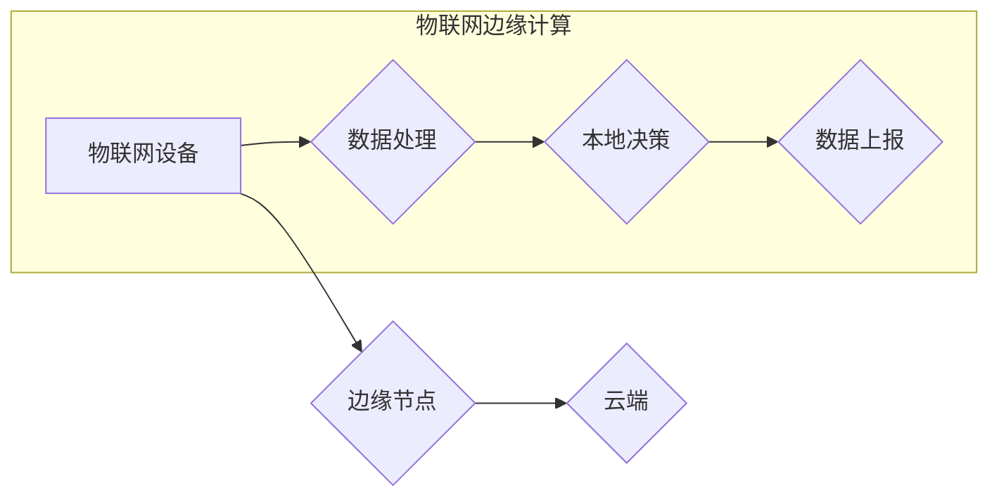

                 

## 物联网边缘计算优势：在设备端处理数据的益处

> 关键词：物联网、边缘计算、数据处理、低延迟、网络带宽、数据安全、隐私保护、人工智能

## 1. 背景介绍

物联网（IoT）的蓬勃发展为我们带来了智能化生活和万物互联的愿景。然而，随着物联网设备数量的激增，海量数据从设备端传输到云端处理面临着诸多挑战，例如网络带宽压力、数据传输延迟、数据安全和隐私保护等。为了解决这些问题，边缘计算应运而生，它将计算能力和数据存储能力部署到靠近数据源的边缘节点，实现数据在设备端进行处理，从而提升物联网系统的效率、可靠性和安全性。

## 2. 核心概念与联系

### 2.1 物联网（IoT）

物联网是指通过传感器、网络和数据分析技术，将各种物理设备连接到互联网，实现设备之间互联互通，并通过数据交换和分析实现智能化管理和控制。

### 2.2 边缘计算（Edge Computing）

边缘计算是一种将计算能力和数据存储能力部署到靠近数据源的边缘节点，例如路由器、网关、智能设备等，实现数据在设备端进行处理的计算模式。

### 2.3 物联网边缘计算

物联网边缘计算是指将边缘计算技术应用于物联网场景，将数据处理能力部署到物联网设备附近，实现数据在设备端进行处理，从而降低数据传输量、提升处理速度和安全性。

**Mermaid 流程图**



## 3. 核心算法原理 & 具体操作步骤

### 3.1 算法原理概述

物联网边缘计算的核心算法原理是将传统的云端计算模式转变为分布式计算模式，将数据处理能力分散到边缘节点，实现数据在设备端进行处理。

### 3.2 算法步骤详解

1. **数据采集:** 物联网设备收集数据，例如传感器数据、图像数据、音频数据等。
2. **数据预处理:** 边缘节点对数据进行预处理，例如数据清洗、数据格式转换、数据压缩等。
3. **数据分析:** 边缘节点对预处理后的数据进行分析，例如数据挖掘、模式识别、机器学习等。
4. **决策执行:** 边缘节点根据分析结果做出决策，并执行相应的控制指令。
5. **数据上报:** 边缘节点将分析结果和决策信息上报到云端，用于数据汇总、模型训练和全局决策。

### 3.3 算法优缺点

**优点:**

* **低延迟:** 数据在设备端处理，减少了数据传输延迟，提高了系统响应速度。
* **降低网络带宽压力:** 数据在边缘节点进行处理，减少了数据传输量，降低了网络带宽压力。
* **提高数据安全性:** 数据在设备端处理，减少了数据传输过程中的安全风险。
* **增强隐私保护:** 数据在设备端处理，减少了数据传输到云端的风险，增强了数据隐私保护。

**缺点:**

* **边缘节点资源有限:** 边缘节点的计算能力和存储能力有限，无法处理所有数据。
* **边缘节点部署成本:** 部署和维护边缘节点需要一定的成本。
* **数据同步问题:** 边缘节点和云端数据需要同步，否则会导致数据不一致。

### 3.4 算法应用领域

* **智能制造:** 工厂设备实时数据分析，实现生产过程优化和故障预测。
* **智能交通:** 车辆传感器数据分析，实现交通流量管理、拥堵预测和安全驾驶辅助。
* **智能医疗:** 医疗设备数据分析，实现远程医疗、疾病诊断和个性化治疗。
* **智能家居:** 家庭设备数据分析，实现智能控制、能源管理和安全保障。

## 4. 数学模型和公式 & 详细讲解 & 举例说明

### 4.1 数学模型构建

物联网边缘计算的性能评估可以采用以下数学模型：

* **延迟:** $D = T_{p} + T_{t} + T_{c}$

其中：

* $D$：数据处理延迟
* $T_{p}$：数据传输延迟
* $T_{t}$：数据处理时间
* $T_{c}$：控制指令执行时间

* **带宽利用率:** $B = \frac{T_{d}}{T_{t}}$

其中：

* $B$：带宽利用率
* $T_{d}$：数据传输量
* $T_{t}$：总传输时间

### 4.2 公式推导过程

延迟公式的推导过程如下：

* 数据传输延迟 $T_{p}$：取决于数据传输距离、网络带宽和数据包大小等因素。
* 数据处理时间 $T_{c}$：取决于数据处理算法复杂度、边缘节点计算能力等因素。
* 控制指令执行时间 $T_{c}$：取决于控制指令执行复杂度、设备响应速度等因素。

带宽利用率公式的推导过程如下：

* 数据传输量 $T_{d}$：取决于数据处理结果的规模和传输频率。
* 总传输时间 $T_{t}$：取决于数据传输距离、网络带宽和数据包大小等因素。

### 4.3 案例分析与讲解

假设一个智能工厂场景，需要实时监控设备运行状态，并根据运行状态进行控制。

* 数据传输延迟 $T_{p}$：假设设备和边缘节点之间距离较近，网络带宽较高，数据传输延迟可以忽略不计。
* 数据处理时间 $T_{c}$：边缘节点采用轻量级机器学习算法进行数据分析，处理时间可以控制在几毫秒以内。
* 控制指令执行时间 $T_{c}$：设备响应速度较快，控制指令执行时间可以控制在几毫秒以内。

在这种情况下，数据处理延迟主要由数据处理时间和控制指令执行时间决定，可以满足实时控制的需求。

## 5. 项目实践：代码实例和详细解释说明

### 5.1 开发环境搭建

* 操作系统：Ubuntu 20.04 LTS
* 编程语言：Python 3.8
* 工具：

    * Docker
    * TensorFlow Lite

### 5.2 源代码详细实现

```python
# 边缘节点数据处理程序

import tensorflow as tf

# 加载模型
model = tf.lite.Interpreter(model_path="model.tflite")
model.allocate_tensors()

# 获取输入和输出张量
input_details = model.get_input_details()
output_details = model.get_output_details()

# 数据预处理
data = ... # 从设备端获取数据

# 数据输入模型
model.set_tensor(input_details[0]['index'], data)

# 模型推理
model.invoke()

# 获取模型输出
output_data = model.get_tensor(output_details[0]['index'])

# 决策执行
if output_data[0] > 0.5:
    # 执行控制指令
    print("执行控制指令")
else:
    # 不执行控制指令
    print("不执行控制指令")
```

### 5.3 代码解读与分析

* 代码首先加载 TensorFlow Lite 模型。
* 然后获取模型的输入和输出张量。
* 从设备端获取数据并进行预处理。
* 将预处理后的数据输入模型进行推理。
* 根据模型输出结果执行相应的控制指令。

### 5.4 运行结果展示

运行结果将根据模型输出结果显示相应的控制指令。

## 6. 实际应用场景

### 6.1 智能制造

在智能制造场景中，物联网边缘计算可以实现设备状态实时监控、故障预测和生产过程优化。例如，可以利用边缘节点对传感器数据进行分析，识别设备故障的潜在风险，并提前发出预警，避免设备故障导致的生产停滞。

### 6.2 智能交通

在智能交通场景中，物联网边缘计算可以实现交通流量管理、拥堵预测和安全驾驶辅助。例如，可以利用边缘节点对车辆传感器数据进行分析，实时监测交通流量，并根据流量情况调整交通信号灯，减少拥堵。

### 6.3 智能医疗

在智能医疗场景中，物联网边缘计算可以实现远程医疗、疾病诊断和个性化治疗。例如，可以利用边缘节点对患者的生理数据进行分析，远程监测患者的健康状况，并根据分析结果提供个性化的医疗建议。

### 6.4 未来应用展望

物联网边缘计算在未来将有更广泛的应用场景，例如：

* **智慧城市:** 实现城市环境监测、公共安全管理和资源优化。
* **智慧农业:** 实现精准农业、农作物病虫害监测和产量预测。
* **智慧能源:** 实现能源管理、电力调度和分布式能源管理。

## 7. 工具和资源推荐

### 7.1 学习资源推荐

* **书籍:**

    * 《边缘计算：原理、架构和应用》
    * 《物联网边缘计算》

* **在线课程:**

    * Coursera: Edge Computing Specialization
    * edX: Introduction to Edge Computing

### 7.2 开发工具推荐

* **Docker:** 用于容器化应用程序部署和管理。
* **Kubernetes:** 用于容器编排和管理。
* **TensorFlow Lite:** 用于部署轻量级机器学习模型。

### 7.3 相关论文推荐

* **The Edge Computing Paradigm: A Survey**
* **A Survey on Edge Computing: Architecture, Challenges, and Opportunities**

## 8. 总结：未来发展趋势与挑战

### 8.1 研究成果总结

物联网边缘计算技术发展迅速，取得了显著成果，例如：

* **降低数据传输延迟:** 边缘计算可以将数据处理能力部署到靠近数据源的边缘节点，有效降低数据传输延迟。
* **提高数据安全性:** 数据在设备端处理，减少了数据传输过程中的安全风险。
* **增强隐私保护:** 数据在设备端处理，减少了数据传输到云端的风险，增强了数据隐私保护。

### 8.2 未来发展趋势

物联网边缘计算未来将朝着以下方向发展：

* **更智能化:** 利用人工智能技术，实现边缘节点的智能化决策和控制。
* **更协同化:** 实现边缘节点之间的协同工作，形成一个分布式计算网络。
* **更安全可靠:** 加强边缘节点的安全防护和可靠性，确保数据安全和系统稳定。

### 8.3 面临的挑战

物联网边缘计算技术还面临一些挑战：

* **边缘节点资源有限:** 边缘节点的计算能力和存储能力有限，难以处理所有数据。
* **数据同步问题:** 边缘节点和云端数据需要同步，否则会导致数据不一致。
* **安全性和隐私保护:** 边缘节点部署需要考虑安全性和隐私保护问题。

### 8.4 研究展望

未来研究方向包括：

* **开发更轻量级的边缘计算算法:** 针对边缘节点资源有限的特点，开发更轻量级的计算算法。
* **解决数据同步问题:** 研究更有效的边缘节点和云端数据同步机制。
* **加强边缘节点安全防护:** 开发更安全的边缘计算平台和应用，保障数据安全和隐私保护。


## 9. 附录：常见问题与解答

**Q1: 物联网边缘计算与云计算有什么区别？**

**A1:** 云计算将计算能力和数据存储能力集中部署在云端，而物联网边缘计算将计算能力和数据存储能力部署到靠近数据源的边缘节点。

**Q2: 物联网边缘计算有哪些优势？**

**A2:** 物联网边缘计算的优势包括：低延迟、降低网络带宽压力、提高数据安全性、增强隐私保护。

**Q3: 物联网边缘计算有哪些应用场景？**

**A3:** 物联网边缘计算的应用场景包括智能制造、智能交通、智能医疗、智慧城市等。

**Q4: 物联网边缘计算有哪些挑战？**

**A4:** 物联网边缘计算面临的挑战包括：边缘节点资源有限、数据同步问题、安全性和隐私保护等。


作者：禅与计算机程序设计艺术 / Zen and the Art of Computer Programming 
<end_of_turn>

