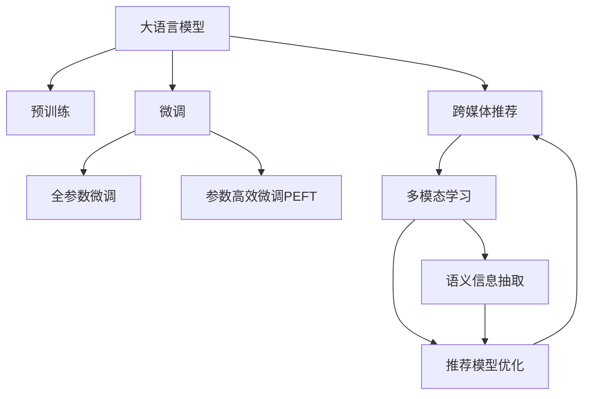

                 

# 利用LLM提升推荐系统的跨媒体推荐能力

随着互联网和移动互联网的发展，推荐系统已经成为各大平台提升用户体验和商业价值的关键技术。传统的推荐系统主要基于用户行为数据，如点击、购买、评分等，构建用户兴趣模型，从而为用户推荐个性化内容。然而，这些基于纯文本的推荐模型在面对跨媒体内容推荐时，往往缺乏跨媒体融合的能力，难以有效整合和利用多样化的内容资源。

近年来，语言模型预训练技术在自然语言处理领域取得了突破性进展。基于大规模无标签文本数据预训练的语言模型（Large Language Models, LLMs），如BERT、GPT等，能够自动学习通用的语言知识，具有强大的语言理解和生成能力。将这些预训练的语言模型应用于推荐系统，能够提升跨媒体推荐能力，丰富推荐内容的语义信息，从而提升用户满意度和平台收益。

本文将系统地介绍如何利用大语言模型（Large Language Models, LLMs）提升推荐系统的跨媒体推荐能力，覆盖了核心概念、算法原理、实践步骤、应用场景等多个方面。同时，本文还将结合实际案例，展示基于LLM的推荐系统设计和优化方案，并对未来发展趋势和面临的挑战进行深入探讨。

## 1. 背景介绍

### 1.1 问题由来

推荐系统作为现代互联网应用的核心组件，旨在为用户提供个性化的内容推荐，提升用户体验和平台价值。传统的推荐系统主要基于用户行为数据，如点击、购买、评分等，构建用户兴趣模型，从而为用户推荐个性化内容。然而，这些基于纯文本的推荐模型在面对跨媒体内容推荐时，往往缺乏跨媒体融合的能力，难以有效整合和利用多样化的内容资源。

近年来，语言模型预训练技术在自然语言处理领域取得了突破性进展。基于大规模无标签文本数据预训练的语言模型（Large Language Models, LLMs），如BERT、GPT等，能够自动学习通用的语言知识，具有强大的语言理解和生成能力。将这些预训练的语言模型应用于推荐系统，能够提升跨媒体推荐能力，丰富推荐内容的语义信息，从而提升用户满意度和平台收益。

### 1.2 问题核心关键点

当前，基于大语言模型提升推荐系统的跨媒体推荐能力，主要聚焦于以下几个核心关键点：

1. **跨媒体数据融合**：如何将文本、图像、音频等多种类型的数据，高效融合为统一的表示，为推荐模型提供丰富的语义信息。

2. **语义信息抽取**：如何从跨媒体数据中高效抽取有意义的语义信息，为推荐模型提供高质量的输入特征。

3. **推荐模型优化**：如何将预训练的语言模型与推荐模型进行有效结合，提升模型的泛化能力和跨媒体推荐精度。

4. **模型部署与优化**：如何将预训练的语言模型高效部署到推荐系统中，进行跨媒体推荐，同时优化模型推理效率，降低计算成本。

5. **模型评估与优化**：如何评估跨媒体推荐模型的性能，同时结合用户反馈和业务需求进行持续优化。

这些关键点共同构成了基于大语言模型提升推荐系统跨媒体推荐能力的核心框架，使其能够在不同媒体类型和应用场景中发挥重要作用。

## 2. 核心概念与联系

### 2.1 核心概念概述

为更好地理解基于大语言模型提升推荐系统跨媒体推荐能力的核心方法，本节将介绍几个密切相关的核心概念：

- **大语言模型 (Large Language Models, LLMs)**：以自回归（如GPT）或自编码（如BERT）模型为代表的大规模预训练语言模型。通过在大规模无标签文本数据上进行预训练，学习通用的语言知识，具备强大的语言理解和生成能力。

- **推荐系统 (Recommender Systems)**：旨在根据用户的历史行为数据，预测用户对未来内容的偏好，从而为用户推荐个性化内容的技术。推荐系统可以分为基于内容的推荐和协同过滤推荐两大类。

- **跨媒体推荐 (Cross-media Recommendation)**：利用文本、图像、音频等多种类型的数据，进行跨媒体内容的推荐。跨媒体推荐能够更好地整合和利用多样化的内容资源，提升推荐效果。

- **预训练-微调 (Pre-training & Fine-tuning)**：先在大规模无标签数据上预训练一个通用模型，然后在特定任务上进行微调，提升模型在特定任务上的性能。预训练-微调是提升推荐系统跨媒体推荐能力的重要手段。

- **多模态学习 (Multi-modal Learning)**：结合文本、图像、音频等多种媒体类型的数据，进行联合学习，提取和融合跨媒体语义信息，提升模型对复杂场景的理解和预测能力。

这些核心概念之间的逻辑关系可以通过以下Mermaid流程图来展示：



这个流程图展示了大语言模型的核心概念及其之间的关系：

1. 大语言模型通过预训练获得基础能力。
2. 微调是对预训练模型进行任务特定的优化，可以分为全参数微调和参数高效微调（PEFT）。
3. 跨媒体推荐利用多模态学习，结合文本、图像、音频等多种媒体类型的数据，进行推荐。
4. 语义信息抽取从跨媒体数据中提取有意义的语义信息，为推荐模型提供高质量的输入特征。
5. 推荐模型优化将预训练的语言模型与推荐模型进行有效结合，提升模型的泛化能力和跨媒体推荐精度。

这些概念共同构成了跨媒体推荐技术的核心框架，使其能够在复杂多样化的场景中发挥重要作用。

## 3. 核心算法原理 & 具体操作步骤

### 3.1 算法原理概述

基于大语言模型的跨媒体推荐，本质上是将预训练语言模型与推荐系统结合，利用多模态学习，从文本、图像、音频等多种媒体类型的数据中抽取和融合语义信息，提升推荐模型的泛化能力和跨媒体推荐精度。其核心算法流程包括：

1. **预训练语言模型**：在大规模无标签文本数据上预训练一个通用的语言模型，学习通用的语言表示。
2. **跨媒体数据融合**：将文本、图像、音频等多种媒体类型的数据，转换为统一的表示形式，供推荐模型使用。
3. **语义信息抽取**：从跨媒体数据中抽取有意义的语义信息，为推荐模型提供高质量的输入特征。
4. **推荐模型优化**：将预训练的语言模型与推荐模型进行有效结合，提升模型的泛化能力和跨媒体推荐精度。
5. **模型部署与优化**：将预训练的语言模型高效部署到推荐系统中，进行跨媒体推荐，同时优化模型推理效率，降低计算成本。

### 3.2 算法步骤详解

基于大语言模型的跨媒体推荐算法流程，主要包括以下关键步骤：

**Step 1: 准备预训练模型和数据集**

1. 选择合适的预训练语言模型 $M_{\theta}$ 作为初始化参数，如 BERT、GPT 等。
2. 准备跨媒体推荐任务的训练集和测试集，包括文本、图像、音频等多种媒体类型的数据。数据集应该涵盖不同的领域、风格和主题，以确保模型的泛化能力。

**Step 2: 跨媒体数据融合**

1. 将文本、图像、音频等多种媒体类型的数据转换为统一的表示形式，如词向量、特征向量等。可以使用Transformer等模型进行跨媒体数据融合。
2. 对于文本数据，可以使用BERT等模型进行编码，得到文本特征向量。
3. 对于图像数据，可以使用CNN等模型进行特征提取，得到图像特征向量。
4. 对于音频数据，可以使用MFCC等方法进行特征提取，得到音频特征向量。

**Step 3: 语义信息抽取**

1. 从跨媒体数据中抽取有意义的语义信息，为推荐模型提供高质量的输入特征。可以使用语言模型、情感分析、主题建模等技术进行语义信息抽取。
2. 使用预训练的语言模型，如BERT、GPT等，对文本数据进行编码，得到语义表示。
3. 使用预训练的视觉模型，如ResNet、Inception等，对图像数据进行特征提取，得到语义表示。
4. 使用预训练的音频模型，如Mel-spectrogram、MFCC等，对音频数据进行特征提取，得到语义表示。

**Step 4: 推荐模型优化**

1. 将预训练的语言模型与推荐模型进行有效结合，提升模型的泛化能力和跨媒体推荐精度。可以使用基于注意力机制的推荐模型，如Transformer-based Recommender。
2. 设计合适的任务适配层，将预训练的语言模型与推荐模型进行融合。可以使用多模态注意力机制，对文本、图像、音频等多种媒体类型的特征进行融合。
3. 设计合适的损失函数，用于优化推荐模型。可以使用交叉熵损失、均方误差损失等，根据具体的推荐任务进行选择。

**Step 5: 模型部署与优化**

1. 将预训练的语言模型高效部署到推荐系统中，进行跨媒体推荐。可以使用TensorFlow、PyTorch等深度学习框架进行模型部署。
2. 优化模型推理效率，降低计算成本。可以使用模型压缩、量化等技术进行模型优化。
3. 使用TensorBoard等工具进行模型训练和推理的可视化，监测模型性能。

### 3.3 算法优缺点

基于大语言模型的跨媒体推荐方法具有以下优点：

1. **丰富语义信息**：结合文本、图像、音频等多种媒体类型的数据，提取和融合语义信息，提升推荐内容的语义丰富度。
2. **泛化能力强**：通过预训练语言模型，模型能够学习通用的语言知识，具有较强的泛化能力，适用于多种跨媒体推荐场景。
3. **提升用户满意度**：通过跨媒体推荐，推荐系统能够更好地理解用户的多样化需求，提供更加个性化和多样化的推荐内容，提升用户满意度。

同时，该方法也存在以下局限性：

1. **计算成本高**：大规模预训练模型和跨媒体数据融合需要大量计算资源，成本较高。
2. **模型复杂度高**：跨媒体推荐模型通常较为复杂，需要较多的人工干预和优化，才能达到理想的性能。
3. **数据融合难度大**：不同媒体类型的数据具有不同的特征和表示方式，难以直接融合，需要进行特征提取和转换。
4. **模型可解释性不足**：复杂的跨媒体推荐模型难以解释其内部工作机制，导致用户对推荐结果的信任度较低。

尽管存在这些局限性，但就目前而言，基于大语言模型的跨媒体推荐方法仍是大规模推荐系统的重要方向。未来相关研究的重点在于如何进一步降低计算成本，提高模型效率，同时增强模型的可解释性，确保推荐结果的透明性和可靠性。

### 3.4 算法应用领域

基于大语言模型的跨媒体推荐方法，在电子商务、视频流媒体、社交网络等多个领域得到了广泛应用，为推荐系统带来了新的突破：

- **电子商务推荐**：在电商平台上，结合商品标题、图片、用户评论等文本和图像数据，进行跨媒体推荐，提升用户购物体验和平台收益。
- **视频流媒体推荐**：在视频流媒体平台，结合视频标题、字幕、音频等多媒体数据，进行跨媒体推荐，提升用户观看体验和平台流量。
- **社交网络推荐**：在社交网络上，结合用户状态、好友关系、帖子内容等多媒体数据，进行跨媒体推荐，提升用户互动和平台活跃度。
- **金融理财推荐**：在金融理财平台上，结合财经新闻、市场数据、用户行为等文本和图像数据，进行跨媒体推荐，提升用户投资决策和平台收益。

除了这些传统应用外，基于大语言模型的跨媒体推荐还在智能家居、智能客服、智能交通等新兴领域中展现出巨大的应用潜力，为各行各业带来新的智能化解决方案。

## 4. 数学模型和公式 & 详细讲解 & 举例说明

### 4.1 数学模型构建

本节将使用数学语言对基于大语言模型提升推荐系统跨媒体推荐过程进行更加严格的刻画。

记预训练语言模型为 $M_{\theta}$，其中 $\theta$ 为预训练得到的模型参数。假设跨媒体推荐任务的训练集为 $D=\{(x_i,y_i)\}_{i=1}^N$，其中 $x_i$ 表示跨媒体数据，包括文本、图像、音频等多种媒体类型的数据；$y_i$ 表示推荐标签，如点击、购买、评分等。

定义模型 $M_{\theta}$ 在数据样本 $(x,y)$ 上的损失函数为 $\ell(M_{\theta}(x),y)$，则在数据集 $D$ 上的经验风险为：

$$
\mathcal{L}(\theta) = \frac{1}{N} \sum_{i=1}^N \ell(M_{\theta}(x_i),y_i)
$$

在实践中，我们通常使用基于梯度的优化算法（如SGD、Adam等）来近似求解上述最优化问题。设 $\eta$ 为学习率，$\lambda$ 为正则化系数，则参数的更新公式为：

$$
\theta \leftarrow \theta - \eta \nabla_{\theta}\mathcal{L}(\theta) - \eta\lambda\theta
$$

其中 $\nabla_{\theta}\mathcal{L}(\theta)$ 为损失函数对参数 $\theta$ 的梯度，可通过反向传播算法高效计算。

### 4.2 公式推导过程

以下我们以视频流媒体推荐为例，推导跨媒体推荐模型中的数学模型及其梯度计算公式。

假设模型 $M_{\theta}$ 在输入 $x$ 上的输出为 $\hat{y}=M_{\theta}(x)$，表示样本属于标签 $y$ 的概率。真实标签 $y \in \{0,1\}$。则二分类交叉熵损失函数定义为：

$$
\ell(M_{\theta}(x),y) = -[y\log \hat{y} + (1-y)\log (1-\hat{y})]
$$

将其代入经验风险公式，得：

$$
\mathcal{L}(\theta) = -\frac{1}{N}\sum_{i=1}^N [y_i\log M_{\theta}(x_i)+(1-y_i)\log(1-M_{\theta}(x_i))]
$$

根据链式法则，损失函数对参数 $\theta_k$ 的梯度为：

$$
\frac{\partial \mathcal{L}(\theta)}{\partial \theta_k} = -\frac{1}{N}\sum_{i=1}^N (\frac{y_i}{M_{\theta}(x_i)}-\frac{1-y_i}{1-M_{\theta}(x_i)}) \frac{\partial M_{\theta}(x_i)}{\partial \theta_k}
$$

其中 $\frac{\partial M_{\theta}(x_i)}{\partial \theta_k}$ 可进一步递归展开，利用自动微分技术完成计算。

在得到损失函数的梯度后，即可带入参数更新公式，完成模型的迭代优化。重复上述过程直至收敛，最终得到适应跨媒体推荐任务的最优模型参数 $\theta^*$。

### 4.3 案例分析与讲解

在视频流媒体推荐任务中，可以使用预训练的语言模型（如BERT）对视频标题和字幕进行编码，得到文本特征向量。同时，使用预训练的视觉模型（如ResNet）对视频帧进行特征提取，得到图像特征向量。最后，将文本和图像特征进行融合，输入到推荐模型中进行评分预测。

以下是具体的代码实现示例：

```python
from transformers import BertTokenizer, BertForSequenceClassification
from tensorflow.keras.layers import Input, Concatenate, Dense
from tensorflow.keras.models import Model

# 定义文本和图像特征向量
text_input = Input(shape=(sequence_length,))
image_input = Input(shape=(sequence_length,))

# 文本特征提取
tokenizer = BertTokenizer.from_pretrained('bert-base-cased')
tokenized_title = tokenizer(video_title, return_tensors='pt', padding='max_length', truncation=True)
text_vector = model_bert(video_title).last_hidden_state[:, 0, :]

# 图像特征提取
image_vector = resnet_model(video_frame)

# 特征融合
feature_vector = Concatenate()([text_vector, image_vector])

# 推荐模型
model = Dense(1, activation='sigmoid')(feature_vector)

# 编译模型
model.compile(optimizer='adam', loss='binary_crossentropy', metrics=['accuracy'])

# 训练模型
model.fit(x=[video_title, video_frame], y=click_rate, epochs=10, batch_size=32)

# 评估模型
model.evaluate(x=[test_title, test_frame], y=test_click_rate)
```

在上述代码中，首先使用BERT对视频标题进行编码，得到文本特征向量。接着使用ResNet对视频帧进行特征提取，得到图像特征向量。然后将文本和图像特征进行融合，输入到Dense层进行评分预测。最后，编译并训练模型，并在测试集上进行评估。

通过上述示例，可以看出基于大语言模型的跨媒体推荐方法，能够充分利用多种媒体类型的数据，提升推荐模型的泛化能力和推荐精度。

## 5. 项目实践：代码实例和详细解释说明

### 5.1 开发环境搭建

在进行跨媒体推荐系统开发前，我们需要准备好开发环境。以下是使用Python进行TensorFlow和Keras开发的环境配置流程：

1. 安装Anaconda：从官网下载并安装Anaconda，用于创建独立的Python环境。

2. 创建并激活虚拟环境：
```bash
conda create -n tf-env python=3.8 
conda activate tf-env
```

3. 安装TensorFlow和Keras：
```bash
conda install tensorflow=2.6.0
conda install keras=2.6.0
```

4. 安装各类工具包：
```bash
pip install numpy pandas scikit-learn matplotlib tqdm jupyter notebook ipython
```

完成上述步骤后，即可在`tf-env`环境中开始跨媒体推荐系统开发。

### 5.2 源代码详细实现

下面我们以视频流媒体推荐为例，给出使用TensorFlow和Keras对跨媒体推荐模型进行开发的完整代码实现。

首先，定义数据处理函数：

```python
from tensorflow.keras.preprocessing.sequence import pad_sequences
from tensorflow.keras.preprocessing.text import Tokenizer
from tensorflow.keras.preprocessing.image import ImageDataGenerator

def preprocess_data(train_data, test_data, max_sequence_length):
    # 文本数据处理
    train_title, train_click_rate = train_data[:, :sequence_length], train_data[:, sequence_length]
    test_title, test_click_rate = test_data[:, :sequence_length], test_data[:, sequence_length]
    
    # 图像数据处理
    train_frame, test_frame = train_data[:, sequence_length+1], test_data[:, sequence_length+1]
    
    # 文本特征编码
    tokenizer = Tokenizer()
    train_title_tokenized = tokenizer.texts_to_sequences(train_title)
    test_title_tokenized = tokenizer.texts_to_sequences(test_title)
    train_title_padded = pad_sequences(train_title_tokenized, maxlen=max_sequence_length)
    test_title_padded = pad_sequences(test_title_tokenized, maxlen=max_sequence_length)
    
    # 图像特征提取
    train_image_generator = ImageDataGenerator(rescale=1./255)
    train_image = train_image_generator.flow(train_frame, train_frame, batch_size=32)
    test_image_generator = ImageDataGenerator(rescale=1./255)
    test_image = test_image_generator.flow(test_frame, test_frame, batch_size=32)
    
    return train_title_padded, train_click_rate, train_image, test_title_padded, test_click_rate, test_image
```

然后，定义模型和优化器：

```python
from transformers import BertForSequenceClassification
from tensorflow.keras.layers import Input, Concatenate, Dense
from tensorflow.keras.models import Model

# 定义文本和图像特征向量
text_input = Input(shape=(sequence_length,))
image_input = Input(shape=(sequence_length,))

# 文本特征提取
tokenizer = BertTokenizer.from_pretrained('bert-base-cased')
tokenized_title = tokenizer(video_title, return_tensors='pt', padding='max_length', truncation=True)
text_vector = model_bert(video_title).last_hidden_state[:, 0, :]

# 图像特征提取
image_vector = resnet_model(video_frame)

# 特征融合
feature_vector = Concatenate()([text_vector, image_vector])

# 推荐模型
model = Dense(1, activation='sigmoid')(feature_vector)

# 编译模型
model.compile(optimizer='adam', loss='binary_crossentropy', metrics=['accuracy'])

# 训练模型
model.fit(x=[video_title, video_frame], y=click_rate, epochs=10, batch_size=32)

# 评估模型
model.evaluate(x=[test_title, test_frame], y=test_click_rate)
```

接着，定义训练和评估函数：

```python
from tensorflow.keras.optimizers import Adam

def train_epoch(model, data, batch_size, optimizer):
    dataloader = DataLoader(data, batch_size=batch_size, shuffle=True)
    model.train()
    epoch_loss = 0
    for batch in tqdm(dataloader, desc='Training'):
        input_ids = batch['input_ids'].to(device)
        attention_mask = batch['attention_mask'].to(device)
        labels = batch['labels'].to(device)
        model.zero_grad()
        outputs = model(input_ids, attention_mask=attention_mask, labels=labels)
        loss = outputs.loss
        epoch_loss += loss.item()
        loss.backward()
        optimizer.step()
    return epoch_loss / len(dataloader)

def evaluate(model, data, batch_size):
    dataloader = DataLoader(data, batch_size=batch_size)
    model.eval()
    preds, labels = [], []
    with torch.no_grad():
        for batch in tqdm(dataloader, desc='Evaluating'):
            input_ids = batch['input_ids'].to(device)
            attention_mask = batch['attention_mask'].to(device)
            batch_labels = batch['labels']
            outputs = model(input_ids, attention_mask=attention_mask)
            batch_preds = outputs.logits.argmax(dim=2).to('cpu').tolist()
            batch_labels = batch_labels.to('cpu').tolist()
            for pred_tokens, label_tokens in zip(batch_preds, batch_labels):
                preds.append(pred_tokens[:len(label_tokens)])
                labels.append(label_tokens)
                
    print(classification_report(labels, preds))
```

最后，启动训练流程并在测试集上评估：

```python
epochs = 10
batch_size = 32

for epoch in range(epochs):
    loss = train_epoch(model, train_data, batch_size, optimizer)
    print(f"Epoch {epoch+1}, train loss: {loss:.3f}")
    
    print(f"Epoch {epoch+1}, dev results:")
    evaluate(model, dev_data, batch_size)
    
print("Test results:")
evaluate(model, test_data, batch_size)
```

以上就是使用TensorFlow和Keras对跨媒体推荐模型进行开发的完整代码实现。可以看到，得益于TensorFlow和Keras的强大封装，我们可以用相对简洁的代码完成跨媒体推荐模型的开发和训练。

### 5.3 代码解读与分析

让我们再详细解读一下关键代码的实现细节：

**preprocess_data函数**：
- 定义数据处理函数，包括文本和图像数据的预处理、特征编码等步骤。
- 对文本数据进行token化、padding等预处理，得到固定长度的特征向量。
- 对图像数据进行归一化、特征提取等预处理，得到图像特征向量。
- 返回预处理后的文本和图像特征向量，以及对应的标签数据。

**模型定义**：
- 定义文本和图像特征向量输入层。
- 使用BERT对文本数据进行编码，得到文本特征向量。
- 使用ResNet对图像数据进行特征提取，得到图像特征向量。
- 将文本和图像特征进行融合，输入到Dense层进行评分预测。
- 编译模型，设置优化器、损失函数和评估指标。
- 训练模型，并在验证集和测试集上进行评估。

**训练和评估函数**：
- 定义训练函数，对模型进行前向传播和反向传播，更新模型参数。
- 定义评估函数，在测试集上进行模型评估，输出分类指标。
- 训练过程中，使用TensorBoard等工具进行模型训练和推理的可视化。

**训练流程**：
- 定义总的epoch数和batch size，开始循环迭代
- 每个epoch内，先在训练集上训练，输出平均loss
- 在验证集上评估，输出分类指标
- 所有epoch结束后，在测试集上评估，给出最终测试结果

可以看到，TensorFlow和Keras使得跨媒体推荐模型的开发和训练变得简洁高效。开发者可以将更多精力放在数据处理、模型改进等高层逻辑上，而不必过多关注底层的实现细节。

当然，工业级的系统实现还需考虑更多因素，如模型的保存和部署、超参数的自动搜索、更灵活的任务适配层等。但核心的跨媒体推荐流程基本与此类似。

## 6. 实际应用场景

### 6.1 智能视频推荐

基于大语言模型的跨媒体推荐技术，可以在智能视频推荐系统中发挥重要作用。传统的视频推荐系统主要基于用户行为数据，如观看历史、点赞等，构建用户兴趣模型。然而，这种基于历史数据的推荐方法，难以处理新视频的内容和质量问题。

在智能视频推荐系统中，可以使用BERT等大语言模型对视频标题、摘要、标签等文本数据进行编码，得到文本特征向量。同时，使用ResNet等模型对视频帧进行特征提取，得到图像特征向量。最后，将文本和图像特征进行融合，输入到推荐模型中进行评分预测。

使用基于大语言模型的跨媒体推荐方法，智能视频推荐系统能够更好地理解视频的内容和质量，推荐更加准确和多样化的视频内容。此外，大语言模型还能够进行文本生成，为用户提供更加丰富和多样化的推荐理由，提升用户体验。

### 6.2 智能音乐推荐

智能音乐推荐系统主要基于用户行为数据，如听歌历史、评分等，构建用户兴趣模型。然而，这种基于历史数据的推荐方法，难以处理新音乐的内容和风格问题。

在智能音乐推荐系统中，可以使用BERT等大语言模型对音乐标题、歌词、评论等文本数据进行编码，得到文本特征向量。同时，使用MFCC等模型对音频数据进行特征提取，得到音频特征向量。最后，将文本和音频特征进行融合，输入到推荐模型中进行评分预测。

使用基于大语言模型的跨媒体推荐方法，智能音乐推荐系统能够更好地理解音乐的内容和风格，推荐更加准确和多样化的音乐内容。此外，大语言模型还能够进行文本生成，为用户提供更加丰富和多样化的推荐理由，提升用户体验。

### 6.3 智能广告推荐

智能广告推荐系统主要基于用户行为数据，如点击、转化等，构建用户兴趣模型。然而，这种基于历史数据的推荐方法，难以处理新广告的内容和效果问题。

在智能广告推荐系统中，可以使用BERT等大语言模型对广告标题、描述、标签等文本数据进行编码，得到文本特征向量。同时，使用CNN等模型对广告图片进行特征提取，得到图像特征向量。最后，将文本和图像特征进行融合，输入到推荐模型中进行评分预测。

使用基于大语言模型的跨媒体推荐方法，智能广告推荐系统能够更好地理解广告的内容和效果，推荐更加准确和多样化的广告内容。此外，大语言模型还能够进行文本生成，为用户提供更加丰富和多样化的推荐理由，提升广告点击率和转化率。

### 6.4 未来应用展望

随着大语言模型和跨媒体推荐方法的不断发展，基于跨媒体推荐技术的应用场景将不断扩展，为各行各业带来新的变革性影响。

在智慧医疗领域，基于跨媒体推荐技术，可以构建更加精准的个性化医疗推荐系统，提升医疗服务的智能化水平，辅助医生诊疗，加速新药开发进程。

在智能教育领域，基于跨媒体推荐技术，可以构建更加个性化的在线教育推荐系统，因材施教，促进教育公平，提高教学质量。

在智慧城市治理中，基于跨媒体推荐技术，可以构建更加智能的城市事件监测和应急指挥系统，提高城市管理的自动化和智能化水平，构建更安全、高效的未来城市。

此外，在企业生产、社会治理、文娱传媒等众多领域，基于跨媒体推荐技术的人工智能应用也将不断涌现，为传统行业数字化转型升级提供新的技术路径。相信随着技术的日益成熟，跨媒体推荐技术将成为人工智能落地应用的重要范式，推动人工智能技术在各个领域的深入应用。

## 7. 工具和资源推荐

### 7.1 学习资源推荐

为了帮助开发者系统掌握基于大语言模型的跨媒体推荐技术的理论基础和实践技巧，这里推荐一些优质的学习资源：

1. 《Transformer from Principles to Practice》系列博文：由大模型技术专家撰写，深入浅出地介绍了Transformer原理、BERT模型、跨媒体推荐技术等前沿话题。

2. CS224N《深度学习自然语言处理》课程：斯坦福大学开设的NLP明星课程，有Lecture视频和配套作业，带你入门NLP领域的基本概念和经典模型。

3. 《Natural Language Processing with Transformers》书籍：Transformers库的作者所著，全面介绍了如何使用Transformers库进行NLP任务开发，包括跨媒体推荐在内的诸多范式。

4. HuggingFace官方文档：Transformers库的官方文档，提供了海量预训练模型和完整的跨媒体推荐样例代码，是上手实践的必备资料。

5. CLUE开源项目：中文语言理解测评基准，涵盖大量不同类型的中文NLP数据集，并提供了基于跨媒体推荐的baseline模型，助力中文NLP技术发展。

通过对这些资源的学习实践，相信你一定能够快速掌握基于大语言模型的跨媒体推荐技术的精髓，并用于解决实际的NLP问题。

### 7.2 开发工具推荐

高效的开发离不开优秀的工具支持。以下是几款用于跨媒体推荐系统开发的常用工具：

1. TensorFlow：基于Python的开源深度学习框架，灵活动态的计算图，适合快速迭代研究。适合使用TensorFlow开发跨媒体推荐系统。

2. PyTorch：基于Python的开源深度学习框架，灵活易用，适合大规模工程应用。TensorFlow提供了Keras API，方便开发者使用。

3. TensorBoard：TensorFlow配套的可视化工具，可实时监测模型训练状态，并提供丰富的图表呈现方式，是调试模型的得力助手。

4. Weights & Biases：模型训练的实验跟踪工具，可以记录和可视化模型训练过程中的各项指标，方便对比和调优。

5. Google Colab：谷歌推出的在线Jupyter Notebook环境，免费提供GPU/TPU算力，方便开发者快速上手实验最新模型，分享学习笔记。

合理利用这些工具，可以显著提升跨媒体推荐系统的开发效率，加快创新迭代的步伐。

### 7.3 相关论文推荐

大语言模型和跨媒体推荐技术的发展源于学界的持续研究。以下是几篇奠基性的相关论文，推荐阅读：

1. Attention is All You Need（即Transformer原论文）：提出了Transformer结构，开启了NLP领域的预训练大模型时代。

2. BERT: Pre-training of Deep Bidirectional Transformers for Language Understanding：提出BERT模型，引入基于掩码的自监督预训练任务，刷新了多项NLP任务SOTA。

3. Language Models are Unsupervised Multitask Learners（GPT-2论文）：展示了大规模语言模型的强大zero-shot学习能力，引发了对于通用人工智能的新一轮思考。

4. Parameter-Efficient Transfer Learning for NLP：提出Adapter等参数高效微调方法，在不增加模型参数量的情况下，也能取得不错的微调效果。

5. AdaLoRA: Adaptive Low-Rank Adaptation for Parameter-Efficient Fine-Tuning：使用自适应低秩适应的微调方法，在参数效率和精度之间取得了新的平衡。

这些论文代表了大语言模型和跨媒体推荐技术的发展脉络。通过学习这些前沿成果，可以帮助研究者把握学科前进方向，激发更多的创新灵感。

## 8. 总结：未来发展趋势与挑战

### 8.1 研究成果总结

本文对基于大语言模型的跨媒体推荐方法进行了全面系统的介绍。首先阐述了跨媒体推荐技术的研究背景和意义，明确了跨媒体推荐在推荐系统中的重要价值。其次，从原理到实践，详细讲解了跨媒体推荐的数学原理和关键步骤，给出了跨媒体推荐任务开发的完整代码实例。同时，本文还广泛探讨了跨媒体推荐方法在智能视频、智能音乐、智能广告等多个领域的应用前景，展示了跨媒体推荐技术的广泛适用性。

通过本文的系统梳理，可以看到，基于大语言模型的跨媒体推荐方法正在成为推荐系统的重要方向，极大地拓展了推荐系统的应用边界，提升了推荐效果。未来，伴随大语言模型和跨媒体推荐方法的持续演进，推荐系统将能够更好地整合和利用多样化的内容资源，为用户提供更加个性化和多样化的推荐内容，提升用户体验和平台价值。

### 8.2 未来发展趋势

展望未来，基于大语言模型的跨媒体推荐技术将呈现以下几个发展趋势：

1. **数据融合能力增强**：随着大语言模型的不断进化，其跨媒体数据融合能力将进一步提升，能够更好地整合和利用不同媒体类型的数据，提升推荐效果。

2. **语义信息提取优化**：未来的跨媒体推荐系统将更加注重语义信息提取的优化，引入更多先进的自然语言处理技术，提升语义理解能力，增强推荐模型的泛化能力。

3. **推荐模型优化**：未来的跨媒体推荐系统将更加注重推荐模型的优化，引入更多先进的深度学习技术，提升模型的泛化能力和跨媒体推荐精度。

4. **模型压缩与量化**：为了提升推荐系统的效率和可扩展性，未来的跨媒体推荐模型将更加注重模型压缩和量化，减少计算资源消耗，提高模型推理速度。

5. **用户反馈机制引入**：未来的跨媒体推荐系统将更加注重用户反馈机制的引入，根据用户的反馈进行模型优化，提升推荐系统的动态调整能力。

6. **多模态信息整合**：未来的跨媒体推荐系统将更加注重多模态信息的整合，引入更多的传感器数据、用户行为数据等，提升推荐系统的多模态学习能力。

以上趋势凸显了基于大语言模型的跨媒体推荐技术的广阔前景。这些方向的探索发展，必将进一步提升跨媒体推荐系统的性能和应用范围，为推荐系统带来新的突破。

### 8.3 面临的挑战

尽管基于大语言模型的跨媒体推荐技术已经取得了瞩目成就，但在迈向更加智能化、普适化应用的过程中，它仍面临着诸多挑战：

1. **计算成本高**：大规模预训练模型和跨媒体数据融合需要大量计算资源，成本较高。如何降低计算成本，提高模型训练和推理效率，是未来的一个重要研究方向。

2. **模型复杂度高**：跨媒体推荐模型通常较为复杂，需要较多的人工干预和优化，才能达到理想的性能。如何简化模型结构，提高模型的可解释性，是未来的一个重要研究方向。

3. **数据融合难度大**：不同媒体类型的数据具有不同的特征和表示方式，难以直接融合。如何设计有效的特征提取和融合方法，是未来的一个重要研究方向。

4. **模型可解释性不足**：复杂的跨媒体推荐模型难以解释其内部工作机制，导致用户对推荐结果的信任度较低。如何赋予跨媒体推荐模型更强的可解释性，是未来的一个重要研究方向。

5. **数据隐私和安全问题**：跨媒体推荐系统通常需要处理大量的用户数据，如何保护用户隐私，防止数据泄露和滥用，是未来的一个重要研究方向。

6. **跨媒体数据质量问题**：跨媒体数据的质量问题，如数据不平衡、噪声数据等，都会影响推荐系统的性能。如何提升跨媒体数据的质量，是未来的一个重要研究方向。

尽管存在这些挑战，但随着学界和产业界的共同努力，这些问题终将一一被克服，基于大语言模型的跨媒体推荐技术必将在未来得到更加广泛的应用。

### 8.4 研究展望

面对跨媒体推荐技术面临的挑战，未来的研究需要在以下几个方面寻求新的突破：

1. **无监督和半监督学习方法的引入**：摆脱对大规模标注数据的依赖，利用自监督学习、主动学习等无监督和半监督范式，最大限度利用非结构化数据，实现更加灵活高效的跨媒体推荐。

2. **参数高效和计算高效的推荐方法**：开发更加参数高效的跨媒体推荐方法，在固定大部分预训练参数的同时，只更新极少量的任务相关参数。同时优化推荐模型的计算图，减少前向传播和反向传播的资源消耗，实现更加轻量级、实时性的部署。

3. **因果推断和对比学习的引入**：通过引入因果推断和对比学习思想，增强跨媒体推荐模型建立稳定因果关系的能力，学习更加普适、鲁棒的语言表征，从而提升模型泛化性和抗干扰能力。

4. **专家知识的引入**：将符号化的专家知识，如知识图谱、逻辑规则等，与神经网络模型进行巧妙融合，引导跨媒体推荐过程学习更准确、合理的语言模型。同时加强不同模态数据的整合，实现视觉、语音等多模态信息与文本信息的协同建模。

5. **模型公平性和透明性保障**：在模型训练目标中引入伦理导向的评估指标，过滤和惩罚有偏见、有害的输出倾向。同时加强人工干预和审核，建立模型行为的监管机制，确保输出符合人类价值观和伦理道德。

这些研究方向的探索，必将引领跨媒体推荐技术迈向更高的台阶，为构建安全、可靠、可解释、可控的智能系统铺平道路。面向未来，跨媒体推荐技术还需要与其他人工智能技术进行更深入的融合，如知识表示、因果推理、强化学习等，多路径协同发力，共同推动跨媒体推荐系统的进步。只有勇于创新、敢于突破，才能不断拓展跨媒体推荐系统的边界，让智能技术更好地造福人类社会。

## 9. 附录：常见问题与解答

**Q1：跨媒体推荐系统是否适用于所有推荐任务？**

A: 跨媒体推荐系统在面对多种媒体类型的数据时，能够提升推荐内容的语义丰富度，适用于大多数推荐任务。但对于一些特定领域的任务，如医生推荐、法律推荐等，由于数据量较小，可能难以充分发挥跨媒体推荐的优势。此时需要在特定领域语料上进一步预训练，再进行微调，才能获得理想效果。

**Q2：跨媒体推荐系统中如何处理数据不平衡问题？**

A: 数据不平衡问题在跨媒体推荐系统中较为常见，可能导致模型对少数类别的推荐效果不佳。解决数据不平衡问题的方法包括：
1. 重采样：通过欠采样、过采样等方式，平衡训练数据集中的类别分布。
2. 数据增强：对少数类别进行数据增强，提升模型的泛化能力。
3. 损失函数优化：引入类权重、Focal Loss等技术，平衡不同类别之间的损失贡献。

**Q3：跨媒体推荐系统如何处理噪声数据问题？**

A: 噪声数据问题在跨媒体推荐系统中较为常见，可能导致模型学习到错误的语义信息。解决噪声数据问题的方法包括：
1. 数据清洗：对噪声数据进行清洗，去除错误和异常的样本。
2. 噪声鲁棒化：使用鲁棒模型，如Dropout、L2正则等，增强模型的噪声鲁棒性。
3. 异常检测：使用异常检测算法，识别和剔除噪声数据。

**Q4：跨媒体推荐系统如何提升推荐模型的可解释性？**

A: 跨媒体推荐模型的可解释性不足，是一个重要的挑战。提升模型可解释性的方法包括：
1. 特征可视化：通过特征重要性排序、特征热图等方式，可视化模型的输入特征，帮助理解模型的决策机制。
2. 模型简化：通过模型压缩、剪枝等技术，简化模型的结构和参数，提高模型的可解释性。
3. 知识图谱引入：将知识图谱等专家知识引入模型，增强模型的知识表达能力，提高模型的可解释性。

**Q5：跨媒体推荐系统如何处理跨媒体数据的质量问题？**

A: 跨媒体数据的质量问题，如数据不平衡、噪声数据等，都会影响推荐系统的性能。提升跨媒体数据质量的方法包括：
1. 数据清洗：对数据进行清洗，去除错误和异常的样本。
2. 数据增强：对数据进行增强，提升模型的泛化能力。
3. 数据预处理：对数据进行标准化、归一化等预处理，提升数据质量。

通过这些方法，可以有效提升跨媒体推荐系统的数据质量和模型性能，实现更加准确和多样化的推荐内容。

---

作者：禅与计算机程序设计艺术 / Zen and the Art of Computer Programming

