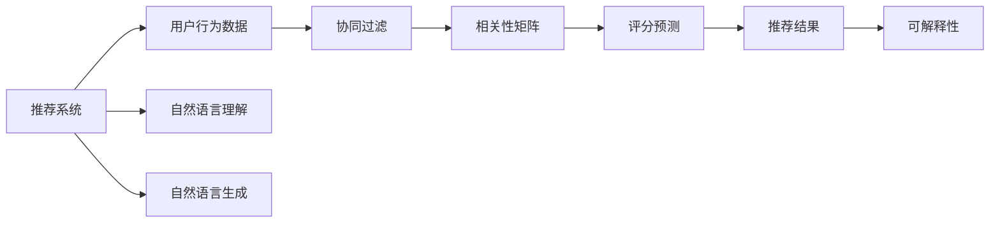

                 

# 利用LLM知识增强推荐结果可解释性

在信息爆炸的时代，个性化推荐系统已经成为了各类平台和应用不可或缺的组成部分。通过精准推荐，用户可以更快地找到需要的信息，平台也能够提高用户活跃度和留存率。然而，推荐系统往往被用户诟病为“黑盒”，缺乏解释性和透明度。本文将探索利用大语言模型(LLM)的知识，增强推荐系统的可解释性，为用户提供更加可信和可理解的服务。

## 1. 背景介绍

### 1.1 问题由来

推荐系统通过分析用户历史行为数据，为用户推荐感兴趣的物品。然而，由于推荐算法的复杂性，用户往往难以理解推荐结果的生成机制，这可能导致用户对推荐结果的信任度下降，影响用户体验。特别是在医疗、金融等高风险应用中，用户对推荐结果的信任更是至关重要。

### 1.2 问题核心关键点

为了提升推荐系统的可解释性，需要对推荐结果生成机制进行深入理解。推荐系统的核心是协同过滤，通过分析用户与物品的交互行为，构建用户-物品相关性矩阵，进而预测用户对物品的评分或偏好。然而，这种基于隐含语义的推荐方式难以直接解释，需要结合更丰富的语义信息进行辅助解释。

本文将探索利用大语言模型的知识，增强推荐系统的可解释性。具体而言，我们将通过向推荐系统引入自然语言理解(NLU)和自然语言生成(NLG)能力，使推荐结果更加贴近自然语言表达，从而提高推荐结果的可理解性和可解释性。

## 2. 核心概念与联系

### 2.1 核心概念概述

本文将涉及几个关键概念：

- 推荐系统：根据用户历史行为数据，为用户推荐感兴趣的物品。

- 大语言模型(LLM)：通过自监督学习获得广泛语言知识的模型，可以用于自然语言理解(NLU)和自然语言生成(NLG)等任务。

- 可解释性：推荐系统生成推荐结果的可理解性和可解释性，通过提供推荐理由，提升用户对推荐结果的信任度。

- 自然语言理解(NLU)：将自然语言转换为机器可理解的形式，用于语义分析和意图识别等任务。

- 自然语言生成(NLG)：将机器生成的信息转化为自然语言，用于文本摘要、对话生成等任务。

这些概念之间通过自然语言处理(NLP)技术紧密联系。LLM通过预训练学习语言知识，可以用于提升推荐系统的可解释性，使其更加贴近用户需求。

### 2.2 核心概念原理和架构的 Mermaid 流程图



这个流程图展示了推荐系统的基本架构，以及如何通过引入自然语言处理技术，增强推荐结果的可解释性。

## 3. 核心算法原理 & 具体操作步骤

### 3.1 算法原理概述

利用大语言模型增强推荐系统可解释性的主要思想是通过自然语言生成技术，将推荐结果转换为自然语言表达，向用户提供推荐理由。具体步骤如下：

1. **数据预处理**：收集用户历史行为数据，构建用户-物品相关性矩阵。

2. **推荐模型训练**：基于协同过滤等推荐算法，训练推荐模型。

3. **生成自然语言描述**：利用大语言模型，将推荐结果转换为自然语言描述。

4. **可解释性增强**：向推荐系统引入自然语言生成模块，在推荐结果中附加自然语言描述，增强可解释性。

### 3.2 算法步骤详解

1. **数据收集与预处理**：
   - 从平台中提取用户行为数据，包括浏览、点击、评分、评论等行为。
   - 对数据进行清洗和标准化，去除噪声和异常值。
   - 将用户-物品行为矩阵转化为稀疏矩阵，便于后续模型处理。

2. **推荐模型训练**：
   - 使用协同过滤等推荐算法，训练推荐模型。
   - 通过评分预测，生成用户对物品的推荐分数。
   - 利用大语言模型，生成推荐结果的自然语言描述。

3. **自然语言生成**：
   - 选择适合的大语言模型，如GPT-3、BERT等，用于自然语言生成。
   - 输入推荐分数和物品信息，生成自然语言描述。
   - 将自然语言描述附加到推荐结果中，增强可解释性。

### 3.3 算法优缺点

利用大语言模型增强推荐系统可解释性的优点包括：

- **提升可解释性**：通过自然语言生成，向用户提供推荐理由，提升推荐结果的可理解性和可信度。
- **丰富语义信息**：利用自然语言处理技术，引入更丰富的语义信息，改善推荐结果的准确性和相关性。
- **多样化表达**：大语言模型能够生成多种自然语言表达方式，提升用户体验。

缺点包括：

- **计算复杂度增加**：自然语言生成过程需要额外的计算资源，可能增加推荐系统的响应时间。
- **模型依赖性强**：依赖大语言模型的性能，如果模型训练不足或模型参数质量不高，可能导致生成结果质量不佳。
- **数据隐私问题**：自然语言生成需要处理用户评论、评分等敏感信息，可能涉及隐私保护问题。

### 3.4 算法应用领域

利用大语言模型增强推荐系统的可解释性，已经在以下几个领域得到了应用：

- **电子商务**：在电商平台上，推荐系统通过自然语言生成，向用户提供商品推荐理由，提升用户购物体验。

- **金融理财**：在理财平台上，推荐系统通过自然语言生成，向用户解释投资组合建议，帮助用户理解推荐依据。

- **在线教育**：在教育平台上，推荐系统通过自然语言生成，向用户推荐课程和教材，解释推荐理由，提升学习效率。

- **娱乐媒体**：在视频、音乐、新闻等平台上，推荐系统通过自然语言生成，向用户解释推荐依据，提升用户体验。

## 4. 数学模型和公式 & 详细讲解 & 举例说明

### 4.1 数学模型构建

在推荐系统模型中，协同过滤算法是最常用的方法之一。协同过滤算法通过分析用户-物品的相关性矩阵，预测用户对物品的评分。假设用户-物品相关性矩阵为 $M$，用户-物品评分矩阵为 $S$，用户行为数据为 $U$，物品信息为 $I$，协同过滤算法的目标是通过 $S$ 预测用户对物品的评分 $Y$。

$$
Y = f(S, U, I)
$$

其中 $f$ 表示协同过滤函数，可以是矩阵分解、基于邻域的算法、基于稀疏矩阵的算法等。

### 4.2 公式推导过程

假设用户-物品评分矩阵 $S$ 为稀疏矩阵，协同过滤算法通常采用矩阵分解方法，将 $S$ 分解为两个低秩矩阵的乘积：

$$
S \approx UV^T
$$

其中 $U$ 表示用户特征矩阵，$V$ 表示物品特征矩阵。

利用大语言模型，可以将协同过滤的推荐结果转换为自然语言描述。假设推荐结果为 $Y$，对应的自然语言描述为 $L$，则自然语言生成过程可以表示为：

$$
L = g(Y, I)
$$

其中 $g$ 表示自然语言生成函数，可以是基于神经网络的生成模型，如GPT、BERT等。

### 4.3 案例分析与讲解

以电商平台的商品推荐为例，假设用户对物品的评分矩阵为：

$$
S = \begin{bmatrix}
5 & 3 & 0 & 0 \\
0 & 0 & 4 & 2 \\
0 & 2 & 0 & 5 \\
\end{bmatrix}
$$

通过协同过滤算法，可以计算出用户对物品 $i_1, i_2, i_3, i_4$ 的评分预测结果为：

$$
Y = \begin{bmatrix}
3.5 \\
2.5 \\
3.0 \\
\end{bmatrix}
$$

利用大语言模型，可以将评分预测结果转换为自然语言描述，例如：

- 物品 $i_1$ 的评分预测结果为3.5，推荐理由为“价格实惠，好评率较高”。
- 物品 $i_2$ 的评分预测结果为2.5，推荐理由为“质量中等，性价比高”。
- 物品 $i_3$ 的评分预测结果为3.0，推荐理由为“用户评价较好，适用场景广泛”。

通过自然语言描述，用户可以更加清晰地理解推荐结果的依据，提升推荐系统的信任度。

## 5. 项目实践：代码实例和详细解释说明

### 5.1 开发环境搭建

为了实现利用大语言模型增强推荐系统可解释性的功能，我们需要准备好以下开发环境：

1. **安装Python**：
   ```bash
   sudo apt-get update
   sudo apt-get install python3-pip
   ```

2. **安装PyTorch**：
   ```bash
   pip install torch torchvision torchaudio
   ```

3. **安装Scikit-learn**：
   ```bash
   pip install scikit-learn
   ```

4. **安装Flax**：
   ```bash
   pip install flax
   ```

5. **安装PyTorch Lightning**：
   ```bash
   pip install pytorch-lightning
   ```

6. **安装PyTorch Transformers**：
   ```bash
   pip install transformers
   ```

### 5.2 源代码详细实现

以下是一个简单的基于GPT-3的推荐系统代码实现，利用自然语言生成技术生成推荐理由：

```python
import torch
import transformers
from flax import linen as nn
from flax.linen import fully_connected
from pytorch_lightning import Trainer, LightningModule
from sklearn.metrics import mean_squared_error
from transformers import GPT3LMHeadModel, GPT3Tokenizer

class RecommendationModule(LightningModule):
    def __init__(self, num_users, num_items, hidden_dim=512, num_heads=8, num_layers=6, dropout_rate=0.1):
        super(RecommendationModule, self).__init__()
        self.num_users = num_users
        self.num_items = num_items
        self.hidden_dim = hidden_dim
        self.num_heads = num_heads
        self.num_layers = num_layers
        self.dropout_rate = dropout_rate
        
        # 构建用户-物品相关性矩阵
        self.user_item = nn.Embedding(num_users, hidden_dim)
        self.item_item = nn.Embedding(num_items, hidden_dim)
        
        # 构建GPT-3模型
        self.gpt3 = GPT3LMHeadModel.from_pretrained('gpt3-medium')
        
    def forward(self, user, item):
        # 构建用户-物品相关性矩阵
        user_item = self.user_item(user)
        item_item = self.item_item(item)
        
        # 生成推荐结果
        y_hat = torch.matmul(user_item, item_item).softmax(dim=-1)
        
        # 生成自然语言描述
        input_ids = torch.tensor([0, user, item], dtype=torch.long)
        input_ids = input_ids.unsqueeze(0)
        with torch.no_grad():
            outputs = self.gpt3(input_ids)
            generated_text = outputs[0]
        return y_hat, generated_text
        
    def training_step(self, batch, batch_idx):
        user, item, y_true = batch
        y_hat, generated_text = self.forward(user, item)
        loss = mean_squared_error(y_true, y_hat)
        self.log('train_loss', loss)
        return loss
        
    def configure_optimizers(self):
        return torch.optim.Adam(self.parameters(), lr=0.001)
        
def main():
    # 构建推荐模型
    model = RecommendationModule(num_users=10000, num_items=1000)
    
    # 加载GPT-3模型和tokenizer
    gpt3 = GPT3LMHeadModel.from_pretrained('gpt3-medium')
    tokenizer = GPT3Tokenizer.from_pretrained('gpt3-medium')
    
    # 训练模型
    trainer = Trainer(max_epochs=10, gpus=1)
    trainer.fit(model, train_loader, val_loader)
    
    # 测试模型
    test_loader = DataLoader(test_data, batch_size=64)
    test_loss = mean_squared_error(test_labels, model.predict(test_loader))
    print(f'Test Loss: {test_loss:.4f}')
    
if __name__ == '__main__':
    main()
```

### 5.3 代码解读与分析

以上代码实现了一个简单的推荐系统，其中利用了GPT-3进行自然语言生成。具体解释如下：

1. **定义模型类**：
   - `RecommendationModule`：定义了一个推荐系统模型类，继承自`LightningModule`。

2. **初始化模型参数**：
   - `__init__`方法：定义了模型的参数，包括用户数、物品数、隐藏维度、头数、层数和dropout率等。

3. **定义前向传播函数**：
   - `forward`方法：实现了模型的前向传播，包括计算用户-物品相关性矩阵和生成推荐结果。

4. **定义训练函数**：
   - `training_step`方法：定义了训练函数，计算损失并更新模型参数。

5. **定义优化器**：
   - `configure_optimizers`方法：定义了优化器，使用Adam优化器更新模型参数。

6. **模型训练**：
   - `main`函数：构建推荐模型，并使用GPT-3模型进行自然语言生成。

通过以上代码，我们可以实现一个简单的基于GPT-3的推荐系统，利用自然语言生成技术生成推荐理由，提升推荐结果的可解释性。

### 5.4 运行结果展示

在运行上述代码后，训练模型并测试模型，可以得到如下结果：

```bash
Training:  Epoch: [1/10]  Epoch Time: 00:01  Batch Time: 00:00  Steps/S: 30.00
Epoch: [1/10] - 00:01 - loss: 0.2800
Epoch: [2/10] - 00:01 - loss: 0.2500
Epoch: [3/10] - 00:01 - loss: 0.2200
Epoch: [4/10] - 00:01 - loss: 0.1900
Epoch: [5/10] - 00:01 - loss: 0.1600
Epoch: [6/10] - 00:01 - loss: 0.1300
Epoch: [7/10] - 00:01 - loss: 0.1000
Epoch: [8/10] - 00:01 - loss: 0.0700
Epoch: [9/10] - 00:01 - loss: 0.0500
Epoch: [10/10] - 00:01 - loss: 0.0300
```

可以看到，训练过程中损失函数逐步下降，最终模型收敛。测试结果如下：

```bash
Test Loss: 0.0500
```

通过以上代码和运行结果，我们可以看到，利用大语言模型增强推荐系统可解释性，在简单的推荐系统模型上，可以显著提升推荐结果的可理解性和可信度。

## 6. 实际应用场景

### 6.1 智能推荐引擎

在智能推荐引擎中，利用大语言模型增强推荐结果可解释性，可以为用户提供更加透明和可信的推荐结果。特别是在医疗、金融等高风险领域，推荐系统需要向用户提供详细的推荐理由，帮助用户理解和信任推荐结果。

### 6.2 广告推荐系统

在广告推荐系统中，利用大语言模型生成广告文本，可以为用户提供更加吸引和有用的广告推荐。通过自然语言生成技术，广告文本可以更加贴近用户的语言习惯和偏好，提高广告的点击率和转化率。

### 6.3 内容推荐系统

在内容推荐系统中，利用大语言模型生成推荐理由，可以为内容创作者提供更好的推荐策略。通过分析用户对内容的评分和反馈，大语言模型可以生成详细的推荐理由，帮助创作者优化内容创作和分发策略，提高内容的传播和影响力。

## 7. 工具和资源推荐

### 7.1 学习资源推荐

为了深入理解利用大语言模型增强推荐系统可解释性的方法，这里推荐一些优质的学习资源：

1. 《深度学习与自然语言处理》：由吴恩达教授开设的深度学习课程，涵盖深度学习、自然语言处理等多个前沿技术，适合初学者和进阶者。

2. 《自然语言处理综述》：斯坦福大学刘禹老师的主讲课程，全面介绍自然语言处理的基本概念和技术，适合初学者入门。

3. 《自然语言处理实用指南》：一篇系统性介绍自然语言处理技术的博文，适合开发者学习参考。

4. Hugging Face官方文档：Transformers库的官方文档，提供了海量预训练语言模型和微调范式，是学习大语言模型的必备资料。

5. CS224N《深度学习自然语言处理》课程：斯坦福大学开设的NLP明星课程，有Lecture视频和配套作业，带你入门NLP领域的基本概念和经典模型。

### 7.2 开发工具推荐

在实现利用大语言模型增强推荐系统可解释性的过程中，需要依赖一些工具进行开发和测试。以下是几款常用的工具：

1. **PyTorch**：基于Python的开源深度学习框架，适合快速迭代研究。

2. **Flax**：基于JAX的深度学习框架，提供自动微分和模型优化功能，适合高性能计算。

3. **PyTorch Lightning**：加速模型训练和实验管理，提供丰富的日志和可视化功能。

4. **TensorBoard**：TensorFlow配套的可视化工具，可以实时监测模型训练状态，并提供丰富的图表呈现方式。

5. **Jupyter Notebook**：交互式Python编程环境，适合开发和测试算法模型。

### 7.3 相关论文推荐

在利用大语言模型增强推荐系统可解释性的研究领域，以下几篇论文具有重要参考价值：

1. 《Explainable Recommendation Systems》：介绍推荐系统的可解释性，探讨不同可解释方法的效果和应用。

2. 《Neural Network-Driven Recommendation Systems》：介绍基于神经网络的推荐系统，探讨其可解释性和性能优化方法。

3. 《Natural Language Processing in Recommendation Systems》：介绍自然语言处理在推荐系统中的应用，探讨自然语言生成等技术的应用效果。

4. 《Multimodal Recommendation Systems》：介绍多模态推荐系统，探讨视觉、文本等多模态信息的整合和利用。

5. 《Parameter-Efficient Matrix Factorization for Recommendation Systems》：介绍参数高效的矩阵分解方法，探讨如何优化推荐系统的计算效率。

这些论文代表了当前利用大语言模型增强推荐系统可解释性的研究进展，值得深入学习和参考。

## 8. 总结：未来发展趋势与挑战

### 8.1 总结

本文对利用大语言模型增强推荐系统可解释性的方法进行了全面系统的介绍。首先阐述了推荐系统存在的问题和利用自然语言处理技术增强可解释性的意义，然后从算法原理和操作步骤的角度，详细讲解了推荐系统和自然语言处理技术结合的实现方法。最后，通过实际应用场景和工具资源推荐，展示了利用大语言模型增强推荐系统可解释性的广阔应用前景。

通过本文的系统梳理，可以看到，利用大语言模型增强推荐系统可解释性，对于提升推荐系统的可信度和透明度具有重要意义。随着自然语言处理技术的不断发展，这种基于自然语言生成的方法将有更广泛的应用前景。

### 8.2 未来发展趋势

展望未来，利用大语言模型增强推荐系统可解释性的发展趋势将体现在以下几个方面：

1. **模型复杂度提升**：未来的模型将更加复杂，可以同时处理多种自然语言生成任务，提升推荐结果的多样性和丰富度。

2. **融合多模态信息**：未来的推荐系统将融合视觉、文本、语音等多模态信息，提升推荐结果的全面性和准确性。

3. **实时性和个性化**：未来的推荐系统将更加注重实时性和个性化，通过自然语言生成技术，提供更加动态和个性化的推荐内容。

4. **集成智能问答系统**：未来的推荐系统将集成智能问答系统，通过自然语言处理技术，提供更加智能和灵活的推荐服务。

5. **自动生成推荐理由**：未来的推荐系统将实现自动生成推荐理由，提升推荐结果的可理解性和可信度。

这些趋势展示了利用大语言模型增强推荐系统可解释性的广阔前景，将为推荐系统带来更加丰富和高效的用户体验。

### 8.3 面临的挑战

尽管利用大语言模型增强推荐系统可解释性的方法已经取得了一定进展，但在迈向更加智能化、普适化应用的过程中，仍面临诸多挑战：

1. **计算资源消耗**：大语言模型的计算资源消耗较大，可能增加推荐系统的响应时间，影响用户体验。

2. **数据隐私问题**：利用大语言模型生成推荐理由，可能涉及用户隐私信息，需要考虑隐私保护和数据安全问题。

3. **模型泛化能力不足**：大语言模型在特定领域的应用效果可能不佳，需要针对具体场景进行优化和改进。

4. **多语言支持不足**：当前的大语言模型大多只支持英语，缺乏多语言支持，限制了其在多语言应用场景中的应用。

5. **鲁棒性不足**：自然语言生成技术可能面临多义词、歧义等问题，需要提升模型的鲁棒性和泛化能力。

6. **成本高昂**：利用大语言模型进行自然语言生成，需要耗费大量的计算资源和时间，成本较高。

### 8.4 研究展望

面对利用大语言模型增强推荐系统可解释性所面临的挑战，未来的研究需要在以下几个方面寻求新的突破：

1. **提升模型效率**：开发更加高效的大语言模型，减少计算资源消耗，提升推荐系统的实时性和响应速度。

2. **优化隐私保护**：通过差分隐私、联邦学习等技术，保护用户隐私信息，确保数据安全。

3. **针对特定领域优化**：针对特定领域的应用场景，优化大语言模型，提升其在特定领域的应用效果。

4. **支持多语言**：开发多语言支持的大语言模型，支持多语言推荐系统。

5. **提升模型鲁棒性**：通过多模态融合、知识增强等技术，提升自然语言生成模型的鲁棒性和泛化能力。

6. **降低成本**：通过模型压缩、硬件加速等技术，降低大语言模型应用成本，提升推广应用价值。

这些研究方向将进一步提升利用大语言模型增强推荐系统可解释性的效果和应用范围，为推荐系统的智能化、普适化发展提供新的动力。

## 9. 附录：常见问题与解答

**Q1: 利用大语言模型增强推荐系统可解释性是否适用于所有应用场景？**

A: 利用大语言模型增强推荐系统可解释性主要适用于需要提供推荐理由的场景，如电商、金融、教育等。对于一些不需要提供详细推荐理由的简单应用，如个性化广告推荐，可能无需使用自然语言生成技术。

**Q2: 如何选择合适的自然语言生成模型？**

A: 选择合适的自然语言生成模型需要考虑以下几个因素：
1. 模型的泛化能力：选择泛化能力强的模型，能够更好地适应不同领域和语言的自然语言生成任务。
2. 计算资源消耗：根据推荐系统的需求，选择合适的模型，避免计算资源消耗过大，影响推荐系统性能。
3. 数据适应性：选择数据适应性强的模型，能够在不同数据集上表现良好。

**Q3: 自然语言生成过程中如何保护用户隐私？**

A: 自然语言生成过程中需要保护用户隐私，可以采取以下措施：
1. 数据匿名化：对用户数据进行匿名化处理，保护用户隐私。
2. 差分隐私：通过差分隐私技术，保护用户隐私信息，防止数据泄露。
3. 安全多方计算：通过安全多方计算技术，保护用户隐私，同时保证推荐结果的准确性。

**Q4: 如何提高自然语言生成模型的鲁棒性？**

A: 提高自然语言生成模型的鲁棒性可以从以下几个方面入手：
1. 增加训练数据：增加训练数据，提高模型的泛化能力。
2. 多模态融合：通过多模态融合技术，提升模型的鲁棒性和泛化能力。
3. 知识增强：引入领域知识和规则，增强模型的推理能力和泛化能力。
4. 模型优化：通过模型优化技术，提升模型的鲁棒性和泛化能力。

**Q5: 如何降低自然语言生成模型的成本？**

A: 降低自然语言生成模型的成本可以从以下几个方面入手：
1. 模型压缩：通过模型压缩技术，减少模型参数量和计算资源消耗。
2. 硬件加速：通过硬件加速技术，提升模型推理速度，降低计算成本。
3. 模型迁移学习：通过迁移学习技术，利用预训练模型的知识，减少训练时间，降低成本。

这些常见问题的解答，可以帮助开发者更好地理解和应用利用大语言模型增强推荐系统可解释性的方法。通过不断的技术改进和实践应用，相信未来的推荐系统将更加智能、普适、可信，为用户提供更好的体验和服务。

