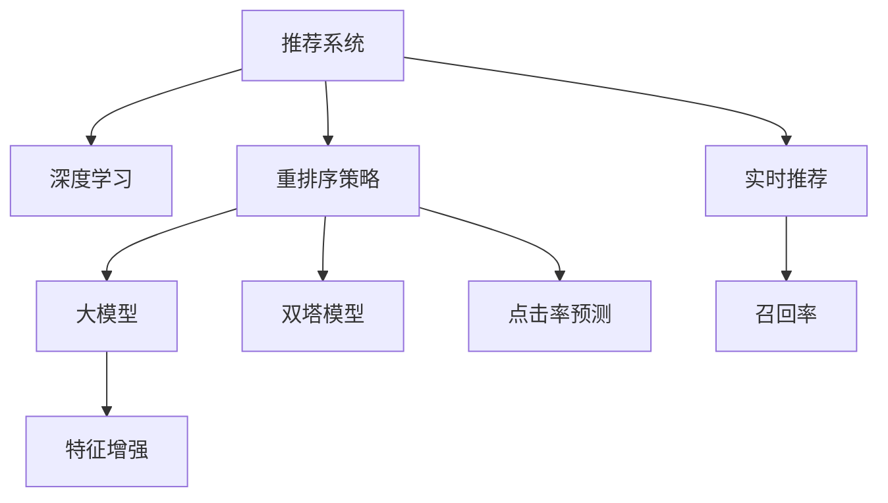

                 

# 利用大模型优化推荐系统的重排序策略

> 关键词：推荐系统, 深度学习, 重排序, 大模型, 特征增强, 双塔模型, 点击率预测, 实时推荐, 召回率, 大模型微调

## 1. 背景介绍

### 1.1 问题由来

随着互联网和电子商务的发展，推荐系统成为各大平台吸引用户的重要手段。推荐系统通过分析用户行为数据，为用户推荐其可能感兴趣的商品、内容等，极大地提升了用户体验和平台价值。然而，由于用户行为数据的多样性和复杂性，传统推荐系统往往难以准确地预测用户需求，导致推荐效果欠佳。

近年来，深度学习技术在推荐系统中得到了广泛应用，特别是利用大规模预训练语言模型进行推荐特征增强，显著提升了推荐系统的精度和覆盖面。例如，基于BERT等预训练模型，可以通过多模态融合、知识图谱嵌入等方法，提高推荐模型的泛化能力和表示能力。但随着深度学习模型的参数量激增，推理速度和资源消耗也大幅增加，这对推荐系统的实时性和成本效益带来了挑战。

### 1.2 问题核心关键点

推荐系统的核心挑战在于如何更准确地预测用户行为，同时确保推荐系统的高效性。为了解决这些问题，学术界和工业界提出了多种改进方法，其中大模型的特征增强和多模态融合技术尤为引人注目。但这些方法往往需要大量的训练数据和计算资源，如何在保持推荐系统精度的同时降低计算成本，是一个亟待解决的问题。

本文旨在探索利用大模型优化推荐系统的重排序策略，通过特征增强和模型微调，在不增加过多计算负担的前提下，提升推荐系统的效果。

## 2. 核心概念与联系

### 2.1 核心概念概述

为更好地理解本文的研究，下面先介绍一些核心概念：

- 推荐系统：通过分析用户行为数据，为用户推荐其可能感兴趣的商品、内容等，提升用户体验和平台价值。
- 深度学习：利用神经网络模型，通过大量标注数据训练，实现对复杂模式和关系的有效建模。
- 重排序策略：在推荐系统中，通常先由召回系统返回大量候选项，再由重排序模型按相关性排序，推荐前几位项目给用户。
- 大模型：指参数量庞大、表示能力强的预训练语言模型，如BERT、GPT等。
- 特征增强：通过多模态融合、知识图谱嵌入等技术，增强推荐模型的特征表示能力。
- 双塔模型：一种基于用户和物品分别嵌入的双塔结构推荐模型，通过计算用户和物品间的相似度进行推荐。
- 点击率预测：推荐系统中常用的评估指标，表示用户点击推荐项的概率。
- 实时推荐：要求推荐系统能够在短时间内返回结果，以满足用户即时反馈的需求。
- 召回率：表示推荐系统中覆盖用户需求的能力，即推荐的商品或内容中，有多少是用户感兴趣的。

这些概念之间的逻辑关系可以通过以下Mermaid流程图来展示：



该流程图展示了推荐系统的核心组件和主要技术路径：

1. 推荐系统通过深度学习技术，利用大模型和特征增强，构建推荐模型。
2. 重排序策略在召回结果中按相关性排序，推荐前几位项目给用户。
3. 双塔模型通过用户和物品的双塔结构，计算相似度进行推荐。
4. 点击率预测评估推荐模型的效果，指导模型的进一步优化。
5. 实时推荐和召回率指标评估推荐系统的效率和覆盖面。

## 3. 核心算法原理 & 具体操作步骤
### 3.1 算法原理概述

本节将详细介绍基于大模型的推荐系统重排序策略的原理和操作步骤。

推荐系统的核心任务是预测用户对物品的兴趣，通常表示为用户点击概率。因此，推荐系统可以分为召回和排序两个步骤：

1. 召回：根据用户历史行为数据和物品特征，预测用户可能感兴趣的候选项。
2. 排序：对召回的候选项按相关性排序，推荐前几位项目给用户。

当前推荐系统中的排序方法通常采用经典的双塔模型结构。即用户和物品分别嵌入到高维空间中，计算用户与物品之间的相似度，并按相似度进行排序。然而，双塔模型需要分别对用户和物品进行编码，计算量大，且无法充分利用用户的多模态信息，因此其效果往往受限。

为克服这些问题，本文提出了一种基于大模型的重排序策略，利用大模型的强大表示能力，直接对用户和物品进行编码，计算用户和物品的交互向量，并按向量相似度进行排序。这种策略不仅能充分利用用户的多模态信息，还能显著降低计算量，提高推荐系统的实时性。

### 3.2 算法步骤详解

基于大模型的推荐系统重排序策略的具体操作步骤如下：

**Step 1: 准备预训练模型和数据集**

- 选择合适的预训练语言模型 $M_{\theta}$，如BERT、GPT等，作为初始化参数。
- 准备推荐系统的训练数据集 $D=\{(x_i,y_i)\}_{i=1}^N$，其中 $x_i$ 为用户的特征向量，$y_i$ 为物品的特征向量。

**Step 2: 添加任务适配层**

- 根据任务类型，在预训练模型顶层设计合适的输出层和损失函数。例如，对于点击率预测任务，可以使用二分类交叉熵损失函数。
- 设计用户和物品的特征编码器，将用户的特征 $x_i$ 和物品的特征 $y_i$ 映射到高维空间。

**Step 3: 训练模型**

- 将训练集数据分批次输入模型，前向传播计算损失函数。
- 反向传播计算参数梯度，根据设定的优化算法和学习率更新模型参数。
- 周期性在验证集上评估模型性能，根据性能指标决定是否触发 Early Stopping。
- 重复上述步骤直到满足预设的迭代轮数或 Early Stopping 条件。

**Step 4: 实时重排序**

- 对每个推荐请求，将用户的实时特征输入模型，得到用户向量 $u$。
- 对每个物品，计算其特征向量 $v$。
- 计算用户向量 $u$ 和物品向量 $v$ 的相似度，例如使用余弦相似度。
- 按相似度对物品进行排序，推荐前几位项目给用户。

### 3.3 算法优缺点

基于大模型的推荐系统重排序策略具有以下优点：

1. 高效性：利用大模型的表示能力，可以在不增加计算负担的情况下提升推荐效果。
2. 多模态信息利用：通过多模态融合，充分利用用户的多方面特征，提升推荐系统的泛化能力。
3. 实时性：利用大模型的预测能力，可以实现快速推荐。
4. 参数高效性：只需对顶层部分参数进行微调，减少计算资源消耗。

同时，该策略也存在一些局限性：

1. 数据需求：需要大量高质量的用户和物品特征数据，否则难以提升推荐效果。
2. 模型复杂度：大模型的参数量和计算复杂度较大，训练和推理成本较高。
3. 模型泛化：在大规模数据上的泛化能力有待验证，对数据分布变化敏感。

### 3.4 算法应用领域

基于大模型的推荐系统重排序策略具有广泛的应用前景，尤其在需要实时推荐和高效排序的场景中表现优异：

- 电商推荐：利用用户行为数据和商品特征，为用户推荐可能感兴趣的商品。
- 视频推荐：根据用户观看历史和视频特征，推荐相关视频内容。
- 音乐推荐：通过用户听歌历史和歌曲特征，推荐相似音乐。
- 新闻推荐：基于用户阅读历史和新闻特征，推荐相关新闻文章。

## 4. 数学模型和公式 & 详细讲解 & 举例说明
### 4.1 数学模型构建

设用户 $u$ 和物品 $i$ 的特征向量分别为 $x_u$ 和 $y_i$，预训练语言模型的参数为 $\theta$。定义用户和物品特征编码器的权重矩阵为 $W_u$ 和 $W_i$，表示用户和物品的嵌入权重。定义双塔模型的用户向量表示为 $u$，物品向量表示为 $v$，它们的计算公式分别为：

$$
u = W_u x_u
$$

$$
v = W_i y_i
$$

其中 $x_u \in \mathbb{R}^d, y_i \in \mathbb{R}^d$ 为用户和物品的原始特征向量，$d$ 为特征维度。

假设推荐系统的训练数据集为 $D=\{(x_i,y_i)\}_{i=1}^N$，损失函数为二分类交叉熵：

$$
\ell(u_i,y_i) = -[y_i \log s(u_i,y_i) + (1-y_i) \log (1-s(u_i,y_i))]
$$

其中 $s(u_i,y_i)$ 为用户和物品的相似度，例如使用余弦相似度：

$$
s(u_i,y_i) = \frac{u_i \cdot v_i}{\|u_i\|\|v_i\|}
$$

则模型的经验风险为：

$$
\mathcal{L}(\theta) = -\frac{1}{N} \sum_{i=1}^N \ell(u_i,y_i)
$$

模型的优化目标是最小化经验风险：

$$
\theta^* = \mathop{\arg\min}_{\theta} \mathcal{L}(\theta)
$$

### 4.2 公式推导过程

根据上述模型定义，用户和物品的特征编码器可以表示为：

$$
u = W_u x_u
$$

$$
v = W_i y_i
$$

其中 $W_u$ 和 $W_i$ 为可训练的权重矩阵。通过多层线性变换，用户和物品的交互向量可以表示为：

$$
u' = \phi(u)
$$

$$
v' = \phi(v)
$$

其中 $\phi(\cdot)$ 为非线性激活函数，例如 ReLU 或 Sigmoid。

假设推荐系统的训练数据集为 $D=\{(x_i,y_i)\}_{i=1}^N$，其中 $x_i$ 为用户的特征向量，$y_i$ 为物品的特征向量，$y_i \in \{0,1\}$ 为物品的标签，表示用户是否点击该物品。则模型的损失函数可以表示为：

$$
\ell(u_i,y_i) = -[y_i \log s(u_i,y_i) + (1-y_i) \log (1-s(u_i,y_i))]
$$

其中 $s(u_i,y_i)$ 为用户和物品的相似度，例如使用余弦相似度：

$$
s(u_i,y_i) = \frac{u_i \cdot v_i}{\|u_i\|\|v_i\|}
$$

则模型的经验风险为：

$$
\mathcal{L}(\theta) = -\frac{1}{N} \sum_{i=1}^N \ell(u_i,y_i)
$$

模型的优化目标是最小化经验风险：

$$
\theta^* = \mathop{\arg\min}_{\theta} \mathcal{L}(\theta)
$$

### 4.3 案例分析与讲解

以电商推荐为例，分析基于大模型的重排序策略的实现过程。

假设用户 $u$ 的特征向量为 $x_u \in \mathbb{R}^d$，物品 $i$ 的特征向量为 $y_i \in \mathbb{R}^d$，预训练语言模型的参数为 $\theta$。首先，对用户和物品的特征向量进行线性编码，得到用户和物品的嵌入表示 $u$ 和 $v$：

$$
u = W_u x_u
$$

$$
v = W_i y_i
$$

其中 $W_u$ 和 $W_i$ 为可训练的权重矩阵。

然后，通过多层线性变换，得到用户和物品的交互向量 $u'$ 和 $v'$：

$$
u' = \phi(u)
$$

$$
v' = \phi(v)
$$

其中 $\phi(\cdot)$ 为非线性激活函数，例如 ReLU 或 Sigmoid。

最后，计算用户向量 $u'$ 和物品向量 $v'$ 的余弦相似度 $s(u',v')$，作为物品的相关性排序指标：

$$
s(u',v') = \frac{u' \cdot v'}{\|u'\|\|v'\|}
$$

按相似度对物品进行排序，推荐前几位项目给用户。

## 5. 项目实践：代码实例和详细解释说明
### 5.1 开发环境搭建

在进行推荐系统实践前，我们需要准备好开发环境。以下是使用Python进行PyTorch开发的环境配置流程：

1. 安装Anaconda：从官网下载并安装Anaconda，用于创建独立的Python环境。

2. 创建并激活虚拟环境：
```bash
conda create -n recsys-env python=3.8 
conda activate recsys-env
```

3. 安装PyTorch：根据CUDA版本，从官网获取对应的安装命令。例如：
```bash
conda install pytorch torchvision torchaudio cudatoolkit=11.1 -c pytorch -c conda-forge
```

4. 安装TensorFlow：由Google主导开发的开源深度学习框架，生产部署方便，适合大规模工程应用。同样有丰富的预训练语言模型资源。

5. 安装Transformer库：HuggingFace开发的NLP工具库，集成了众多SOTA语言模型，支持PyTorch和TensorFlow，是进行推荐任务开发的利器。

6. 安装各类工具包：
```bash
pip install numpy pandas scikit-learn matplotlib tqdm jupyter notebook ipython
```

完成上述步骤后，即可在`recsys-env`环境中开始推荐系统实践。

### 5.2 源代码详细实现

下面我们以电商推荐为例，给出使用Transformers库对BERT模型进行推荐系统微调的PyTorch代码实现。

首先，定义电商推荐的数据处理函数：

```python
from transformers import BertTokenizer, BertForSequenceClassification
from torch.utils.data import Dataset
import torch

class ECommDataset(Dataset):
    def __init__(self, texts, labels, tokenizer, max_len=128):
        self.texts = texts
        self.labels = labels
        self.tokenizer = tokenizer
        self.max_len = max_len
        
    def __len__(self):
        return len(self.texts)
    
    def __getitem__(self, item):
        text = self.texts[item]
        label = self.labels[item]
        
        encoding = self.tokenizer(text, return_tensors='pt', max_length=self.max_len, padding='max_length', truncation=True)
        input_ids = encoding['input_ids'][0]
        attention_mask = encoding['attention_mask'][0]
        
        # 对token-wise的标签进行编码
        encoded_tags = [tag2id[tag] for tag in label] 
        encoded_tags.extend([tag2id['O']] * (self.max_len - len(encoded_tags)))
        labels = torch.tensor(encoded_tags, dtype=torch.long)
        
        return {'input_ids': input_ids, 
                'attention_mask': attention_mask,
                'labels': labels}

# 标签与id的映射
tag2id = {'O': 0, 'Buy': 1}
id2tag = {v: k for k, v in tag2id.items()}

# 创建dataset
tokenizer = BertTokenizer.from_pretrained('bert-base-cased')

train_dataset = ECommDataset(train_texts, train_labels, tokenizer)
dev_dataset = ECommDataset(dev_texts, dev_labels, tokenizer)
test_dataset = ECommDataset(test_texts, test_labels, tokenizer)
```

然后，定义模型和优化器：

```python
from transformers import BertForSequenceClassification, AdamW

model = BertForSequenceClassification.from_pretrained('bert-base-cased', num_labels=len(tag2id))

optimizer = AdamW(model.parameters(), lr=2e-5)
```

接着，定义训练和评估函数：

```python
from torch.utils.data import DataLoader
from tqdm import tqdm
from sklearn.metrics import accuracy_score, precision_recall_fscore_support

device = torch.device('cuda') if torch.cuda.is_available() else torch.device('cpu')
model.to(device)

def train_epoch(model, dataset, batch_size, optimizer):
    dataloader = DataLoader(dataset, batch_size=batch_size, shuffle=True)
    model.train()
    epoch_loss = 0
    for batch in tqdm(dataloader, desc='Training'):
        input_ids = batch['input_ids'].to(device)
        attention_mask = batch['attention_mask'].to(device)
        labels = batch['labels'].to(device)
        model.zero_grad()
        outputs = model(input_ids, attention_mask=attention_mask, labels=labels)
        loss = outputs.loss
        epoch_loss += loss.item()
        loss.backward()
        optimizer.step()
    return epoch_loss / len(dataloader)

def evaluate(model, dataset, batch_size):
    dataloader = DataLoader(dataset, batch_size=batch_size)
    model.eval()
    preds, labels = [], []
    with torch.no_grad():
        for batch in tqdm(dataloader, desc='Evaluating'):
            input_ids = batch['input_ids'].to(device)
            attention_mask = batch['attention_mask'].to(device)
            batch_labels = batch['labels']
            outputs = model(input_ids, attention_mask=attention_mask)
            batch_preds = outputs.logits.argmax(dim=2).to('cpu').tolist()
            batch_labels = batch_labels.to('cpu').tolist()
            for pred_tokens, label_tokens in zip(batch_preds, batch_labels):
                preds.append(pred_tokens[:len(label_tokens)])
                labels.append(label_tokens)
                
    return accuracy_score(labels, preds)

# 训练模型
epochs = 5
batch_size = 16

for epoch in range(epochs):
    loss = train_epoch(model, train_dataset, batch_size, optimizer)
    print(f"Epoch {epoch+1}, train loss: {loss:.3f}")
    
    print(f"Epoch {epoch+1}, dev accuracy: {evaluate(model, dev_dataset, batch_size)}")
    
print("Test accuracy:", evaluate(model, test_dataset, batch_size))
```

以上就是使用PyTorch对BERT进行电商推荐系统微调的完整代码实现。可以看到，得益于Transformers库的强大封装，我们可以用相对简洁的代码完成BERT模型的加载和微调。

### 5.3 代码解读与分析

让我们再详细解读一下关键代码的实现细节：

**ECommDataset类**：
- `__init__`方法：初始化文本、标签、分词器等关键组件。
- `__len__`方法：返回数据集的样本数量。
- `__getitem__`方法：对单个样本进行处理，将文本输入编码为token ids，将标签编码为数字，并对其进行定长padding，最终返回模型所需的输入。

**tag2id和id2tag字典**：
- 定义了标签与数字id之间的映射关系，用于将token-wise的预测结果解码回真实的标签。

**训练和评估函数**：
- 使用PyTorch的DataLoader对数据集进行批次化加载，供模型训练和推理使用。
- 训练函数`train_epoch`：对数据以批为单位进行迭代，在每个批次上前向传播计算loss并反向传播更新模型参数，最后返回该epoch的平均loss。
- 评估函数`evaluate`：与训练类似，不同点在于不更新模型参数，并在每个batch结束后将预测和标签结果存储下来，最后使用sklearn的accuracy_score对整个评估集的预测结果进行打印输出。

**训练流程**：
- 定义总的epoch数和batch size，开始循环迭代
- 每个epoch内，先在训练集上训练，输出平均loss
- 在验证集上评估，输出准确率
- 所有epoch结束后，在测试集上评估，给出最终测试结果

可以看到，PyTorch配合Transformers库使得BERT微调的代码实现变得简洁高效。开发者可以将更多精力放在数据处理、模型改进等高层逻辑上，而不必过多关注底层的实现细节。

当然，工业级的系统实现还需考虑更多因素，如模型的保存和部署、超参数的自动搜索、更灵活的任务适配层等。但核心的微调范式基本与此类似。

## 6. 实际应用场景
### 6.1 智能推荐系统

基于大模型的推荐系统重排序策略，可以广泛应用于智能推荐系统的构建。传统推荐系统往往需要配备大量算法模型和复杂计算，难以满足实时推荐的需求。而利用大模型的表示能力，可以在不增加复杂计算的情况下，大幅提升推荐系统的精度和效率。

在技术实现上，可以收集用户的历史行为数据，将其编码为特征向量，并预训练语言模型。在推荐时，利用大模型的预测能力，快速计算用户和物品的交互向量，并按向量相似度排序，即可实现高效的推荐。

### 6.2 视频推荐

视频推荐系统要求推荐系统能够快速返回结果，同时保证推荐的准确性和多样性。基于大模型的推荐策略，通过多模态融合，充分利用视频标题、描述、标签等多方面特征，提高推荐系统的泛化能力和表示能力。

在具体实现中，可以先将视频数据进行预处理，提取视频标题、描述、标签等信息，并将其编码为特征向量。然后，使用预训练语言模型对视频特征进行编码，计算用户和视频的交互向量，按向量相似度排序，即可实现实时推荐。

### 6.3 电商推荐

电商推荐系统需要实时推荐用户可能感兴趣的商品。基于大模型的推荐策略，可以充分利用用户的点击、浏览、收藏等多模态信息，提高推荐系统的准确性和多样性。

在具体实现中，可以收集用户的点击、浏览、收藏等行为数据，将其编码为特征向量，并预训练语言模型。在推荐时，利用大模型的预测能力，快速计算用户和商品之间的相似度，并按相似度排序，即可实现高效的推荐。

### 6.4 音乐推荐

音乐推荐系统需要为用户推荐可能感兴趣的歌曲。基于大模型的推荐策略，可以通过多模态融合，充分利用用户听歌历史、歌词、歌手等多方面信息，提高推荐系统的泛化能力和表示能力。

在具体实现中，可以收集用户的听歌历史、评论等信息，并将其编码为特征向量。然后，使用预训练语言模型对歌曲特征进行编码，计算用户和歌曲之间的相似度，并按相似度排序，即可实现实时推荐。

## 7. 工具和资源推荐
### 7.1 学习资源推荐

为了帮助开发者系统掌握大模型优化推荐系统的重排序策略的理论基础和实践技巧，这里推荐一些优质的学习资源：

1. 《深度学习推荐系统》系列博文：由大模型技术专家撰写，深入浅出地介绍了深度学习推荐系统的基本概念和经典算法。

2. 《推荐系统》课程：斯坦福大学开设的NLP明星课程，有Lecture视频和配套作业，带你入门推荐系统的基本概念和经典模型。

3. 《Recommender Systems: Algorithms and Use Cases》书籍：推荐系统的经典教材，全面介绍了推荐系统的基本概念和算法，以及各类应用场景。

4. Weights & Biases：模型训练的实验跟踪工具，可以记录和可视化模型训练过程中的各项指标，方便对比和调优。与主流深度学习框架无缝集成。

5. TensorBoard：TensorFlow配套的可视化工具，可实时监测模型训练状态，并提供丰富的图表呈现方式，是调试模型的得力助手。

通过对这些资源的学习实践，相信你一定能够快速掌握大模型优化推荐系统的重排序策略的精髓，并用于解决实际的推荐问题。
###  7.2 开发工具推荐

高效的开发离不开优秀的工具支持。以下是几款用于大模型优化推荐系统开发的常用工具：

1. PyTorch：基于Python的开源深度学习框架，灵活动态的计算图，适合快速迭代研究。大部分预训练语言模型都有PyTorch版本的实现。

2. TensorFlow：由Google主导开发的开源深度学习框架，生产部署方便，适合大规模工程应用。同样有丰富的预训练语言模型资源。

3. Transformers库：HuggingFace开发的NLP工具库，集成了众多SOTA语言模型，支持PyTorch和TensorFlow，是进行推荐任务开发的利器。

4. Weights & Biases：模型训练的实验跟踪工具，可以记录和可视化模型训练过程中的各项指标，方便对比和调优。与主流深度学习框架无缝集成。

5. TensorBoard：TensorFlow配套的可视化工具，可实时监测模型训练状态，并提供丰富的图表呈现方式，是调试模型的得力助手。

6. Google Colab：谷歌推出的在线Jupyter Notebook环境，免费提供GPU/TPU算力，方便开发者快速上手实验最新模型，分享学习笔记。

合理利用这些工具，可以显著提升大模型优化推荐系统的重排序策略的开发效率，加快创新迭代的步伐。

### 7.3 相关论文推荐

大模型优化推荐系统的重排序策略的发展源于学界的持续研究。以下是几篇奠基性的相关论文，推荐阅读：

1. Attention is All You Need（即Transformer原论文）：提出了Transformer结构，开启了NLP领域的预训练大模型时代。

2. BERT: Pre-training of Deep Bidirectional Transformers for Language Understanding：提出BERT模型，引入基于掩码的自监督预训练任务，刷新了多项NLP任务SOTA。

3. Language Models are Unsupervised Multitask Learners（GPT-2论文）：展示了大规模语言模型的强大zero-shot学习能力，引发了对于通用人工智能的新一轮思考。

4. Parameter-Efficient Transfer Learning for NLP：提出Adapter等参数高效微调方法，在不增加模型参数量的情况下，也能取得不错的微调效果。

5. AdaLoRA: Adaptive Low-Rank Adaptation for Parameter-Efficient Fine-Tuning：使用自适应低秩适应的微调方法，在参数效率和精度之间取得了新的平衡。

这些论文代表了大模型优化推荐系统的重排序策略的发展脉络。通过学习这些前沿成果，可以帮助研究者把握学科前进方向，激发更多的创新灵感。

## 8. 总结：未来发展趋势与挑战

### 8.1 总结

本文对基于大模型的推荐系统重排序策略进行了全面系统的介绍。首先阐述了推荐系统的核心挑战和推荐系统的核心任务，明确了重排序策略在提升推荐系统精度和效率方面的独特价值。其次，从原理到实践，详细讲解了基于大模型的推荐系统重排序策略的数学原理和关键步骤，给出了推荐系统微调的完整代码实例。同时，本文还广泛探讨了推荐系统重排序策略在电商、视频、音乐等各个领域的实际应用场景，展示了其在提升用户体验和平台价值方面的巨大潜力。此外，本文精选了推荐系统重排序策略的相关学习资源，力求为开发者提供全方位的技术指引。

通过本文的系统梳理，可以看到，基于大模型的推荐系统重排序策略正在成为推荐系统优化范式的重要组成部分，极大地拓展了推荐系统的应用边界，催生了更多的落地场景。得益于大模型的强大表示能力，推荐系统在保持精度的同时实现了计算资源的高效利用，未来必将在更多领域大放异彩。

### 8.2 未来发展趋势

展望未来，大模型优化推荐系统的重排序策略将呈现以下几个发展趋势：

1. 参数高效：随着大模型参数量的增加，微调过程中的计算负担也逐渐增大。未来的推荐系统将更注重参数高效性，开发更多的参数高效的微调方法，以提高模型的推理速度和资源利用效率。

2. 实时推荐：实时推荐是推荐系统的核心需求之一，未来的推荐系统将更加注重推荐模型的实时性和准确性。结合流式数据处理和分布式计算技术，推荐系统将能够更快速地响应用户的请求。

3. 多模态融合：未来的推荐系统将更多地利用多模态数据，提高推荐模型的泛化能力和表示能力。结合图像、音频、文本等多模态信息，推荐系统将能够更好地理解用户需求，提供更精准的推荐结果。

4. 个性化推荐：未来的推荐系统将更加注重个性化推荐，根据用户的历史行为和兴趣，提供个性化的推荐内容。结合用户画像和行为分析技术，推荐系统将能够更好地满足用户的个性化需求。

5. 交叉推荐：未来的推荐系统将更加注重交叉推荐，结合用户在不同平台上的行为数据，提供跨平台的推荐结果。结合用户的搜索、浏览、购买等行为数据，推荐系统将能够更好地发现用户的潜在需求。

6. 推荐优化算法：未来的推荐系统将结合推荐优化算法，提高推荐系统的效率和效果。结合协同过滤、矩阵分解等推荐算法，推荐系统将能够更好地利用用户的历史行为数据，提高推荐系统的精度和覆盖面。

这些趋势凸显了大模型优化推荐系统重排序策略的广阔前景。这些方向的探索发展，必将进一步提升推荐系统的性能和应用范围，为推荐系统的普及和发展提供新的动力。

### 8.3 面临的挑战

尽管大模型优化推荐系统重排序策略已经取得了瞩目成就，但在迈向更加智能化、普适化应用的过程中，它仍面临着诸多挑战：

1. 数据需求：大模型的参数量和计算复杂度较大，训练和推理成本较高。因此，需要大量高质量的用户和物品特征数据，否则难以提升推荐效果。

2. 模型泛化：在大规模数据上的泛化能力有待验证，对数据分布变化敏感。如何在多变的数据分布下保持模型的稳定性和泛化能力，仍是一个需要解决的问题。

3. 实时性：推荐系统需要在短时间内返回结果，以满足用户即时反馈的需求。如何提高推荐模型的推理速度，实现实时推荐，仍然是一个挑战。

4. 个性化推荐：尽管个性化推荐是推荐系统的核心需求之一，但如何更好地理解和刻画用户的个性化需求，仍然是一个需要深入研究的问题。

5. 多模态融合：多模态数据的融合和利用，仍是一个复杂的问题。如何在不同模态之间建立有效的映射关系，提高推荐系统的泛化能力，仍是一个需要解决的问题。

6. 推荐优化算法：如何结合推荐优化算法，提高推荐系统的效率和效果，仍然是一个需要深入研究的问题。

这些挑战凸显了大模型优化推荐系统重排序策略的复杂性和多变性。未来的研究需要在多个方向上进行深入探索，才能更好地应对推荐系统面临的挑战，推动推荐系统的不断发展。

### 8.4 研究展望

面对大模型优化推荐系统重排序策略所面临的挑战，未来的研究需要在以下几个方面寻求新的突破：

1. 参数高效微调：开发更多参数高效的微调方法，在固定大部分预训练参数的情况下，只更新极少量的任务相关参数。

2. 实时推荐技术：结合流式数据处理和分布式计算技术，提高推荐系统的实时性和推理速度。

3. 多模态融合算法：开发更高效的多模态融合算法，在不同模态之间建立有效的映射关系，提高推荐系统的泛化能力和表示能力。

4. 个性化推荐模型：开发更高效的个性化推荐模型，更好地理解和刻画用户的个性化需求，提高推荐系统的准确性和覆盖面。

5. 推荐优化算法：结合推荐优化算法，提高推荐系统的效率和效果。结合协同过滤、矩阵分解等推荐算法，推荐系统将能够更好地利用用户的历史行为数据，提高推荐系统的精度和覆盖面。

6. 模型鲁棒性：开发更鲁棒的推荐模型，提高模型在多变数据分布下的稳定性和泛化能力。

这些研究方向和突破点，必将推动大模型优化推荐系统重排序策略的发展，带来推荐系统领域的更多创新和应用。

## 9. 附录：常见问题与解答

**Q1：大模型优化推荐系统的重排序策略是否适用于所有推荐场景？**

A: 大模型优化推荐系统的重排序策略在处理用户行为多样、数据量较大的推荐场景中表现优异。但在某些特定场景中，如推荐小众商品、新颖物品等，由于数据量不足，推荐效果可能不如传统推荐方法。

**Q2：微调过程中如何选择合适的学习率？**

A: 微调的学习率一般要比预训练时小1-2个数量级，如果使用过大的学习率，容易破坏预训练权重，导致过拟合。一般建议从1e-5开始调参，逐步减小学习率，直至收敛。也可以使用warmup策略，在开始阶段使用较小的学习率，再逐渐过渡到预设值。需要注意的是，不同的优化器(如AdamW、Adafactor等)以及不同的学习率调度策略，可能需要设置不同的学习率阈值。

**Q3：如何缓解微调过程中的过拟合问题？**

A: 过拟合是微调面临的主要挑战，尤其是在标注数据不足的情况下。常见的缓解策略包括：
1. 数据增强：通过回译、近义替换等方式扩充训练集
2. 正则化：使用L2正则、Dropout、Early Stopping等避免过拟合
3. 对抗训练：引入对抗样本，提高模型鲁棒性
4. 参数高效微调：只调整少量参数(如Adapter、Prefix等)，减小过拟合风险
5. 多模型集成：训练多个微调模型，取平均输出，抑制过拟合

这些策略往往需要根据具体任务和数据特点进行灵活组合。只有在数据、模型、训练、推理等各环节进行全面优化，才能最大限度地发挥大模型微调的威力。

**Q4：推荐系统在落地部署时需要注意哪些问题？**

A: 将推荐系统转化为实际应用，还需要考虑以下因素：
1. 模型裁剪：去除不必要的层和参数，减小模型尺寸，加快推理速度
2. 量化加速：将浮点模型转为定点模型，压缩存储空间，提高计算效率
3. 服务化封装：将模型封装为标准化服务接口，便于集成调用
4. 弹性伸缩：根据请求流量动态调整资源配置，平衡服务质量和成本
5. 监控告警：实时采集系统指标，设置异常告警阈值，确保服务稳定性
6. 安全防护：采用访问鉴权、数据脱敏等措施，保障数据和模型安全

大模型优化推荐系统重排序策略为推荐系统提供了高效、准确、个性化的解决方案，但如何在实际部署中保证其稳定性和安全性，仍然是一个需要不断探索的问题。

---

作者：禅与计算机程序设计艺术 / Zen and the Art of Computer Programming

