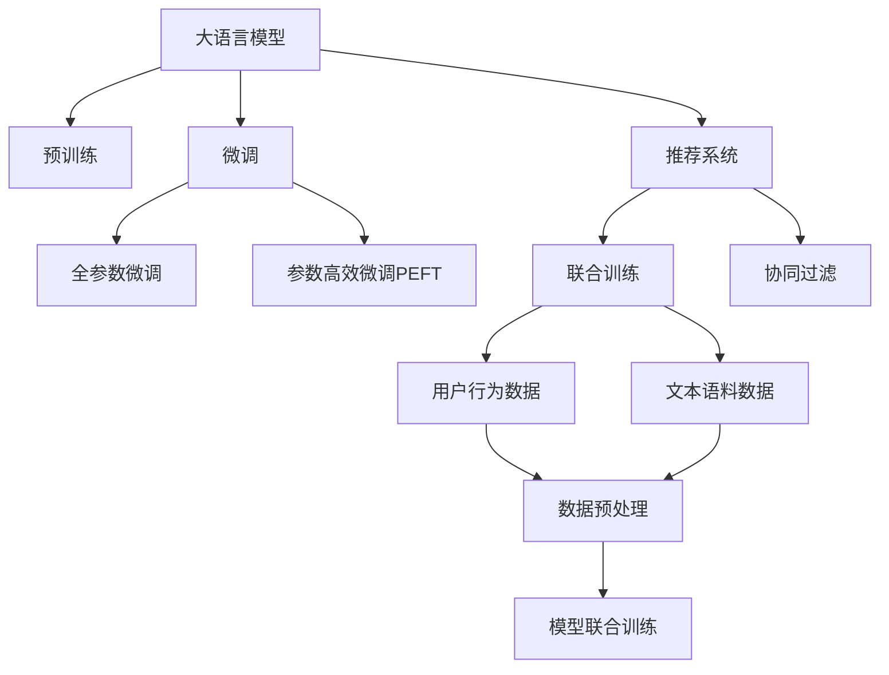

                 

# 利用大模型提升推荐系统的跨领域迁移能力

## 1. 背景介绍

### 1.1 问题由来
推荐系统（Recommender System）是互联网时代面向用户的核心技术，广泛应用于电商、社交、新闻等领域，帮助用户发现有价值的信息和商品。传统的推荐系统通常基于用户的显式行为数据进行推荐，难以充分挖掘用户潜在的兴趣和需求。近年来，随着深度学习技术的兴起，基于隐式特征和协同过滤的推荐系统，如MF（矩阵分解）和ALS（交替最小二乘）等，在数据量和特征空间不断膨胀的情况下，逐渐显示出算力消耗大、扩展性不足的局限性。

为了克服这些问题，深度学习驱动的协同过滤和内容推荐技术应运而生。通过预训练和微调大语言模型，这些技术能更好地捕捉用户行为背后的语义信息，提升推荐准确率和多样性。然而，现有的推荐系统在面对数据跨领域迁移和知识积累方面仍存在不足，难以在不同领域间实现泛化。如何利用大语言模型的优势，提升推荐系统的跨领域迁移能力，成为亟待解决的问题。

## 2. 核心概念与联系

### 2.1 核心概念概述

为更好地理解基于大语言模型的推荐系统跨领域迁移方法，本节将介绍几个密切相关的核心概念：

- 大语言模型(Large Language Model, LLM)：以自回归(如GPT)或自编码(如BERT)模型为代表的大规模预训练语言模型。通过在大规模无标签文本语料上进行预训练，学习通用的语言表示，具备强大的语言理解和生成能力。

- 预训练(Pre-training)：指在大规模无标签文本语料上，通过自监督学习任务训练通用语言模型的过程。常见的预训练任务包括言语建模、遮挡语言模型等。预训练使得模型学习到语言的通用表示。

- 微调(Fine-tuning)：指在预训练模型的基础上，使用下游任务的少量标注数据，通过有监督地训练来优化模型在该任务上的性能。通常只需要调整顶层分类器或解码器，并以较小的学习率更新全部或部分的模型参数。

- 推荐系统(Recommender System)：面向用户提供个性化信息和服务的技术。通过分析用户历史行为和偏好，为用户推荐其可能感兴趣的内容。

- 跨领域迁移能力：指模型在不同领域之间，能够利用已有的知识经验，快速适应用户需求变化的能力。大语言模型由于其泛化性强、表示能力强，天然适合跨领域迁移。

- 联合训练(Joint Training)：指在推荐系统的用户行为数据和语言模型的文本语料数据上进行联合训练，共享模型表示，提升推荐效果和语言理解能力。

这些核心概念之间的逻辑关系可以通过以下Mermaid流程图来展示：



这个流程图展示了大语言模型、微调和推荐系统的核心概念及其之间的关系：

1. 大语言模型通过预训练获得基础能力。
2. 微调是对预训练模型进行任务特定的优化，可以分为全参数微调和参数高效微调（PEFT）。
3. 推荐系统利用大语言模型的知识进行用户兴趣建模和内容推荐。
4. 联合训练使得模型能够在用户行为数据和文本语料数据上进行双向迁移学习，提升推荐效果和语言理解能力。
5. 协同过滤和内容推荐技术，通过微调模型实现，利用用户行为数据预测用户兴趣，并利用内容特征进行推荐。

这些概念共同构成了推荐系统的学习和应用框架，使其能够在各种场景下发挥强大的信息推荐能力。通过理解这些核心概念，我们可以更好地把握大语言模型在推荐系统中的应用，并对其性能进行优化。

## 3. 核心算法原理 & 具体操作步骤
### 3.1 算法原理概述

利用大语言模型提升推荐系统的跨领域迁移能力，本质上是一个在用户行为数据和文本语料数据上进行联合训练和迁移学习的过程。其核心思想是：将预训练的大语言模型和推荐系统的协同过滤组件联合训练，使得模型在共享的语言表示空间中同时具备良好的推荐性能和语言理解能力。

形式化地，假设预训练模型为 $M_{\theta}$，其中 $\theta$ 为预训练得到的模型参数。设推荐系统用户行为数据集为 $D_{user}=\{(x_i, y_i)\}_{i=1}^N$，其中 $x_i$ 为用户行为特征，$y_i$ 为用户兴趣标签。将用户行为数据和文本语料数据进行拼接，形成联合训练数据集 $D=\{(x_i, y_i)\}_{i=1}^N \cup \{(x'_i, y'_i)\}_{i=1}^{N'}$，其中 $x'_i$ 为文本数据，$y'_i$ 为文本分类标签。

定义联合训练损失函数 $\mathcal{L}_{joint}$ 为：

$$
\mathcal{L}_{joint} = \mathcal{L}_{user} + \mathcal{L}_{text}
$$

其中 $\mathcal{L}_{user}$ 为用户行为数据的推荐损失函数，$\mathcal{L}_{text}$ 为文本语料数据的分类损失函数。假设用户行为数据和文本语料数据均为二分类任务，则推荐损失函数和分类损失函数分别为：

$$
\mathcal{L}_{user} = -\frac{1}{N} \sum_{i=1}^N \log P(y_i|x_i)
$$

$$
\mathcal{L}_{text} = -\frac{1}{N'} \sum_{i=1}^{N'} \log P(y'_i|x'_i)
$$

联合训练的目标是最小化联合损失函数 $\mathcal{L}_{joint}$，即：

$$
\theta^* = \mathop{\arg\min}_{\theta} \mathcal{L}_{joint}(M_{\theta})
$$

通过联合训练，模型 $M_{\theta}$ 可以在用户行为数据和文本语料数据上同时学习到推荐和分类的相关特征，实现跨领域迁移。

### 3.2 算法步骤详解

利用大语言模型提升推荐系统跨领域迁移能力的具体操作步骤如下：

**Step 1: 准备预训练模型和数据集**
- 选择合适的预训练语言模型 $M_{\theta}$ 作为初始化参数，如 BERT、GPT等。
- 收集推荐系统用户行为数据集 $D_{user}$ 和文本语料数据集 $D_{text}$，包含用户行为特征和文本分类标签。
- 将两个数据集进行拼接，形成联合训练数据集 $D$。

**Step 2: 设计联合训练模型**
- 设计联合训练模型结构，可以基于Transformer、DNN等架构。
- 将模型分为两个部分：用户行为分析和文本分类。
- 用户行为分析部分接收用户行为特征，输出用户兴趣标签。
- 文本分类部分接收文本数据，输出分类标签。

**Step 3: 设置联合训练超参数**
- 选择合适的优化算法及其参数，如 AdamW、SGD 等，设置学习率、批大小、迭代轮数等。
- 设置正则化技术及强度，包括权重衰减、Dropout、Early Stopping 等。
- 确定冻结预训练参数的策略，如仅微调顶层，或全部参数都参与联合训练。

**Step 4: 执行联合训练**
- 将联合训练数据集 $D$ 分批次输入模型，前向传播计算损失函数。
- 反向传播计算参数梯度，根据设定的优化算法和学习率更新模型参数。
- 周期性在验证集上评估模型性能，根据性能指标决定是否触发 Early Stopping。
- 重复上述步骤直到满足预设的迭代轮数或 Early Stopping 条件。

**Step 5: 测试和部署**
- 在测试集上评估联合训练后模型 $M_{\theta}$ 的性能，对比联合训练前后的推荐效果和分类效果。
- 使用微调后的模型对新样本进行推荐，集成到实际的应用系统中。
- 持续收集新的数据，定期重新联合训练模型，以适应数据分布的变化。

以上是利用大语言模型提升推荐系统跨领域迁移能力的一般流程。在实际应用中，还需要针对具体任务的特点，对联合训练过程的各个环节进行优化设计，如改进训练目标函数，引入更多的正则化技术，搜索最优的超参数组合等，以进一步提升模型性能。

### 3.3 算法优缺点

利用大语言模型提升推荐系统跨领域迁移能力的方法具有以下优点：
1. 数据泛化性强。联合训练使得模型能够从文本语料数据中学习通用语言特征，提升推荐系统的泛化性能。
2. 知识整合能力强。通过联合训练，模型能够同时学习用户行为和文本语义知识，提升推荐效果和语言理解能力。
3. 结构灵活。联合训练模型可以根据具体任务需求进行灵活设计，易于适配各种推荐场景。
4. 参数共享。共享的语言表示使得模型在推荐和分类任务间可进行双向迁移学习，减小了模型参数的重复训练。

同时，该方法也存在一定的局限性：
1. 数据依赖性强。联合训练的效果很大程度上取决于用户行为数据和文本语料数据的质量，获取高质量标注数据的成本较高。
2. 复杂度高。联合训练过程需要同时处理两种不同类型的数据，增加了训练的复杂性和计算成本。
3. 训练时间长。由于需要同时优化用户行为和文本分类任务，联合训练过程可能需要更长的训练时间。
4. 数据关联难度大。用户行为数据和文本语料数据之间的关联性较弱，难以通过简单的拼接进行有效整合。

尽管存在这些局限性，但就目前而言，基于大语言模型的推荐系统跨领域迁移方法仍然是一种高效、灵活、可扩展的推荐技术。未来相关研究的重点在于如何进一步降低联合训练对数据标注的依赖，提高模型的泛化能力和知识整合能力，同时兼顾参数高效性和训练效率等。

### 3.4 算法应用领域

利用大语言模型提升推荐系统的跨领域迁移能力，已经在电商、社交、新闻等多个推荐场景中得到广泛应用，具体如下：

- 电商推荐：通过分析用户浏览、点击、购买等行为数据，联合训练大语言模型和协同过滤模型，推荐用户可能感兴趣的商品。
- 社交推荐：结合用户好友关系和文本语料数据，推荐用户可能感兴趣的内容。
- 新闻推荐：根据用户阅读历史和评论文本，联合训练模型进行新闻内容推荐。
- 视频推荐：结合用户观看历史和视频描述文本，联合训练模型推荐用户可能感兴趣的视频内容。
- 游戏推荐：分析用户的游戏行为和文本评价，联合训练模型推荐游戏内容。

除了上述这些经典场景外，联合训练方法也在更多创新场景中得到应用，如智能问答、旅游规划、金融投资等，为推荐系统带来了新的突破。随着预训练语言模型和联合训练方法的不断进步，相信推荐系统将在更广阔的应用领域大放异彩。

## 4. 数学模型和公式 & 详细讲解  
### 4.1 数学模型构建

本节将使用数学语言对基于大语言模型的推荐系统跨领域迁移过程进行更加严格的刻画。

记预训练语言模型为 $M_{\theta}$，其中 $\theta$ 为预训练得到的模型参数。假设推荐系统的用户行为数据集为 $D_{user}=\{(x_i, y_i)\}_{i=1}^N$，其中 $x_i$ 为用户行为特征，$y_i$ 为用户兴趣标签。假设文本语料数据集为 $D_{text}=\{(x'_i, y'_i)\}_{i=1}^{N'}$，其中 $x'_i$ 为文本数据，$y'_i$ 为文本分类标签。将用户行为数据和文本语料数据拼接，形成联合训练数据集 $D=\{(x_i, y_i)\}_{i=1}^N \cup \{(x'_i, y'_i)\}_{i=1}^{N'}$。

定义联合训练损失函数 $\mathcal{L}_{joint}$ 为：

$$
\mathcal{L}_{joint} = -\frac{1}{N} \sum_{i=1}^N \log P(y_i|x_i) + -\frac{1}{N'} \sum_{i=1}^{N'} \log P(y'_i|x'_i)
$$

其中，$P(y_i|x_i)$ 为用户行为数据的推荐概率分布，$P(y'_i|x'_i)$ 为文本语料数据的分类概率分布。假设用户行为数据和文本语料数据均为二分类任务，则推荐概率分布和分类概率分布分别为：

$$
P(y_i|x_i) = \frac{e^{\hat{y}_i}}{1+e^{\hat{y}_i}}
$$

$$
P(y'_i|x'_i) = \frac{e^{\hat{y}'_i}}{1+e^{\hat{y}'_i}}
$$

其中 $\hat{y}_i$ 为推荐模型对用户行为数据的预测结果，$\hat{y}'_i$ 为分类模型对文本语料数据的预测结果。

### 4.2 公式推导过程

以下我们以二分类任务为例，推导联合训练损失函数及其梯度的计算公式。

假设联合训练模型为 $M_{\theta}(x)=P(y|x)$，其中 $x$ 为用户行为特征或文本数据，$y$ 为兴趣标签或分类标签。在用户行为数据上进行联合训练时，定义推荐损失函数 $\mathcal{L}_{user}$ 为：

$$
\mathcal{L}_{user} = -\frac{1}{N} \sum_{i=1}^N \log P(y_i|x_i)
$$

在文本语料数据上进行联合训练时，定义分类损失函数 $\mathcal{L}_{text}$ 为：

$$
\mathcal{L}_{text} = -\frac{1}{N'} \sum_{i=1}^{N'} \log P(y'_i|x'_i)
$$

因此，联合训练损失函数 $\mathcal{L}_{joint}$ 可以表示为：

$$
\mathcal{L}_{joint} = \mathcal{L}_{user} + \mathcal{L}_{text}
$$

将推荐损失函数和分类损失函数代入，得：

$$
\mathcal{L}_{joint} = -\frac{1}{N} \sum_{i=1}^N \log P(y_i|x_i) + -\frac{1}{N'} \sum_{i=1}^{N'} \log P(y'_i|x'_i)
$$

根据链式法则，联合训练损失函数对模型参数 $\theta$ 的梯度为：

$$
\frac{\partial \mathcal{L}_{joint}}{\partial \theta} = \frac{\partial \mathcal{L}_{user}}{\partial \theta} + \frac{\partial \mathcal{L}_{text}}{\partial \theta}
$$

其中 $\frac{\partial \mathcal{L}_{user}}{\partial \theta}$ 和 $\frac{\partial \mathcal{L}_{text}}{\partial \theta}$ 分别为用户行为数据和文本语料数据对模型参数 $\theta$ 的梯度。

在得到联合训练损失函数的梯度后，即可带入优化算法，完成模型的迭代优化。重复上述过程直至收敛，最终得到适应推荐和分类任务的联合训练后模型参数 $\theta^*$。

## 5. 项目实践：代码实例和详细解释说明
### 5.1 开发环境搭建

在进行联合训练实践前，我们需要准备好开发环境。以下是使用Python进行PyTorch开发的环境配置流程：

1. 安装Anaconda：从官网下载并安装Anaconda，用于创建独立的Python环境。

2. 创建并激活虚拟环境：
```bash
conda create -n pytorch-env python=3.8 
conda activate pytorch-env
```

3. 安装PyTorch：根据CUDA版本，从官网获取对应的安装命令。例如：
```bash
conda install pytorch torchvision torchaudio cudatoolkit=11.1 -c pytorch -c conda-forge
```

4. 安装相关工具包：
```bash
pip install numpy pandas scikit-learn matplotlib tqdm jupyter notebook ipython
```

完成上述步骤后，即可在`pytorch-env`环境中开始联合训练实践。

### 5.2 源代码详细实现

这里我们以电商平台推荐系统为例，给出使用Transformers库对BERT模型进行联合训练的PyTorch代码实现。

首先，定义推荐系统用户行为数据和文本语料数据的处理函数：

```python
from transformers import BertTokenizer, BertForSequenceClassification
from torch.utils.data import Dataset
import torch

class UserBehaviorDataset(Dataset):
    def __init__(self, user_behavior_data, text_data, tokenizer, max_len=128):
        self.user_behavior_data = user_behavior_data
        self.text_data = text_data
        self.tokenizer = tokenizer
        self.max_len = max_len
        
    def __len__(self):
        return len(self.user_behavior_data)
    
    def __getitem__(self, item):
        user_behavior = self.user_behavior_data[item]
        text = self.text_data[item]
        
        encoding = self.tokenizer(text, return_tensors='pt', max_length=self.max_len, padding='max_length', truncation=True)
        input_ids = encoding['input_ids'][0]
        attention_mask = encoding['attention_mask'][0]
        
        # 对token-wise的标签进行编码
        encoded_labels = [label2id[label] for label in user_behavior] 
        encoded_labels.extend([label2id['O']] * (self.max_len - len(encoded_labels)))
        labels = torch.tensor(encoded_labels, dtype=torch.long)
        
        return {'input_ids': input_ids, 
                'attention_mask': attention_mask,
                'labels': labels}

class TextDataset(Dataset):
    def __init__(self, text_data, tokenizer, max_len=128):
        self.text_data = text_data
        self.tokenizer = tokenizer
        self.max_len = max_len
        
    def __len__(self):
        return len(self.text_data)
    
    def __getitem__(self, item):
        text = self.text_data[item]
        
        encoding = self.tokenizer(text, return_tensors='pt', max_length=self.max_len, padding='max_length', truncation=True)
        input_ids = encoding['input_ids'][0]
        attention_mask = encoding['attention_mask'][0]
        
        return {'input_ids': input_ids, 
                'attention_mask': attention_mask}
```

然后，定义联合训练模型：

```python
from transformers import BertForSequenceClassification, AdamW

model = BertForSequenceClassification.from_pretrained('bert-base-cased', num_labels=2)

optimizer = AdamW(model.parameters(), lr=2e-5)
```

接着，定义训练和评估函数：

```python
from torch.utils.data import DataLoader
from tqdm import tqdm
from sklearn.metrics import classification_report

device = torch.device('cuda') if torch.cuda.is_available() else torch.device('cpu')
model.to(device)

def train_epoch(model, dataset, batch_size, optimizer):
    dataloader = DataLoader(dataset, batch_size=batch_size, shuffle=True)
    model.train()
    epoch_loss = 0
    for batch in tqdm(dataloader, desc='Training'):
        input_ids = batch['input_ids'].to(device)
        attention_mask = batch['attention_mask'].to(device)
        labels = batch['labels'].to(device)
        model.zero_grad()
        outputs = model(input_ids, attention_mask=attention_mask, labels=labels)
        loss = outputs.loss
        epoch_loss += loss.item()
        loss.backward()
        optimizer.step()
    return epoch_loss / len(dataloader)

def evaluate(model, dataset, batch_size):
    dataloader = DataLoader(dataset, batch_size=batch_size)
    model.eval()
    preds, labels = [], []
    with torch.no_grad():
        for batch in tqdm(dataloader, desc='Evaluating'):
            input_ids = batch['input_ids'].to(device)
            attention_mask = batch['attention_mask'].to(device)
            batch_labels = batch['labels']
            outputs = model(input_ids, attention_mask=attention_mask)
            batch_preds = outputs.logits.argmax(dim=2).to('cpu').tolist()
            batch_labels = batch_labels.to('cpu').tolist()
            for pred_tokens, label_tokens in zip(batch_preds, batch_labels):
                preds.append(pred_tokens[:len(label_tokens)])
                labels.append(label_tokens)
                
    print(classification_report(labels, preds))
```

最后，启动联合训练流程并在测试集上评估：

```python
epochs = 5
batch_size = 16

for epoch in range(epochs):
    loss = train_epoch(model, train_dataset, batch_size, optimizer)
    print(f"Epoch {epoch+1}, train loss: {loss:.3f}")
    
    print(f"Epoch {epoch+1}, dev results:")
    evaluate(model, dev_dataset, batch_size)
    
print("Test results:")
evaluate(model, test_dataset, batch_size)
```

以上就是使用PyTorch对BERT模型进行电商平台推荐系统联合训练的完整代码实现。可以看到，得益于Transformers库的强大封装，我们可以用相对简洁的代码完成BERT模型的加载和联合训练。

### 5.3 代码解读与分析

让我们再详细解读一下关键代码的实现细节：

**UserBehaviorDataset类**：
- `__init__`方法：初始化用户行为数据和文本语料数据。
- `__len__`方法：返回数据集的样本数量。
- `__getitem__`方法：对单个样本进行处理，将用户行为数据和文本数据输入编码为token ids，将标签编码为数字，并对其进行定长padding，最终返回模型所需的输入。

**TextDataset类**：
- `__init__`方法：初始化文本语料数据。
- `__len__`方法：返回数据集的样本数量。
- `__getitem__`方法：对单个样本进行处理，将文本数据输入编码为token ids，并对其进行定长padding，最终返回模型所需的输入。

**联合训练函数**：
- `train_epoch`函数：对数据以批为单位进行迭代，在每个批次上前向传播计算loss并反向传播更新模型参数，最后返回该epoch的平均loss。
- `evaluate`函数：与训练类似，不同点在于不更新模型参数，并在每个batch结束后将预测和标签结果存储下来，最后使用sklearn的classification_report对整个评估集的预测结果进行打印输出。

**联合训练流程**：
- 定义总的epoch数和batch size，开始循环迭代
- 每个epoch内，先在联合训练数据集上训练，输出平均loss
- 在验证集上评估，输出分类指标
- 所有epoch结束后，在测试集上评估，给出最终测试结果

可以看到，PyTorch配合Transformers库使得BERT联合训练的代码实现变得简洁高效。开发者可以将更多精力放在数据处理、模型改进等高层逻辑上，而不必过多关注底层的实现细节。

当然，工业级的系统实现还需考虑更多因素，如模型的保存和部署、超参数的自动搜索、更灵活的任务适配层等。但核心的联合训练范式基本与此类似。

## 6. 实际应用场景
### 6.1 电商平台推荐系统

联合训练方法在电商平台推荐系统的构建中得到了广泛应用。传统电商平台通常依赖用户的浏览、点击、购买等显式行为数据进行推荐，难以充分挖掘用户潜在兴趣和需求。通过联合训练预训练语言模型和协同过滤模型，电商平台推荐系统可以更好地捕捉用户行为背后的语义信息，提升推荐效果。

在技术实现上，可以收集电商用户的浏览历史、购买记录、评价反馈等数据，将文本数据（如商品描述、用户评论）和行为数据拼接形成联合训练数据集。利用联合训练模型，对用户行为数据和文本语料数据进行双向迁移学习，既学习用户行为的推荐规律，又学习商品和用户兴趣的语言表示。在生成推荐列表时，先用候选商品描述作为输入，由模型预测用户的兴趣匹配度，再结合其他特征综合排序，便可以得到个性化程度更高的推荐结果。

### 6.2 社交媒体推荐系统

社交媒体推荐系统通过联合训练大语言模型和社交网络特征，为用户提供个性化内容。通过分析用户的好友关系和文本语料数据，推荐系统能够更好地理解用户的兴趣和偏好，提高推荐准确性。

在具体实践中，可以收集用户的历史社交互动数据，包括点赞、评论、分享等行为，将文本数据（如社交内容、用户标签）和行为数据拼接形成联合训练数据集。利用联合训练模型，对用户行为数据和文本语料数据进行双向迁移学习，既学习社交网络特征，又学习用户兴趣的语言表示。在生成推荐内容时，结合用户好友互动数据和推荐系统模型，生成更贴合用户兴趣的内容推荐列表。

### 6.3 视频平台推荐系统

视频平台推荐系统通过联合训练大语言模型和视频内容特征，为用户推荐感兴趣的视频内容。通过分析用户的观看历史和视频描述文本，推荐系统能够更好地理解用户的兴趣和偏好，提高推荐准确性。

在技术实现上，可以收集用户的视频观看历史和视频描述文本，将文本数据（如视频标题、描述）和行为数据拼接形成联合训练数据集。利用联合训练模型，对用户行为数据和文本语料数据进行双向迁移学习，既学习视频内容特征，又学习用户兴趣的语言表示。在生成推荐列表时，结合视频描述和推荐系统模型，生成更贴合用户兴趣的视频推荐列表。

### 6.4 未来应用展望

随着大语言模型和联合训练方法的不断进步，基于微调范式将在更多领域得到应用，为传统行业带来变革性影响。

在智慧医疗领域，联合训练方法可以用于构建个性化诊疗推荐系统，结合患者历史医疗记录和疾病文本描述，推荐合适的诊疗方案和治疗药物，提升诊疗效果。

在智能教育领域，联合训练方法可以用于个性化学习推荐系统，结合学生的学习行为和文本语料数据，推荐个性化的学习内容和方法，因材施教，提高教学质量。

在智慧城市治理中，联合训练方法可以用于城市事件监测和舆情分析，结合城市事件的文本描述和行为数据，监测不同类型的事件，提高城市管理的智能化水平，构建更安全、高效的未来城市。

此外，在企业生产、社会治理、文娱传媒等众多领域，联合训练方法也将不断涌现，为NLP技术带来了新的突破。相信随着技术的日益成熟，微调方法将成为人工智能落地应用的重要范式，推动人工智能技术向更广阔的领域加速渗透。

## 7. 工具和资源推荐
### 7.1 学习资源推荐

为了帮助开发者系统掌握大语言模型联合训练的理论基础和实践技巧，这里推荐一些优质的学习资源：

1. 《Transformers: From Sequence to Sequence Learning with Neural Networks》书籍：Transformer作者介绍Transformer模型及其在NLP领域应用的经典书籍，详细讲解了Transformer结构和联合训练方法。

2. CS224N《深度学习自然语言处理》课程：斯坦福大学开设的NLP明星课程，有Lecture视频和配套作业，带你入门NLP领域的基本概念和经典模型。

3. 《Natural Language Processing with Transformers》书籍：Transformers库的作者所著，全面介绍了如何使用Transformers库进行NLP任务开发，包括联合训练在内的诸多范式。

4. HuggingFace官方文档：Transformers库的官方文档，提供了海量预训练模型和完整的联合训练样例代码，是上手实践的必备资料。

5. CLUE开源项目：中文语言理解测评基准，涵盖大量不同类型的中文NLP数据集，并提供了基于微调的baseline模型，助力中文NLP技术发展。

通过对这些资源的学习实践，相信你一定能够快速掌握大语言模型联合训练的精髓，并用于解决实际的NLP问题。
### 7.2 开发工具推荐

高效的开发离不开优秀的工具支持。以下是几款用于大语言模型联合训练开发的常用工具：

1. PyTorch：基于Python的开源深度学习框架，灵活动态的计算图，适合快速迭代研究。大部分预训练语言模型都有PyTorch版本的实现。

2. TensorFlow：由Google主导开发的开源深度学习框架，生产部署方便，适合大规模工程应用。同样有丰富的预训练语言模型资源。

3. Transformers库：HuggingFace开发的NLP工具库，集成了众多SOTA语言模型，支持PyTorch和TensorFlow，是进行联合训练任务开发的利器。

4. Weights & Biases：模型训练的实验跟踪工具，可以记录和可视化模型训练过程中的各项指标，方便对比和调优。与主流深度学习框架无缝集成。

5. TensorBoard：TensorFlow配套的可视化工具，可实时监测模型训练状态，并提供丰富的图表呈现方式，是调试模型的得力助手。

6. Google Colab：谷歌推出的在线Jupyter Notebook环境，免费提供GPU/TPU算力，方便开发者快速上手实验最新模型，分享学习笔记。

合理利用这些工具，可以显著提升大语言模型联合训练的开发效率，加快创新迭代的步伐。

### 7.3 相关论文推荐

大语言模型和联合训练技术的发展源于学界的持续研究。以下是几篇奠基性的相关论文，推荐阅读：

1. Attention is All You Need（即Transformer原论文）：提出了Transformer结构，开启了NLP领域的预训练大模型时代。

2. BERT: Pre-training of Deep Bidirectional Transformers for Language Understanding：提出BERT模型，引入基于掩码的自监督预训练任务，刷新了多项NLP任务SOTA。

3. Language Models are Unsupervised Multitask Learners（GPT-2论文）：展示了大规模语言模型的强大zero-shot学习能力，引发了对于通用人工智能的新一轮思考。

4. Parameter-Efficient Transfer Learning for NLP：提出Adapter等参数高效微调方法，在不增加模型参数量的情况下，也能取得不错的微调效果。

5. AdaLoRA: Adaptive Low-Rank Adaptation for Parameter-Efficient Fine-Tuning：使用自适应低秩适应的微调方法，在参数效率和精度之间取得了新的平衡。

6. Generalized Autoregressive Pre-training for Natural Language Processing（GLUE论文）：提出了GLUE数据集，涵盖多种NLP任务，为NLP任务的评测和研究提供了标准。

这些论文代表了大语言模型联合训练技术的发展脉络。通过学习这些前沿成果，可以帮助研究者把握学科前进方向，激发更多的创新灵感。

## 8. 总结：未来发展趋势与挑战

### 8.1 总结

本文对基于大语言模型的推荐系统跨领域迁移方法进行了全面系统的介绍。首先阐述了推荐系统和大语言模型的研究背景和意义，明确了联合训练范式在提升推荐系统性能和语言理解能力方面的独特价值。其次，从原理到实践，详细讲解了联合训练的数学原理和关键步骤，给出了联合训练任务开发的完整代码实例。同时，本文还广泛探讨了联合训练方法在电商平台、社交媒体、视频平台等多个推荐场景中的应用前景，展示了联合训练范式的巨大潜力。此外，本文精选了联合训练技术的各类学习资源，力求为读者提供全方位的技术指引。

通过本文的系统梳理，可以看到，基于大语言模型的推荐系统联合训练方法正在成为NLP领域的重要范式，极大地拓展了推荐系统的应用边界，催生了更多的落地场景。受益于大规模语料的预训练，联合训练模型能够在不同领域间进行双向迁移学习，提升推荐效果和语言理解能力。未来，伴随预训练语言模型和联合训练方法的不断进步，推荐系统将在更广阔的应用领域大放异彩，深刻影响用户的在线行为和消费体验。

### 8.2 未来发展趋势

展望未来，大语言模型联合训练技术将呈现以下几个发展趋势：

1. 模型规模持续增大。随着算力成本的下降和数据规模的扩张，预训练语言模型的参数量还将持续增长。超大规模语言模型蕴含的丰富语言知识，有望支撑更加复杂多变的推荐任务。

2. 联合训练方法多样化。除了传统的用户行为分析和文本分类，未来将出现更多联合训练方法，如跨模态联合训练、多任务联合训练等，提升推荐系统的泛化性能。

3. 数据融合能力增强。联合训练方法将进一步探索如何更好地融合多种类型的数据，如视频、音频、社交网络数据等，提升推荐系统的智能度和实用性。

4. 跨领域迁移能力提升。联合训练方法将探索如何在大规模语料数据和用户行为数据上同时学习，提升模型在不同领域间的迁移能力。

5. 个性化推荐更加精准。联合训练方法将探索如何更好地利用用户的语义信息，提升推荐系统的个性化程度和精准度。

6. 推荐系统的可解释性增强。联合训练方法将探索如何提升推荐系统的可解释性，让用户能够理解推荐逻辑和决策依据，增加用户信任。

以上趋势凸显了大语言模型联合训练技术的广阔前景。这些方向的探索发展，必将进一步提升推荐系统的性能和应用范围，为AI技术在推荐领域的深入应用提供更多可能性。

### 8.3 面临的挑战

尽管大语言模型联合训练技术已经取得了瞩目成就，但在迈向更加智能化、普适化应用的过程中，它仍面临着诸多挑战：

1. 数据依赖性强。联合训练的效果很大程度上取决于用户行为数据和文本语料数据的质量，获取高质量标注数据的成本较高。如何进一步降低联合训练对标注样本的依赖，将是一大难题。

2. 复杂度高。联合训练过程需要同时处理两种不同类型的数据，增加了训练的复杂性和计算成本。

3. 训练时间长。由于需要同时优化用户行为和文本分类任务，联合训练过程可能需要更长的训练时间。

4. 数据关联难度大。用户行为数据和文本语料数据之间的关联性较弱，难以通过简单的拼接进行有效整合。

5. 推荐系统的可解释性不足。联合训练模型虽然能够提供高质量的推荐结果，但推荐逻辑缺乏可解释性，难以对其推理逻辑进行分析和调试。

6. 安全性有待保障。预训练语言模型难免会学习到有偏见、有害的信息，通过联合训练传递到推荐系统，产生误导性、歧视性的输出，给实际应用带来安全隐患。

7. 知识整合能力不足。现有的联合训练方法往往局限于用户行为数据和文本语料数据，难以灵活吸收和运用更广泛的先验知识。如何让联合训练过程更好地与外部知识库、规则库等专家知识结合，形成更加全面、准确的信息整合能力，还有很大的想象空间。

正视联合训练面临的这些挑战，积极应对并寻求突破，将是大语言模型联合训练走向成熟的必由之路。相信随着学界和产业界的共同努力，这些挑战终将一一被克服，联合训练方法必将在构建智能推荐系统方面发挥越来越重要的作用。

### 8.4 研究展望

面对大语言模型联合训练所面临的种种挑战，未来的研究需要在以下几个方面寻求新的突破：

1. 探索无监督和半监督联合训练方法。摆脱对大规模标注数据的依赖，利用自监督学习、主动学习等无监督和半监督范式，最大限度利用非结构化数据，实现更加灵活高效的联合训练。

2. 研究参数高效和计算高效的联合训练范式。开发更加参数高效的联合训练方法，在固定大部分预训练参数的同时，只更新极少量的任务相关参数。同时优化联合训练模型的计算图，减少前向传播和反向传播的资源消耗，实现更加轻量级、实时性的部署。

3. 融合因果和对比学习范式。通过引入因果推断和对比学习思想，增强联合训练模型建立稳定因果关系的能力，学习更加普适、鲁棒的语言表征，从而提升模型泛化性和抗干扰能力。

4. 引入更多先验知识。将符号化的先验知识，如知识图谱、逻辑规则等，与神经网络模型进行巧妙融合，引导联合训练过程学习更准确、合理的语言模型。同时加强不同模态数据的整合，实现视觉、语音等多模态信息与文本信息的协同建模。

5. 结合因果分析和博弈论工具。将因果分析方法引入联合训练模型，识别出模型决策的关键特征，增强推荐系统输出解释的因果性和逻辑性。借助博弈论工具刻画人机交互过程，主动探索并规避模型的脆弱点，提高系统稳定性。

6. 纳入伦理道德约束。在联合训练模型的训练目标中引入伦理导向的评估指标，过滤和惩罚有偏见、有害的输出倾向。同时加强人工干预和审核，建立模型行为的监管机制，确保输出符合人类价值观和伦理道德。

这些研究方向的探索，必将引领大语言模型联合训练技术迈向更高的台阶，为构建安全、可靠、可解释、可控的智能推荐系统铺平道路。面向未来，大语言模型联合训练技术还需要与其他人工智能技术进行更深入的融合，如知识表示、因果推理、强化学习等，多路径协同发力，共同推动自然语言理解和智能交互系统的进步。只有勇于创新、敢于突破，才能不断拓展语言模型的边界，让智能技术更好地造福人类社会。

## 9. 附录：常见问题与解答

**Q1：大语言模型联合训练是否适用于所有推荐系统任务？**

A: 大语言模型联合训练在大多数推荐系统任务上都能取得不错的效果，特别是对于数据量较小的任务。但对于一些特定领域的任务，如医学、法律等，仅仅依靠通用语料预训练的模型可能难以很好地适应。此时需要在特定领域语料上进一步预训练，再进行联合训练，才能获得理想效果。此外，对于一些需要时效性、个性化很强的任务，如对话推荐、游戏推荐等，联合训练方法也需要针对性的改进优化。

**Q2：联合训练过程中如何选择合适的学习率？**

A: 联合训练的学习率一般要比预训练时小1-2个数量级，如果使用过大的学习率，容易破坏预训练权重，导致过拟合。一般建议从1e-5开始调参，逐步减小学习率，直至收敛。也可以使用warmup策略，在开始阶段使用较小的学习率，再逐渐过渡到预设值。需要注意的是，不同的优化器(如AdamW、Adafactor等)以及不同的学习率调度策略，可能需要设置不同的学习率阈值。

**Q3：联合训练过程中需要注意哪些资源瓶颈？**

A: 目前主流的预训练大模型动辄以亿计的参数规模，对算力、内存、存储都提出了很高的要求。GPU/TPU等高性能设备是必不可少的，但即便如此，超大批次的训练和推理也可能遇到显存不足的问题。因此需要采用一些资源优化技术，如梯度积累、混合精度训练、模型并行等，来突破硬件瓶颈。同时，模型的存储和读取也可能占用大量时间和空间，需要采用模型压缩、稀疏化存储等方法进行优化。

**Q4：如何缓解联合训练过程中的过拟合问题？**

A: 过拟合是联合训练面临的主要挑战，尤其是在标注数据不足的情况下。常见的缓解策略包括：
1. 数据增强：通过回译、近义替换等方式扩充训练集
2. 正则化：使用L2正则、Dropout、Early Stopping等避免过拟合
3. 对抗训练：引入对抗样本，提高模型鲁棒性
4. 参数高效联合训练：只调整少量参数(如Adapter、Prefix等)，减小过拟合风险
5. 多模型集成：训练多个联合训练模型，取平均输出，抑制过拟合

这些策略往往需要根据具体任务和数据特点进行灵活组合。只有在数据、模型、训练、推理等各环节进行全面优化，才能最大限度地发挥联合训练的威力。

**Q5：联合训练模型在落地部署时需要注意哪些问题？**

A: 将联合训练模型转化为实际应用，还需要考虑以下因素：
1. 模型裁剪：去除不必要的层和参数，减小模型尺寸，加快推理速度
2. 量化加速：将浮点模型转为定点模型，压缩存储空间，提高计算效率
3. 服务化封装：将模型封装为标准化服务接口，便于集成调用
4. 弹性伸缩：根据请求流量动态调整资源配置，平衡服务质量和成本
5. 监控告警：实时采集系统指标，设置异常告警阈值，确保服务稳定性
6. 安全防护：采用访问鉴权、数据脱敏等措施，保障数据和模型安全

大语言模型联合训练为推荐系统提供了强大的知识迁移能力，但如何将强大的性能转化为稳定、高效、安全的业务价值，还需要工程实践的不断打磨。唯有从数据、算法、工程、业务等多个维度协同发力，才能真正实现人工智能技术在推荐领域的规模化落地。总之，联合训练需要开发者根据具体任务，不断迭代和优化模型、数据和算法，方能得到理想的效果。

---

作者：禅与计算机程序设计艺术 / Zen and the Art of Computer Programming

