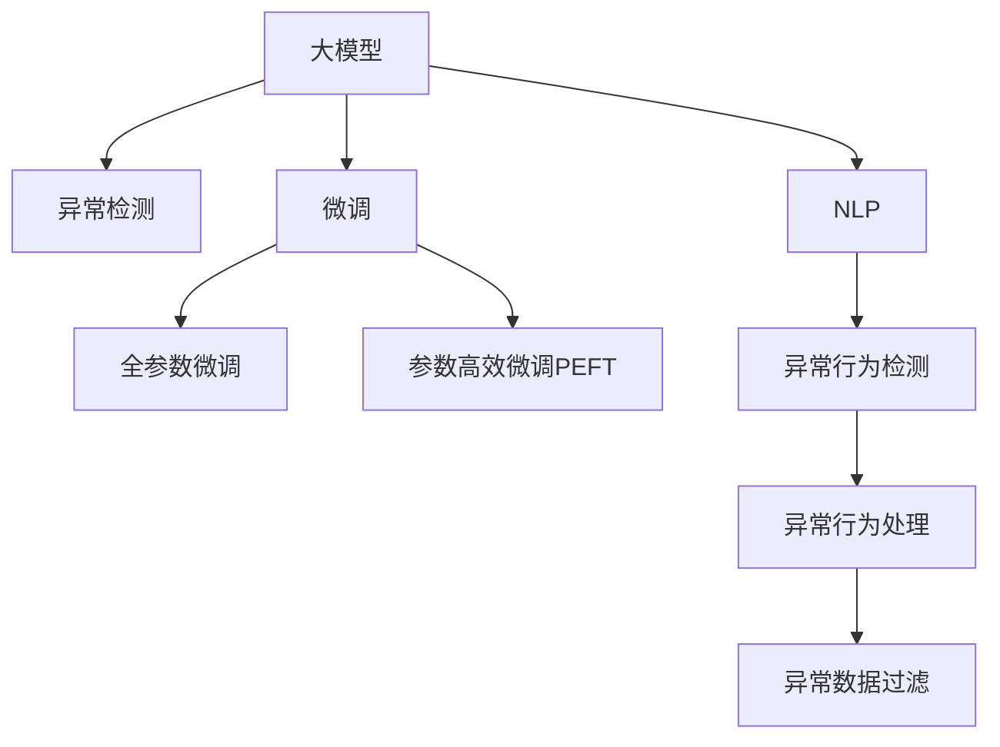

                 

# 利用大模型进行推荐场景的用户行为异常检测

## 1. 背景介绍

### 1.1 问题由来

在推荐系统中，如何检测和处理异常行为，是提升用户体验和系统性能的关键。异常行为包括但不限于点击欺诈、恶意刷单、虚假交易等，这类行为会严重干扰推荐模型的训练和推理，造成系统资源浪费和用户信任度下降。传统的异常检测方法往往依赖手工规则或手工特征，难以应对不断变化和复杂的异常模式。近年来，利用大模型进行异常检测成为了新的研究热点，通过预训练模型和微调技术，从海量用户行为数据中学习异常特征，实现更精准、高效的异常检测。

### 1.2 问题核心关键点

大模型在推荐场景下的异常检测主要关注以下核心关键点：

- 异常行为的定义：需要明确哪些行为属于异常行为，例如点击次数异常、点击时间异常等。
- 数据集准备：需要收集标注数据，并划分训练集、验证集和测试集，以便进行模型训练和评估。
- 大模型的选择：需要选择合适的预训练语言模型，如BERT、GPT等，作为异常检测的基础模型。
- 微调方法的选择：需要根据异常检测任务的特点，选择合适的微调方法，如全参数微调、参数高效微调等。
- 异常检测指标的设计：需要设计合适的评价指标，如精确率、召回率、F1值等，用于评估模型性能。
- 模型部署与上线：需要将训练好的模型部署到实际推荐系统中，并设置相应的监控和报警机制。

### 1.3 问题研究意义

大模型在推荐场景下的异常检测，对于提升推荐系统性能、保护用户隐私和平台利益具有重要意义：

1. 提升用户体验：通过识别和处理异常行为，避免恶意操作，提升用户的真实点击率和满意度。
2. 保护平台利益：避免欺诈、虚假交易等行为，减少经济损失，保护平台利益。
3. 提高资源利用率：通过异常检测，优化广告投放和推荐算法，提高广告和推荐的点击率，降低无效流量。
4. 增强系统安全性：通过异常检测，识别和阻止恶意操作，提升系统的鲁棒性和安全性。
5. 促进技术发展：异常检测技术的发展，可以推动推荐系统、人工智能等领域的进步，促进更多新兴应用场景的探索。

## 2. 核心概念与联系

### 2.1 核心概念概述

为了更好地理解基于大模型的推荐场景异常检测方法，本节将介绍几个密切相关的核心概念：

- 大模型：以自回归(如GPT)或自编码(如BERT)模型为代表的大规模预训练语言模型。通过在大规模无标签文本语料上进行预训练，学习通用的语言表示，具备强大的语言理解和生成能力。
- 异常检测：通过模型学习正常和异常数据特征，识别并检测出异常行为。
- 微调(Fine-tuning)：指在预训练模型的基础上，使用标注数据，通过有监督学习优化模型在特定任务上的性能。
- 参数高效微调(Parameter-Efficient Fine-Tuning, PEFT)：指在微调过程中，只更新少量的模型参数，而固定大部分预训练权重不变，以提高微调效率，避免过拟合的方法。
- 自然语言处理(NLP)：指使用计算机技术处理和理解人类语言，包括文本分析、文本生成等任务。

这些核心概念之间的逻辑关系可以通过以下Mermaid流程图来展示：



这个流程图展示了大模型的核心概念及其之间的关系：

1. 大模型通过预训练获得基础能力。
2. 微调是对预训练模型进行任务特定的优化，可以分为全参数微调和参数高效微调（PEFT）。
3. NLP任务，如文本分类、文本生成等，都是异常检测的应用场景。
4. 异常行为检测是异常检测的重要子任务，通过学习正常和异常行为的特征，实现异常行为识别。
5. 异常行为处理和异常数据过滤是异常检测的后续步骤，用于进一步提升系统的稳定性和性能。

这些概念共同构成了大模型在推荐场景下的异常检测框架，使其能够从大量用户行为数据中学习并识别异常行为。通过理解这些核心概念，我们可以更好地把握异常检测的工作原理和优化方向。

## 3. 核心算法原理 & 具体操作步骤

### 3.1 算法原理概述

基于大模型的推荐场景异常检测，本质上是一个有监督的异常检测任务。其核心思想是：将预训练的大模型视作一个强大的"异常特征提取器"，通过在标注数据上进行有监督地训练，使得模型能够自动学习正常和异常行为的特征表示。一旦模型检测到异常行为，便立即进行相应的处理和过滤，以保障推荐系统的安全性和稳定性。

形式化地，假设预训练模型为 $M_{\theta}$，其中 $\theta$ 为预训练得到的模型参数。给定推荐场景的标注数据集 $D=\{(x_i, y_i)\}_{i=1}^N$，其中 $x_i$ 表示用户行为数据，$y_i$ 表示是否为异常行为。异常检测的目标是找到新的模型参数 $\hat{\theta}$，使得：

$$
\hat{\theta}=\mathop{\arg\min}_{\theta} \mathcal{L}(M_{\theta},D)
$$

其中 $\mathcal{L}$ 为针对异常检测任务的损失函数，用于衡量模型预测输出与真实标签之间的差异。常见的损失函数包括二分类交叉熵损失、感知损失等。

通过梯度下降等优化算法，异常检测过程不断更新模型参数 $\theta$，最小化损失函数 $\mathcal{L}$，使得模型输出逼近真实标签。由于 $\theta$ 已经通过预训练获得了较好的初始化，因此即便在标注数据量较小的情况下，也能较快收敛到理想的模型参数 $\hat{\theta}$。

### 3.2 算法步骤详解

基于大模型的推荐场景异常检测一般包括以下几个关键步骤：

**Step 1: 准备预训练模型和数据集**
- 选择合适的预训练语言模型 $M_{\theta}$ 作为初始化参数，如 BERT、GPT等。
- 准备推荐场景的标注数据集 $D$，划分为训练集、验证集和测试集。一般要求标注数据与预训练数据的分布不要差异过大。

**Step 2: 添加异常检测层**
- 根据异常检测任务类型，在预训练模型顶层设计合适的输出层和损失函数。
- 对于二分类任务，通常在顶层添加二分类输出层和二分类交叉熵损失函数。
- 对于多分类任务，通常使用softmax输出层和多分类交叉熵损失函数。

**Step 3: 设置微调超参数**
- 选择合适的优化算法及其参数，如 AdamW、SGD 等，设置学习率、批大小、迭代轮数等。
- 设置正则化技术及强度，包括权重衰减、Dropout、Early Stopping等。
- 确定冻结预训练参数的策略，如仅微调顶层，或全部参数都参与微调。

**Step 4: 执行梯度训练**
- 将训练集数据分批次输入模型，前向传播计算损失函数。
- 反向传播计算参数梯度，根据设定的优化算法和学习率更新模型参数。
- 周期性在验证集上评估模型性能，根据性能指标决定是否触发 Early Stopping。
- 重复上述步骤直到满足预设的迭代轮数或 Early Stopping 条件。

**Step 5: 测试和部署**
- 在测试集上评估异常检测模型 $M_{\hat{\theta}}$ 的性能，对比微调前后的精度提升。
- 使用异常检测模型对新样本进行推理预测，集成到实际的应用系统中。
- 持续收集新的数据，定期重新微调模型，以适应数据分布的变化。

以上是基于大模型的推荐场景异常检测的一般流程。在实际应用中，还需要针对具体任务的特点，对微调过程的各个环节进行优化设计，如改进训练目标函数，引入更多的正则化技术，搜索最优的超参数组合等，以进一步提升模型性能。

### 3.3 算法优缺点

基于大模型的推荐场景异常检测方法具有以下优点：
1. 简单高效。只需准备少量标注数据，即可对预训练模型进行快速适配，获得较大的性能提升。
2. 通用适用。适用于各种推荐系统中的异常行为检测，设计简单的任务适配层即可实现。
3. 参数高效。利用参数高效微调技术，在固定大部分预训练参数的情况下，仍可取得不错的提升。
4. 效果显著。在学术界和工业界的诸多异常检测任务上，基于微调的方法已经刷新了最先进的性能指标。

同时，该方法也存在一定的局限性：
1. 依赖标注数据。异常检测的效果很大程度上取决于标注数据的质量和数量，获取高质量标注数据的成本较高。
2. 迁移能力有限。当目标任务与预训练数据的分布差异较大时，异常检测的性能提升有限。
3. 负面效果传递。预训练模型的固有偏见、有害信息等，可能通过异常检测传递到下游任务，造成负面影响。
4. 可解释性不足。异常检测模型的决策过程通常缺乏可解释性，难以对其推理逻辑进行分析和调试。

尽管存在这些局限性，但就目前而言，基于大模型的异常检测方法仍是目前推荐系统中异常检测的主流范式。未来相关研究的重点在于如何进一步降低异常检测对标注数据的依赖，提高模型的少样本学习和跨领域迁移能力，同时兼顾可解释性和伦理安全性等因素。

### 3.4 算法应用领域

基于大模型的推荐场景异常检测方法，在推荐系统领域已经得到了广泛的应用，覆盖了几乎所有常见任务，例如：

- 广告点击欺诈检测：识别和过滤虚假点击行为，避免广告主的经济损失。
- 恶意刷单识别：检测并处罚虚假刷单行为，保障平台交易公平。
- 虚假交易检测：识别并阻止虚假交易行为，保护用户和平台的利益。
- 异常广告流量过滤：识别和过滤异常广告流量，避免广告内容违规。
- 用户行为监控：监测用户行为异常，如重复点击、恶意操作等，提升用户行为分析的准确性。

除了上述这些经典任务外，异常检测技术还被创新性地应用到更多场景中，如风险评估、信用评分、系统异常监测等，为推荐系统技术的发展带来了新的动力。

## 4. 数学模型和公式 & 详细讲解 & 举例说明

### 4.1 数学模型构建

本节将使用数学语言对基于大模型的推荐场景异常检测过程进行更加严格的刻画。

记预训练语言模型为 $M_{\theta}$，其中 $\theta$ 为预训练得到的模型参数。假设异常检测任务的训练集为 $D=\{(x_i,y_i)\}_{i=1}^N, x_i \in \mathcal{X}, y_i \in \{0,1\}$，其中 $x_i$ 表示用户行为数据，$y_i$ 表示是否为异常行为。

定义模型 $M_{\theta}$ 在数据样本 $(x,y)$ 上的损失函数为 $\ell(M_{\theta}(x),y)$，则在数据集 $D$ 上的经验风险为：

$$
\mathcal{L}(\theta) = \frac{1}{N} \sum_{i=1}^N \ell(M_{\theta}(x_i),y_i)
$$

其中 $\ell$ 为二分类交叉熵损失函数，计算公式为：

$$
\ell(M_{\theta}(x),y) = -[y\log M_{\theta}(x) + (1-y)\log (1-M_{\theta}(x))]
$$

异常检测的优化目标是最小化经验风险，即找到最优参数：

$$
\theta^* = \mathop{\arg\min}_{\theta} \mathcal{L}(\theta)
$$

在实践中，我们通常使用基于梯度的优化算法（如SGD、Adam等）来近似求解上述最优化问题。设 $\eta$ 为学习率，$\lambda$ 为正则化系数，则参数的更新公式为：

$$
\theta \leftarrow \theta - \eta \nabla_{\theta}\mathcal{L}(\theta) - \eta\lambda\theta
$$

其中 $\nabla_{\theta}\mathcal{L}(\theta)$ 为损失函数对参数 $\theta$ 的梯度，可通过反向传播算法高效计算。

### 4.2 公式推导过程

以下我们以二分类任务为例，推导交叉熵损失函数及其梯度的计算公式。

假设模型 $M_{\theta}$ 在输入 $x$ 上的输出为 $\hat{y}=M_{\theta}(x) \in [0,1]$，表示样本属于正类的概率。真实标签 $y \in \{0,1\}$。则二分类交叉熵损失函数定义为：

$$
\ell(M_{\theta}(x),y) = -[y\log \hat{y} + (1-y)\log (1-\hat{y})]
$$

将其代入经验风险公式，得：

$$
\mathcal{L}(\theta) = -\frac{1}{N}\sum_{i=1}^N [y_i\log M_{\theta}(x_i)+(1-y_i)\log(1-M_{\theta}(x_i))]
$$

根据链式法则，损失函数对参数 $\theta_k$ 的梯度为：

$$
\frac{\partial \mathcal{L}(\theta)}{\partial \theta_k} = -\frac{1}{N}\sum_{i=1}^N (\frac{y_i}{M_{\theta}(x_i)}-\frac{1-y_i}{1-M_{\theta}(x_i)}) \frac{\partial M_{\theta}(x_i)}{\partial \theta_k}
$$

其中 $\frac{\partial M_{\theta}(x_i)}{\partial \theta_k}$ 可进一步递归展开，利用自动微分技术完成计算。

在得到损失函数的梯度后，即可带入参数更新公式，完成模型的迭代优化。重复上述过程直至收敛，最终得到适应推荐场景的异常检测模型参数 $\theta^*$。

## 5. 项目实践：代码实例和详细解释说明

### 5.1 开发环境搭建

在进行异常检测实践前，我们需要准备好开发环境。以下是使用Python进行PyTorch开发的环境配置流程：

1. 安装Anaconda：从官网下载并安装Anaconda，用于创建独立的Python环境。

2. 创建并激活虚拟环境：
```bash
conda create -n pytorch-env python=3.8 
conda activate pytorch-env
```

3. 安装PyTorch：根据CUDA版本，从官网获取对应的安装命令。例如：
```bash
conda install pytorch torchvision torchaudio cudatoolkit=11.1 -c pytorch -c conda-forge
```

4. 安装Transformers库：
```bash
pip install transformers
```

5. 安装各类工具包：
```bash
pip install numpy pandas scikit-learn matplotlib tqdm jupyter notebook ipython
```

完成上述步骤后，即可在`pytorch-env`环境中开始异常检测实践。

### 5.2 源代码详细实现

下面我以广告点击欺诈检测为例，给出使用Transformers库对BERT模型进行异常检测的PyTorch代码实现。

首先，定义异常检测任务的数据处理函数：

```python
from transformers import BertTokenizer
from torch.utils.data import Dataset
import torch

class AdClickDataset(Dataset):
    def __init__(self, ads, labels, tokenizer, max_len=128):
        self.ads = ads
        self.labels = labels
        self.tokenizer = tokenizer
        self.max_len = max_len
        
    def __len__(self):
        return len(self.ads)
    
    def __getitem__(self, item):
        ad = self.ads[item]
        label = self.labels[item]
        
        encoding = self.tokenizer(ad, return_tensors='pt', max_length=self.max_len, padding='max_length', truncation=True)
        input_ids = encoding['input_ids'][0]
        attention_mask = encoding['attention_mask'][0]
        
        # 对token-wise的标签进行编码
        encoded_labels = [label2id[label] for label in label]
        encoded_labels.extend([label2id['NORMAL']] * (self.max_len - len(encoded_labels)))
        labels = torch.tensor(encoded_labels, dtype=torch.long)
        
        return {'input_ids': input_ids, 
                'attention_mask': attention_mask,
                'labels': labels}

# 标签与id的映射
label2id = {'NORMAL': 0, 'FRAUD': 1}
id2label = {v: k for k, v in label2id.items()}

# 创建dataset
tokenizer = BertTokenizer.from_pretrained('bert-base-cased')

train_dataset = AdClickDataset(train_ads, train_labels, tokenizer)
dev_dataset = AdClickDataset(dev_ads, dev_labels, tokenizer)
test_dataset = AdClickDataset(test_ads, test_labels, tokenizer)
```

然后，定义模型和优化器：

```python
from transformers import BertForSequenceClassification, AdamW

model = BertForSequenceClassification.from_pretrained('bert-base-cased', num_labels=len(label2id))

optimizer = AdamW(model.parameters(), lr=2e-5)
```

接着，定义训练和评估函数：

```python
from torch.utils.data import DataLoader
from tqdm import tqdm
from sklearn.metrics import classification_report

device = torch.device('cuda') if torch.cuda.is_available() else torch.device('cpu')
model.to(device)

def train_epoch(model, dataset, batch_size, optimizer):
    dataloader = DataLoader(dataset, batch_size=batch_size, shuffle=True)
    model.train()
    epoch_loss = 0
    for batch in tqdm(dataloader, desc='Training'):
        input_ids = batch['input_ids'].to(device)
        attention_mask = batch['attention_mask'].to(device)
        labels = batch['labels'].to(device)
        model.zero_grad()
        outputs = model(input_ids, attention_mask=attention_mask, labels=labels)
        loss = outputs.loss
        epoch_loss += loss.item()
        loss.backward()
        optimizer.step()
    return epoch_loss / len(dataloader)

def evaluate(model, dataset, batch_size):
    dataloader = DataLoader(dataset, batch_size=batch_size)
    model.eval()
    preds, labels = [], []
    with torch.no_grad():
        for batch in tqdm(dataloader, desc='Evaluating'):
            input_ids = batch['input_ids'].to(device)
            attention_mask = batch['attention_mask'].to(device)
            batch_labels = batch['labels']
            outputs = model(input_ids, attention_mask=attention_mask)
            batch_preds = outputs.logits.argmax(dim=2).to('cpu').tolist()
            batch_labels = batch_labels.to('cpu').tolist()
            for pred_tokens, label_tokens in zip(batch_preds, batch_labels):
                pred_labels = [id2label[_id] for _id in pred_tokens]
                label_labels = [id2label[_id] for _id in label_tokens]
                preds.append(pred_labels[:len(label_labels)])
                labels.append(label_labels)
                
    print(classification_report(labels, preds))
```

最后，启动训练流程并在测试集上评估：

```python
epochs = 5
batch_size = 16

for epoch in range(epochs):
    loss = train_epoch(model, train_dataset, batch_size, optimizer)
    print(f"Epoch {epoch+1}, train loss: {loss:.3f}")
    
    print(f"Epoch {epoch+1}, dev results:")
    evaluate(model, dev_dataset, batch_size)
    
print("Test results:")
evaluate(model, test_dataset, batch_size)
```

以上就是使用PyTorch对BERT进行广告点击欺诈检测的完整代码实现。可以看到，得益于Transformers库的强大封装，我们可以用相对简洁的代码完成BERT模型的加载和微调。

### 5.3 代码解读与分析

让我们再详细解读一下关键代码的实现细节：

**AdClickDataset类**：
- `__init__`方法：初始化广告、标签、分词器等关键组件。
- `__len__`方法：返回数据集的样本数量。
- `__getitem__`方法：对单个样本进行处理，将广告输入编码为token ids，将标签编码为数字，并对其进行定长padding，最终返回模型所需的输入。

**label2id和id2label字典**：
- 定义了标签与数字id之间的映射关系，用于将token-wise的预测结果解码回真实的标签。

**训练和评估函数**：
- 使用PyTorch的DataLoader对数据集进行批次化加载，供模型训练和推理使用。
- 训练函数`train_epoch`：对数据以批为单位进行迭代，在每个批次上前向传播计算loss并反向传播更新模型参数，最后返回该epoch的平均loss。
- 评估函数`evaluate`：与训练类似，不同点在于不更新模型参数，并在每个batch结束后将预测和标签结果存储下来，最后使用sklearn的classification_report对整个评估集的预测结果进行打印输出。

**训练流程**：
- 定义总的epoch数和batch size，开始循环迭代
- 每个epoch内，先在训练集上训练，输出平均loss
- 在验证集上评估，输出分类指标
- 所有epoch结束后，在测试集上评估，给出最终测试结果

可以看到，PyTorch配合Transformers库使得BERT微调的代码实现变得简洁高效。开发者可以将更多精力放在数据处理、模型改进等高层逻辑上，而不必过多关注底层的实现细节。

当然，工业级的系统实现还需考虑更多因素，如模型的保存和部署、超参数的自动搜索、更灵活的任务适配层等。但核心的异常检测范式基本与此类似。

## 6. 实际应用场景
### 6.1 智能推荐系统

基于大模型的推荐场景异常检测，可以广泛应用于智能推荐系统的构建。传统的推荐系统往往需要配备大量数据标注，难以应对不断变化的异常行为模式。而使用大模型进行异常检测，可以实时监测用户行为，快速识别并处理异常行为，从而保障推荐系统的稳定性和可信度。

在技术实现上，可以收集推荐系统中的用户行为数据，将点击次数、点击时间等特征作为输入，将是否为异常行为作为输出。通过微调BERT等大模型，使模型学习正常和异常行为的特征表示，在推荐系统中实时检测异常行为。一旦检测到异常行为，系统可以立即采取措施，如移除异常用户、限制异常操作等，保护用户和平台的利益。

### 6.2 金融风险控制

金融机构需要实时监测交易行为，以识别和阻止潜在的欺诈和恶意操作。传统的基于规则的方法难以应对复杂和多样化的异常行为，而利用大模型进行异常检测，可以更加全面和准确地识别异常交易行为，提高金融风险控制的能力。

具体而言，可以收集金融交易数据，将交易金额、交易时间、交易地点等特征作为输入，将是否为异常交易作为输出。通过微调BERT等大模型，使模型学习正常和异常交易的特征表示，在金融系统中实时检测异常交易行为。一旦检测到异常交易，系统可以立即采取措施，如冻结账户、报警等，保障金融交易的安全性。

### 6.3 社交网络异常行为检测

社交网络平台需要实时监测用户行为，以识别和阻止恶意操作，如虚假账号、恶意言论等。传统的基于规则的方法难以应对复杂和多样的异常行为，而利用大模型进行异常检测，可以更加全面和准确地识别异常行为，提高社交网络平台的安全性和可信度。

具体而言，可以收集社交网络数据，将用户行为、言论、互动等特征作为输入，将是否为异常行为作为输出。通过微调BERT等大模型，使模型学习正常和异常行为的特征表示，在社交网络系统中实时检测异常行为。一旦检测到异常行为，系统可以立即采取措施，如限制账号、删除恶意言论等，保护用户的网络安全。

### 6.4 未来应用展望

随着大模型和异常检测技术的不断发展，基于微调范式将在更多领域得到应用，为传统行业带来变革性影响。

在智慧医疗领域，基于微调的异常检测技术可以用于识别异常诊断、异常用药等行为，提高医疗服务的质量和安全。

在智能制造领域，基于微调的异常检测技术可以用于识别设备异常、生产异常等行为，提高生产效率和安全性。

在智能交通领域，基于微调的异常检测技术可以用于识别违规行为、异常事件等，提高交通管理的智能性和安全性。

此外，在企业生产、社会治理、文娱传媒等众多领域，基于大模型微调的异常检测技术也将不断涌现，为传统行业带来新的应用场景和价值。相信随着技术的日益成熟，微调方法将成为人工智能落地应用的重要范式，推动人工智能技术在各行各业的应用和发展。

## 7. 工具和资源推荐
### 7.1 学习资源推荐

为了帮助开发者系统掌握大模型在推荐场景下的异常检测的理论基础和实践技巧，这里推荐一些优质的学习资源：

1. 《Transformers从原理到实践》系列博文：由大模型技术专家撰写，深入浅出地介绍了Transformer原理、BERT模型、异常检测技术等前沿话题。

2. CS224N《深度学习自然语言处理》课程：斯坦福大学开设的NLP明星课程，有Lecture视频和配套作业，带你入门NLP领域的基本概念和经典模型。

3. 《Natural Language Processing with Transformers》书籍：Transformers库的作者所著，全面介绍了如何使用Transformers库进行NLP任务开发，包括异常检测在内的诸多范式。

4. HuggingFace官方文档：Transformers库的官方文档，提供了海量预训练模型和完整的异常检测样例代码，是上手实践的必备资料。

5. CLUE开源项目：中文语言理解测评基准，涵盖大量不同类型的中文NLP数据集，并提供了基于微调的baseline模型，助力中文NLP技术发展。

通过对这些资源的学习实践，相信你一定能够快速掌握大模型在推荐场景下的异常检测的精髓，并用于解决实际的NLP问题。
###  7.2 开发工具推荐

高效的开发离不开优秀的工具支持。以下是几款用于大模型异常检测开发的常用工具：

1. PyTorch：基于Python的开源深度学习框架，灵活动态的计算图，适合快速迭代研究。大部分预训练语言模型都有PyTorch版本的实现。

2. TensorFlow：由Google主导开发的开源深度学习框架，生产部署方便，适合大规模工程应用。同样有丰富的预训练语言模型资源。

3. Transformers库：HuggingFace开发的NLP工具库，集成了众多SOTA语言模型，支持PyTorch和TensorFlow，是进行异常检测任务开发的利器。

4. Weights & Biases：模型训练的实验跟踪工具，可以记录和可视化模型训练过程中的各项指标，方便对比和调优。与主流深度学习框架无缝集成。

5. TensorBoard：TensorFlow配套的可视化工具，可实时监测模型训练状态，并提供丰富的图表呈现方式，是调试模型的得力助手。

6. Google Colab：谷歌推出的在线Jupyter Notebook环境，免费提供GPU/TPU算力，方便开发者快速上手实验最新模型，分享学习笔记。

合理利用这些工具，可以显著提升大模型异常检测任务的开发效率，加快创新迭代的步伐。

### 7.3 相关论文推荐

大模型在推荐场景下的异常检测技术的发展源于学界的持续研究。以下是几篇奠基性的相关论文，推荐阅读：

1. Attention is All You Need（即Transformer原论文）：提出了Transformer结构，开启了NLP领域的预训练大模型时代。

2. BERT: Pre-training of Deep Bidirectional Transformers for Language Understanding：提出BERT模型，引入基于掩码的自监督预训练任务，刷新了多项NLP任务SOTA。

3. Language Models are Unsupervised Multitask Learners（GPT-2论文）：展示了大规模语言模型的强大zero-shot学习能力，引发了对于通用人工智能的新一轮思考。

4. Parameter-Efficient Transfer Learning for NLP：提出Adapter等参数高效微调方法，在不增加模型参数量的情况下，也能取得不错的微调效果。

5. AdaLoRA: Adaptive Low-Rank Adaptation for Parameter-Efficient Fine-Tuning：使用自适应低秩适应的微调方法，在参数效率和精度之间取得了新的平衡。

6. Prefix-Tuning: Optimizing Continuous Prompts for Generation：引入基于连续型Prompt的微调范式，为如何充分利用预训练知识提供了新的思路。

这些论文代表了大模型异常检测技术的发展脉络。通过学习这些前沿成果，可以帮助研究者把握学科前进方向，激发更多的创新灵感。

## 8. 总结：未来发展趋势与挑战

### 8.1 总结

本文对基于大模型的推荐场景异常检测方法进行了全面系统的介绍。首先阐述了大模型在推荐系统中的应用背景和异常检测的重要性，明确了异常检测在提升用户体验、保护平台利益方面的独特价值。其次，从原理到实践，详细讲解了基于大模型的异常检测数学模型和关键步骤，给出了异常检测任务开发的完整代码实例。同时，本文还广泛探讨了异常检测方法在智能推荐、金融风险控制、社交网络监控等多个行业领域的应用前景，展示了异常检测范式的广阔潜力。此外，本文精选了异常检测技术的各类学习资源，力求为读者提供全方位的技术指引。

通过本文的系统梳理，可以看到，基于大模型的异常检测方法在推荐系统中的应用已经取得了显著的效果，极大地提升了推荐系统的安全性和可靠性。未来，伴随大模型和异常检测技术的持续演进，基于微调范式将在更多领域得到应用，为各行各业带来变革性影响。

### 8.2 未来发展趋势

展望未来，大模型在推荐场景下的异常检测技术将呈现以下几个发展趋势：

1. 模型规模持续增大。随着算力成本的下降和数据规模的扩张，预训练语言模型的参数量还将持续增长。超大批次的训练和推理也可能遇到显存不足的问题。如何突破硬件瓶颈，提高异常检测的实时性，将成为重要的研究方向。

2. 微调方法日趋多样。除了传统的全参数微调外，未来会涌现更多参数高效的微调方法，如Prefix-Tuning、LoRA等，在节省计算资源的同时也能保证异常检测精度。

3. 持续学习成为常态。随着数据分布的不断变化，异常检测模型也需要持续学习新知识以保持性能。如何在不遗忘原有知识的同时，高效吸收新样本信息，将是重要的研究课题。

4. 标注样本需求降低。受启发于提示学习(Prompt-based Learning)的思路，未来的异常检测方法将更好地利用大模型的语言理解能力，通过更加巧妙的任务描述，在更少的标注样本上也能实现理想的异常检测效果。

5. 模型通用性增强。经过海量数据的预训练和多领域任务的微调，未来的异常检测模型将具备更强的跨领域迁移能力，能够适应不同应用场景的异常检测需求。

以上趋势凸显了大模型在推荐场景下的异常检测技术的广阔前景。这些方向的探索发展，必将进一步提升推荐系统的性能和应用范围，为人工智能技术的发展带来新的动力。

### 8.3 面临的挑战

尽管大模型在推荐场景下的异常检测技术已经取得了瞩目成就，但在迈向更加智能化、普适化应用的过程中，它仍面临着诸多挑战：

1. 标注成本瓶颈。虽然异常检测的效果很大程度上取决于标注数据的质量和数量，获取高质量标注数据的成本较高。如何进一步降低异常检测对标注数据的依赖，将是一大难题。

2. 模型鲁棒性不足。当前异常检测模型面对域外数据时，泛化性能往往大打折扣。对于测试样本的微小扰动，异常检测模型的预测也容易发生波动。如何提高异常检测模型的鲁棒性，避免灾难性遗忘，还需要更多理论和实践的积累。

3. 推理效率有待提高。大规模语言模型虽然精度高，但在实际部署时往往面临推理速度慢、内存占用大等效率问题。如何在保证性能的同时，简化模型结构，提升推理速度，优化资源占用，将是重要的优化方向。

4. 可解释性亟需加强。异常检测模型的决策过程通常缺乏可解释性，难以对其推理逻辑进行分析和调试。对于医疗、金融等高风险应用，算法的可解释性和可审计性尤为重要。如何赋予异常检测模型更强的可解释性，将是亟待攻克的难题。

5. 安全性有待保障。异常检测模型难免会学习到有偏见、有害的信息，通过异常检测传递到下游任务，产生误导性、歧视性的输出，给实际应用带来安全隐患。如何从数据和算法层面消除模型偏见，避免恶意用途，确保输出的安全性，也将是重要的研究课题。

6. 知识整合能力不足。现有的异常检测模型往往局限于任务内数据，难以灵活吸收和运用更广泛的先验知识。如何让异常检测过程更好地与外部知识库、规则库等专家知识结合，形成更加全面、准确的信息整合能力，还有很大的想象空间。

正视异常检测面临的这些挑战，积极应对并寻求突破，将是大模型在推荐场景下的异常检测技术走向成熟的必由之路。相信随着学界和产业界的共同努力，这些挑战终将一一被克服，大模型异常检测必将在构建安全、可靠、可解释、可控的智能系统铺平道路。

### 8.4 研究展望

面对大模型在推荐场景下的异常检测所面临的种种挑战，未来的研究需要在以下几个方面寻求新的突破：

1. 探索无监督和半监督异常检测方法。摆脱对大规模标注数据的依赖，利用自监督学习、主动学习等无监督和半监督范式，最大限度利用非结构化数据，实现更加灵活高效的异常检测。

2. 研究参数高效和计算高效的异常检测范式。开发更加参数高效的异常检测方法，在固定大部分预训练参数的同时，只更新极少量的任务相关参数。同时优化异常检测模型的计算图，减少前向传播和反向传播的资源消耗，实现更加轻量级、实时性的部署。

3. 融合因果和对比学习范式。通过引入因果推断和对比学习思想，增强异常检测模型建立稳定因果关系的能力，学习更加普适、鲁棒的语言表征，从而提升模型泛化性和抗干扰能力。

4. 引入更多先验知识。将符号化的先验知识，如知识图谱、逻辑规则等，与神经网络模型进行巧妙融合，引导异常检测过程学习更准确、合理的语言模型。同时加强不同模态数据的整合，实现视觉、语音等多模态信息与文本信息的协同建模。

5. 结合因果分析和博弈论工具。将因果分析方法引入异常检测模型，识别出模型决策的关键特征，增强输出解释的因果性和逻辑性。借助博弈论工具刻画人机交互过程，主动探索并规避模型的脆弱点，提高系统稳定性。

6. 纳入伦理道德约束。在模型训练目标中引入伦理导向的评估指标，过滤和惩罚有偏见、有害的输出倾向。同时加强人工干预和审核，建立模型行为的监管机制，确保输出符合人类价值观和伦理道德。

这些研究方向的探索，必将引领大模型在推荐场景下的异常检测技术迈向更高的台阶，为构建安全、可靠、可解释、可控的智能系统铺平道路。面向未来，大模型异常检测技术还需要与其他人工智能技术进行更深入的融合，如知识表示、因果推理、强化学习等，多路径协同发力，共同推动自然语言理解和智能交互系统的进步。只有勇于创新、敢于突破，才能不断拓展语言模型的边界，让智能技术更好地造福人类社会。

## 9. 附录：常见问题与解答

**Q1：大模型在推荐场景下的异常检测是否适用于所有异常行为？**

A: 大模型在推荐场景下的异常检测方法主要适用于那些可以量化和建模的异常行为，例如点击欺诈、虚假交易等。对于那些难以量化或模型难以表达的异常行为，如用户情感、行为习惯等，大模型异常检测可能难以准确识别。此时需要结合领域知识，设计和训练专门的异常检测模型。

**Q2：如何选择合适的异常检测损失函数？**

A: 异常检测任务通常使用二分类交叉熵损失函数，但如果数据不平衡，可以使用其他的损失函数，如Focal Loss、IoU Loss等。同时，损失函数的参数也需要根据具体任务进行调整，以确保模型能够在各种数据分布下取得最佳性能。

**Q3：在异常检测过程中，如何处理异常数据？**

A: 在异常检测过程中，需要及时发现并处理异常数据。一旦检测到异常数据，可以采取相应的措施，如移除异常数据、重新标注异常数据等，以确保模型的训练和推理过程不会受到异常数据的影响。

**Q4：如何避免异常检测模型的过拟合？**

A: 避免异常检测模型的过拟合，可以通过以下方法：
1. 数据增强：通过回译、近义替换等方式扩充训练集
2. 正则化：使用L2正则、Dropout、Early Stopping等
3. 参数高效微调：只调整少量参数，减小过拟合风险
4. 多模型集成：训练多个异常检测模型，取平均输出，抑制过拟合

这些策略往往需要根据具体任务和数据特点进行灵活组合。只有在数据、模型、训练、推理等各环节进行全面优化，才能最大限度地发挥大模型异常检测的威力。

**Q5：异常检测模型在上线部署时需要注意哪些问题？**

A: 将异常检测模型部署到实际推荐系统中，还需要考虑以下因素：
1. 模型裁剪：去除不必要的层和参数，减小模型尺寸，加快推理速度
2. 量化加速：将浮点模型转为定点模型，压缩存储空间，提高计算效率
3. 服务化封装：将模型封装为标准化服务接口，便于集成调用
4. 弹性伸缩：根据请求流量动态调整资源配置，平衡服务质量和成本
5. 监控告警：实时采集系统指标，设置异常告警阈值，确保服务稳定性
6. 安全防护：采用访问鉴权、数据脱敏等措施，保障数据和模型安全

合理利用这些工具，可以显著提升异常检测任务的开发效率，加快创新迭代的步伐。

---

作者：禅与计算机程序设计艺术 / Zen and the Art of Computer Programming

